# State Estimation 

## **Design of Autonomous Systems**
### csci 6907/4907-Section 86
### Prof. **Sibin Mohan**

---

consider a robot in a simple grid

---

consider a robot in a simple grid

starting at $(0,0)$

---

consider a robot in a simple grid

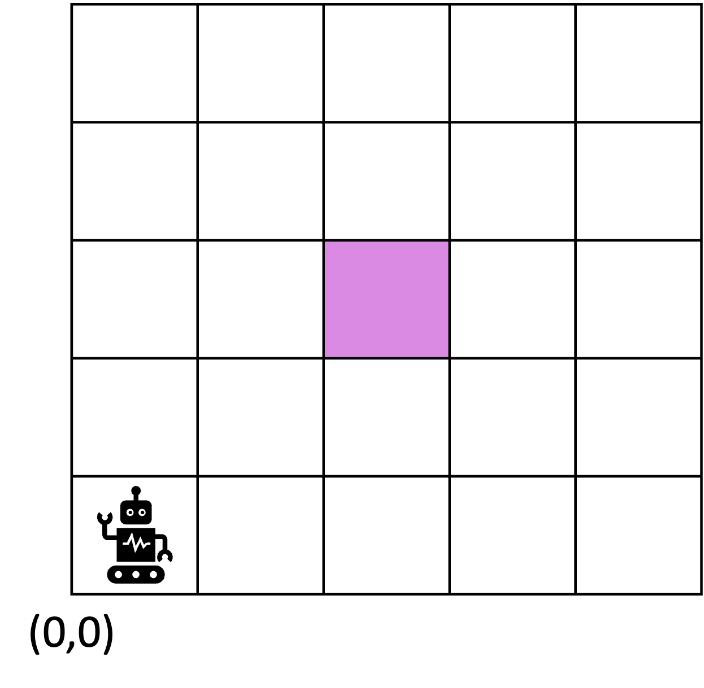

starting at $(0,0)$ &rarr; heading towards $(2,2)$

---

robot can take multiple paths to get to its destination

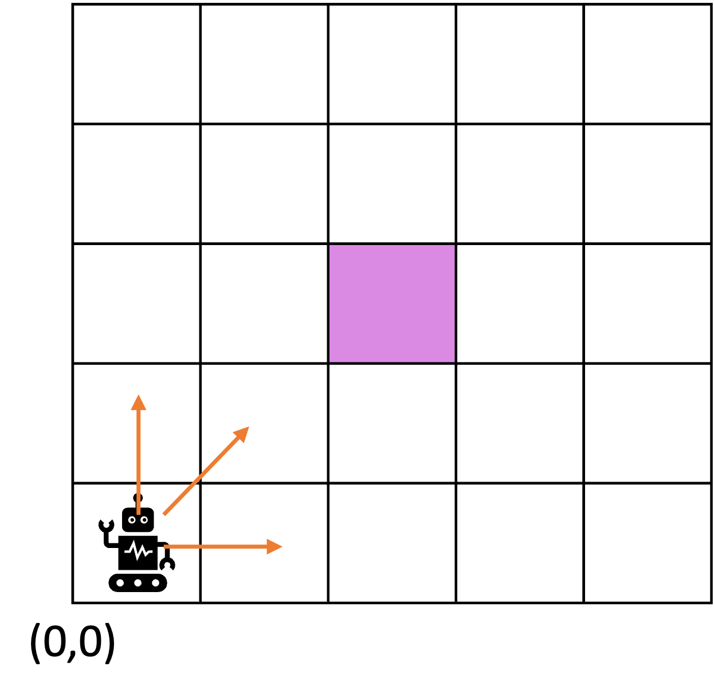

---

assume that it follows one of these paths and ends up at:

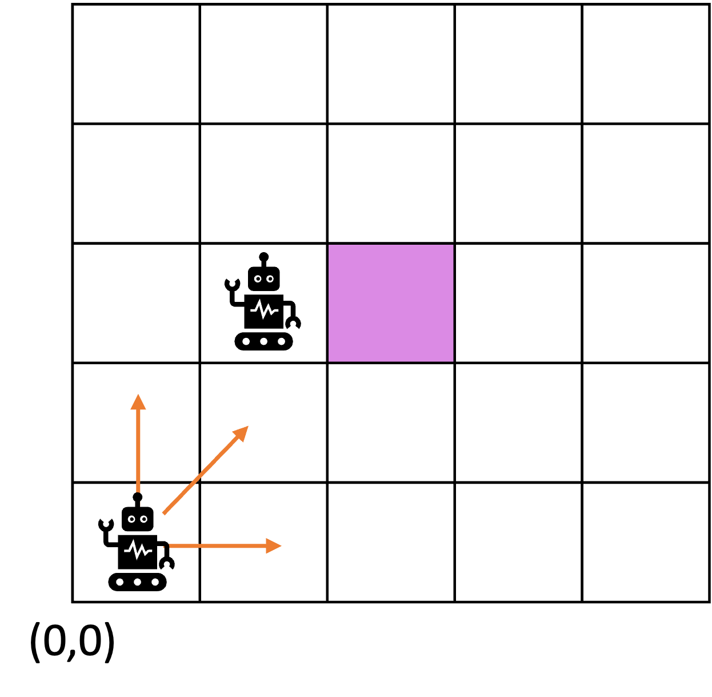

---

assume that it follows one of these paths and ends up at:

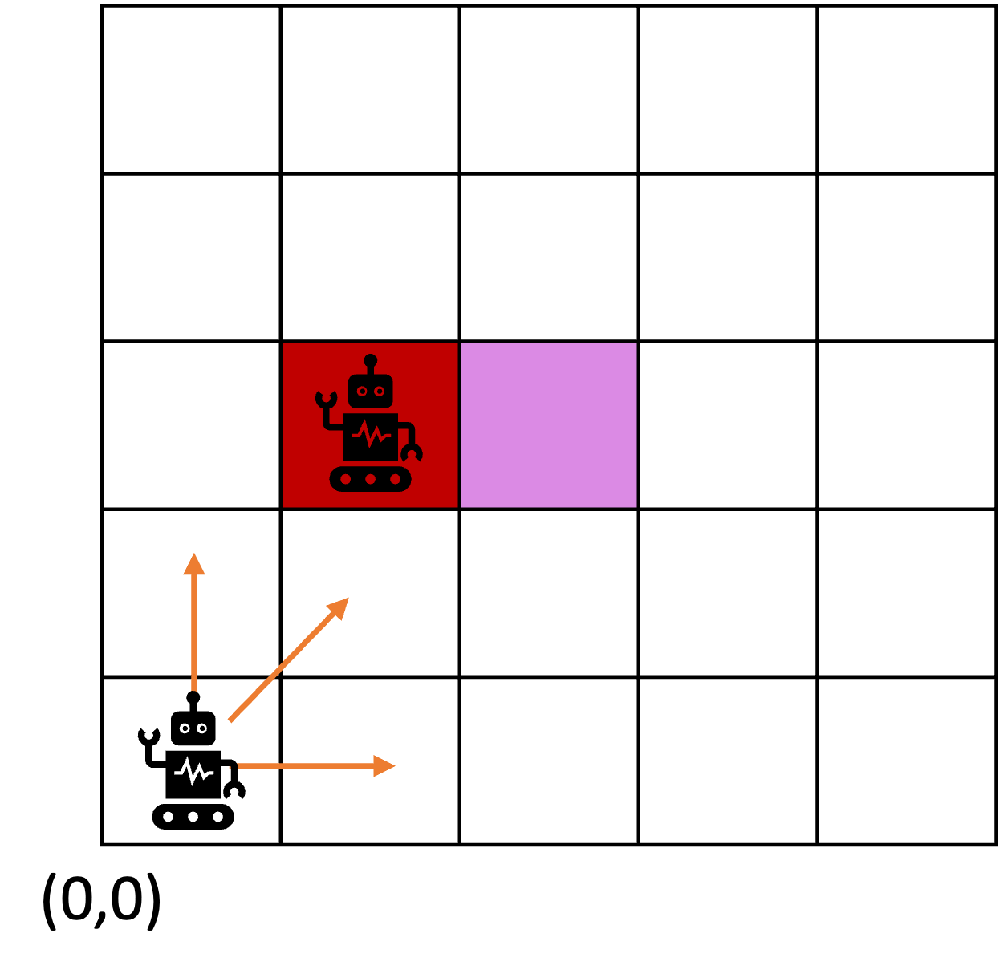

clearly this is not the intended goal!

---

what now?

---

what now?

1. robot &rarr; understand and estimate where it is _right now_ 
    - _i.e.,_ **estimate its current state**

---

what now?

1. robot &rarr; understand and estimate where it is _right now_ 
    - _i.e.,_ **estimate its current state**
2. robot &rarr; make a **decision**
    - based on its current state &rarr; where to head **next**

---

how?

---

how?

### **[state estimation](#state-estimation)**

---

but first &rarr; _how did we end up here in spite of onboard sensors?_

---

but first &rarr; _how did we end up here in spite of onboard sensors?_

sensor gave us a value, $x_k$

---

sensor gave us a value, $x_k$

- we can't trust it as is

---

sensor gave us a value, $x_k$

- we can't trust it as is
- sensors are **imperfect**

---

sensors are **imperfect** 

- physical limitations

---

sensors are **imperfect** 

- physical limitations
- measurement noise

---

sensors are **imperfect** 

- physical limitations
- measurement noise
- poor calibrations, etc.

---

sensors are **imperfect** 

- physical limitations
- measurement noise
- poor calibrations, etc.
- errors can’t be zero

---

sensors are **imperfect** 

- physical limitations
- measurement noise
- poor calibrations, etc.
- errors can’t be zero
    - $error = observation\ –\ true value$

---

"**filter**" out noisy data &rarr; only allow correct data to guide us

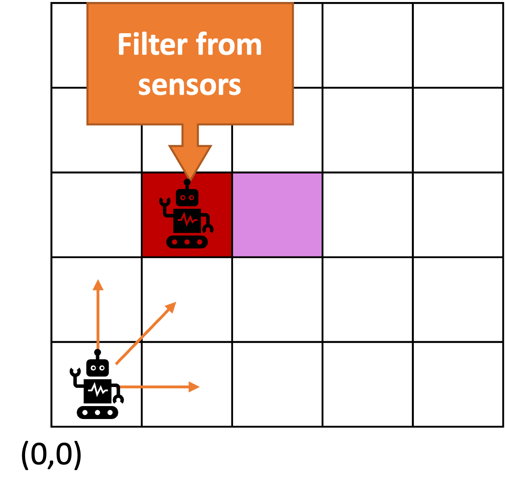

---

"**filter**" out noisy data &rarr; only allow correct data to guide us

our robot &rarr; pick the right direction to its _correct_ destination

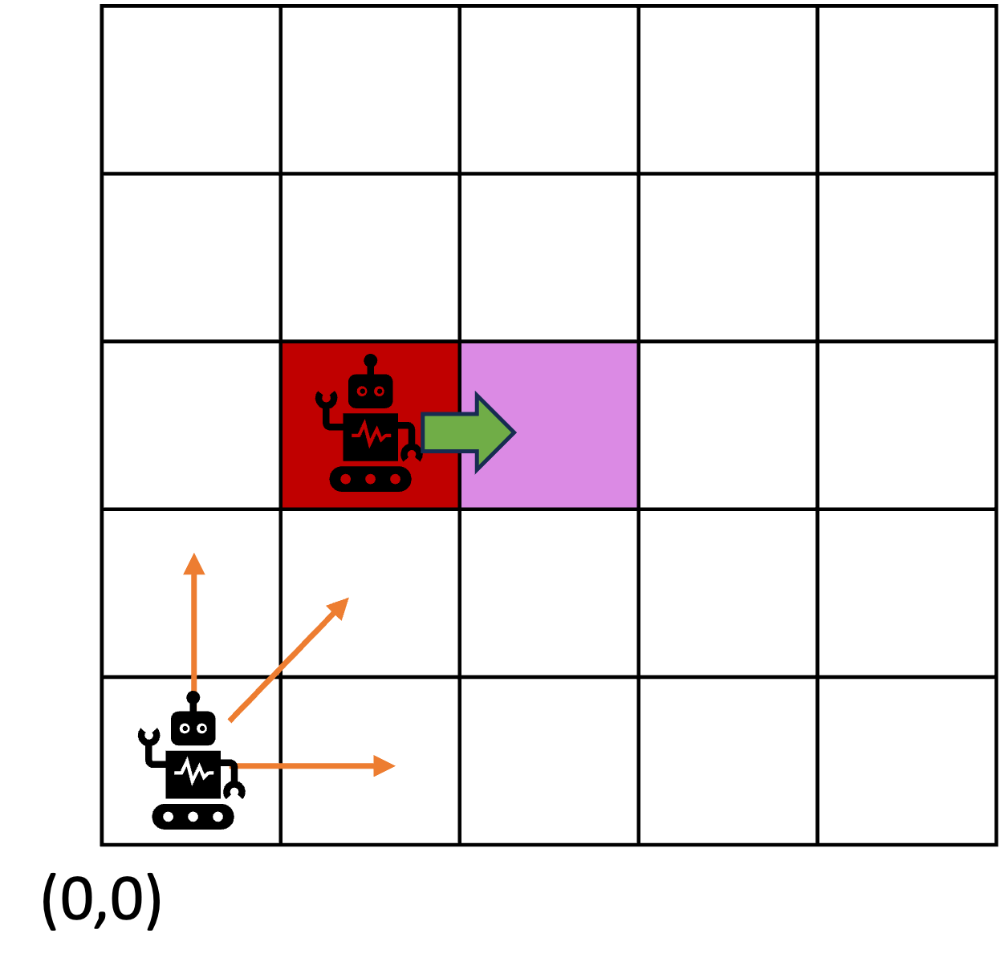

---

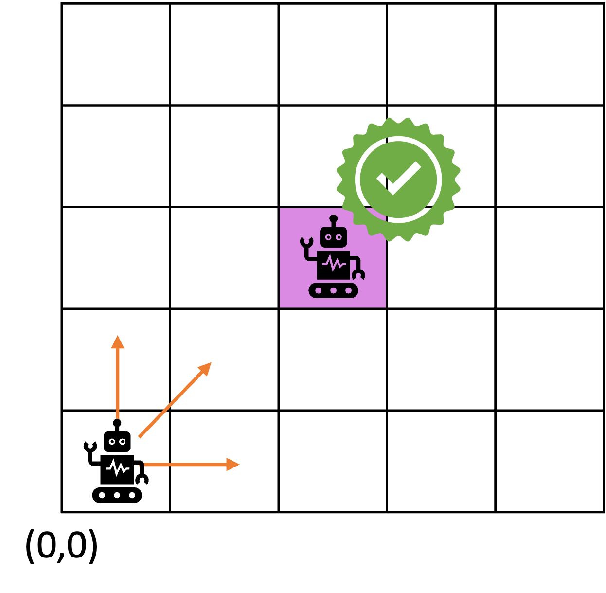

---

## State Estimation

a **fundamental problem** in control theory, robotics and signal processing 

---

## State Estimation

determining **state of dynamic system** 

from **noisy/incomplete measurements**

---

in context of dynamic systems, "**state**",

> a set of variables that completely describe the system at a given time 

---

| **system** | **state variables** |
|------------|----------------------|
| **moving vehicle** | position, velocity, acceleration |
| **pendulum** | angle, angular velocity |
| **financial system** | asset prices, market indicators |
||

---

### state &rarr; **evolves over time** 

---

### state &rarr; **evolves over time** 

- according to system dynamics

---

### state &rarr; **evolves over time** 

- according to system dynamics
- described by a **state transition model**

---

### How to Estimate State?

---

### How to Estimate State?

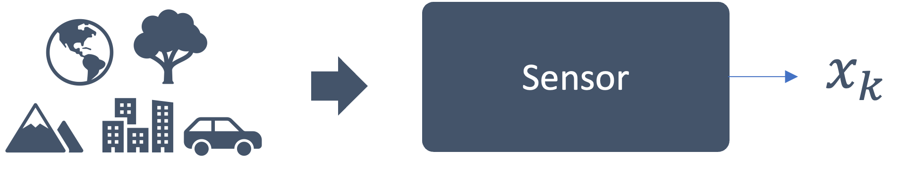

---

### How to Estimate State?

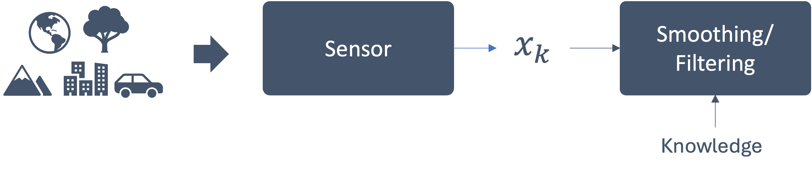

---

### How to Estimate State?

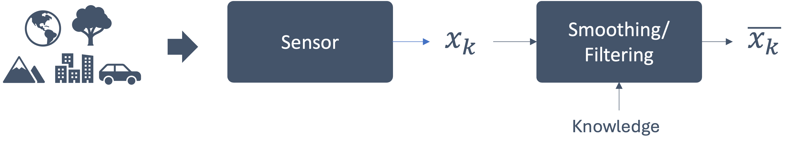

---

### How to Estimate State?

let's look at some data:

---

<!-- .slide: data-background="white" -->

### How to Estimate State?

let's look at some data:

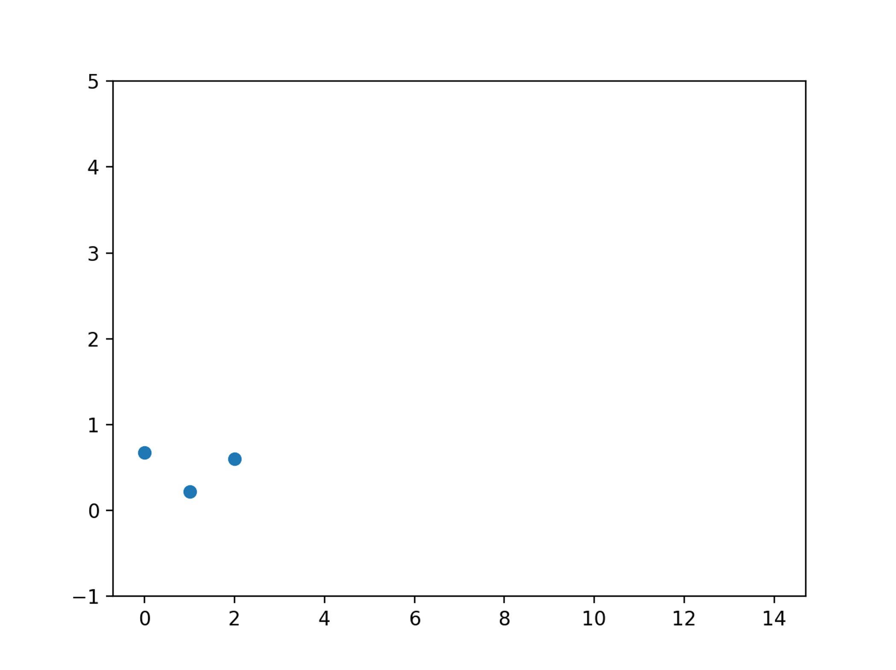

---

<!-- .slide: data-background="white" -->

### How to Estimate State?

from sensor reading ($x_k$) &rarr; how to generate state _estimate_, $\overline{x_k}$?

---

<!-- .slide: data-background="white" -->

what if we have a few more values?

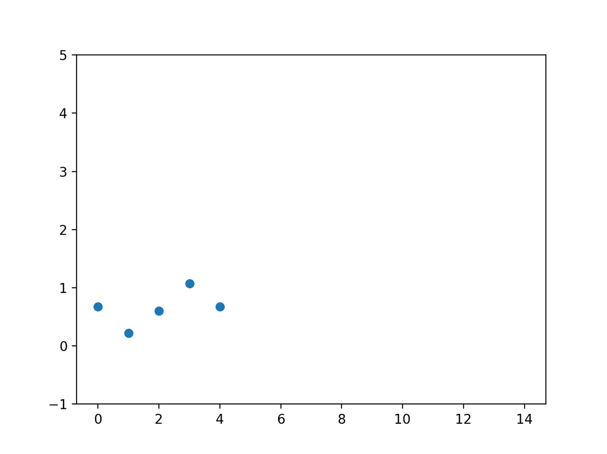

---

<!-- .slide: data-background="white" -->

what if we have a few more values?

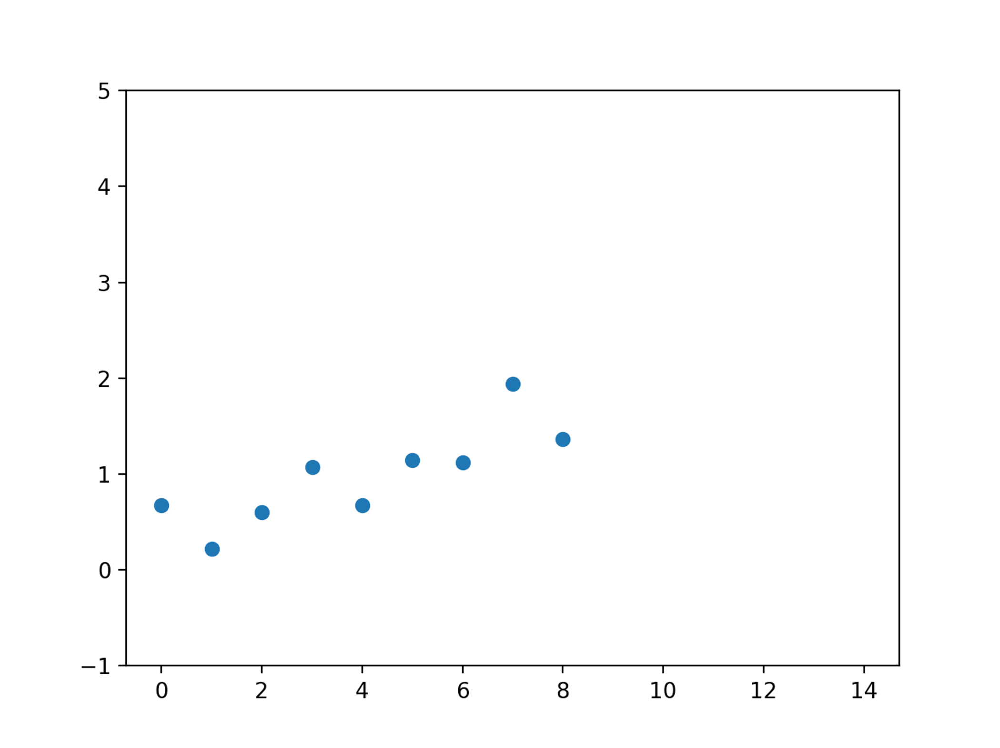

---

<!-- .slide: data-background="white" -->

do we see a trend? What if we had many more values?

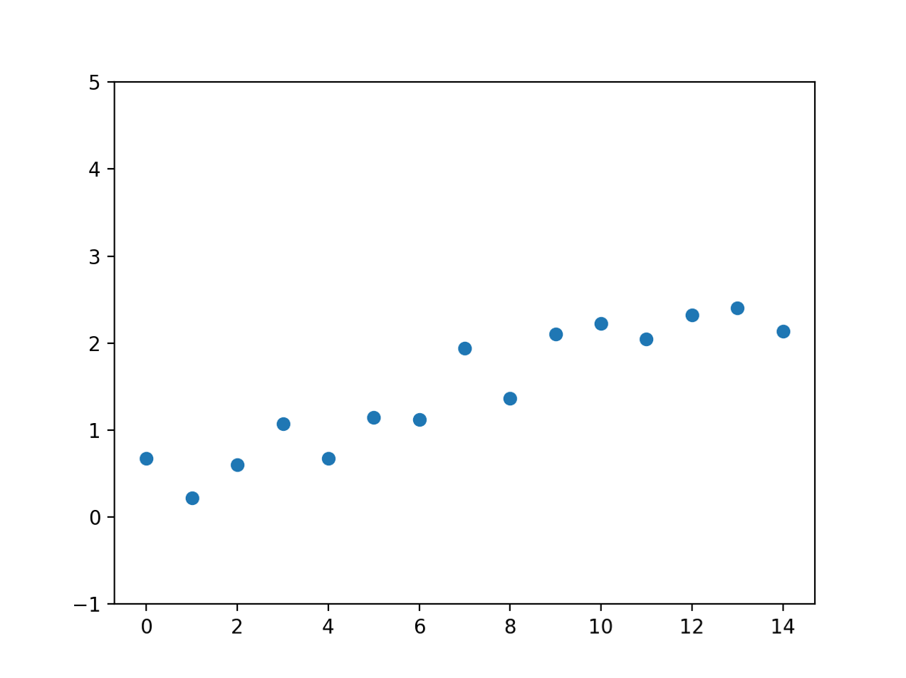

---

best way to capture behavior? 

---

<!-- .slide: data-background="white" -->

best way to capture behavior? 

data is "noisy" &rarr; doesn't follow an "exact" trend

---

Remember that $\overline{x_k}$ is the estimate we want:

---

one way to compute $\overline{x_k}$ &rarr; **average** 

---

one way to compute $\overline{x_k}$ &rarr; **average** 

of a **running window of samples**

---

### moving average (MA)

---

why "window" and not all the samples? 

---

we may only care about most recent <scb>n</scb> values 

Note:

anything older and it may not be directly applicable to our current situation.

---

compute **moving average** as follows:

$$
\overline{x_{k}}=\frac{x_{k-n-1}+\cdots+x_{k-1}+x_{k}}{n}
$$

---
compute **moving average** as follows:

$$
\overline{x_{k}}=\frac{x_{k-n-1}+\cdots+x_{k-1}+x_{k}}{n}
$$

 

where $n$ &rarr; **window size**

---

consider following data:

| $k$ | $x_k$ |
| --- | --- | 
| 0 | 0.08187 |
| 1 | 0.97601 |
| 2 | 1.18350 |

---

using the MA method ($n=3$),

| $k$ | $x_k$ | $\overline{x_{k}}$ |
| --- | --- | --- |
| 0 | 0.08187 | 0.08187 |
| 1 | 0.97601 | 0.52894 |
| 2 | 1.18350 | 0.74713 |

---

<!-- .slide: data-background="white" -->

using the MA method ($n=3$),

| $k$ | $x_k$ | $\overline{x_{k}}$ |
| --- | --- | --- |
| 0 | 0.08187 | 0.08187 |
| 1 | 0.97601 | 0.52894 |
| 2 | 1.18350 | 0.74713 |

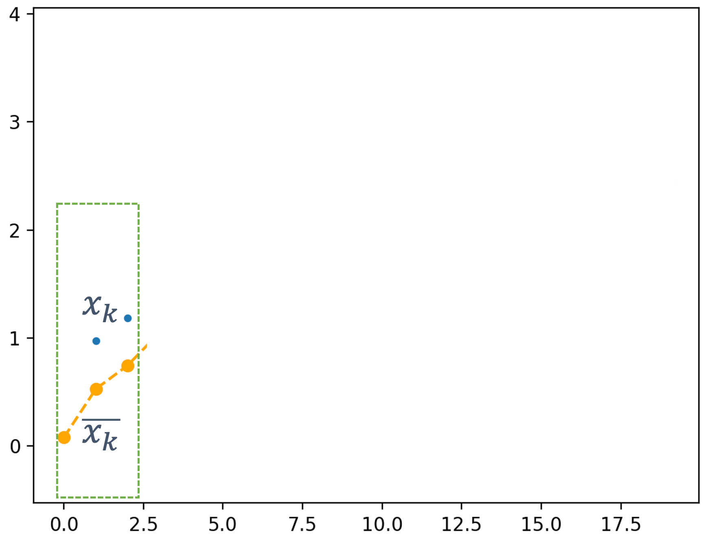

---

more values &rarr; window moves, aggregating groups of values:

| $k$ | $x_k$ | $\overline{x_{k}}$ |
| --- | --- | --- |
| 0 | 0.08187 | 0.08187 |
| 1 | 0.97601 | 0.52894 |
| 2 | 1.18350 | 0.74713 |
| 3 | 0.99502 | 1.05151 |

---

<!-- .slide: data-background="white" -->

more values &rarr; window moves, aggregating groups of values:

| $k$ | $x_k$ | $\overline{x_{k}}$ |
| --- | --- | --- |
| 0 | 0.08187 | 0.08187 |
| 1 | 0.97601 | 0.52894 |
| 2 | 1.18350 | 0.74713 |
| 3 | 0.99502 | 1.05151 |

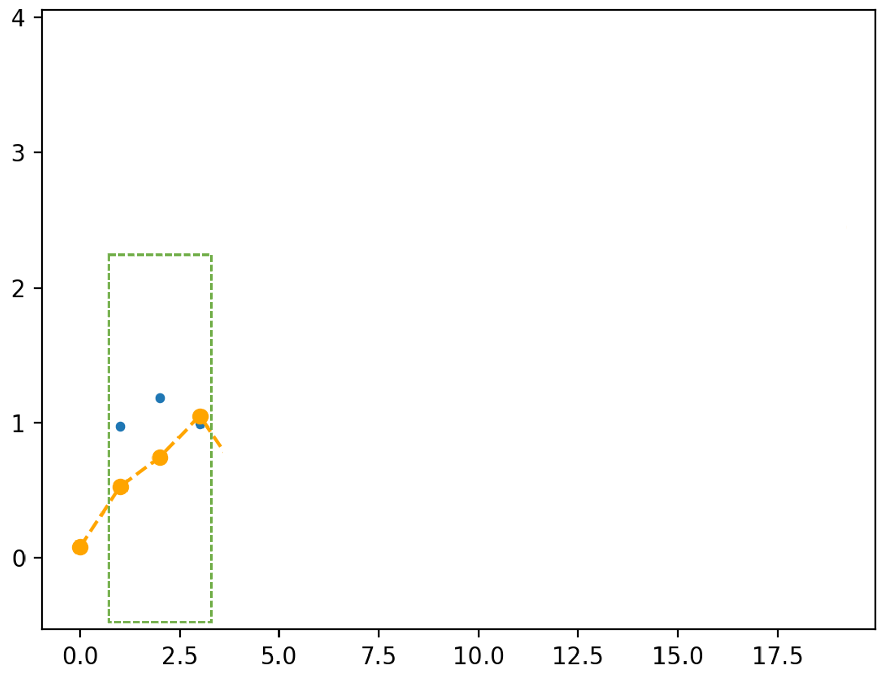

---

<!-- .slide: data-background="white" -->

| $k$ | $x_k$ | $\overline{x_{k}}$ |
| --- | --- | --- |
| 0 | 0.08187 | 0.08187 |
| 1 | 0.97601 | 0.52894 |
| 2 | 1.18350 | 0.74713 |
| 3 | 0.99502 | 1.05151 |
| 4 | -0.31375 | 0.62159 |
| 5 | -0.25739 | 0.14129 |
| 6 | 1.52112 | 0.31666 |

 

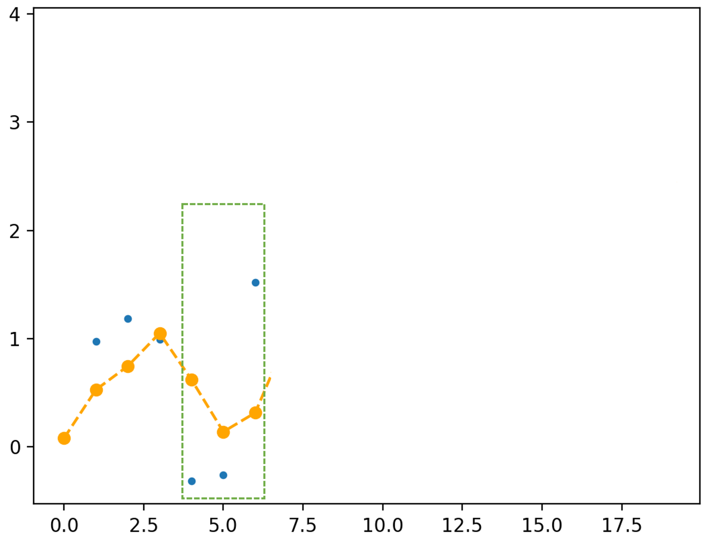

---

**estimate** &rarr; trying to **match** changes in original sensor readings 

---

<!-- .slide: data-background="white" -->

finally, we get:

| $k$ | $x_k$ | $\overline{x_{k}}$ |
| --- | --- | --- |
| 0 | 0.08187 | 0.08187 |
| 1 | 0.97601 | 0.52894 |
| 2 | 1.18350 | 0.74713 |
| 3 | 0.99502 | 1.05151 |
| 4 | -0.31375 | 0.62159 |
| 5 | -0.25739 | 0.14129 |
| 6 | 1.52112 | 0.31666 |
| 7 | 1.75454 | 1.00609 |
| 8 | 1.82412 | 1.69993 |
| 9 | 1.89229 | 1.82365 |
| 10 | 1.10513 | 1.60718 |
| 11 | 1.22321 | 1.40688 |
| 12 | 2.20793 | 1.51209 |
| 13 | 3.02390 | 2.15168 |
| 14 | 2.45511 | 2.56231 |
| 15 | 2.07442 | 2.51781 |
| 16 | 1.49280 | 2.00744 |
| 17 | 1.19093 | 1.58605 |
| 18 | 2.32653 | 1.67009 |
| 19 | 3.84177 | 2.45308 |

</small>

 
 

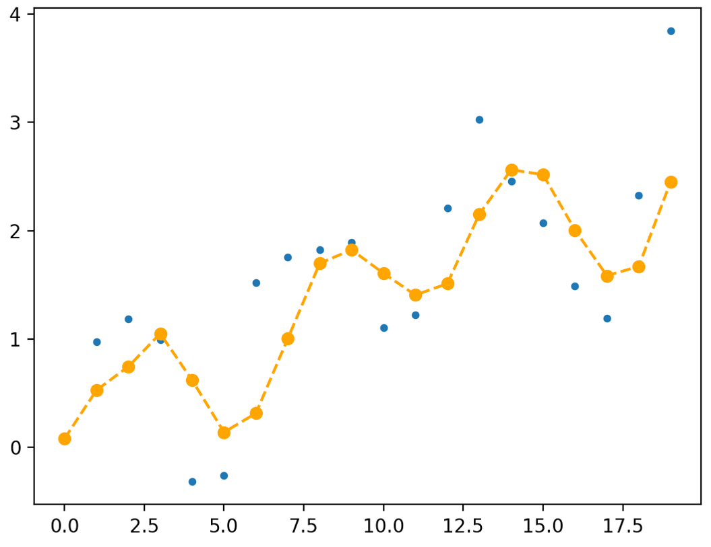

---

a good start, but let's consider a few changes...

---

<!-- .slide: data-background="white" -->

what happens with **changing** window size? 

consider $n=4$ or $n=9$ 

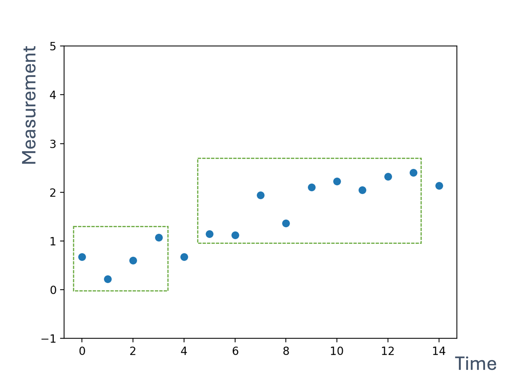

---

some **properties** &rarr; correlate with **larger window size**

|property | effect (larger $n$) |
|---------|--------|
| smoothening | more/less?|
| sensitivity (to changes) | more/less? |
||

Note:
- why do these matter?
- these properties can significantly affect the **response** for the system &rarr; whether it is jerky or sudden vs. a better, albeit slower, response. Also, the sensitivity tells us that the system doesn't respond easily to big changes in output, thus increasing inertia!

---

consider a few examples

---

<!-- .slide: data-background="white" -->

consider a few examples

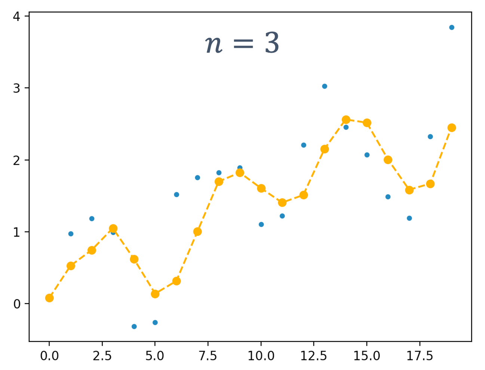

---

<!-- .slide: data-background="white" -->

consider a few examples

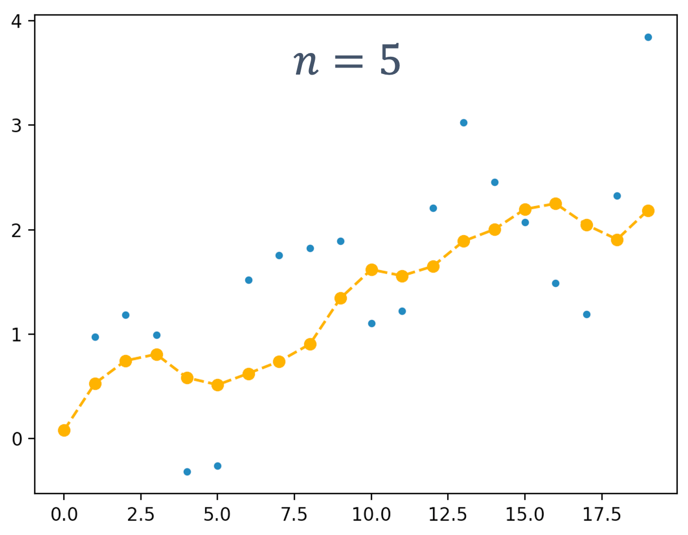

---

<!-- .slide: data-background="white" -->

consider a few examples

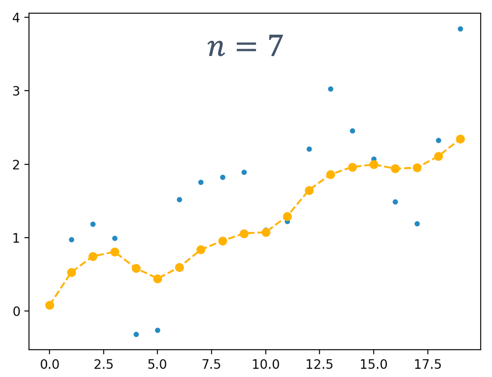

---

<!-- .slide: data-background="white" -->

consider a few examples

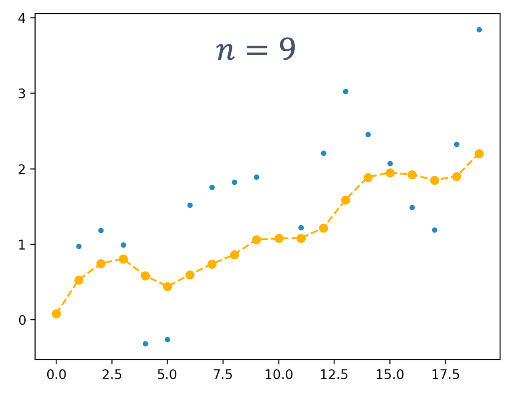

---

<!-- .slide: data-background="white" -->

consider a few examples

---

<!-- .slide: data-background="white" -->

|property | effect (larger $n$) |
|---------|--------|
| smoothening | more/less?|
| sensitivity (to changes) | more/less? |
||

---

<!-- .slide: data-background="white" -->

|property | effect (larger $n$) |
|---------|--------|
| smoothening | **more**|
| sensitivity (to changes) | more/less? |
||

---

<!-- .slide: data-background="white" -->

|property | effect (larger $n$) |
|---------|--------|
| smoothening | **more**|
| sensitivity (to changes) | **less** |
||

---

**delays** &rarr; window size affects how delayed the estimate is?

---

<!-- .slide: data-background="white" -->

**delays?**

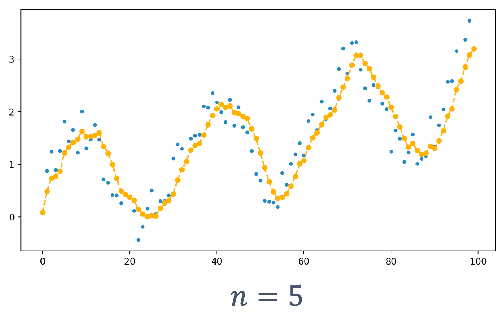

---

<!-- .slide: data-background="white" -->

**delays?**

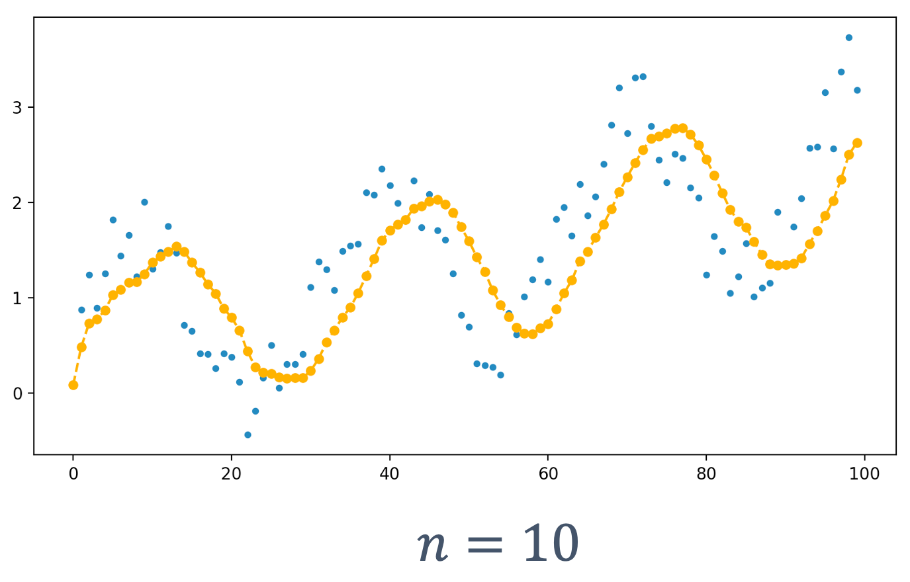

---

<!-- .slide: data-background="white" -->

**delays?**

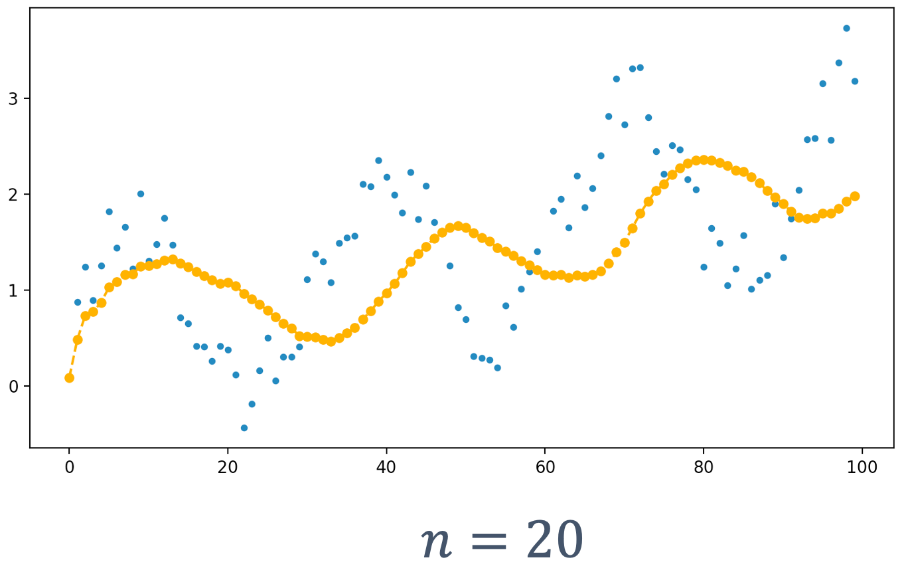

---

<!-- .slide: data-background="white" -->

**delays?**

---

<!-- .slide: data-background="white" -->

**delays?**

|property | effect (larger $n$) |
|---------|--------|
| smoothening | **more**|
| sensitivity (to changes) | **less** |
| delays | more/less? |
||

---

<!-- .slide: data-background="white" -->

**delays?**

|property | effect (larger $n$) |
|---------|--------|
| smoothening | **more**|
| sensitivity (to changes) | **less** |
| delays | **more**|
||

---

with increased window sizes &rarr; delays **increase**!

---

with increased window sizes &rarr; delays **increase**!

**why** does this happen?

---

### issues with moving averages

- less sensitive to changes
- greater delays

---

### issues with moving averages

- less sensitive to changes
- greater delays
- computationally **expensive**

---

## Exponential Moving Average (EMA)

---

## Exponential Moving Average (EMA)

- more weights &rarr; **recent** data

---

## Exponential Moving Average (EMA)

- more weights &rarr; **recent** data
- prevent delays

---

## Exponential Moving Average (EMA)

- more weights &rarr; **recent** data
- prevent delays
- better control over smoothing 

---

## Exponential Moving Average (EMA)

- more weights &rarr; **recent** data
- prevent delays
- better control over smoothing 

**exponentially decreasing weights over time**

---

## Exponential Moving Average (EMA)

$$
\overline{x_{0}}=x_{0} 
$$

---

## Exponential Moving Average (EMA)

$$
\overline{x_{0}}=x_{0} 
$$

$$
\overline{x_{k}}=\alpha x_{k}+(1-\alpha) \overline{x_{k-1}}, k>0
$$

---

## Exponential Moving Average (EMA)

$$
\overline{x_{0}}=x_{0} 
$$

$$
\overline{x_{k}}=\alpha x_{k}+(1-\alpha) \overline{x_{k-1}}, k>0
$$

**$\alpha$** &rarr; **smoothing factor** ($0 < \alpha < 1$) 

---

Exampl ($\alpha = 0.75$):

| $k$ | $x_{k}$ | $\overline{x_{k}}$ |
| :---: | :---: | :---: |
| 0 | 2.0 | 2.0000 |
| 1 | 3.0 | 2.7000 |
| 2 | 2.0 | 2.2100 |
| 3 | 4.0 | 3.4630 |
| 4 | 3.0 | 3.1389 |
||

---

one main advantages of EMA &rarr; **only need to store one value**, $\overline{x_{k}}$ 

---

why "exponential"? 

---

as we expand the term for $\overline{x_{k}}$ we see,

---

as we expand the term for $\overline{x_{k}}$ we see,

 

$ \overline{x_{k}} =\alpha x_{k}+(1-\alpha) \overline{x_{k-1}} $

---

as we expand the term for $\overline{x_{k}}$ we see,

 

$ \overline{x_{k}} =\alpha x_{k}+(1-\alpha) \overline{x_{k-1}} $

$ \overline{x_{k}} =\alpha x_{k}+\alpha(1-\alpha) x_{k-1}+(1-\alpha)^{2} \overline{x_{k-2}}$

---

as we expand the term for $\overline{x_{k}}$ we see,

 

$ \overline{x_{k}} =\alpha x_{k}+(1-\alpha) \overline{x_{k-1}} $

$ \overline{x_{k}} =\alpha x_{k}+\alpha(1-\alpha) x_{k-1}+(1-\alpha)^{2} \overline{x_{k-2}}$

$ \overline{x_{k}} =\alpha x_{k}+\alpha(1-\alpha) x_{k-1}+\alpha(1-\alpha)^{2} x_{k-2}+(1-\alpha)^{3} \overline{x_{k-3}}$

---

as we expand the term for $\overline{x_{k}}$ we see,

 

$ \overline{x_{k}} =\alpha x_{k}+(1-\alpha) \overline{x_{k-1}} $

$ \overline{x_{k}} =\alpha x_{k}+\alpha(1-\alpha) x_{k-1}+(1-\alpha)^{2} \overline{x_{k-2}}$

$ \overline{x_{k}} =\alpha x_{k}+\alpha(1-\alpha) x_{k-1}+\alpha(1-\alpha)^{2} x_{k-2}+(1-\alpha)^{3} \overline{x_{k-3}}$

$ \vdots $

$ \overline{x_{k}} =\alpha\left[x_{k}+(1-\alpha) x_{k-1}+(1-\alpha)^{2} x_{k-2}+(1-\alpha)^{3} x_{k-3} +\cdots+\\
 \quad \quad(1-\alpha)^{k-1} x_{1}\right]+(1-\alpha)^{k} x_{0}$

---

why "exponential"? 

 

$ \overline{x_{k}} =\alpha\left[x_{k}+(1-\alpha) x_{k-1}+(1-\alpha)^{2} x_{k-2}+(1-\alpha)^{3} x_{k-3} +\cdots+\\
 \quad \quad(1-\alpha)^{k-1} x_{1}\right]+(1-\alpha)^{k} x_{0}$

 

effect of the smoothing factor, $\alpha$

applied **exponentially** with **each sensor reading**

---

For various values of $\alpha$,

$$
\alpha=0.3000 \\
$$
$$
\alpha(1-\alpha)=0.2100 \\
$$
$$
\alpha(1-\alpha)^{2}=0.1470 \\
$$
$$
\alpha(1-\alpha)^{3}=0.1029 \\
$$
$$
\vdots \\
$$

---

EMA &rarr; accounts for **all past data**

---

EMA &rarr; accounts for **all past data**

encodes it into a **single** value &rarr; $\overline{x_{k}}$ 

---

consider example where $\alpha=0.5$,

| ${ }_{k}$ | $\chi_{k}$ | $\overline{\chi_{k}}$ |
| ---: | :--- | :--- |
| 0 | 0.08187 | 0.08187 |
| 1 | 0.97601 | 0.52894 |
| 2 | 1.18350 | 0.85622 |
| 3 | 0.99502 | 0.92562 |
| 4 | -0.31375 | 0.30594 |
| 5 | -0.25739 | 0.02427 |
| 6 | 1.52112 | 0.77269 |
| 7 | 1.75454 | 1.26362 |

---

consider example where $\alpha=0.5$,

| ${ }_{k}$ | $\chi_{k}$ | $\overline{\chi_{k}}$ |
| ---: | :--- | :--- |
| 0 | 0.08187 | 0.08187 |
| 1 | 0.97601 | 0.52894 |
| 2 | 1.18350 | 0.85622 |
| 3 | 0.99502 | 0.92562 |
| 4 | -0.31375 | 0.30594 |
| 5 | -0.25739 | 0.02427 |
| 6 | 1.52112 | 0.77269 |
| 7 | 1.75454 | 1.26362 |
| 8 | 1.82412 | 1.54387 |
| 9 | 1.89229 | 1.71808 |
| 10 | 1.10513 | 1.41161 |
| 11 | 1.22321 | 1.31741 |
| 12 | 2.20793 | 1.76267 |
| 13 | 3.02390 | 2.39328 |
| 14 | 2.45511 | 2.42420 |
| 15 | 2.07442 | 2.24931 |
| 16 | 1.49280 | 1.87105 |
| 17 | 1.19093 | 1.53099 |
| 18 | 2.32653 | 1.92876 |
| 19 | 3.84177 | 2.88526 |
||

---

<!-- .slide: data-background="white" -->

consider example where $\alpha=0.5$,

| ${ }_{k}$ | $\chi_{k}$ | $\overline{\chi_{k}}$ |
| ---: | :--- | :--- |
| 0 | 0.08187 | 0.08187 |
| 1 | 0.97601 | 0.52894 |
| 2 | 1.18350 | 0.85622 |
| 3 | 0.99502 | 0.92562 |
| 4 | -0.31375 | 0.30594 |
| 5 | -0.25739 | 0.02427 |
| 6 | 1.52112 | 0.77269 |
| 7 | 1.75454 | 1.26362 |
| 8 | 1.82412 | 1.54387 |
| 9 | 1.89229 | 1.71808 |
| 10 | 1.10513 | 1.41161 |
| 11 | 1.22321 | 1.31741 |
| 12 | 2.20793 | 1.76267 |
| 13 | 3.02390 | 2.39328 |
| 14 | 2.45511 | 2.42420 |
| 15 | 2.07442 | 2.24931 |
| 16 | 1.49280 | 1.87105 |
| 17 | 1.19093 | 1.53099 |
| 18 | 2.32653 | 1.92876 |
| 19 | 3.84177 | 2.88526 |
||

 

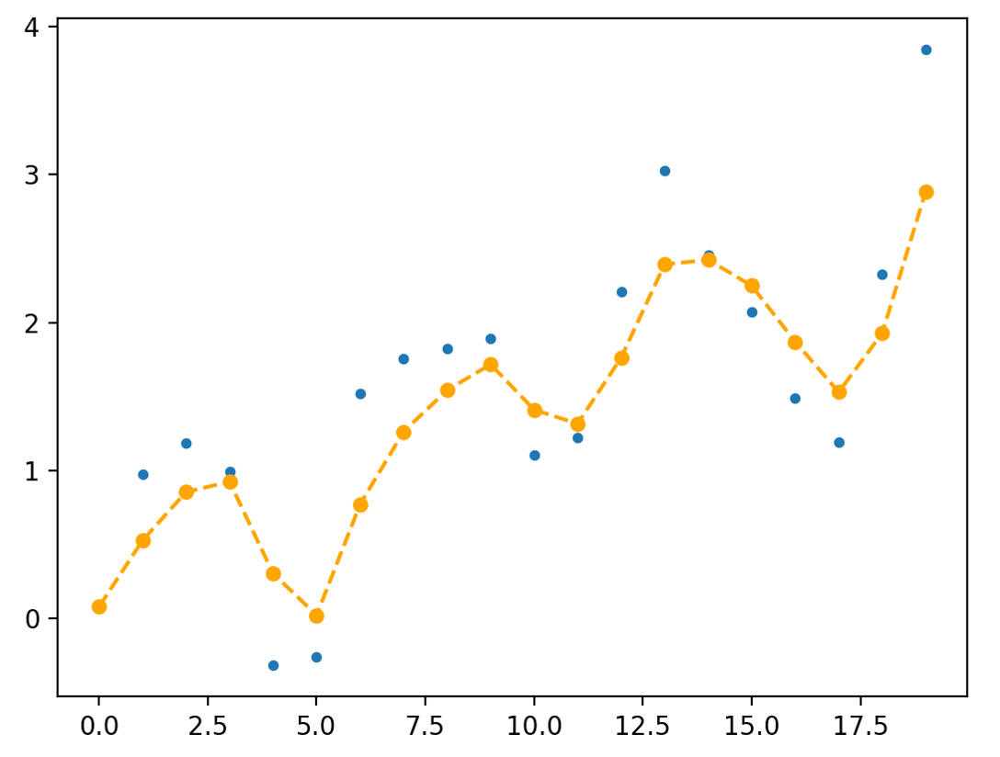

---

consider some of the values in the table:

| ${ }_{k}$ | $\chi_{k}$ | $\overline{\chi_{k}}$ |
| ---: | :--- | :--- |
| 0 | 0.08187 | 0.08187 |
| 1 | 0.97601 | 0.52894 |
| 2 | 1.18350 | 0.85622 |
| 3 | 0.99502 | **0.92562** |
| 4 | **-0.31375** | **0.30594** |
| 5 | -0.25739 | 0.02427 |
| 6 | 1.52112 | 0.77269 |
|...|...|...|
||

---

<!-- .slide: data-background="white" -->

consider some of the values in the table:

| ${ }_{k}$ | $\chi_{k}$ | $\overline{\chi_{k}}$ |
| ---: | :--- | :--- |
| 0 | 0.08187 | 0.08187 |
| 1 | 0.97601 | 0.52894 |
| 2 | 1.18350 | 0.85622 |
| 3 | 0.99502 | **0.92562** |
| 4 | **-0.31375** | **0.30594** |
| 5 | -0.25739 | 0.02427 |
| 6 | 1.52112 | 0.77269 |
|...|...|...|
||

$\overline{x_{4}}=\textbf{0.5} x_{4} + \textbf{0.5} \overline{x_{3}}$

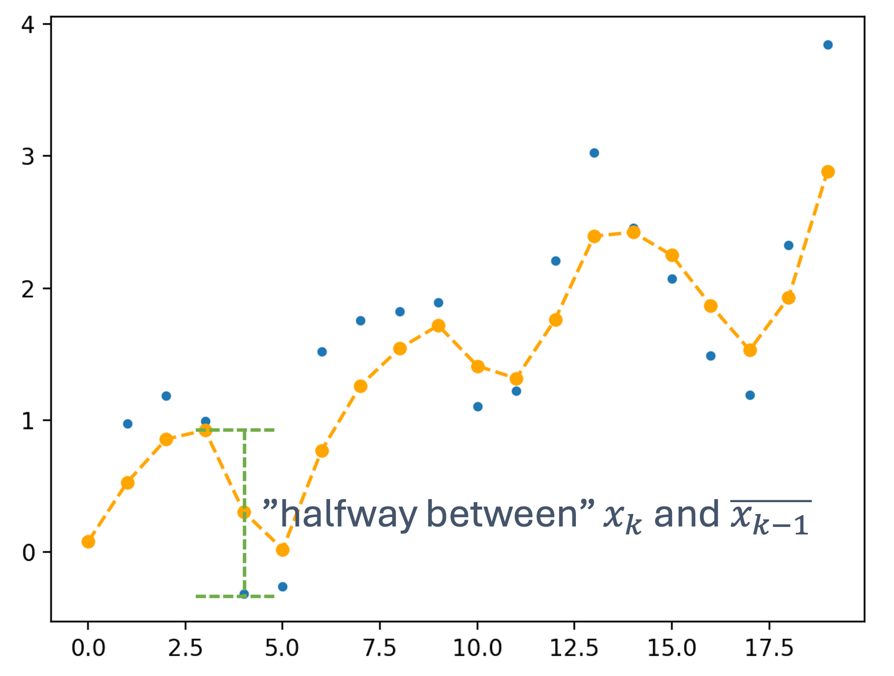

---

<!-- .slide: data-background="white" -->

for $\alpha = 0.5$, the estimate &rarr; "**halfway**" between two sensor readings

$\overline{x_{4}}=\textbf{0.5} x_{4} + \textbf{0.5} \overline{x_{3}}$

---

now, change $\alpha=\textbf{0.7}$ 

---

now, change $\alpha=\textbf{0.7}$ 

$\overline{x_{4}}=0.7 x_{4}+0.3 \overline{x_{3}}$

---

<!-- .slide: data-background="white" -->

now, change $\alpha=\textbf{0.7}$ 

$\overline{x_{4}}=0.7 x_{4}+0.3 \overline{x_{3}}$

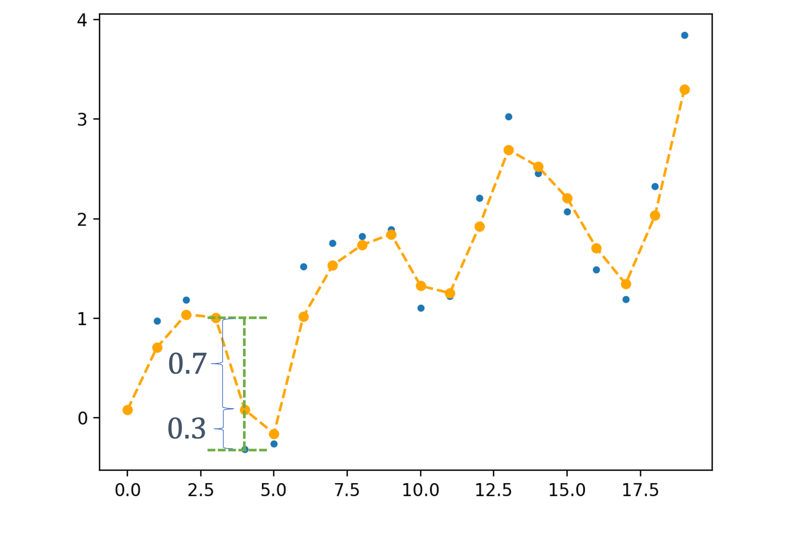

---

<!-- .slide: data-background="white" -->

now, change $\alpha=\textbf{0.7}$ 

$\overline{x_{4}}=0.7 x_{4}+0.3 \overline{x_{3}}$

**heavier bias** towards the **more recent value**

---

<!-- .slide: data-background="white" -->

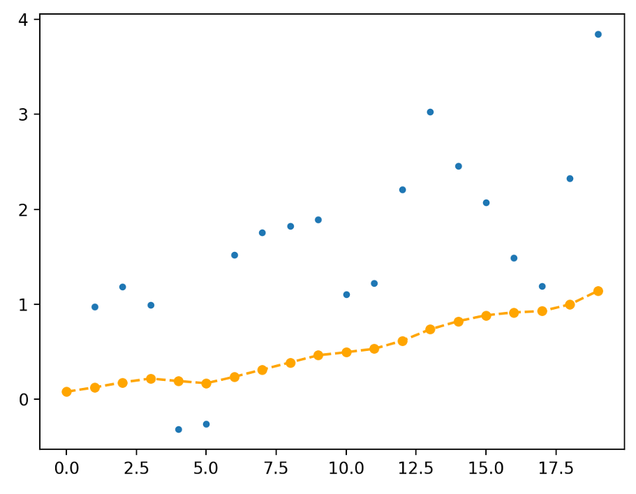
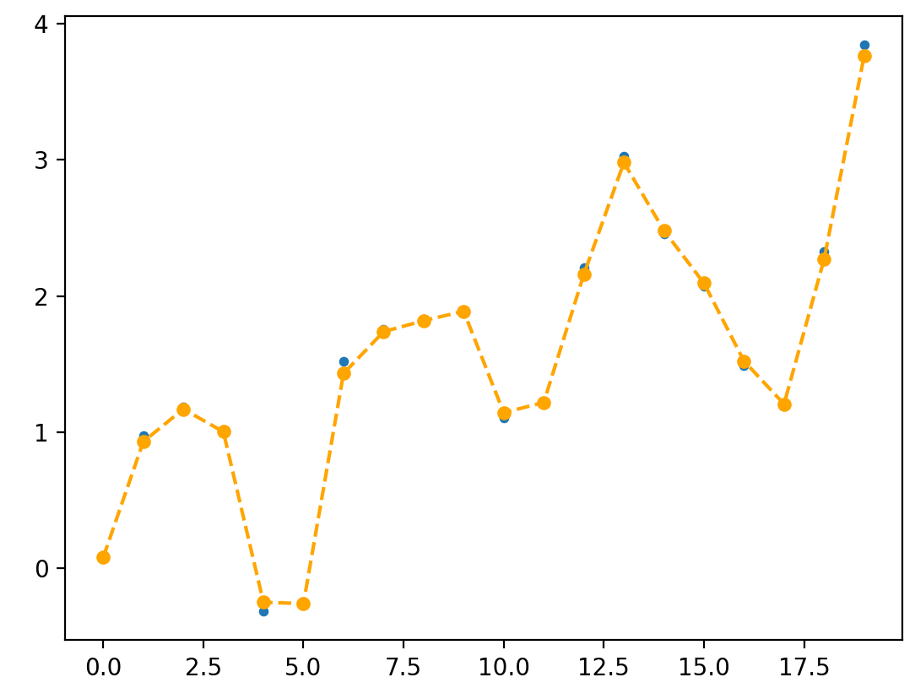

which one is $\alpha=\textbf{0.05}$ and which one is $\alpha=\textbf{0.95}$?

---

<!-- .slide: data-background="white" -->

significance of **changing $\alpha$**

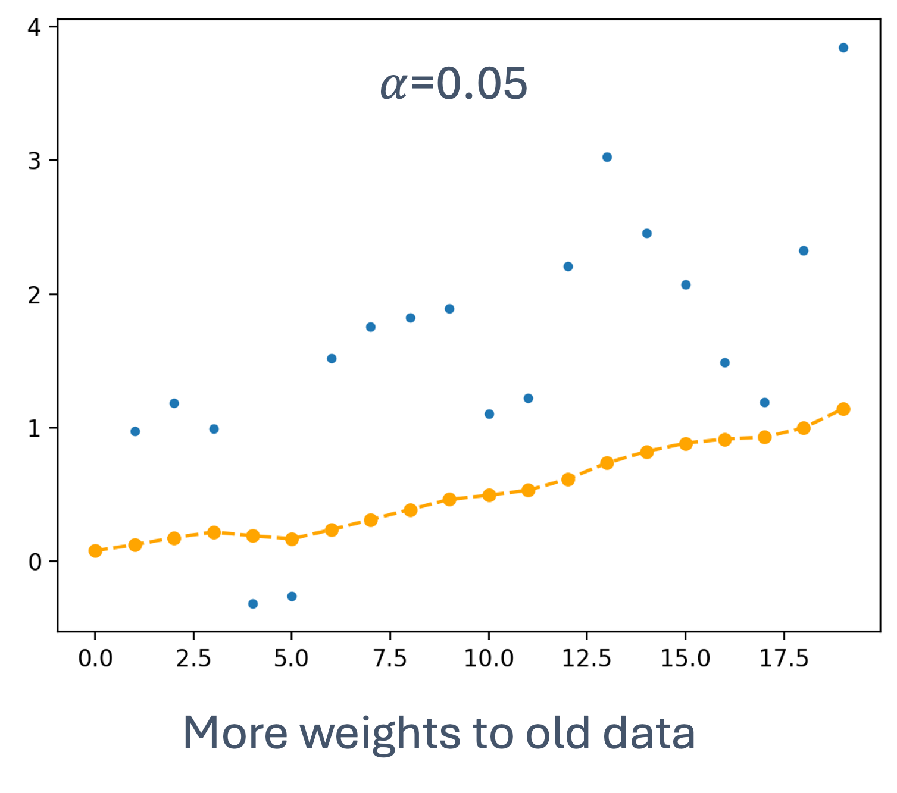
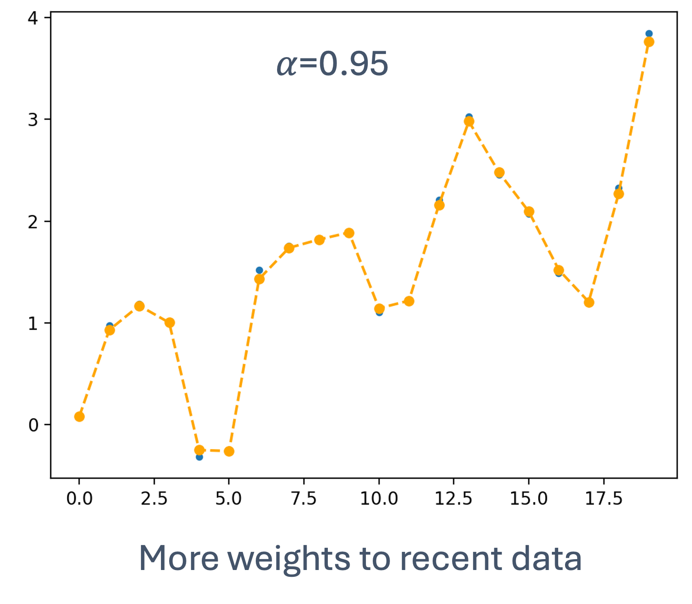

---

<!-- .slide: data-background="white" -->

increasing $\alpha$ (left to right) results in:

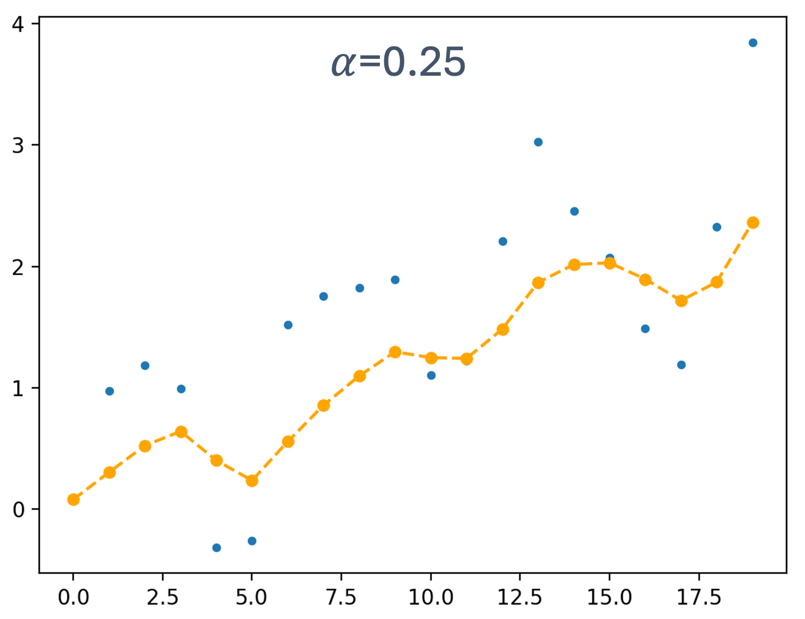
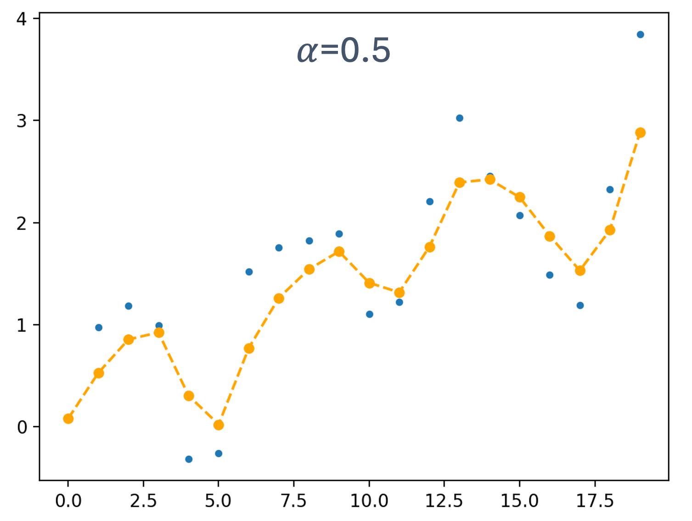
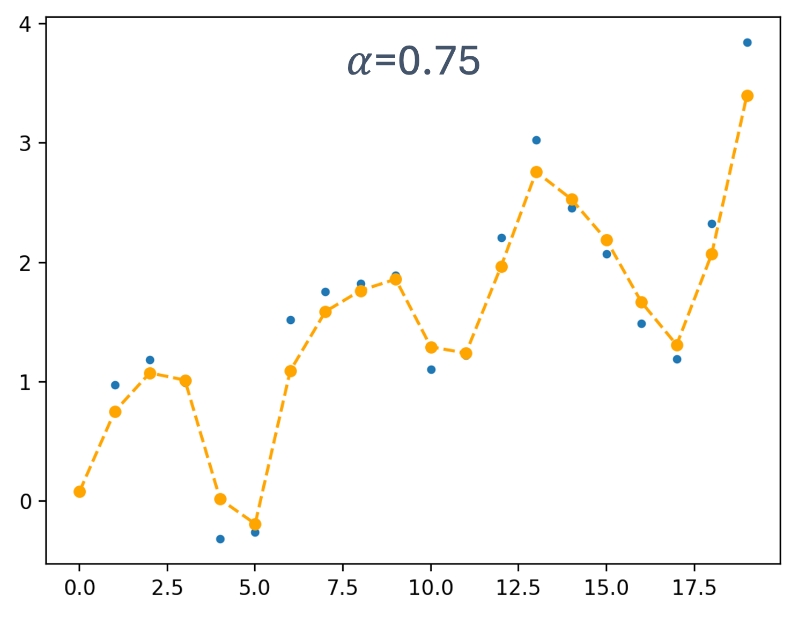

---

<!-- .slide: data-background="white" -->

increasing $\alpha$ (left to right) results in:

- **less delay**
- **less smoothening out**

---

## State Space Representation

---

more "formal" description of **state**:

---

more "formal" description of **state**:

> a **quantitative** characterization of a system that is **not directly observable**

---

more "formal" description of **state**:

> a **quantitative** characterization of a system that is **not directly observable**

 

examples: temperature, position, velocity, weight, etc.

Note:

There are _many_ ways to represent state, even for the same quantity. 

---

how to estimate the position of a car in a 2D plane?

---

how to estimate the position of a car in a 2D plane?

with the intent of **tracking** it

---

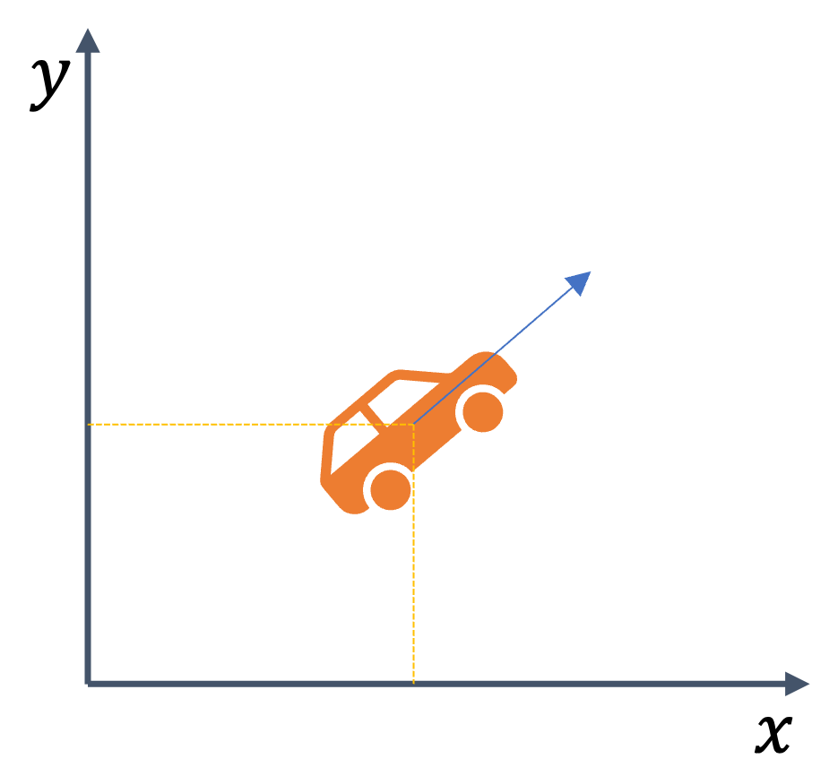

---

how do we represent the "state" of this car?

---

## "state" of car

 
 
 

1. $\boldsymbol{x}_{\boldsymbol{k}}=(x, y)$

 

position &rarr; coordinate system

---

## "state" of car

 
 
 

1. $\boldsymbol{x}_{\boldsymbol{k}}=(x, y)$

 

position &rarr; coordinate system

is this sufficient? 

---

captures a **static** state of the system

---

captures a **static** state of the system

doesn't allow for **tracking** the car &rarr; predict next move?

---

## "state" of car

 
 
 

2.  $\boldsymbol{x}_{\boldsymbol{k}}=(x, \dot{x}, y, \dot{y})$

 

also track the **velocity**

Note:

Clearly that will tell us how fast the car is moving and so we can "track" it correctly?

---

## "state" of car

 
 
 

2.  $\boldsymbol{x}_{\boldsymbol{k}}=(x, \dot{x}, y, \dot{y})$

 

also track the **velocity**

so we can "track" it correctly?

---

not quite &rarr; **instantaneous velocity** 

---

not quite &rarr; **instantaneous velocity** 

doesn't tell if car accelerating or deccelerating!

---

## "state" of car

 
 
 

3. $\boldsymbol{x}_{\boldsymbol{k}}=(x, \dot{x}, \ddot{x}, y, \dot{y}, \ddot{y})$

 

position, velocity **and** acceleration

Note:

Ok, so now we have position, velocity **and** acceleration! Surely, we're done?

---

do we know which **direction** the car is heading in?

---

## "state" of car

 
 
 

4. $\boldsymbol{x}_{\boldsymbol{k}}=(x, \dot{x}, \ddot{x}, y, \dot{y}, \ddot{y}, \theta)$

 

position, velocity, acceleration and **direction**

Note: 
Now, we have a better sense of the "state" of the car, in order to track it

---

## state estimation 

estimating state from sensor measurements

Note:

While the moving averages and EMA are good ways to deal with noisy measurements, estimating state is much harder

---

## state estimation 

estimating state from sensor measurements

**uncertainty** &rarr; in measurements and state estimation

---

## Probabilistic State Estimation

---

## Probabilistic State Estimation

**probability** &rarr; deal with uncertanties in

---

## Probabilistic State Estimation

**probability** &rarr; deal with uncertanties in

- sensor measurements
- state estimation

---

## Probabilistic State Estimation

**probability** &rarr; deal with uncertanties in

- sensor measurements
- state estimation

main idea &rarr; represent state in a **probability distribution**

---
    
## Probabilistic State Estimation

- measurements are **noisy**
- models ‘**uncertainty**’

---

## Probabilistic State Estimation

start with **"belief"** 

knowledge about state or _'estimate of true state'_

---

## Probabilistic State Estimation

start with **"belief"** 

compute **new belief** based on &rarr; **measurement data**

---

<!-- .slide: data-background="white" -->

## Probabilistic State Estimation

compute **new belief** based on &rarr; **measurement data**

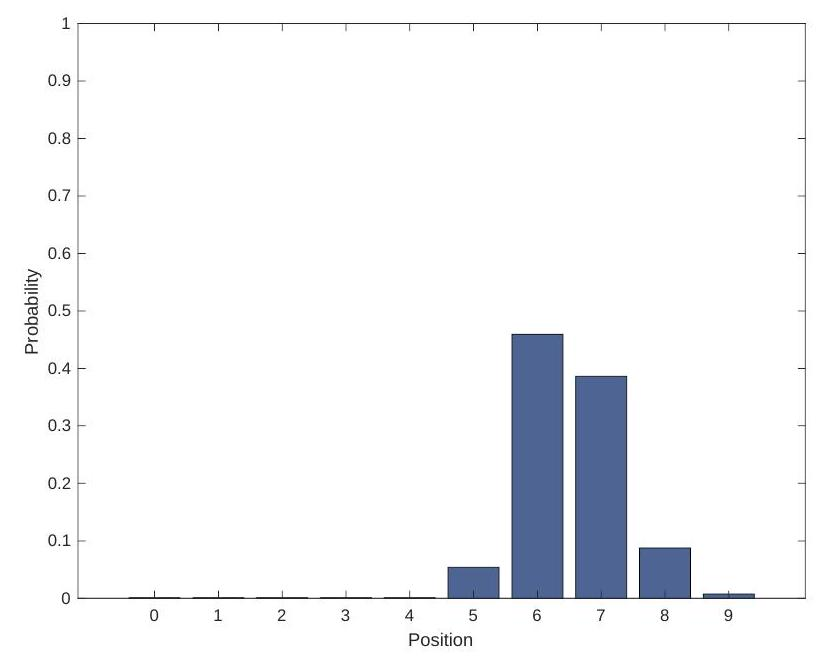

---

## Probabilistic State Estimation

various methods for **probabilistic state estimations**, 

1. [Bayes filter](#bayes-filter)
2. [Kalman filter](#kalman-filter)
3. [Extended Kalman Filter]()

---

## Bayes Filter

---

## Bayes Filter

sensors capture &rarr; **incomplete** or **noisy** information

---

<!-- .slide: data-background="white" -->

### example

two LiDAR sensors &rarr; estimate distance to a pedestrian

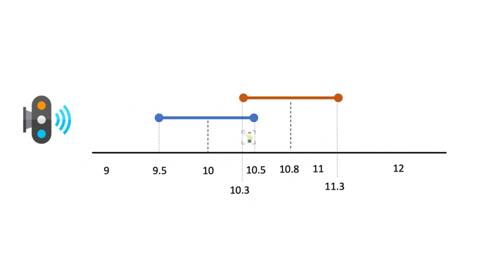

---

<!-- .slide: data-background="white" -->

### example

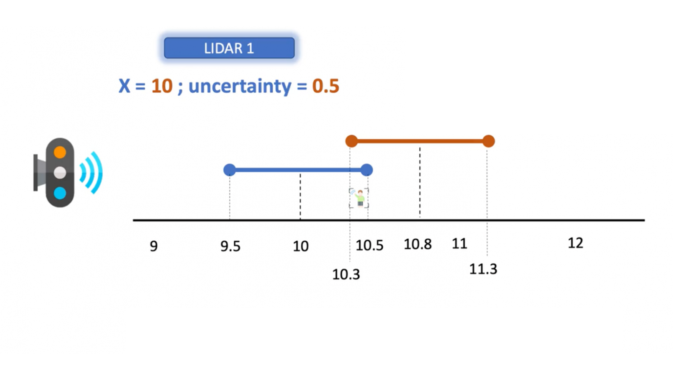

 

|sensor| distance|
|-----|-----|
| LiDar1 | $10\ m$ |

---

<!-- .slide: data-background="white" -->

### example

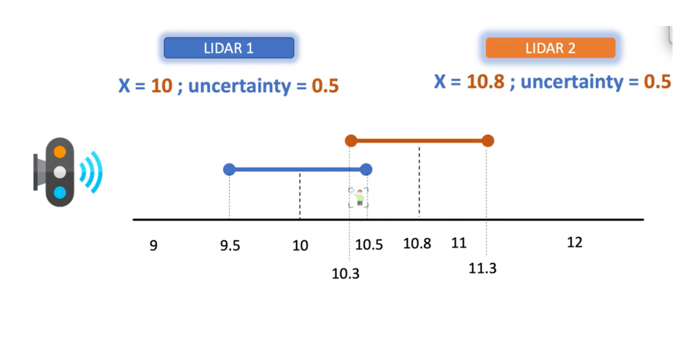

 

|sensor| distance|
|-----|-----|
| LiDar1 | $10\ m$ |
| LiDar2 | $10.8\ m$ |

---

<!-- .slide: data-background="white" -->

### example

 

|sensor| distance|
|-----|-----|
| LiDar1 | $10\ m$ |
| LiDar2 | $10.8\ m$ |

so there's a **mismatch** &rarr; which one do we trust?

---

<!-- .slide: data-background="white" -->

### example

what if we add **probabilities**?

 

|sensor| distance| uncertainty |
|-----|-----|-------|
| LiDar1 | $10\ m$ | **50%** |
| LiDar2 | $10.8\ m$ | **50%** |

---

<!-- .slide: data-background="white" -->

### example

what if we add **probabilities**?

 

|sensor| distance| confidence |
|-----|-----|-------|
| LiDar1 | $10\ m$ | **50%** |
| LiDar2 | $10.8\ m$ | **50%** |

what if the probabilities **differ**?

---

<!-- .slide: data-background="white" -->

### example | reality

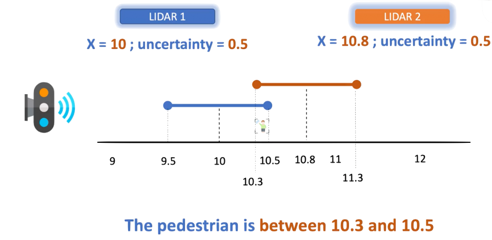

---

how do we deal with such situations? 

---

how do we deal with such situations? 

- what if probabilities **differ** greatly? 

---

how do we deal with such situations? 

- what if probabilities **differ** greatly? 
- **which** sensor would you trust and **how much**?

---

## bayes filter

---

### Bayes filter | **Prediction**

---

### Bayes filter | **Prediction**

revisit our previous example of a car:

---

### Bayes filter | **Prediction**

say car is in &rarr; $state_k$ at a certain point in time 

---

### Bayes filter | **Prediction**

say car is in &rarr; $state_k$ at a certain point in time 

make a **prediction** &rarr; **future state**, $state_{k+1}$

---

### Bayes filter | **Prediction**

 
 
 

car &rarr; $state_k$

**prediction** &rarr; $state_{k+1}$

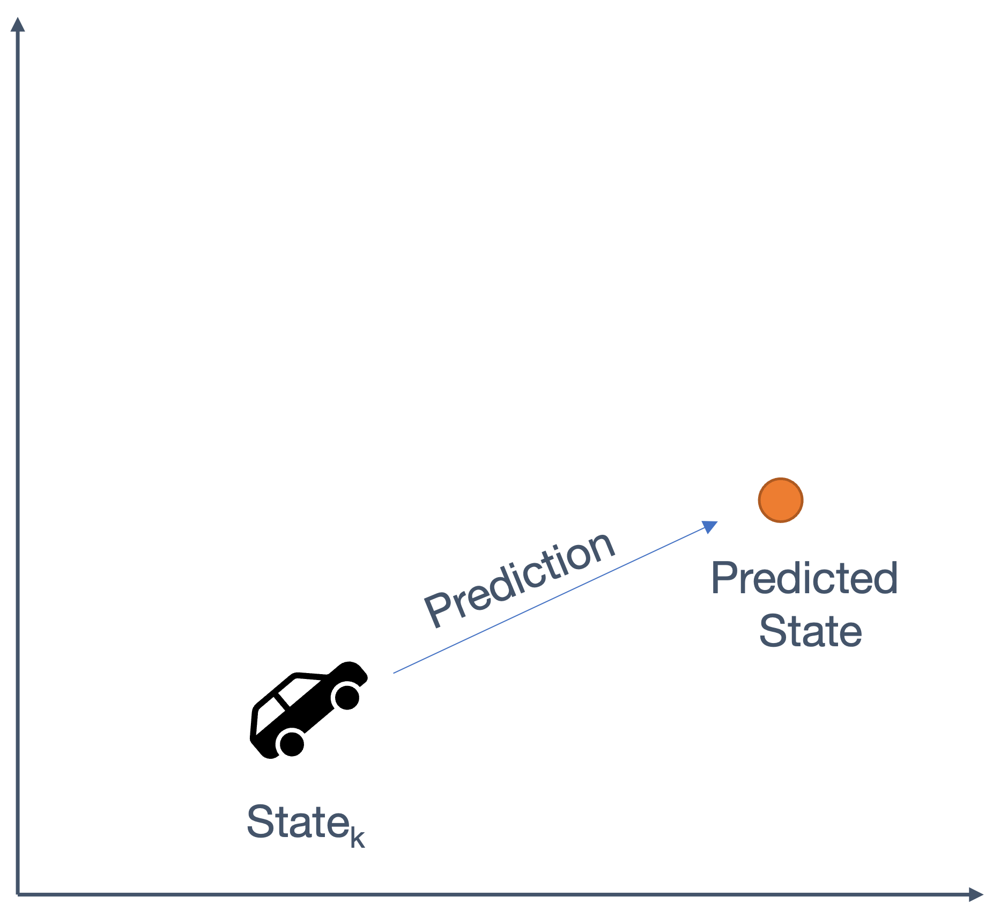

---

simplify matters

---

simplify matters

- assume car moving along *one* axis, _e.g.,_ x-axis

---

simplify matters

- assume car moving along *one* axis, _e.g.,_ x-axis
- follow **discrete** position: $0,1,2, .., 9$

---

simplify matters

- assume car moving along *one* axis, _e.g.,_ x-axis
- follow **discrete** position: $0,1,2, .., 9$
- this is a "circular" track: $+1$ move from $9 \rightarrow 0$

---

simplify matters

- assume car moving along *one* axis, _e.g.,_ x-axis
- follow **discrete** position: $0,1,2, .., 9$
- this is a "circular" track: $+1$ move from $9 \rightarrow 0$

---

assume existence of **sensor** &rarr; captures car's movement

---

assume existence of **sensor** &rarr; captures car's movement

| sensor output | meaning |
|---------------|---------|
| <scb>0</scb> | **stay** |

---

assume existence of **sensor** &rarr; captures car's movement

| sensor output | meaning |
|---------------|---------|
| <scb>0</scb> | **stay** |
| <scb>+1</scb>, <scb>+2</scb>, ... | move forward by that amount |
||

---

assume existence of **sensor** &rarr; captures car's movement

| sensor output | meaning |
|---------------|---------|
| <scb>0</scb> | **stay** |
| <scb>+1</scb>, <scb>+2</scb>, ... | move forward by that amount |
||

also assume &rarr; sensor is **always correct** (for now)

---

<!-- .slide: data-background="white" -->

current "belief"

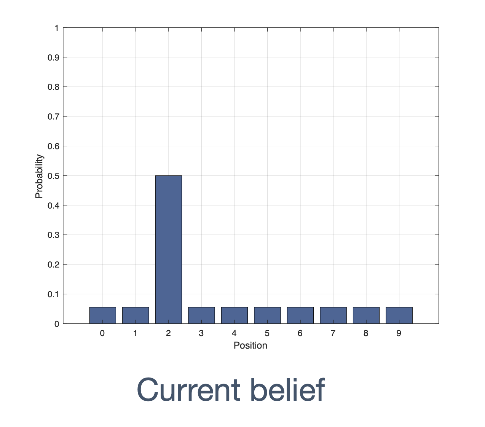

Note:
- based on the location of the car

---

if we more car forward &rarr; <scb>1</scb> step

---

car forward by <scb>1</scb> &rarr; how does this update belief?

---

<!-- .slide: data-background="white" -->

car forward by <scb>1</scb> &rarr; how does this update belief?

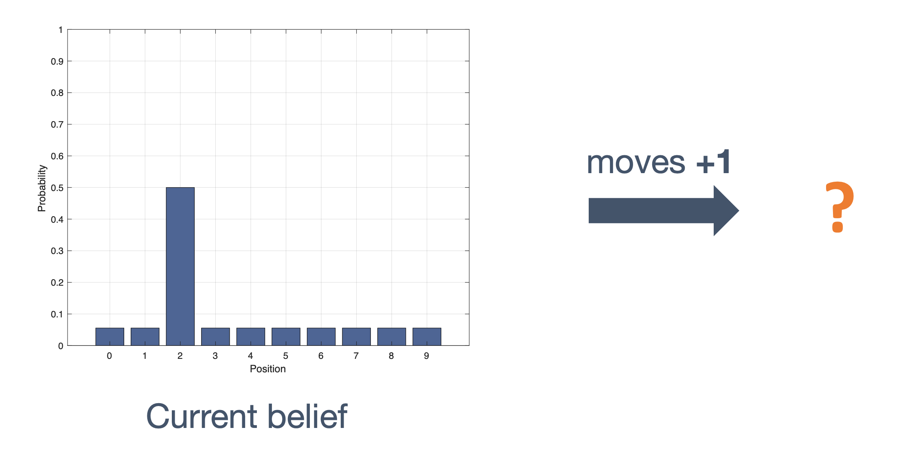

---

<!-- .slide: data-background="white" -->

car forward by <scb>1</scb> &rarr; how does this update belief?

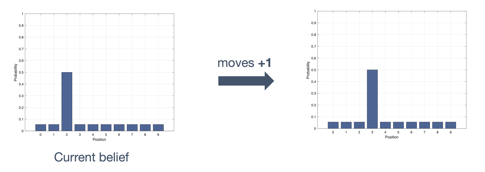

---

<!-- .slide: data-background="white" -->

car forward by <scb>1</scb> &rarr; how does this update belief?

**simple** case &rarr; car **obviously** moved <scb>1</scb> step and we can **verify** it

---

<!-- .slide: data-background="white" -->

car forward by <scb>1</scb> &rarr; how does this update belief?

**simple** case &rarr; car **obviously** moved <scb>1</scb> step and we can **verify** it

the belief is updated accordingly

---

**realistic case** &rarr; motion sensor  has **noise** with probabilities

---

**realistic case** &rarr; motion sensor  has **noise** with probabilities

| probability | meaning |
|-------------|-------------|
| <scb>80%</scb>         | **correct** reading |
| <scb>10%</scb>         | **over**estimate |
| <scb>10%</scb>         | **under**estimate |
||

---

**realistic case** &rarr; motion sensor  has **noise** with probabilities

| probability | meaning |
|-------------|-------------|
| <scb>80%</scb>         | **correct** reading |
| <scb>10%</scb>         | **over**estimate |
| <scb>10%</scb>         | **under**estimate |
||

---

sensor &rarr; **number** of moves is <scb>+3</scb>

---

sensor &rarr; **number** of moves is <scb>+3</scb>

|probability | movement |
|------------|----------|
| <scb>80%</scb> | <scb>+3</scb> |
| <scb>10%</scb> | <scb>+2</scb> |
| <scb>10%</scb> | <scb>+4</scb> |
||

---

sensor &rarr; **number** of moves is <scb>+3</scb>

|probability | movement |
|------------|----------|
| <scb>80%</scb> | <scb>+3</scb> |
| <scb>10%</scb> | <scb>+2</scb> |
| <scb>10%</scb> | <scb>+4</scb> |
||

what happens to the **belief**?

---
 
<!-- .slide: data-background="white" -->

what happens to the **belief**?

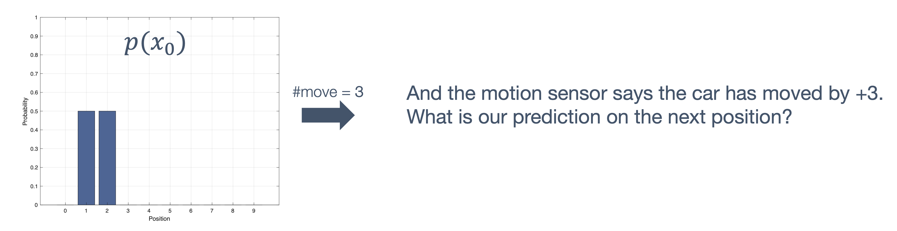

---
 
<!-- .slide: data-background="white" -->

what happens to the **belief**?

[note the starting belief]

---

<!-- .slide: data-background="white" -->

**updated belief** 

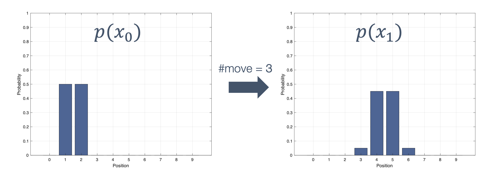

---

<!-- .slide: data-background="white" -->

**updated belief** 

**how**?

---

$$
\operatorname{Pr}\left(x_{1}=5\right) = \textbf{?}
$$

---

$$
\operatorname{Pr}\left(x_{1}=5\right)={Pr}\left(\text{started at } x_0 = 1\right) \operatorname{Pr}(\textbf{under})
$$

---

$$
\operatorname{Pr}\left(x_{1}=5\right)={Pr}\left(x_{0}=1\right) \operatorname{Pr}(\textbf{under})
$$

---

$$
\operatorname{Pr}\left(x_{1}=5\right)={Pr}\left(x_{0}=1\right) \operatorname{Pr}(under)+ 
$$

$$
{Pr}\left(\text{started at }x_{0}=2\right) \operatorname{Pr}(\textbf{correct}) 
$$

---

$$
\operatorname{Pr}\left(x_{1}=5\right)={Pr}\left(x_{0}=1\right) \operatorname{Pr}(\textbf{under})+{Pr}\left(x_{0}=2\right) \operatorname{Pr}(\textbf{correct}) 
$$

---

$$
\operatorname{Pr}\left(x_{1}=5\right)={Pr}\left(x_{0}=1\right) \operatorname{Pr}(\textbf{under})+{Pr}\left(x_{0}=2\right) \operatorname{Pr}(\textbf{correct}) 
$$

$$
\operatorname{Pr}\left(x_{1}=5\right)=0.5 \times 0.1+0.5 \times 0.8= \textbf{0.45}
$$

---

$$
\operatorname{Pr}\left(x_{1}=5\right)={Pr}\left(x_{0}=1\right) \operatorname{Pr}(\textbf{under})+{Pr}\left(x_{0}=2\right) \operatorname{Pr}(\textbf{correct}) 
$$

$$
\operatorname{Pr}\left(x_{1}=5\right)=0.5 \times 0.1+0.5 \times 0.8= \textbf{0.45}
$$

wait, where did the <scb>0.5</scb> come from?

---

<!-- .slide: data-background="white" -->

wait, where did the <scb>0.5</scb> come from?

starting position &rarr; one of <scb>1</scb> or <scb>2</scb>

---

$$
\operatorname{Pr}\left(x_{1}=5\right)={Pr}\left(x_{0}=1\right) \operatorname{Pr}(\textbf{under})+{Pr}\left(x_{0}=2\right) \operatorname{Pr}(\textbf{correct}) 
$$

$$
\operatorname{Pr}\left(x_{1}=5\right)=0.5 \times 0.1+0.5 \times 0.8= \textbf{0.45}
$$

---

**law of total probability**

---

**law of total probability**

$$p\left(x_{k}\right)=\sum_{i} p\left(x_{k} \mid x_{k-1}=i\right) p\left(x_{k-1}=i\right)$$

---

also need to compute

$$
\operatorname{Pr}\left(x_{1}=4\right)=0.5 \times 0.8+0.5 \times 0.1= \textbf{0.45}
$$

---

<!-- .slide: data-background="white" -->

after <scb>3</scb> moves &rarr; **predicted** probability estimate 

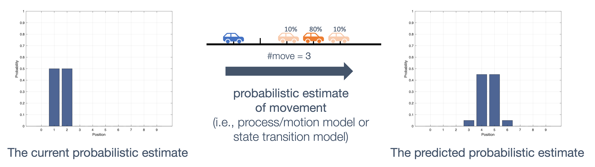

---

<!-- .slide: data-background="white" -->

let's keep going ...

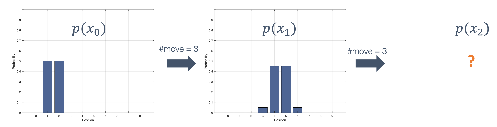

---

<!-- .slide: data-background="white" -->

let's keep going ...

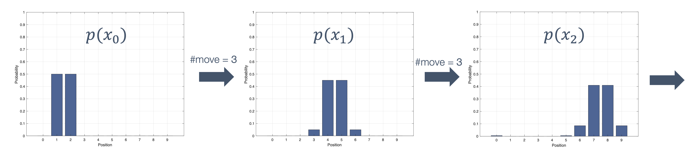

---

<!-- .slide: data-background="white" -->

let's keep going ...

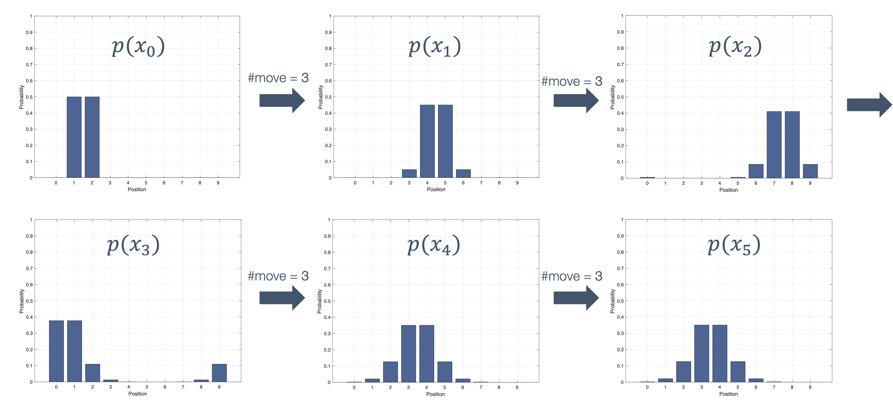

---

<!-- .slide: data-background="white" -->

what happens after &rarr; **<scb>20</scb> predictions** ?

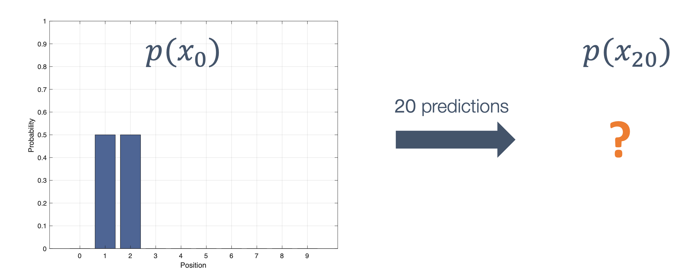

---

<!-- .slide: data-background="white" -->

what happens after &rarr; **<scb>20</scb> predictions** ?

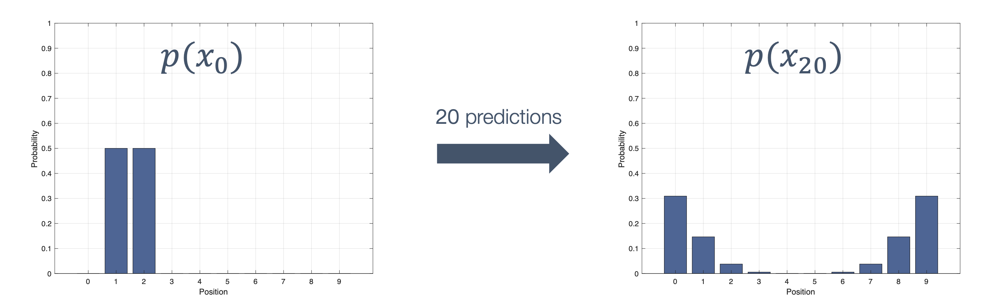

---

<!-- .slide: data-background="white" -->

what happens after &rarr; **<scb>20</scb> predictions** ?

why did the probabilities **collapse** into a lower spread?

---

sensors are **imperfect** 

---

sensors are **imperfect** &rarr; information is **lost**

---

actual state **differs** from the predicted state

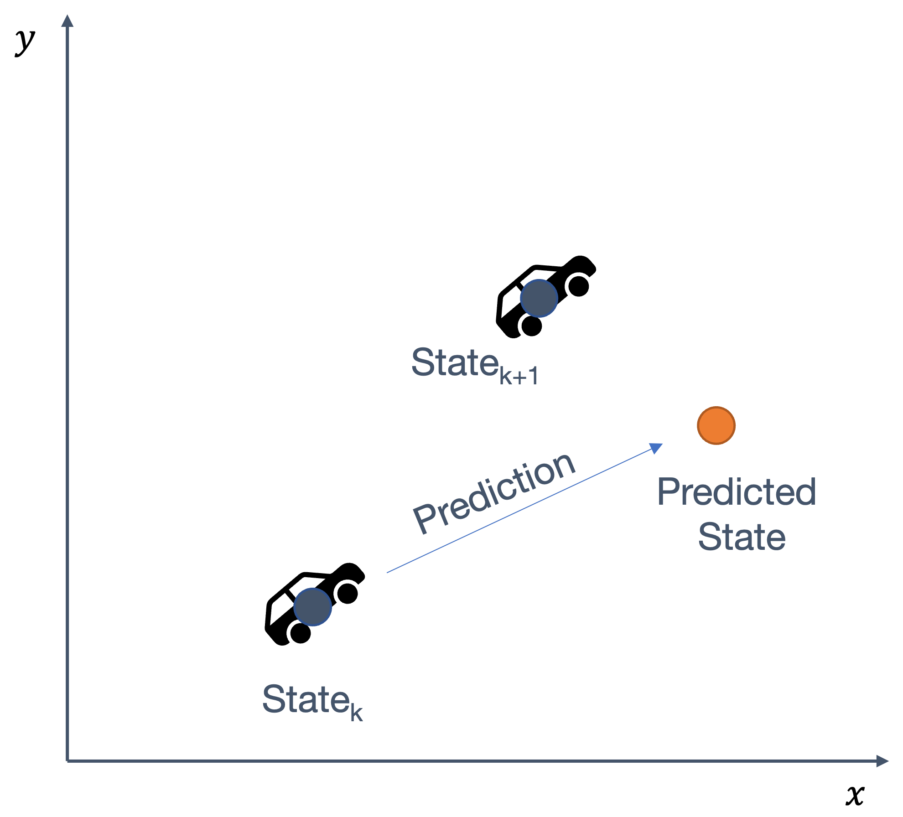

---

need to find a way to **fix** this

---

### Bayes filter | **Measurement Update**

---

### Bayes filter | **Measurement Update**

use **measurement**

---

### Bayes filter | **Measurement Update**

use **measurement** &rarr; "fix" divergence between actual/predicted state

---

### Bayes filter | **Measurement Update**

**feedback** from the real world &rarr; using **sensors** (same or different type)

---

### Bayes filter | **Measurement Update**

**feedback** from the real world &rarr; using **sensors** (same or different type) 

(sounds familiar?)

---

### Bayes filter | **Measurement Update**

**feedback** from the real world &rarr; using **sensors** (same or different type)

(sounds familiar? **feedback control**)

---

how **sensor** data is used by,

---

how **sensor** data is used by,

|state estimation   (what we're doing here)| feedback control|
|----------------------------------------|----------------|

---

how **sensor** data is used by,

|state estimation   (what we're doing here)| feedback control|
|----------------------------------------|----------------|
| fix **estimate** of **current** state  | |

---

how **sensor** data is used by,

|state estimation   (what we're doing here)| feedback control|
|----------------------------------------|----------------|
| fix **estimate** of **current** state  | fix **next state** |

---

### Bayes filter | **Measurement Update**

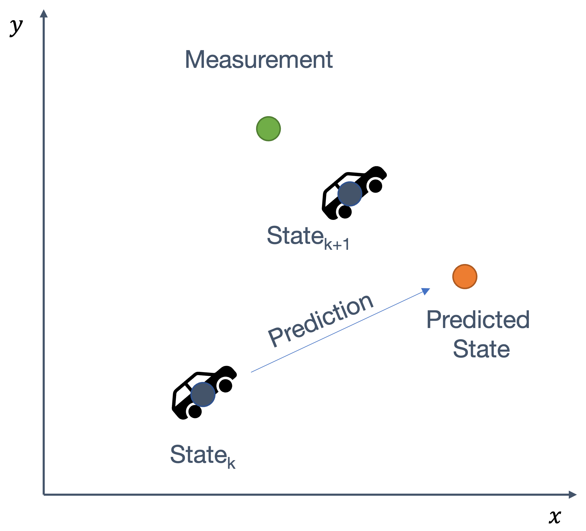

---

let's put aside prediction, for now

---

<!-- .slide: data-background="white" -->

### Prior

probability **before** incorporating measurement 

**equal likelhood** in any position &rarr; $\frac{1}{10}$ for every position

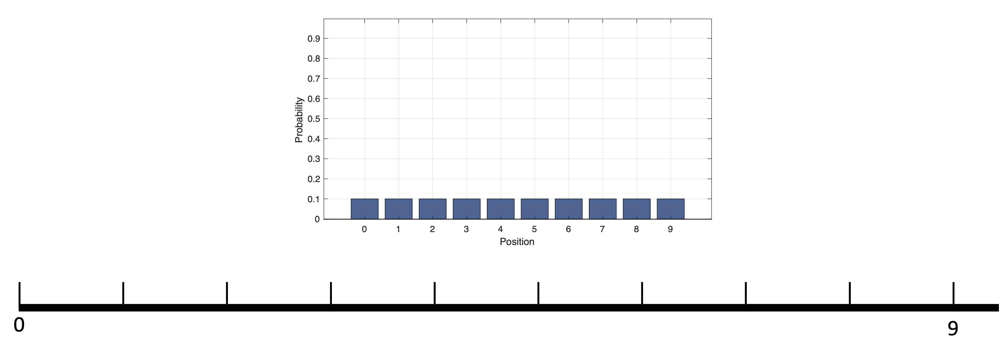

---

**first** sensor reading &rarr; $z_0 = 2$

---

**first** sensor reading &rarr; $z_0 = 2$

but the sensor is **noisy** &rarr; probability of <scb>90 %</scb>

---

but we've used sensors before &rarr; in the **predict** stage?

---

use of sensors

| predict stage | measurement stage |
|---------------------|----------|

---

use of sensors

| predict stage | measurement stage |
|---------------------|----------|
| what was **intended**? | |

---

use of sensors

| predict stage | measurement stage |
|---------------------|----------|
| what was **intended**? | what **actually happened**? | 

---

use of sensors

| predict stage | measurement stage |
|---------------------|----------|
| what was **intended**? | what **actually happened**? | 
 "engine generated enough torque to move forward by <scb>3</scb> slots"||

---

use of sensors

| predict stage | measurement stage |
|---------------------|----------|
| what was **intended**? | what **actually happened**? | 
| "engine generated enough torque to move forward by <scb>3</scb> slots" |"how much was **actually** moved?" |
||

---

$z_0 = 2$ &rarr; probability <scb>90 %</scb>

---

$z_0 = 2$ &rarr; probability <scb>90 %</scb>

what is the **new belief**? 

---

$z_0 = 2$ &rarr; probability <scb>90 %</scb>

intuitively &rarr; $x_{0}=2$ is <scb>9</scb> **times more likely** than $x_{0} \neq 2$

---

use **Bayes Rule**

$$
p\left(x_{k} \mid z_{k}\right)=\frac{p\left(z_{k} \mid x_{k}\right) \times p\left(x_{k}\right)}{p\left(z_{k}\right)}
$$

---

use **Bayes Rule**

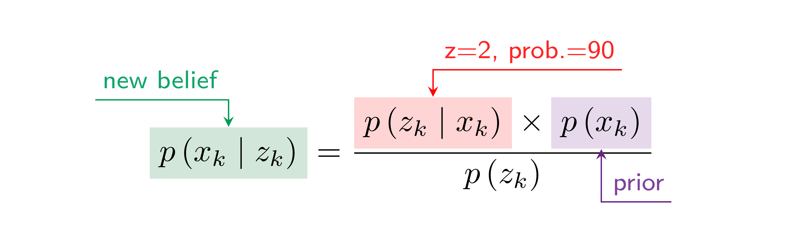

---

$$
p\left(z_{k}\right)=\sum_{x_{i}} p\left(z_{k} \mid x_{i}\right) p\left(x_{i}\right)
$$ 

(as we've seen before, from the law of total probability)

---

<!-- .slide: data-background="white" -->

**likelihood**, $p\left(z_{k} \mid x_{k}\right)$,

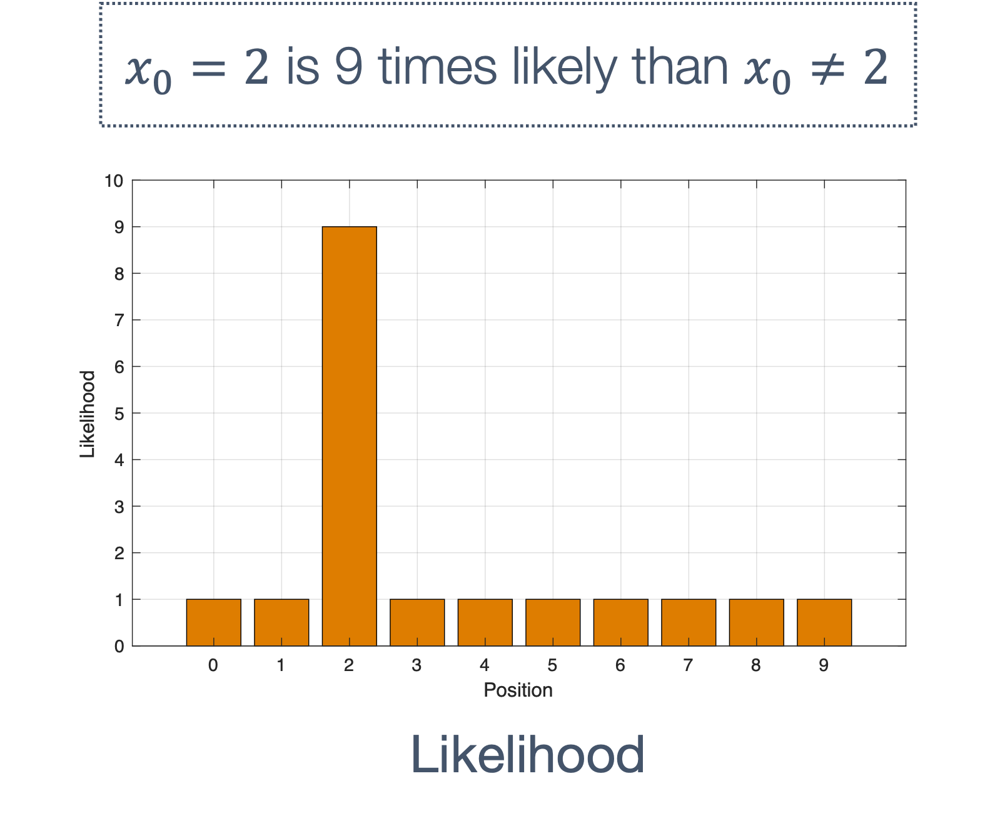

---

what if the probability was <scb>80%</scb>?

---

the numerator on the right hand side, _i.e.,_ 

---

the numerator on the right hand side, _i.e.,_ 

$p\left(z_{k} \mid x_{k}\right) \times p\left(x_{k}\right)$:

---

<!-- .slide: data-background="white" -->

the numerator on the right hand side, _i.e.,_ 

$p\left(z_{k} \mid x_{k}\right) \times p\left(x_{k}\right)$:

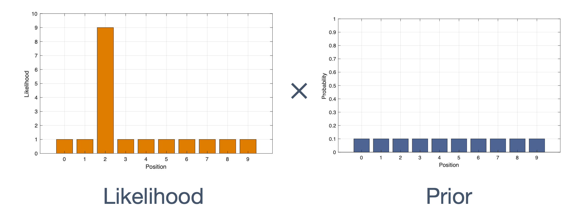

(recall starting position, _prior, &rarr; **equal likelhood** in any position)

---

<!-- .slide: data-background="white" -->

result ...

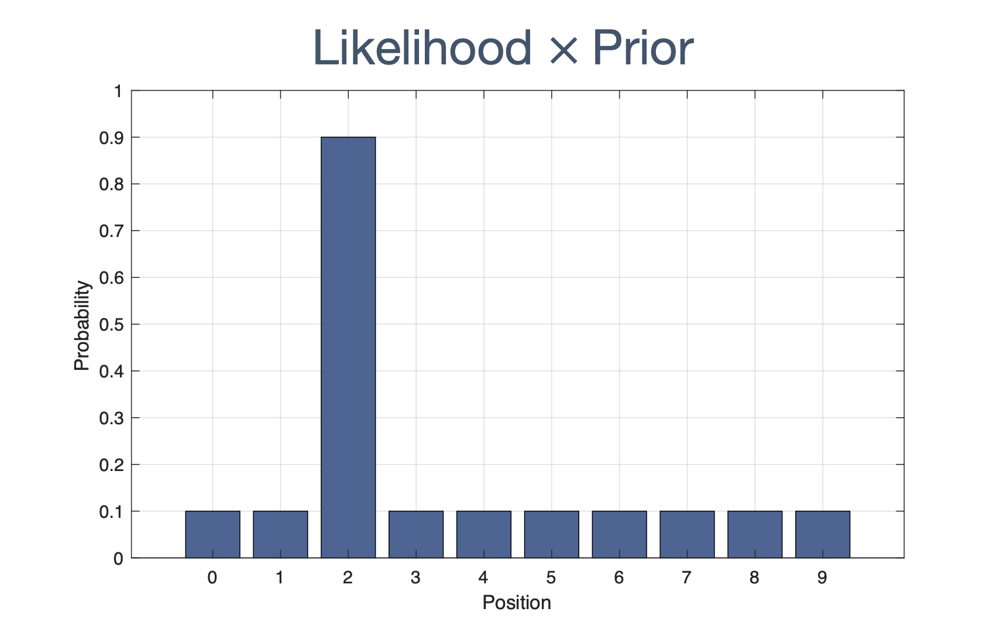

---

which puts our car at the **right spot**

---

we're still not done

---

we're still not done &rarr; have to compute the denominator,

$$p\left(z_{k}\right)=\sum_{x_{i}} p\left(z_{k} \mid x_{i}\right) p\left(x_{i}\right)$$

---

we're still not done &rarr; have to compute the denominator,

$$p\left(z_{k}\right)=\sum_{x_{i}} p\left(z_{k} \mid x_{i}\right) p\left(x_{i}\right)$$

which essentially **normalizes** the belief

---

<!-- .slide: data-background="white" -->

essentially **normalizes** the belief

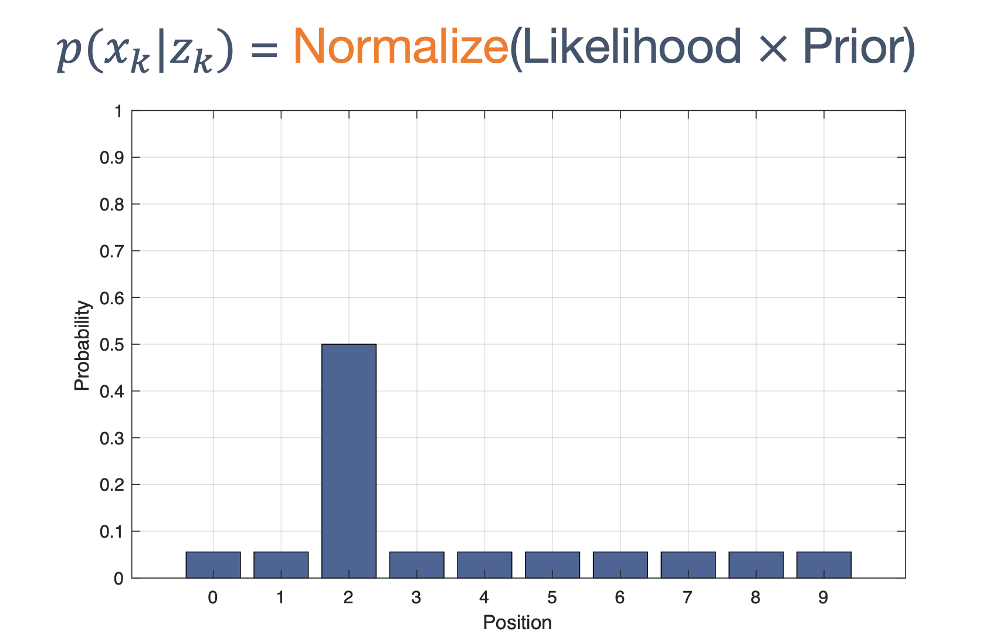

---

final value &rarr; the new belief aka **posterior**

---

final value &rarr; the new belief aka **posterior**

$$
p\left(x_{k} \mid z_{k}\right)
$$ 

---

final value &rarr; the new belief aka **posterior**

$$
\pmb{p\left(x_{k} \mid z_{k}\right)}=\frac{p\left(z_{k} \mid x_{k}\right) \times p\left(x_{k}\right)}{p\left(z_{k}\right)}
$$

probability **after incorporating measurement**

---

**formal calculations** for following example  &rarr; textbook

---

to calculate, 

$$
p\left(x_{0}=2 \mid z_{0}=2\right)=\square
$$

---

<!-- .slide: data-background="white" -->

**normalized** probability distribution

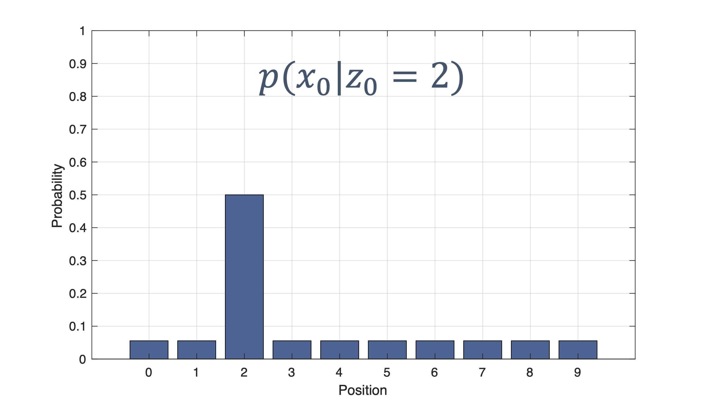

---

sensor gives &rarr; $z_{1}=2$ with same likelihood (<scb>90%</scb> correct)

---

<!-- .slide: data-background="white" -->

updated, **normalized** probability distribution

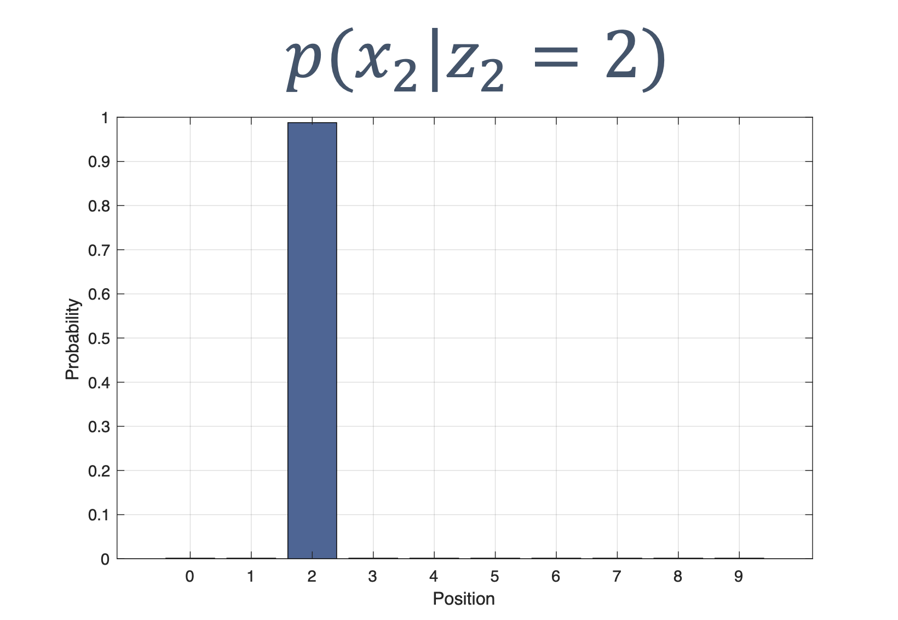

---

<!-- .slide: data-background="white" -->

continue calculating this for various values of <scb>k</scb>

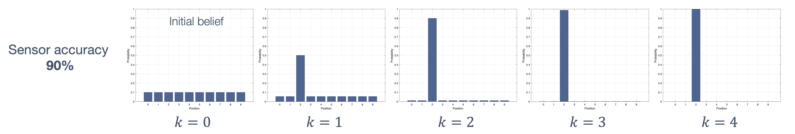

---

<!-- .slide: data-background="white" -->

continue calculating this for various values of <scb>k</scb>

why is only one bar increasing?

---

<!-- .slide: data-background="white" -->

the car is **stationary** at location <scb>2</scb>!

---

**drop the sensor accuracy** &rarr; <scb>60%</scb>

---

<!-- .slide: data-background="white" -->

**drop the sensor accuracy** &rarr; <scb>60%</scb>

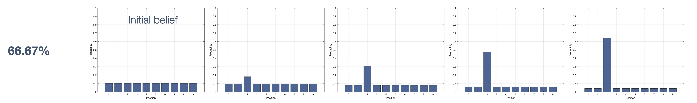

---

<!-- .slide: data-background="white" -->

**drop the sensor accuracy** &rarr; <scb>60%</scb>

confidence in measurement increases &rarr; at a much slower rate

---

<!-- .slide: data-background="white" -->

drop it further &rarr; <scb>50%</scb>

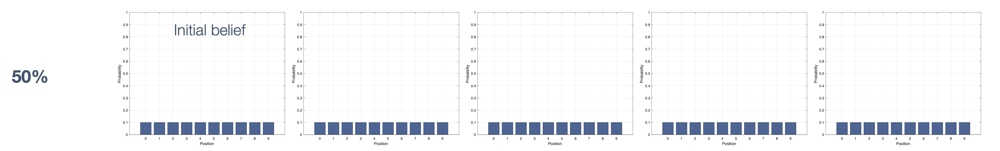

---

<!-- .slide: data-background="white" -->

drop it further &rarr; <scb>50%</scb>

nothing changes? 

---

sensor &rarr; **not providing any additional information**! 

Note:
The $50 \%$ rate keeps it at the same belief level as everything else 

---

### Bayes filter | **Combining** Prediction and Measurement

---

### Bayes filter | **Combining** Prediction and Measurement

- prediction **loses** information

---

### Bayes filter | **Combining** Prediction and Measurement

- prediction **loses** information
- measurement **improves** knowledge &rarr; decreases uncertainty

---

**combine** &rarr; prediction and measurement

---

same initial position initial position &rarr; <scb>2</scb>

---

### motion model

| sensor output | meaning | accuracy |
|---------------|---------|----------|
| `0` | **stay** | $10 \%$ |
| `+1` | move forward by `1`| $80 \%$ |
| `+2` | move forward by `2` | $10 \%$ |
||

---

**motion model** can be represented as:

$$
p\left(x_{k} \mid x_{k-1}=i\right)
$$

---

**motion model** can be represented as:

$$
p\left(x_{k} \mid x_{k-1}=i\right)
$$

_i.e.,_ what is probability of $x_k$, given $x_{k-1} = i$?

---

### motion model

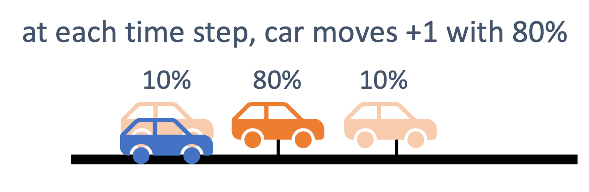

---

given the **posterior** at time $k-1$, 

$$
p\left(x_{k-1}=i \mid z_{k-1}\right)
$$

---

combined model, _i.e.,_ the **new prior**, 

$$
p\left(x_{k}\right)=\sum_{i} p\left(x_{k} \mid x_{k-1}=i\right) p\left(x_{k-1}=i \mid z_{k-1}\right)
$$

---

<!-- .slide: data-background="white" -->

start with,

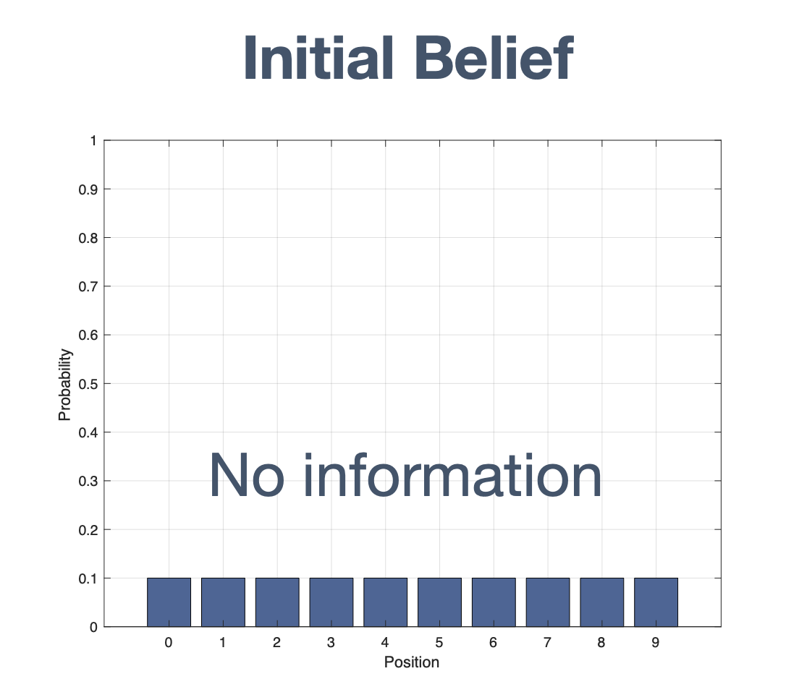

---

<!-- .slide: data-background="white" -->

time $t=0$ &rarr; the predictions and updates:

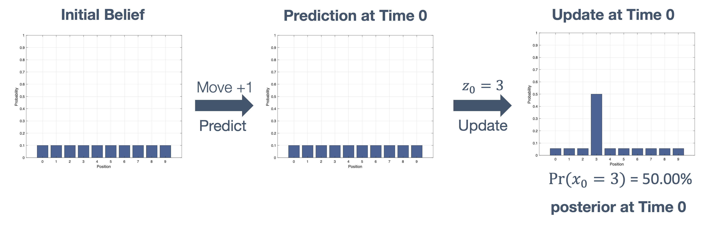

---

**note**: result is **new posterior** &rarr; use in future cycles as, 

---

**note**: result is **new posterior** &rarr; use in future cycles as, 

$$
p\left(x_{k}\right)=\sum_{i} p\left(x_{k} \mid x_{k-1}=i\right) p\left(x_{k-1}=i \mid z_{k-1}\right)
$$

--- 

<!-- .slide: data-background="white" -->

hence,

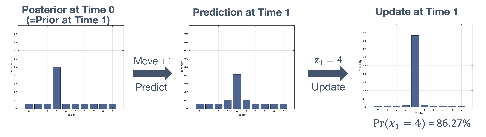

--- 

<!-- .slide: data-background="white" -->

hence,

confidence in prediction and belief in system &rarr; both **increase**

---

<!-- .slide: data-background="white" -->

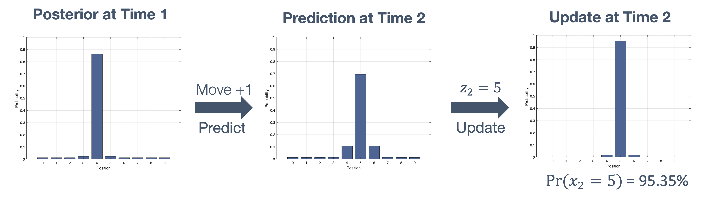

---

<!-- .slide: data-background="white" -->

when the measurement matches the prediction &rarr; **uncertainty decreases**

Note: 
- see text for more details
- example of car note moving

---

if we **don't** follow the motion model?

---

<!-- .slide: data-background="white" -->

if we **don't** follow the motion model?

car moved by <scb>2</scb> (instead of <scb>1</scb>)

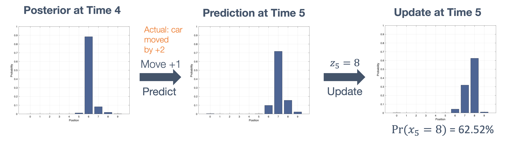

---

<!-- .slide: data-background="white" -->

car moved by <scb>2</scb> (instead of <scb>1</scb>)

- **true position** &rarr; <scb>8</scb> 

---

<!-- .slide: data-background="white" -->

car moved by <scb>2</scb> (instead of <scb>1</scb>)

- **true position** &rarr; <scb>8</scb> 
- prediction based on &rarr; **original motion model**

---

<!-- .slide: data-background="white" -->

car moved by <scb>2</scb> (instead of <scb>1</scb>)

- **true position** &rarr; <scb>8</scb> 
- prediction based on &rarr; **original motion model**
- the **confidence drops**!

---

<!-- .slide: data-background="white" -->

if we get back to the original motion model (<scb>+1</scb>),

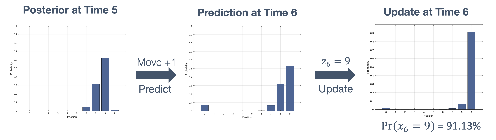

get back to high confidence levels, **really quickly**!

---

### bayes filter | **summary**

---

### bayes filter | **summary**

---

### bayes filter | **summary**

1. **predict** 

---

### bayes filter | **summary**

1. **predict** 
    - calculate the prior, $p\left(x_{k}\right)$, from the previous posterior, $p\left(x_{k-1} \mid z_{k-1}\right)$ 
---

### bayes filter | **summary**

1. **predict** 
    - calculate the prior, $p\left(x_{k}\right)$, from the previous posterior, $p\left(x_{k-1} \mid z_{k-1}\right)$ 
    - by incorporating the motion (process) model, 
    
---

### bayes filter | **summary**

1. **predict** 
    - calculate the prior, $p\left(x_{k}\right)$, from the previous posterior, $p\left(x_{k-1} \mid z_{k-1}\right)$ 
    - by incorporating the motion (process) model, 
    
$$
p\left(x_{k}\right)=\sum_{i} p\left(x_{k} \mid x_{k-1}=i\right) p\left(x_{k-1}=i \mid z_{k-1}\right)
$$

---

### bayes filter | **summary**

1. predict
2. **update** 

---

### bayes filter | **summary**

2. **update** 
    - given a measurement, $z_{k}$, compute the likelihood

---

### bayes filter | **summary**

2. **update** 
    - given a measurement, $z_{k}$, compute the likelihood
    - from likelihood+prior, apply Bayes Rule to update belief:

---

### bayes filter | **summary**

2. **update** 
    - given a measurement, $z_{k}$, compute the likelihood
    - from likelihood+prior, apply Bayes Rule to update belief:

$$
p\left(x_{k} \mid z_{k}\right)=\frac{p\left(z_{k} \mid x_{k}\right) \times p\left(x_{k}\right)}{p\left(z_{k}\right)}
$$

---

### bayes filter | **summary**

2. **update** 
    - given a measurement, $z_{k}$, compute the likelihood
    - from likelihood+prior, apply Bayes Rule to update belief:

$$
p\left(x_{k} \mid z_{k}\right)=\frac{p\left(z_{k} \mid x_{k}\right) \times p\left(x_{k}\right)}{p\left(z_{k}\right)}
$$

where, $p\left(z_{k}\right)=\sum_{x} p\left(z_{k} \mid x\right) p(x)$

---

### bayes filter | **limitations**

---

### bayes filter | **limitations**

- **discrete** in nature

---
                      
### bayes filter | **limitations**

- **discrete** in nature
- **example**: 
    - robot needs <scb>1 cm</scb> resolution in <scb>100m</scb> space 
    - <scb>10,000</scb> positions needed to model the environment!

---

### bayes filter | **limitations**

- **discrete** in nature
- **scaling** is much harder

---

### bayes filter | **limitations**

- **discrete** in nature
- **scaling** is much harder 
    - especially in the multidimensional systems

---

### bayes filter | **limitations**

- **discrete** in nature
- **scaling** is much harder 
    - especially in the multidimensional systems
    - **example**: how to model original state of car?

$$
\boldsymbol{x}_{\boldsymbol{k}}=(x, \dot{x}, \ddot{x}, y, \dot{y}, \ddot{y}, \theta)
$$

---

**update** Bayes model

---

**update** Bayes model &rarr; enter **Kalman Filter**