# Kalman Filter

## **Design of Autonomous Systems**
### csci 6907/4907-Section 86
### Prof. **Sibin Mohan**

---

**Kalman Filter** express state and uncertainty &rarr; **Gaussians** distributions

---

<!-- .slide: data-background="white" -->

### kalman filters and gaussians

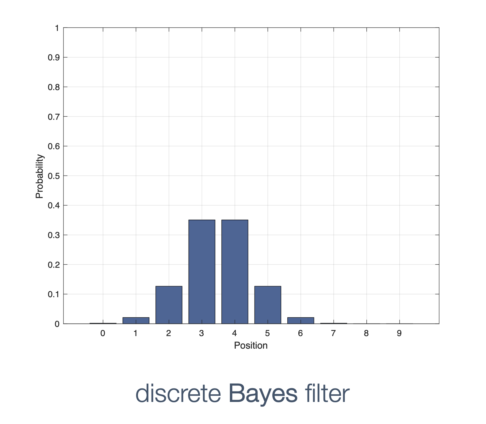
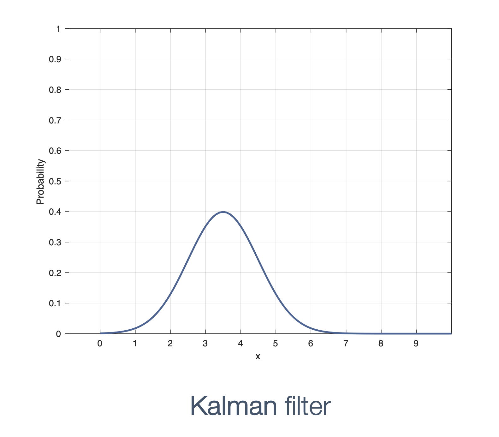

---

### Gaussian Distribution

---

### Gaussian Distribution

**continuous probability distribution** 

---

### Gaussian Distribution

**continuous probability distribution** &rarr; **real-valued random variable** 

---

### Gaussian Distribution

**continuous probability distribution** &rarr; **real-valued random variable** 

 

$$
\mathcal{N}\left(\mu, \sigma^{2}\right)=\frac{1}{\sqrt{2 \pi \sigma^{2}}} e^{-\frac{(x-\mu)^{2}}{2 \sigma^{2}}} 
$$

---

### Gaussian Distribution

**continuous probability distribution** &rarr; **real-valued random variable** 

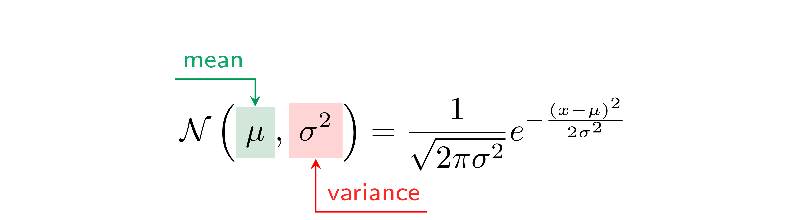

---

### Gaussian Distribution

a very common Gaussian:

---

### Gaussian Distribution

a very common Gaussian:

 

---

### Gaussian Distribution

**variance** ($\sigma^2$) &rarr; captures the **uncertainty** in system 

---

### Gaussian Distribution

**variance** ($\sigma^2$) &rarr; captures the **uncertainty** in system 

the **square** of standard deviation ($\sigma$)

---

various types of "uncertainty"

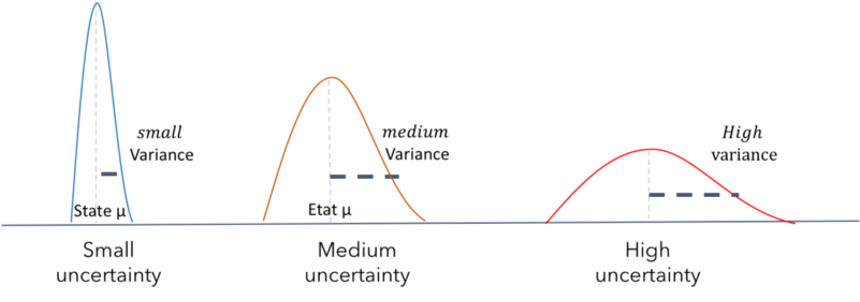

---

more specific examples:

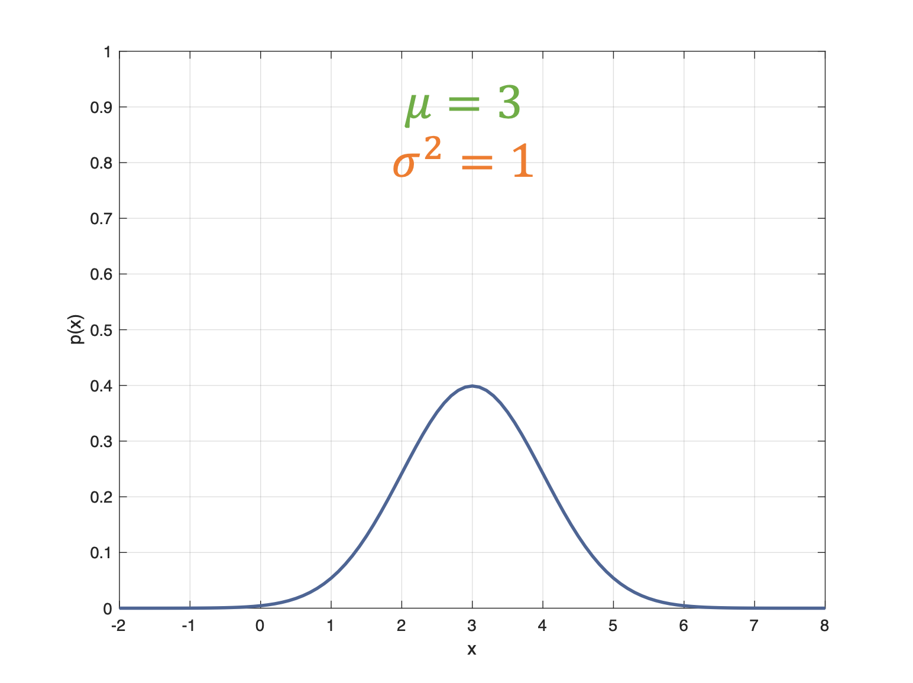
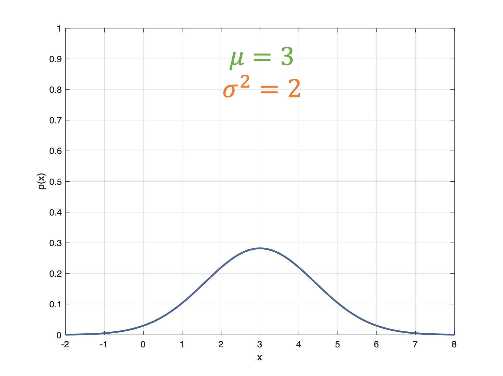
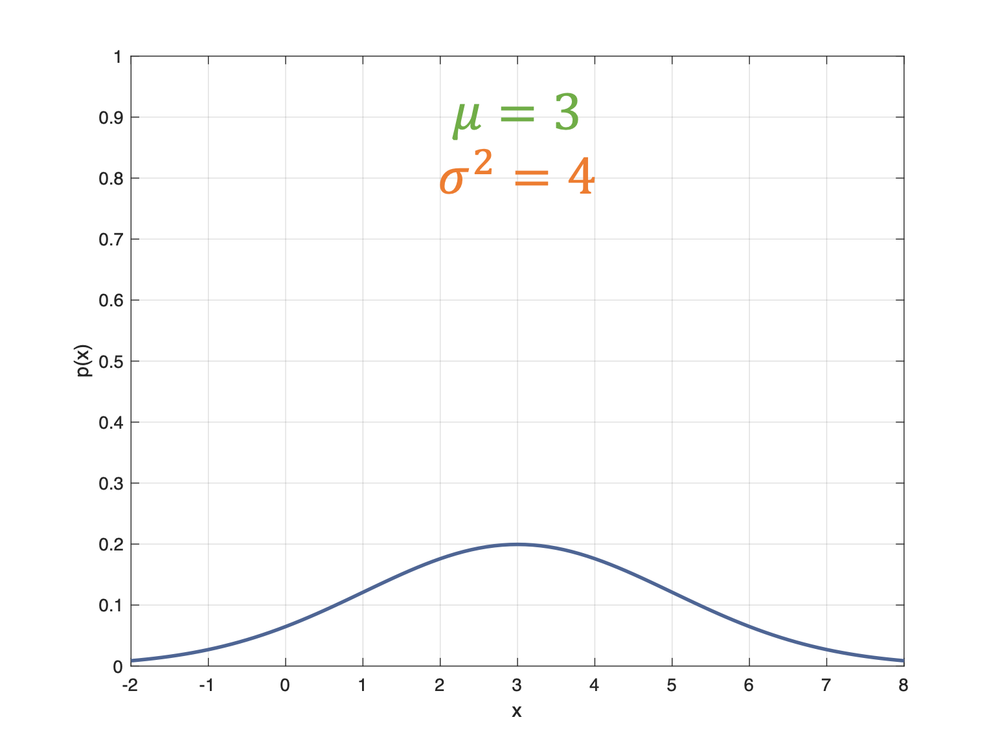

---

### some properties of Gaussians

---

### some properties of Gaussians

1. **area** under curve = <scb>1</scb> 

Note:
- any guesses why?

---

### some properties of Gaussians

1. **area** under curve = <scb>1</scb> 

(since it is the sum of all the probabilities)

---

### some properties of Gaussians

1. **area** under curve = <scb>1</scb> 

$$
area = \int_{-\infty}^{+\infty} \mathcal{N}\left(\mu, \sigma^{2}\right)
$$

---

$$
area = \int_{-\infty}^{+\infty} \mathcal{N}\left(\mu, \sigma^{2}\right)
$$

- curve approaches **infinity** ($\infty$) on **either side** 
- the probability of certain events is **never** <scb>0</scb> &rarr; no matter how small!

---

### some properties of Gaussians

1. **area** under curve = <scb>1</scb> 

$$
area = \int_{-\infty}^{+\infty} \frac{1}{\sqrt{2 \pi \sigma^{2}}} e^{-\frac{(x-\mu)^{2}}{2 \sigma^{2}}} = \textbf{1}
$$

---

### some properties of Gaussians

2. probability that a value, $x$ &rarr; is in a **range**, $(a,b)$:

$$
\operatorname{Pr}(a \leq x \leq b)=\int_{a}^{b} \frac{1}{\sqrt{2 \pi \sigma^{2}}} e^{-\frac{(x-\mu)^{2}}{2 \sigma^{2}}} d x
$$

---

### some properties of Gaussians

3. probability **within one standard deviation** (on either side), 

$$
\operatorname{Pr}(\mu-\sigma \leq x \leq \mu+\sigma)=\int_{\mu-\sigma}^{\mu+\sigma} \frac{1}{\sqrt{2 \pi \sigma^{2}}} e^{-\frac{(x-\mu)^{2}}{2 \sigma^{2}}} d x \approx \textbf{68 \%}
$$

---

### some properties of Gaussians

4. **sum** and **product** of two Gaussian distributions &rarr; **easy** to calculate

---

given, two Gaussians,

$X_{1} \sim \mathcal{N}\left(\mu_{1}, \sigma_{1}^{2}\right)$

$X_{2} \sim \mathcal{N}\left(\mu_{2}, \sigma_{2}^{2}\right)
$

---

### sum and product of Gaussians

|result| sum | |
|------|-----|--------|
| **new** Gaussian, $Z \sim \mathcal{N}\left(\mu, \sigma^{2}\right)$ | $Z=X_{1}+X_{2}$ | |

---

### sum and product of Gaussians

|result| sum | |
|------|-----|--------|
| **new** Gaussian, $Z \sim \mathcal{N}\left(\mu, \sigma^{2}\right)$ | $Z=X_{1}+X_{2}$ | |
| new **mean**, $\mu$ | $\mu_{1}+\mu_{2}$ | |

---

### sum and product of Gaussians

|result| sum | |
|------|-----|--------|
| **new** Gaussian, $Z \sim \mathcal{N}\left(\mu, \sigma^{2}\right)$ | $Z=X_{1}+X_{2}$ | |
| new **mean**, $\mu$ | $\mu_{1}+\mu_{2}$ | |
| new **variance**, $\sigma^{2}$ | $\sigma_{1}^{2}+\sigma_{2}^{2}$ | |

---

### sum and product of Gaussians

|result| sum | product|
|------|-----|--------|
| **new** Gaussian, $Z \sim \mathcal{N}\left(\mu, \sigma^{2}\right)$ | $Z=X_{1}+X_{2}$ | |
| new **mean**, $\mu$ | $\mu_{1}+\mu_{2}$ | |
| new **variance**, $\sigma^{2}$ | $\sigma_{1}^{2}+\sigma_{2}^{2}$ | |
||

---

### sum and product of Gaussians

|result| sum | product|
|------|-----|--------|
| **new** Gaussian, $Z \sim \mathcal{N}\left(\mu, \sigma^{2}\right)$ | $Z=X_{1}+X_{2}$ | $Z=X_{1} X_{2}$ |
| new **mean**, $\mu$ | $\mu_{1}+\mu_{2}$ | |
| new **variance**, $\sigma^{2}$ | $\sigma_{1}^{2}+\sigma_{2}^{2}$ | |
||

---

### sum and product of Gaussians

|result| sum | product|
|------|-----|--------|
| **new** Gaussian, $Z \sim \mathcal{N}\left(\mu, \sigma^{2}\right)$ | $Z=X_{1}+X_{2}$ | $Z=X_{1} X_{2}$ |
| new **mean**, $\mu$ | $\mu_{1}+\mu_{2}$ | $\mu=\frac{\sigma_{2}^{2} \mu_{1}+\sigma_{1}^{2} \mu_{2}}{\sigma_{1}^{2}+\sigma_{2}^{2}}$ |
| new **variance**, $\sigma^{2}$ | $\sigma_{1}^{2}+\sigma_{2}^{2}$ | |
||

---

### sum and product of Gaussians

|result| sum | product|
|------|-----|--------|
| **new** Gaussian, $Z \sim \mathcal{N}\left(\mu, \sigma^{2}\right)$ | $Z=X_{1}+X_{2}$ | $Z=X_{1} X_{2}$ |
| new **mean**, $\mu$ | $\mu_{1}+\mu_{2}$ | $\mu=\frac{\sigma_{2}^{2} \mu_{1}+\sigma_{1}^{2} \mu_{2}}{\sigma_{1}^{2}+\sigma_{2}^{2}}$ |
| new **variance**, $\sigma^{2}$ | $\sigma_{1}^{2}+\sigma_{2}^{2}$ | $\sigma^{2}=\frac{\sigma_{1}^{2} \sigma_{2}^{2}}{\sigma_{1}^{2}+\sigma_{2}^{2}}$ |
||

---

### some properties of Gaussians

5. **closure** under **linear transformations**

---

### some properties of Gaussians

5. **closure** under **linear transformations**

linear transformation on Gaussian &rarr; **result remains a Gaussian**! 

---

### some properties of Gaussians

5. **closure** under **linear transformations**

ensures that Kalman Filter equations remain,

- elegant and 
- manageable

---

### **State** in Kalman Filter
---

### **State** in Kalman Filters

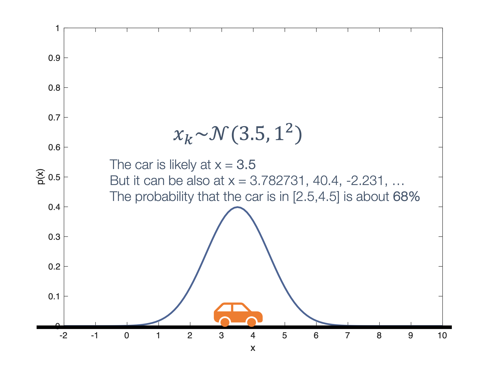

---

**prior** &harr; **measurement** &harr; **update** process 

---

<!-- .slide: data-background="white" -->

**prior** &harr; **measurement** &harr; **update** process 

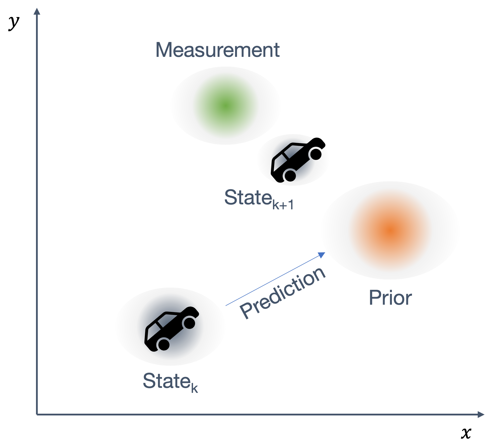

---

<!-- .slide: data-background="white" -->

prediction and measurements &rarr; not single points &rarr; **distributions**

---

### Kalman Filter | **transitions**

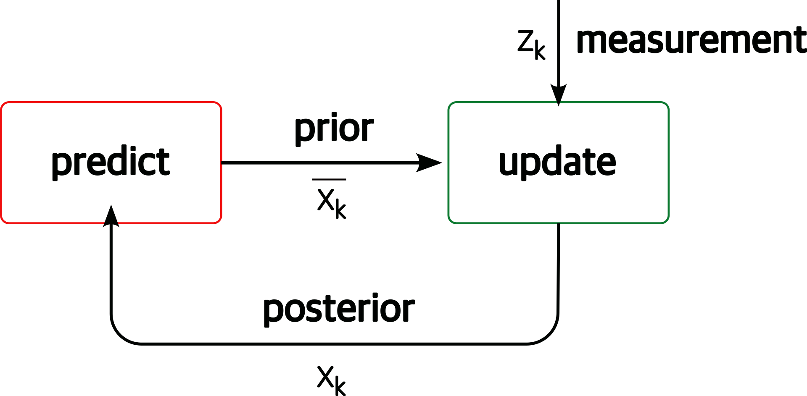

similar to Bayes Filter &rarr; each edge is now **probabilistic Gaussian value**

---

### Kalman Filter | **Prediction**

---

**process model** * is also a Gaussian! 

[*_i.e.,_ model of how system evolves over time &rarr; physics model]

---

**process model** * is also a Gaussian! 

equations of motion &rarr; _velocity_ follows a Gaussian distribution 

---

we want to track motion of car

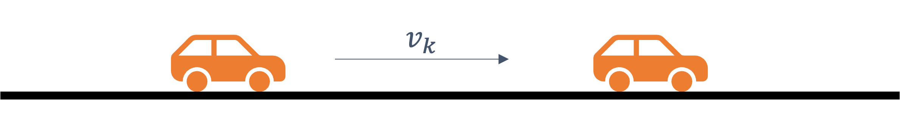

---

**predict** next state using following **process model**:

$$
\overline{x_{k+1}}=x_{k} +v_{k} \Delta t
$$

[Newton's laws of motion]

---

$$
\overline{x_{k+1}}=x_{k} +v_{k} \Delta t
$$

|variable | description
|---------|-----------|
| $x_{k}$ | current state |

---

$$
\overline{x_{k+1}}=x_{k} +v_{k} \Delta t
$$

|variable | description
|---------|-----------|
| $x_{k}$ | current state |
| $x_{k+1}$ | **predicted** next state |

---

$$
\overline{x_{k+1}}=x_{k} +v_{k} \Delta t
$$

|variable | description
|---------|-----------|
| $x_{k}$ | current state |
| $x_{k+1}$ | **predicted** next state |
| **$v_{k}$** | velocity|

---

$$
\overline{x_{k+1}}=x_{k} +v_{k} \Delta t
$$

|variable | description
|---------|-----------|
| $x_{k}$ | current state |
| $x_{k+1}$ | **predicted** next state |
| **$v_{k}$** | velocity|
| $\Delta t$ | time difference |
||

---

velocity &rarr; Gaussian distribution

---

velocity &rarr; Gaussian distribution

$$
v_{k} \sim \mathcal{N} \left(3 m / \mathrm{s}, 1^{2} m^2/s^2 \right)
$$

---

**current** state, $x_k$ &rarr; Gaussian

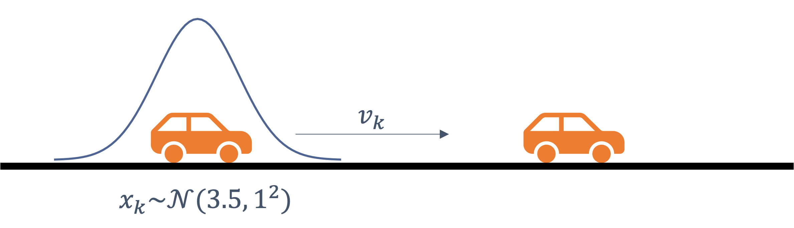

---

**predicted** state, $x_{k+1}$ &rarr; Gaussian *

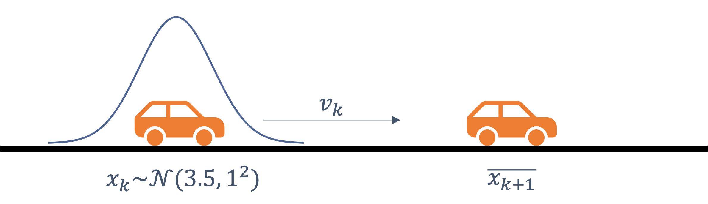

(* both current state **and** velocity are Gaussians)

---

$$
\overline{x_{k+1}} \sim \mathcal{N}\left(\pmb{?}\ \mathrm{m}, \pmb{?}\ \mathrm{m}^{2}\right) 
$$

---

recall, that **sum** of two Gaussians is,

$$
\mu =\mu_{1}+\mu_{2} 
$$
$$
\sigma^{2} =\sigma_{1}^{2}+\sigma_{2}^{2}
$$

---

assume $\Delta t = 1s$,

---

assume $\Delta t = 1s$,

$$
\overline{x_{k+1}} \sim \mathcal{N}\left(6.5 \mathrm{m}, 2 \mathrm{m}^{2}\right)
$$

---

assume $\Delta t = 1s$,

$$
\overline{x_{k+1}} \sim \mathcal{N}\left(6.5 \mathrm{m}, 2 \mathrm{m}^{2}\right)
$$

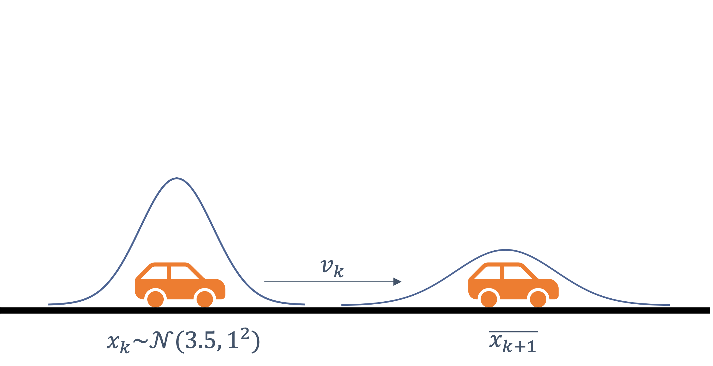

---

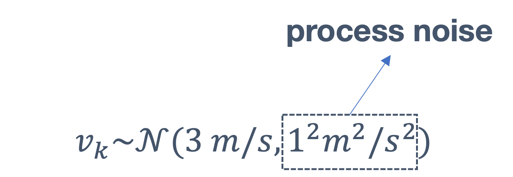

---

Kalman Filter &rarr; **unimodel** *

---

Kalman Filter &rarr; **unimodel** *

(* a **single peak** each time)

---

Kalman Filter &rarr; **unimodel** *

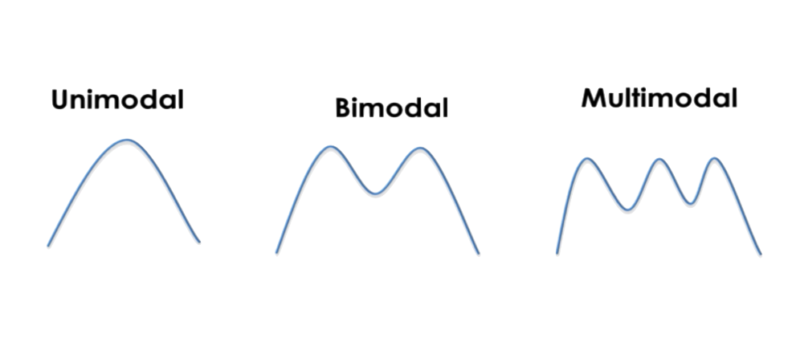

(* a **single peak** each time)

---

Kalman Filter &rarr; **unimodel** *

---

Kalman Filter &rarr; **unimodel** *

an obstacle is 

---

Kalman Filter &rarr; **unimodel** *

an obstacle is 

**not** both,

- $10m$ away (<scb>90%</scb> prob.) **and** 
- $8m$ away (<scb>70%</scb> prob.) 

---

Kalman Filter &rarr; **unimodel** *

an obstacle is 

**not** both,

- $10m$ away (<scb>90%</scb> prob.) **and** 
- $8m$ away (<scb>70%</scb> prob.) 

 

- *$9.7m$* away, <scb>98%</scb> prob. or 
- **nothing**

Note:
- this is from the viewpoint of a sngle sensor, state model

---

### Kalman Filter | **Prediction**

---

### Kalman Filter | **Prediction**

some examples &rarr; consider following velocity models:

|||
|----|----|
| **A** | $$v_{k} \sim \mathcal{N}\left(3 \mathrm{m} / \mathrm{s}, 0^{2} \mathrm{m}^{2} / \mathrm{s}^{2}\right)$$
| **B** | $$v_{k} \sim \mathcal{N}\left(3 \mathrm{m} / \mathrm{s}, 1^{2} \mathrm{m}^{2} / \mathrm{s}^{2}\right)$$
| **C** | $$v_{k} \sim \mathcal{N}\left(3 \mathrm{m} / \mathrm{s}, 2^{2} \mathrm{m}^{2} / \mathrm{s}^{2}\right)$$
||

---

the following **predicted** states:

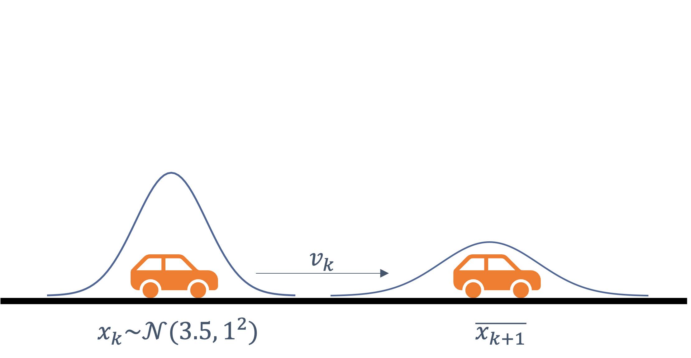 
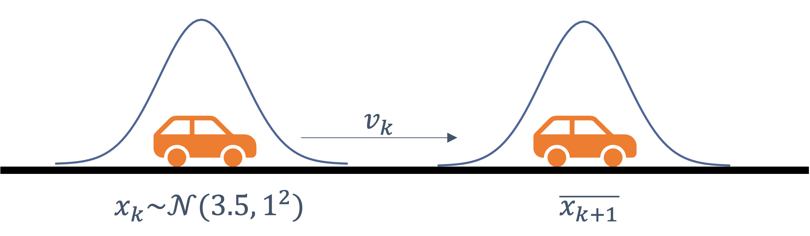 
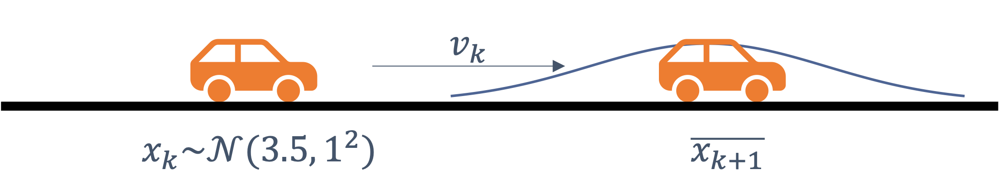

---

|prediction| velocity model|
|-----|----|
|  |   **A**, **B** or **C** ? |
|  | **A**, **B** or **C** ? |
|  | **A**, **B** or **C** ? |
||

---

 

|||
|----|----|
| **A** | $$v_{k} \sim \mathcal{N}\left(3 \mathrm{m} / \mathrm{s}, 0^{2} \mathrm{m}^{2} / \mathrm{s}^{2}\right)$$
| **B** | $$v_{k} \sim \mathcal{N}\left(3 \mathrm{m} / \mathrm{s}, 1^{2} \mathrm{m}^{2} / \mathrm{s}^{2}\right)$$
| **C** | $$v_{k} \sim \mathcal{N}\left(3 \mathrm{m} / \mathrm{s}, 2^{2} \mathrm{m}^{2} / \mathrm{s}^{2}\right)$$
||

---

|prediction| velocity model|
|-----|----|
|  | $v_{k} \sim \mathcal{N}\left(3 \mathrm{m} / \mathrm{s}, 1^{2} \mathrm{m}^{2} / \mathrm{s}^{2}\right)$ [**B**] |
|  | $v_{k} \sim \mathcal{N}\left(3 \mathrm{m} / \mathrm{s}, 0^{2} \mathrm{m}^{2} / \mathrm{s}^{2}\right)$ [**A**]|
|  | $v_{k} \sim \mathcal{N}\left(3 \mathrm{m} / \mathrm{s}, 2^{2} \mathrm{m}^{2} / \mathrm{s}^{2}\right)$ [**C**]|
||

---

what does **predicted** state look like?

---

|prediction| velocity model| predicted state |
|-----|----|------|
|  | $v_{k} \sim \mathcal{N}\left(3 \mathrm{m} / \mathrm{s}, 1^{2} \mathrm{m}^{2} / \mathrm{s}^{2}\right)$ | $\overline{x_{k+1}} \sim \mathcal{N}\left(6.5 \mathrm{m}, ? \mathrm{m}^{2}\right)$|
|  | $v_{k} \sim \mathcal{N}\left(3 \mathrm{m} / \mathrm{s}, 0^{2} \mathrm{m}^{2} / \mathrm{s}^{2}\right)$ | $\overline{x_{k+1}} \sim \mathcal{N}\left(6.5 \mathrm{m}, ? \mathrm{m}^{2}\right)$|
|  | $v_{k} \sim \mathcal{N}\left(3 \mathrm{m} / \mathrm{s}, 2^{2} \mathrm{m}^{2} / \mathrm{s}^{2}\right)$ | $\overline{x_{k+1}} \sim \mathcal{N}\left(6.5 \mathrm{m}, ? \mathrm{m}^{2}\right)$|
||

---

what does **predicted** state look like?

|prediction| velocity model| predicted state |
|-----|----|------|
|  | $v_{k} \sim \mathcal{N}\left(3 \mathrm{m} / \mathrm{s}, 1^{2} \mathrm{m}^{2} / \mathrm{s}^{2}\right)$ | |
|  | $v_{k} \sim \mathcal{N}\left(3 \mathrm{m} / \mathrm{s}, 0^{2} \mathrm{m}^{2} / \mathrm{s}^{2}\right)$ | |
|  | $v_{k} \sim \mathcal{N}\left(3 \mathrm{m} / \mathrm{s}, 2^{2} \mathrm{m}^{2} / \mathrm{s}^{2}\right)$ | |
||

---

**recall**, $\overline{x_{k}} \sim \mathcal{N}\left(3.5, 1^{2}\right)$  
$\mu =\mu_{1}+\mu_{2}$ and $\sigma^{2} =\sigma_{1}^{2}+\sigma_{2}^{2}$

|prediction| velocity model| predicted state |
|-----|----|------|
|  | $v_{k} \sim \mathcal{N}\left(3 \mathrm{m} / \mathrm{s}, 1^{2} \mathrm{m}^{2} / \mathrm{s}^{2}\right)$ | |
|  | $v_{k} \sim \mathcal{N}\left(3 \mathrm{m} / \mathrm{s}, 0^{2} \mathrm{m}^{2} / \mathrm{s}^{2}\right)$ | |
|  | $v_{k} \sim \mathcal{N}\left(3 \mathrm{m} / \mathrm{s}, 2^{2} \mathrm{m}^{2} / \mathrm{s}^{2}\right)$ | |
||

---

|prediction| velocity model| predicted state |
|-----|----|------|
|  | $v_{k} \sim \mathcal{N}\left(3 \mathrm{m} / \mathrm{s}, 1^{2} \mathrm{m}^{2} / \mathrm{s}^{2}\right)$ | $\overline{x_{k+1}} \sim \mathcal{N}\left(6.5 \mathrm{m}, 2 \mathrm{m}^{2}\right)$|
|  | $v_{k} \sim \mathcal{N}\left(3 \mathrm{m} / \mathrm{s}, 0^{2} \mathrm{m}^{2} / \mathrm{s}^{2}\right)$ | $\overline{x_{k+1}} \sim \mathcal{N}\left(6.5 \mathrm{m}, 1 \mathrm{m}^{2}\right)$|
|  | $v_{k} \sim \mathcal{N}\left(3 \mathrm{m} / \mathrm{s}, 2^{2} \mathrm{m}^{2} / \mathrm{s}^{2}\right)$ | $\overline{x_{k+1}} \sim \mathcal{N}\left(6.5 \mathrm{m}, 5 \mathrm{m}^{2}\right)$|
||

---

depending on **noise** in intial Gaussian &rarr; **uncertainty increases** 

even when velocity model had <scb>0</scb> noise! 

---

**problem** &rarr; don't know how **close** our prediction is to reality

---

**problem** &rarr; don't know how **close** our prediction is to reality

we need an **update** step &rarr; measurements!

---

### Kalman Filter | **Update**

---

### Kalman Filter | **Update**

**measurement uncertainty** (aka "likelihood") &rarr; also Gaussian
---

### Kalman Filter | **Update**

${z_{k}} \sim \mathcal{N}\left(\mu, \sigma^2\right)$

---

### Kalman Filter | **Update**

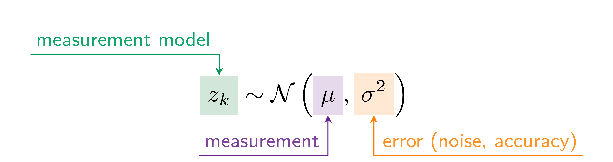

---

### Kalman Filter | **Update**

**example**: current temperature is $72^{\circ} \mathrm{F} \pm 1^{\circ} \mathrm{F}$

---

recall that,

$$
posterior = prior \times likelihood
$$

---

recall that,

$$
posterior = prior \times likelihood
$$
$$
posterior = \overline x_k \times z_k
$$

---

what does this **actually mean**?

---

consider a few examples...

---

### Example **1**

| prediction ($\overline x_{k}$) | measurement ($z_k$) | posterior ($\overline x_{k} \times z_k$) |
|----------|----------|----------|
|$\overline{x_{k}} \sim \mathcal{n}\left(5,1^{2}\right)$ | $z_{k} \sim \mathcal{n}\left(5,1^{2}\right)$ | **?** |
||

---

let's plot these two Gaussians,

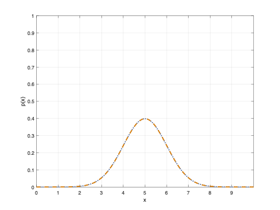

---

perfectly aligned &rarr; **same** distribution! 

---

| prediction ($\overline x_{k}$) | measurement ($z_k$) | posterior ($\overline x_{k} \times z_k$) |
|----------|----------|----------|
|$\overline{x_{k}} \sim \mathcal{N}\left(5,1^{2}\right)$ | $z_{k} \sim \mathcal{N}\left(5,1^{2}\right)$ | **?** |
||

what is $\overline{x_{k}} \times z_{k}$?

---

recall **product** of Gaussians,

$$
\mu =\frac{\sigma_{2}^{2} \mu_{1}+\sigma_{1}^{2} \mu_{2}}{\sigma_{1}^{2}+\sigma_{2}^{2}} \\
$$
$$
\sigma^{2} =\frac{\sigma_{1}^{2} \sigma_{2}^{2}}{\sigma_{1}^{2}+\sigma_{2}^{2}}
$$

---

hence, the **posterior**: 

| prediction ($\overline x_{k}$) | measurement ($z_k$) | posterior ($\overline x_{k} \times z_k$) |
|----------|----------|----------|
|$\overline{x_{k}} \sim \mathcal{N}\left(5,1^{2}\right)$ | $z_{k} \sim \mathcal{N}\left(5,1^{2}\right)$ | $\overline{x_k} \times z_k \sim \mathcal{N}(5,0.5)$ |
||

---

graphically,

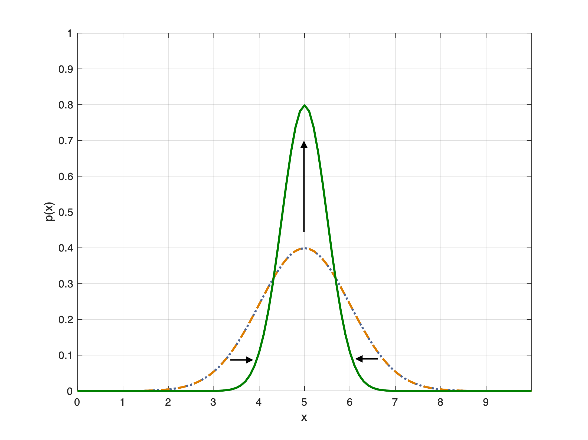

---
