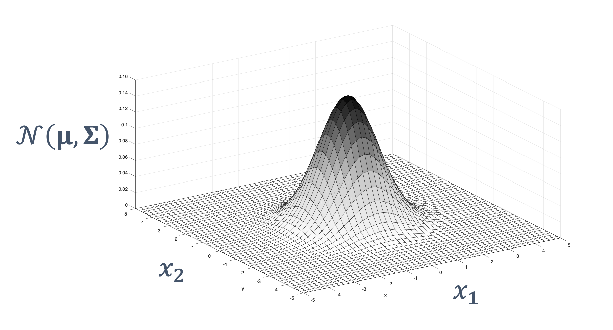
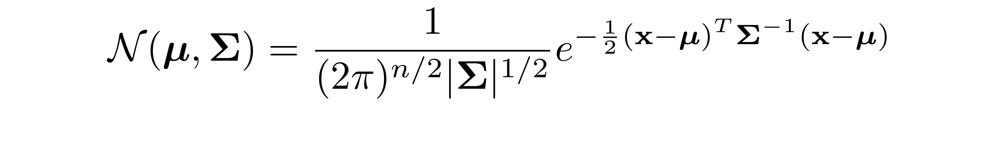
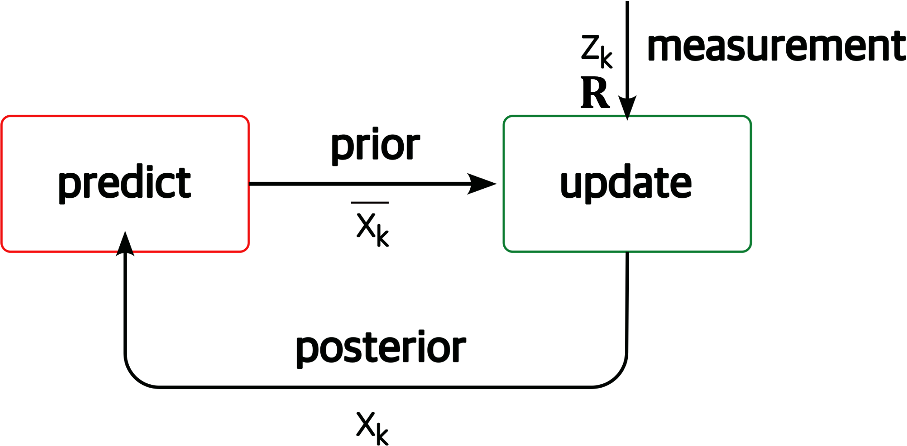
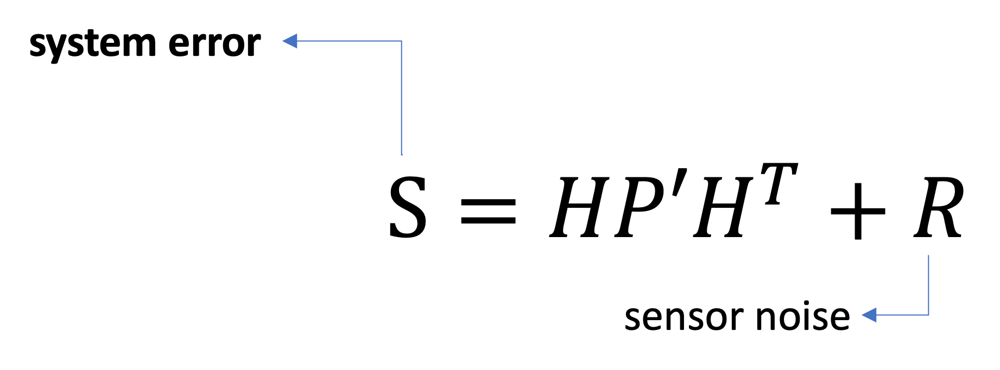
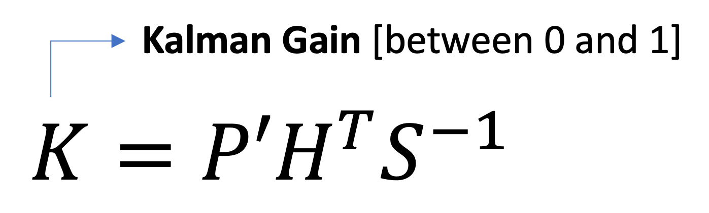
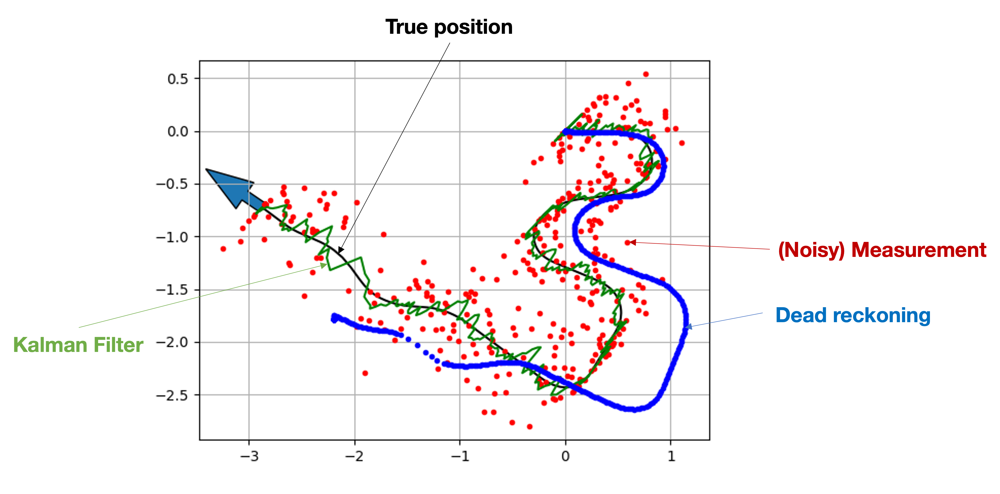

# **Multivariate** Kalman Filter

## **Design of Autonomous Systems**
### csci 6907/4907-Section 86
### Prof. **Sibin Mohan**

---

reality &rarr; state is a **multi-dimensional** vector

---

$$
state = 
\begin{bmatrix}
position \newline
velocity
\end{bmatrix}
$$

---

$$
state = 
\begin{bmatrix}
position, 
velocity
\end{bmatrix}^T
$$

---

<!-- .slide: data-background="white" -->

$$
state = 
\begin{bmatrix}
position, 
velocity
\end{bmatrix}^T
$$

**multivariate** Gaussian

---

**multivariate** Gaussian

---

**multivariate** Gaussian

|variable| definition | meaning |
|--------|---------|------------|
|$\mathbf{x}$ | $\left(x_{1}, x_{2}, \ldots, x_{n}\right)$ |state variable |

---

**multivariate** Gaussian

|variable| definition | meaning |
|--------|---------|------------|
|$\mathbf{x}$ | $\left(x_{1}, x_{2}, \ldots, x_{n}\right)$ |state variable |
|$\boldsymbol{\mu}$ | $\left(\mu_{1}, \mu_{2}, \ldots, \mu_{n}\right)$ | mean vector |

---

**multivariate** Gaussian

|variable| definition | meaning |
|--------|---------|------------|
|$\mathbf{x}$ | $\left(x_{1}, x_{2}, \ldots, x_{n}\right)$ |state variable |
|$\boldsymbol{\mu}$ | $\left(\mu_{1}, \mu_{2}, \ldots, \mu_{n}\right)$ | mean vector |
| $\Sigma$ | $\Sigma_{i, j}=\operatorname{Cov}\left(x_{i}, x_{j}\right)$ | covariance matrix|
||

---

<!-- .slide: data-background="black" -->

---

but read the textbook chapter on [multivariate Kalman Filters](https://autonomy-course.github.io/textbook/autonomy-textbook.html#multivariate-kalman-filter) please!

---

### multivariate kalman filter | **summary**

---

### multivariate kalman filter | **1. prediction**

 

---

### multivariate kalman filter | **1. prediction**

---

### multivariate kalman filter | **2. measurement update**

---

### multivariate kalman filter | **2. measurement update**

 

---

### multivariate kalman filter | **2. measurement update**

---

### multivariate kalman filter | **2. measurement update**

$\quad$

---

### multivariate kalman filter | **3. final update**

 

---

<!-- .slide: data-background="white" -->

**example**: 2D state estimation using multivariate Kalman filters

---

### problems with Kalman Filters

---

### problems with Kalman Filters

- only works for **linear** systems

---

### problems with Kalman Filters

- only works for **linear** systems
    - next state &rarr; linear function of previous state

---

### problems with Kalman Filters

- only works for **linear** systems
    - next state &rarr; linear function of previous state
- non-linear system example &rarr; falling object with air resistance 

---

### real world &rarr; **non-linear**!

---

### enter **extended kalman filter** (ekf)

