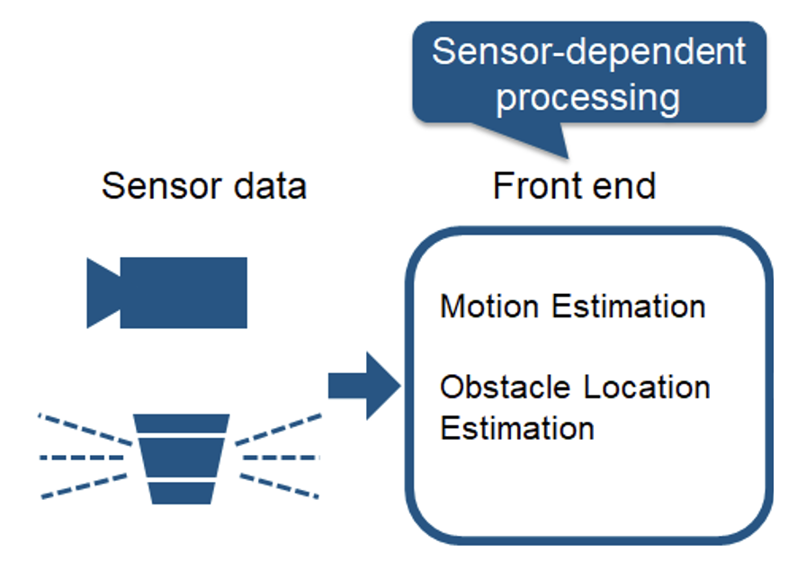
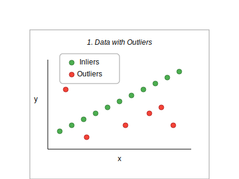
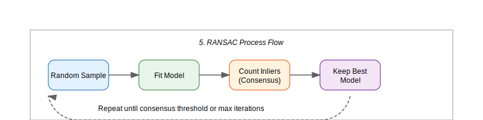

# SLAM

## **Design of Autonomous Systems**
### csci 6907/4907-Section 86
### Prof. **Sibin Mohan**

---

<!-- .slide: data-background="white" -->

consider a Roomba &rarr; navigate inside a room


---

consider a Roomba &rarr; navigate inside a room

- **randomly** move around the room
- **map** out room &rarr; ensure it covers the entire room

---

<!-- .slide: data-background="white" -->

consider a Roomba &rarr; navigate inside a room

- **randomly** move around the room
- **map** out room &rarr; ensure it covers the entire room

<br>


---

**map** out room &rarr; ensure it covers the entire room

---

**map** out room &rarr; ensure it covers the entire room

effective when room has &rarr; **obstacles** in it

_e.g.,_ a couch and other furniture

---

requires the robot to do,

---

requires the robot to do,

|||
|:---:|:---:|
|create a **map** of its surroundings | |
|  ||

---

requires the robot to do,

|||
|:---:|:---:|
|create a **map** of its surroundings | **locate** itself within that map|
|  | |
||

---

### enter **simultaneous localization and mapping** (SLAM) 

---

## SLAM

fundamental challenges in mobile robotics

---

## SLAM

solving **two** interconnected problems at once

---

## SLAM

solving **two** interconnected problems at once

1. building **map** &rarr; **unknown environment** while

---

## SLAM

solving **two** interconnected problems at once

1. building **map** &rarr; **unknown environment** while
2. **simultaneously tracking** &rarr; robot's position in that environment

Note:
The need for SLAM arises from a seemingly paradoxical situation: to build an accurate map, a robot needs to know its precise location, but to determine its precise location, the robot needs an accurate map. This chicken-and-egg problem is what makes SLAM challenging and fascinating.

---

SLAM &rarr; external positioning systems (GPS) are unavailable/unreliable

---

### examples

- indoor environments
- underground mines and caves
- underwater exploration
- planetary exploration
- dense urban areas with GPS signal blockage.

Note:
SLAM is more of a concept than a single algorithm. There are many approaches to implementing SLAM, varying in complexity, accuracy and computational requirements.

---

some examples of SLAM output

---

1. **grid maps** or **scans**

---

1. **grid maps** or **scans**

<br>


---

2. **landmark**-based

---

2. **landmark**-based

<br>


---

another **classification** &rarr; type of sensor (and corresponding outputs)

---

a. **visual slam** &rarr; cameras

---

a. **visual slam** &rarr; cameras

- sparse methods &rarr; match image features [PTAM, ORB_SLAM]

---

a. **visual slam** &rarr; cameras

- sparse methods &rarr; match image features [PTAM, ORB_SLAM]
- dense methods &rarr; image brightness [DTAM, LSD- SLAM, DSO, SVO]

---

<!-- .slide: data-background="white" -->

a. **visual slam** &rarr; cameras


- sparse methods &rarr; match image features [PTAM, ORB_SLAM]
- dense methods &rarr; image brightness [DTAM, LSD- SLAM, DSO, SVO]

<br>
<br>


---

b. **LiDAR SLAM**

---

b. **LiDAR SLAM**

- laser point cloud &rarr; high-precision distance measurements

---

b. **LiDAR SLAM**

- laser point cloud &rarr; high-precision distance measurements
- not as finely detailed as camera images

---

b. **LiDAR SLAM**

- laser point cloud &rarr; high-precision distance measurements
- not as finely detailed as camera images
- environments with fewer obstacles &rarr; less precision

---

b. **LiDAR SLAM**

- laser point cloud &rarr; high-precision distance measurements
- not as finely detailed as camera images
- environments with fewer obstacles &rarr; less precision
- may require fusion with other sensors (e.g., GPS, odometry)

---

<!-- .slide: data-background="white" -->

b. **LiDAR SLAM**

- laser point cloud &rarr; high-precision distance measurements
- not as finely detailed as camera images
- environments with fewer obstacles &rarr; less precision
- may require fusion with other sensors (e.g., GPS, odometry)

<br>


---

### SLAM Problem Definition

---

### SLAM Problem Definition

SLAM &rarr; a **state estimation problem** 

---

### SLAM Problem Definition

SLAM &rarr; a **state estimation problem** 

(hint, hint)

---

_given,_

---

_given,_

- robot's **control inputs** (odometry)

---

_given,_

- robot's **control inputs** (odometry)
- observations of **nearby features/landmarks**

---

_given,_

- robot's **control inputs** (odometry)
- observations of **nearby features/landmarks**
- no prior map

---

<div class="multicolumn">

<div>

_given,_

- robot's **control inputs** (odometry)
- observations of **nearby features/landmarks**
- no prior map

</div>

<div>

_objective_ &rarr; estimate,


</div>
</div>


---

<div class="multicolumn">

<div>

_given,_

- robot's **control inputs** (odometry)
- observations of **nearby features/landmarks**
- no prior map

</div>

<div>

_objective_ &rarr; estimate,

- the **map** of the environment

</div>
</div>


---

<div class="multicolumn">

<div>

_given,_

- robot's **control inputs** (odometry)
- observations of **nearby features/landmarks**
- no prior map

</div>

<div>

_objective_ &rarr; estimate,

- the **map** of the environment
- the **path**/current position

</div>
</div>

---

so why is SLAM a hard problem?

---

so why is SLAM a hard problem?

real world &rarr; mapping between observations and landmarks is **unknown**

---

so why is SLAM a hard problem?

real world &rarr; mapping between observations and landmarks is **unknown**

picking **wrong associations** &rarr; **catastrophic consequences**


---

### pose

<!-- .slide: data-background="white" -->


---

### pose

> the **position** and **orientation** of an object or a robot in a given space

---

### pose

**example** &rarr; $2D$ Pose (in planar systems)

- position: (x, y)

---

### pose

**example** &rarr; $2D$ Pose (in planar systems)

- position: (x, y)
- orientation: $\theta$ (rotation around the z-axis)

---

### various parts of SLAM

---

<!-- .slide: data-background="white" -->

### various parts of SLAM



---

<!-- .slide: data-background="white" -->

### various parts of SLAM

<div class="multicolumn">

<div>

<br>


</div>

<div>

**Sensor Data**
    
- input to SLAM, _e.g.,_ 
    - camera <br>
    (visual SLAM, extracting features from images)
	- LiDAR/depth sensor <br>
    (distance, obstacle)

</div>
</div>

---

<!-- .slide: data-background="white" -->

### various parts of SLAM

<div class="multicolumn">

<div>

<br>


</div>

<div>

**Sensor Data**
    
- input to SLAM, _e.g.,_ 
    - camera <br>
    (visual SLAM, extracting features from images)
	- LiDAR/depth sensor <br>
    (distance, obstacle)

</div>
</div>

capture **raw data** of environment

---

<!-- .slide: data-background="white" -->

### various parts of SLAM

<div class="multicolumn">

<div>


</div>

<div>

**Front End** (sensor processing)

- process sensor information 
- extract **meaningful** features
    - motion estimation
    - obstacle location 

</div>
</div>

---

<!-- .slide: data-background="white" -->

### various parts of SLAM

<div class="multicolumn">

<div>


</div>

<div>

**Front End** (sensor processing)

- process sensor information 
- extract **meaningful** features
    - motion estimation
    - obstacle location 

</div>
</div>


goal &rarr; **preprocess** sensor data+reduce noise

Note:
    - motion estimation: Determines how the robot is moving by tracking sensor data over time
    - obstacle location estimation: Identifies objects and landmarks in the environment

---

<!-- .slide: data-background="white" -->

### various parts of SLAM


---

<!-- .slide: data-background="white" -->

### various parts of SLAM

<div class="multicolumn">

<div>

<br>


</div>

<div>

**Back End** (sensor-independent)
	
- **global optimization** &rarr; estimated trajectory

</div>
</div>

---

<!-- .slide: data-background="white" -->

### various parts of SLAM

<div class="multicolumn">

<div>

<br>


</div>

<div>

**Back End** (sensor-independent)
	
- **global optimization** &rarr; estimated trajectory
- **sensor-independent**
    - data from different sensors 

</div>
</div>

---

<!-- .slide: data-background="white" -->

### various parts of SLAM

<div class="multicolumn">

<div>

<br>


</div>

<div>

**Back End** (sensor-independent)
	
- **global optimization** &rarr; estimated trajectory
- **sensor-independent**
    - data from different sensors 
- **processed pose+landmark**
    - register pose graphs
	- graph optimization 

</div>
</div>

Note:
    - **register pose graphs** &rarr; combines different pose estimates into a coherent structure
	- graph optimization &rarr; uses mathematical optimization techniques (e.g., bundle adjustment, factor graphs) to refine the trajectory and correct drift

---

<!-- .slide: data-background="white" -->

### various parts of SLAM

<div class="multicolumn">

<div>

<br>


</div>

<div>

**Back End** (sensor-independent)
	
- **global optimization** &rarr; estimated trajectory
- **sensor-independent**
    - data from different sensors 
- **processed pose+landmark**
    - register pose graphs
	- graph optimization 

</div>
</div>

**corrects errors** accumulating over time &rarr; **more accurate map**


---

<!-- .slide: data-background="white" -->

### various parts of SLAM


<br>

there is **feedback** provided to the front end


---

<!-- .slide: data-background="white" -->

### various parts of SLAM


---

<!-- .slide: data-background="white" -->

### various parts of SLAM

<div class="multicolumn">

<div>

<br>


</div>

<div>

**Pose Graph/Map**

- **final output** &rarr; **pose graph**
- map constructed &rarr; **optimized pose estimates**

</div>
</div>


Note:
- pose graph:  (a representation of the robot’s trajectory) and a map of the environment

---

<!-- .slide: data-background="white" -->

### various parts of SLAM

<div class="multicolumn">

<div>

<br>


</div>

<div>

**Pose Graph/Map**

- **final output** &rarr; **pose graph**
- map constructed &rarr; **optimized pose estimates**

</div>
</div>

map &rarr; for navigation, obstacle avoidance, autonomous decision-making


---

| component | description |
|-----------|---|
| front end (sensor-dependent) | processes raw sensor data (motion estimation, obstacle detection) |
| back end (sensor-independent) | optimizes trajectory+map |
| final output | refined pose graph+map for accurate navigation |
||

Note:

This structured approach ensures real-time and accurate localization while reducing computational complexity. 

---

distill previous steps,


---

distill previous steps,

| step |description  |
|-------|--------|
| **prediction step**  | update the robot's position estimate using odometry data (motion model) |

---

distill previous steps,

| step |description  |
|-------|--------|
| **prediction step**  | update the robot's position estimate using odometry data (motion model) |
| **landmark extraction** | identify landmarks or features from sensor measurements |

---

distill previous steps,

| step |description  |
|-------|--------|
| **prediction step**  | update the robot's position estimate using odometry data (motion model) |
| **landmark extraction** | identify landmarks or features from sensor measurements |
| **data association** | match observed landmarks with previously mapped landmarks |

---

distill previous steps [contd.]

| step |description  |
|-------|--------|
| **update step** | update robot position and landmark estimates based on observations |

---

distill previous steps [contd.]

| step |description  |
|-------|--------|
| **update step** | update robot position and landmark estimates based on observations |
| **map expansion** | add newly observed landmarks to the map |
||

---

there are some challenges that need to be overcome...

---

### challenges

| step |description  | challenge  |
|-------|--------|--------|
| **prediction step**  | update the robot's position estimate using odometry data (motion model) | **correlated errors** in position estimation affect the map |

---

### challenges

| step |description  | challenge  |
|-------|--------|--------|
| **prediction step**  | update the robot's position estimate using odometry data (motion model) | **correlated errors** in position estimation affect the map |
| **landmark extraction** | identify landmarks or features from sensor measurements | **environmental dynamics** may cause landmarks to change |

---

### challenges [contd.]

| step |description  | challenge  |
|-------|--------|--------|
| **data association** | match observed landmarks with previously mapped landmarks | **incorrect associations** lead to mapping errors |

---

### challenges [contd.]

| step |description  | challenge  |
|-------|--------|--------|
| **data association** | match observed landmarks with previously mapped landmarks | **incorrect associations** lead to mapping errors |
| **update step** | update robot position and landmark estimates based on observations | **computational complexity** increases with more data |

---

### challenges [contd.]

| step |description  | challenge  |
|-------|--------|--------|
| **map expansion** | add newly observed landmarks to the map | loop closure* is required to recognize **revisited** places |
||

---

### challenges [contd.]

| step |description  | challenge  |
|-------|--------|--------|
| **map expansion** | add newly observed landmarks to the map | loop closure* is required to recognize **revisited** places |
||

[* recognizing when a robot/vehicle is at **previously visited location**]

---

## Mathematical Formulations

---

let's define some terms,

| symbol   | meaning  |
|----------|-----------|
| $x_{1:t}$ | robot path |
| $m$ | map |
| $z_{1:t}$ | sensor observations |
| $u_{1:t}$ | control inputs|
||

---

**two** types of SLAM:

---

**two** types of SLAM:

1. **full** SLAM

---

**two** types of SLAM:

1. **full** SLAM
2. **online** SLAM

---

### 1. **full** SLAM

estimates the **entire** robot path and map

---

<!-- .slide: data-background="white" -->

### 1. **full** SLAM

estimates the **entire** robot path and map


---

<!-- .slide: data-background="white" -->

### 1. **full** SLAM

<div class="multicolumn">

<div>


</div>

<div>

model estimates.

- **entire trajectory** $x_{1:t}$ 
- map, $m$

</div>
</div>


---

<!-- .slide: data-background="white" -->

### 1. **full** SLAM

<div class="multicolumn">

<div>


</div>

<div>

model estimates.

- **entire trajectory** $x_{1:t}$ 
- map, $m$
$$
p(x_{1:t}, m | z_{1:t}, u_{1:t})
$$ 

</div>
</div>


---

<!-- .slide: data-background="white" -->

### 1. **full** SLAM

<div class="multicolumn">

<div>


</div>

<div>

model estimates.

- **entire trajectory**, $x_{1:t}$ 
- map, $m$
$$
p(x_{1:t}, m | z_{1:t}, u_{1:t})
$$ 
- joint probability

</div>
</div>


---

<!-- .slide: data-background="white" -->

### 1. **full** SLAM

<div class="multicolumn">

<div>


</div>

<div>

model estimates.

- **entire trajectory**, $x_{1:t}$ 
- map $m$
$$
p(x_{1:t}, m | z_{1:t}, u_{1:t})
$$ 
- joint probability
- all past and current poses

</div>
</div>

---

<!-- .slide: data-background="white" -->

### 1. **full** SLAM

<div class="multicolumn">

<div>


</div>

<div>

model estimates.

- **entire trajectory**, $x_{1:t}$ 
- map, $m$
$$
p(x_{1:t}, m | z_{1:t}, u_{1:t})
$$ 
- joint probability
- all past and current poses

</div>
</div>

<br>

**smoothing** &rarr; refine past estimates when new observations received

Note:
- gray-shaded area (from the figure) covers all past poses $x_{1:t}$, indicating that they are explicitly maintained in the estimation

---

### 2. **online** SLAM

estimates only **most recent** robot pose and map


---

<!-- .slide: data-background="white" -->

### 2. **online** SLAM

estimates only **most recent** robot pose and map


---

<!-- .slide: data-background="white" -->

### 2. **online** SLAM

<div class="multicolumn">

<div>


</div>

<div>

model estimates,

- only **most recent pose**, $x_t$ 
- map, $m$
</div>
</div>


---

<!-- .slide: data-background="white" -->

### 2. **online** SLAM

<div class="multicolumn">

<div>


</div>

<div>

model estimates,

- only **most recent pose**, $x_t$ 
- map, $m$
</div>
</div>

$$
p(x_t, m \mid z_{1:t}, u_{1:t}) = \int\int...\int p(x_{1:t}, m \mid z_{1:t}, u_{1:t}) dx_1 dx_2...dx_{t-1}
$$


---

<!-- .slide: data-background="white" -->

### 2. **online** SLAM

<div class="multicolumn">

<div>


</div>

<div>

model estimates,

- only **most recent pose**, $x_t$ 
- map, $m$
- past poses, $x_{1:t-1}$ &rarr; marginalized out
</div>
</div>

$$
p(x_t, m \mid z_{1:t}, u_{1:t}) = \int\int...\int p(x_{1:t}, m \mid z_{1:t}, u_{1:t}) dx_1 dx_2...dx_{t-1}
$$

---

<!-- .slide: data-background="white" -->

### 2. **online** SLAM

<div class="multicolumn">

<div>


</div>

<div>

model estimates,

- only **most recent pose**, $x_t$ 
- map, $m$
- past poses, $x_{1:t-1}$ &rarr; marginalized out
- leaving current pose and map
</div>
</div>

$$
p(x_t, m \mid z_{1:t}, u_{1:t}) = \int\int...\int p(x_{1:t}, m \mid z_{1:t}, u_{1:t}) dx_1 dx_2...dx_{t-1}
$$

---

<!-- .slide: data-background="white" -->

### 2. **online** SLAM

<div class="multicolumn">

<div>


</div>

<div>

model estimates,

- only **most recent pose**, $x_t$ 
- map, $m$
- past poses, $x_{1:t-1}$ &rarr; marginalized out
- leaving current pose and map
</div>
</div>

**computationally efficient** &rarr; suitable for real-time applications

Note:
- gray-shaded area in the graphical model highlights that only the current pose is maintained explicitly


---

### full SLAM vs online SLAM

---

### full SLAM vs online SLAM

| feature | full slam | online slam |
|-----------------|-----------|------------|
| **estimates**   | **full** path, $x_{1:t}$ & map, $m$ | **current** pose, $x_t$ & map, $m$ |
---

### full SLAM vs online SLAM

| feature | full slam | online slam |
|-----------------|-----------|------------|
| **estimates**   | **full** path, $x_{1:t}$ & map, $m$ | **current** pose, $x_t$ & map, $m$ |
| **past poses**  | explicitly maintained | marginalized out |
---

### full SLAM vs online SLAM

| feature | full slam | online slam |
|-----------------|-----------|------------|
| **estimates**   | **full** path, $x_{1:t}$ & map, $m$ | **current** pose, $x_t$ & map, $m$ |
| **past poses**  | explicitly maintained | marginalized out |
| **computation** | higher (batch proc) | lower (real-time feasible) |
---

### full SLAM vs online SLAM

| feature | full slam | online slam |
|-----------------|-----------|------------|
| **estimates**   | **full** path, $x_{1:t}$ & map, $m$ | **current** pose, $x_t$ & map, $m$ |
| **past poses**  | explicitly maintained | marginalized out |
| **computation** | higher (batch proc) | lower (real-time feasible) |
| **approach**    | smoothing-based <br> (e.g., graph-based slam) | filtering-based<br>  (e.g., ekf-slam, fastslam) |
---

### full SLAM vs online SLAM

| feature | full slam | online slam |
|-----------------|-----------|------------|
| **estimates**   | **full** path, $x_{1:t}$ & map, $m$ | **current** pose, $x_t$ & map, $m$ |
| **past poses**  | explicitly maintained | marginalized out |
| **computation** | higher (batch proc) | lower (real-time feasible) |
| **approach**    | smoothing-based <br> (e.g., graph-based slam) | filtering-based<br>  (e.g., ekf-slam, fastslam) |
| **application** | post-processing, high-accuracy mapping | real-time robotics, drones, autonomous vehicles |
||

---

## SLAM Hardware

---

## SLAM Hardware

main hardare for SLAM consists of, 

|||
|:------|:------|
| **mobile** robot||
| range measurement device||
||

---

## SLAM Hardware

main hardare for SLAM consists of, 

|||
|:------|:------|
| **mobile** robot| <ul> <li>wheel encoders &rarr;odometry</li>  <li>processor &rarr; calculations</li> <li>appropriate motion capabilities</li> </ul>|
| range measurement device||
||

---

## SLAM Hardware

main hardare for SLAM consists of, 

|||
|:------|:------|
| **mobile** robot| <ul> <li>wheel encoders &rarr;odometry</li>  <li>processor &rarr; calculations</li> <li>appropriate motion capabilities</li> </ul>|
| range measurement device| laser scanners, sonar, vision (camera) |
||

---

## Landmark Identification

---

## Landmark Identification

> a feature that can be **re-observed** and **distinguished from environment**


---

## Landmark Identification

> a feature that can be **re-observed** and **distinguished from environment**

<br>

- used by robot to find out where it is &rarr; localize itself

---

## Landmark Identification

> a feature that can be **re-observed** and **distinguished from environment**

<br>

- used by robot to find out where it is &rarr; localize itself
- types of landmarks depend on the environment

---

properties of **good** landmarks

---

properties of **good** landmarks

- easily **re-observable** from different positions and angles

---

properties of **good** landmarks

- easily **re-observable** from different positions and angles
- **distinguishable** from other landmarks

---

properties of **good** landmarks

- easily **re-observable** from different positions and angles
- **distinguishable** from other landmarks
- **stationary** (not moving objects)

---

properties of **good** landmarks

- easily **re-observable** from different positions and angles
- **distinguishable** from other landmarks
- **stationary** (not moving objects)
- **plentiful** in the environment

---

**indoor landmarks**,

- lots of **straight lines**
- well defined corners

---

_common_ methods to find/distinguish **landmarks**:

1. [spikes](#landmarks--spikes)
2. [RANSAC](#ransac-random-sample-consensus)
3. [scan matching](#landmarks--scan-matching)

---

### Landmarks | Spikes

---

### Landmarks | Spikes

detect **significant changes** in range measurements 

---

### Landmarks | Spikes

detect **significant changes** in range measurements 

indicates **distinctive** features

---

### Landmarks | Spikes

- uses **extrema** to find landmarks

---

### Landmarks | Spikes

- uses **extrema** to find landmarks
    - if two values differ > certain amount [e.g. <scb>0.5</scb>]

---

### Landmarks | Spikes

- uses **extrema** to find landmarks
    - if two values differ > certain amount [e.g. <scb>0.5</scb>]
- detects **big changes**

---

### Landmarks | Spikes

- uses **extrema** to find landmarks
    - if two values differ > certain amount [e.g. <scb>0.5</scb>]
- detects **big changes**
- some beams reflect from walls, others don’t

---

### Landmarks | Spikes


---

### Landmarks | **RANSAC** (Random Sample Consensus)

---

### Landmarks | **RANSAC** (Random Sample Consensus)

extracting **lines** &rarr; from laser scans 

---

### Landmarks | **RANSAC** (Random Sample Consensus)

extracting **lines** &rarr; from laser scans 

robust method &rarr; useful for detecting **walls** in indoor environments

---

### Landmarks | **RANSAC** (Random Sample Consensus)

robust **iterative** method 


---

### Landmarks | **RANSAC** (Random Sample Consensus)

robust **iterative** method 

- estimating mathematical model parameters 

---

### Landmarks | **RANSAC** (Random Sample Consensus)

robust **iterative** method 

- estimating mathematical model parameters 
- from a set of observed data &rarr; contains outliers

Note:
Developed by Fischler and Bolles in 1981, it's widely used in computer vision and image processing tasks.

---

### RANSAC | **Insight**

---

### RANSAC | **Insight**

- estimation techniques &rarr; fitting model to data containing **only inliers** 

---

### RANSAC | **Insight**

- estimation techniques &rarr; fitting model to data containing **only inliers** 
- break down &rarr; when **outliers** present 

---

### RANSAC | **solution**

---

### RANSAC | **solution**

1. **randomly sampling** &rarr; **minimum** number of points 

Note:
- minimum points required to determine model parameters

---

### RANSAC | **solution**

1. **randomly sampling** &rarr; **minimum** number of points 
2. **fitting** a model to those points

---

### RANSAC | **solution**

1. **randomly sampling** &rarr; **minimum** number of points 
2. **fitting** a model to those points
3. checking which other data points &rarr; **consistent** with model

---

### RANSAC | **solution**

1. **randomly sampling** &rarr; **minimum** number of points 
2. **fitting** a model to those points
3. checking which other data points &rarr; **consistent** with model
4. keep model &rarr; if it has **sufficient support** (enough inliers)

---

### RANSAC | **solution**

1. **randomly sampling** &rarr; **minimum** number of points 
2. **fitting** a model to those points
3. checking which other data points &rarr; **consistent** with model
4. keep model &rarr; if it has **sufficient support** (enough inliers)
5. repeat &rarr; find model with **adequate consensus** or iteration limits

---

### RANSAC | **example**


---

### RANSAC | **example**

how many readings lie close to best fit line?


Note:
- could we have created a better line if we picked other points?

---

### RANSAC | **Mathematical Formulation**

---

### RANSAC | **Mathematical Formulation**

for a dataset with,

|||
|----|:-----|
| $n$ | total points |

---

### RANSAC | **Mathematical Formulation**

for a dataset with,

|||
|----|:-----|
| $n$ | total points |
| $\epsilon$ | hypothesized probability of point being **inlier** |

---

### RANSAC | **Mathematical Formulation**

for a dataset with,

|||
|----|:-----|
| $n$ | total points |
| $\epsilon$ | hypothesized probability of point being **inlier** |
| $m$ | **minimum** number of points &rarr; fit the model |

---

### RANSAC | **Mathematical Formulation**

for a dataset with,

|||
|----|:-----|
| $n$ | total points |
| $\epsilon$ | hypothesized probability of point being **inlier** |
| $m$ | **minimum** number of points &rarr; fit the model |
| $p$ | desired probability &rarr; finding at **least one good sample** |
||


---

### RANSAC | **Mathematical Formulation**

for a dataset with,

|||
|----|:-----|
| $n$ | total points |
| $\epsilon$ | hypothesized probability of point being **inlier** |
| $m$ | **minimum** number of points &rarr; fit the model |
| $p$ | desired probability &rarr; finding at **least one good sample** |
||

[number of iterations](https://dl.acm.org/doi/pdf/10.1145/358669.358692) needed, $k$,

$$
k = \frac{log(1 - p)}{log(1 - (1 - \epsilon)^m)}
$$

---

### RANSAC | **Key Parameters**

---

### RANSAC | **Key Parameters**

| **parameter** | description |
|:--------------|:---------------|
| **inlier threshold** | max distance point can be from model &rarr; inlier|

---

### RANSAC | **Key Parameters**

| **parameter** | description |
|:--------------|:---------------|
| **inlier threshold** | max distance point can be from model &rarr; inlier|
| **iteration count** | maximum number of iterations to attempt |

---

### RANSAC | **Key Parameters**

| **parameter** | description |
|:--------------|:---------------|
| **inlier threshold** | max distance point can be from model &rarr; inlier|
| **iteration count** | maximum number of iterations to attempt |
| **consensus threshold**  | minimum number of inliers &rarr; accept a model|
---

### RANSAC | **Key Parameters**

| **parameter** | description |
|:--------------|:---------------|
| **inlier threshold** | max distance point can be from model &rarr; inlier|
| **iteration count** | maximum number of iterations to attempt |
| **consensus threshold**  | minimum number of inliers &rarr; accept a model|
| **probability threshold**| confidence level for finding an optimal model |
||

---

<!-- .slide: data-background="white" -->

### RANSAC | **LiDAR example**


---

<!-- .slide: data-background="white" -->

### RANSAC | **LiDAR example**


---

let's define a few parameters,

---

let's define a few parameters,

| symbol | description |
|--------|-------------|
| **N** | max number of attempts |

---

let's define a few parameters,

| symbol | description |
|--------|-------------|
| **N** | max number of attempts |
| **S** | number of samples to compute initial line |

---

let's define a few parameters,

| symbol | description |
|--------|-------------|
| **N** | max number of attempts |
| **S** | number of samples to compute initial line |
| **D** | degrees from initial reading to sample from |

---

let's define a few parameters,

| symbol | description |
|--------|-------------|
| **N** | max number of attempts |
| **S** | number of samples to compute initial line |
| **D** | degrees from initial reading to sample from |
| **X** | max distance reading may be from line |

---

let's define a few parameters,

| symbol | description |
|--------|-------------|
| **N** | max number of attempts |
| **S** | number of samples to compute initial line |
| **D** | degrees from initial reading to sample from |
| **X** | max distance reading may be from line |
| **C** | number of points that must line on line |
||

---

### RANSAC | **pseudocode**

---

### RANSAC | **pseudocode**

```[1|3|4|5|6|8-9|10|12|14|16|17-18|20|22-23|3-6]
function RANSAC( N, S, D, X, C )

while 
   there are still unassociated laser readings
   number of readings > consensus C
   completed < N trials

do
   select random laser data reading, R
   random sample S data readings within D degrees of R

   calculate least_squares_best_fit_line(S,R)

   how many readings within X cm of best fit line

   if num of readings on best fit line > consensus C
      calculate new least squares best fit line
          based on all readings that lie on old line

      add new best fit line to lines extracted so far

      remove number of readings lying on this line
          from total set of unassociated readings
```

---

RANSAC &rarr; produces reasonable results 

---

RANSAC &rarr; produces reasonable results 

even with a **significant percentage of outliers**

---

### RANSAC | **visual example**

---

### RANSAC | **visual example**

<div class="multicolumn">

<div>



</div>

<div>

<br>
<br>
<br>
<br>

- <b><span style="color:green">green</span></b> &rarr; inliers ("true model")
- <b><span style="color:red">red</span></b> &rarr; outliers 

</div>
</div>

---

### RANSAC | **visual example**

<div class="multicolumn">

<div>


</div>

<div>

<br>
<br>
<br>
<br>

- <b><span style="color:green">green</span></b> &rarr; inliers ("true model")
- <b><span style="color:red">red</span></b> &rarr; outliers 

</div>
</div>

challenge of RANSAC &rarr; finding **correct model** in presence of outliers

---

### RANSAC | **visual example**

<div class="multicolumn">

<div>


</div>

<div>

<br>
<br>
<br>
<br>

- <b><span style="color:blue">blue</span></b> &rarr; random points
- <b><span style="color:orange">orange</span></b> line &rarr; **poor model** 

</div>
</div>

---

### RANSAC | **visual example**

<div class="multicolumn">

<div>


</div>

<div>

<br>
<br>
<br>
<br>

- <b><span style="color:blue">blue</span></b> &rarr; random points
- <b><span style="color:orange">orange</span></b> line &rarr; **poor model** 

</div>
</div>

demonstrates why random sampling alone isn't enough

---

### RANSAC | **visual example**
<div class="multicolumn">

<div>


</div>

<div>

<br>
<br>
<br>

- <b><span style="color:blue">blue</span></b> &rarr; better random selection (**inliers**!)
- <b><span style="color:green">green</span></b> line &rarr; **good** model fit

</div>
</div>

---

### RANSAC | **visual example**
<div class="multicolumn">

<div>


</div>

<div>

<br>
<br>
<br>

- <b><span style="color:blue">blue</span></b> &rarr; better random selection (**inliers**!)
- <b><span style="color:green">green</span></b> line &rarr; **good** model fit

</div>
</div>

illustrates RANSAC can find good models &rarr; multiple **random** attempts

---

### RANSAC | **visual example**

<div class="multicolumn">

<div>


</div>

<div>

<br>
<br>
<br>

- <b><span style="color:green">green</span></b> &rarr; identified inliers (**consensus set**)
- <b><span style="color:gray">gray</span></b> lines &rarr; **error** threshold boundaries
- <b><span style="color:#ff6f69">faded red</span></b> &rarr; **rejected** outliers


</div>
</div>

---

<!-- .slide: data-background="white" -->

### RANSAC | **visual example**




---

### RANSAC | **visual example**


---

### RANSAC | **visual example**

<div class="multicolumn">

<div>


</div>

<div>

<br>
<br>

key **insights**

- strength &rarr; **iterative** approach

</div>
</div>

---

### RANSAC | **visual example**

<div class="multicolumn">

<div>


</div>

<div>

<br>
<br>

key **insights**

- strength &rarr; **iterative** approach
- if random sample has outliers
    - **future** iterations can fix it
</div>
</div>

---

### RANSAC | **visual example**

<div class="multicolumn">

<div>


</div>

<div>

<br>
<br>

key **insights**

- strength &rarr; **iterative** approach
- if random sample has outliers
    - **future** iterations can fix it
- **error threshold** &rarr; crucial
    - determines &rarr; outliers

</div>
</div>

---

### RANSAC | **visual example**

<div class="multicolumn">

<div>


</div>

<div>

<br>
<br>

key **insights**

- strength &rarr; **iterative** approach
- if random sample has outliers
    - **future** iterations can fix it
- **error threshold** &rarr; crucial
    - determines &rarr; outliers
- consensus &rarr; adds **robustness**
    - how many points &rarr; model

</div>
</div>


---

RANSAC &rarr; can **extrapolate lines as dots** 

---

RANSAC &rarr; can **extrapolate lines as dots** 

makes for **easier calculations**

---

RANSAC is **robust against people**!


---

### RANSAC | **Limitations**

|||
|:-----|:----|
| **non-deterministic** | each run &rarr; different results |
| **parameter sensitivity** | performance &rarr; tuning threshold parameters |
| **computation** | **many iterations** &rarr; complex models/high outlier ratios |
| **no guarantee** | can fail to find optimal solution <br> (especially with poor parameter selection) |
||

---

various updates/variations of RANSAC &rarr; [see textbook](https://autonomy-course.github.io/textbook/autonomy-textbook.html#landmarks-ransac-random-sample-consensus) 

---

### Landmarks | Scan Matching

---

### Landmarks | Scan Matching

**align** current sensor readings &rarr; with previous scans 

---

### Landmarks | Scan Matching

**align** current sensor readings &rarr; with previous scans 

determine **position changes**

---

### Landmarks | Scan Matching

see textbook for:

- [top 5 SCAN matching algorithms](https://autonomy-course.github.io/textbook/autonomy-textbook.html#landmarks-scan-matching) 
- [Spike vs RANSAC vs Scan Comparison](https://autonomy-course.github.io/textbook/autonomy-textbook.html#comparison-of-spike-ransac-and-scan-matching)


---

## Data Association