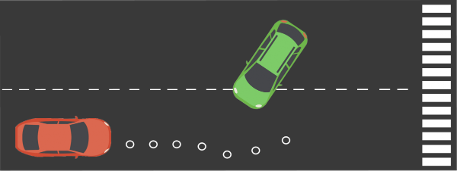
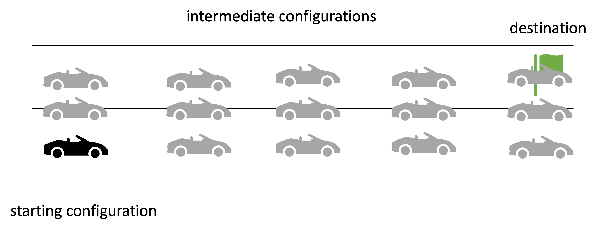
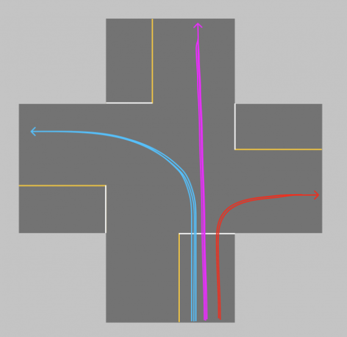
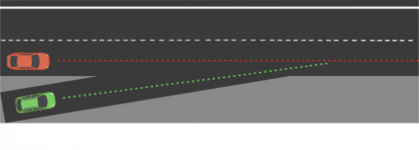
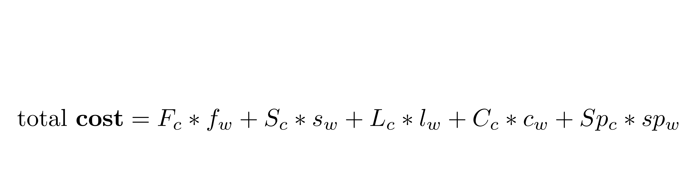
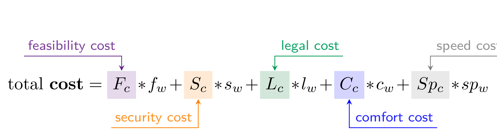
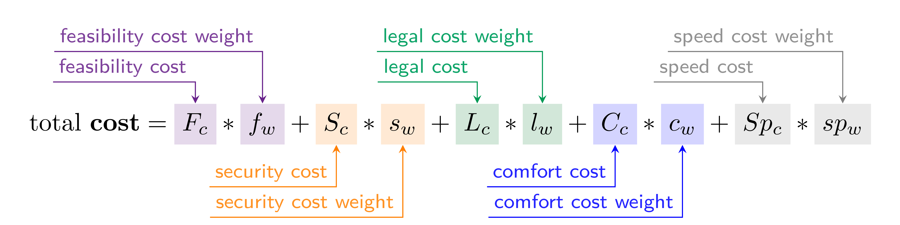
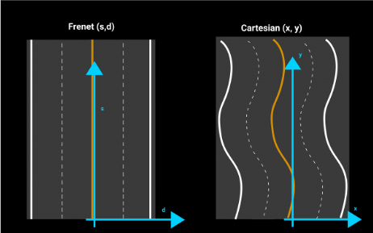
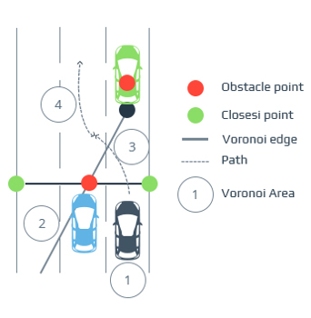

#  Path Planning

## **Design of Autonomous Systems**
### csci 6907/4907-Section 86
### Prof. **Sibin Mohan**

---

car has following two options,

---

car has following two options,

which path should the car choose? 

Note:
Assume that the car **has** to choose one of the two paths.

---

## path planning

---

## path planning

- determining **optimal trajectory** for autonomous vehicle 

---

## path planning

- determining **optimal trajectory** for autonomous vehicle 
- from current position to its **intended destination**

---

## path planning

- determining **optimal trajectory** for autonomous vehicle 
- from current position to its **intended destination**
- account for various factors 
    - road conditions, traffic laws, obstacles, potential hazards, _etc._

---

## path planning

---

## path planning

- **decision-making**

---

## path planning

- **decision-making**
- **predictions** (**other** cars, pedestrians, traffic signals, _etc._)

---

not just following a pre-determined path

---

not just following a pre-determined path

**real-time adjustments** &rarr; based on immediate surroundings

---

any **routes** that are picked must be,

---

any **routes** that are picked must be,

- safe

---

any **routes** that are picked must be,

- safe
- convenient

---

any **routes** that are picked must be,

- safe
- convenient
- economically beneficial

---

consider this example:

---

what should the **red** car do?

---

what should the **red** car do?

1. stay in lane, speed up

---

what should the **red** car do?

1. stay in lane, speed up
2. stay in lane, slow down

---

what should the **red** car do?

1. stay in lane, speed up
2. stay in lane, slow down
3. stay in lane, constant speed

---

 

what should the **red** car do?

1. stay in lane, speed up
2. stay in lane, slow down
3. stay in lane, constant speed
4. change lanes 

---

what should the **red** car do?

1. stay in lane, speed up
2. stay in lane, slow down
3. stay in lane, constant speed
4. change lanes 

 
 

that **each scenario** &rarr; **probability** associated with it

---

let's define a few terms...

---

consider the following scenario: 

---

car has a destination or **goal**

---

there are many possible **intermediate configurations**... 

---

there are many possible **intermediate configurations**... 

---

there are many possible **intermediate configurations**... 

...between the starting configuration and final destination 

---

**objective** &rarr; to pick a **sequence of configurations**

---

**objective** &rarr; to pick a **sequence of configurations**

---

**objective** &rarr; to pick a **sequence of configurations**

from starting point to destination

---

**objective** &rarr; to pick a **sequence of configurations**

from starting point to destination

 

this is known as &rarr; **path**

---

a **path** is defined as,

> continuous sequence of configurations &rarr; starting/ending with boundary configurations. 

---

**path planning** is then defined as, 

---

**path planning** is then defined as, 

> the process of finding a geometric path from initial to given config such that each configuration state is **feasible**

---

**path planning** is then defined as, 

> the process of finding a geometric path from initial to given config such that each configuration state is **feasible**

there is possibility of **alternate paths** 

---

**path planning** is then defined as, 

> the process of finding a geometric path from initial to given config such that each configuration state is **feasible**

there is possibility of **alternate paths** 

for the same starting and ending configurations

---

---

if another vehicle present

---

if another vehicle present &rarr; car has to make some decisions

---

if another vehicle present &rarr; car has to make some decisions

1. continue going straight?
2. change lanes
3. _actively_ overtake?

---

car has to execute a &rarr; **maneuver**

---

car has to execute a &rarr; **maneuver**

> a high-level characteristic of vehicle’s motion that encompasses position+speed of vehicle.

---

so then **maneuver planning** is defined as,

> taking best high-level decision for vehicle

---

so then **maneuver planning** is defined as,

> taking best high-level decision for vehicle

 

Note:
- In this case it could mean just changing the lanes since our objective is to get to the final destination.

---

note that **maneuver planning** has some subtlety,

> taking best high-level decision for vehicle

---

note that **maneuver planning** has some subtlety,

> take best high-level decision for vehicle 

that accounts for path from planning algorithm

---

> take best high-level decision for vehicle 

that accounts for path from planning algorithm

---

> take best high-level decision for vehicle 

that accounts for path from planning algorithm

in this case, changing lane &rarr; moves us **towards final destination**

---

a "path" &rarr; neither instantaneous not continuous

---

a "path" &rarr; neither instantaneous not continuous

car needs to go through &rarr; **sequence of discrete configurations**

---

a "path" &rarr; neither instantaneous not continuous

car needs to go through &rarr; **sequence of discrete configurations**

---

a "path" &rarr; neither instantaneous not continuous

car needs to go through &rarr; **sequence of discrete configurations**

**trajectory**

---

**trajectory**

> sequence of states visited by vehicle 

parameterized by &rarr; **time** and **velocity**

---

finally we get to &rarr; **trajectory planning**,

> **real-time planning** of vehicle’s move &rarr; from one feasible state to next

---

finally we get to &rarr; **trajectory planning**,

> **real-time planning** of vehicle’s move &rarr; from one feasible state to next

---

not break the laws of physics!

---

### summary of definitions

| **term** | **definition** | **examples/notes** |
|:---------|:---------------|:-------------------|
| **path** | continuous sequence of configurations|  starting/ending with boundary configurations  |
| **path planning** | find a geometric path from initial to given config  | each configuration and state on path is feasible |
| **maneuver** | high-level characteristic of vehicle’s motion  | encompasses position and speed of vehicle on road   _e.g.,_ going straight, changing lanes, turning, overtaking |

---

### summary of definitions [contd.]

| **term** | **definition** | **examples/notes** |
|:---------|:---------------|:-------------------|
| **maneuver planning** | take best high-level decision for vehicle | take into account path specified by planning algorithm  |
| **trajectory** | sequence of states visited by vehicle  |  parameterized by time and velocity|
| **trajectory planning** | real-time planning of vehicle’s moves  |  from one feasible state to the next &rarr; satisfied by car’s kinematics|
||

---

core path planning components:

- sensing
- mapping
- localization

---

## Path Planning | Approaches

---

path planning involves &rarr; **predicting** environment around us 

---

path planning involves &rarr; **predicting** environment around us 

a **few seconds** into the **future**

---

path planning involves &rarr; **predicting** environment around us 

- pedestrian will move (and direction)
- traffic sign remains still

---

[**three** types](https://www.sapien.io/blog/path-planning-for-self-driving-cars) of path planning:

1. global
2. local/partial 
3. behavioral 

---

### **Global** Path Planning

---

### **Global** Path Planning

planning from start the destination &rarr; over a **long distance**

---

### **Global** Path Planning

planning from start the destination &rarr; over a **long distance**

- considers high-level road network constraints 
    - _e.g._, available routes, traffic regulations, road conditions

---

### **Global** Path Planning

planning from start the destination &rarr; over a **long distance**

- considers high-level road network constraints 
    - _e.g._, available routes, traffic regulations, road conditions
- overall trajectory avoids major hazards and follows optimal paths
    - adhering to traffic laws 
    - minimizing fuel consumption

---

### **Global** Path Planning

planning from start the destination &rarr; over a **long distance**

- considers high-level road network constraints 
    - _e.g._, available routes, traffic regulations, road conditions
- overall trajectory avoids major hazards and follows **optimal** paths
    - adhering to traffic laws 
    - minimizing fuel consumption

---

### **Global** Path Planning

compute an **efficient** route for long-distance travel

---

### **Global** Path Planning

compute an **efficient** route for long-distance travel

**adjusted by local planning** as needed

---

### **Local/partial** Path Planning

---

### **Local/partial** Path Planning

**navigating** vehicle through &rarr; **immediate surroundings** 

---

### **Local/partial** Path Planning

**navigating** vehicle through &rarr; **immediate surroundings** 

- dealing with real-time adjustments
    - obstacle avoidance, managing intersections
    - other dynamic obstacles (_e.g.,_ pedestrians, cyclists, vehicles)

---

### **Local/partial** Path Planning

**navigating** vehicle through &rarr; **immediate surroundings** 

- dealing with real-time adjustments
    - obstacle avoidance, managing intersections
    - other dynamic obstacles (_e.g.,_ pedestrians, cyclists, vehicles)
- adjust vehicle trajectory to respond to changing conditions 
    - ensure **smooth** and **safe** navigation

---

### **Local/partial** Path Planning

vehicle &rarr; constantly re-evaluate its environment

---

### **Local/partial** Path Planning

vehicle &rarr; constantly re-evaluate its environment

algorithms &rarr; calculate **best local trajectory** at any given moment 

(based on sensor data)

---

### **Behavioral** Path Planning

---

### **Behavioral** Path Planning

**anticipating and responding** to &rarr; behavior of other road users

---

### **Behavioral** Path Planning

**anticipating and responding** to &rarr; behavior of other road users

- simulate **human-like decision-making** 
    - ensure **safe** interactions with pedestrians, cyclists, vehicles

---

### **Behavioral** Path Planning

**anticipating and responding** to &rarr; behavior of other road users

- simulate **human-like decision-making** 
    - ensure **safe** interactions with pedestrians, cyclists, vehicles
- **adjust its actions** 
    - prevent collisions and ensure smooth traffic flow

---

### **Behavioral** Path Planning

**anticipating and responding** to &rarr; behavior of other road users

- simulate **human-like decision-making** 
    - ensure **safe** interactions with pedestrians, cyclists, vehicles
- **adjust** our actions
    - prevent collisions and ensure smooth traffic flow

---

### **Behavioral** Path Planning

crucial role in **urban environments** (dense traffic) 

---

### **Behavioral** Path Planning

crucial role in **urban environments** (dense traffic) 

vehicles make **real-time decisions** to adapt to other drivers

---

---

 
 
 

- known+unknown information
- in conjunction with SLAM

---

 
 
 

- known+unknown information
- in conjunction with SLAM
- **horizontal** &rarr; trajectory

---

 
 
 

- known+unknown information
- in conjunction with SLAM
- **horizontal** &rarr; trajectory
- **vertical** &rarr; speed

---

###  Predictions and Decision Making

---

1. **machine-learning** based

---

1. **machine-learning** based

 

---

1. **machine-learning** based

 

- **training** phase: 
    - massive history of vehicles/paths
    - thousands of vehicles, actions at intersection

---

1. **machine-learning** based

 

- **training** phase: 
    - massive history of vehicles/paths
    - thousands of vehicles, actions at intersection
- **unsupervised** learning
    - clustering algorithms 
    - each cluster a typical trajectory

---

1. **machine-learning** based

more driving &rarr; more data and **better estimates**  

past behavior can affect current decisions

---

2. **model**-based

---

2. **model**-based

**imagine possible choices** for vehicle

---

2. **model**-based

**imagine possible choices** for vehicle

- red car can cause problems

---

2. **model**-based

**imagine possible choices** for vehicle

 
 

- red car can cause problems
- four choices
    - speed up
    - slow down
    - constant speed
    - change lanes

---

2. **model**-based

**imagine possible choices** for vehicle

 
 

- red car can cause problems
- four choices
    - speed up
    - slow down
    - constant speed
    - change lanes

each has a **probability that changes with observations**

---

2. **model**-based

 

- implements feasibility of trajectory

---

2. **model**-based

 

- implements feasibility of trajectory
- eliminates _impossible behaviors_

---

2. **model**-based

 

- implements feasibility of trajectory
- eliminates _impossible behaviors_
- focus on what’s possible, **not on past** 

(compare with ML-based approach)

---

### Decision Making

---

once we have estimate of immediate future &rarr; we need a **decision**

---

once we have estimate of immediate future &rarr; we need a **decision**

- brake if obstacle detected?

---

once we have estimate of immediate future &rarr; we need a **decision**

- brake if obstacle detected?
- accelerate or change lanes?

---

depends on **environment** 

(_e.g.,_ highway vs parking lot)

---

consider issues such as:

- safety
- feasibility
- efficiency
- legality
- passenger comfort

---

enter **finite state machines**

---

to define a couple of things:

|||
|----|----|
| define **states** of a car | |

---

to define a couple of things:

|||
|----|----|
| define **states** of a car | **cost functions** to define **choice** of state |

---

to define a couple of things:

|||
|----|----|
| define **states** of a car | **cost functions** to define **choice** of state |
| _e.g.,_ on highway, stationary, _etc._ | computed (independently) for each possible scenario|

---

to define a couple of things:

|||
|----|----|
| define **states** of a car | **cost functions** to define **choice** of state |
| _e.g.,_ on highway, stationary, _etc._ | computed (independently) for each possible scenario|
| options &rarr; stay in lane, change to left lane, overtake a car|**lowest cost wins**|
||

---

how do we define this **cost**?

---

cost calculated using various factors,

---

cost calculated using various factors,

_e.g.,_ feasibility, security, legal, comfort, speed, _etc_

---

---

---

---

each factor &rarr; defined using number or functions 

---

each factor &rarr; defined using number or functions 

_e.g.,_ the cost for speeding:

---

"_weight_" for factors &rarr; define **importance** in cost calculations

---

## Path Planning | Setup

---

main objective of path planning &rarr; **generate a trajectory** 

---

main objective of path planning &rarr; **generate a trajectory** 

a polynomial (curve) that pass through **waypoints**

---

**[Frenet coordinate system](https://roboticsknowledgebase.com/wiki/planning/frenet-frame-planning)**

---

**[Frenet coordinate system](https://roboticsknowledgebase.com/wiki/planning/frenet-frame-planning)**

---

**[Frenet coordinate system](https://roboticsknowledgebase.com/wiki/planning/frenet-frame-planning)**

---

**[Frenet coordinate system](https://roboticsknowledgebase.com/wiki/planning/frenet-frame-planning)**

 

---

**Frenet coordinate system**

- easier to use for trajectory and waypoint calculations 

---

**Frenet coordinate system**

- easier to use for trajectory and waypoint calculations 
- **always relative** to the center of the lane

---

**Frenet coordinate system**

- easier to use for trajectory and waypoint calculations 
- **always relative** to the center of the lane
- cartesian system would be harder changing geographies

---

once decision has been made (_e.g.,_ overtake) 

---

once decision has been made (_e.g.,_ overtake) 

path planning algorithm &rarr; **generates multiple trajectories**

---

path planning algorithm &rarr; **generates multiple trajectories**

---

path planning algorithm &rarr; **generates multiple trajectories**

**choose one** &rarr; based on criteria/costs established

---

### trajectory planning

---

### trajectory planning

- **real-time** planning of actual vehicle’s transition 

---

### trajectory planning

- **real-time** planning of actual vehicle’s transition 
- from one feasible state to the next

---

### trajectory planning

- **real-time** planning of actual vehicle’s transition 
- from one feasible state to the next
- satisfying the vehicle’s _kinematic limits_

---

### trajectory planning

kinematic limits,

- vehicle dynamics and 
- constrained by navigation comfort

---

### trajectory planning

- respect lane boundaries and traffic rules

---

### trajectory planning

- respect lane boundaries and traffic rules
- avoiding **obstacles** 
    - (other road users, ground conditions, ditches, _etc._)

---

### trajectory planning

parameterized by,

$$(time, acceleration, velocity)$$

---

### trajectory planning

during each "planning cycle", 

---

### trajectory planning

during each "planning cycle", 

- generate a number of trajectories &rarr; from vehicle’s current location

---

### trajectory planning

during each "planning cycle", 

- generate a number of trajectories &rarr; from vehicle’s current location
    - with a look-ahead distance, 
    - depending on speed and line-of-sight of vehicle’s sensors 

---

### trajectory planning

during each "planning cycle", 

- generate a number of trajectories &rarr; from vehicle’s current location
    - with a look-ahead distance, 
    - depending on speed and line-of-sight of vehicle’s sensors 
- evaluating each trajectory w.r.t. some **cost function** 

---

### trajectory planning

during each "planning cycle", 

- generate a number of trajectories &rarr; from vehicle’s current location
    - with a look-ahead distance, 
    - depending on speed and line-of-sight of vehicle’s sensors 
- evaluating each trajectory w.r.t. some **cost function** 

determine an **optimal trajectory**

---

### trajectory planning

scheduled at regular intervals 

length of interval &rarr; depends on frequency of sensor 

---

### trajectory planning

1. trajectory generated on a low resolution/dimensional search space

---

### trajectory planning

1. trajectory generated on a low resolution/dimensional search space
2. optimal trajectory "smoothed out" on high resolution/dimension

---

challenges for finding paths is &rarr; **how to represent search space?** 

---

environment &rarr; query for paths, optimal or otherwise

---

physical environment &rarr; transformed into **state space**

---

physical environment &rarr; transformed into **state space**

### graphs 

---

### graphs

**discretizes** search space &rarr; for easier computations

---

### Graphs Used for Path Planning

---

### Graphs Used for Path Planning

most methods &rarr; start with bare representation (lanes, road boundaries) 

---

### Graphs Used for Path Planning

most methods &rarr; start with bare representation (lanes, road boundaries) 

convert into **higher-order graphical representations**

---

let's look at some popular graphical representations used in path planning

---

1. **[Voronoi diagrams](https://ics.uci.edu/~goodrich/teach/geom/notes/Voronoi1.pdf)** 

(aka Dirichlet Tessellation) 

---

1. **[Voronoi diagrams](https://ics.uci.edu/~goodrich/teach/geom/notes/Voronoi1.pdf)** 

 
 

- partitions plane with $n$ points &rarr; convex polygons 

---

1. **[Voronoi diagrams](https://ics.uci.edu/~goodrich/teach/geom/notes/Voronoi1.pdf)** 

 
 

- partitions plane with $n$ points &rarr; convex polygons 
- each polygon &rarr; **exactly one** generating point

---

1. **[Voronoi diagrams](https://ics.uci.edu/~goodrich/teach/geom/notes/Voronoi1.pdf)** 

 
 

- partitions plane with $n$ points &rarr; convex polygons 
- each polygon &rarr; **exactly one** generating point
- every point in given polygon &rarr; closer to its generating point than to any other

---

1. **Voronoi diagrams** 

- these objects are just finitely many points in the plane 
    - called seeds, sites, or generators

---

1. **Voronoi diagrams** 

- these objects are just finitely many points in the plane 
    - called seeds, sites, or generators
- for each seed &rarr; corresponding region, called a Voronoi cell
    - all points of plane closer to that seed than to any other

---

<!-- .slide: data-background="white" -->

1. **Voronoi diagrams** 

 

---

