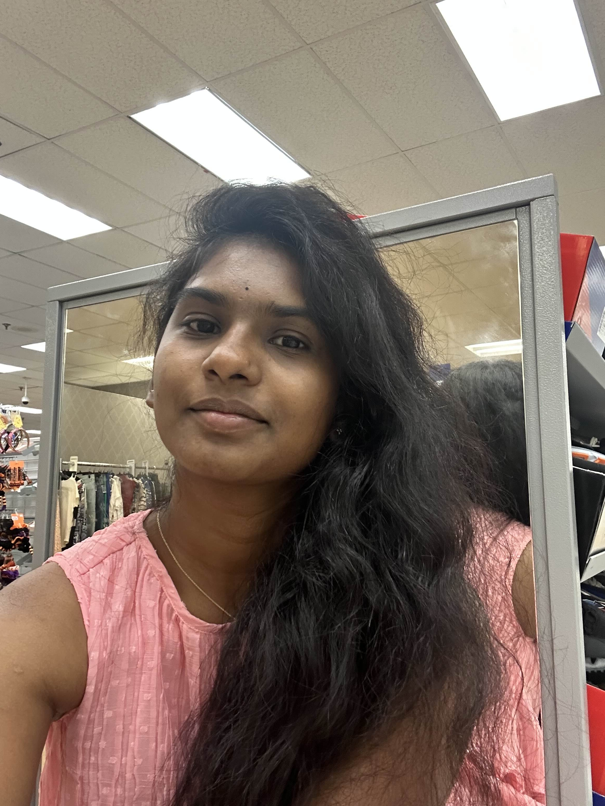
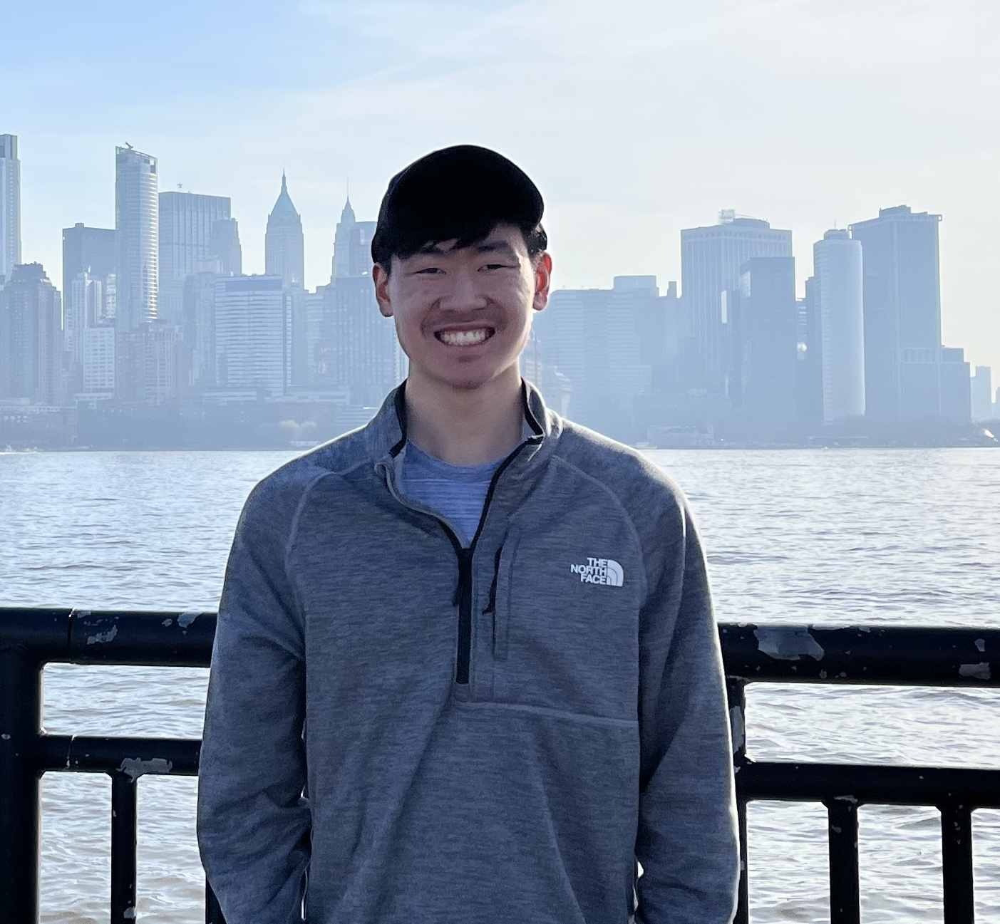

# administrivia

## **Design of Autonomous Systems**
### csci 6907/4907-Section 86
### Prof. **Sibin Mohan**

---

## class schedule

|||
|--------|--------|
|days     | <scb>tuesdays</scb> and <scb>thursdays</scb> |
|times    | <scb>12:45 -- 2:00 PM</scb> |
|location | <scb>TOMPKINS (TOMP) 310</scb> |
||

-v-

## "discussion" sections

|||
|--------|--------|
|tuesdays| <scb>2:15 -- 3:15 PM</scb> |
|thursdays| <scb>11:00 AM -- 12:00 PM</scb> |
|location| <scb>SEH 4040</scb>|
||

-v-

## "discussion" sections

|||
|--------|--------|
|tuesdays| <scb>2:15 -- 3:15 PM</scb> |
|thursdays| <scb>11:00 AM -- 12:00 PM</scb> |
|location| <scb>SEH 4040</scb>|
||

- these are **not** mandatory

-v-

## "discussion" sections

|||
|--------|--------|
|tuesdays| <scb>2:15 -- 3:15 PM</scb> |
|thursdays| <scb>11:00 AM -- 12:00 PM</scb> |
|location| <scb>SEH 4040</scb>|
||

- these are **not** mandatory
- you will learn useful concepts

-v-

## "discussion" sections

|||
|--------|--------|
|tuesdays| <scb>2:15 -- 3:15 PM</scb> |
|thursdays| <scb>11:00 AM -- 12:00 PM</scb> |
|location| <scb>SEH 4040</scb>|
||

- these are **not** mandatory
- you will learn useful concepts
- hands-on experience with hardware 
    - with assistance from teaching staff

-v-

## "discussion" sections

|||
|--------|--------|
|tuesdays| <scb>2:15 -- 3:15 PM</scb> |
|thursdays| <scb>11:00 AM -- 12:00 PM</scb> |
|location| <scb>SEH 4040</scb>|
||

- these are **not** mandatory
- you will learn useful concepts
- hands-on experience with hardware 
    - with assistance from teaching staff
- can work on small assignments+extra credit

---

## course staff

-v-

## instructor

|||
|------------------------------------------------|--------|
| **Prof. Sibin Mohan**   * associate professor   * computer science   * security, systems   * photography, travel   | |
||

**sibin.mohan\@gwu.edu**

-v-

## teaching assistants

||||
|-----|-----|-----|
|

 | 

 | 

 |
|
<b>Indu</b>
 | 
<b>Derek</b>
 | 
<b>Tejaaswini</b>
 |
|
Grad TA
 | 
Undergrad TA
 | 
Grader
 |
|
 **indumathi.madhu\@gwu.edu**
| 
**dchen36\@gwu.edu**
| 
**tejaaswini.narendran\@gwu.edu**
|
||

---

## office hours

|person|day of week|time(s)|
|------|-----------|-------|
|Sibin |Thursdays  |2:30 -- 4:00 PM|
|TAs   |Multiple | see <b><a href="https://calendar.google.com/calendar/u/3?cid=Y182YWM3YmU0NGM5YjcyNjBmYTExYTYzMTk1MjI1N2Y5YjgwYmIxNDA2YmIwZTczNWFkNmMwZDZkZmZiMWMxZDRhQGdyb3VwLmNhbGVuZGFyLmdvb2dsZS5jb20">online calendar</a></b>|
||

-v- 

## communication

- **discord**
- email for sickness/absence/_etc._

-v-

<b>respect</b> everyone's time!

-v-

### office hours **etiquette**

- read: [**<scb>how to prepare for office hours</scb>**](https://www2.seas.gwu.edu/~gparmer/resources/2021-09-20-Office-Hours-HOWTO.html)!
- be respectful &rarr;  to TA and other students
- **come prepared!** 

-v-

### discord **ettiquette**

* **do not DM the teaching staff (on discord)** *<!-- .element: class="fragment" data-fragment-index="1" -->
* no guarantee for immediate response <!-- .element: class="fragment" data-fragment-index="2" -->
* response times &rarr; (approx.) 24 hours <!-- .element: class="fragment" data-fragment-index="3" -->

[\* send me DMs if critical; absences via email only]<!-- .element: class="fragment" data-fragment-index="4" -->

---

## course content

---

## course content

- design and implementation of **autonomous systems**

---

## course content

- design and implementation of **autonomous systems**
- this is a "**full stack**" course

---

## course content

- design and implementation of **autonomous systems**
- this is a "**full stack**" course

|||
|-------------|--------------|
| **low** level | sensing/actuation/embedded design/ real-time scheduling+os |

---

## course content

- design and implementation of **autonomous systems**
- this is a "**full stack**" course

|||
|-------------|--------------|
| **low** level | sensing/actuation/embedded design/ real-time scheduling+os |
| **mid** level | control algorithms, ekf, sensor fusion |

---

## course content

- design and implementation of **autonomous systems**
- this is a "**full stack**" course

|||
|-------------|--------------|
| **low** level | sensing/actuation/embedded design/ real-time scheduling+os |
| **mid** level | control algorithms, ekf, sensor fusion |
| **higher** level | slam, path planning, object detection   object avoidance/waypoints |

---

## course content

- design and implementation of **autonomous systems**
- this is a "**full stack**" course

|||
|-------------|--------------|
| **low** level | sensing/actuation/embedded design/ real-time scheduling+os |
| **mid** level | control algorithms, ekf, sensor fusion |
| **higher** level | slam, path planning, object detection   object avoidance/waypoints |
| **abstract** | safety, security, verification |
||

---

## course structure

---

- **lectures** &rarr; concepts, deep dives into topics
- "**discussion**" sections &rarr; exploration of singular topics
    - _e.g.,_ how to connect to, and program, a _raspberry pi_
- **machine problems** (mps) &rarr; hands-on exercises 
    - on hardware/software

---

well-defined learning sequence: 
 
### lectures &rarr; discussions &rarr; mp

---

### hands-on assignments using hardware platforms

 

raspberry pi

 
navio2

rovers

---

## grading rubric

| Component  | % Grade |
|------------|---------|
| mp 1: detecting motions from sensors | 15 % |
| mp 2: real-time scheduling | 15 % |
| mp 3: ekf | 20 % |
| mp 4: rover programming and control  | 25 % |
| discussion | 15 %  |
| class participation | 10 %  |
||

-v-

## grading rubric

| Component  | % Grade |
|------------|---------|
| mp 1: detecting motions from sensors | 15 % |
| mp 2: real-time scheduling | 15 % |
| mp 3: ekf | 20 % |
| mp 4: rover programming and control  | 25 % |
| discussion | 15 %  |
| class participation | 10 %  |
||
### mp4 includes a leaderboard-style race &rarr; extra credit

-v-

 ### homeworks grading

- script-based grading <!-- .element: class="fragment" data-fragment-index="1" -->
- negative points &rarr; not following exact instructions <!-- .element: class="fragment" data-fragment-index="3" -->

-v-

### homeworks grading (contd.)

- you may be **randomly** chosen for &rarr; **oral q&a**
- failure &rarr; loss of homework grade! <!-- .element: class="fragment" data-fragment-index="1" -->

---

## academic honesty 

---

## academic honesty 

| don't | | 
|---------|--------|
| copy/share code | | 
| look at others' code! | |
||

---

## academic honesty 

| don't | do | 
|---------|--------|
| copy/share code | discuss with others | 
| look at others' code! | ask prof/ta |
||

---

## academic honesty 

| don't | do | 
|---------|--------|
| copy/share code | discuss with others | 
| look at others' code! | ask prof/ta |
||

 

<b>do not</b> use chatgpt, copilot, etc.!

---

## violations

 <b>will be reported</b>  to the academic integrity office!

---

## course resources

| resource | use | 
|---------|--------|
| course **website** | [**link**](https://autonomy-course.github.io) | 
| **discord** server | discussions | 
| **blackboard** | announcemnts/grades | 
| **github** | homework assignments | 
||

