# sensor fusion | the return

## **Design of Autonomous Systems**
### csci 6907/4907-section 86
### Prof. **Sibin Mohan**

---

consider a **LiDAR** and a **camera** looking at a pedestrian...

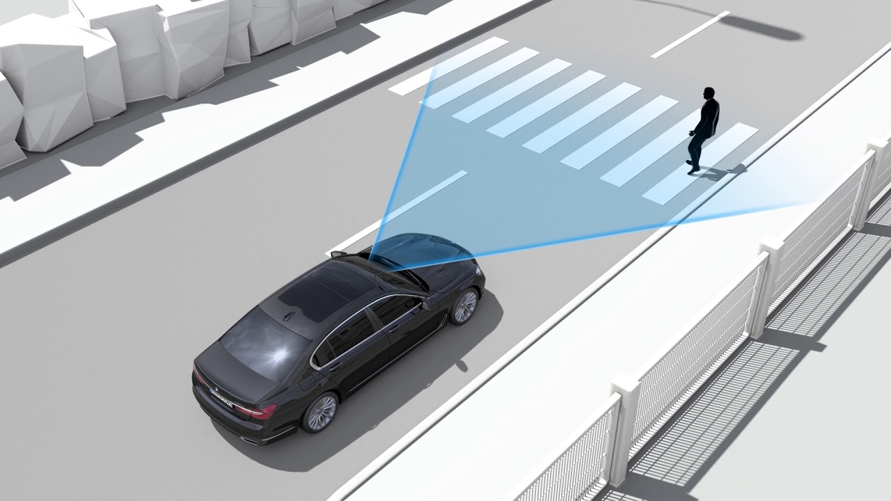
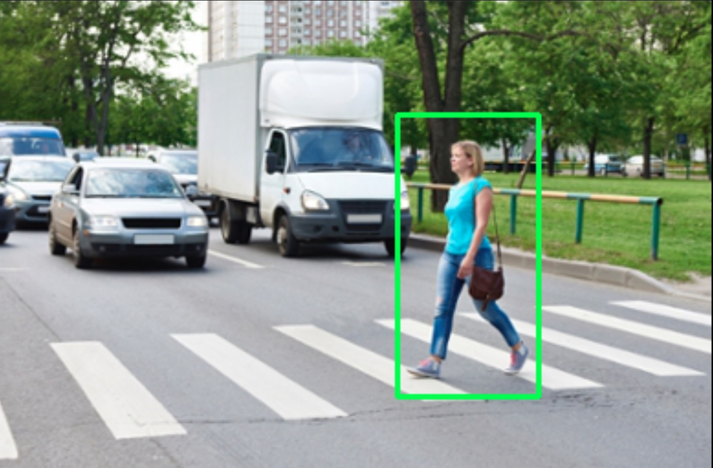

---

consider a **LiDAR** and a **camera** looking at a pedestrian...

consider the following situations...

---

consider the following situations...

|||
|:-----|:------|
| **situation** | **result** |
| only **one** detects the pedestrian | use the other to increase chances |

---

consider the following situations...

|||
|:-----|:------|
| **situation** | **result** |
| only **one** detects the pedestrian | use the other to increase chances |
| **both** detect the pedestrian | better **accuracy + confidence** |
||

---

**sensor fusion** = **data fusion**

---

### sensor fusion | **classification**

---

### sensor fusion | **classification**

three ways to classify sensor fusion,

---

### sensor fusion | **classification**

three ways to classify sensor fusion,

|||
|:-----|:------|
| **abstraction level** | "_when_ should we fuse?" |

---

### sensor fusion | **classification**

three ways to classify sensor fusion,

|||
|:-----|:------|
| **abstraction level** | "_when_ should we fuse?" |
| **centralization level** | "_where_ is the fusion happening?" |

---

### sensor fusion | **classification**

three ways to classify sensor fusion,

|||
|:-----|:------|
| **abstraction level** | "_when_ should we fuse?" |
| **centralization level** | "_where_ is the fusion happening?" |
| **competition level** | "_what_ should the fusion do?" |
||

---

## abstraction level

---

## abstraction level

_"**when** should we do the fusion?"_

---

## abstraction level

_"**when** should we do the fusion?"_

 

**three** types of abstraction level fusion

(low, medium, high)

---

### abstraction level | **low-level fusion**

---

<!-- .slide: data-background="white" -->

### abstraction level | **low-level fusion**

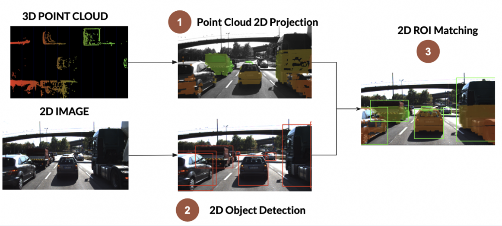

---

<!-- .slide: data-background="white" -->

### abstraction level | **low-level fusion**

- fuse **raw data** from multiple sensors

---

<!-- .slide: data-background="white" -->

### abstraction level | **low-level fusion**

- fuse **raw data** from multiple sensors
- _e.g._ point clouds (**LiDARs**) + pixels (**cameras**)

Note:
- Object detection is used in the process, but what's really doing the job is projecting the 3D point clouds into the image, and then associating this with the pixels.

---

<!-- .slide: data-background="white" -->

### abstraction level | **low-level fusion**

- fuse **raw data** from multiple sensors
- _e.g._ point clouds (**LiDARs**) + pixels (**cameras**)

good for **object detection**

---

<!-- .slide: data-background="white" -->

### abstraction level | **low-level fusion**

|process| challenges |
|:----|:---|
|  | projecting 3D point clouds onto image |
||

---

<!-- .slide: data-background="white" -->

### abstraction level | **low-level fusion**

|process| challenges |
|:----|:---|
|  | projecting 3D point clouds onto image   associating points with pixels |
||

---

<!-- .slide: data-background="white" -->

### abstraction level | **low-level fusion**

|process| challenges |
|:----|:---|
|  | projecting 3D point clouds onto image   associating points with pixels |
||

|pros|cons|
|:-----|:------|
| future proof | huge processing requirements |
||

---

### abstraction level | **mid-level fusion**

---

<!-- .slide: data-background="white" -->

### abstraction level | **mid-level fusion**

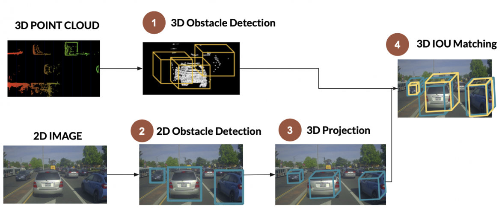

Note:
- Information Loss — if tracking in one is incorrect, then everything is messed up

---

<!-- .slide: data-background="white" -->

### abstraction level | **mid-level fusion**

- fusing objects &rarr; **detected independently**

---

<!-- .slide: data-background="white" -->

### abstraction level | **mid-level fusion**

- fusing objects &rarr; **detected independently**
- each sensor does its own detection
---

<!-- .slide: data-background="white" -->

### abstraction level | **mid-level fusion**

- fusing objects &rarr; **detected independently**
- each sensor does its own detection
- _e.g._ camera and radar detect objects 

---

<!-- .slide: data-background="white" -->

### abstraction level | **mid-level fusion**

- fusing objects &rarr; **detected independently**
- each sensor does its own detection
- _e.g._ camera and radar detect objects 
- fused using **Kalman Filter**

---

<!-- .slide: data-background="white" -->

### abstraction level | **mid-level fusion**

|process | |
|:-------|:------|
|3D bounding box (LiDAR) + 2D bounding box (camera) | |

---

<!-- .slide: data-background="white" -->

### abstraction level | **mid-level fusion**

|process | |
|:-------|:------|
|3D bounding box (LiDAR) + 2D bounding box (camera) | |
|projecting 3D result into 2D||

---

<!-- .slide: data-background="white" -->

### abstraction level | **mid-level fusion**

|process | |
|:-------|:------|
|3D bounding box (LiDAR) + 2D bounding box (camera) | |
|projecting 3D result into 2D||
|data fusion happens in **2D**||

---

<!-- .slide: data-background="white" -->

### abstraction level | **mid-level fusion**

|process | challenges |
|:-------|:------|
|3D bounding box (LiDAR) + 2D bounding box (camera) | if tracking in one is incorrect, then everything is messed up |
|projecting 3D result into 2D||
|data fusion happens in **2D**||
||

---

<!-- .slide: data-background="white" -->

### abstraction level | **mid-level fusion**

|pros|cons|
|:-----|:------|
| simplicity | potential to **lose information** |
||

---

### abstraction level | **high-level fusion**

---

<!-- .slide: data-background="white" -->

### abstraction level | **high-level fusion**

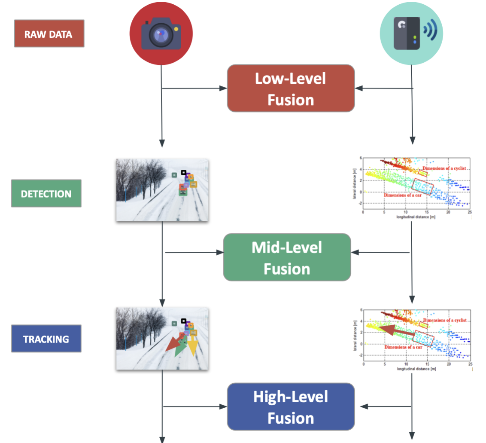

Note:
- Information Loss — if tracking in one is incorrect, then everything is messed up

---

<!-- .slide: data-background="white" -->

### abstraction level | **high-level fusion**

 

- fuse objects and their **trajectories**

---

<!-- .slide: data-background="white" -->

### abstraction level | **high-level fusion**

 

- fuse objects and their **trajectories**
- rely on detections

---

<!-- .slide: data-background="white" -->

### abstraction level | **high-level fusion**

 

- fuse objects and their **trajectories**
- detections + **predictions** + **tracking**

---

<!-- .slide: data-background="white" -->

### abstraction level | **high-level fusion**

|||
|:-----|:------|
| **pros** | **cons** |
| further simplicity | **too much** information loss |
||

---

## centralization level

---

## centralization level

_"**where** is the fusion happening?"_

---

### centralization level | **three types**

---

<!-- .slide: data-background="white" -->

### centralization level | **three types**

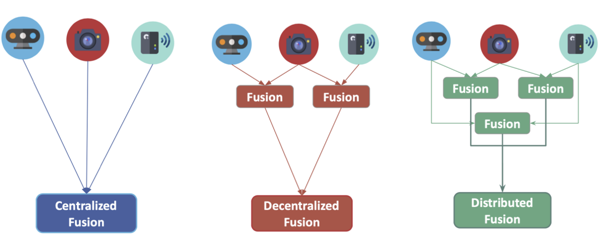

---

<!-- .slide: data-background="white" -->

|||
|:-----|:------|
| **centralized** | one central unit deals with it \[low-level\] |

---

<!-- .slide: data-background="white" -->

|||
|:-----|:------|
| **centralized** | one central unit deals with it \[low-level\] |
| **decentralized** | each sensor fuses data and forwards to next one |

---

<!-- .slide: data-background="white" -->

|||
|:-----|:------|
| **centralized** | one central unit deals with it \[low-level\] |
| **decentralized** | each sensor fuses data and forwards to next one |
| **distributed** | each sensor processes data locally   and sends to next unit \[late\] |
||

---

### centralization level | **satellite architecture**

---

<!-- .slide: data-background="white" -->

### centralization level | **satellite architecture**

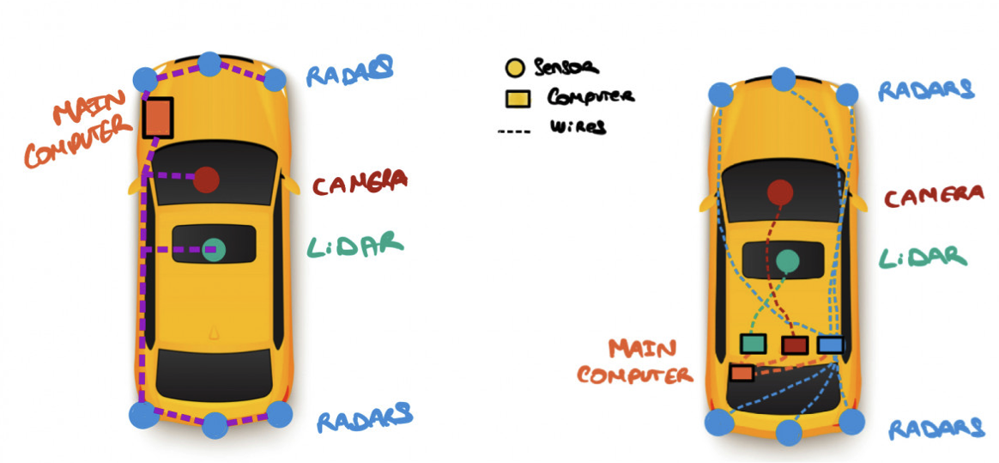

---

<!-- .slide: data-background="white" -->

 

- plug many sensors \[**satellites**\]

---

<!-- .slide: data-background="white" -->

 

- plug many sensors \[**satellites**\]
- fuse on single central unit 
  - **active safety domain controller**

---

<!-- .slide: data-background="white" -->

- plug many sensors \[**satellites**\]
- fuse together on a single central unit 
  - [**active safety domain controller**]
- **360 degree** fusion + detection on controller

---

<!-- .slide: data-background="white" -->

- plug many sensors \[**satellites**\]
- fuse together on a single central unit 
  - [**active safety domain controller**]
- **360 degree** fusion + detection on controller
- individual sensors do **not** have to be extremely good

---

## competition level

---

## competition level

_"**what** should the fusion do?"_

---

### competition level | **three types**

---

### competition level | **three types**

|||
|:-----|:------|
| **competitive** | sensors meant for same purpose   \[RADAR + LiDAR\] |

---

### competition level | **three types**

|||
|:-----|:------|
| **competitive** | sensors meant for same purpose   \[RADAR + LiDAR\] |
| **complementary** | different sensors looking at different scenes   \[multiple cameras\] |

---

### competition level | **three types**

|||
|:-----|:------|
| **competitive** | sensors meant for same purpose   \[RADAR + LiDAR\] |
| **complementary** | different sensors looking at different scenes   \[multiple cameras\] |
| **coordinated** | sensors produce a new scene from same object   \[3D reconstruction\] |
||

---

### competition level | **competitive**

sensors meant for the **same purpose**

---

<!-- .slide: data-background="white" -->

### competition level | **competitive**

sensors meant for the **same purpose**

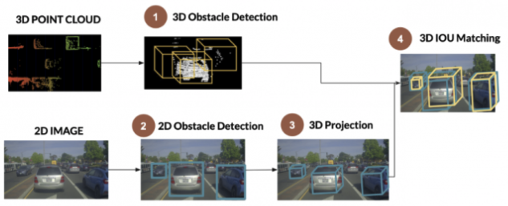

_e.g._ **Camera + LiDAR**

---

### competition level | **complementary**

different sensors looking at **different scenes**

---

<!-- .slide: data-background="white" -->

### competition level | **complementary**

different sensors looking at **different scenes**

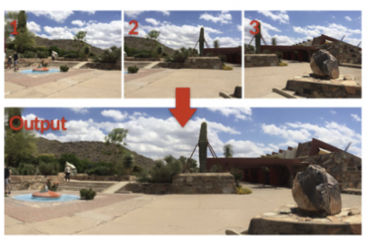

_e.g._ multiple cameras for creating a **panorama**

---

### competition level | **coordinated**

sensors produce a **new scene** from same object

---

<!-- .slide: data-background="white" -->

### competition level | **coordinated**

sensors produce a **new scene** from same object

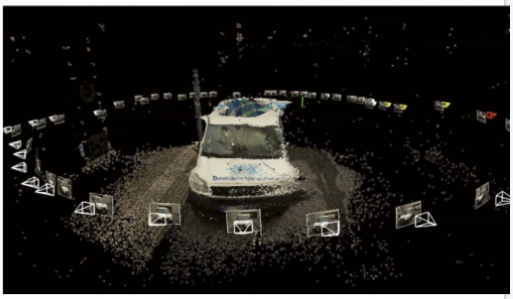

_e.g._ **3D reconstruction**

---

---

## high-level sensor fusion example

### **camera + LiDAR**

---

<!-- .slide: data-background="white" -->

## sensor fusion example | **camera + LiDAR**

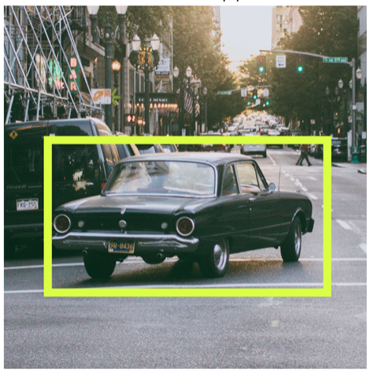
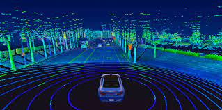

---

<!-- .slide: data-background="white" -->

### camera + lidar | **complementary strengths**

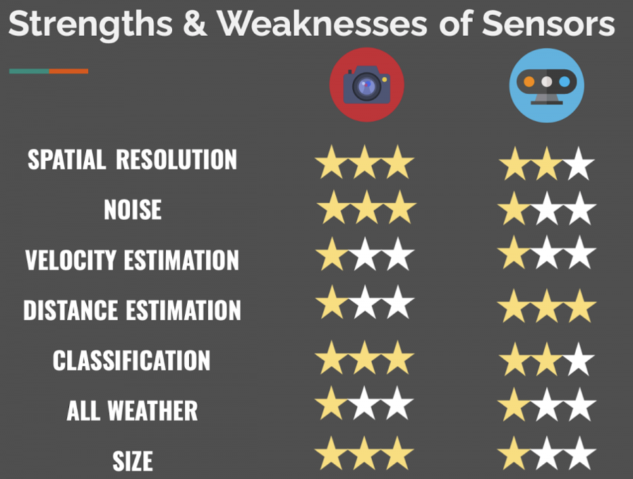

---

<!-- .slide: data-background="white" -->

|||
|:-----|:------|
| **camera** | **object classification** and understanding scenes |
| **LiDAR** | good for **estimating distances** |
||

---

### camera output &rarr; **bounding boxes**

---

<!-- .slide: data-background="white" -->

### camera output &rarr; **2D bounding boxes**

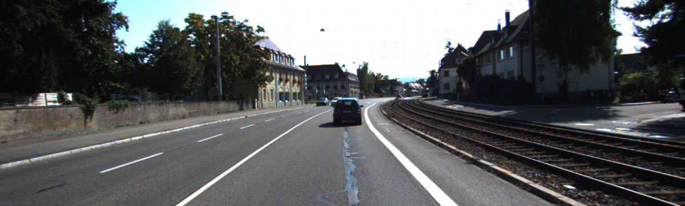

---

### LiDAR output &rarr; **point clouds**

---

<!-- .slide: data-background="white" -->

### LiDAR output &rarr; **3D point clouds**

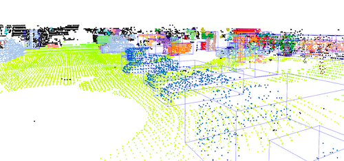

---

### classifying the fusion

---

<!-- .slide: data-background="white" -->

### classifying the fusion

---

<!-- .slide: data-background="white" -->

|||
|:-----|:------|
| **"what"** | competition and redundancy |
| **"where"** | doesn't matter \[for now; lots of options\] |
| **"when"** | multiple options |
||

---

<!-- .slide: data-background="white" -->

**"when"** | multiple options,

|||
|:-----|:------|
| **early** | fuse the raw data &rarr; pixels and point clouds |
| **late** | fuse the results &rarr; bounding boxes |
||

---

## early fusion

---

## early fusion

fuse **raw data** as soon as sensors are plugged

---

<!-- .slide: data-background="white" -->

## early fusion

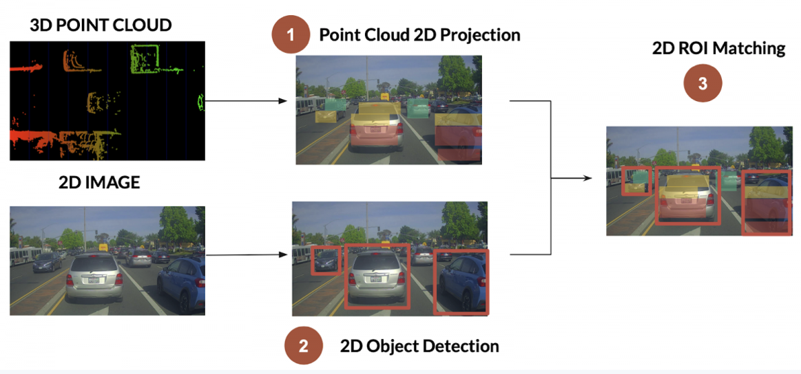

---

<!-- .slide: data-background="white" -->

- project **3D LiDAR point clouds** onto **2D image**
- check whether point clouds belong to **2D bounding boxes** from camera

---

### early fusion | **point cloud projection**

translate **3D point cloud** \[LiDAR frame\] &rarr; **2D projection** \[camera frame\]

---

### early fusion | **point cloud projection**

translate **3D point cloud** \[LiDAR frame\] &rarr; **2D projection** \[camera frame\]

1. convert each 3D LiDAR point into **homogeneous coordinates**

---

### early fusion | **point cloud projection**

translate **3D point cloud** \[LiDAR frame\] &rarr; **2D projection** \[camera frame\]

1. convert each 3D LiDAR point into **homogeneous coordinates**
2. apply **projection equations** \[translation/rotation\] to convert from LiDAR to camera

---

### early fusion | **point cloud projection**

translate **3D point cloud** \[LiDAR frame\] &rarr; **2D projection** \[camera frame\]

1. convert each 3D LiDAR point into **homogeneous coordinates**
2. apply **projection equations** \[translation/rotation\] to convert from LiDAR to camera
3. transform back into **Euclidean coordinates**

Note:
- https://en.wikipedia.org/wiki/Homogeneous_coordinates
- Homogeneous coordinates: coordinates of points, including points at infinity, can be represented using finite coordinates.
- Formulas involving homogeneous coordinates are often simpler and more symmetric than their Cartesian counterparts
- Transformations (rotation, scaling, translation, etc.) are simple matrix multiplications

---

<!-- .slide: data-background="white" -->

### early fusion | projected point cloud

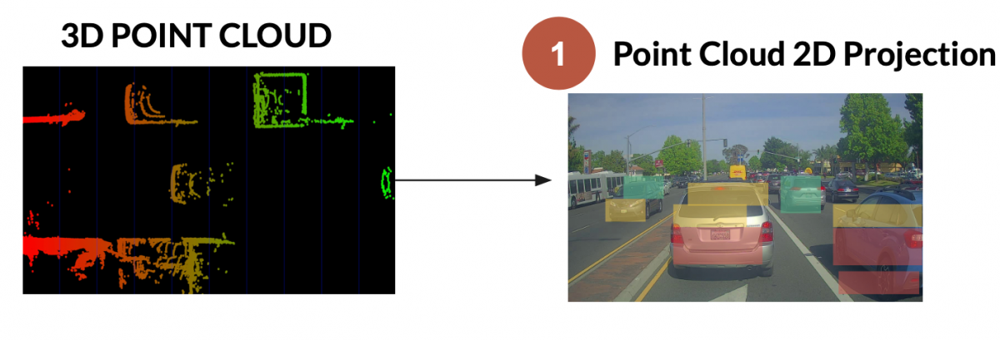
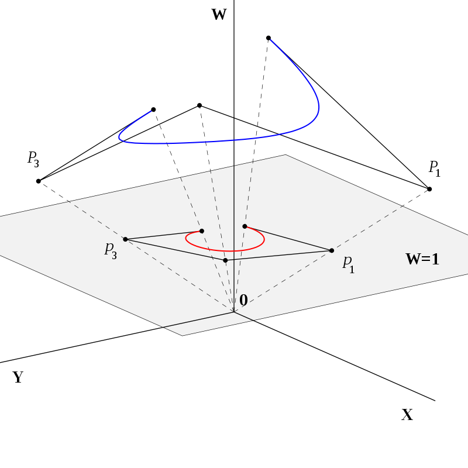

---

### early fusion | **object detection**

detect objects using the camera &rarr; **YOLO** again!

---

### early fusion | **ROI matching**

_"**region of interest**"_ mapping

---

### early fusion | **ROI matching**

_"**region of interest**"_ mapping

fuse the data **inside each bounding box**

---

### early fusion | **ROI matching**

_"**region of interest**"_ mapping

fuse the data **inside each bounding box**

|||
|:-----|:------|
| for each **bounding box** | camera gives **classification** |
| for each **LiDAR projected point** | **accurate distance** |
||

---

### early fusion | **ROI matching**

_"**region of interest**"_ mapping

fuse the data **inside each bounding box**

|||
|:-----|:------|
| for each **bounding box** | camera gives **classification** |
| for each **LiDAR projected point** | **accurate distance** |
||

objects are **measured accurately** and **classified**

---

### early fusion | **ROI matching problems**

---

<!-- .slide: data-background="white" -->

### early fusion | **ROI matching problems**

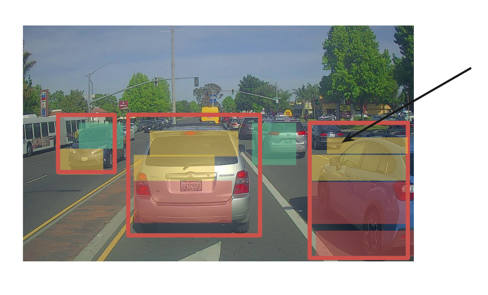

---

<!-- .slide: data-background="white" -->

- which point to pick for **distance**?
  - average / median / center point / **closest**?
- does the point **belong to another** bounding box?

---

## late fusion

---

## late fusion

fusing **results** after independent detection

---

<!-- .slide: data-background="white" -->

## late fusion

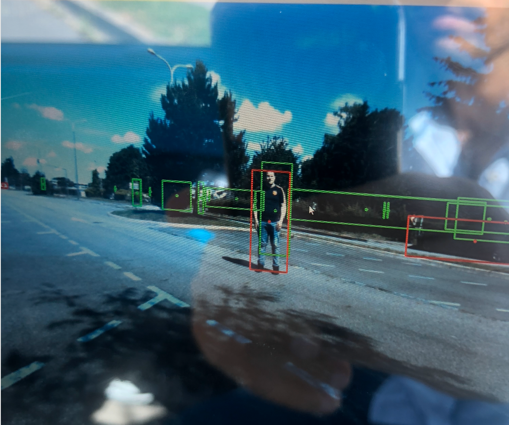

---

<!-- .slide: data-background="white" -->

- get **3D bounding boxes** on both ends &rarr; fuse results
- get **2D bounding boxes** on both sides &rarr; fuse results

---

### late fusion | **late fusion in 3D**

---

### late fusion | **late fusion in 3D**

multiple steps,

---

<!-- .slide: data-background="white" -->

### late fusion | **late fusion in 3D**

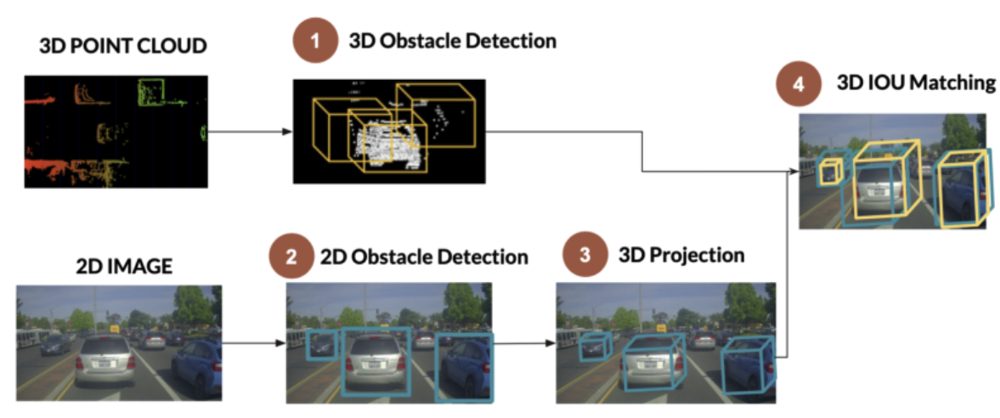

**step 1** &rarr; 3D obstacle detection \[**LiDAR**\]

Note:
- 3D obstacle detection → ML methods
- unsupervised machine learning
- deep learning algos (e.g. RANDLA-NET)

---

<!-- .slide: data-background="white" -->

### late fusion | **late fusion in 3D**

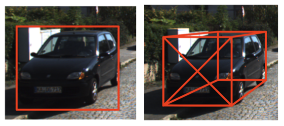

**step 2** &rarr; 3D obstacle detection \[**camera**\] &rarr; **much harder**

Note:
- deep learning + size/orientation of vehicles
- IOU matching → bounding boxes from camera or lidar overlap in 3d/2d

---

<!-- .slide: data-background="white" -->

### late fusion | **IOU matching in space**

**step 3** &rarr; **IoU matching** in space

Note:
- IOU matching → bounding boxes from camera or lidar overlap in 3d/2d

---

<!-- .slide: data-background="white" -->

### late fusion | **IoU matching**

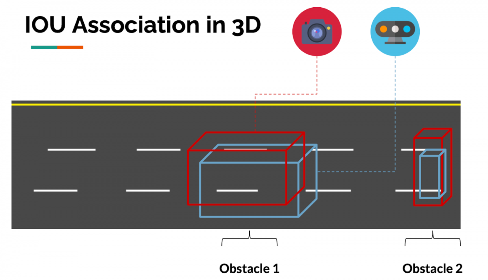
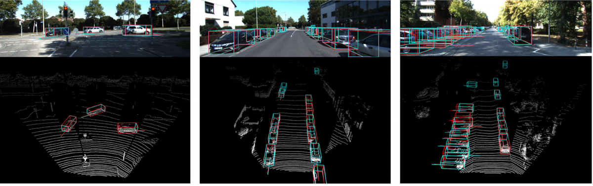

---

### late fusion | **IoU matching in time**

need to ensure the **frames also match in time**!

---

### late fusion | **IoU matching in time**

need to ensure the **frames also match in time**!

- associate objects **in time**, from frame to frame
- also **predict next positions**

---

### late fusion | **IoU matching in time**

need to ensure the **frames also match in time**!

- associate objects **in time**, from frame to frame
- also **predict next positions**
- bounding boxes **overlap** between consecutive frames &rarr; same obstacle

---

### late fusion | **IoU matching in time**

need to ensure the **frames also match in time**!

- associate objects **in time**, from frame to frame
- also **predict next positions**
- bounding boxes **overlap** between consecutive frames &rarr; same obstacle

algorithms used &rarr; **Kalman Filter**, **Hungarian Algorithm**, **SORT**

Note:
- SORT – simple online realtime tracking

---

## references

- **IMUs** &rarr; [What is an IMU?](https://www.vectornav.com/resources/inertial-navigation-articles/what-is-an-inertial-measurement-unit-imu)
- **sensor fusion classification** &rarr; [9 types of sensor fusion algorithms](https://www.thinkautonomous.ai/blog/?p=9-types-of-sensor-fusion-algorithms)
- **camera + LiDAR fusion** &rarr; [LiDAR and Camera Sensor Fusion in Self-Driving Cars](https://www.thinkautonomous.ai/blog/?p=lidar-and-camera-sensor-fusion-in-self-driving-cars)
- **3D bounding box estimation** &rarr; [arXiv:1612.00496](https://arxiv.org/pdf/1612.00496.pdf)
- **homogeneous coordinates** &rarr; [Wikipedia](https://en.wikipedia.org/wiki/Homogeneous_coordinates)
- **RANDLA-NET** &rarr; Hu et al., _RandLA-Net: Efficient Semantic Segmentation of Large-Scale Point Clouds_, CVPR 2020
- **SORT tracker** &rarr; Bewley et al., _Simple Online and Realtime Tracking_, ICASSP 2016
