# safety and standards

## **Design of Autonomous Systems**
### csci 6907/4907-Section 86
### Prof. **Sibin Mohan**

---

self-driving in vehicles adds layers of (software) intelligence

---

amount of software needed to achieve "autonomy"

---

amount of software needed to achieve "autonomy"

will _far_ exceed the current software deployments

---

need a **proper structure** for such systems

---

need a **proper structure** for such systems

- shift from **open, deterministic components** 

---

need a **proper structure** for such systems

- shift from **open, deterministic components** 
- to more opaque, more probabilistic software components

---

need a **proper structure** for such systems

- shift from **open, deterministic components** 
- to more opaque, more probabilistic software components

new challenges for system designers

---

makes analysis of **safety guarantees** that much harder! 

---

multiple standards proposed 

Note:
As the (hardware and software) functionality and complexities increase, the standards themselves will likely have to be updated. One point to highlight is that the _primary_ motivation of autonomous car technologies is reducing the frequency of traffic collisions.

---

**multiple standards** proposed 

**primary** motivation &rarr; reduce frequency of traffic collisions

---

first, we look **functional safety** requirements for autonomous systems

---

## Levels of Automation

---

[NHTSA](https://www.nhtsa.gov/vehicle-safety/automated-vehicles-safety#the-topic-safety-timeline) defines **five levels of automation** for vehicles

---

|level|description|responsibility|examples|
|:----|:-----|:-----|----|
| <scb>0</scb> | system provides **momentary** assistance &rarr; warnings, emergency interventions | **driver** | |
||

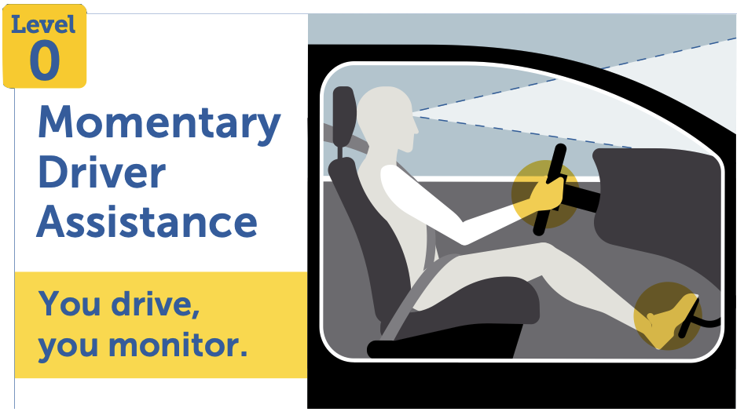

---

|level|description|responsibility|examples|
|:----|:-----|:-----|----|
| <scb>0</scb> | system provides **momentary** assistance &rarr; warnings, emergency interventions | **driver** | automatic emergency braking, forward collision warning, lane departure warning |
||

---

|level|description|responsibility|examples|
|:----|:-----|:-----|----|
| <scb>1</scb> | system provides **continuous** assistance &rarr; acceleration/braking **or** steering| **driver** | 
||

Note:
-  the system provides continuous assistance with either acceleration/braking **or** steering, while driver remains fully engaged and attentive. Driver is fully still responsible for driving the vehicle.

---

|level|description|responsibility|examples|
|:----|:-----|:-----|----|
| <scb>1</scb> | system provides **continuous** assistance &rarr; acceleration/braking **or** steering| **driver**  | adaptive cruise control, lane keeping assistance|
||

---

|level|description|responsibility|examples|
|:----|:-----|:-----|----|
| <scb>2</scb> | system provides **continuous** assistance &rarr; acceleration/braking **and** steering| **driver** | |
||

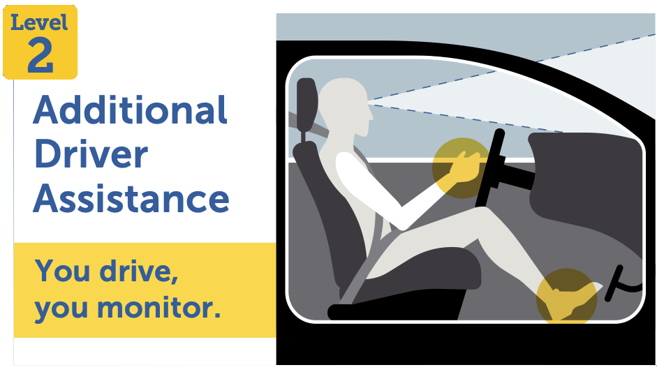

---

|level|description|responsibility|examples|
|:----|:-----|:-----|----|
| <scb>2</scb> | system provides **continuous** assistance &rarr; acceleration/braking **and** steering| **driver** | highway pilot|
||

---

|level|description|responsibility|examples|
|:----|:-----|:-----|----|
| <scb>3</scb> | system **actively** performs driving tasks | **system**   (driver takes over if needed) | |
||

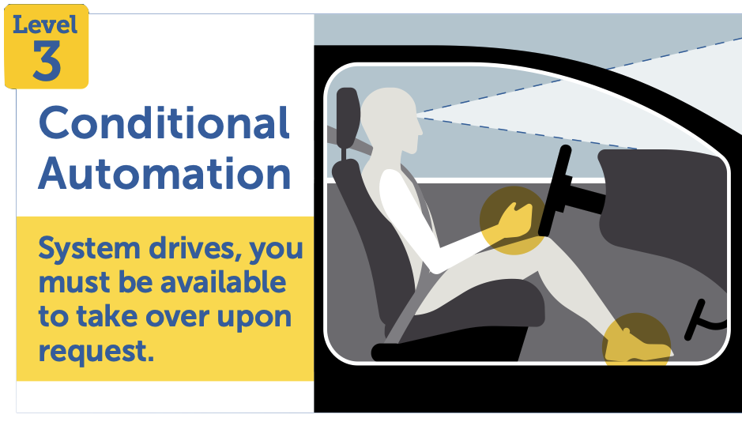

Note:
- If the system can no longer operate and prompts the driver, the driver must be available to resume all aspects of the driving task.

---

|level|description|responsibility|examples|
|:----|:-----|:-----|----|
| <scb>3</scb> | system **actively** performs driving tasks | **system**   (driver takes over if needed) |modern electric cars, _e.g.,_  Tesla |
||

---

|level|description|responsibility|examples|
|:----|:-----|:-----|----|
| <scb>4</scb> | system **fully responsible** for driving tasks &rarr; within **limited** service areas | **system** ||
||

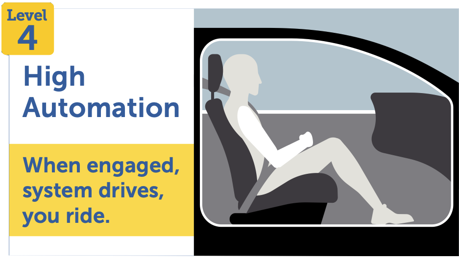

Note:
occupants act only as passengers and do not need to be engaged. A human driver is not needed to operate the vehicle.

---

|level|description|responsibility|examples|
|:----|:-----|:-----|----|
| <scb>4</scb> | system **fully responsible** for driving tasks &rarr; within **limited** service areas | **system** | Waymo?|
||

---

|level|description|responsibility|examples|
|:----|:-----|:-----|----|
| <scb>5</scb> | system **fully responsible** for driving tasks **everywhere** | **system** || 
||

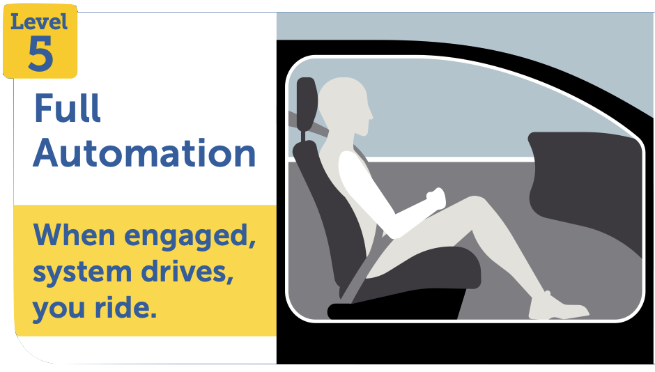

Note:
The system can operate the vehicle universally – under all conditions and on all roadways. A human driver is not needed to operate the vehicle.

---

|level|description|responsibility|examples|
|:----|:-----|:-----|----|
| <scb>5</scb> | system **fully responsible** for driving tasks **everywhere** | **system** |**none**| 
||

---

## **SAE J3016** | Standard for Functional Safety 

---

### **SAE J3016** | Standard for Functional Safety 

defines **functional architectures** for modern autonomous systems

---

"functional architecture" specifies,

---

"functional architecture" specifies,

- **intended functionality** and 

---

"functional architecture" specifies,

- **intended functionality** and 
- **interactions** 

---

"functional architecture" specifies,

- **intended functionality** and 
- **interactions** 

 

inspired by [ISO 26262](https://www.iso.org/standard/68383.html) automotive standard

---

main goal &rarr; vehicle must remain **safe**

Note:

This matches the "functional views" in software architectures -- code is clustered into groups and distributed to different teams in order to reason about them. It closely aligns with the [V Waterfall](https://dl.acm.org/doi/10.1145/1764810.1764814) model of software development.

---

first, some definitions:

---

first, some definitions:

| **term** | description |
|----------|-------------|
| **OEM** | original equipment manufacturers |

---

first, some definitions:

| **term** | description |
|----------|-------------|
| **OEM** | original equipment manufacturers |
| **ECU** | electronic control units |

---

first, some definitions:

| **term** | description |
|----------|-------------|
| **OEM** | original equipment manufacturers |
| **ECU** | electronic control units |
| **[CAN](https://www.csselectronics.com/pages/can-bus-simple-intro-tutorial), [Flexray](https://www.ni.com/en/shop/seamlessly-connect-to-third-party-devices-and-supervisory-system/flexray-automotive-communication-bus-overview.html?srsltid=AfmBOoqDL3Ir4GQ0bTWSjM2sK_NnTXp9N7MkCDX6o-wPPwi1YsDbqtz8)** | communication buses/standards |

---

first, some definitions:

| **term** | description |
|----------|-------------|
| **OEM** | original equipment manufacturers |
| **ECU** | electronic control units |
| **[CAN](https://www.csselectronics.com/pages/can-bus-simple-intro-tutorial), [Flexray](https://www.ni.com/en/shop/seamlessly-connect-to-third-party-devices-and-supervisory-system/flexray-automotive-communication-bus-overview.html?srsltid=AfmBOoqDL3Ir4GQ0bTWSjM2sK_NnTXp9N7MkCDX6o-wPPwi1YsDbqtz8)** | communication buses/standards |
| **[AUTOSAR](https://www.autosar.org)** | software technology platforms |
||

---

important **caveat**

---

important **caveat**

- SAE J3016 standard **does not** provide _strict_ requirements

---

important **caveat**

- SAE J3016 standard **does not** provide _strict_ requirements
- purpose &rarr; **descriptive** and **broad** about evolution of systems

---

important **caveat**

- SAE J3016 standard **does not** provide _strict_ requirements
- purpose &rarr; **descriptive** and **broad** about evolution of systems

---

**incremental evolution** 

from no automation (level <scb>0</scb>) to full automation (level <scb>5</scb>)

---

### some important (standardized) terms from SAE J3016

---

### some important (standardized) terms from SAE J3016

| **term** | **description** | **examples** |
|----------|-----------------|--------------|
| **Dynamic Driving Task (DDT)** | real-time operational & tactical functions | steering, braking, lane keeping, trajectory planning |

Note:
- excluding strategic functions such as trip scheduling or route planning. 
- includes actuator control/tactical planning, tactical planning such as generating and following a trajectory

---

### some important (standardized) terms from SAE J3016

| **term** | **description** | **examples** |
|----------|-----------------|--------------|
| **Dynamic Driving Task (DDT)** | real-time operational & tactical functions | steering, braking, lane keeping, trajectory planning |
| **Driving automation system** | hardware/software systems for DDT on sustained basis | automated parking, lane keep assistance |

Note:
- Driving automation systems are composed of design-specific functionality called features. Focus is on the interplay between software components to design systems capable of achieving full autonomy.

---

### some important (standardized) terms from SAE J3016

| **term** | **description** | **examples** |
|----------|-----------------|--------------|
| **Operational Design Domains (ODD)** | specific conditions (weather/traffic) under which automation system is designed to function | sunny city driving, winter mountain roads |

Note:
- Requirements vary based on the domain. Full autonomy requires operation in all weather and traffic conditions.

---

### some important (standardized) terms from SAE J3016

| **term** | **description** | **examples** |
|----------|-----------------|--------------|
| **Operational Design Domains (ODD)** | specific conditions (weather/traffic) under which automation system is designed to function | sunny city driving, winter mountain roads |
| **DDT fall-back** | response by user or Automated Driving System (ADS) to either perform DDT task or achieve a safety state | user intervention, safety state activation |

---

### some important (standardized) terms from SAE J3016

| **term** | **description** | **examples** |
|----------|-----------------|--------------|
| **DDT fall-back-ready user** | user who is able to operate vehicle and intervene when required | driver ready to take control |

---

### some important (standardized) terms from SAE J3016

| **term** | **description** | **examples** |
|----------|-----------------|--------------|
| **DDT fall-back-ready user** | user who is able to operate vehicle and intervene when required | driver ready to take control |
| **DDT feature** | design-specific functionality at driving automation level for particular ODD | lane assistance in sunny weather |
||

---

features/terms mapped to five levels of automation:

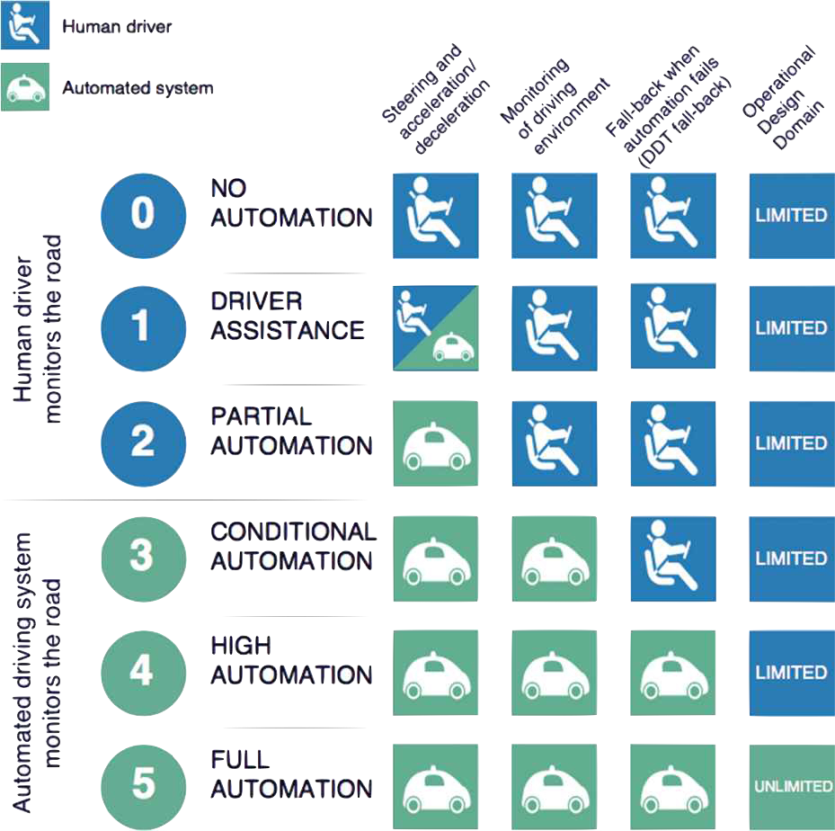

---

features/terms mapped to five levels of automation:

  

 
 

things to notice:

1. who **monitors** the road?

Note:
&rarr; in the case of no automation up to partial automation (levels 0-2), the environment is monitored by a human driver, while for higher degrees of automation (levels 3-5), the vehicle becomes responsible for environmental monitoring.

---

features/terms mapped to five levels of automation:

  

 
 

things to notice:

1. who **monitors** the road? 
2. who is the **fall back**?

Note:
intelligent driving automation systems (levels 4-5) embed the responsibility for automation fall-back constrained or not by operational domains, while for low levels of automation (levels 0-3) a human driver is fully responsible.

---

SAE standard defines **three classes of components**

---

SAE standard defines **three classes of components**

| class | definition |
|:------|:-----------|
| **operational** | basic vehicle control |

---

SAE standard defines **three classes of components**

| class | definition |
|:------|:-----------|
| **operational** | basic vehicle control |
| **tactical** | planning and execution &rarr; event, object avoidance, expedited route following |

---

SAE standard defines **three classes of components**

| class | definition |
|:------|:-----------|
| **operational** | basic vehicle control |
| **tactical** | planning and execution &rarr; event, object avoidance, expedited route following |
| **strategic** | destination and general route planning |
||

---

each class &rarr; **incremental role** in design of autonomous systems

---

classes are connected as follows

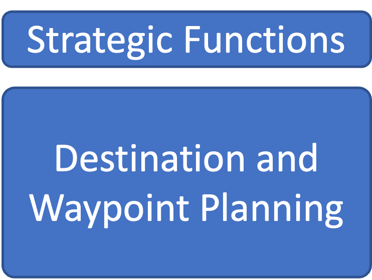

---

classes are connected as follows

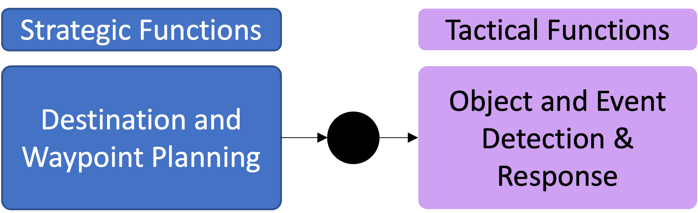

---

classes are connected as follows

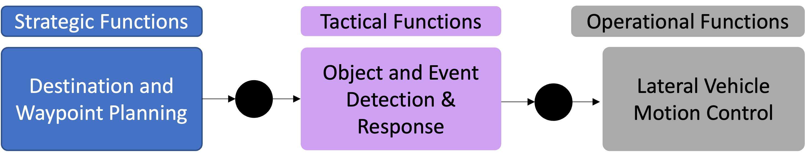

---

classes are connected as follows

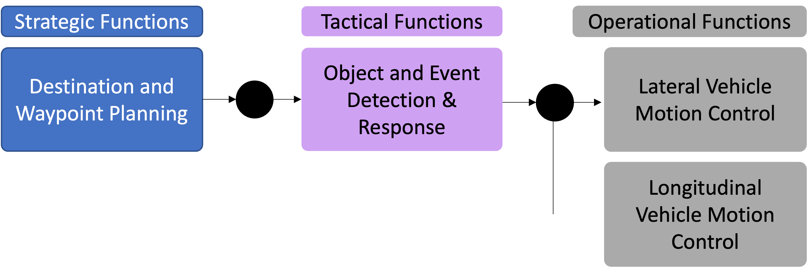

---

classes are connected as follows

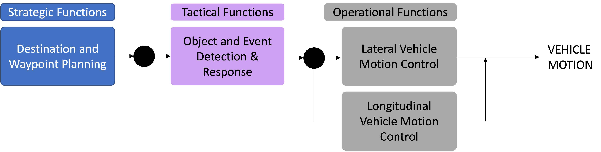

---

classes are connected as follows

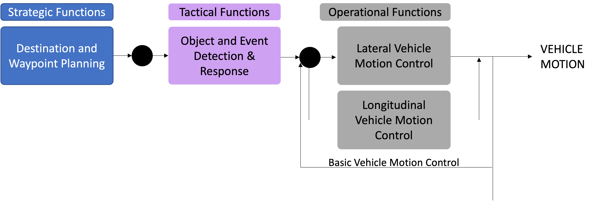

---

classes are connected as follows

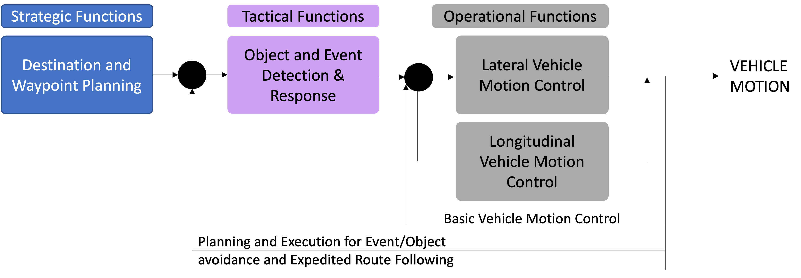

---

classes are connected as follows

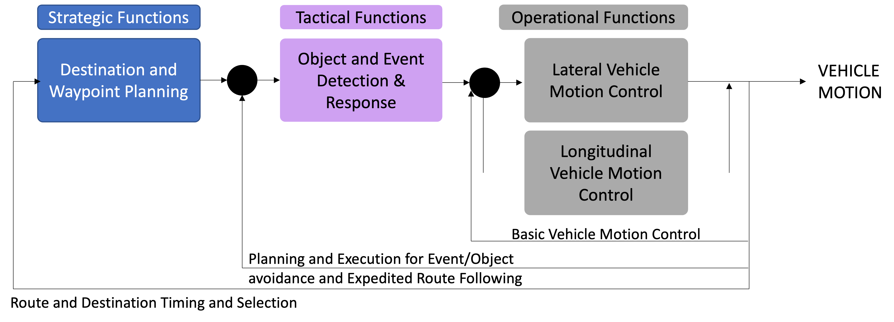

---

classes are connected as follows

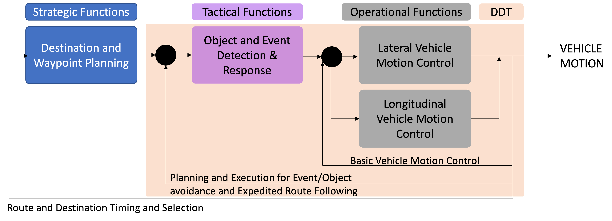

||||
|----------|-----------------|--------------|
| **DDT** | real-time operational & tactical functions | steering, braking, lane keeping, trajectory planning |
||

---

a close analogue to sensing &rarr; control/planning &rarr; actuation pipeline 

---

OEM may implement each components **differently**

---

sensing &rarr; planning &rarr; actuation pipeline 

- **decomposed** into smaller components

---

sensing &rarr; planning &rarr; actuation pipeline

- **decomposed** into smaller components
- can match the SAE standard

---

### decomposition

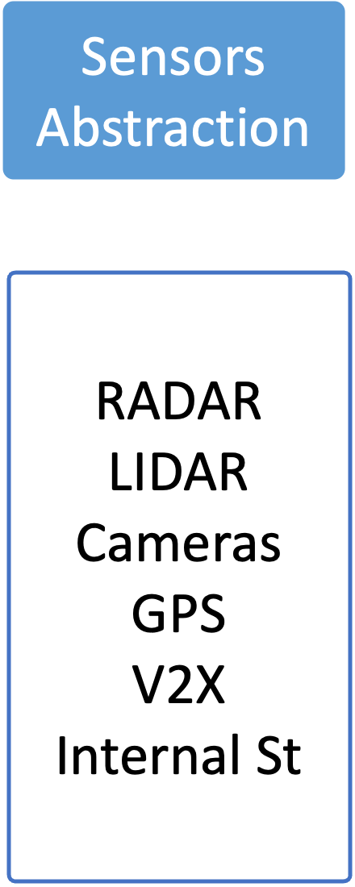

---

### decomposition

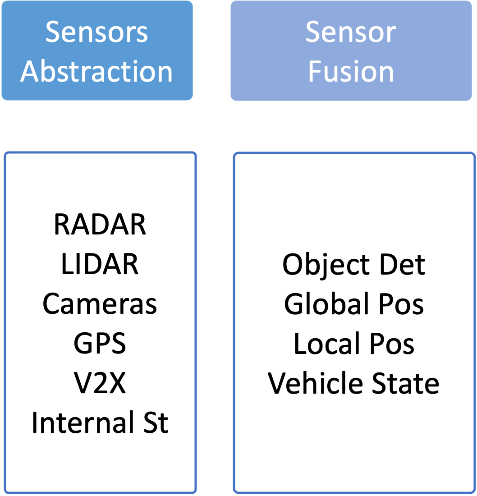

---

### decomposition

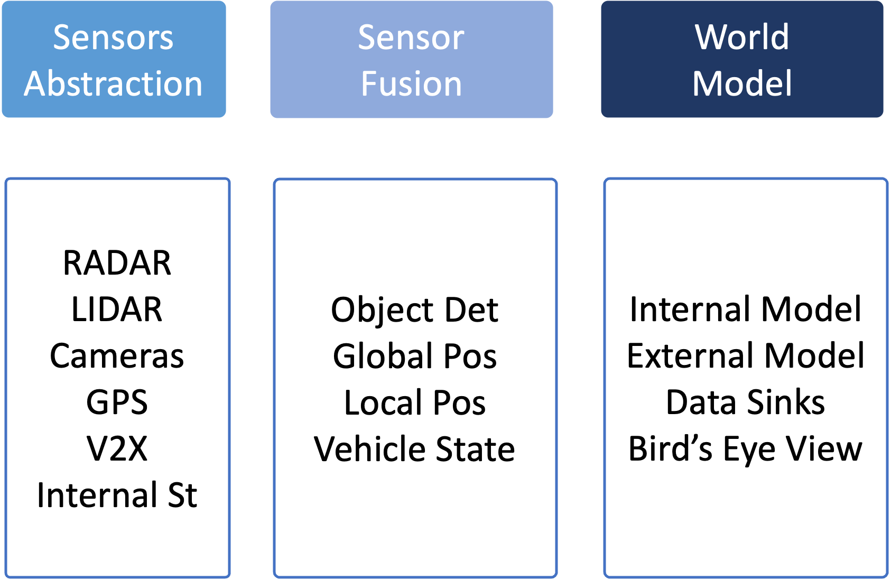

Note:
The **world model** stored data (_e.g.,_   maps) maintain knowledge about,

- images
- maps
- entities
- events

and also **relationships** between them. 

World modeling stores and uses **historical information** (from past processing loops) and provides **interfaces** to query and filter its content for other components

---

### decomposition

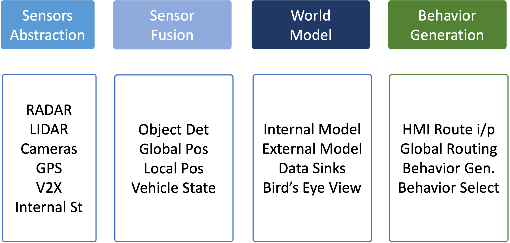

Note:
**Behavior generation** &rarr; is the **highest cognitive class** of functions in the architecture. It develops a number of possible state sequences from the current state and the behavior reasoning module selects the best alternative.

---

### decomposition

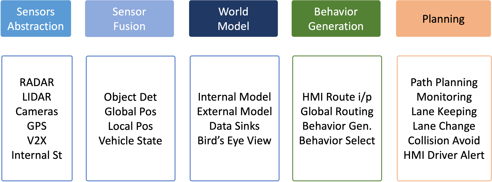

---

### decomposition

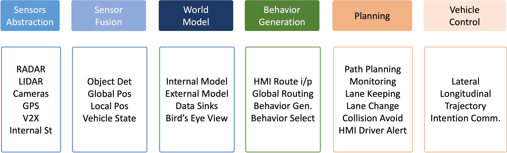

---

### decomposition

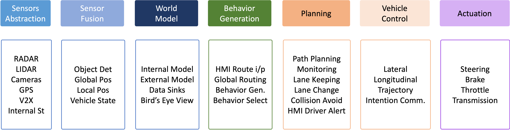

---

### data flow path/direction

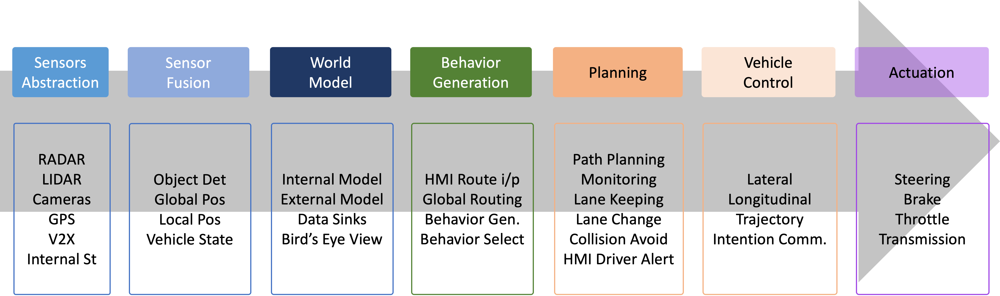

Note:

The data in this decomposed functional diagram, flows **left &rarr; right**.

---

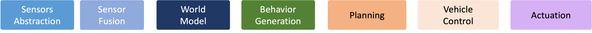

---

 

map these back to operational classes, 

---

map these back to operational classes, 

- vehicle control/actuators interface &rarr; **operational** class

---

map these back to operational classes, 

- vehicle control/actuators interface &rarr; **operational** class
- planning class &rarr; **tactical** 

---

map these back to operational classes, 

- vehicle control/actuators interface &rarr; **operational** class
- planning class &rarr; **tactical** 
- behavior generation &rarr; **both** strategic and planning 

---

**orthogonal classes**

---

**orthogonal classes**

|class| description|
|:---------------|:-----------|
| **data management** | long term data storage & retrieval|

 

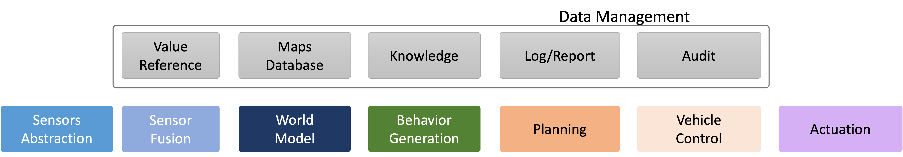

---

**orthogonal classes**

|class| description|
|:---------------|:-----------|
| **data management** | long term data storage & retrieval|
| **system and safety management** | DDT fall-back or safety mechanisms|
||

 

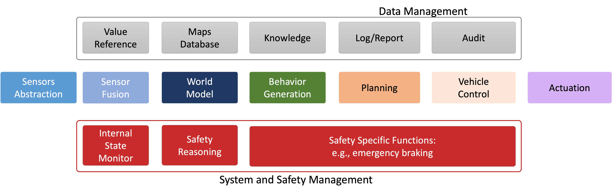

Note:
- they act in parallel of normal control loops

---

one other orthogonal class &rarr; **security**

---

(closely) matches our initial course/system design

 

---

functional decomposition diagram 

matches software components in **[AUTOSAR](https://www.autosar.org)**

Note:
- a software standardization architecture that is popular in industry. 
- The interfaces between the various components can be implemented using AUTOSAR's standardized interface definitions. 

---

**actual interaction** between critical components

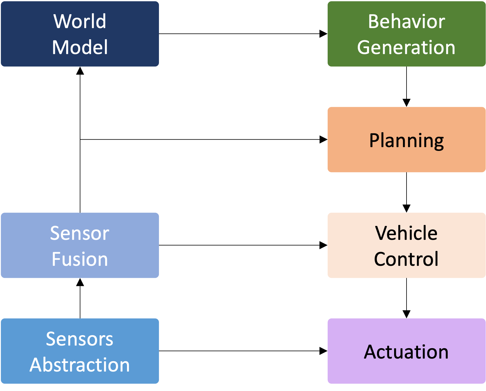

---

read [actual standard](https://sibin.github.io/teaching/csci6907_88-gwu/secure_autonomous/fall_2022/other_docs/J3016_201609.pdf) for full understanding

here is a [good explanation](https://www.atlantis-press.com/journals/jase/125934832/view) and summary

---

## ANSI/UL 4600 Standard 

---

[ANSI/UL 4600](https://users.ece.cmu.edu/~koopman/ul4600/191213_UL4600_VotingVersion.pdf) &rarr; Safety for Evaluation of Autonomous Products

---

### ANSI/UL 4600 Standard 

this is an "umbrella" for coordinating,

---

### ANSI/UL 4600 Standard 

this is an "umbrella" for coordinating,

- **software development practices**

---

### ANSI/UL 4600 Standard 

this is an "umbrella" for coordinating,

- **software development practices**
- computer-based system safety standards 

---

### ANSI/UL 4600 Standard 

this is an "umbrella" for coordinating,

- **software development practices**
- computer-based system safety standards 

 

ensure nothing is left out &rarr; when **assuring safety**

---

first comprehensive standard to cover both &rarr; urban and highway cases

---

[**key** ideas](https://users.ece.cmu.edu/~koopman/ul4600/L109_UL4600.pdf) 

- system-level safety case provides direction

---

[**key** ideas](https://users.ece.cmu.edu/~koopman/ul4600/L109_UL4600.pdf) 

- system-level safety case provides direction
- vehicle, infrastructure, lifecycle processes all matter

---

[**key** ideas](https://users.ece.cmu.edu/~koopman/ul4600/L109_UL4600.pdf) 

- system-level safety case provides direction
- vehicle, infrastructure, lifecycle processes all matter
- safety metrics used for feedback loops

---

[**key** ideas](https://users.ece.cmu.edu/~koopman/ul4600/L109_UL4600.pdf) 

- system-level safety case provides direction
- vehicle, infrastructure, lifecycle processes all matter
- safety metrics used for feedback loops
- third party component interface protects proprietary info

---

[**key** ideas](https://users.ece.cmu.edu/~koopman/ul4600/L109_UL4600.pdf) 

- system-level safety case provides direction
- vehicle, infrastructure, lifecycle processes all matter
- safety metrics used for feedback loops
- third party component interface protects proprietary info
- 4600 helps you know that you’ve done enough work on safety

---

UL 4600 &rarr; generating **[safety cases](https://ieeexplore.ieee.org/stamp/stamp.jsp?tp=&arnumber=10109263)**

---

<scb>4600</scb> is **not prescriptive** 

(_i.e.,_  doesn't say "do X")

---

standard is **goal-oriented**

---

standard is **goal-oriented** &rarr; answering questions like,

> "what should a safety case address?"

Note:
- So the idea is to avoid saying, "using this engineering/software approach to solve problem X". 

---

what are standards to **assess** a safety case?

---

what are standards to **assess** a safety case?

- minimum **coverage** requirement &rarr; what goes in the safety case?

---

what are standards to **assess** a safety case?

- minimum **coverage** requirement &rarr; what goes in the safety case?
- **properties** of a well-formed safety case

---

what are standards to **assess** a safety case?

- minimum **coverage** requirement &rarr; what goes in the safety case?
- **properties** of a well-formed safety case
- objective **assessment** criteria

---

safety case using **claims, arguments and evidence**

---

safety case using **claims, arguments and evidence**

 

|claim/sub-claim | argument | evidence |
|:-----|:---------|:---------|

---

safety case using **claims, arguments and evidence**

 

|claim/sub-claim  property of system | argument| evidence|
|:-----|:---------|:---------|

---

safety case using **claims, arguments and evidence**

 

|claim/sub-claim  property of system | argument   why is it true? | evidence|
|:-----|:---------|:---------|

---

safety case using **claims, arguments and evidence**

 

|claim/sub-claim  property of system | argument   why is it true? | evidence   supports argument |
|:-----|:---------|:---------|

---

safety case using **claims, arguments and evidence**

 

|claim/sub-claim  property of system | argument   why is it true? | evidence   supports argument |
|:-----|:---------|:---------|
| "system avoids pedestrians" | "detects and maneuver to avoid" | tests, simulations, formal analyses |

---

safety case using **claims, arguments and evidence**

 

|claim/sub-claim  property of system | argument   why is it true? | evidence   supports argument |
|:-----|:---------|:---------|
| "system avoids pedestrians" | "detects and maneuver to avoid" | tests, simulations, formal analyses |
| "detect pedestrians" (**sub claim**)| -- | evidence |

---

safety case using **claims, arguments and evidence**

 

|claim/sub-claim  property of system | argument   why is it true? | evidence   supports argument |
|:-----|:---------|:---------|
| "system avoids pedestrians" | "detects and maneuver to avoid" | tests, simulations, formal analyses |
| "detect pedestrians" (**sub claim**)| -- | evidence |
| "maneuvers around pedestrians (**sub claim**) | -- | evidence |

---

safety case using **claims, arguments and evidence**

 

|claim/sub-claim  property of system | argument   why is it true? | evidence   supports argument |
|:-----|:---------|:---------|
| "system avoids pedestrians" | "detects and maneuver to avoid" | tests, simulations, formal analyses |
| "detect pedestrians" (**sub claim**)| -- | evidence |
| "maneuvers around pedestrians (**sub claim**) | -- | evidence |
| "stops if can't maneuver" (**sub claim**) | -- | evidence |

---

safety case using **claims, arguments and evidence**

 

|claim/sub-claim  property of system | argument   why is it true? | evidence   supports argument |
|:-----|:---------|:---------|
| "system avoids pedestrians" | "detects and maneuver to avoid" | tests, simulations, formal analyses |
| "detect pedestrians" (**sub claim**)| -- | evidence |
| "maneuvers around pedestrians (**sub claim**) | -- | evidence |
| "stops if can't maneuver" (**sub claim**) | -- | evidence |
|...|...|...|
||

---

diagrammatic representation

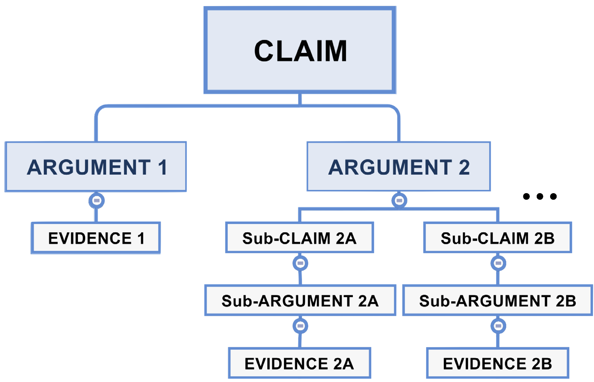

---

safety cases need to consider many things

---

safety cases need to consider many things

|||
|:---|:---|
| **technology** | hw/sw, machine learning, tools, … |

---

safety cases need to consider many things

|||
|:---|:---|
| **technology** | hw/sw, machine learning, tools, … |
| **lifecycle** | deployment, operation, incidents, maintenance, … |

---

safety cases need to consider many things

|||
|:---|:---|
| **technology** | hw/sw, machine learning, tools, … |
| **lifecycle** | deployment, operation, incidents, maintenance, … |
| **infrastructure** | vehicle, roads, data networks, cloud computing, … |

---

safety cases need to consider many things

|||
|:---|:---|
| **technology** | hw/sw, machine learning, tools, … |
| **lifecycle** | deployment, operation, incidents, maintenance, … |
| **infrastructure** | vehicle, roads, data networks, cloud computing, … |
| **road users** | pedestrians, light mobility, emergency responders, … |

---

safety cases need to consider many things

|||
|:---|:---|
| **technology** | hw/sw, machine learning, tools, … |
| **lifecycle** | deployment, operation, incidents, maintenance, … |
| **infrastructure** | vehicle, roads, data networks, cloud computing, … |
| **road users** | pedestrians, light mobility, emergency responders, … |
| **environment** | operational design domain (odd) definition |
||

---

how do we know safety case is **valid**?

---

how do we know safety case is **valid**?

need **metrics**!

---

### Safety Performance Indicator (SPI)

to provide metrics on **validity** of safety cases

---

### Safety Performance Indicator (SPI)

to provide metrics on **validity** of safety cases

**context-dependent** and can include many aspects

---

### Safety Performance Indicator (SPI)

**context-dependent** and can include many aspects

- **acceptable violation rate** of standoff to pedestrians

---

### Safety Performance Indicator (SPI)

**context-dependent** and can include many aspects

- **acceptable violation rate** of standoff to pedestrians
- **gap tolerance** of up to X meters in lane markings

---

### Safety Performance Indicator (SPI)

**context-dependent** and can include many aspects

- **acceptable violation rate** of standoff to pedestrians
- **gap tolerance** of up to X meters in lane markings
- **false negative rate** for camera/LiDAR
- _etc._ 

---

read [full standard](https://www.shopulstandards.com/ProductDetail.aspx?productid=UL4600) online

here is a [draft version](https://users.ece.cmu.edu/~koopman/ul4600/191213_UL4600_VotingVersion.pdf) 

---

## Other Standards/Efforts

1. [IEEE suite of standards](https://standards.ieee.org/initiatives/autonomous-intelligence-systems/standards/) &rarr; **autonomous and intelligent systems**
2. [NIST efforts on autonomous systems assurance](https://www.nist.gov/programs-projects/autonomous-systems-assurance) 
    - **verify** autonomous systems function correctly 
    - _e.g.,_  [Combinatorial Methods for Trust and Assurance](https://csrc.nist.gov/projects/automated-combinatorial-testing-for-software)
3. [Wikipedia summary of safety/standardization efforts](https://en.wikipedia.org/wiki/Regulation_of_self-driving_cars)

---

real question &rarr; **who pays** for accidents?

---

## Self-driving Car Liability

---

> "who is **liable** for the actions of the car?"

---

> "who is **liable** for the actions of the car?"

- the car **owner**?
- the car **manufacturer**?
- the **software/hardware developers**?
- the **city/state/federal governments**?
- someone else?

---

active area of research/discussion &rarr; especially in legal community

---

for existing liability laws must evolve 

---

for existing liability laws must evolve 

identify remedies for **damage** and **injury**

---

particularly problematic for higher levels of autonomy (levels <scb>4</scb> and <scb>5</scb>)

---

various countries &rarr; drafting policies and laws

(UK, France, Germany, Japan, _etc._ ) 

---

**US-based efforts**

---

1. policy proposal &rarr; [liability with **manufacturer**](https://digitalcommons.law.scu.edu/cgi/viewcontent.cgi?article=2731&context=lawreview) of vehicles 

---

2. NHTSA report, "[Automated Highway Systems](https://www.thefreelibrary.com/_/print/PrintArticle.aspx?id=16112768)" 

---

2. NHTSA report, "[Automated Highway Systems](https://www.thefreelibrary.com/_/print/PrintArticle.aspx?id=16112768)" 

 
 

- states are responsible for determining liability rules

Note:
-  States should consider how to allocate liability among owners, operators, passengers, manufacturers, and others when a crash occurs.

---

2. NHTSA report, "[Automated Highway Systems](https://www.thefreelibrary.com/_/print/PrintArticle.aspx?id=16112768)" 

 
 

- states are responsible for determining liability rules
- determination of who or what is “**driver**” 

---

2. NHTSA report, "[Automated Highway Systems](https://www.thefreelibrary.com/_/print/PrintArticle.aspx?id=16112768)" 

 
 

- states are responsible for determining liability rules
- determination of who or what is “**driver**” 
    - **does not necessarily determine liability** for crashes 

Note:
-  States should consider how to allocate liability among owners, operators, passengers, manufacturers, and others when a crash occurs.

---

2. [H.R. 3388, Self Drive Act](https://www.congress.gov/bill/115th-congress/house-bill/3388#:~:text=The%20bill%20preempts%20states%20from,standards%20identical%20to%20federal%20standards) of 2017

---

2. [H.R. 3388, Self Drive Act](https://www.congress.gov/bill/115th-congress/house-bill/3388#:~:text=The%20bill%20preempts%20states%20from,standards%20identical%20to%20federal%20standards) of 2017

 
 

- advance safety by **prioritizing the protection of consumers**

---

2. [H.R. 3388, Self Drive Act](https://www.congress.gov/bill/115th-congress/house-bill/3388#:~:text=The%20bill%20preempts%20states%20from,standards%20identical%20to%20federal%20standards) of 2017

 
 

- advance safety by **prioritizing the protection of consumers**
- reaffirm role and responsibilities of federal and state governments

---

2. [H.R. 3388, Self Drive Act](https://www.congress.gov/bill/115th-congress/house-bill/3388#:~:text=The%20bill%20preempts%20states%20from,standards%20identical%20to%20federal%20standards) of 2017

 
 

- advance safety by **prioritizing the protection of consumers**
- reaffirm role and responsibilities of federal and state governments
- update the Federal Motor Vehicle Safety Standards to account 

---

2. [H.R. 3388, Self Drive Act](https://www.congress.gov/bill/115th-congress/house-bill/3388#:~:text=The%20bill%20preempts%20states%20from,standards%20identical%20to%20federal%20standards) of 2017

 
 

- advance safety by **prioritizing the protection of consumers**
- reaffirm role and responsibilities of federal and state governments
- update the Federal Motor Vehicle Safety Standards 
    - advances in technology and evolution of automated vehicles

---

2. [H.R. 3388, Self Drive Act](https://www.congress.gov/bill/115th-congress/house-bill/3388#:~:text=The%20bill%20preempts%20states%20from,standards%20identical%20to%20federal%20standards) of 2017

 
 

- advance safety by **prioritizing the protection of consumers**
- reaffirm role and responsibilities of federal and state governments
- update the Federal Motor Vehicle Safety Standards 
    - advances in technology and evolution of automated vehicles

interestingly, H.R. 3388 is **limiting the role of states**!

---

efforts to gauge role of **ML/AI in autonomous systems**

---

efforts to gauge role of **ML/AI in autonomous systems**

tracking liability when such agents are making choices

Note:
. But since ML/AI is a fast moving field, developing new policies/laws is quite challenging.

---

[NTSB investigation of Tesla 2016 crash ](https://www.ntsb.gov/investigations/AccidentReports/Reports/HAR1702.pdf) makes for an interesting read 
