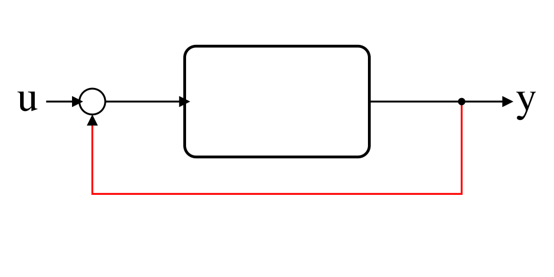
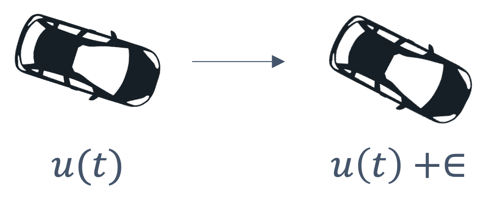
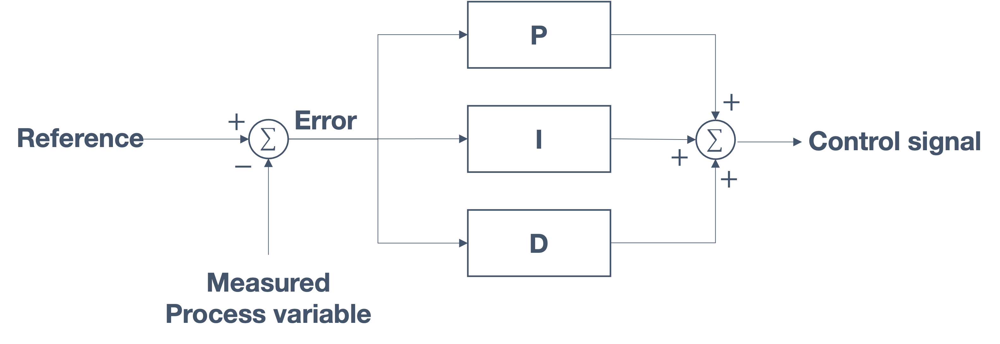

# control theory

## **Design of Autonomous Systems**
### csci 6907/4907-Section 86
### Prof. **Sibin Mohan**

---

consider a simple problem &rarr; how do you balance a ball?

Note:
- discuss pen balance
- show example in class
- what is the "input"?
- what is the "output"? 
- what is the "desired state"?

---

consider a simple problem &rarr; how do you balance a ball?

---

consider a simple problem &rarr; how do you balance a ball?

ok, that's a bit hard!

---

let's simplify &rarr; in a **one-dimensional** plane?

---

balance a ball &rarr; in the **middle** of a table

---

balance a ball &rarr; in the **middle** of a table

pretty good attempt but **unstable**!

---

### goals

- the ball remains **stable** and
- it is in the **middle** of the table

--- 

options

1. tilt the table down on the left (**anti-clockwise**)
2. title the table down on the right (**clockwise**)

---

options

1. tilt the table down on the left (**anti-clockwise**)
2. title the table down on the right (**clockwise**)

---

options

1. tilt the table down on the left (**anti-clockwise**)
2. title the table down on the right (**clockwise**)
3. control the **speed** at which the table tilts

---

### parameters for the problem

---

### parameters for the problem

|type | options |
|-----|---------|
| **inputs** | speed (clockwise, anticlockwise) |

---

### parameters for the problem

|type | options |
|-----|---------|
| **inputs** | speed (clockwise, anticlockwise) |
| **output** | ball velocity, acceleration |
||

---

we need to **control** outputs &rarr; modifying inputs to system

---

## control theory

---

## control theory

- **multidisciplinary** field &rarr; applied mathematics+engineering

---

## control theory

- **multidisciplinary** field &rarr; applied mathematics+engineering
- **wide** use &rarr; _e.g.,_  mechanical, aerospace, electrical, chemical, _etc._

---

## control theory

- **multidisciplinary** field &rarr; applied mathematics+engineering
- **wide** use &rarr; _e.g.,_  mechanical, aerospace, electrical, chemical, _etc._
- even biological sciences, finance, you name it!

---

anything that you,

---

anything that you,

- **want to control** and

---

anything that you,

- **want to control** and
- can **develop a model**

---

anything that you,

- **want to control** and
- can **develop a model**

develop a **controller** &rarr; using control theory

--- 

lots of **everyday** applications as well

--- 

lots of **everyday** applications as well

adaptive cruise control, thermostats, ovens, lawn sprinkler systems, _etc._

---

### control theory | **basic idea**

---

### control theory | **basic idea**

- **understand** a process or a system &rarr; develop a **model**

> **relationships between &rarr; inputs and outputs**

---

### control theory | **model**

---

### control theory | **model**

**adjust the inputs** :model &rarr; to get **desired outputs**

---

relationship between inputs and outputs &rarr; **empirical analysis**

---

relationship between inputs and outputs &rarr; **empirical analysis**

1. **make changes** to the input

---

relationship between inputs and outputs &rarr; **empirical analysis**

1. **make changes** to the input
2. wait for the system to **respond**

---

relationship between inputs and outputs &rarr; **empirical analysis**

1. **make changes** to the input
2. wait for the system to **respond**
2. **observe changes** in the output

Note:
- Even if the model is based on an equation from physics, the parameters within the model are still identified experimentally or through computer simulations.

---

this is **not** what we **really** want!

---

this is **not** what we **really** want!

so, what is is that we want?

---

what is the **objective**?

---

what is the **objective**?

_e.g.,_ balance the ball

---

what is the **objective**?

_e.g.,_ balance the ball &rarr; control the **output**

---

control the **output** &rarr; tune the **input**!

---

### simple example | **lightbulb**

---

### simple example | **lightbulb**

assume we don't know relationship between **bulb** and **switch**

---

assume we don't know relationship between **bulb** and **switch**

conduct a few experiments &rarr; capture the relationship

---

results of empirical analysis

|switch state   (input) | bulb state   (output)|
|---------------------|--------------------|
| off | off |
| on  | on |
||

---

results of empirical analysis

|switch state   (input) | bulb state   (output)|
|---------------------|--------------------|
| off | off |
| on  | on |
||

"model" of input (switch state) &rarr; output (ligthbulb state)

---

results of empirical analysis

|switch state   (input) | bulb state   (output)|
|---------------------|--------------------|
| off | off |
| on  | on |
||

"model" of input (switch state) &rarr; output (ligthbulb state)

**not** the control model

---

**not** the control model

### why?

---

we care about &rarr; if **bulb** is <scb>on</scb> (or <scb>off</scb>)

---

we care about &rarr; if **bulb** is <scb>on</scb> (or <scb>off</scb>)

**not** if switch is <scb>on</scb> (or <scb>off</scb>)

---

so to develop a **control model** &rarr; **invert** above relationship

---

### **control model** | lightbulb

---

### **control model** | lightbulb

|desired output   lightbulb state| corresponding input   switch state|
|---------------------|--------------------|

---

### **control model** | lightbulb

|desired output   lightbulb state| corresponding input   switch state|
|---------------------|--------------------|
| on | on |
| off  | off |
||

---

let's **formalize** things a little

---

consider following mathematical model

Note:
- The model says that if we change the input `u` the output `y` will change to be **twice** the value of the input `u`.

---

consider following mathematical model

remember &rarr; we want to get to a **specific output**, say $y^*$

---

_manipulate_ model &rarr; to get **control model**

---

_manipulate_ model &rarr; to get **control model**

$$u = \frac{y^*}{2}$$

---

$$u = \frac{y^*}{2}$$

for any **desired** value of $y^*$ &rarr; can identify input <scb>u</scb>

---

$$u = \frac{y^*}{2}$$

for any **desired** value of $y^*$ &rarr; can identify input <scb>u</scb>

we have jus designed our **first controller**!

---

### desired value, $y^*$ &rarr; **setpoint**

---

### course map

---

### Open-Loop vs Closed-Loop Control

---

if our model is accurate+no disturbances

---

if our model is accurate+no disturbances

$$ y = y^*$$

---

if our model is accurate+no disturbances

$$ y = y^*$$

nothing _guarantees_ this

---

## open loop controller

---

## open loop controller

desire certain outcome &rarr; _hope_ controller actually gets there

---

## open loop controller

---

## open loop controller

---

what we _really_ want &rarr; **ensure** controllers gets to setpoint

Note:
- problem is that while the input drives the output, there is no way to _guarantee_ that the controller will get to the set point

---

the solution &rarr; **feedback**

---

the solution &rarr; **feedback**

from output &rarr; input

---

## closed loop controller

---

## closed loop controller

- **adjust** <scb>u</scb>

---

## closed loop controller

- **adjust** <scb>u</scb>
- ensure that we get to $y^*$ 

---

## closed loop controller

- **adjust** <scb>u</scb>
- ensure that we get to $y^*$ 

(or, at least as close to it as possible)

---

## closed loop controller

feedback from &rarr; output of controller model we created

---

## closed loop controller

feedback from &rarr; output of controller model we created

---

## closed loop controller

feedback from &rarr; output of controller model we created

---

## closed loop controller

feedback from &rarr; output of controller model we created

feedback can be positive or negative

---

how to ensure car remains in **center** of lane?

---

how to ensure car remains in **center** of lane?

apply a **correction** to direction of motion

---

apply a **correction** to direction of motion

---

apply a **correction** to direction of motion

- **how** do we apply the corrections?
- **how much**? 
- **when** do we **stop**?

---

## Feedback Control

---

## Feedback Control

- _compare_ system state to the desired state

---

## Feedback Control

- _compare_ system state to the desired state
- apply a _change_ to system inputs &rarr; counteract deviations

---

## Feedback Control

- _compare_ system state to the desired state
- apply a _change_ to system inputs &rarr; counteract deviations
- repeat until desired outcome &rarr; setpoint

---

_e.g.,_ temperature control of a room

---

_e.g.,_ temperature control of a room

---

_e.g.,_ temperature control of a room

Note:
- thermostat needs to control/provide inputs to a furnace/AC,

---

_e.g.,_ temperature control of a room

Note:
- which then affects the temperature in the room:

---

_e.g.,_ temperature control of a room

so we're...done?

---

real world has **disturbances**

---

disturbances &rarr; heat loss, bad insulation, physical problems, _etc._

---

disturbances &rarr; heat loss, bad insulation, physical problems, _etc._

input **not sufficient** to achieve set point

---

provide "**feedback**" to controller

Note:
- Essentially the temperature reading of the room, _after_ the thermostat and furnace/AC have completed their operations based on the original inputs (desired temperature).

---

### some **technical** terms

Note:
-The "controller" is based on the "control model" that we developed earlier. It sends commands ("_actuation signals_") to an actuator and then affects the _process under control_. Finally, the _process variable_ (the "output" from the earlier discussions) is what we want to drive towards the set point.

---

another example &rarr; cruise control

---

another example &rarr; cruise control

**note** &rarr; how the feedback reaches controller

---

## closed-loop feedback control system

---

## closed-loop feedback control system

some of these inputs/edges have **specific names**

---

main goal &rarr; **error is minimized** (ideally <scb>0</scb>)

---

---

|||
|--------|---------|
||<table><tr><th>quantity</th><th>definition</th></tr> <tr><td>$r(t)$</td><td><strong>reference</strong>/set point</td></tr><tr><td>$e(t)$</td><td><strong>error</strong></td></tr><tr><td>$u(t)$</td><td><strong>control signal</strong>/"input"</td></tr><tr><td>$y(t)$</td><td>(expected/final) <strong>output</strong></td></tr><tr> <td>$\overline{y(t)}$</td><td>"feedback"/<strong>estimate</strong></td></tr></table>|
||

---

## Feedback Control for Lane Following

---

## Feedback Control for Lane Following

we want to keep car &rarr; center of its lane

---

question &rarr; _how do you find the **center** of lane?_

---

consider road with lane markings on either side,

---

consider road with lane markings on either side,

assume &rarr; can track white lines 

---

need to find the center of the lane, as marked in the figure:

---

need to find the center of the lane, as marked in the figure:

$$x_{center} = \frac{x_{left-end}+x_{right-end}}{2}$$

---

car need not be in _actual_ center of the lane,

---

assuming camera is mounted &rarr; center of car,

---

assuming camera is mounted &rarr; center of car,

car's position: $x_{car} = \frac{width}{2}$

---

we calculate the **cross-track error** (CTE), 

$$CTE = x_{car} - x_{center}$$

---

$$CTE = x_{car} - x_{center}$$

what happens when,

- $CTE > 0$
- $CTE < 0$?

---

keeping the car in center of lane,
- **CTE &rarr; as small as possible** and 
- applying **corrections**

 

---

\$64,000 question &rarr; **how**?

---

## feedback control

---

problem statement:

given the CTE, how do we compute the **control** signal  
so the car _stays in the middle of the lane_?

---

final "corrections", when applied, may look something like:

---

start with one goal &rarr; **lateral position control**

---

start with one goal &rarr; **lateral position control**

---

start with one goal &rarr; **lateral position control**

||||
|-----|-----|-----|
|process variable| $\textbf{y(t)}$ | $y$ position at time, $t$|

---

start with one goal &rarr; **lateral position control**

||||
|-----|-----|-----|
|process variable| $\textbf{y(t)}$ | $y$ position at time, $t$|
|goal | $y = 0$| keep the car at position <scb>0</scb>|

---

start with one goal &rarr; **lateral position control**

||||
|-----|-----|-----|
|process variable| $\textbf{y(t)}$ | $y$ position at time, $t$|
|goal | $y = 0$| keep the car at position <scb>0</scb>|
|control signal| $u(t)$ | steering |
||

---

say we have the car's _start_ and _end_ positions,

---

we know relationship between &rarr; $u(t)$ and $y(t)$

---

we know relationship between &rarr; $u(t)$ and $y(t)$

we want $u(t)$ to be **negative** &rarr; $y$ tends towards eventual goal, $y = 0$.

---

so, what should be our **control input**? 

$$e(t) = ?$$

---

input &rarr; _decreasing value of the feedback_

$$e(t) = -y(t)$$

---

---

## Proportional (P) Control

---

## Proportional (P) Control

correction is **proportional** to **size of error**, _i.e.,_

---

## Proportional (P) Control

correction is **proportional** to **size of error**, _i.e.,_

---

apply **proportional control** &rarr; lateral control

---

apply **proportional control** &rarr; lateral control

following choices:

- $K_p > 0$
- $K_p < 0$

---

apply **proportional control** &rarr; lateral control

following choices:

- $K_p > 0$
- $K_p < 0$

---

following from $e(t) = -y(t)$,

$$ K_p e(t) = - K_p y(t)$$

---

car moves **towards reference/goal**, $y=0$

---

let's consider a few situations:

---

1. what if $K_p$ &rarr; **too small** (small _"gain"_)?

---

1. what if $K_p$ &rarr; **too small** (small _"gain"_)?

---

1. what if $K_p$ &rarr; **too small** (small _"gain"_)?

response is **too slow**/gradual &rarr; may _never_ reach goal!

---

2. what if $K_p$ &rarr; **too large** (large _"gain"_)?

---

2. what if $K_p$ &rarr; **too large** (large _"gain"_)?

---

2. what if $K_p$ &rarr; **too large** (large _"gain"_)?

response is **too sudden** &rarr; system may **overshoot** the goal!

---

so, _can the car be stabilized at $y=0$?_ 

---

so, _can the car be stabilized at $y=0$?_ 

**unlikely** using _only_ proportional control method since,

|gain|effect|
|----|------|
|small| **stead-state error**|
|large| **oscillations**|
||

---

how can we **reduce oscillations**

---

how can we **reduce oscillations**

Note:
can we get to the following situation (smoother, _actual_ approach to the goal)?

---

## Derivative (D) Control 

---

## Derivative (D) Control 

**improves the dynamic response** of system by,

---

## Derivative (D) Control 

**improves the dynamic response** of system by,

- studying the **rate of change** of the error and
- **decreasing oscillation**

---

## Derivative (D) Control 

**improves the dynamic response** of system

---

## Derivative (D) Control 

**improves the dynamic response** of system

---

measuring and trying to control &rarr; the **rate of change**

---

measuring and trying to control &rarr; the **rate of change**

$$y(t-1) \rightarrow y(t)$$

---

car **actually** get close to reference/goal, $y=0$

---

proportional/derivative control **used together** 

counteract each others' influences

---

## proportional+derivative controller

---

## proportional+derivative controller

---

two options for derivative "gain":

- $\frac{dy(t)}{dt} < 0$
- $\frac{dy(t)}{dt} > 0$

---

derivative controller's job:

- steer **away** from the reference line
- act as a counter to proportional controller

---

$$\frac{dy(t)}{dt} < 0$$

---

derivative controller acts like a **brake** and counteracts correctional force

Note:
- derivative controller acts like a **brake** and counteracts the correctional force. It reduces overshoot by **slowing the correctional factor** &rarr; as the reference goal approaches.
- We see numerous uses of the combination, known as the **P-D** controllers in every day life, from the smallest to the largest, even rocket ships!

---

<video controls width="1000"> <source src="img/controls/feedback_lane/SpaceX_landing.mp4"></video>

---

### Tuning P-D Controllers

need to pick the **right** values for the gains, $K_p$ and $K_d$

---

### Tuning P-D Controllers

consider following values for two coefficients, $K_p$ and $K_d$:

---

### Tuning P-D Controllers

consider following values for two coefficients, $K_p$ and $K_d$:

tuning $K_d$ has a significant impact!

Note:
- As we see, tuning $K_d$ has a significant impact! The oscillations pretty much go away and we _quickly_ get to the reference line with very little oscillation. Of course, the car overshoots a little but the combination of P-D brings it back soon enough.

---

### Tuning P-D Controllers

what if we increase $K_d$ &rarr; making it **very large**?

---

### Tuning P-D Controllers

what if we increase $K_d$ &rarr; making it **very large**?

can improve or **make things worse** &rarr; drive car _away_ from goal!

Note:
- While we see from the first graph ($K_p = 0.2$, $K_d = 4.0$) that the oscillations have gone away, increasing $K_d$ further make

---

fix &rarr; **tuning** paramters, _e.g.,_ **K_p = 3.0** 

|before|after|
|--------|--------|
|| |
||

a quick, "smooth" path to the reference! 

Note:
- In fact, a lot of the design of control systems involves the tuning of such parameters, depending on the system, to get things "just right". 

---

are we done? 

---

let's take a closer look at the results:

---

let's take a closer look at the results:

Note:
- As we see from this image, even though we reached the reference, the behavior is **not smooth**!

---

many reasons, _e.g.,_ _steering drift_ 

---

**unmodeled disturbances** and **systemic errors** (_"bias"_)

---

**unmodeled disturbances** and **systemic errors** (_"bias"_)

- actuators and processes &rarr; not ideal

---

**unmodeled disturbances** and **systemic errors** (_"bias"_)

- actuators and processes &rarr; not ideal
- friction, steering, drift, changing workloads, misalignments, _etc._

---

signal **may never reach** set points! 

may end up "settling" near reference, which is not ideal

---

## Integral (I) Control

---

## Integral (I) Control

define **steady state error** (SSE):

> difference between the reference and the steady-state process variable

---

## Integral (I) Control

when time goes to _infinity_,

$$SSE = \lim_{x\to\infty} [r(t) - y(t)]$$

---

## Integral (I) Control

applied correction must be,
- **proportional** to **error** and **duration** of error
- essentially it **sums the error over time**

---

## Integral (I) Control

---

## Integral (I) Control

---

unless the error is _zero_, this term will **grow**! 

---

unless the error is _zero_, this term will **grow**! 

|||
|-----|------|
|<ul><li>error adds up</li><li><strong>correction must also increase</strong></li><li>drives steady state error to <strong>zero</strong></li></ul> | |

---

unless the error is _zero_, this term will **grow**! 

|||
|-----|------|
|<ul><li>error adds up</li><li><strong>correction must also increase</strong></li><li>drives steady state error to <strong>zero</strong></li></ul> | |
||

---

**I** control used **in conjunction with** **P**/**D** controllers

---

**I** control used **in conjunction with** **P**/**D** controllers

---
**I** control used **in conjunction with** **P**/**D** controllers

## **PID Control**

---

## **PID Control**

---

## **PID Control**

---

## **PID Control**

---

examples of tuning PID parameters

---

Let's increase $K_p$ now and see the effect:

---

Let's increase $K_p$ now and see the effect:

system **stabilized** &rarr; around reference point 

(if we zoom in, we see fewer disturbances)

---

what if we keep increasing $K_p$?

---

what if we keep increasing $K_p$?

---

what if we keep increasing $K_p$?

wait, the signal _oscillates_?

---
what if we keep increasing $K_p$?

the **I** term &rarr; not zero when crossing the reference, $y(t) = 0$ 

takes a little while &rarr; wash out the cumulative error

---

## summary

---

## summary

- **P** is required

---

## summary

- **P** is required
- depending on system &rarr; **PI**, **PD** or **PID**

---

## **Tuning** P, I, D gains 

---

## **Tuning** P, I, D gains 

no "optimal" way to tune PID gains

---

## **Tuning** P, I, D gains 

no "optimal" way to tune PID gains

1. start &rarr; $K_p = 0$, $K_d = 0$, $K_i = 0$

---

## **Tuning** P, I, D gains 

no "optimal" way to tune PID gains

1. start &rarr; $K_p = 0$, $K_d = 0$, $K_i = 0$
2. **slowly** increase $K_p$ &rarr; oscillate around set point

---

## **Tuning** P, I, D gains 

no "optimal" way to tune PID gains

1. start &rarr; $K_p = 0$, $K_d = 0$, $K_i = 0$
2. **slowly** increase $K_p$ &rarr; oscillate around set point
3. slowly increase $K_d$ &rarr; settle around set point

---

## **Tuning** P, I, D gains 

no "optimal" way to tune PID gains

1. start &rarr; $K_p = 0$, $K_d = 0$, $K_i = 0$
2. **slowly** increase $K_p$ &rarr; oscillate around set point
3. slowly increase $K_d$ &rarr; settle around set point
4. if steady-state error &rarr; slowly increase $K_i$ 

---

## **Tuning** P, I, D gains 

no "optimal" way to tune PID gains

1. start &rarr; $K_p = 0$, $K_d = 0$, $K_i = 0$
2. **slowly** increase $K_p$ &rarr; oscillate around set point
3. slowly increase $K_d$ &rarr; settle around set point
4. if steady-state error &rarr; slowly increase $K_i$ 
    - system &rarr; corrected without additional oscillations

---

## demos and useful tools

---

[pid | lane change example](https://bijanmehr.github.io/rover_control.html)

---

<!-- .slide: data-background="white" -->

[pid | setpoints example](https://chev.me/pid-demo/)

---

## matlab tools/capabilities

1. [designing feedback control systems](https://www.mathworks.com/solutions/control-systems/feedback-control-systems.html)
2. [modeling dynamic systems](https://www.mathworks.com/solutions/control-systems/modeling-dynamic-systems.html)

---

