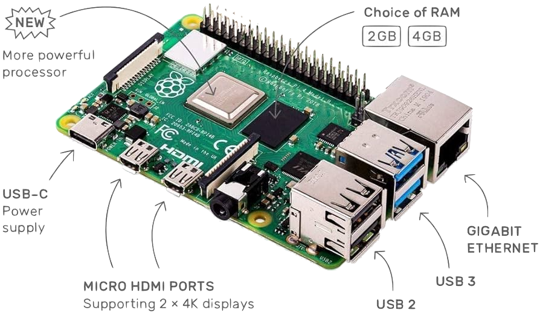

## **Lab 1** | Raspberry Pi+RoverPiHAT

### Design of Autonomous Systems
### CSCI 6907/4907 - Section 86
### Prof. **Sibin Mohan**

---

## Objectives

- Configure a Raspberry Pi and RoverPiHAT
- Understand the hardware and its components
- Set up wireless and SSH connections

---

## Equipment Required

- Raspberry Pi 4B (or similar)
- RoverPiHAT
- MicroSD Card (32GB or larger)
- USB to UART Cable
- Power Supply (USB-C)
- A Computer
- A Wifi Network (GW network)

---

## Raspberry Pi Overview



- **Processor (SoC):** ARM-based CPU
- **GPIO Pins:** Interface for external electronics
- **Ports:** USB, HDMI, Ethernet, Wi-Fi, Bluetooth
- **MicroSD Card Slot:** Stores OS and data


---

## RoverPiHAT Overview

<div class="multicolumn">
<div>

</div>
<div>

| component | description|
|-------------------|-----------------------------------------------------|
| imu (mpu6050) | 3-axis accelerometer, 3-axis gyroscope, magnetometer |
| rgb led | programmable rgb led |
| rover connections | connect motors, servos, other components  |

</div>
</div>

---

## RoverPiHAT Overview [contd.]

<div class="multicolumn">
<div>

</div>
<div>

| component | description|
|-------------------|-----------------------------------------------------|
| uart port| direct uart connection to raspberry pi for shell access |
| ultrasonic port | port for plugging in ultrasonic distance sensor     |

</div>
</div>

---

## Setup Steps

### 1. Flash the SD Card
- Download Pi OS image: [Raspberry Pi OS](https://www.raspberrypi.org/software/operating-systems/)
- A guide to use RaspberryPiImager: [here](https://www.raspberrypi.com/documentation/computers/getting-started.html#raspberry-pi-imager)

---

### 2. Connect via UART

- Edit `/boot/config.txt` to include `enable_uart=1`
- Edit `/boot/cmdline.txt` to include `console=serial0,115200`
- Connect UART cable to Raspberry Pi
- Use `screen` or Putty to access the terminal

---

### 3. Connect to Wi-Fi

- Configure GWDevice credentials: [GWDevice](http://mydevices.gwu.edu/)
- Use `sudo raspi-config` to set up Wi-Fi:
- Navigate to Wireless LAN
- Enter SSID and password

---

### 4. Enable SSH

- Use `sudo raspi-config`:
- Navigate to Interfacing Options > SSH
- Enable SSH

---

### 5. Find Raspberry Pi IP Address

To find the Raspberry Pi IP address, 

run the following command in the terminal:

```bash
$> ip addr show wlan0 | grep 'inet ' | awk '{print $2}' | cut -d/ -f1
```

---

### 6. Install Navio Shield

- Mount RoverPiHAT on Raspberry Pi GPIO pins
- Secure with spacers and screws
- Connect Raspberry Pi and RoverPiHAT to the mounting plate
  
---

## Summary

- Successfully set up Raspberry Pi and NRoverPiHAT
- Configured wireless and SSH access
- Ready for future labs on autonomous systems

