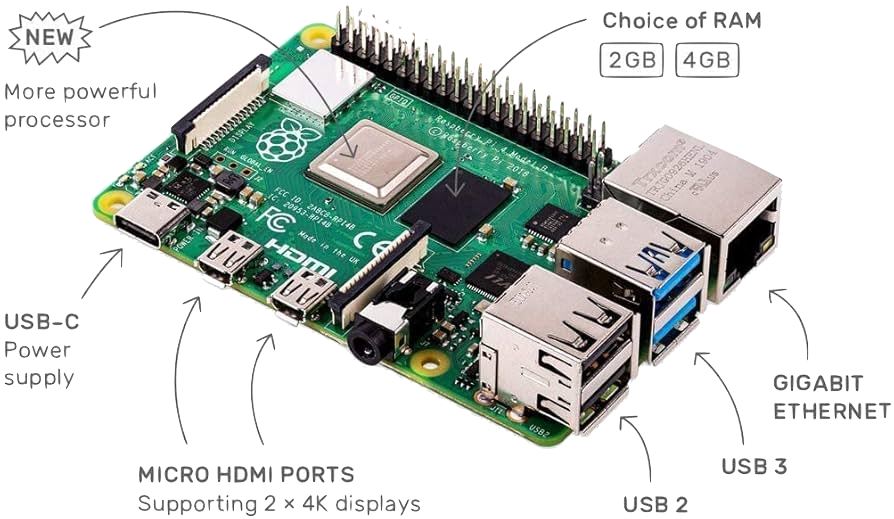
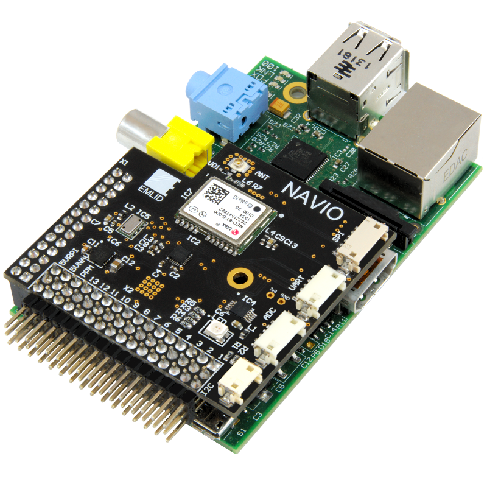

## **Lab 1** | Raspberry Pi+Navio

### Design of Autonomous Systems
### CSCI 6907/4907 - Section 86
### Prof. **Sibin Mohan**

---

## Objectives

- Configure a Raspberry Pi and Navio Shield.
- Understand the hardware and its components.
- Set up wireless and SSH connections.

---

## Equipment Required

- Raspberry Pi 4B (or similar)
- Navio Shield
- MicroSD Card (32GB or larger)
- USB to UART Cable
- Power Supply (USB-C)
- A Computer
- A Wifi Network (GW network)

---

## Raspberry Pi Overview



- **Processor (SoC):** ARM-based CPU
- **GPIO Pins:** Interface for external electronics
- **Ports:** USB, HDMI, Ethernet, Wi-Fi, Bluetooth
- **MicroSD Card Slot:** Stores OS and data


---

## Navio Shield Overview

- **IMU:** 3-axis accelerometer, <br>gyroscope, magnetometer
- **Barometer:** Altitude measurement
- **GPS/GNSS Receiver:** Positioning data
- **Servo Rail:** Connect motors/servos
- **Communication Ports:** UART, I2C, SPI

<br>

---

## Setup Steps

### 1. Flash the SD Card

- Download Navio image: [Navio Image](https://files.emlid.com/images/emlid-raspbian-20220608.img.xz)
- Use [Balena Etcher](https://www.balena.io/etcher/) to flash the image.

-v-

### 2. Connect via UART

- Edit `/boot/config.txt` to include `enable_uart=1`.
- Edit `/boot/cmdline.txt` to include `console=serial0,115200`.
- Connect UART cable to Raspberry Pi:
- **GND:** Pin 6
- **TX:** Pin 8
- **RX:** Pin 10
- Use `screen` or Putty to access the terminal.

-v-

### 3. Connect to Wi-Fi

- Configure GWDevice credentials: [GWDevice](http://mydevices.gwu.edu/).
- Use `sudo raspi-config` to set up Wi-Fi:
- Navigate to Wireless LAN.
- Enter SSID and password.

-v-

### 4. Enable SSH

- Use `sudo raspi-config`:
- Navigate to Interfacing Options > SSH.
- Enable SSH.

---

### 5. Find Raspberry Pi IP Address

To find the Raspberry Pi IP address, run the following command in the terminal:

```bash
$> ip addr show wlan0 | grep 'inet ' | awk '{print $2}' 
      | cut -d/ -f1
```

                    ---

### 6. Install Navio Shield

- Mount Navio shield on Raspberry Pi GPIO pins.
- Secure with spacers and screws.
- Connect Raspberry Pi and Navio to the mounting plate.

---

## Final Check

- Run `sudo emlidtool` to verify Navio shield functionality.
- Ensure sensors are calibrated.

---

## Summary

- Successfully set up Raspberry Pi and Navio shield.
- Configured wireless and SSH access.
- Ready for future labs on autonomous systems.

