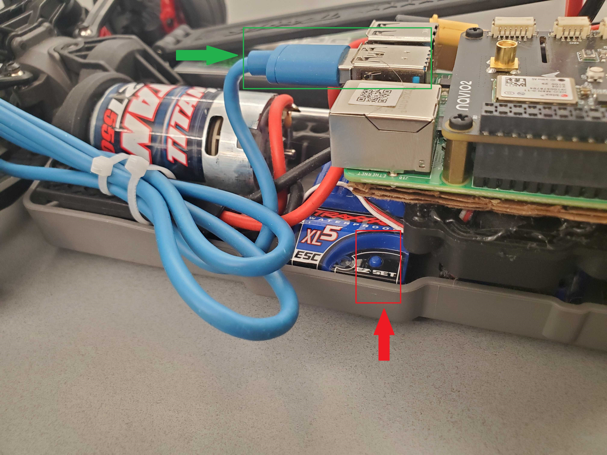
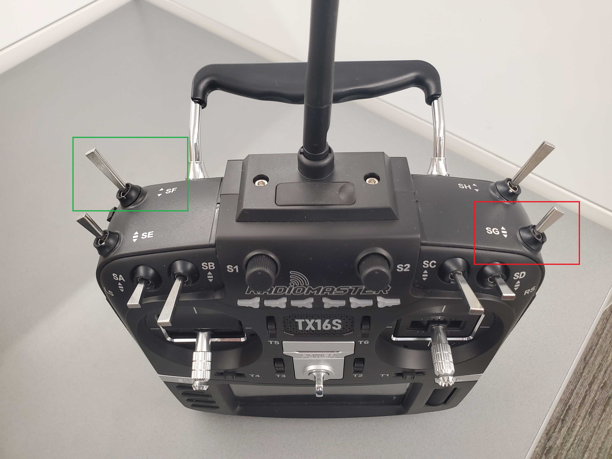
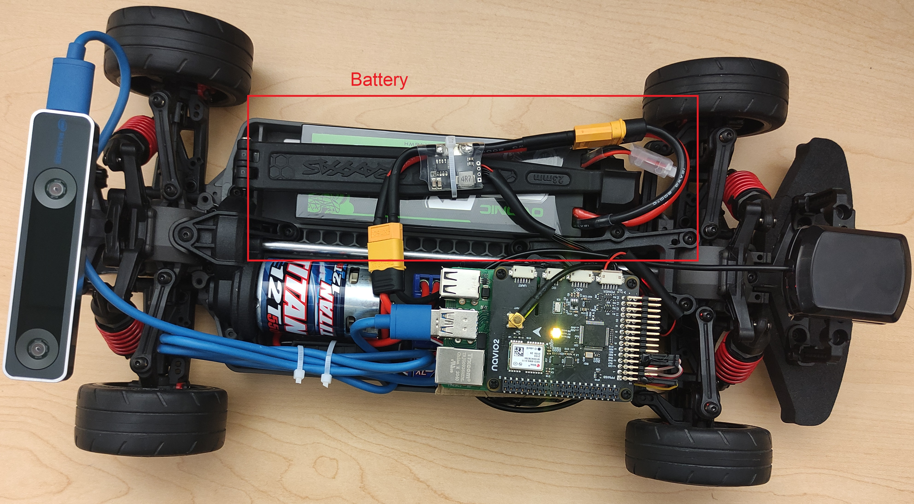

## **Lab 6** | Intro to Rover Hardware and Actuation with ROS

### Design of Autonomous Systems  
### CSCI 6907/4907 - Section 86  
### Prof. **Sibin Mohan**

---

## **Objectives**

- Identify and understand key hardware components of the rover.
- Install and configure a Raspberry Pi on the rover (Group Activity).
- Implement actuation using ROS.

---

## **1. Introduction to Rover Hardware**

The rover consists of essential hardware components enabling mobility, sensing, and computation.

### **Key Components**
- **Raspberry Pi with Navio2 Shield** - Main computing unit.
- **Electronic Speed Controller (ESC)** - Regulates motor power.
- **Titan 550 Motor** - Provides propulsion.
- **RealSense Camera** - Enables vision-based applications.
- **Battery Pack** - Powers the entire system.
- **Radio Transmitter (Radiomaster TX16S)** - Allows remote control.
- **Wiring and Connectors** - Facilitate power and data flow.

### **Hardware Identification**
Below are images of key components:

#### **Electronic Speed Controller (ESC) Button**
  
- **Highlighted Section:** Reset button for the ESC.

#### **Radio Transmitter (Radiomaster TX16S)**
  
- **Green Box:** Switch SF  
- **Red Box:** Switch SG  

#### **Complete Rover Setup**
  
- **Red Box:** Battery Pack  

---

## **2. Installing Raspberry Pi on the Rover (Group Activity)**

### **Installation Steps**
1. **Mount Raspberry Pi** on the rover chassis and secure it with spacers.
2. **Connect Power Supply** by attaching the battery module to the Raspberry Pi.
3. **Attach Sensors and Peripherals**, including the RealSense camera, ESC, and radio receiver.
4. **Verify Installation** by powering the system and checking sensor recognition using `lsusb` and `i2cdetect`.

---

## **3. Actuation with ROS**

### **Overview**
Actuation involves sending commands from the Raspberry Pi to the ESC to control motor speed and direction.

### **Implementation Steps (Refer GitHub)**
1. **Install required ROS packages** for PWM control.
2. **Set up a ROS workspace and create a motor control package**.
3. **Develop a ROS publisher node** to send motor speed commands.
4. **Run and test the motor control node** to validate actuation.

> **Refer to the GitHub repository for detailed setup, code, and execution instructions.**

---

## **4. Summary**

- Identified and labeled key hardware components of the rover.
- Installed and configured a Raspberry Pi onto the rover.
- Implemented motor actuation using ROS.
- Developed and tested a ROS-based motor control system.

---

