<!--link rel="stylesheet" href="./custom.sibin.css"-->

# introduction

## autonomy

what is "_autonomy_"? 

we see various examples of it...


### what are the _aspects_ of autonomy?

|||
|------------|-----------------------------------------------------------------------------|
| **perception** | how do you "_see_" the world around you? |
| **sensing**    | various ways to perceive the world around you (_e.g_, camera, LiDar)        |
| **compute**    | what do you "_do_" with the information about the world?                    |
| **motion**     | do your computations result in any "_physical_" changes?                    |
| **actuation**  | what "_actions_", if any, do you take for said physical changes?            |
| **planning**   | can you do some "_higher order_" thinking <br> (_i.e.,_ not just your immediate next move) |
 

## let us define **autonomy**

|||
|-----|------|
| Autonomy is the ability to <br> **perform given tasks** <br> based on the systems perception <br> <scb>without</scb> human intervention |   |
||


## autonomous systems

|||||
|------|------|------|------|
|**cyber** |  |  |  |
|**physical** |   |  |  |
||

hence, they fall under the class of systems &rarr; **cyber-physical** systems


## sensors and actuators...

|||
|-----|-----|
|| |
||

...are **everywhere**!

the **embedded** components &rarr; interactions with the real world

## sensing and actuation in the real world

consider the following example of two cars...


the second car is approaching the first


**sensors** &rarr; constantly gathering data/sensing

<div class="multicolumn">
<div>
<ol>
 <li> periodic sensing </li>
</ol>
</div>
<div>

</div>
</div>

on detection (of other car) &rarr; quickly **compute** what to do

<div class="multicolumn">
<div>
<ol>
 <li> periodic sensing </li>
 <li> computation </li>
</ol>
</div>
<div>

</div>
</div>

take **physical action** (actuation) &rarr; say by braking _in time_

<div class="multicolumn">
<div>
<ol>
 <li> periodic sensing </li>
 <li> computation </li>
 <li> actuation </li>
</ol>
</div>
<div>

</div>
</div>

<div class="multicolumn">
<div>
<ol>
 <li> periodic sensing </li>
 <li> computation </li>
 <li> actuation </li>
</ol>
</div>
<div>

</div>
</div>

"**control**"

Remember this &rarr; on detection (of other car) &rarr; <scb>quickly</scb> **compute** what to do


"quickly" compute &rarr; complete computation/actuation &rarr; before a **deadline**

This is a **real-time system**.


### Come back to **sensing**

<!--div class="multicolumn">
<div>
<br>
<ul>
    <li>we see <i>one</i> sensor (maybe LiDAR)</li>
    <li>reality &rarr; <b>multiple</b> sensors</li>
    <li>cameras, radars, lidar, etc.</li>
<ul>
</div>
<div>

</div>
</div-->

Multiple sensors in an autonomous vehicle &rarr; need to _combine_ them somehow

**sensor fusion**

Once we have information from the sensors (fused or otherwise)...


We need **state estimation** (**kalman** filter, **ekf**).

## Overview/Architecture of Autonomous Systems

So far, we have (briefly) talked about...

Sensing:


Actuation:


But the system includes...an **operating system** (OS) in there


and it includes **real-time** mechanisms.

We have briefly discussed, **EKF**:


**note**: ekf is versatile; can be used for sensor fusion, slam, etc.

All of it integrates with...**control**:


There are some **real-time** functions in there...


like _braking_, _engine control_.

Question: if we design such a system...


is it "**autonomous**"?

We are missing some "higher order" functionss from the perspective of the autonomous system:

- _where_ am I?
- _where_ do I need to go?
- _how_ do I get there?
- _what_ obstacles may I face?
- _how_ do I avoid them?


let us not forget the most important question of all...


**why** is gamora?

### high-order functions

In order to answer the following, we need **additional functionality**. Let us go through what that might be.

|||
|-----|------|
| <ul><li>where am I?</li> <li>where do I need to go?</li> <li>how do I get there?</li> <li>what obstacles may I face?</li> <li>how do I avoid them?</li></ul> | |
||


### slam

Simultaneous localization and mapping &rarr; figure out **where** we are.


### waypoint detection

Understand how to move in the _right_ direction at the **micro** level, _i.e.,_ find **waypoints**.


### yolo

Is it "you only live once"? Actually this stands for: "you only **look** once". It is an object **detection** model that uses convolutional neural networks (cnns)


### object avoidance

The objective is to avoid objects in the **immediate path**.


### path planning

i.e., how to get to **destination** at the **macro** level &rarr; uses waypoints.


### compute platform

To run all of these functions, we need low power, embedded platforms.


### still some **non-functional** requirements remain

any guesses what they could be?

### safety!

Essentially safety of &rarr; operator, other people, the vehicle, environment This is **cross-cutting** issue &rarr; affected <scb>by</scb> **all** parts of system.


### security

Security is another cross-cutting issue &rarr; <scb>can affect</scb> **all** components.


### Course Structure

Hence this figure is a (loose) map of this course:


<!--link rel="stylesheet" href="./custom.sibin.css"-->


# Embedded Architectures

Just like "autonomy" describing and "embedded system" is hard. What (typically) distinguishes it from other types of computer systems (e.g., laptops, servers or GPUs even) is that such systems are typically created for _specific_ functionality and often remain fixed and operational for years, decades even.

Embedded systems often trade off between performance and other considerations such as power (or battery life), less memory, fewer peripherals, limited applications, smaller operating system (OS) and so on. There are numerous reasons for this -- chief among them is _predictability_ -- designers need to guarantee that the system works correctly, and remains safe, all the time. Hence, it must be easy to _certify_ [^1] the _entire_ system. This process ensures that the system operates **safely**.

## The **wcet** problem

One piece of information that is required to ensure predictability and guarentee safety is **[worst-case execution time](https://www.cs.fsu.edu/~whalley/papers/tecs07.pdf)** (WCET). The WCET/BCET is the **longest**/shortest execution time possible for a program, **on a specific hardware platform** -- and it has to consider _all possible inputs_. WCET is necessary to ensure the "schedulability", resource requirements and performance limits of embedded and real-time programs. There are lots of approaches to computing the WCET, _e.g.,_

- [dynamic/empirical](https://www.cs.fsu.edu/~whalley/papers/tecs07.pdf) analysis &rarr; run the program lots of times (thousands, millions?) on the platform and measure it
- [static](https://www.cs.fsu.edu/~whalley/papers/tecs07.pdf) analysis &rarr; analyze the program at _compile time_ to compute the _worst-case paths_ through the program
- [hybrid](https://sibin.github.io/papers/2008\_NCSU-Dissertation_CheckerMode_SibinMohan.pdf) &rarr; a combination of the two
- [probabilistic](https://people.ac.upc.edu/fcazorla/articles/jabella_ecrts2014_2.pdf) &rarr; a combination of dynamic analysis+statistical methods
- [ML-based methods](https://dl.acm.org/doi/10.1145/3570361.3615740) &rarr; applying machine-learning to the problem

At a high-level, the execution time distributions of applications look like:


WCET analysis is a very active area of research and hundreds of papers have been written about it, since it directly affects the safety of many critical systems (aircraft, power systems, nuclear reactors, space vehicles and...autonomous systems). 

There are structural challenges (both in software and hardware) that prevent the computation of _proper_ wcet for anything but trivial examples. For instance, consider,

```c
void main()
{
    int max = 10 ;
    int sum = 0;
    for( int i = 0 ; i < max ; ++i)
        sum += i ;
}
```

How do you compute the WCET for this code? Say running on some known processor, P?

Well, there's some information we need, 

- how long each instruction takes to execute on P
- how many loop iterations?
- what is the startup/cleanup times for the program on P?

Let's assume (from the manual for P), we get the following information,

```c
1   void main()         // startup cost = 100 cycles
2   {
3       int max = 15 ;  // 10 cycles
4       int sum = 0;    // 10 cycles 
5       for( int i = 0 ; i < max ; ++i) // 5 cycles, once
6            sum += i ; // 20 cycles each iteration
7   }                   // cleanup cost = 120 cycles
```

So, based on this, we can calculate the total time to execute this program:

$$
wcet = startup\_cost + line\_3 + line\_4 + loop\_startup\_cost + ( line\_6 * max) \quad [1] 
$$

$$
wcet = 100 + 10 + 10 + 5 + (20 * 15) 
$$

$$
wcet = 425\ cycles
$$

Now consider this slight change to the above code:
```c
void main( int argc, char* argv[] )
{
    int max = atoi( argv[1] ) ;     // convert the command line arg to max
    int sum = 0; 
    for( int i = 0 ; i < max ; ++i) // how many iterations?
        sum += i ;
}
```

The problem is that equation [1] above fails since we no longer know the value of `max`. Hence the _program can run for any arbitrary amount of time, depending on the given input!_ Note that **none** of the aforemention wcet methods will help in this case since the input can be completely arbitrary. Hence, the structure of the software code can affect wcet calculations.

Another problem is that of **hardware** (and interactions between hardware and software). Now consider if we modify the original code as,
```c

#define VERY_LARGE_ARRAY+SIZE 1>>18

void main()
{
    int first_array[VERY_LARGE_ARRAY_SIZE] ;
    int second_array[VERY_LARGE_ARRAY_SIZE] ;

    int sum_first = 0;
    int sum_second = 0;
    for( int i = 0 ; i < VERY_LARGE_ARRAY_SIZE * 2 ; ++i)
    {
        if( i%2 )
            first_sum += first_array[i/2] ;
        else
            second_sum += second_array[(int)((i/2)+1)] ;
    }
}
```

Now, while we can compute, using equation [1] the wcet from the code perspective (since we know the loop runs for `VERY_LARGE_ARRAY_SIZE * 2` iterations), there will be significant non-obvious hardware issues, in the **cache**. Each iteration is accessing a _different_ large array. Hence, it will load the cache with lines from that array and in the _very next iteration_ the other array will be loaded, also missing in the cache. For instance, 

| iteration | operation | cache state | reason |
|----------------|----------------------------|-------------------|---------------------------------------------|
| 1 | `first_array` loaded | miss | evicts whatever was previously in cache |
| 2 | `second_array` loaded | miss | **evicts `first_array`** due to lack of space |
| 3 | `first_array` loaded again | miss | **evicts `second_array`** due to lack of space |
|...|
||

Hence, this program will _constantly_ sufffer cache misses and since caches misses (and reloads) are expensive (in terms of time), the loop's execution time will balloon out of control! Hence, even though we fixed the code issue (upper bound on number of iterations, hardware artifacts can change the wcet calculations). So now, we need to _model cache behavior_ for each program and data variable! This is [notoriously complicated](https://user.it.uu.se/~wangyi/pdf-files/2015/lgyrw-acm15.pdf) even for the simplest of programs. 

Other hardware designs further complicate matters, e.g., 

- processor pipelining
- prefetching
- branch prediction
- multithreading
- multicore systems
- memory buses
- networks-on-chip
- and too many others to recount here...

Any contemporary processor design that improves  performance, *turns out to be bad for wcet analysis*. So, the fewer (or simpler versions of) these features, the better it is for the (eventual) safety and certification of the system. 

This is one of the main reasons why embedded (and especially real-time) systems **prefer simpler processors** (simple pipelines, fewer complex features, simpler memory/cache architectures, if any) since they're easier to analyze. In fact, many critical systems (e.g., aircraft, cars, etc.) **use older processors** (often designed in the 1980s and 1990s) -- even the ones beind design today! 


## Embedded Processors

Just as embedded systems are varied, embedded processors come in a myriad of shapes and sizes as well. From the very small and simple (e.g., DSPs) to the very large and complex (modern multicore chips, some with GPUs!). Here is a (non-exhaustive) list of the types of embedded processors/architectures in use today:

1. [Microcontrollers](#microcontrollers)
2. [Digital Signal Processors](#digital-signal-processors-dsps) (DSPs)
3. [Microprocessors](#microprocessors) of various designs and architectures (e.g., ARM, x86)
4. [System-on-a-Chip](#system-on-a-chip-soc) (SoC)
5. [Embedded accelerators](#embedded-accelarators-eg-gpu-enabled-systems)
6. [ASICs and FPGAs](#asics-and-fpgas)


### Microcontrollers

According to [Wikipedia](https://en.wikipedia.org/wiki/Microcontroller),

>   "A microcontroller (MC, UC, or μC) or microcontroller unit (MCU) is a small computer on a single integrated circuit."

These may be among the most common type of "processors" used in embedded systems. According to many studies, **[more than 55%](https://www.embedded.com/the-two-percent-solution/)** of the world's processors are microntrollers! Microcontrollers are typically used in small, yet critical, systems such as car engine control, implantable medical devices, thermal monitoring, [fault detection and classification](https://sibin.github.io/papers/2021_BuildSys_PIRMedic_AshishKashinath.pdf) among millions of other applications. 

Microcontrollers hardware features typically include,

| component | details |
|-----------|---------|
| one (sometimes more) CPU cores | typically simple `4` or `8` bit chips |
| small pipelined architectues | sometimes `2` or `4` stage pipelines |
| some limited memory | typically a few hundred kilobytes, perhaps in the form of EEPROMs or FLASH |
| some programmable I/O | to interact with the real world |
| low operating frequencies | e.g., `4 KHz`; simpler/older processors, yet more predictable |
| low power consumption | in the **milliwatts** or **microwatts** ranges; might even be **nanowatts** when the system is _sleeping_ |
| interrupts (some programmable) | often _real-time_ (ficed/low latency) |
| several general-purpose I/O (GPIO) pins | for I/O |
| timers | e.g., a programmable interval timer (PIT) |
||

<br>

There are some **additional features** found on some microcontrollers, viz.,

| component | details |
|-----------|---------|
| analog to digital (ADC) signal convertors | to convert incoming (real-world, sensor) data to a digital form that the uC can operate on |
| digital-to-analog (DAC) convertor | to do the opposite, convert from digital to analog signals to send outputs in that form |
| universal asynchronous transmitter/receiver (UART) | to receive/send data over a _serial_ line |
| pulse width modulation (PWM) | so that the CPU can control **motors** (significant for us in autonomous/automotive systems), power systems, resistive loads, etc. |
| JTAG interace | debugging interface |
||

<br>

Some examples of popular microcontroller families:

|||||
|----|----|----|----|
|<br>Atmel ATmega |  <br> Microchip Technology |  <br> Motorola (Freescale) |  <br> NXP |
||

Microcontroller programs and data,

- are small --> must fit in memory (since very little expandable memory exists)
- often directly programmed in **assembly**!
    - sometimes the assembly code might need _hand tuning_ --> for both, performance as well as fitting into the limited memory
- **C** is another popular language
- **no operating systems** (or very rare)!
- sometimes have their own special-purpose programming languages or instructions

### Digital Signal Processors (DSPs)

DSPs are specialized microcontrollers optimized for _digital signal processing_. They find wide use in audio processing, radar and sonar, speech recognition systems, image processing, satellites, telecommunications, mobile phones, televisions, etc. Their main goals are to isoloate, measure, compress and filter _analog_ signals in the real world. They often have **stringent real-time constraints**. 

The Texas Instruments DSP chip, [TMS320 Series](https://www.ti.com/lit/ug/spruh79c/spruh79c.pdf?ts=1736945981001) is one of the most famous example of this type of system:


Typical digital signal processing (of any kind) requires repetitive mathematical operations over a large number of samples, in real-time, viz., 
- analog to digital conversion
- maniupulation (the core algorithm)
- digital to analog conversion

Often, the _entire_ process must be completed with low latency, even within a fixed deadline. They also have **low power** requirements since DSPs are often used in battery-constrained devices such as mobile phones. Hence, the proliferation of specialized DSP chips (instead of pure [software implementations](https://liquidsdr.org), which also exist; MATLAB has an entire [DSP System Toolbox](https://www.mathworks.com/help/dsp/index.html)).

**Typical DSP architecture**/flow (credit: [Wikipedia](https://en.wikipedia.org/wiki/Digital_signal_processor)):


These types of chips typically have custom instructions for optimizing certain (mathematical) operations (apart from the typical `add`, `subtract`, `multiply` and `divide`), e.g., 
- `saturate`; caps the minimum or maximum value that can be held in a fixed-point representation
- `ed` ; euclidian distance
- `accumulate` instructions ; for [_multiply-and-accumulate_](https://skills.microchip.com/dsp-features-of-the-microchip-dspic-dsc/693207) operations, i.e., $a \leftarrow a + (b * c )$

> See the [Microchip instruction set](https://ww1.microchip.com/downloads/en/DeviceDoc/sect2.pdf) details for more information for a typical DSP ISA.

DSPs require _optimization of streaming data_ and hence,
- require **optimized memories and caches** &rarr; fetch multiple data elements at the same time
- code may need to be aware of, and **explicitly** manipulate caches
- may have rudimentary OS but **no virtual memory**


### Microprocessors

Microprocessors are, then, **general-purpose** chips (as opposed to microcontrollers and DSPs) that are also used extensively in embedded systems. They are used in systems that need more heavy duty computing/memory and/or more flexibility in terms of programming and management of the system. They use a number of commodity processor architectures (e.g,, ARM, Intel x86). 

Main features of microprocessors:

| component | details |
|-----------|---------|
| cores | single or multicore; powerful |
| pipelines | more complex pipelines; better performance, harder to analyze (e.g., wcet) |
| clock speeds | higher clock speeds; `100s` of khz, or even GHz |
| ISA | common ISA; well understood, not custom |
| memory | significant memory; megabytes, even gigabytes |
| cache hierarchies | multiple levels, optimized |
| power consumption | much higher, but can be reduced (e.g., via [voltage and frequency scaling](https://developer.arm.com/documentation/ddi0375/a/functional-overview/intelligent-energy-management--iem-/dynamic-voltage-scaling--dvs-)) |
| size, cost | often higher |
| interrupts, timers | more varied, easily programmable |
| I/O | more interfaces, including commodity ones like USB |
| security | often includes additional hardware security features, e.g., [ARM TrustZone](https://sefcom.asu.edu/publications/trustzone-explained-cic2016.pdf).
||

The [ARM M-85](https://armkeil.blob.core.windows.net/developer/Files/pdf/product-brief/arm-cortex-m85-product-brief.pdf) Embedded Microprocessor architecture:


When compared to microcontrollers (or even SoCs), most microprpcessors **do not** include components such as DSPs, ADCs, DACs, etc. It is possible to _augment_ the microprocessor to include this functionality &rarr; usually by _connecting one or more microcontrollers to it_!

On the software side, microprocessors typically have the **most flexibility**:

- general purpose operating systems (e.g., Linux, Android, Windows, UNIX, etc.)
- most programming languages and infrastructures (even [Docker](https://www.docker.com/blog/getting-started-with-docker-for-arm-on-linux/)!)
- large number of tooling, analysis, debugging capabilities
- complex code can run, but **increases analysis difficulty**

Due to their power (and cost) these types of systems are only used when really necessary or in higher-end systems such as mobile phones and autonomous cars. 


### System-on-a-Chip (SoC)

An SoC **integrates** most components in and around a processor into a **single** circuit, viz.,

- processor/chip &rarr; could be a microcontroller or even a microprocessor
- memory and memory interfaces
- I/O devices
- buses (memory and I/O)
- storage (e.g., flash) and sometimes even secondary storage
- radio modems
- (sometimes) accelerators such as GPUs

All of these are placed on a **single substrate**. 

SoCs are often designed in `C++`, `MATLAB`, `SystemC`, etc. Once the hardware architectures are defined, additional hardware elements are written in hardware description languages, e.g., register transfer levels (`RTL`) [^2]. 

Additional components could include,

- DAC
- ADC
- radio and signal processing
- wireless modems
- [_programmable logic_](https://www.amd.com/en/products/adaptive-socs-and-fpgas/soc/zynq-7000.html). 
- networks on chip (NoC) [^3]

In some sense, an SoC is an _integration of a processor with peripherals_. New hardware elements

Some examples of modern SoCs:

<div class="multicolumn">
<div>


Broadcom Soc from Raspberry Pi
</div>
<div>


Apple M1 SoC
</div>
</div>

The integration of all hardware components has some interesting side-effects:

| effect | benefit | problems |
|----------|---------|----------|
| tight integration | better performance, fewer latencies | cannot replace individual components |
| custom code/firmware | better use of hardware | not reusable in other systems |
| custom software libraries | easier programming of SoC | reduces code reusability in other systems |
| low power consumption | better battery life, less heat | (potentially) slower |


Depending on the processor/microcontroller that sits at the center of the SoC, the software stack/capabilities can vary. Many commons SoCs exhibit the following software properties:

- usually use contemporary operating systems, though optimized for embedded/SoC systems &rarr; e.g., [Raspbian](http://www.raspbian.org) aka Rasberry Pi OS. Hence, they can handle multiprocessing, virtual memory, different scheduling policies, etc. 
- can be programmed using most common programming languages &rarr; `C`, `C++`, `python`, `java`, even [`lisp`](https://medium.com/@kenichisasagawa/rediscovering-the-joy-of-hardware-hacking-with-raspberry-pi-and-lisp-574c833ab20e)!

The Raspberry Pi is a common example of a system that uses a [Broadcom BCM series of SoCs](https://www.raspberrypi.com/documentation/computers/processors.html). We use the [BCM2711](https://www.raspberrypi.com/documentation/computers/processors.html#bcm2711) SoC in our course for the Raspberry Pi 4-B.


### Embedded Accelarators (e.g. GPU-enabled systems)

There are hardware platforms that include **accelerators** in embedded systems, e.g., [GPUs](https://www.nvidia.com/en-us/autonomous-machines/embedded-systems/), [AI-enabled silicon](https://www.nature.com/articles/s41928-022-00778-y), [extra programmable FPGA fabric](https://www.amd.com/en/products/adaptive-socs-and-fpgas/soc/zynq-7000.html), [security features](https://developer.arm.com/documentation/100230/0002/functional-description/external-coprocessors/configuring-which-coprocessors-are-included-in-secure-and-non-secure-states), etc. The main idea is that certain computation can be _offloaded_ to these accelerators while the main CPU continues to process other code/requests. The accelerators are specialized for certain computations (e.g., parallel matrix multiplications on GPUs, AES encryption). Some chips include FPGA fabric where the designer/user can _implement their own custom logic/accelerators_. 

In a loose sense, the [Navio2](https://navio2.hipi.io) can be considered as a hardware coprocessor for the Raspbery Pi.

The [NVidia Jetson Orin](https://www.nvidia.com/en-us/autonomous-machines/embedded-systems/jetson-orin/) is a good example of an AI/GPU focussed embedded processor:


<br>

This system's [specifications](https://www.techpowerup.com/gpu-specs/jetson-agx-orin-64-gb.c4085):

- 1300 MHz clock speeds
- 64 GB Memory
- 256 bit memory bus
- 204 GB/s bandwidth
- supports a variety of graphics features (DirectX, OpenGL, OpenCL, CUDA, Vulkan and Shader Models )
- maximum of 60W power
- **275 trillion** operations/s (TOPS)!

These systems are finding a lot of use in autonomous systems since they pack so much processing power into such a small form factor


### ASICs and FPGAs

Application-specific integrated circuits (ASICs) and field programmable gate arrays (FPGAs). These platforms combine the advantages of both, hardware (_speed_) and software (_flexibility/programmability_). They are similar, yet different. Both are semiconductor devices that include **programmable logic gates** but an ASIC is _static_ -- i.e., once the board has been "programmed" it cannot be changed while an FPGA, as the name implies, allows for "reprogramming". 

ASICs are **custom-designed** for specific applications and provide high efficiency and performance. FPGAs are **reprogramamble** devices that provide significant flexibility. Many designers also used it for prototyping hardware components (before they are eventually included either in the processors or custom ASICs). The [choice between ASICs and FPGAs](https://www.wevolver.com/article/asic-vs-fpga) depends entirely on the application requirements and other factors such as cost.


|||
|----|----|
|| | 
| An ASIC | Xilinx Spartan FPGA|
||

#### ASICs

These are specialized semiconductor devices -- to implement a _custom_ function, e.g., cryptocurrency mining, nuclear reactor control, televisions. ASICs are tailored to their specific applications. Once created, it cannot be reprogrammed or modified. ASICs are created using a process known as [photolithography](https://www.sciencedirect.com/topics/physics-and-astronomy/photolithography), a method to prepare nanoparticles, that allows components to be "etched" on to a silicon wafer. 

The [ASIC design process](https://www.wevolver.com/article/the-ultimate-guide-to-asic-design-from-concept-to-production), while expensive and time consuming, becomes valuable for _high-volume_ products as the per-unit cost decrease when production nunbers increase. 

| advantages | disadvantages |
|------------|---------------|
| high performance | lack of flexibility |
| low power consumption | high initial costs |
| small form factor | long development time |
| ip protection | obsolescence risk |
| good for mass production | risks with manufacturing yields |
| can integrate multiple functions | design complexity |
||


#### FPGAs

These are also semiconductor devices but they can be **preprogrammed** to implement various circuits and functions. Designers can change the functionality **after** the curcuits have been embossed onto the hardware. Hence, they're good for systems that might require changes at design time and rapid prototyping. An FPGA is a collection of programmable logic and interconnects. They include lookup tables (LUTs) and other parts that can be used to develop multiple, fairly wide-ranging, functions. The programmable blocks can be connected to each other via the interconnects. Some FPGAs even come with additional flash memory. 

[FPGAs are programmed](https://www.wevolver.com/article/fpga) using hardware description languages such as Verilog/VHDL.

| advantages | disadvantages |
|------------|---------------|
| flexibility | lower performance |
| shorter development time | higher power consumption |
| upgradability | high design complexity |
| lower (initial) costs | higher per-unit costs |
| better processing capabilities | design complexity |
| lower obsolescence risks | larger form factor |


## Communication and I/O

Embedded systems need to **communicate** and/or **interface** with various elements:

- the physical world via sensors and actuators
- computers for programming (of the embedded system) or for data transfer
- with other embedded systems/nodes
- handheld devices
- with the internet (either public or to access back end servers)
- satellites?

Hence a large number of communication standards and I/O interfaces have been developed over the years. Let's look at a few of them:

1. [serial (UART)](#uart--rs-232) &rarr; e.g., RS 232
2. [synchronous](#synchronous--i2c-and-spi) &rarr; I2C, SPI
3. [general-purpose I/O](#general-purpose-io-gpio) &rarr; GPIO
4. [debugging interface](#jtag-debugging-interface) &rarr; JTAG
5. [embedded internal communication](#controller-area-network-can) &rarr; CAN
6. [other broadly used protocols](#other-broadly-used-protocols) &rarr; USB, Ethernet/WiFi, Radio, Bluetooth


### UART | RS-232

Serial communication standards are used extensively across many domains, mainly due to their **simplicity** and **low hardware overheads**. The most common among these are the _asynchronous serial communication systems_.

From [Wikipedia](https://en.wikipedia.org/wiki/Asynchronous_serial_communication): 

> Asynchronous serial communication is a form of serial communication in which the communicating endpoints' interfaces are not continuously synchronized by a common clock signal. Instead of a common synchronization signal, the data stream contains synchronization information in form of start and stop signals, before and after each unit of transmission, respectively. The start signal prepares the receiver for arrival of data and the stop signal resets its state to enable triggering of a new sequence.

The following figure shows a communication sample that demonstrates these principles:


We see that each byte has a `start` bit, `stop` bit and eight `data` bits. The last bit is often used as a `parity` bit. All of these "standards" (i.e., the start/stop/parity bits) must be _agreed upon ahead of time_.

A **universal asynchronous receiver-transmitter** (**UART**) then is a peripheral device for such asynchronous commnication; the data format and transmission speeds are configurable. It sends data bits _one-by-one_ (from least significant to most). The precise timing is handlded by the communication channel. 

The electric _signalling levels_ are handled by an external driver circuit. Common signal levels:

- [RS 232](https://www.analog.com/en/resources/technical-articles/fundamentals-of-rs232-serial-communications.html) 
- [RS-485](https://www.renkeer.com/what-is-rs485/)
- raw [TTL](https://www.seeedstudio.com/blog/2019/12/11/rs232-vs-ttl-beginner-guide-to-serial-communication)

Here we will focus on the **RS-232** standard since it is most widely used UART signaling level standard today. The full name of the standard is: "EIA/TIA-232-E Interface Between Data Terminal Equipment and Data Circuit-Termination Equipment Employing Serial Binary Data Interchange" ("EIA/TIA" stands for the Electronic Industry Association and the Telecommunications Industry Association). It was introduced in 1962 and has since been updated _four_ times to meet evolving needs. 

The RS-232 is a _complete_ standard in that it specifies,

- (common) voltage and signal levels
- (common) pin and wiring configurations
- (minimal) control information between host/peripherals 

The RS-232 specifies the electrical, functional and mechanical characteristics to meet all of the above criteria. 

For instance, the _electrical_ characteristics are defined in the following figure:


Details:

- **high** level [**logical `0`**] (aka "marking") &rarr; `+5V` to `+15V` (realistically `+3V` to `+15V`)
- **low** level [**logical `1`**] (aka "spacing") &rarr; `-5V` to `-15V` (realistically `-3V` to `-15V`)

Other properties also defined, _e.g._, "[slew rate](https://en.wikipedia.org/wiki/Slew_rate)", impedance, capacitive loads, etc. 

The standard also defines the mechanical interfaces, i.e., the _pin connector_:


While the official standard calls for a 25-pin connector, it is rarely used. Instead, the **9-pin** connector (shown on the right in the above figure) is in common use.

You can read more details about the standard here: [RS 232](https://www.analog.com/en/resources/technical-articles/fundamentals-of-rs232-serial-communications.html)


### Synchronous | I<sup>2</sup>C and SPI

Synchronous Serial Interfaces (SSIs) are a widely used in industrial applications between a master device (e.g. controller) and a slave device (e.g. sensor). It is based on the [RS-422](https://www.analog.com/media/en/technical-documentation/tech-articles/guide-to-selecting-and-using-rs232-rs422-and-rs485-serial-data-standards--maxim-integrated.pdf) standards and has a high protocol efficiency as well multiple hardware implementations.

SSI properties:

- [differential signalling](https://en.wikipedia.org/wiki/Differential_signalling)
- simplex (i.e., unidirectional communication only)
- non-multiplexed
- point-to-point and 
- uses time-outs to frame the data. 


#### I<sup>2</sup>C

The [Inter-Integrated Circuit](https://www.ti.com/lit/an/sbaa565/sbaa565.pdf) (I<sup>2</sup>C, IIC, I2C) is a synchronous, multi-controller/multi-target (historically termed as multi-master/multi-slave), single-ended, serial communication bus. I2C systems are used for _attaching low-power integrated circuits to processors and microcontrollers_ -- usually for short distance or _intra-board communication_.

I2C components are found in a wide variety of products, _e.g.,_

- EEPROMs
- VGA/DVI/HDMI connectors
- NVRAM chips
- real-time clocks
- reading hardware monitors and sensors
- controlling actuators 
- DAC/ADC
- controlling LCD/OLEDs displays 
- changing computer display settings (contrast, brightness, etc.)
- controlling speaker volume
- and many many more

The main advantage of I2C is that a microcontroller can control a _network_ of chips with just **two** general-purpose I/O pins (serial data line and a serial clock line) and software. A controller device can communicate with any target device through a unique I2C address sent through the serial data line. Hence the two signals are:

|line|voltage| description|
|------|-------|-------|
| serial data line (SDL) | `+5V` | transmit data to or from target devices |
| serial clock line (SCL) | `+3V` | synchronously clock data in or out of the target device |
||

Both are bidirectional and pulled up with resistors.

Here is a typical implementation of I2C:


An I2C chip example (used for controlling certain TV signals):


I2C is half-duplex communication where only a single controller or a target device is sending data on the bus at a time. In comparison, the serial peripheral interface (SPI) is a full-duplex protocol where data can be sent to and received back at the same time. An I2C controller device starts and stops communication, which removes the potential problem of bus contention. Communication with a target device is sent through a unique address on the bus. This allows for both multiple controllers and multiple target devices on the I2C bus.

I2C communication details (initiated from the controller device):

| condition | description |
|-----------------|-------|
| I2C `START`| the controller device first pulls the SDA low and then pulls the SCL low |
| I2C `STOP` | the SCL releases high and then SDA releases high |
||


<br>

I2C communication is split into: **frames**. Communciation starts when one controller sends an `address frame` after a `START`. This is followed by one or more `data frames`, each consisting of **one byte**. Each frame also has an `acknowledgement` bit. An example of two I2C communication frames:


<br>

You can read more at: [I2C](https://www.ti.com/lit/an/sbaa565/sbaa565.pdf).


#### SPI

The [Serial Peripheral Interface](https://www.analog.com/en/resources/analog-dialogue/articles/introduction-to-spi-interface.html) (SPI) has become the de facto standard for _synchronous_ serial communication. It is used in embedded systems, especially between microcontrollers and peripheral ICs such as sensors, ADCs, DACs, shift registers, SRAM, _etc._

The main aspect of SPI is that one main device **orchestrates communication** with one ore more sub/peripheral devices by **driving the clock and chip select signals**.

SPI interface properties:

- _synchronous_
- _full duplex_
- _main-subnode_ (formerly called "master-slave")
- data from the main or the subnode is synchronized on the rising or falling clock edge
- main and subnode can transmit data at the same time
- interface can be 3 or 4-wire (4 wire version is more popular)

|microchip SPI|basic SPI Interface|
|------|-------|
| ||
||

The SPI interface contains the following wires:

| signal | description | function |
|--------|-------------|----------|
| `SCLK`   | serial clock | clock signal from main |
| `CS`     | chip/serial select | To select which host to communicate with |
| `MOSI`   | main out, subnode In | serial data out (SDO) for host to target communication |
| `MISO`   | main in, subnode Out | serial data in (SDI) for target to host communication |
||

The main node generates the clock signal. Data transmissions between main ahd sub nodes is synchronized by that clock signal generated by main. SPI devices support _much higher clock frequencies_ than I2C. The `CS` signal is used to select the subnode. Note that this is an **active low signal**, _i.e.,_ a low (`0`) is a selection and a high (`1`) is a disconnect. SPI is a full-duplex interface; both main and subnode can send data at the same time via the MOSI and MISO lines respectively. During SPI communication, the data is simultaneously transmitted (shifted out serially onto the MOSI/SDO bus) and received (the data on the bus (MISO/SDI) is sampled or read in).

**Example**: the [following example](https://www.analog.com/en/resources/analog-dialogue/articles/introduction-to-spi-interface.html) demonstrates the significant savings and simplification in systems design (reduce the number of GPIO pins required). 

Consider the ADG1412 switch being managed by a microcontroller as follows:


Now, as the number of switches increases, the requirement on GPIO pins also increases significantly. A `4x4` configuration requires `16` GPI pins, thus reducing the number of pins available for the microcontroller for other tasks, as follows:


One approach to reduce the number of pins would be to use a serial-to-parallel convertor:


This reduces the pressure on the number of GPIO pins but still introduces additional circuitry. 

Using an SPI-enabled microcontroller reduces the number of GPIOs required and and eliminates the overheads of the needing additional chips (serial-to-paralle convertor):


In fact, using a different SPI configuration ("**daisy-chain**"), we can optimize the GPIO count even further!


You can read more about [SPI here](https://www.analog.com/en/resources/analog-dialogue/articles/introduction-to-spi-interface.html).


### General-Purpose I/O (GPIO)

A GPIO is a **signal pin** on an integrated circuit or board that can be used to perform _digital I/O operations_. By design, it **has no predefined purpose** &rarr; can be used by hardware/software developers to perform functions _they choose_, _e.g.,_

- GPIO pins can be enabled or disabled.
- GPIO pins can be configured to be input or output.
- input values are readable, often with a 1 representing a high voltage, and a 0 representing a low voltage.
- input GPIO pins can be used as "interrupt" lines, which allow a peripheral board connected via multiple pins to signal to the primary embedded board that it requires attention.
- output pin values are both readable and writable.

GPIOs can be implemented in a variety of ways,

- as a _primary_ function of the microcontrollers, _e.g._, [Intel 8255](https://www.geeksforgeeks.org/programmable-peripheral-interface-8255/)
- as an _accessory_ to the chip

While microcontrollers may use GPIOs are their primary external interface, many a time the pins may be capable of other functions as well. In such instances, it may be necessary to configure the pins using other functions. 

Some examples of chips with GPIO pins:

|Intel 8255|PIC microchip|ASUS Tinker|
|------|-------|---------|
| | |  |
|24 GPIO pins |29 GPIO pins| 28 GPIO pins|
||


GPIOs are used in a diverse variety of applications, limited only by the electrical and timing specifications of the GPIO interface and the ability of software to interact with GPIOs in a sufficiently timely manner.

Some "properties"/applications of GPIOs:

- GPIOs use standard logic levels and cannot supply significant current to output loads
- high-current output buffers or relays can be used to control high-power devices
- input buffers, relays, or opto-isolators translate incompatible signals to GPIO logic levels
- GPIOs can control or monitor other circuitry on a board, such as enabling/disabling circuits, reading switch states, and driving LEDs
- multiple GPIOs can implement bit banging communication interfaces like I²C or SPI
- GPIOs can control analog processes via PWM, adjusting motor speed, light intensity, or temperature
- PWM signals from GPIOs can be converted to analog control voltages using RC filters

GPIO interfaces vary widely. Most commonly, they're simple _groups of pins_ that can switch between input/output. On the other hand, each pin can be set up differently &rarr; set up/accept/source different voltages/drive strengths/pull ups and downs. 

Programming the GPIO:

- usually pin states are exposed via different interfaces, _e.g.,_ **memory-mapped I/O** peripherals or dedicated I/O port instructions 
- input values can be used as interrupts (IRQs)

For more information on programming/using GPIOs, read these: [GPIO setup and use](https://docs.oracle.com/javame/8.0/me-dev-guide/gpio.htm), [Python scripting the GPIO in Raspberry Pis](https://www.instructables.com/Raspberry-Pi-Python-scripting-the-GPIO/), [general purpose I/O](https://docs.nordicsemi.com/bundle/ps_nrf52810/page/gpio.html), [GPIO setup in Raspberry Pi](https://projects.raspberrypi.org/en/projects/physical-computing/1).


### JTAG Debugging Interface

The JTAG standard (named after the "Joint Test Action Group"), technically the [IEEE Std 1149.1-1990 IEEE Standard Test Access Port and Boundary-Scan Architecture](https://web.archive.org/web/20170830070123/http://www.intel.com/content/dam/www/public/us/en/documents/white-papers/jtag-101-ieee-1149x-paper.pdf), is an industry standard for **testing and verification of printed circuit boards**, _after manufacture_.

"JTAG", depending on the context, could stand for one or more of the following:

- implementation of IEEE 1149.x for Board Test, or Boundary Scan testing
- appliance used to program on board flash or eeprom devices on a circuit board
- hardware device used to debug microprocessor software
- hardware device used to test a board using Boundary Scan

The basic building block of a JTAG OCD is the **Test Access Point** or **TAP controller**. This allows access to all the custom features within a specific processor, and must support a minimum set of commands. On-chip debugging is a _combination of hardware and software_. 

| type     | description |
|----------|-----------|
| hardaware | **on chip debug** (OCD)|
| software  | **in-circuit-emulator** (ICE)/JTAG emulator |
||

The off-chip parts are actually PC peripherals that need corresponding drivers running on a separate computer. On most systems, JTAG-based debugging is available from the very first instruction after CPU reset, letting it assist with development of early boot software which runs before anything is set up. The JTAG emulator allows developers to access the embedded system at the **machine code level** if needed! Many silicon architectures (Intel, ARM, PowerPC, etc.) have built entire infrastructures and extensions around JTAG.

A high-level overview of the JTAG architecture/use:


<br>

JTAG now allows for,

- processors can not be _halted_, _single-stepped_ or _run freely_
- can set code _breakpoints_ for both, code in RAM as well as ROM/flash
- _data breakpoints_  are available 
- _bulk data download_ to RAM
- _access to registers and buses_, even without halting the processors!
- _complex logic routines_, _e.g.,_ ignore the first seven accesses to a register from one particular subroutine

JTAG allows for _device programmer hardware_ allows for transfering data into internal, _non-volatile_ memory of the system! Hence, we can use JTAGs to **program** devices such as FPGAs. In fact, many memory chips also have JTAG interfaces. Some modern chips also allow access to the the (internal and external) data buses via JTAG.

**JTAG interface**: depending on the actual interface, JTAG has 2/4/5 pins. The 4/5 pin versions are designed so that _multiple chips_ on a board can have their JTAG lines **daisy-chained** together if specific conditions are met.

 Schematic Diagram of a JTAG enabled device:

 

 The various pins signals in the JTAG TAP are:

| signal | description |
|--------|-------------|
| `TCK` | synchronizes the internal state machine operations |
| `TMS` | sampled at the rising edge of `TCK` to determine the next state |
| `TDI` | data shifted into the device’s test or programming logic; sampled at the rising edge of `TCK` when the internal state machine is in the correct state |
| `TDO` | represents the data shifted out of the device’s test or programming logic and is valid on the falling edge of `TCK` when the internal state machine is in the correct state |
| `TRST` | optional pin which, when available, can reset the tap controller’s state machine |
||

The TAP controller implements the following state machine:


<br>

To use the JTAG interface, 

- host is connected to the target's JTAG signals (`TMS`, `TCK`, `TDI`, `TDO`, etc.) through some kind of JTAG adapter
- adapter connects to the host using some interface such as USB, PCI, Ethernet, etc.
- host communicates with the TAPs by manipulating `TMS` and `TDI` in conjunction with `TCK` 
- host reads results through `TDO` (which is the only standard host-side input)
- `TMS`/`TDI`/`TCK` output transitions create the basic JTAG communication primitive on which higher layer protocols build

<br>

For more information about JTAG, read: [Intel JTAG Overview](https://web.archive.org/web/20170830070123/http://www.intel.com/content/dam/www/public/us/en/documents/white-papers/jtag-101-ieee-1149x-paper.pdf), [Raspberry Pi JTAG programming](https://forums.raspberrypi.com/viewtopic.php?t=286115), [Technical Guide to JTAG](https://www.xjtag.com/about-jtag/jtag-a-technical-overview/) and the [JTAG Wikipedia Entry](https://en.wikipedia.org/wiki/JTAG) is quite detailed.


### Controller Area Network (CAN)

CAN is a vehicle bus standard to enable efficient communication between electronic control units (ECUs). CAN is,

- broadcast-based
- message-oriented
- uses arbitration &rarr; for data integrity/prioritization

CAN **does not** need a a host controller. ECUs connected via the CAN bus can easily share information with each other. all ECUs are connected on a two-wire bus consisting of a twisted pair: CAN high and CAN low. The wires are often color coded: 

|||
|-----|------|
|CAN high| yellow| 
|CAN low | green|
||

|||
|------|--------|
| 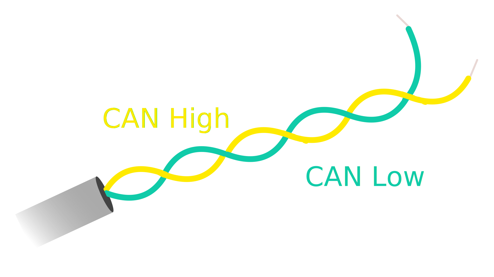 |  |
|CAN wiring | multi-ecu CAN setup|
||

<br>

An ECU in a vehicle consists of:

<table>
    <tr>
        <th>components</th>
        <th>internal architecture</th>
    </tr>
    <tr>
        <td>
            <ul>
                <li><b>microcontroller</b> to interpret/send out CAN messages</li>
                <li><b>CAN controller</b> ensures all communication adheres to CAN protocols</li>
                <li><b>CAN transceiver</b> connects CAN controller to the physical wires</li>
            </ul>
        </td>
        <td>
            
        </td>
    </tr>
    <tr> <td></td> <td></td></tr>
</table>

_Any_ ECU can broadcast on the CAN bus and the messages are accepted by _all_ ECUs connected to it. Each ECU can either choose to ignore the message or act on it.

> what are the implications for **security**?

While there is no "standard" CAN connector (each vehicle may use different ones), the **CAN Bus DB9** connector has become the de facto standard:


The above figure shows the various pins and their signals.

<br>

**CAN Communication Protocols**: CAN is split into:

<table>
    <tr>
        <th>layer</th>
        <th>relation to OSI stack</th>
    </tr>
    <tr>
        <td>
            <ul>
                <li><b>data link</b>: CAN frame formats, <br>error handling, data transmission, <br>data integrity</li>
                <li><b>physical</b>: cable types, <br>electrical signal levels, <br>node requirements, <br>cable impedance, etc.</li>
            </ul>
        </td>
        <td>
            
        </td>
    </tr>
    <tr> <td></td> <td></td></tr>
</table>

<br>

All communication over the CAN bus is done via the **CAN frames**. The _standard_ CAN frame (with an `11-bit` identifier) is shown below:


<br>

While the lower-level CAN protocols described so far work on the two lowest layers of the OSI networking stack, it is still limiting. For instance, the CAN standard doesn't discuss how to,

- decode RAW data
- handle larger data (more than 8 bytes)


Hence, some **higher-order** protocols have been developed, _viz.,_

|protocol|description|
|--------|-----------|
|[OBD2](https://www.csselectronics.com/pages/obd2-explained-simple-intro) | on-board diagnostics in cars/trucks for diagnostics, maintenance, emissions tests |
|[UDS](https://www.csselectronics.com/pages/uds-protocol-tutorial-unified-diagnostic-services) | Unified Diagnostic Services (UDS) used in automotive ECUs for diagnostics, firmware updates, routine testing|
|[CCP/XCP](https://www.csselectronics.com/pages/ccp-xcp-on-can-bus-calibration-protocol) | used in embedded control/industrial automation for _off-the-shelf interoperability_ between CAN devices|
|[SAE J1939](https://www.csselectronics.com/pages/j1939-explained-simple-intro-tutorial) | for heavy-duty vehicles |
|[NMEA 2000](https://www.csselectronics.com/pages/nmea-2000-n2k-intro-tutorial )| used in maritime industry for connecting e.g. engines, instruments, sensors on boats|
|[ISOBUS](https://www.csselectronics.com/pages/isobus-introduction-tutorial-iso-11783)| used in agriculture and forestry machinery to enable plug and play integration between vehicles/implements, _across brands_|
||

There also exist other higher-order protocols (numbering in the thousands) the most prominent of which are: ARINC, UAVCAN, DeviceNet, SafetyBUS p, MilCAN, HVAC CAN. 

<br>

More details about CAN and its variants: [CAN Bus Explained](https://www.csselectronics.com/pages/can-bus-simple-intro-tutorial).


### Other Broadly Used Protocols 

Autonomous (and other embedded systems) use a variety of other communication protocols in order to interface with the external world and/or other systems (either other nodes in the system or external components such as back end clouds).

Note that since many of these are well known and publicly documented, we won't elaborate much here.

Here are some of the well known communication protocols, also used in embedded systems:

|protocol|links|
|--------|------|
|USB | How USB works: [part 1](https://www.circuitbread.com/tutorials/how-usb-works-introduction-part-1), [part2](https://www.circuitbread.com/tutorials/how-usb-works-communication-protocol-part-2), [part 3](https://www.circuitbread.com/tutorials/how-usb-works-enumeration-and-configuration-part-3); [USB in a Nutshell (very detailed)](https://www.beyondlogic.org/usbnutshell/usb1.shtml).|
|Ethernet | [Reliable Embedded Ethernet](https://www.embedded.com/implement-reliable-embedded-ethernet-connectivity/), [Embedded Ethernet and Internet (book, online)](https://www.google.com/books/edition/_/3ZPPBgAAQBAJ?hl=en&gbpv=1&pg=PA1)|
|WiFi | [WiFi Sensing on the Edge (paper)](https://ebulutvcu.github.io/COMST22_WiFi_Sensing_Survey.pdf) |
|Bluetooth| [Bluetooth Basics](https://learn.sparkfun.com/tutorials/bluetooth-basics/all), [Bluetooth Low Energy](https://novelbits.io/bluetooth-low-energy-ble-complete-guide/) |
|Radio| [Embedded Development with GNU Radio](https://wiki.gnuradio.org/index.php/Embedded_Development_with_GNU_Radio)|
||


## Raspberry Pi and Navio2

Let us look at the two architectures we use extensively in this course: 

- [Raspberry Pi](https://www.raspberrypi.com/products/raspberry-pi-4-model-b/specifications/) model 4(b)
- [Navio2](https://navio2.hipi.io) &rarr; autopilot hat for the Raspberry Pi


The high-level architecture of the Pi shows many of the components we have discussed so far:


In particular, the Pi has,

|component | description/details|
|----------|--------------------|
|processor | Broadcomm **BCM2711**, Quad core Cortex-A72 (ARM v8) 64-bit SoC at 1.8GHz|
|memory | 1GB, 2GB, 4GB or 8GB LPDDR4-3200 SDRAM|
|network | Wifi (2.4/5.0 GHz), Gigabit ethernet, Bluetooth/BLE|
|I/O |   40 pin GPIO, USB 3.0/2.0/C|
|storage | Micro-SD Card |
|misc | micro-hdmi, stereo audio/video, displayport, camera port, power|
|os | [Raspberry Pi OS](https://www.raspberrypi.com/software/) (formerly called Raspbian)|
||

<br>

Read more about the Raspberry Pi: [Raspberry PI -- A Look Under the Hood](https://www.electronics-lab.com/project/raspberry-pi-4-look-hood-make/)

<br>

The **Navio2** is a "hat" that adds the following to a Raspberry Pi:

- autopilot functionality
- multiple sensors

The high-level architecture,


As the figure shows, the Navio2 adds the following components:

|component|description/details|
|---------|-------------------|
|GNSS receiver | for GPS signals|
|high-precision barometer| for measuring pressure (and altitude)|
|(dual) IMU | two 9 DOF with gyroscope, accelerometer, magnetometer, each|
|RC I/O co-processor | PWM, ADC, SBUS, PPM |
|extension ports | ADC, I2C, UART |
|power supply | triple redundant |
||

<br>

More details about the Navio2 and how to program it: [Navio2 Documentation](https://docs.emlid.com/navio2/).

<br>
<br>


## References

[^1]: TBD
[^2]: https://dl.acm.org/doi/10.5555/244522.244548
[^3]: https://www.cecs.uci.edu/~papers/compendium94-03/papers/2002/date02/pdffiles/05a_1.pdf
<!--link rel="stylesheet" href="./custom.sibin.css"-->


# Sensors and Sensing

An embedded/autonomous system _perceives_ the physical world via sensors -- either to gather information about its environment or to model its _own_ state. Hence it is a critical component in the _sensing &rarr; planning &rarr; actuation_ loop and a critical component in the design of embedded and autonomous systems.

|||
|------|-------|
|||
||

Modern autonomous systems used a _wide array_ of sensors. This is necessary due to:

- there is a need to measure **different** quantities, _e.g.,_ GPS, velocity, objects, _etc._
- sensor measurements often have **errors** &rarr; hence, we need multiple sensors, often using **different physical properties** to measure the _same thing_; _e.g.,_ LiDar and cameras can both be used to detect objects in front of, and around, an autonomous vehicle.

At its core, 

> a sensor captures a physical/chemical/environmental quantity and **converts it to a digital quantity**.

(hence the need for an Analog-to-Digital Convertor (ADC) as we shall see later)

By definition, sensors generate **signals**. A signal, `s`, is defined as a mapping from the _time_ domain to a _value_ domain:

$$
s: D_t \mapsto D_v
$$

where,

| symbol | description  |
|--------|------------------------------------------|
| $D_t$  | continuous or discrete **time** domain   |
| $D_v$  | continuous or discrete **value** domain  |
||

**Note:** remember that computers require **discrete** sequences of physical values. Hence, we need to **convert** the above into the discrete domain. The way to achieve this: **sampling**:


The figure shows a continuous signal being sampled (in <font color="red"><b>red</b></font> arrows). We will discuss sampling and related issues later in this topic.


## Types of Sensors

Sensors come in various shapes and sizes. Usually designers of autonomous systems will develop a "**sensor plan** that will consider,

- required functionality
- sensor range(s)
- cost

Hence, each autonomous system will likely have its own set of sensors (or sensor plan). _Typical_ sensors found on modern autonomous systems can be classified based on the underlying physics used:

|physical property|sensor|
|-----------------|-------|
|[_internal_ measurements](#inertial-measurement-units-imu)| IMU |
|_external_ measurements| GPS |
|["bouncing" electromagnetic waves](#bouncing-of-electromagnetic-waves--lidar-and-mmwave)| LiDAR, RADAR, mmWave Radar|
|optical| cameras, infrared sensors|
|[accoustic](#ultrasonic)| ultrasonic sensors|
||

Some of the above can be combined to generate other sensing patterns, _e.g.,_ **stereo vision** using multiple cameras or camera+LiDAR.

We will go over **some** of these sensors and their underlying physical principles. 

### Inertial Measurement Units (IMU)

These sensors define the **movement of a vehicle**, along the three axes, in addition to other behaviors like acceleration and directionality. An IMU typically includes the following sensors:

|||||
|---------|--------|---------|-----------|
|||||
||

As we see from the first picture above, an IMU also has a CPU (typically a microcontroller) to manage/collect/process the data from the sensors.

The functions of the three sensors are:

1. **gyroscope**: is an inertial sensor that measure an object's angular rate with respect to an inertial reference frame. It measures the following movements:

||||
|--------|----------|---------|
||||
| "yaw" | "pitch" | "roll" |
||

IMUs come in all shapes and sizes. These days they're very small but the original IMU's ver really large, as evidenced by the one used in the [Apollo space missions](http://klabs.org/history/history_docs/mit_docs/1690.pdf):


<br>


2. **accelerometer**: is the primary sensor responsible for measuring inertial acceleration, or the change in velocity over time.

3. **magnetometer**: measures the strength and direction of magnetic field – to find the magnetic north


### Bouncing of Electromagnetic Waves | LiDAR and mmWave

A very common principle for measuring surroundings is to bounce electromagnetic waves off nearby objects and measuring the round trip times. Shorter times indicate closer objects while longer times indicate objects that are farther away. [RADAR](https://www.noaa.gov/jetstream/doppler/how-radar-works) is a classic example of this type of sensor and its (basic) operation is shown in the following image (courtesy NOAA):

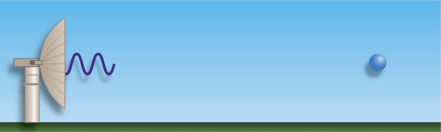

While many autonomous vehicles use RADAR, we will focus on other technologies that are more prevalent and provide much higher precision, _viz.,_

1. [LiDAR](#light-detection-and-ranging-lidar)
2. millimeter Wave RADAR (mmWave)


#### Light Detection and Ranging (LiDAR)

[LiDAR](https://web.stanford.edu/class/ee259/lectures/ee259_05_lidar.pdf) is a sensor that uses (_eye safe_) **laser beams** for mapping surroundings and creating **3D representation** of the environment. So lasers are used for,

- imaging
- detection 
- ranging

We can use LiDAR to distance, angle as well as the _radial velocity_ of some objects -- all relative to the autonomous system (rather the sensor). So, in practice, this is how it operates:


We define a **roundtrip time**, $	au$, as the time between when a pulse is sent out from the transmitter (`TX`) to when light reflected from the object is detected at the receiver (`RX`). 

So, the **target range** (_i.e.,_ the distance to te object), $R$, is measured as:

$$
R = rac{c	au}{2}
$$

where, `c` is the speed of light. 

More details (from [Mahalati](https://web.stanford.edu/class/ee259/lectures/ee259_05_lidar.pdf)):
> Lasers used in lidars have frequencies in the $100s$ of Terahetrz. Compared to RF waves, lasers have significantly smaller wavelengths and can hence be easily collected into narrow beams using lenses. This makes DOA estimation almost trivial in lidar and gives it significantly better reso- lution than MIMO imaging radar.

The _end product_ of LiDAR is essentially a **point cloud**, defined as:

> a collection of points generated by a sensor. Such collections can be very dense and contain billions of points, which enables the creation of highly detailed 3D representations of an area.


In reality, point cloud representations around autonomous vehicles end up looking like:

<video controls width="500"> <source src="https://sibin.github.io/teaching/csci6907_88-gwu-secure_autonomous/fall_2022/other_docs/What-is-Lidar-video.mp4"></video>

[Point clouds](https://www.yellowscan.com/knowledge/lidar-point-cloud-basics/) provide valuable information, _viz.,_

- 3D coordinates, $(x, y, z)$
- **strength** of returned signal &rarr; provides valuable information about the **density** of the object (or even material composition)!
- additional attributes: return number, scan angle, scan direction, point density, RGB color values, and time stamps &rarr; each can be used for refining the scan.

There are **two types** of _scene illumination_ techniques for LiDAR:

| type | illumination method  | detector |
|--------|---------------------|-----------|
| flash lidar | _entire_ scene using wide laser  | receives all echoes on a photodetector array |
| scanning lidar | very narrow laser beams, scan illumination spot with laser beam scanner | single photodetector to sequentially estimate $	au$ for each spot |
||

<br>

| | flash lidar | scan lidar |
|----|----|------|
| **architecture** |  |  |
| **resolution** determined by | photodetector array pizel size (like camera) | laser beam size and spot fixing |
| **frame rates** | higher (up to `100 fps`) | lower (< `30 fps`) |
| **range** | shorter (quick beam divergence, like photography) | longer (`100m+`) |
| **use**   | less common | **most common** |
||

<br>

Now, consider the following scene (captured by a camera):

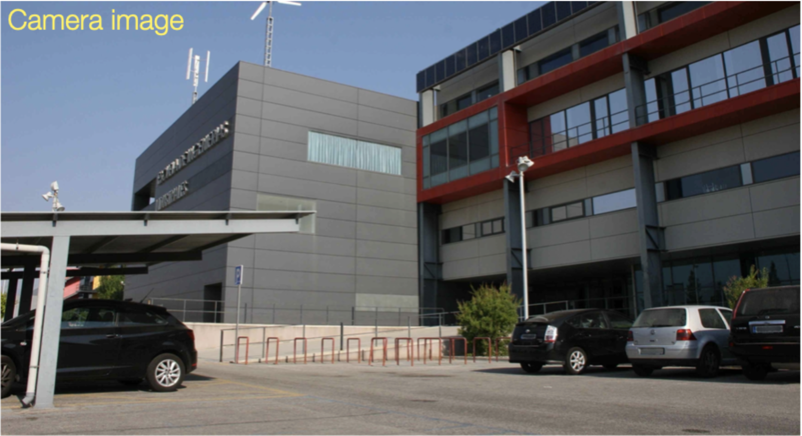

<br>
<br>

Compare this to the LiDAR images captured by the two methods:

|flash lidar | scan lidar (16 scan lines)| scan lidar (32 scan lines)|
|----|----|-----|
|  |  | |

<br>

> A "LiDAR scan line" refers to a **single horizontal line** of laser pulses emitted by a LiDAR sensor, essentially capturing a cross-section of the environment at a specific angle as the sensor rotates, creating a 3D point cloud by combining multiple scan lines across the field of view; it's the basic building block of a LiDAR scan, similar to how a single horizontal line is a building block of an image. 

**Potential Problems**:

Atmospheric/environmental conditions can **negatively** affect the quality of the data captured by the LiDAR. For instance, **fog** can scatter the laser photons resulting in **false positives**. 


As we see from the above image, the scattering due to the fog results in the system "identifying" multiple objects even though there is only _one_ person in the scene.

Here are additional examples from the [Velodyne VLP-32C](https://www.mapix.com/lidar-scanner-sensors/velodyne/velodyne-vlp-32c/) sensor:

1. **light** fog (camera vs LiDAR)


The LiDAR does a good job isolating the main subject with very few false positives.

2. **heavy** fog (camera vs LiDAR)


The LiDAR _struggles_ to isolate the main subject with very _high_ false positives.

In spite of these issues, LiDAR is one of the most popular sensors used in autonomous vehicles. They're getting smaller and more precise by the day; also decreasing costs means that we will see a proliferation of these types of sensors in many autonomous systems. 

For an in-depth study on LiDARs, check this out: [Stanford EE 259 LiDAR Lecture](https://web.stanford.edu/class/ee259/lectures/ee259_05_lidar.pdf).


#### Millimeter Wave Radar [mmWave]

Short wavelengths like the *millimeter wave** (**mmWave**) in the electromagnetic spectrum allows for:

- smaller antennae
- integration of entire RADAR circuitry in a single chip!
- spectrum of 10 millimeters (`30 GHz`) to 1 millimeter (`300 GHz`)

|||
|-----|------|
|  | 
||

As we see from the above images, the sensors can be **very small**, yet **very precise** &rarr; some can detect movements up to _4 millionths of a meter_!

**Advantages** of mmWave:

| Advantage | Description |
|-----------|-------------|
| small antenna caliber | narrow beam gives high tracking, accuracy; high-level resolution, high-resistance interference performance of narrow beam; high antenna gain; smaller object detection |
| large bandwidth | high information rate, details structural features of the target; reduces multipath, and enhances anti-interference ability; overcomes mutual interference; high-distance resolution |
| high doppler frequency | good detection and recognition ability of slow objectives and vibration targets; can work in snow conditions |
| good anti-blanking performance | works on the most used stealth material |
| robustness to atmospheric conditions | such as dust, smoke, and fog compared to other sensors |
| operation under different lights | radar can operate under bright lights, dazzling lights, or no lights |
| insusceptible to ground clutter | allowing for close-range observations; the low reflectivity can be measured using mmwave radar |
| fine spatial resolution | for the same range, mmwave radar offers finer spatial resolution than microwave radar >
||

<br>

mmWave is also used for **in-cabin monitoring of drivers**!

<br>

**Limitations**:

- line of sight operations
- affected by water content, gases in environments
- affected by contaminated environment and physical obstacles

<br>

**Resources**:

For a more detailed description of mmWave RADAR, read: [Understanding mmWave RADAR, its Principle & Applications](https://www.design-reuse.com/articles/55851/mmwave-radar-principle-applications.html)

For programming a LiDAR, see: [how to program a LiDAR with an Arduino](h.ttps://www.engineersgarage.com/how-to-use-a-lidar-sensor-with-arduino/).


### Ultrasonic 

Much like lidars, we can use reflected sounds waves to detect objects. They work by emitting high-frequency sound waves, typically above human hearing, and then listening for the echoes that bounce back from nearby objects. The sensor calculates the distance based on the time it takes for the echo to return, using the speed of sound. Popular modules like the HC-SR04 (Used in Lab#2) are easy to integrate with microcontrollers such as Arduino and Raspberry Pi. These sensors are widely used in robotics for obstacle avoidance, automated navigation, and liquid level sensing.

However, unlike optical (electromagnetic waves) detectors, ultrasonic sensors, while useful for basic distance measurements, cannot replicate the functionalities of LiDAR systems due to several key limitations. Unlike LiDAR, which employs laser beams to generate high-resolution, three-dimensional point clouds, ultrasonic sensors emit sound waves that provide only limited, single-point distance data with lower precision. LiDAR offers greater accuracy and longer range, enabling detailed mapping and object recognition essential for applications like autonomous vehicles and advanced robotics. Additionally, LiDAR systems can cover a wider field of view and operate effectively in diverse environments by rapidly scanning multiple directions, whereas ultrasonic sensors typically have a narrow detection cone and struggle with complex or cluttered scenes. Furthermore, LiDAR’s ability to capture data at high speeds allows for real-time processing and dynamic obstacle detection, which ultrasonics cannot match. This is because comparitively, it sounds waves take a lot of time to return since they're much slower in speed compared to light waves (360m/s vs 299,792,458m/s). These differences in data richness, accuracy, and versatility make ultrasonic sensors unsuitable substitutes for the sophisticated capabilities offered by LiDAR technology.

We'll be using ultrasonic distance finders in futures MPs to stop our rovers from colliding into objects. Since our rovers don't moove to fast and complexity is relatively low, only a ultrasonic sensor would suffice.

## Errors in Sensing

Since sensors deal with and measure the _physical_ world, **errors** will creep in over time. 

Some typical errors in the use of physical sensors:

| error type | description |
|----------------|-------------|
| **sensor drift** | over time the sensor measurements will "drift", i.e., a gradual change in its output &rarr; away from average values (e.g., due to wear and tear) |
| **constant bias** | bias of an accelerometer is the offset of its output signal from the actual acceleration value. A constant bias error causes an error in position which grows with time |
| **calibration errors** | ‘calibration errors’ refers to errors in the scale factors, alignments and linearities of the gyros. Such errors tend to produce errors when the device is turning. These errors can result in additional drift |
| **scale factor** | scale factor is the relation of the accelerometer input to the actual sensor output for the measurement. Scale factor, expressed in ppm, is therefore the linear growth of input variation to actual measurement |
| **vibration rectification errors** | vibration rectification error (VRE) is the response of an accelerometer to current rectification in the sensor, causing a shift in the offset of the accelerometer. This can be a significant cumulative error, which propagates with time and can lead to over compensation in stabilization |
| **noise** | random variations in the sensor output that do not correspond to the actual measured value |
||

<br>

Each error type must be dealt with in different ways though one of the commomn ways to prevent sensor errors from causing harm to autonomous systems &rarr; **sensor fusion**, _i.e.,_ use information from **multiple sensors** before making any decisions. We will dicuss sensor fusion later in this course.


## Analog to Digital Convertors (ADCs)

As [mentioned earlier](#sensors-and-sensing), a sensor maps a physical quantity from the time domain to the value domain,

$$
s: D_t \mapsto D_v
$$

where,

| symbol | description                              |
|--------|------------------------------------------|
| $D_t$  | continuous or discrete **time** domain   |
| $D_v$  | continuous or discrete **value** domain  |
||

Remember that computers require **discrete** sequences of physical values since **microcontrollers cannot read values unless it is digital data**. Microcontrollers can only see “levels” of voltage, which depends on the resolution of the ADC and the system voltage.

Hence, we need to **convert** the above into the discrete domain, _i.e.,_ we require $D_v$ to be composed of discrete values. 

According to [Wikipedia](https://en.wikipedia.org/wiki/Discrete_time_and_continuous_time#),

> A discrete signal or discrete-time signal is a time series consisting of a sequence of quantities. Unlike a continuous-time signal, a discrete-time signal is not a function of a continuous argument; however, it may have been obtained by sampling from a continuous-time signal. When a discrete-time signal is obtained by sampling a sequence at uniformly spaced times, it has an associated **sampling rate**.

<br>

A visual respresentation of the sampling rate and how it correlates to the sampling of an analog signal:

|analog signal|sampling rate|sampling|
|-------------|-------------|--------|
||||
||


Hence, a device that converts analog signals to digital data values is called &rarr; an **analog-to-digital convertor** (**ADC**). This is one of the most common circuits/microcontrollers in embedded (and hence, autonomous) systems. _Any_ sensor that measures a physical property must pass its values through an ADC so that the sensor values can be used by the system (the embedded processor/microcontroller, really).

This is best described using an example:


The <font color="blue"><b>analog</b></font> signal is **discretized** into the <font color="red"><b>digital</b></font> signal after passing through an ADC.

ADCs follow a sequence:

- **sample** the signal
- **quantify** it to determine the resolution of the signal
- set **binary values**
- **send it to the system** to read the digital signal

Hence, two important aspects of an ADC are:

- [sampling rate](#adc-sampling-rate)
- [resolution](#adc-resolution)

### ADC Sampling Rate 

The sampling rate (aka Sampling Frequency) is measured in **samples per second** (SPS or S/s). It dictates _how many samples_ (data points) are taken in one second. If an ADC records more samples, then it can handle higher frequencies. 

The sample rate, $f_s$ is defined as,

$$
f_s = rac{1}{T}
$$

where,

|symbol|definition|
|------|----------|
|$f_s$ | sampling rate/frequency|
|$T$ | period of the sample |
||

Hence, in the previous example, 

|symbol|value|
|------|----------|
|$f_s$ | `20 Hz` |
|$T$ | `50 ms` |
||

While this looks slow (`20 Hz`), the digital signal tracks the original analog signal quite faithfully &rarr; the original signal itself is quite slow (`1 Hz`).

Now, if the sampling signal is _considerably slower_ than the analog signal, then it loses fidelity and we see **aliasing**, where the reconstructed signal (the digital one in the case) **differs from the original**. Consider the following example of such a case:


As we see from the above figure, the digital output is **nothing** like the original. Hence, this (digital) output will not be of much use to the system. 

<br>

[**Nyquist-Shannon Sampling Theorem**](https://fab.cba.mit.edu/classes/S62.12/docs/Shannon_noise.pdf):

> to accurately reconstruct a signal from its samples, the sampling rate must be **at least twice the highest frequency component** present in the signal

If the sampling frequency is less than the Nyquist rate, then aliasing starts to creep in.

Hence, 

$$
f_{Nyquist} = 2* f_{max}
$$

where,

|symbol|definition|
|------|----------|
|$f_{Nyquist}$ | Nyquist sampling rate/frequency|
|$f_{max}$ | the maximum frequency that appears in the signal |
||

For instance, if your analog signal has a maximum frequency of `50 Hz` then your sampling frequency must be _at least_, `100 Hz`. If this principle is followed, then it is possible to **accurately reconstruct** the original signal and its values.

Note that sometimes _noise_ can introduce additonal (high) frequencies into the system but we don't want to sample those (for obvious purposes). Hence, it is a good idea to add [anti-aliasing fitlers](https://www.analog.com/en/resources/technical-articles/guide-to-antialiasing-filter-basics.html) to the analog signal _before_ it is passed to the ADC.

### ADC Resolution

An ADC's resolution is directly related to the **precision** of the ADC, determined by its **bit length**. The following examples shows the fidelity of the reconstruction, based on various bit lengths:


Increasing bit lengths the digital signal more closely represents the analog one.

There exists a correlation between the bit length and the **voltage** of the signal. Hence, the **true resolution** of the ADC is calculated using the bit length **and** the voltage as follows:

$$
Step Size = rac{V_{ref}}{N}
$$

where,

|symbol|definition|
|------|----------|
|$Step Size$| resolution of each level in terms of voltage|
|$V_{ref}$ |voltage reference/range of voltages|
|$N = 2^n$ | total "size" of the ADC|
|$n$ | bit size|
||

This is easier to understand with a concrete example:

> consider a sine wave with a voltage, `5 V` that must be digitized. <br>
> <br>
> If our ADC precision is `12 bits`, then we get <br>
> $N = 2^{12} = 4096$ <br>
> <br>
> Hence, $Step Size = 5V /\ 4096$ which is `0.00122V` (or `1.22mV`)<br>
> <br>
> Hence, the system can tell when a voltage level changes by `1.22 mV`!

(Repeat the exercise for say, bit length, $n = 4$)

<br>

**Visual Example:**

The above maybe intuitively understood as follows:

Consider the following signal:


Now, if we want to sample this signal, we can obtain measurements at:


<br>

The figure shows `9` measurements. 

Suppose, the ADC registers have a width of: `2 bits`. Hence it can store at most: `4 values`.

Since is is **not** possible to store `9` values &rarr; `2` bits, we must select **only `4` values** omn the digital side. 

We then get the following representation:


<br>

which, to be honest, is not really a good representation of the original signal!

Now, consider the case where the ADC registers have a bit width: **`4 bits`** &rarr; `16 values`! Hence, we can easily store **all `9 values`** easily. 

So, we can get a digital representation as follows:


<br>

We see that this is a better representation, *but still not exact*. We can increase the bit length but at this point we are limited by the sampling as well. Since we only have `9` samples, adding more bits won't help. 

Hence, to get a better fidelity representation of the original signal, we see that **sampling frequency** and **resolution** need to be increased, since they determine the quality of output we get from an ADC.


**Resources**

- for more details about ADC, read: [Analog-to-Digital Convertor Basics](https://www.arrow.com/en/research-and-events/articles/engineering-resource-basics-of-analog-to-digital-converters)
- an **in-depth** explanation of how ADCs work: [Iowa State CpreE 288 Course Slides](http://class.ece.iastate.edu/cpre288/lectures/lect12_13.pdf)
- more details with videos: [Analog to Digital Conversion, EE319K Univ. of Texas](https://users.ece.utexas.edu/~valvano/Volume1/E-Book/C14_ADCdataAcquisition.htm)
- Programming an ADC: [1](https://blog.embeddedexpert.io/?p=68), [2](https://labs.dese.iisc.ac.in/embeddedlab/tm4c123-adc-programming/)
<!--link rel="stylesheet" href="./custom.sibin.css"-->


# Real-Time Operating Systems

Real-Time Operating Systems (RTOS) are specialized operating systems designed to manage hardware resources, execute applications and process data in a **predictable** manner. The main aim of this focus on "predictability" is to ensure that critical tasks complete in a **timely** fashion. Unlike general-purpose operating systems (GPOS) like Windows or Linux, which prioritize multitasking and user experience, RTOS focuses on meeting strict timing constraints, ensuring that tasks are completed within defined **deadlines**. This makes RTOS essential for systems where timing accuracy and reliability are critical, such as in embedded systems, autonomous driving, industrial automation, automotive systems, medical devices and aerospace applications, among others.

Hence, real-time systems (RTS), and RTOSes in general, have _two_ criteria for "correctness":

| criteria | description |
|------------------------|-----------------------------------------------------------------------------|
| **functional** correctness | the system should work as expected, _i.e._, carry out its intended function without errors |
| **temporal** correctness   | the functionally correct operations must be completed within a predefined timing constraint (**deadline**) |

<br>

To place ourselves in the context of this course, this is where we are:


<br>

We haven't looked at the actuation part but we will come back to it later. 

### Key characteristics for RTOS

| characteristic | description |
|----------------|-------------|
| **determinism** | primary feature of an RTOS is its ability to perform tasks within guaranteed time frames; this predictability ensures that high-priority tasks are executed without delay, even under varying system loads |
| **task scheduling** | RTOS uses advanced scheduling algorithms (e.g., priority-based, round-robin or earliest-deadline-first) to manage task execution; RT tasks are often assigned priorities and the scheduler ensures that higher-priority tasks preempt lower-priority ones when necessary |
| **low latency** | RTOS minimizes interrupt response times and context-switching overhead, enabling rapid task execution and efficient handling of time-sensitive operations (_e.g._, Linux spends **many milliseconds** handling interrupts such as disk access!) |
| **resource management** | RTOS provides mechanisms for efficient allocation and management of system resources, such as memory, CPU and peripherals, to ensure optimal performance |
| **scalability** | RTOS is often lightweight and modular, making it suitable for resource-constrained environments like microcontrollers and embedded systems |
| **reliability and fault tolerance** | many RTOS implementations include features to enhance system stability, such as error detection, recovery mechanisms and redundancy |
||

## Kernels in RTOS

As with most operating systems, the kernel provides the essential services in an RTOS. In hard real-time systems, the kernel must guarantee predictable and deterministic behavior to ensure that all tasks meet their deadlines. In this chapter we focus on kernel aspects that are _specific to RTS_.

The RTOS kernel deals with,

1. [task management](#tasks-jobs-threads)
2. [communication and synchronization](#inter-task-communication-and-synchronization)
3. [memory management](#memory-management)
4. [timer and interrupt handling](#timer-and-interrupt-management)
5. [performance metrics](#kernel-performance-metrics)


### Tasks, Jobs, Threads

The design of RTOSes (and RTS in general) deal with **tasks**, **jobs** and, for implementation-specific details, **threads**. 

A real-time **task**, $\tau_i$ is defined using the following parameters: $(\phi_i, p_i, c_i, d_i)$ where,

| Symbol | Description |
| ------ | ----------- |
| $\phi_i$ | Phase (offset for the first job of a task) |
| $p_i$    | Period |
| $c_i$    | Worst-case execution time |
| $d_i$    | Deadline |
||

Hence, a real-time tast _set_ (of size '_n_') is collection of such tasks, _i.e.,_ $\tau = {\tau_1, \tau_2, ... \tau_n}$. Given a real-time task set, the _first_ step is to check if the task set is **schedulable**, _i.e.,_ check whether all **jobs** of a task will meet their deadlines (a **job** is an **instance** of a task). For this purpose, multiple **schedulability tests** have been developed, each depending on the scheduling algorithm being used.

> - remember that task is a set of parameters.
> - We "release" multiple "_jobs_" of each task, each with its own deadline
> - if all jobs of all tasks meet their deadlines, then the system remains _safe_.

A **thread**, then, is an **implementation** of task/job -- depending on the actual OS, it could be either, or both. 

At a high level, here is a comparison between tasks, jobs and threads (**note:** these details may vary depending on the _specific_ RTOS):

| **aspect** | **task** | **job**| **thread** |
|-------------|---------|--------|-------------|
| **definition** | a task is a **unit of work** that represents a program or function executing in the RTOS | a job is a **specific instance** or execution of a task, often tied to a particular event or trigger | a thread is the **smallest unit of execution** within a task, sharing the task's resources |
| **granularity** | coarse-grained; represents a complete function or program | fine-grained; represents a single execution of a task | fine-grained; represents a single flow of execution within a task |
| **resource ownership** | owns its resources (e.g., stack, memory, state) | does not own resources; relies on the task's resources | shares resources (e.g., memory, address space) with other threads in the same task |
| **scheduling** | scheduled by the RTOS kernel based on priority or scheduling algorithm | not directly scheduled; executed as part of a task's execution | scheduled by the RTOS kernel, often within the context of a task |
| **concurrency** | tasks run concurrently, managed by the RTOS scheduler | jobs are sequential within a task but may overlap across tasks | threads run concurrently, even within the same task |
| **state management** | maintains its own state (e.g., ready, running, blocked) | state is transient and tied to the task's execution | maintains its own state but shares the task's overall context |
| **isolation** | high isolation; tasks do not share memory or resources by default **++** | no isolation; jobs are part of a task's execution | low isolation; threads share memory and resources within a task |
| **overhead** | higher overhead due to separate stacks and contexts | minimal overhead, as it relies on the task's resources | moderate overhead, as threads share resources but require context switching |
| **use case** | used to model independent functions or processes (e.g., control loops) | used to represent a single execution of a task (e.g., processing a sensor reading) | used to parallelize work within a task (e.g., handling multiple i/o operations) |
| **example** | a task for controlling a motor | a job for processing a specific motor command | a thread for reading sensor data while another thread logs the data |
||

(**++** sometimes tasks **do** contend for resources, so we need to mitigate access to them, via locks, semaphores, etc. and then have to deal with thorny issues such as **priority inversions**)

A task is often described using a **task control block** (TCB):


Tasks typically cycle through a set of states, for instance (taken from the [FreeRTOS](https://www.freertos.org/Documentation/02-Kernel/02-Kernel-features/01-Tasks-and-co-routines/02-Task-states) real-time OS):


<br>

While the `READY`, `RUNNING` and `BLOCKED` states are similar to those in general-purpose operating systems (GPOS), _periodic_ RTOSes must introduce an additional state: **`IDLE`** or **`SUSPENDED`**:

- periodic task enters this state when it (rather one 'job') completes its execution &rarr; has to wait for the beginning of the next period
-  to be awakened by the timer (_i.e.,_ to launch the next instance/job), the task must notify the end of its cycle by executing a specific system call, `end cycle` &rarr; puts the job in the IDLE state and assigns the processor to another ready job
- at the right time, each periodic task in IDLE state &rarr; awakened by kernel and inserted in the ready queue

This operation is carried out by a routine **activated by a timer** &rarr; verifies, at each tick, whether some task(job) has to be awakened. 

TCBs are usually managed in kernel **queues** (the implementation details may vary depending on the particular RTOS).

**Context Switch Overheads**:

One of the main issues with multitasking and preepmtion is that of **context switch overheads**, _i.e.,_ the time and resources required to switch from one task to another. For instance, consider this example of two tasks running on an ARM Cortex-M4:

```c
void Task1(void) {
    while(1) {
        // Task 1 operations
        LED_Toggle();
        delay_ms(100);
    }
}
```

and

```C
void Task2(void) {
    while(1) {
        // Task 2 operations
        ReadSensor();
        delay_ms(200);
    }
}
```

When switching between Task1 and Task2, an RTOS might need to:

- save `16` general-purpose registers
- save the program counter and stack pointer
- update the memory protection unit settings
- load the new task's context (program into memory, registers, cache, _etc._)

So, on the ARM Cortex-M4, 

| effect | cost|
|--------|-------------|
| basic context switch | `200-400` CPU cycles |
| cache and pipeline effects, total overhead | `1000+` cycles |
| frequent switching (e.g., every `1 ms`) | could consume `1-2%` of CPU time! |
||


These costs can add up, especially if the system has,

- many RT tasks and frequent **preemption**
- high-frequency/short period jobs that execute frequently
- if tasks contend with each other for shared resources

Hence and RTOS must not only be cognizant of such overheads but also **actively manage/mitigate** them. Some strategies could include:

1. **better task/schedule design**: _e.g.,_ group related operations to reduce context switches

```C
void Task_Sensors(void) {
    while(1) {
        // Handle multiple sensors in one task
        ReadTemperature();
        ReadPressure();
        ReadHumidity();
        delay_ms(500);
    }
}
```

2. **priority-based scheduling**: _e.g.,_ high priority task gets more CPU

```C
void CriticalTask(void) {
    // Set high priority
    setPriority(HIGH_PRIORITY);
    while(1) {
        ProcessCriticalData();
        delay_ms(50);
    }
}
```

3. **optimizing memory layouts**: _e.g._, align task stacks to cache line boundaries

```C
#define STACK_SIZE 1024
static __attribute__((aligned(32))) 
uint8_t task1_stack[STACK_SIZE];
```

**Note:** these are not comprehensive and other strategies could be followed, for instance **avoiding multitasking altogether**! All functions could be implemented in a **single** process that runs a giant, infinite loop known as a [**cyclic executive**](https://my.eng.utah.edu/~cs5785/slides-f10/22-1up.pdf). Newer RTOSes shun ths cyclic executive in favor of the multitasking model since the latter provides more flexibility, control and adaptability but many critical systems (especially older, long-running ones) still use the cyclic executive. For instance, nuclear reactors, chemical plants, _etc._

In any case, a **precise** understanding of these overheads is crucial for:

- setting appropriate task priorities
- determining minimum task periods
- calculating worst-case execution times
- meeting real-time deadlines
- optimizing system performance

There is significant (ongoing) work, both in industry as well as academia, on how to get a handle on context switch overheads while still allowing for flexibility and modularity in the development of RTS.

### (Inter-Task) Communication and Synchronization

RTOSes use various mechanisms like semaphores, mutexes, message queues and event flags for communication and synchronization between tasks. Here are some examples:

1. **Semaphores**:

- binary semaphores: work like a mutex, with values 0 or 1
- counting semaphores: can have multiple values, useful for managing resource pools

```c
// Example of binary semaphore usage
semaphore_t sem;
sem_init(&sem, 1);  // Initialize with 1

void TaskA(void) {
    while(1) {
        sem_wait(&sem);
        // Critical section
        accessSharedResource();
        sem_post(&sem);
    }
}
```

2. **Mutexes** (mutual exclusion):

- mutexes provide exclusive access to shared resources
- they include **priority inheritance** to prevent **priority inversion**

```c
mutex_t mutex;
mutex_init(&mutex);

void TaskB(void) {
    mutex_lock(&mutex);
    // Protected shared resource access
    updateSharedData();
    mutex_unlock(&mutex);
}
```

3. **Message Queues**:

- they allow **ordered data transfer** between tasks
- provide for buffering capabilities

```c
queue_t msgQueue;
queue_create(&msgQueue, MSG_SIZE, MAX_MSGS);

void SenderTask(void) {
    message_t msg = prepareMessage();
    queue_send(&msgQueue, &msg, TIMEOUT);
}

void ReceiverTask(void) {
    message_t msg;
    queue_receive(&msgQueue, &msg, TIMEOUT);
    processMessage(&msg);
}
```

4. **Event Flags**:

- enable **multiple tasks** to wait for one or more events
- support `AND`/`OR` conditions for event combinations

```c
event_flags_t events;
#define EVENT_SENSOR_DATA 0x01
#define EVENT_USER_INPUT  0x02

void TaskC(void) {
    // Wait for both events
    event_wait(&events, EVENT_SENSOR_DATA | EVENT_USER_INPUT, 
               EVENT_ALL, TIMEOUT);
    processEvents();
}
```

5. **Condition Variables**:

- tasks can wait for **specific conditions**
- used with mutexes for complex synchronization

```c
mutex_t mutex;
cond_t condition;

void ConsumerTask(void) {
    mutex_lock(&mutex);
    while(bufferEmpty()) {
        cond_wait(&condition, &mutex);
    }
    processData();
    mutex_unlock(&mutex);
}
```

<br>

Each mechanism has specific use cases:

| mechanism  | use case |
|--------|------------|
| **semaphores** | resource management and simple synchronization |
| **mutexes** | exclusive access to shared resources |
| **message queues** | data exchange and task communication |
| **event flags** | multiple event synchronization |
| **condition variables** | complex state-dependent synchronization |
||

Common considerations:

1. Priority Inversion Prevention: a high-priority (HP) task is **indirectly preempted** by a lower-priority (LP) task; HP &rarr; needs resource (R); R held by &rarr; LP, LP preempted by medium-priority (MP) task. So **HP waits for MP** &rarr; inversion of priorities! We will discuss solutions (priority inheritance/priority ceiling) later.
2. Deadlock Avoidance: tasks are *permanently blocked** waiting on resources from each other; $\tau_1$ holds resource $R_A$ and waits for $R_B$; $\tau_2$ holds resource $R_B$ and waits for $R_A$.
3. Timeout Handling: _every_ synchronization mechanism should have a **timeout** to avoid indefinite blocking of critical tasks. 
4. Error Handling: detecting errors and handling them in a **robust** manner is critical to maintain system reliability; RTOSes use _retry mechanisms_, _logging_ and, most importantly, have **clear recovery procedures** for failure scenarios.

These considerations are crucial for ensuring system reliability, maintaining real-time performance, preventing system deadlocks, managing system resources effectively and handling error conditions gracefully.


### Memory Management

Real-time systems require **predictable memory allocation and deallocation** to avoid delays or fragmentation. Hence, they often use **limited memory management techniques** often eschewing even the use of dynamic memory allocation in favor of **static memory allocation**. For instance, many RTS don't even use `malloc()` or `new` (_i.e.,_ no heap allocated memory) and very often avoid garbage collection. The main goal is for tight control of the memory management &rarr; this makes _timing behavior more predictable_. Hence, the following become easier:

- wcet analysis
- schedulability and other analyses
- runtime monitoring and management
- recovery/restart

Some **goals** for memory management in RTOSes:

1. predictable execution times for memory operations
2. fast allocation/deallocation
3. minimal fragmentation, if any
4. protection mechanisms between tasks

In fact, to achieve these goals, many RTSes **don't even use caches** since they can be a major source of non-determinism in terms of timing behavior, _e.g.,_

> if we cannot **exactly calculate** when some data/code will hit/miss in cache, then we cannot estimate its true timing behavior, leading to a lot of uncertainty &rarr; **bad**!

Some RTSes use [**scratchpads**](http://www.irisa.fr/alf/downloads/puaut/papers/date07.pdf) since they provide cache-like performance but have higher predictability since the data onboarding/offloading is **explicitly managed** (either by the program or the [RTOS](https://cs-people.bu.edu/rmancuso/files/papers/SPM-OS_RTSJ19.pdf)).

**Some common memory-management techniques for RTOSes**:

1. **static memory allocation**: all memory used is allocated/deallocated at **compile time**.
2. **memory pools**: fixed-size blocks are pre-allocated for specific purposes &rarr; fragmentation and provides deterministic allocation times.
3. **careful stack management**: careful sizing/placing/management of the stack
4. **limited heap memory**: using "safe" versions of `malloc()` for instance
5. **memory protection**: using hardware such as memory protection units (MPUs)
6. **memory partitioning**: explicitly partition memory/caches so that tasks cannot read/write in each others' memory regions
7. **runtime mechanisms**: such as memory usage monitoring, leak detection and managing the fragmentation

> Of course, each of these mechanisms have their own problems and a deliberation on those is left as an exercise for the reader. 

### Timer and Interrupt Management

Timer and interrupt management are crucial components of an RTOS, ensuring that tasks are **executed at precise intervals** and that the system responds promptly to (internal and) external events. The role between timers and interrupts is closely related, since they offer the very **basic** timing mechanism in RTOSes (from [Hard Real-Time Computing Systems: Predictable Scheduling Algorithms and Applications](https://link.springer.com/book/10.1007/978-1-4614-0676-1)): 

> to generate a **time reference**, a timer circuit is programmed to interrupt the processor at a **fixed rate** and the internal system time is represented by an integer variable, which is reset at system initialization and is incremented at each **timer interrupt**. The interval of time with which the timer is programmed to interrupt defines the unit of time in the system; that is, the minimum interval of time handled by the kernel (time resolution). The unit of time in the system is also called a system **`tick`**.

<br>

Timers, in general, play important roles in such systems, _viz.,_

| role |description |
|------|------------|
| **task scheduling** | enable periodic execution of tasks |
| **timeout management** | prevent indefinite blocking of resources |
| **event timing** | measure intervals between events |
| **system timing** | maintain system clock and timestamps |
| **watchdog functions** | monitor system health and detect lockups |
||

<br>

Typically these systems have the following _three_ types of timers:

|type | properties |
|-----|------------|
| **hardware** |- direct access to hardware timing resources<br>- highest precision and accuracy<br>- limited in number (hardware dependent)<br>- used for critical timing functions|
| **software** |- implemented in software, using hardware timer as base<br>- more flexibility, less precise<br>- limited only by memory<br>- more suitable for non-critical timing functions|
| **system `tick`** |- **core** timer for RTOS <br> - drives task scheduling <br> - fixed frequency|
||

<br>


There are various **design considerations** for timers in an RTOS, _viz.,_

1. **resolution** &rarr; the smaller the resolution, the higher the system/hardware/software/runtime overheads
2. **accuracy** &rarr; need to understand and manage _drift_ and _jitter_; timers may need to be calibrated often++
3. **power consumption** &rarr; more accurate/high-precision a timer, higher the power consumption; also the `tick` can result in significant power consumption if not implemented/managed well

(++ drift indicates a _gradual, long-term change_ in the timer's frequency over time, whereas jitter refers to _short-term, random fluctuations_ in the timing of individual clock pulses)

**Interrupt Latencies** &rarr; time from when an interrupt occurs to when the corresponding interrupt service routine (ISR) starts executing. As interrupts are integral to the operation of an RTOS, from the implementation of the system `tick` to notifcations of internal (watchdog timers) and external events (new sensor data), it is important to **minimize interrupt latencies**.  

Optimization Techniques (to minimize latencies):

- minimize interrupt frequency &rarr; oftean an RTOS will disable interrupts in critical sections
- efficient timer and interrupt queue management &rarr; "nesting" interrupts, 
- power-aware timing strategies &rarr; "_tickless_" operating systems have been tried
- optimize ISRs &rarr; keep them short, use other methods ([deferred procedure calls](https://www.osr.com/nt-insider/2009-issue1/deferred-procedure-call-details/) or "[bottom halves](http://www.cs.otago.ac.nz/cosc440/labs/lab08.pdf)").


### Kernel Performance Metrics

> Essentially, the kernel must be designed to **minimize jitter** and ensure that all operations have bounded and predictable execution times.

Hence, we can try to evaluate whether an RTOS kernel meets these goals using the following metrics (**note**: not exhaustive):

| metric | description |
|------------|-------------|
| **interrupt latency** | the time taken to respond to an interrupt |
| **context switch time** | time to switch between tasks |
| **dispatch latency** | time difference between task being ready and when it starts executing |
| **throughput** | number of tasks?operations kernel can handle per unit time |
||


## Examples of RTOS

| **name** | **description** | **features** |
|----------|-----------------|--------------|
| [FreeRTOS](https://www.freertos.org) | a widely used, **open-source** RTOS for embedded systems | small footprint, portable, supports a wide range of microcontrollers |
| [VxWorks](https://www.windriver.com/products/vxworks) | **commercial** RTOS used in aerospace, defense, applications | high reliability, real-time performance, and support for multi-core processors |
| [QNX](https://blackberry.qnx.com/en) | a **commercial** RTOS known for its reliability and use in automotive and medical systems | microkernel architecture, high security, support for posix apis |
| [Zephyr](https://www.zephyrproject.org) | **open-source** RTOS designed for IoT and Edge devices | modular, scalable, supports a wide range of hardware architectures |
||

<br>

Why is Linux not on the list? While it has many (increasing) [list of real-time features](https://www.zdnet.com/article/real-time-linux-leads-kernel-v6-12s-list-of-new-features/), it is still far from a **hard real-time system**, mainly due to its complexity. It is difficult to analyze WCETs on Linux or completely control its timers &rarr; the list is endless. It still sees use in many real-time and embedded systems and we will (brielfy) explore its real-time capabilities soon.


### FreeRTOS

As mentioned earlier, FreeRTOS is one of the most popular open-source RTOS options, widely used in embedded systems due to its simplicity, portability and extensive community support. It supports,

- creation of multiple tasks, each with its own priority
- preemptive and cooperative scheduling
- mechanisms like queues, semaphores, and mutexes for communication and synchronization between tasks
- several memory management schemes, including heap_1, heap_2, heap_3, heap_4, and heap_5, to suit different application requirements
-  **highly portable** and supports a wide range of microcontrollers and development boards, including ARM Cortex-M, ESP32 and STM32
-  a large and active community, with [extensive documentation, tutorials and examples available online

Here is an example that uses FreeRTOS to blink the LEDs on a microcontroller:

```C
#include <FreeRTOS.h>
#include <task.h>
#include <gpio.h>

// Task to blink an LED
void vBlinkTask(void *pvParameters) {
    while (1) {
        GPIO_TogglePin(LED_PIN);  // Toggle LED
        vTaskDelay(pdMS_TO_TICKS(500));  // Delay for 500ms
    }
}

int main(void) {
    // Initialize hardware
    GPIO_Init(LED_PIN, GPIO_MODE_OUTPUT);

    // Create the blink task
    xTaskCreate(vBlinkTask, "Blink", configMINIMAL_STACK_SIZE, NULL, 1, NULL);

    // Start the scheduler
    vTaskStartScheduler();

    // The program should never reach here
    for (;;);
}
```

**Resources**:

1. [FreeRTOS Documentation](https://www.freertos.org/Documentation/RTOS_book.html)
2. [FreeRTOS Tutorials](https://www.freertos.org/Why-FreeRTOS/Features-and-demos/RAM_constrained_design_tutorial/Real-time-application-design)
3. [**Raspberry Pi and FreeRTOS**](https://forums.freertos.org/t/using-freertos-with-the-raspberry-pi-pico-blog-series/16497) \[[GitHub Repo](https://github.com/aws-iot-builder-tools/freertos-pi-pico)\]


### Linux+Real-Time

As mentioned earlier, Linux, as a general-purpose operating system, is not inherently a real-time operating system (RTOS). However, it does provide several features and mechanisms that can be used to achieve real-time performance, especially when combined with real-time patches or specialized configurations.

Some of the real-time features of Linux include:

- **[Preempt-RT Patch](https://wiki.linuxfoundation.org/realtime/start)**: a set of patches that convert the Linux kernel into a fully preemptible kernel, reducing latency and improving real-time performance; the Preempt-RT patch achieves this by:

    - making almost **all kernel code preemptible**: allows higher-priority tasks to preempt lower-priority tasks, even when the lower-priority tasks are executing kernel code
    - **converting interrupt handlers to kernel threads**: reduces time spent with interrupts disabled, for better predictability and lower latency
    - **implementing priority inheritance**: helps prevent priority inversion by temporarily elevating priority of lower-priority tasks holding a resource needed by higher-priority tasks
    - **reducing non-preemptible sections**: minimizes time during which preemption is disabled, further reducing latency
    - **enhancing timer granularity**: allows for more precise timing and scheduling of tasks, crucial for real-time applications

    the Preempt-RT patch is widely used in industries such as telecommunications, industrial automation and audio processing. It is actively maintained and supported by the Linux Foundation's [Real-Time Linux](https://wiki.linuxfoundation.org/realtime/rtl/start) (RTL) collaborative project

- **[Real-Time scheduling policies](https://man7.org/linux/man-pages/man7/sched.7.html)**: support for real-time scheduling policies such as `SCHED_FIFO` and `SCHED_RR`, which provide deterministic scheduling behavior
- **[High-resolution timers](https://www.kernel.org/doc/html/latest/timers/hrtimers.html)**: support for high-resolution timers that allow for precise timing and scheduling of tasks
- basic **[priority inheritance](https://www.kernel.org/doc/Documentation/locking/priority-inheritance.txt)**: mechanism to prevent priority inversion by temporarily elevating the priority of lower-priority tasks holding a resource needed by higher-priority tasks
- **[CPU isolation](https://www.kernel.org/doc/Documentation/admin-guide/kernel-parameters.html#isolcpus)**: ability to isolate CPUs from the general scheduler, dedicating them to specific real-time tasks; also pinning processes to certain cores
- **[Threaded interrupts](https://www.kernel.org/doc/Documentation/core-api/genericirq.rst)**: support for handling interrupts in kernel threads, reducing interrupt latency and improving predictability
- **[Memory management](https://docs.redhat.com/en/documentation/red_hat_enterprise_linux_for_real_time/8/html/understanding_rhel_for_real_time/assembly_memory-management-on-rhel-for-real-time-_understanding-rhel-for-real-time-core-concepts#con_demand-paging_assembly_memory-management-on-rhel-for-real-time-)** techniques: such as [**memory locking**](https://linux.die.net/man/2/mlock) to prevent pages from being swapped, the use of "[**huge**](https://docs.redhat.com/en/documentation/red_hat_enterprise_linux/6/html/performance_tuning_guide/s-memory-transhuge)" pages and memory [**pre-allocation**](https://docs.kernel.org/core-api/memory-allocation.html)
- **[Control groups (cgroups)](https://www.kernel.org/doc/Documentation/cgroup-v1/cgroups.txt)**: mechanism to allocate CPU, memory and I/O resources to specific groups of tasks, ensuring resource availability for real-time tasks

These features, when properly configured, can help achieve real-time performance on Linux, making it suitable for certain real-time and embedded applications.


### Raspberry Pi OS+Real-Time

The [Raspberry Pi OS](https://www.raspberrypi.com/software/) can also be made "real-time" in the same manner as decribed above, since it is a Linux variant.

Though, there are some attempts at getting the Pi to behave in a real-time fashion, _e.g.,_: [**1**](https://www.socallinuxexpo.org/sites/default/files/presentations/Steven_Doran_SCALE_13x.pdf), [**2**](https://all3dp.com/2/rtos-raspberry-pi-real-time-os/#google_vignette), [**3**](https://floating.io/2023/04/raspberry-pi-in-real-time/).

<br>

## Robot Operating System (ROS)

ROS is an **open source middleware** framework built for robotics applications. The main goal &rarr; develop **standards** for robotic software. ROS provides many **reusable modules** for developing robotic applications. 

Embedded/autonomous programs that do simple tasks (or operate with a single sensor/motor) are relatively easy to program. As more sensing, actuation, functionality is added (consider a larege industrial robot or even an autonomous car), programs quickly become quite complex -- coordination of the data and system states becomes challenging. 


<br>

ROS helps to develop and **scale** such applications and also **manages communications** between various parts of the software. As mentioned earlier, ROS is [**middleware**](https://www.redhat.com/en/topics/middleware/what-is-middleware):

> Middleware is a software layer that connects the operating system to applications, data, and users. It provides common services and capabilities, like single-sign on (SSO), easy communication/coordination (like ROS) or application programming interface (API) management. Developers can rely on middleware to provide consistent, simplified integrations between application components. This frees up developers to build core features of applications, rather than spend time connecting those features to different endpoints and environments, including legacy systems.

At a high level, ROS,

- creates a _separation_ of code blocks &rarr; into reusable blocks
- provides _tools_ &rarr; easy communication between sub-programs
- is _language agnostic_ &rarr; allows different components to be written in, say Python and C and yet communicate using the **ROS communication protocol**

A simple example: [control of a robotic arm+camera](https://dilipkumar.medium.com/ros-v1-robot-operating-system-88039990e913):


<br>

To write a ROS application to control this robotic arm, we first create a few **subprograms**: 

- one for the camera &rarr; `node`
- another for &rarr; `motion planning`
- one for &rarr; `hardware drivers`
- finally one for &rarr; `joystick`

Now we use ROS &rarr; **communication** between these nodes. 

ROS even provides **plug and play libraries** for designing your system, _e.g.,_ [inverse kinematics libraries](https://moveit.ai/moveit/ros2/2020/02/18/moveit-2-beta-feature-list.html), [trajectory planning for robotic arms](https://roboticseabass.com/2024/06/30/how-do-robot-manipulators-move/), _etc._

### ROS Components

Some important **components** of ROS:


<br>


1. [node](http://wiki.ros.org/Nodes)

- a process that performs **computation** (a program/subprogram)
- combined together into a graph
- communicate via "topics"
- operate at a fine-grained scale
- a full system will have _multiple_ nodes, _e.g.,_
    - one node controls a laser range-finder
    - one Node controls the robot's wheel motors
    - one node performs localization
    - one node performs path planning
    - one node provides a graphical view of the system

The use of nodes has several benefits such as **fault tolerance**, **reduced complexity** and **modularity**. 

2. [topics](http://wiki.ros.org/Topics)

- they're **named buses** over which nodes exchange "messages"
- **anonymous publish/subscribe semantics** &rarr; decouples production of information from its consumption
- nodes are not aware of who they are communicating with
- nodes that are interested in data **subscribe** to the _relevant topic_
- nodes that _generate_ data **publish** to the relevant topic
- can be **multiple** publishers and subscribers to a topic
- topic is **strongly typed** by publisher &rarr; nodes can only receive messages with a matching type

Topics are meant for _unidirectional_, _streaming_ communication. ROS includes other mechanisms such as [services](http://wiki.ros.org/Services) and [parameter servers]http://wiki.ros.org/Parameter%20Server) for different types of communciations.

3. [messages](http://wiki.ros.org/Messages)

- nodes communicate with each other by publishing messages to topics
- simple text files
- simple data structure &rarr; **typed fields**
- support standard primitives (`int`, `float`, `boolean`)
- can include arbitrarily nested `structs` and `arrays`
- nodes can exchange &rarr; `request` an `response` messages

A simple ROS message:

```ros
std_msgs/Header header
  uint32 seq
  time stamp
  string frame_id
geometry_msgs/Point point
  float64 x
  float64 y
  float64 z
```

Example: [our first ROS message](https://classes.cs.uchicago.edu/archive/2022/spring/20600-1/ros_intro.html).

4. [ROS Master](http://wiki.ros.org/Master)

- provides naming and registration services to the rest of the nodes in the ROS system
- also runs the [parameter server](http://wiki.ros.org/Parameter%20Server) &rarr; a shared, multi-variate dictionary that is accessible via network APIs, used by nodes to **store/retrieve parameters**
- tracks publishers and subscribers to topics as well as services
- enable individual ROS nodes to locate one anothe
- once located, they communicate in a **peer-to-peer** fashion

Example:

1. consider two nodes &rarr; `camera` node and `image_viewer` node
2. `camera` notifies `master` &rarr; wants to publish images on the topic, `images`


3. no one is subscribing to the topic, yet &rarr; **no images sent**
4. `image viewer` &rarr; subscribe to `images` topic


5. topic, `images` has both &rarr; publisher and subscriber
6. `master` notifies both &rarr; of each others' existence


7. both start **communicating with each other**, directly

<br>

A more intricate example of the same:


5. [ROS transform](http://wiki.ros.org/tf2)

- robotic system typically has many 3D coordinate frames that change over time
    - _e.g.,_ world frame, base frame, gripper frame, head frame, _etc._
- lets the user keep track of multiple coordinate frames over time
- maintains the relationship between coordinate frames &rarr; manages **spatial relationships** 
- in a tree structure buffered in time
- lets the user transform points, vectors, _etc._ &rarr; at any desired point in time 
- **distributed** &rarr; coordinate frames of robot available to **all** ROS components on any computer in the system
- sensor fusion, motion planning, and navigation
- organizes all coordinate frames and their relationships into a **transform tree**

An example of a ROS transform and tree:


### ROS and Real-time?

ROS (the first version) is **not** real-time. Hence, systems that requires **hard real-time guarantees** shoud not use it. But ROS can be itegrated into systems that require _some_ latency guarantees. If needed, ROS can be run on top of the `RT_PREEMPT` real-time patch on Linux. In addition, **specific nodes** can be designed to handle real-time functions or programmed to behave as real-time control systems. 

If better real-time guarantees are required on ROS, then [**ROS 2**](https://roscon.ros.org/2015/presentations/RealtimeROS2.pdf) if your best bet. 

**Resources**: more information on real-time and ROS2 can be found at [RT ROS2 Xilinx](https://xilinx.github.io/KRS/sphinx/build/html/docs/features/realtime_ros2.html) and [RT ROS Github](https://github.com/ros-realtime).


### Ros+Navio2

We use ROS (the original version, not ROS2) in our class. **Note:** while ROS has no real-time capabilities, one some embedded systems, if it _fast enough_ that we can use it to control safety-critical systems such as drones and other small autonomous systems. 

In fact, the basic Raspbian image comes installed with ROS. We can use it communicate between the Navio2 and the controller running on the Pi to exchange critical information, _e.g._, sensor data. 


**Resources**: please read the [step-by-step instructions](https://docs.emlid.com/navio2/ros/) on how to connect/use the Navio2 and the Pi using ROS.

<!--t
 rel="stylesheet" href="./custom.sibin.css"-->


# Scheduling for Real-Time Systems

Consider an engine control system that cycles through the various phases of operation for an [automotive engine](http://automobile-us.blogspot.com):


<br>

This system **periodically** cycles through multiple tasks, _viz._,

1. air intake
2. pressure
3. fuel injection+combustion
4. exhaust

If we correlate this to task "activations", then we may see the [following](https://retis.sssup.it/~a.biondi/papers/ERIKA_AVR_RTAS16.pdf):

|||
|-----|-----|
|||
||

This is a (somewhat) simple execution model known as the [cyclic executive](#cyclic-executives) that we shall return to later. Hence, there is a **direct** correlation between the physical aspects of a real-time and autonomous system and issues such as scheduling. 


## Real-Time Models

Most real-time systems can be classified into:

|property|hard|soft|
|----|----|--------|
|"_usefulness_" of results| | |
|optimality criterion| **all** deadlines must be satisfied | **most** deadlines must be met |
| examples| sensor readings, vehicular control | video decoding, displaying messages|
||


There are many ways to **model** a real-time system:

1. [**workload** model](#workload-model) &rarr; describes applications supported by system, using
    - functional parameters
    - temporal parameters
    - precedence constraints and dependencies
2. [**resource** model](#resource-model) &rarr; describes system resources available to applications
    - modeling resources, e.g., processors, network cards, etc.
    - resource parameters
3. [**algorithms**](#scheduling-and-algorithms) &rarr; defines how application uses resources at all times
    - scheduling policies
    - other resource management algorithms 


### Workload Model

We have already discussed [tasks vs. jobs vs. thread](#tasks-jobs-threads) earlier so we understand how to model computation. We also discussed how actual execution is modeled (via threads). 

Let us focus on **jobs** and some of their properties:


**note** &rarr; deadlines and periods don't have to match, but they **usually** do, _i.e., $D = P$

| property/parameters | description  |
|----------|--------------|
| **temporal** | timing constraints and behavior |
| **functional** | intrinsic properties of the job |
| **resource** | resource requirements|
| **interconnection** | how it depends on other jobs and how other jobs depend on it |
||

As discussed earlier, we need to get a good understanding of the [wcet](l#the-wcet-problem) of jobs.


### Utilization

One of the important ways to understand the **workload requirements** for a **task** is to compute,

> how much **utilization** is taken up by **all** jobs of the task?

One might ask: if there are (potentially) an _infinite_ number of jobs for each task, since they're periodic++ and long running, then how can one campute the utilization?

> Recall that a **periodic** function is of the type &rarr; $f(t) = f(t+T)$
>
> where $T$ is the "period"

**Note:** utilization is **not** the time taken by a task (or its jobs). It is, 

> the **fraction** of the processor's total available utilization that is soaked up by the jobs of a task

Hence, the utilization for a **single** task is,

$$ U_i = \frac{c_i}{T_i} $$

where,

| symbol | description |
|--------|-------------|
| $c_i$  | wcet of the task |
| $T_i$  | period of the task |

Now, we can compute the utilization for the **entire task set**,

$$ U = \sum_{i=1}^{n} U_i = \sum_{i=1}^{n} \frac{c_i}{T_i} $$

**Simple Exercise**: what is the total utilization for the following task set?

| Task | c | T |
|------|---|---|
| τ1   | 1 | 4 |
| τ2   | 2 | 5 |
| τ3   | 5 | 17 |
||

> what does it mean if $U > 1$? 


#### Precedence Constraints

Jobs can be either **precedence constrained** or **independent** &rarr; we can use directed acyclic graphs (DAGs) to specify/capture these constraints. 

For instance, 
$ J_a \prec J_b$ implies,

- $J_a$ is a **predecessor** of $J_b$
- $J_b$ is a **successor** of $J_a$

$ J_a \to J_b$ implies

- $J_a$ is an **immediate** predecessor of $J_b$

Consider the following example:

|dag| relationships|
|-----|-----|
|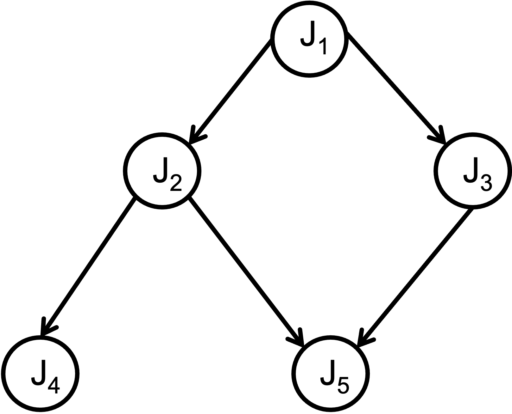 |  $J_1 \prec J_2$ <br> $ J_1 \to J_2$ <br> $J_1 \prec J_4$ <br> $J_1 \not\to J_4$|
||


Here is a more realistic example &rarr; the precedence constraints in an **autonomous driving system**:


### Resource Model

A "resource" is some structure used by task &rarr; advance execution.

Type of resources:

- **active** &rarr; e.g., processors (they execute jobs)
    - every job &rarr; one or more processors
    - same type if functionally identical and used interchangeably
- **passive** &rarr; _e.g.,_ files, network sockets, _etc._
- **private** vs **shared**

We have already discussed [resource sharing and synchronization](#inter-task-communication-and-synchronization) earlier &rarr; mutexes, locks, _etc._ Esentially there is a need for **mutual exclusion** that is guaranteed via one of these methods or by the use of [critical sections](https://cs.gmu.edu/~rcarver/ModernMultithreading/LectureNotes/Chapter2Notes.pdf).


### Scheduling and Algorithms

Before we proceed, we need to understand &rarr; **preemption**:

> preemption is the process of **suspending a running task** in **favor of a higher priority task**.


Most OS (real-time & non real-time) allow preemption since they allow,

- greater flexibility in constructing schedules
- exception handling
- interrupt servicing

Preemptions, among others, help define a variety of **scheduling events**; essentially, these are the time when the **scheduler is invoked**:

- in a _fully_ preemptive system &rarr; task arrival, task completion, resource reauest, resource release, interrupts and exceptions, _etc._ 
- in a _non-preemptive_ system &rarr; task completion
- in _limited_ preemptive systems &rarr; predefined preemptions points, _e.g.,_ POSIX thread cancel (`pthread_testcancel()`)


#### Task Schedule

We have been talking about "scheduling" all this while so it is time to formally define what a **schedule** is.

Given &rarr; a set of jobs, $J = \{ J_1, J_2,...,J_n \}$

> A schedule &rarr; an **assignment** of Jobs to the CPU, so that each task can execute till completion.


## Schedulers

Finally, we get to the main topic at hand &rarr; schedulers and scheduling! Historically there have been many scheduling policies developed for a variety of systems, _e.g.,_ [FIFO](https://www.geeksforgeeks.org/program-for-fcfs-cpu-scheduling-set-1/), [round robin](https://www.geeksforgeeks.org/program-for-round-robin-scheduling-for-the-same-arrival-time/), [time sharing](https://dl.acm.org/doi/abs/10.1145/1460833.1460871), _etc._

Here is a good comparison of the various types of (historical) CPU/OS schedulers: [CPU Scheduling in Operating Systems](https://www.geeksforgeeks.org/cpu-scheduling-in-operating-systems/).

In the realm of real-time systems, to _formally_ define a scheduling problem, we need to specify:

1. a set of **tasks**, $\tau$
2. a set of **processors**, $P$
3. a set of **resources**, $R$

Hence, the **general scheduling problem** is,

> assign processors and resources to tasks, such that the following constraints are met:
> 
> - timing constraints
> - precedence constraints
> - resource constraints

There is a [large body of literature](https://link.springer.com/book/10.1007/978-1-4614-0676-1) in the domain of real-time scheduling algorithms. In this chapter, we will focus on a few of them, _viz._,

- completely static &rarr; _e,g.,_ [cyclic executives](#cyclic-executives)
- [priority-based](#priority-based-schedulers) &rarr; static (_e.g.,_ RM) and dynamic (_e.g.,_ EDF)
- dynamic best effort

One of the main problems with the scheduling problem, as defined above (and in general), is that many variants of the problem are **intractable**, _i.e.,_ NP-Hard or even NP-Complete.

> Recall that an NP-Hard problem is one where no _known_ polynomial time algorithm exists. So, all known algorithms are superlinear or, usually, of _exponential_ time complexity!

[Will leave it to the reader to recall or look up the definition of NP-Complete.]

Since the scheduling problems may not be tractable (or "solvable" in a realistic time frame), we need to find _heuristics_ but they can be "sub-optimal". Luckily, we have a couple of **provably optimal** real-time schedulers (in the single core domain). 

**Additional, important definitions**:

|concept| definition |
|-------|------------|
| **feasibility** | schedule is feasible if all tasks can be completed by satisfying a set of specified constraints|
| **schedulable** | set of tasks is schedulable if there exists **at least one algorithm** that can produce a feasible schedule |
| **schedulability analysis** | analysis to confirm that deadlines for a set of threads can be guaranteed using a **given scheduling policy** |
||


### Cyclic Executives

In the automotive enginer example from earlier, we see that for each **cycle**, the same set of tasks **repeat** (_i.e._., "periodic behavior"). Note though that the tasks _need not_ execute in parallel -- rather, they must execute sequentially for this application. Usually such applications use a scheduling mechanism known as a "**cyclic executive**". 

Consider this simple example with three tasks:

|task|c|
|----|--|
| $T_1$ | 1|
| $T_2$ | 2|
| $T_3$ | 3|
||

How would we **schedule** this? Assuming a single processors (hence a single timeline).


Well, the _simplest_ mechanism is to just use a **sequential** schedule,


If, as in the case of the engine control example we saw earlier, the tasks repeat _ad infinitum_, then we see the pattern also repeating...


Cyclic executives were common in many critical RTS, since they're **simple** and **deterministic**. An implementation could look like,

```
while(1)    // an infinite loop
{
    // Some Initialization

    Task_T1() ;

    // Some processing, maybe

    Task_T2() ;

    // Some other processing, maybe

    Task_T3() ;

    // Cleanup
}
```

**Question**: what problems, if any, can happen due to cyclic executives?

The very simplicity of such systems can also be their biggest weakness. 

1. **lack of flexibility**: as the example and code above demonstrate, once a pattern of executions is set, it cannot be changed, **unless the system is stopped, redesigned/recompiled and restarted**! This may not be possible for critical applications. Even for the engine control application in cars, this doesn't just mean stopping and restarting the car, but **re-flashing** the firmware for the engine, which is quite an involved task. 

2. **scalability**: along similar lines, it is difficult to scale the system to deal with additional issues or add functionality. 

3. **priority**: there is no way to assign priority or preemption since all tasks essentially execute a the _same priority_. Hence, if we want to deal with higher-priority events (_e.g._, read a sensor) or even _atypical_ (aperiodic/sporadic) events, such as sudden braking in an autonomous car, then a cyclic executive is not the right way to go about it.

4. **resource management**: certain tasks can corral resources and hold on to them while others may _starve_ -- leading to the system becoming unstable. For instance, even in the simple example, we see that $T_3$ can dominate the execution time on the CPU:


Since the system is _one giant executable_, it is difficult to stop a "runaway task" -- the entire system must be stopped and restarted, which can lead to serious problems.


### Frames

One way to mitigate _some_ of the problems with cyclic executives, is to split the resource allocation into "frames" &rarr; **fixed** chunks of time when a task can claim exclusive access to a resource, _e.g.._ the processor:

- once a frame starts, the task gets to execute _uninterrupted_
- at the end of the frame, the task _must give up_ the resource &rarr; regardless of whether it was done or not

So, if we revisit our simple example and break the processor schedule into frame sizes of `2` units, each,


> why `2`? Well, it is arbitrary for now. But, as we shall see later, we can calculate a "good" frame size

Now, our schedule looks like,


As we see from this picture, task $T_1$ doesn't end up using its entire frame and hence, can waste resources (one of the pifalls of this method).

Continuing further,


Task $T_3$ is _forced_ to relinquish the processo at `t=6` even though it has some execution left &rarr; on account of the frame ending. Now $T_1$ resumes in its own frame. $T_3$ has to wait until `t=10` to resume (and complete) its execution:


**Other Static/Table-Driven Scheduling**:

Cyclic executives are an example of schedulers where the tasks are fixed, _ahead of time_, and all that a scheduler has to do is to _dispatch_ them one at a time in the **exact same order**. Often the tasks are stored in a lookup table (hence the name "table-driven"). Other examples of such systems (with some prioritization and other features built in) have been built, _e.g.,_ [weighted round robin](https://par.nsf.gov/servlets/purl/10383232) &rarr; also finds use in cloud computing and networking load balancing, _etc._


### Priority-Based Schedulers

One method that overcomes the disadvantages of a completely static method is to **assign priorities for jobs as they arrive**. Hence, when a job is _released_ it gets assigned a **priority** and the scheduler then dispatches/schedules the job accordingly. Hence, it if is the highest priority job so far, it gets scheduled _right away_, by preempting any currenlty running tasks. If, on the other hand, it is not the highest priority task then it is inserted into the ready queue at the right position (priority level).

To deal with this, we need an **online scheduler**, _i.e.,_ one that is always available to make scheduling decisions -- when tasks arrive, complete, miss their deadlines, _etc._

Before we go any further, let's **update the task model** a little, to make matters simple for us. 

- as before, we have a task set comprised of $n$ **periodic** tasks, $\tau = {\tau_1, \tau_2...\tau_n}$
- deadline **is equal to** period, _i.e.,_ $T=D$; task periods are $T_1, T_2, ... T_n$
- all tasks are **independant** &rarr; no precedence or resource constraints exist
- tasks **cannot suspend** themselves (or others)
- tasks are **preemptible** by the OS &rarr; each time the highest priority task is executed (under preemptive scheduling)
- execution time of each task is **bounded** &rarr; wcet ($c_1, c_2, ... c_n$)
- tasks are released (_i.e.,_ placed into the ready queue) **as soon as they arrive**
- all kernel overheads (_e.g.,_ context switches) &rarr; assumed to be **zero**

While these may seem to be overly simplifying, they still fit the model of many systems and help us develop _fundamental results_. And we can always add them back one-by-one and still retain the correctness of the theoretical results we develop, while making the system more realistic. 

Now, in the real of **online, priority-driven** schedulers, we have **two** options:

| priority assignment | algorithms |
|---------------------|------------|
| **static** | [Rate-Monotonic](#rate-monotonic-scheduler-rm) (RM), Deadline-Monotonic (DM) |
| **dynamic** | [Earliest-Deadline First](#earliest-deadline-first-scheduler-edf), Least-Slack Time (LST) |
||

<br>

Let's look at one of each (the most popular ones), _viz._ the [Rate-Monotonic](#rate-monotonic-scheduler-rm) (RM) and [Earliest-Deadline First](#earliest-deadline-first-scheduler-edf) schedulers. Note that both were first described and analyzed in a **seminal Computer Science Paper**, that has since become one of the most cited and influential papers in the field: [Scheduling Algorithms for Multiprogramming in a Hard- Real-Time Environment](https://dl.acm.org/doi/10.1145/321738.321743) by Liu and Layland.

Interestingly, both of these algorithms are **provably optimal**, _i.e.,_ no other static or dynamic algorithm can do better than RM and EDF respectively! Not bad for the first paper in the area -- talk about setting a high bar, or rather _bound_!

#### Rate-Monotonic Scheduler (RM)

The Rate-Montonic priority assignment algorithm assigns **priority based on the period of the task** &rarr; shorter the period, the higher the priority!

Consider the following example:

|task|c|T|
|----|--|----|
| $\tau_1$ | 2| 4 |
| $\tau_2$ | 2| 5 |
| $\tau_3$ | 1| 10 |
||

So, based on the RM algorithm, the priority will be:

$$\tau_1 > \tau_2 > \tau_3$$

since, $T_1 < T_2 < T_3$.

The question now is whether the above task set is **schedulable**? Let us use our previous utilization-based check, _i.e._,

$$U = \sum_{i=1}^{n} \frac{c_i}{T_i}$$

So, plugging in the numbers, we get,

$$ U = \frac{1}{2} + \frac{1}{4} + \frac{2}{6} = 0.5 + 0.4 + 0.1 = 1.0 $$

Our test was: $U \le 1$. So, this task set is...schedulable? Let us see -- by plotting it on the timeline:


As we see, task $\tau_3$ misses its deadline! In fact, with the other two tasks, $\tau_1$ and $\tau_2$ constantly executing, $\tau_3$ will **never** get to execute and **all** of its jobs will miss their deadlines!

> "Wait!", you say. OK, _one_ job has missed its deadline, maybe two (from the picture). So how can I make the bold claim that _all_ will miss their deadlines?
> <br>
> If you pay close attention to the figure, I have only checked for `10` time steps. Why that number? Well it so happens that `20` is the **LCM** (lowest common multiple) of **all** the task periods, `4`, `5`, `10`.
> <br>
> Why do we care about the LCM? Turns out, in real-time scheduling, the LCM of the task periods have a special significance. Turns out that if we construct the schedule for **one LCM** nunber of time units, then the schedule **repeats exactly** after that! Hence, the exact same schedule repeats every LCM number of units.
> <br>
> The LCM of the constituent (periodic) tasks in the system is referred to as &rarr; **hyperperiod**. So, we only need to check our schedule for **one hyperiod**. If the task set is schedulable in that timeframe then it will be and, if not, it will not be.
> <br>
> So, for this example, I can state, with confidence, that **all** jobs of $\tau_3$ will miss their deadlines since within **half** of the hyperperiod, one job has missed its deadline!

So, coming back to our analysis, we started with our utilization test $U < 1$ which this task set, _passed_, yet it **failed to schedule*! So, it seems we need something _better_. 

Turns out the [Liu and Layland paper](https://dl.acm.org/doi/10.1145/321738.321743) has figured this out. So they created another test, one based on: **utilization upper bound**. Since RM is a static priority assignment mechanism, there is a **theoretical limit** on the utilization for a task set, that **depends on the number of tasks**, `n`, in the system.

So, we derive (I leave out the details here. Check the Liu and Layland paper for more details) another check for utilization,

$$ U = \sum_{i=1}^n \frac{c_i}{T_i} \le n.(2^{\frac{1}{n}} -1) $$

If the **total** utilization of the system is below this bound, then the task set is schedulable by RM. **Note** that this is a _necessary but **not** sufficient_ test (more on that later).

As we see from above, the value of the right hand side will change with the number of tasks in the system. Hence, with more tasks, the upper bound for $U$ will reduce. 

> let's open up the simulator-plotter for checking this for various values of `n` and see for $n=1, 2, ...$

So, we see that 

$$n = 3\\
U_{ub} \approx 0.78
$$

The utilization for our task set was: $\approx$ `1.0` which is significantly higher! No wonder our task set wasn't schedulable!


Here is a plot that shows the values for different numbers of tasks:


As we see, the value keeps reducing. Does it keep going _all_ the way down to zero? What if I schedule `100` tasks? A `1000`?

Turns out, we can check! With the exact same equation.

> let's open up the simulator-plotter for checking this for various values of `n` and see for $n=100, 1000, etc.$


As we see from the figure (and the active plotting), the values seem to _plateau_ out and converge...to **`0.69`**! So, for any real-time system scheduled using the RM assignment mechanism, if the utilization bound is under `0.69` then it is schedulable. 

**Optimality**: as mentioned earlier, RM is **optimal**, _i.e.,_

- if a task set is schedulable by RM &rarr; then there is no other _static_ algorithm that can do better (in terms of utilization)
- if a task set is _not_ schedulable by RM &rarr; there is **no other _static_ algorithm** can schedule it

##### Exact (Response Time) Analysis

Now, let's go back to one of our earlier examples (from the [cyclic executive](#cyclic-executives) chapter):

|task|c|T|
|----|--|----|
| $\tau_1$ | 1| 4 |
| $\tau_2$ | 2| 6 |
| $\tau_3$ | 3| 12 |
||

We added some period information to the tasks.

We know that using the naive utilization test, $U \approx. 0.833$. But, recall that the utilization bound test, for $n=3$ tasks requires, $U < 0.78$. So, this task set must be _unschedulable_, right? Let's draw it out on the timeline and see:


Wait, this is **schedulable**? But it fails our test!

This is why I referred to it as a _necessary but **not** sufficient_ test. Hence, for the Liu and Layland utilization bound test,

|result of test|schedulable?|
|--------------|------------|
| pass, _i.e.,_ $U_{ub} < 0.69$ | yes |
| fail, $U_{ub} > 0.69$ | **unsure**|
||

We we need a _better_ test &rarr; **Response Time Analysis** (RTA):

- if **all jobs** of a task are able to **complete before their respective deadlines** &rarr; task set is schedulable
- caveat &rarr; we account for the **interference** (hence, delays) encountered by the jobs by _all_ higher priority jobs

Let's look at it in more detail:

1. **worst-case** response time of task, $\tau_i$ is

$$R_i = c_i + I_i$$

where $I_i$ is the **interference** faced by that job from **all** higher prioriy jobs until then.

2. For _each_ higher priority job, $\tau_j$, the number of _jobs_ released during the time interval $R_i$ is:

$$\left\lceil \frac{R_i}{T_j} \right\rceil$$

Since _each period_ of task $\tau_j$ results in a new job being released. Since RM gives higher priority to shorter periods, those released jobs will execute ahead of the current teak, $\tau_i$.

3. Since $\lceil {R_i}/{T_j} \rceil$ number of $\tau_j$'s jobs execute before $\tau_i$, the interference caused by all of them:

$$I_j = \left\lceil \frac{R_i}{T_j} \right\rceil .\ c_j$$


4. the **total** interference then, is the sum of the individual interference by each of the higher priority jobs, _i.e.,_

$$I = \sum_{j\in hp(i)}\left\lceil \frac{R_i}{T_j} \right\rceil .\ c_j $$

5. Finally, the **response time** for task, $\tau_i$ must combine its own (worst-case) execution time with the total interference from **all** higher priority tasks, 

$$R_i = c_i + I_i$$

$$ R_i = c_i + \sum_{j\in hp(i)}\left\lceil \frac{R_i}{T_j} \right\rceil .\ c_j $$

For each task, we carry out the above analysis &rarr; stop when consecutive iterations provide the **same** values. 

6. At each stage, check if the response time for a task is less than or equal to its deadline

$$ \forall \tau_i: R_i < T_i $$

If the above test passes for all tasks, then the task set is **schedulable** even if the earlier tests fail. Hence, this is both, _necessary **and** sufficient_.

**Example** [contd.]: Now, applying this to our errant example:

1. assign priorities: $\tau_1 > \tau_2 > \tau_3$

2. response time calculations

For each task, we calculate the response time using the above formula via iterative analysis.

|task | iteration | calculations| $R_i < T_i$ |
|-----|-----------|-------------|-------------|
| $\tau_1$ | 1 | $R_1 = c_1 = 1$ | yes [ $1<4$ ]
| $\tau_2$ | 1 | $R_2^0 = c_2 = 2$ <br> $R_2^1 = c_2 + \lceil\frac{R_2^0}{T_1}\rceil c_1$ <bR> $R_2^1 = 2 + \lceil\frac{2}{4}\rceil \cdot 1 = 3$ ||
|          | 2 | $R_2^2 = 2 + \lceil\frac{3}{4}\rceil \cdot 1 = 3$ [stop] | yes [ $3 < 6$ ]
| $\tau_3$ | 1 | $R_3^0 = c_3 = 3$ <br> $R_3^1 = c_3 + \lceil\frac{R_3^0}{T_1}\rceil c_1 + \lceil\frac{R_3^0}{T_2}\rceil c_2$ <br> $R_3^1 = 3 + \lceil\frac{3}{4}\rceil \cdot 1 + \lceil\frac{3}{6}\rceil \cdot 2 = 6$ ||
|          | 2 | $R_3^2 = 3 + \lceil\frac{6}{4}\rceil \cdot 1 + \lceil\frac{6}{6}\rceil \cdot 2 = 8$ | |
|          | 3 | $R_3^3 = 3 + \lceil\frac{8}{4}\rceil \cdot 1 + \lceil\frac{8}{6}\rceil \cdot 2 = 8$ [stop] | yes [ $8<12$ ]
||

Since the response time of **all** tasks meet their deadlines under RM scheduling, therefore the task set is **schedulable**.

The response time analysis algorithm:

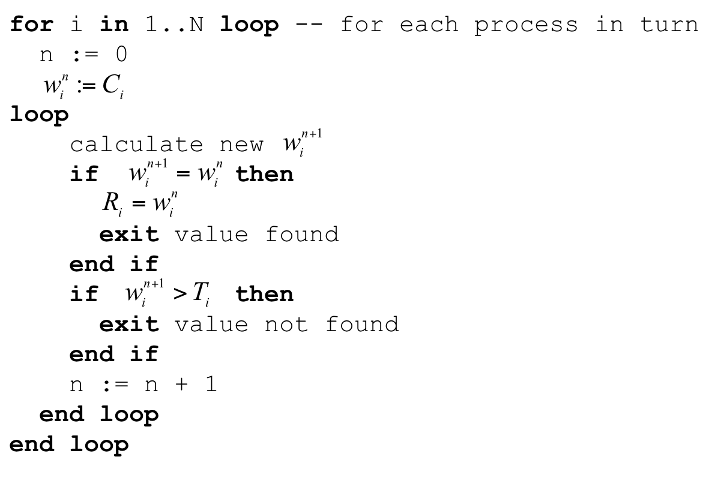

<br>

There exist many of static assignment algorithms, for instance the [Deadline Monotonic Scheduler](http://www.cs.csi.cuny.edu/~yumei/csc744/Examples/realtimetasks.pdf) where priorities assigned to processes are **inversely proportional to the length of the deadline**.

**Resources**:

1. to read more about the schedulability analysis details or other types of schedulers, see: [Priority-Driven Scheduling](https://www.eecs.umich.edu/courses/eecs571/lectures/lecture5-schedule2.pdf).
2. [A Review of Priority Assignment in Real-Time Systems](https://iris.unimore.it/bitstream/11380/1118762/4/POST_PRINT_JSA2016Priority.pdf) by Davis et al.


#### Earliest-Deadline First Scheduler (EDF)

The problem with static priority assignments, is that they are typically _non-optimal_. Wait, but we said earlier that RM _is_ optimal? Well, among static priority assignment algorithms RM is optimal but, as we saw from the analyses and the graphs, upper bounds for tasksets often taper off at $U = 0.69$. While we can create task sets with higher utilization (as the response-time analyis shows us), it takes a lot of manual effort to create such task sets. This means, that in the _common_ case, we are **wasting nearly `31 %` utilization**!

A dynamic assignment of priorities can help mitigate these problems and ensure that we make better use of the system resources. Many dynamic scheduling algorithms have been proposed, _e.g._, [FIFO](https://d-nb.info/1240614632/34) and [Least Slack Time](https://www.javatpoint.com/least-slack-time-lst-scheduling-algorithm-in-real-time-systems) among others.

In this section we will focus on **the** priority assignment mechanism for real-time systems which, actually, is one of the mainline schedulers in Linux, named [`SCHED_DEADLINE`](https://docs.kernel.org/scheduler/sched-deadline.html).

In a nutshell, as the name implies, EDF assigns priority based on the **absolute deadline** of the job. From [Wikipedia](https://en.wikipedia.org/wiki/Earliest_deadline_first_scheduling):
> Whenever a scheduling event occurs (task finishes, new task released, etc.) the queue will be searched for the process closest to its deadline. This process is the next to be scheduled for execution.

While the exact priority of a job depends on its deadline, the latter are calculated statically. Hence, even though jobs of a task may have different priorities, **each** job has only one priority level. As jobs complete, the priorities of the remaining (or new, incoming) jobs change.

**EDF Schedulability Test**: is the **same** as the first test we discussed, _i.e.,_

$$ U = \sum_{i=1}^{n} \frac{c_i}{T_i} \le 1 $$

As long as we're following the task model described earlier, this is a **very simple** check to test for the validity of the task set for EDF. 

Let's revisit our example from RM that was _not_ schedulable, _viz.,

|task|c|T|
|----|--|----|
| $\tau_1$ | 2| 4 |
| $\tau_2$ | 2| 5 |
| $\tau_3$ | 1| 10|

Before we proceed, we need to decide on some policies:

- two jobs have the **same** deadlines &rarr; pick the one that was released _first_
- same deadline **and** released at the same time++ &rarr; pick one with the smaller index?

These are some simple rules that help in simplifying the decision-making process. We can change them, as long as it helps us make forward progress and we remain _consistent_.

++ in this scenario, ideally we should redesign the system to combine these two tasks -- if they always run together, then why pay the extra costs of preemption/context-switch, _etc._?

For the above task set, we see that,

$$U = \frac{2}{4} + \frac{2}{5} + \frac{1}{10} = 0.5 + 0.4 + 0.1 = 1 \le 1$$

Hence, this task set is **schedulable** using EDF (just barely though since its utilization is `1`!). At least theoretically! Remember that this task set _failed_ for RM.

The schedule diagram for this task set looks like,


So far, it looks schedulable. It is left as an exercise to the reader to check until the hyperperiod (`20`).

**Optimality**: EDF is an **optimal scheduling algorithm** &rarr; if the task set is schedulable by some algorithm, it is also schedulable under EDF.

EDF can definitely _squeeze_ out the maximum from a system -- as we just saw, it can even schedule task sets with the theoretical utilization vound (`1`)!


#### RM vs. EDF

So, let's compare the two superstars of the real-time scheduling world, RM and EDF. The &check; symbol indicates which one is better. 

|parameter | RM | EDF |
|----------|----|-----|
| optimality | &check; (static) | &check; |
| context switch overheads | &check; | &cross; |
| preemptions | &cross; | &check; |
| analysis overheads | &cross; | &check; |
| utilization | &cross; | &check; |
| implementation ease | &check; | &cross; |
| predictability | &check; | &cross; |
|**total**| <scb>4</scb> | <scb>4</scb> |
||

<br>

**Other Issues**: note that we have mostly considered a simple task model. But these may vary in real world systems, _e.g.,_

- $ D <T $, $D > T$ &rarr; essentially situations where deadlines and periods don't align; there are other analyses methods that can be applied
- **multicore** &rarr; so far we have only discussed single core systems; scheduling across multiple cores is an NP-complete problem but many heuristics have been developed; see [A Survey of Hard Real-Time Scheduling for Multiprocessor Systems](https://dl.acm.org/doi/pdf/10.1145/1978802.1978814) for a summary of many results
- **priority inheritance protocols** &rarr; for dealing with resource contentions; again a large body of work exists in this domain; see [Lecture Note \#6](https://www.eecs.umich.edu/courses/eecs571/lectures/lecture6-schedule3.pdf) for a good summary.
- **power consumption** and scheduling &rarr; scheduling methods can help alleviate power consumption issues; see [Real-Time Dynamic Voltage Scaling for Low-Power Embedded Operating Systems](https://www.eecs.umich.edu/courses/eecs571/lectures/lecture12-rtdvs.pdf) for one of the early results.
- **[memory](https://link.springer.com/article/10.1007/s11241-012-9158-9)**, **[networks](https://sibin.github.io/papers/2017_RTSS_SDNQoS_Rakesh.pdf)**, **[networks-on-chip](https://www.computer.org/csdl/journal/td/2017/05/07728147/13rRUwj7coW)**, **[5G](https://ieeexplore.ieee.org/stamp/stamp.jsp?arnumber=9773317)**, _etc.,_ &rarr; real-time scheduling has been applied to wide variety of domains.


<br>
<br>
<br>
<br>
<br>
<br>
<br>
<br>
<br>
<br>

<!--rel="stylesheet" href="./custom.sibin.css"-->


# Control Theory

Consider a simple problem &rarr; how do you balance a ball?


<br>

I guess that's more complicated than what we wanted! So, let's make it really simple and try in a _one dimensional plane_, as follows:


We want to balance the ball in the _middle_ of the table. And the ball moves either left or right, based on how we _tilt_ the table. 

As we see from this picture, a naive attempt at balancing the ball can quickly make it "_unstable_". But, our objective, is to make sure that,

- the ball remains **stable** and
- it is in the **middle** of the table

The options that are available to us are:

1. tilt the table down on the left (anti-clockwise)
2. title the table down on the right (clockwise)

We also have the ability to control the _speed_ at which the table tilts to either side. We can actually combine these, as we shall see.

Hence, the parameters for the problem are:

|type | options |
|-----|---------|
| inputs | speed (clockwise, anticlockwise) |
| output | ball velocity, acceleration |
||

Some how, we need to _control_ the outputs by modifying the inputs to the system. Enter **control theory**. 


## Control Theory | Introduction

Control theory is a _multidisciplinary_ field at the intersection of applied mathematics and engineering. Engineering fields that heavily utilize control theory include mechanical, aerospace, electrical and chemical engineering. Control theory has been applied to the biological sciences, finance, you name it.

Anything that you,

- **want to control** and
- can **develop a model**

you can develop a "_controller_" for managing it, using the tools of control theory.

In our everyday life, we interact with technologies that utilize control theory. They appear in applications like adaptive cruise control, thermostats, ovens and even lawn sprinkler systems. The field of control theory is huge and there's a wide range of subdisciplines.

The basic idea behind control theory is to _understand a process or a system_ by developing a model for it that represents,

> the **relationships between inputs and outputs for the system**

We then use this model to **adjust the inputs** &rarr; to get **desired outputs**. The relationship between the inputs and outputs is usually obtained through empirical analysis, _viz.,_,

1. make changes to the input
2. wait for the system to respond
2. observe changes in the output. 

Even if the model is based on an equation from physics, the parameters within the model are still identified experimentally or through computer simulations.

We repeat the experiments/simulations as needed to "understand" the system as well as we can, in ordero to develop the model. Once the model has been developed, we develop a **control model** that can used to tune the input &rarr; output relationship.

In effect, we are _inverting_ the original model (input &rarr; output) to develop, 

> control model: input &larr; output

To better understand this, consider the example of a light bulb and switch:


Even if we didn't know the relationship between the switch and bulb, we can conduct a few experiments to figure out the following:

|switch state <br> (input) | bulb state <br> (output)|
|---------------------|--------------------|
| off | off |
| on  | on |
||

Now we have our "model" of input (switch state) &rarr; output (ligthbulb state). This model works as as no _external_ disturbances occur (power failure or bulb burn out).

But, this is _not_ our control model. For that, we need to **invert** the model we've built so far. 

So, we start with the **desired output state**, _e.g.,_ the "lightbulb must be on". Then, we reason backwards to: "_what should the input be to achieve this desired state?_". Should the switch be `on` or `off`?

From our original model (and experiments), we have created the I/O relationship table above. Hence, it stands to reason that we can "invert" it as:

|desired output <br> lightbulb state| corresponding input <br> switch state|
|---------------------|--------------------|
| on | on |
| off  | off |
||

<br>

Now, let's **formalize** things a little. 

Consider the following mathematical model that describes the behavior of a system:


The model says that if we change the input `u` the output `y` will change to be **twice** the value of the input `u`.

Now, in control theory, we are concerned about how to **get to a specific output**. Hence, if we want to reach a specific value of `y`, say &rarr; **$y^*$**, we need to _manipulate the model_ to now create a "control model", _i.e.,_

$$u = \frac{y^*}{2}$$

This model says for any value of the output $y^*$ that we want, we can identify the input `u` &rarr; essentially dividing $y^*$ by `2`. Notice that this equation is now **in terms of `u`** &rarr; we have our **control law**! Restating the obvious, this is an "inverse" of the original model of the system.

We have just developed our **first controller**! The desired value, $y^*$ is referred to as the **setpoint**. We get to the setpoint by picking the right value for `u`. 

Developing a control law, in a sense, is inverting your model to rewrite the output in terms of the input so that you can get the output you want. More complex systems lead to more complicated control laws. Practitioners have developed methods of developing control laws for systems whose models cannot be cleanly inverted, _e.g.,_ such as nonlinear systems or systems with dead times.

For context, this is where we are in this course _map_:


### Open-Loop vs Closed-Loop Control

For the control law we just developed, if our model is accurate and there are no disturbances then, 

$$ y = y^*$$

However, note that there is nothing ensuring that the value of $y = y^*$. We just assume (rather, _expect_) that it would be the case. This is known as an **open loop controller**. You desire a certain output and hope that the controller actually gets there.

So, the open loop controller is depicted as:


What we really want, is to somehow _ensure_ that the controllers gets to its setpoint. How do we do that?

The problem is that while the input drives the output, there is no way to _guarantee_ that the controller will get to the set point. 

What we really need, is a **closed-loop controller** &rarr; one that uses **feedback** to,

- **adjust `u`**
- ensure that we get to $y^*$ (or, at least as close to it as possible).

The feedback typically comes from the output of the controller model that we created. So,


Note that the feedback can be positive or negative. 


[The above description is distillation of the [excellent description found here](https://www.reddit.com/r/ControlTheory/comments/lqjgb3/comment/gogu5pu/?utm_source=share&utm_medium=web3x&utm_name=web3xcss&utm_term=1&utm_content=share_button).]


## Feedback Control

[The following material is thanks to [Prof. Sathish Gopalakrishan](https://ece.ubc.ca/sathish-gopalakrishnan/), Univ. of British Columbia].

Consider the following problem (that we increasingly encounter in the real world):

> how do you ensure that a car remains in the _center_ of its lane?

So, we have a car moving on the road, thus:


<br>

the blue arrow shows the direction of motion of the car. Hence, for the car to remain in the _center_ of the lane, we need to apply a **correction** to its direction of motion,


<br>

There are some questions that come up:

- **how** do we apply the corrections?
- **how much** and
- **when** do we **stop**?

Enter **feedback control**:

> - _compare_ system state to the desired state
> - apply a _change_ to the system inputs &rarr; counteract the deviations
> - repeat until desired outcome &rarr; setpoint

**Example**: let's see how feedback control can be applied to a temperature control of a room. 

Given a "desired" room temperature (as input to a thermostat), what do we need to consider while attempting to achieve this temperature?


The thermostat needs to control/provide inputs to a furnace/AC,


which then affects the temperature in the room:


Easy! Done...right?

Except, the real world is far from ideal. We have to deal with disturbances...


<br>

Well not that kind of disturbance, but pesky issues like heat loss, bad insulation and physical problems in general:


As we see from the picture, we may not get to the expected behavior due to external factors. So, as before, just the input will not suffice to reach the setpoint. 

So, we provide "feedback" to the controller:


Essentially the temperature reading of the room, _after_ the thermostat and furnace/AC have completed their operations based on the original inputs (desired temperature).

Let's introduce some _generic_ technical terms for each of these components:


The "controller" is based on the "control model" that we developed earlier. It sends commands ("_actuation signals_") to an actuator and then affects the _process under control_. Finally, the _process variable_ (the "output" from the earlier discussions) is what we want to drive towards the set point.

**Note**: in the case that feedback is not possible, there is work on &rarr; [open-loop control](https://www.electronics-tutorials.ws/systems/open-loop-system.html) and [feedforward control](https://web.stanford.edu/class/archive/ee/ee392m/ee392m.1034/Lecture5_Feedfrwrd.pdf).

Another example &rarr; cruise control.


Note how the feedback reaches the controller in this case. 

So, at a high-level, a **closed-loop feedback control system** looks like,


Some of these inputs/edges have _specific_ names:


**Note:** the main goal &rarr; **error is minimized** (ideally `0`).

A more formal definition of the same quantities,


|quantity | definition |
|---------|------------|
| $r(t)$  | **reference**/set point|
| $e(t)$  | **error** |
| $u(t)$  | **control signal**/"input" |
| $y(t)$  | (expected/final) **output** |
| $\overline{y(t)}$ | "feedback"/**estimate** |
||

Now let's apply this feedback control model to the earlier problem of lane following.


## Feedback Control Applied to Lane Following

Recall that we want to keep the car in the center of its lane:


But here's a question &rarr; _how do you find the **center** of the lane?_

Consider a road with lane markings on either side,


Now, let's assume that some system (say, a camera), can track the yellow lines to an extent. We need to find the center of the lane, as marked in the figure:

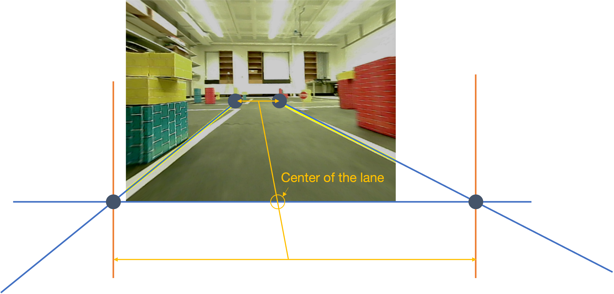

Based on the _two_ points marked up ahead (that we can detect to be on the same plane), we can calculate,

$$x_{center} = \frac{x_{left\_end}+x_{right\_end}}{2}$$

Now, a car need not be in the actual center of the lane,


Now, assuming that the camera is mounted at the center of the car,


The car's position can be calculated as:

$$x_{car} = \frac{width}{2}$$

From this we can calculate the **cross-track error** (CTE), 

$$CTE = x_{car} - x_{center}$$

What happens when,

- $CTE > 0$
- $CTE < 0$?

Now, back to our original problem &rarr; keeping the car in the center of the lane. We do this by &rarr; **keep CTE as small as possible** and applying **corrections**,


The \$64,000 question is: **how**?

Answer: **feedback control**!

Recall the various components of the feedback control:


<br>

Now, let's map the lane following components on to this:


As we see from the figure, the **lane following controller** sends the control/actuation signal to the steering unit. Sensors (perhaps a camera equipped with vision algorithms in this case) provide **feedback** to the controller ($\overline y_t$). Mapping this back to the lane variables and CTE,


This figure shows the important part &rarr; the **CTE is the feedback** for the lane following controller! The **input** then is the negative error, _i.e.,_ the goal is to reduce the CTE. Also note that the _output_ of the controller is the **steering input**.

So, let's focus in on how the controller operates, _i.e.,_ this part:


<br>

Problem statement:

> given the CTE, how do we compute the **control** signal so that the car _stays in the middle of the lane_?

The final "corrections", when applied, may look something like this:


## PID Control

Let's start with one goal &rarr; **lateral position control**:

||||
|-----|-----|-----|
|process variable| $\textbf{y(t)}$ | $y$ position at time, $t$|
|goal | $y = 0$| keep the car at position `0`|
|control signal| $u(t)$ | steering |
||

Let's say we have the car's _start_ and _end_ position,


And we know the relationship between $u(t)$ and $y(t)$:


Basically we want $u(t)$ to be negative &rarr; so that $y$ tends towards its eventual goal, $y = 0$.

So, what should our **control input**, 
$$e(t) = ?$$

<br>

As we see below, we want the input to be a _decreasing value of the feedback_, 

$$e(t) = -y(t)$$

<br>


This is called **proportional (P) control**.

### Proportional (P) Control

The correction is **proportional** to the **size of the error**, _i.e.,_


So, going back to our example of lateral control, let us try to apply the proportional control methodology to it:


We have the following choices:

- $K_p > 0$
- $K_p < 0$

We pick the $K_p > 0$ since we want the following relationship to hold (following from $e(t) = -y(t)$):

$$ K_p e(t) = - K_p y(t)$$


<br>

We see that this proportional controller helps us move the car towards our goal, $y=0$.

Now, let's consider a few situations:

1. what happens if $K_p$ &rarr; **too small** (small _"gain"_)?


<br>

The response is **too slow**/gradual. We may _never_ get to the goal in this case. 

2. what happens if $K_p$ &rarr; **too large** (large _"gain"_)?


<br>

The response is **too sudden**. The system may **overshoot** the goal!

So, the next question that comes up &rarr; _can the car be stabilized at $y=0$?_ This is **unlikely** using just the proportional control method since,

|gain|effect|
|----|------|
|small| **stead-state error**|
|large| **oscillations**|
||

The question then becomes &rarr; _how can we **reduce oscillation**_, _i.e._, can we get to the following situation (smoother, _actual_ approach to the goal)?


### Derivative (D) Control 

Derivative control **improves the dynamic response** of the system by,

- studying the **rate of change** of the error and
- **decreasing oscillation**

<br>


So, what does this mean, in practice? What we're measuring and trying to control, is the **rate of change**, _i.e.,_ the change from,

$$y(t-1) \rightarrow y(t)$$

<br>


Typically, proportional and derivative control are often **used together**, as a way to counteract each others' influences. So, we get:


As with the proportional controller, we have two options for the derivative as well. Should,

- $\frac{dy(t)}{dt} < 0$
- $\frac{dy(t)}{dt} > 0$

Note that the derivative controller's job is to steer **away** from the reference line, to act as a counter to the proportional controller pushing in the opposite direction. Hence, we pick $\frac{dy(t)}{dt} < 0$.

The derivative controller acts like a **brake** and counteracts the correctional force. It reduces overshoot by **slowing the correctional factor** &rarr; as the reference goal approaches.


We see numerous uses of the combination, known as the **P-D** controllers in every day life, from the smallest to the largest, even rocket ships!

<video controls width="500"> <source src="img/controls/feedback_lane/SpaceX_landing.mp4"></video>

#### Tuning P-D Controllers

Consider the following values for the two coefficients, $K_p$ and $K_d$:


As we see, tuning $K_d$ has a significant impact! The oscillations pretty much go away and we _quickly_ get to the reference line with very little oscillation. Of course, the car overshoots a little but the combination of P-D brings it back soon enough.

An interesting question arises &rarr; _what if we increase the value of $K_d$ -- eventually making it **very large**?_


While we see from the first graph ($K_p = 0.2$, $K_d = 4.0$) that the oscillations have gone away, increasing $K_d$ further makes the situation worse -- it drives the car _away_ from the reference goal!

How do we deal with this?

Well, by **tuning** the paramters, of course! For instance, in the last case, if we make a change *K_p = 3.0*, 


&rarr;


We see a quick, "smooth" path to the reference! 

In fact, a lot of the design of control systems involves the tuning of such parameters, depending on the system, to get things "just right". 


### Integral (I) Control

Are we done? Not quite. Let's take a closer look at the results:


As we see from this image, even though we reached the reference, the behavior is **not smooth**! There could be many reasons for this, such as _steering drift_, caused by the mechanical design of the system:


<br>

There are a variety of **unmodeled disturbances** and **systemic errors** (_"bias"_):

- actuators and processes &rarr; not ideal
- friction, steering, drift, changing workloads, misalignments, _etc._

Hence, the signal **may never reach** the set points! It will end up "settling" near the reference, which is not always ideal.

To deal with this, we need **integral** (I) control.

First, let's define **steady state error** (SSE):

> difference between the reference and the steady-state process variable

Hence, when time goes to _infinity_,

$$SSE = \lim_{x\to\infty} [r(t) - y(t)]$$

The correction must be **proportional** to both &rarr; **error** and **duration** of the error. Essentially it **sums the error over time**.


<br>

**Note:** unless the error is _zero_, this term will **grow**! In fact, the error keeps adding up, so the **correction must also increase** &rarr; this drives the steady state error to **zero**.


In many instances, integral control is used **in conjunction with** the P and D controllers,


<br>

This is known as: **PID Control**,


Let's look at some examples of tuning the various paramters of a PID controller, as applied to our problem:


<br>

Let's increase $K_p$ now and see the effect:


We see that the system has stabilized well around the reference point and, if we zoom in, we will see fewer disturbances. 

Now, let's keep increasing $K_p$,


Wait, the signal _oscillates_? The main reason is that the I term is not zero when crossing the reference, $y(t) = 0$ and it takes a little while to wash out the cumulative error.

In summary:

- **P** is required
- depending on the system, one or both of **I**/**D** is combined with **P**
    - **PI**, **PD** or **PID**

**Tuning** P, I, D gains. There is no "optimal" way to tune the PID gains

1. start with &rarr; $K_p = 0$, $K_d = 0$, $K_i = 0$
2. **slowly** increase $K_p$ until &rarr; system oscillates around set point
3. slowly increase $K_d$ until &rarr; system settles around set point
4. if steady-state error exists &rarr; slowly increase $K_i$ until corrected without causing additional oscillations


### Some additional feedback control applications:

1. Segway balance control

<video controls width="500"> <source src="img/controls/feedback_lane/segway.mp4"></video>

2. Drone control

<video controls width="500"> <source src="img/controls/feedback_lane/drone_PID.mp4"></video>

3. Motor speed control

<video controls width="500"> <source src="img/controls/feedback_lane/motor_speed_control.mp4"></video>


**References**:

1. Control theory introductions: [1](https://www.basicknowledge101.com/pdf/control/Control%20theory.pdf), [2](https://engineeringmedia.com/controlblog/what-is-control-engineering), [3](https://www.basicknowledge101.com/pdf/control/Control%20system.pdf)
2. [Map of Control Theory](https://engineeringmedia.com/maps)
3. [What is PID Control](https://www.mathworks.com/discovery/pid-control.html) by Mathworks
4. [Control Theory Lectures](https://www.youtube.com/watch?v=oBc_BHxw78s&list=PLUMWjy5jgHK1NC52DXXrriwihVrYZKqjk) by Brian Douglas. 
5. [Introduction to Control Theory and Application to Computing Systems](https://www.eecs.umich.edu/courses/eecs571/reading/control-to-computer-zaher.pdf) by Abdelzaher et al.
6. [Automotive Control Systems](https://www.sciencedirect.com/topics/engineering/automotive-control-system)
7. [PID Controller Design](https://ctms.engin.umich.edu/CTMS/index.php?example=Introduction&section=ControlPID)
8. [Introduction to PID controllers](https://www.digikey.com/en/maker/projects/introduction-to-pid-controllers/763a6dca352b4f2ba00adde46445ddeb)
10. [Construction and theoretical study of a ball balancing platform](https://www.diva-portal.org/smash/get/diva2:1373784/FULLTEXT01.pdf.) by Frank and TJERNSTRÖM.
11. [Understanding PID Control: 2-DOF Ball Balancer Experiments](https://acrome.net/post/understanding-pid-control-using-2-dof-ball-balancer-experiments)
12. [Control Engineering for Industry](https://web.stanford.edu/class/archive/ee/ee392m/ee392m.1034/) from Stanford University.
13. [A Line Following Robot Using PID Controller](http://robinhsieh.com/line-following-robot/)
14. [Ball and Beam: System Modeling](https://ctms.engin.umich.edu/CTMS/index.php?example=BallBeam&section=SystemModeling)
15. [Open Loop Control System](https://www.geeksforgeeks.org/open-loop-control-system/)<!--rel="stylesheet" href="./custom.sibin.css"-->


# Actuation

A controller will typically generate a _control signal_ which, in many physical systems, is used to "**actuate**" a physical component -- _i.e.,_ make it move.

An actuator, then, is a part of a device or machine that helps it to achieve physical movements by converting energy, such as electrical, air or hydraulic, into mechanical force. Simply put, it is the component in any machine that enables movement. They're like muscles on a human body -- converting energy to **physical** action. Actuators are present in almost every machine around us, from simple electronic access control systems, the vibrator on your mobile phone and household appliances to vehicles, industrial devices, and robots. Common examples of actuators include electric motors, stepper motors, jackscrews, electric muscular stimulators in robots, etc.

<iframe width="560" height="315" src="https://www.youtube.com/embed/izeXcf5qu6s?si=yohPUDy1Uf10mges" title="YouTube video player" frameborder="0" allow="accelerometer; autoplay; clipboard-write; encrypted-media; gyroscope; picture-in-picture; web-share" referrerpolicy="strict-origin-when-cross-origin" allowfullscreen></iframe>

[Defined simply](https://www.progressiveautomations.com/pages/actuators), an actuator is a device that converts energy, which may be electric, hydraulic, pneumatic, etc., to mechanical in such a way that it can be **controlled**. The quantity and the nature of input depend on:

- the kind of energy to be converted and
- function of the actuator. 


<br>

[Electric](https://www.norgren.com/en-us/support/blog/what-is-an-electric-actuator) and piezoelectric actuators, for instance, work on the input of electric current or voltage, for hydraulic actuators, its incompressible liquid, and for pneumatic actuators, the input is air. The **output is always mechanical energy**.

They are responsible for ensuring a device such as a robotic arm is able to move when electric input is provided. A car uses actuators in the engine control system to regulate air flaps for torque and optimization of power, idle speed and fuel management for ideal combustion.

An actuator requires,

- a control device (which provides control signal) and 
- a source of energy.

The displacement achieved is commonly linear or rotational, as exemplified by

- linear motors and
- rotary motors.

Another broad classification of actuators separates them into two types: 

1. continuous-drive actuators and
2. incremental-drive actuators (_e.g.,_ **stepper motors**).


**Brushed DC motors** move **continuously** when DC voltage is applied to their terminals. 

**Stepper motors** are a variant of motors, named **brushless motors**, that rotate in a series of small and discrete angular steps. Stepper motors can be set to any given step position **without needing a position sensor for feedback**. step position can be rapidly increased or decreased to create continuous rotation, or the motor can be ordered to actively hold its position at one given step. Motors vary in size, speed, step resolution and torque.

The stepper motor is known for its property of converting a **train of input pulses (typically square waves) into a precisely defined increment** in the shaft’s rotational position. Each pulse rotates the shaft through a fixed angle.


[From [Wikipedia](https://en.wikipedia.org/wiki/Stepper_motor): Animation of a simplified stepper motor turned on, attracting the nearest teeth of the gear-shaped iron rotor
- with the teeth aligned to electromagnet 1, they will be slightly offset from right electromagnet (2)
- Frame 2: The top electromagnet (1) is turned off, and the right electromagnet (2) is energized, pulling the teeth into alignment with it. This results in a rotation of 3.6° in this example.
- Frame 3: The bottom electromagnet (3) is energized; another 3.6° rotation occurs.
- Frame 4: The left electromagnet (4) is energized, rotating again by 3.6°. 

When the top electromagnet (1) is again enabled, the rotor will have rotated by one tooth position; since there are 25 teeth, it will take 100 steps to make a full rotation in this example.]


**[Motor Control](https://control.com/technical-articles/understanding-the-basicsof-pulse-width-modulation-pwm/)**: motor speed and direction are dictated by the voltage applied -- change or reverse the polarity of the voltage and the motor will respond in a similar fashion. Voltage can be changed by raising the series resistance within the electrical circuit, which in turn lowers the current through the motor. This change in voltage can be accomplished by series resistors, potentiometers or rheostats. While these devices may be effective for small changes in voltage, the power and torque of the motor are decreased as the current drops. In addition, significant resistance from these devices can _produce a lot of heat_ which could damage other devices within the electrical system.

A more efficient way to vary voltage is to use a **[PWM controller](#pulse-width-modulation)**.


## Pulse Width Modulation

Digital Signals are represented as `0` and `1`. Analog signals, on the other hand, have a greater range of values, often continuous in nature (as we saw in the bit about [ADC](#analog-to-digital-convertors-adcs)s). To control a physical/"analog" device using a microcontroller, we need to do the opposite &rarr; **convert from digital to analog** signal.


Some microcontrollers have an onboard [digital-to-analog converter](https://www.whathifi.com/advice/dacs-what-is-a-dac-and-do-you-need-one) (DAC) to output a true analog signal in order to control analog devices and we can even use an external DAC. But a DAC is relatively expensive to produce in terms of cost and it also takes up a lot of silicon area. To overcome these issues and to easily achieve the functionality of a DAC in a much more cost-efficient way, we use **pulse-width modulation** (PWM).

PWM is a method to control analog devices using digital signals. We output an "**analog-like signal**" from the microcontroller that can then control motors, lights and various actuators. 

**Note**: the PWM is **not** a true analog signal, just a digital one modified to **behave** like one. It is essentially a **rectangular wave** with varying "duty cycle" and periods.

In the following [example](https://en.wikipedia.org/wiki/Pulse-width_modulation), an idealized inductor is driven by a set of voltage pulses (in <font color="blue">blue</font>) that result in a sine-wave-like current (in <font color="red">red</font>).


PWM is useful for controlling the **average** power or amplitude delivered by an electrical signal. The average value of voltage (and current) fed to the load is controlled by switching the supply between 0 and 100% at a rate faster than it takes the load to change significantly. The longer the switch is on, the higher the total power supplied to the load.

**Example**: Consider the following analogy. Imagine you have a ceiling fan that has just an off-on switch, _i.e.,_ it is either stationary or goes to $100\%$.


What if I say: _I want the fan to operate at $50\%$?_ The only "control" you have is the on-off switch. Can you do it?

Solution:

- turn `on` switch
- wait till fan reaches $50\%$ (or close to it)
- turn it `off`
- when it starts to slow down &rarr; turn it `on` again
- repeat **fast enough** and you get close to the $50\%$
- the faster you do this &rarr; closer to the desired value (aka **setpoint**)

Ideally I don't recommend doing this...


<br>

So a PWM "wave" looks like:


|||
|------|------|
|`on`-`off` switching| **pulse**|
|duration for which the pulse is held at a **high** state| **pulse width**|
| $T$ | **period** |
||

A PWM wave has two important properties that needs to be tuned:

1. [duty cycle](#duty-cycle)
2. [period](#pwm-period) &rarr; one complete cycle of the signal/pulse.

### Duty Cycle

Recall that logic **high** &rarr; `on` (or `off` depending on the system, but pick one for consistency). To represent an `on` time, we use the concept of the **duty cycle**, defined as:

>  duty cycle describes the proportion of 'on' time to the regular interval or 'period' of time.

Duty cycles are represented as percentages (of time that the signal is `on`, relative to its period).


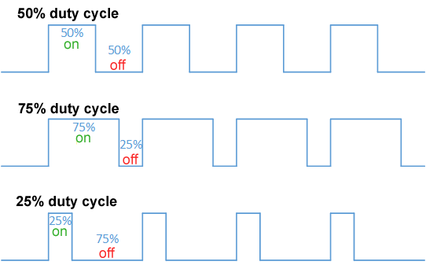

The duty cycle can be calculated as:

$$D = \frac{T_{on}}{T} * 100$$

where,

|||
|----|----|
| **D** | duty cycle (percentage)|
| $T_{on}$ | duration when signal is `on`|
| $T$ | total period|
||

Consider the periodic pulse wave, $f(t)$, with a low value, $y_\text{min}$, high value, $y_\text{max}$, and constant duty cycle, $D$, as shown below:


<br>

The **average** value of a wave is,

$$\bar{y} = \frac{1}{T}\int^T_0f(t)\,dt$$

Since $f(t)$ is a pulse wave, its value is,

|||
|-----|-----|
| $y_{max}$ | $0<t<D.T$|
| $y_{min}$ | $D.T<t<T$|

Now, we can expand the above expression as,

$$
\begin{align*}
  \bar{y} &= \frac{1}{T} \left(\int_0^{DT} y_\text{max}\,dt + \int_{DT}^T y_\text{min}\,dt\right)\\
          &= \frac{1}{T} \left(D \cdot T \cdot y_\text{max} + T\left(1 - D\right) y_\text{min}\right)\\
          &= D\cdot y_\text{max} + \left(1 - D\right) y_\text{min}
\end{align*}
$$

So we can now compute how long the signal should be at $y_{max}$ and how much at $y_{min}$.

### PWM Period

The period (or frequency, recall that $f=\frac{1}{T}$) is another important parameter that defines a PWM signal. It essentially determines _the number of times a signal repeats per second_. The choice of $T$ depends heavily on the application. For instance, when [controlling an LED](https://www.circuitbread.com/ee-faq/what-is-a-pwm-signal),

> the frequency of a PWM signal should be sufficiently high if we wish to see a proper dimming effect while controlling LEDs. A duty cycle of 20% at 1 Hz will be noticeable to the human eye that the LED is turning ON and OFF. However, if we increase the frequency to 100Hz, we’ll get to see the proper dimming of the LED.

### PWM Sampling Theorem

Is directly related to the [Nyquist-Shannon Sampling Theorem](https://autonomy-course.github.io/textbook/autonomy-textbook.html#adc-sampling-rate) discussed earlier. A simple summary,

> number of pulses in the waveform is equal to the number of Nyquist samples.

Recall that the Nyquist rate is, _a value equal to **twice** the highest frequency_. 


### Example | Servo Motor Control

Servos (also RC servos) are small, cheap, mass-produced servomotors or other actuators used for radio control and small-scale robotics. 


They're controlled by sending the servo a PWM (pulse-width modulation) signal, a series of repeating pulses of variable width where either the width of the pulse (most common modern hobby servos) or the duty cycle of a pulse train (less common today) determines the position to be achieved by the servo. 


### PWM Generation in Microcontrollers

We can use the built-in PWM components in many microcontrollers or timer ICs. Using Arduino, generating a PWM is as simple as writing out _a few lines of code_!

```
analogWrite(pin, value)
```

Note that **not all pins** of an Arduino can generate a PWM signal. In the case of Arduino Uno, there are only 6 I/O pins (3,5,6,9,10,11) that support PWM generation and they are marked with a tilde (~) in front of their pin number on the board.


<br>

Examples of various duty cycles:

```
analogWrite(PWM_PIN, 64);   // 25% Duty Cycle or 25% of max speed
analogWrite(PWM_PIN, 127);  // 50% Duty Cycle or 50% of max speed
analogWrite(PWM_PIN, 191);  // 75% Duty Cycle or 75% of max speed
analogWrite(PWM_PIN, 255);  // 100% Duty Cycle or full speed
```

<br>

The Raspberry Pi also has a variety of GPIO pins that can be used for generating PWM signals:


<br>

Consider this [code](https://circuitdigest.com/microcontroller-projects/raspberry-pi-pwm-tutorial) for controlling the brightness of an LED:

```python
import RPi.GPIO as IO       #calling header file which helps us use GPIO’s of PI
import time                 #calling time to provide delays in program
IO.setwarnings(False)       #do not show any warnings
IO.setmode (IO.BCM)         #we are programming the GPIO by BCM pin numbers. (PIN35 as ‘GPIO19’)
IO.setup(19,IO.OUT)         # initialize GPIO19 as an output.
p = IO.PWM(19,100)          #GPIO19 as PWM output, with 100Hz frequency
p.start(0)                  #generate PWM signal with 0% duty cycle
while 1:                    #execute loop forever
    for x in range (50):    #execute loop for 50 times, x being incremented from 0 to 49.
        p.ChangeDutyCycle(x) #change duty cycle for varying the brightness of LED.
        time.sleep(0.1)      #sleep for 100m second
    for x in range (50):     #execute loop for 50 times, x being incremented from 0 to 49.
        p.ChangeDutyCycle(50-x)  #change duty cycle for changing the brightness of LED.
        time.sleep(0.1)          #sleep for 100m second
```


**References**:

Additional reading/examples/etc. if you want to learn more about PWMs, programming, _etc._:

1. [What is a PWM Signal?](https://www.circuitbread.com/ee-faq/what-is-a-pwm-signal)
2. [Servo Motors programing](https://www.circuitbread.com/tutorials/servo-motor-indirect-addressing-and-electronic-lock---part-10-microcontroller-basics-pic10f200)
3. [What is a DAC and why do you need on anyways?](https://www.whathifi.com/advice/dacs-what-is-a-dac-and-do-you-need-one)
4. [An Engineer's Primer on Actuators](https://pdhonline.com/courses/m543/m543content.pdf)
5. [What is a Linear Actuator?](https://www.youtube.com/watch?v=izeXcf5qu6s) [YouTube Video]
6. [Understanding the Basics of PWM](https://control.com/technical-articles/understanding-the-basicsof-pulse-width-modulation-pwm/)
7. [Raspberry Pi: PWM Outputs with Python (Fading LED)](https://randomnerdtutorials.com/raspberry-pi-pwm-python/)
8. [Raspberry Pi PWM tutorial](https://circuitdigest.com/microcontroller-projects/raspberry-pi-pwm-tutorial)
9. [Actuation and Avionics](https://www.collinsaerospace.com/what-we-do/industries/business-aviation/power-controls-actuation/actuation)<!--rel="stylesheet" href="./custom.sibin.css"-->

# State Estimation

Consider a robot in a simple grid starting at $(0,0)$ with the intention of moving to $(2,2)$:


Now the robot can take multiple paths to get to its destination. The robot has multiple choices as shown in the following figure:


Let's assume that it follows one of these paths and ends up at the following position:


Clearly this is not the intended goal so a few things need to happen:

1. first of all, the robot has to understand and estimate where it is _right now_ &rarr; _i.e.,_ **estimate its current state**
2. the robot has to then make a decision, based on its current state, where to head next 

How to do this?

Answer: **[state estimation](#state-estimation)**!

But before we go there, we have to answer the following question &rarr; _how did we end up here in spite of onboard sensors?_

The sensor gave us a value, $x_k$ &rarr; we can't seem to trust it as is &rarr; because sensors are imperfect, mainly due to:

- physical limitations, measurement noise, poor calibrations, etc.
- errors can’t be zero
    - $error = observation\ –\ true\_value$

In some sense, we need to "filter" out noisy data and only allow correct data to guide us. Hence, our robot can pick the right direction to end up at its _correct_ destination. 


## State Estimation

State estimation is a fundamental problem in control theory, robotics and signal processing. It involves **determining the state of a dynamic system from noisy or incomplete measurements**. The Kalman filter, developed by Rudolf E. Kálmán in the early 1960s, is one of the most widely used and powerful algorithms for state estimation.

In the context of dynamic systems, "**state**" is defined as,

> a set of variables that completely describe the system at a given time. 

For example:

| **system** | **state variables** |
|------------|----------------------|
| **moving vehicle** | position, velocity, acceleration |
| **pendulum** | angle, angular velocity |
| **financial system** | asset prices, market indicators |
||

State **evolves over time** according to the system dynamics, which can be described by a **state transition model**.


### How to Estimate State?

Let's look at some data:


<br>

How we take these values ($x_k$) and generate a state _estimate_, $\overline{x_k}$?

What if we have a few more values?


<br>

Do we see a trend? What if we had many more values?


<br>

What's the best way to capture the behavior? We can see that it is "noisy" in that it doesn't follow an "exact" trend. 

Remember that $\overline{x_k}$ is the estimate we want:


One way to compute $\overline{x_k}$ would be as an **average** of a **running window of samples**. Why "window" and not all the samples? Well we may only care about the most recent `n` values -- anything older and it may not be directly applicable to our current situation.

We can compute the average as follows:

$$
\overline{x_{k}}=\frac{x_{k-n-1}+\cdots+x_{k-1}+x_{k}}{n}
$$

where the only parameter is the window size, $n$.

Consider the following data:

| $k$ | $x_k$ | $\overline{x_{k}}$ |
| --- | --- | --- |
| 0 | 0.08187 | 0.08187 |
| 1 | 0.97601 | 0.52894 |
| 2 | 1.18350 | 0.74713 |

Using the running window average method (for window size $n=3$), we get:


<br>

As we add more values, we see that the window moves as well, aggregating groups of values:

| $k$ | $x_k$ | $\overline{x_{k}}$ |
| --- | --- | --- |
| 0 | 0.08187 | 0.08187 |
| 1 | 0.97601 | 0.52894 |
| 2 | 1.18350 | 0.74713 |
| 3 | 0.99502 | 1.05151 |


<br>

| $k$ | $x_k$ | $\overline{x_{k}}$ |
| --- | --- | --- |
| 0 | 0.08187 | 0.08187 |
| 1 | 0.97601 | 0.52894 |
| 2 | 1.18350 | 0.74713 |
| 3 | 0.99502 | 1.05151 |
| 4 | -0.31375 | 0.62159 |
| 5 | -0.25739 | 0.14129 |
| 6 | 1.52112 | 0.31666 |


<br>

We can see that the estimate is trying to match the changes in the original sensor readings. 


finally, we get:

| $k$ | $x_k$ | $\overline{x_{k}}$ |
| --- | --- | --- |
| 0 | 0.08187 | 0.08187 |
| 1 | 0.97601 | 0.52894 |
| 2 | 1.18350 | 0.74713 |
| 3 | 0.99502 | 1.05151 |
| 4 | -0.31375 | 0.62159 |
| 5 | -0.25739 | 0.14129 |
| 6 | 1.52112 | 0.31666 |
| 7 | 1.75454 | 1.00609 |
| 8 | 1.82412 | 1.69993 |
| 9 | 1.89229 | 1.82365 |
| 10 | 1.10513 | 1.60718 |
| 11 | 1.22321 | 1.40688 |
| 12 | 2.20793 | 1.51209 |
| 13 | 3.02390 | 2.15168 |
| 14 | 2.45511 | 2.56231 |
| 15 | 2.07442 | 2.51781 |
| 16 | 1.49280 | 2.00744 |
| 17 | 1.19093 | 1.58605 |
| 18 | 2.32653 | 1.67009 |
| 19 | 3.84177 | 2.45308 |


<br>


This is a good start, but let's consider a few changes.

First: what happens if window size *increases**? 

We consider $n=4$ or $n=9$ even.


<br>

But first, let's discuss some properties that correlate with _larger_ window size:

|property | effect (larger $n$) |
|---------|--------|
| smoothening | more/less?|
| sensitivity (to changes) | more/less? |
||

These properties can significantly affect the **response** for the system &rarr; whether it is jerky or sudden vs. a better, albeit slower, response. Also, the sensitivity tells us that the system doesn't respond easily to big changes in output, thus increasing inertia!


Let's look at a few examples:


<br>

What about **delays**? Does the window size affect how delayed the estimate is?


<br>

As we see, this is the case! With increased window sizes &rarr; delays increase.

**Questions**: Why does this happen?

|property | effect (larger $n$) |
|---------|--------|
| smoothening | **more**|
| sensitivity (to changes) | **less**|
| delays | **more**|
||


### Exponential Moving Average (EMA)

To give more weights to _recent_ data, prevent delays and get a better control over the smoothing, we use EMA that usese **exponentially decreasing weights over time**,

$$
\begin{aligned}
& \overline{x_{0}}=x_{0} \\
& \overline{x_{k}}=\alpha x_{k}+(1-\alpha) \overline{x_{k-1}}, k>0
\end{aligned}
$$

where, $\alpha$ ($0 < \alpha < 1$) &rarr; **smoothing factor**.

Example ($\alpha = 0.75$):

| $k$ | $x_{k}$ | $\overline{x_{k}}$ |
| :---: | :---: | :---: |
| 0 | 2.0 | 2.0000 |
| 1 | 3.0 | 2.7000 |
| 2 | 2.0 | 2.2100 |
| 3 | 4.0 | 3.4630 |
| 4 | 3.0 | 3.1389 |
||

One of the main advantages of EMA is that we **only need to store one value**, $\overline{x_{k}}$. 

But why "exponential"? If we expand the term for $\overline{x_{k}}$ we see,

$$
\begin{array}{rlrl}
\overline{x_{k}} & =\alpha x_{k}+(1-\alpha) \overline{x_{k-1}}\\
& =\alpha x_{k}+\alpha(1-\alpha) x_{k-1}+(1-\alpha)^{2} \overline{x_{k-2}} \\
& =\alpha x_{k}+\alpha(1-\alpha) x_{k-1}+\alpha(1-\alpha)^{2} x_{k-2}+(1-\alpha)^{3} \overline{x_{k-3}} & \vdots \\
& =\cdots & \\
& =\alpha\left[x_{k}+(1-\alpha) x_{k-1}+(1-\alpha)^{2} x_{k-2}+(1-\alpha)^{3} x_{k-3}+\cdots+(1-\alpha)^{k-1} x_{1}\right]+(1-\alpha)^{k} x_{0}
\end{array}
$$

As we see, the effect of the smoothing factor, $\alpha$, is applied exponentially with each sensor reading. For various values of $\alpha$,

$$
\begin{array}{c}
\alpha=0.3000 \\
\alpha(1-\alpha)=0.2100 \\
\alpha(1-\alpha)^{2}=0.1470 \\
 \alpha(1-\alpha)^{3}=0.1029 \\
\vdots \\
\end{array}
$$

EMA takes into acount **all past data** and encodes it into a **single** value, $\overline{x_{k}}$. 

Consider the following example where $\alpha=0.5$:


| ${ }_{k}$ | $\chi_{k}$ | $\overline{\chi_{k}}$ |
| ---: | :--- | :--- |
| 0 | 0.08187 | 0.08187 |
| 1 | 0.97601 | 0.52894 |
| 2 | 1.18350 | 0.85622 |
| 3 | 0.99502 | 0.92562 |
| 4 | -0.31375 | 0.30594 |
| 5 | -0.25739 | 0.02427 |
| 6 | 1.52112 | 0.77269 |
| 7 | 1.75454 | 1.26362 |
| 8 | 1.82412 | 1.54387 |
| 9 | 1.89229 | 1.71808 |
| 10 | 1.10513 | 1.41161 |
| 11 | 1.22321 | 1.31741 |
| 12 | 2.20793 | 1.76267 |
| 13 | 3.02390 | 2.39328 |
| 14 | 2.45511 | 2.42420 |
| 15 | 2.07442 | 2.24931 |
| 16 | 1.49280 | 1.87105 |
| 17 | 1.19093 | 1.53099 |
| 18 | 2.32653 | 1.92876 |
| 19 | 3.84177 | 2.88526 |
||

The graph looks like:


<br>

Let's consider some of the values:

| ${ }_{k}$ | $\chi_{k}$ | $\overline{\chi_{k}}$ |
| ---: | :--- | :--- |
| 0 | 0.08187 | 0.08187 |
| 1 | 0.97601 | 0.52894 |
| 2 | 1.18350 | 0.85622 |
| 3 | 0.99502 | **0.92562** |
| 4 | **-0.31375** | **0.30594** |
| 5 | -0.25739 | 0.02427 |
| 6 | 1.52112 | 0.77269 |
|...|...|...|

$\overline{x_{4}}=0.5 x_{4}+0.5 \overline{x_{3}}$

We see that for this value of $\alpha$, the estimate is "halfway" between the two sensor readings,


<br>

Now, if we change $\alpha=0.7$, we get $\overline{x_{4}}=0.7 x_{4}+0.3 \overline{x_{3}}$ and the graph now looks like,


<br>

As we see, there's a **heavier bias** towards the **more recent value**.

Now, of these graphs, which one is $\alpha=0.05$ and which one is $\alpha=0.95$?


<br>

We can see the significance of changing $\alpha$,


<br>

As we see from the following figures, increasing $\alpha$ (left to right) results in:

- **less delay**
- **less smoothening out**


<br>


### State Space Representation

A more "formal" description of **state**:

> a **quantitative** characterization of a system that is **not directly observable**

Examples: temperature, position, velocity, weight, etc.

There are _many_ ways to represent state, even for the same quantity. For instance, consider how to estimate the position of a car in a 2D plane, with the intent of **tracking** it:


<br>

So, how do we represent the "state" of this car?

1. $\boldsymbol{x}_{\boldsymbol{k}}=(x, y)$

A simple position on the coordinate system. Is this sufficient? 

While this captures a **static** state of the system, it doesn't necessarily allow for tracking the car. 

2.  $\boldsymbol{x}_{\boldsymbol{k}}=(x, \dot{x}, y, \dot{y})$

So, let's also track the **velocity**. Clearly that will tell us how fast the car is moving and so we can "track" it correctly?

Well, not quite. This is **instantaneous velocity** that doesn't tell us if the car is accelerating or deccelerating!

3. $\boldsymbol{x}_{\boldsymbol{k}}=(x, \dot{x}, \ddot{x}, y, \dot{y}, \ddot{y})$

Ok, so now we have position, velocity **and** acceleration! Surely, we're done?

But do we know which **direction** the car is heading in?

4. $\boldsymbol{x}_{\boldsymbol{k}}=(x, \dot{x}, \ddot{x}, y, \dot{y}, \ddot{y}, \theta)$

Now, we have a better sense of the "state" of the car, in order to track it.

**State estimation** &rarr; estimating state from sensor measurements.

While the moving averages and EMA are good ways to deal with noisy measurements, estimating state is much harder. There is often **uncertainty** in the measurements and state estimation. 

### Probabilistic State Estimation

These methods allow us to deal with the uncertanties in sensor measurements as well as in state estimation by use of probility. The main idea &rarr; represent state in a **probability distribution**
    
- Measurements are noisy
- Models ‘uncertainty’

We start with the following _"belief"_ &rarr; knowledge about the state or 'estimate of the true state’

A Probabilistic state estimation, then &rarr; computes **new belief based on measurement data**


There are various methods for **probabilistic state estimations**, most notably,

1. [Bayes filter](#bayes-filter)
2. [Kalman filter](#kalman-filter)
3. [Extended Kalman Filter]()


####  Review of Probability Theory

Let's take a quick detour to review some concepts in probability theory.

**Random variable**, $X$

- A variable whose possible values are numerical outcomes of a random phenomenon
    - A function X: $\Omega \rightarrow \mathbb{R}$, where $\Omega$ is the set of possible outcomes
    - Example: rolling a dice, $\Omega=\{1,2,3,4,5,6\}$
- It models state, measurement, controls, environments, etc.


- **Discrete random variable** &rarr; X can take on a countable number of values
- **Continuous** random variable &rarr; X can take on an infinite number of values


**Probability distribution**, $p(x)$

- Links each outcome with probability

Probability distribution: $p(\cdot)$
Probability: $\operatorname{Pr}(\cdot)$

Two way do represent probability distributions:

|probability mass function (PMF) | probability density function (PDF)|
|--------------------------------|-----------------------------------|
| | |

- **Joint distribution**
    - $p(x, y)=p(X=x$ and $Y=y)$
- If X and Y are **independent**
    - $p(x, y)=p(x) p(y)$

<br>

**Conditional distribution**

- $p(x \mid y)$ : probability of $x$ given $y$
- If $p(y)>0$,
    - $p(x \mid y)=\frac{p(x, y)}{p(y)}$
    - $p(x, y)=p(x \mid y) p(y)$
- If X and Y are independent, $p(x \mid y)=$ ?, $p(y \mid x)=$ ?
    - i.e., X (resp. Y ) tells nothing about Y (resp. X )


Consider the example of rolling two dice ( $\mathrm{X}, \mathrm{Y}$ )

| $(1,1)$ | $(1,2)$ | $(1,3)$ | $(1,4)$ | $(1,5)$ | $(1,6)$ |
| :---: | :---: | :---: | :---: | :---: | :---: |
| $(2,1)$ | $(2,2)$ | $(2,3)$ | $(2,4)$ | $(2,5)$ | $(2,6)$ |
| $(3,1)$ | $(3,2)$ | $(3,3)$ | $(3,4)$ | $(3,5)$ | $(3,6)$ |
| $(4,1)$ | $(4,2)$ | $(4,3)$ | $(4,4)$ | $(4,5)$ | $(4,6)$ |
| $(5,1)$ | $(5,2)$ | $(5,3)$ | $(5,4)$ | $(5,5)$ | $(5,6)$ |
| $(6,1)$ | $(6,2)$ | $(6,3)$ | $(6,4)$ | $(6,5)$ | $(6,6)$ |

<br>

What is $Pr(𝑋=2 | 𝑋 + 𝑌 \le 5)$?

| |  |  |  |  |  |  |  |
| :---: | :---: | :---: | :---: | :---: | :---: | :---: | :---: |
|  | 1 | 2 | 3 | 4 | 5 | 6 |  |
| 1 | 2 | 3 | 4 | 5 | 6 | 7 |  |
| 2 | 3 | 4 | 5 | 6 | 7 | 8 |  |
| 3 | 4 | 5 | 6 | 7 | 8 | 9 |  |
| 4 | 5 | 6 | 7 | 8 | 9 | 10 |  |
| 5 | 6 | 7 | 8 | 9 | 10 | 11 |  |
| 6 | 7 | 8 | 9 | 10 | 11 | 12 |  |

**Theorem of total probability**

$$
\begin{array}{ll}
\underline{\text { Discrete }} & p(x)=\sum_{y} p(x, y)=\sum_{y} p(x \mid y) p(y) \\
\underline{\text { Continuous }} & p(x)=\int p(x, y) d y=\int p(x \mid y) p(y) d y
\end{array}
$$

Consider the following problem:


<br>

Let's look at the row where "eye color" is `brown`:


<br>

Filling in the right values:


<br>


**Conditional independence**

- $x$ and $y$ are independent if $z$ is known

$$
\begin{aligned}
& p(x, y \mid z)=p(x \mid z) p(y \mid z) \\
& p(x \mid z)=p(x \mid y, z) \\
& p(y \mid z)=p(y \mid x, z)
\end{aligned}
$$

- Conditional (resp. absolute) independence does not imply absolute (resp. conditional) independence

<br>

**Bayes Rule**:

| | |
|----------|------------|
|discrete | $p(x \mid y)=\frac{p(y \mid x) p(x)}{p(y)}=\frac{p(y \mid x) p(x)}{\sum_{x \prime} p\left(y \mid x^{\prime}\right) p\left(x^{\prime}\right)}$ | 
|continuous | $\quad p(x \mid y)=\frac{p(y \mid x) p(x)}{p(y)}=\frac{p(y \mid x) p(x)}{\int p\left(y \mid x^{\prime}\right) p\left(x^{\prime}\right) d x^{\prime}}$|
||


**Prior and posterior probabilities**

$$
\text p(x \mid y)=\frac{p(y \mid x) p(x)}{p(y)}
$$

where,

- $p(x \mid y)$ &rarr; posterior
- $p(x)$ &rarr; prior

Hence,

- Inferring $x$ from $y$
    - $x$ : state, $y$ : data (measurement)
- Bayes rule helps compute a posterior using the inverse, $p(y \mid x)$, and prior, $p(x)$
    - The probability of an event ( $x=$ state) given information ( $y=$ measurement)
    - Easier to obtain $p(y \mid x)$
        - E.g., sensor accuracy: $p$ (thermometer reading $=72$ | temperature $=71$ )?
    - Example
        - $x$ : has disease, $y$ : test is positive
        - x: position, y: sensor reading

<br>

**Conditioning Bayes rule on an arbitrary random variable**

$$
p(x \mid y, z)=\frac{p(y \mid x, z) p(x \mid z)}{p(y \mid z)}
$$

<br>

**Expectation of a random variable**, $\mathrm{E}[X]$ (or $\mu$, mean)

$$
\begin{array}{ll}
\underline{\text { Discrete }} & \mathrm{E}[X]=\sum_{x} x p(x) \\
\underline{\text { Continuous }} & \mathrm{E}[X]=\int x p(x) d x
\end{array}
$$

|  | $X=0$ | $X=1$ | $X=2$ | $X=3$ |
| :---: | :---: | :---: | :---: | :---: |
| $p(x)$ | 0.10 | 0.20 | 0.60 | 0.10 |
||

<br>

$\mathrm{E}[X]=\sum_{x} x p(x)=0 \cdot 0.10+1 \cdot 0.20+2 \cdot 0.60+3 \cdot 0.10=1.70$

<bR>

**Variance**, $\operatorname{Var}(X)$ or $\sigma^{2}$

- How far values are spread out from the mean
- It can represent uncertainty or noise

$$
\begin{aligned}
\operatorname{Var}[X]=\mathrm{E}\left[(X-\mu)^{2}\right] & =\sum_{x}(x-\mu)^{2} p(x) & & \text { Discrete } \\
& =\int(x-\mu)^{2} p(x) d x & & \text { Continuous }
\end{aligned}
$$

where,

- $\sigma^{2}$ : variance
- $\sigma$ : standard deviation

<br>

**Covariance**, $\operatorname{Cov}(X, Y)$ or $\sigma_{X Y}^{2}$

- Joint variability of $X$ and $Y$

$$
\begin{array}{ll}
\operatorname{Cov}(X, Y)=\mathrm{E}[(X-\mathrm{E}[X])(Y-\mathrm{E}[Y])]=\mathrm{E}[\mathrm{XY}]-\mathrm{E}[\mathrm{X}] \mathrm{E}[Y] & \\
\operatorname{Cov}(X, Y)=\operatorname{Cov}(Y, X) & 
\end{array}
$$

If $X$ and $Y$ are **independent**, $\operatorname{Cov}(X, Y)=0$

## Bayes Filter

Recall that sensors capture **incomplete** or **noisy** information. Consider the example of two LiDAR sensors that are trying to estimate the distance to a pedestrian. One of the LiDAR sensors, measure the distance to be at $10 m$ (with a probability of $50 \%$) while the other estimates the person to be at $10.8 m$ (also with a probability of $50\%$). 


In reality, as we see in the picture, the person is **between $10.3 m$ and $10.5 m$**. So, how do we deal with such situations? And what happens if the probabilities differ greatly? **Which** sensor would you trust and **how much**?

### Bayes filter | **Prediction**

Let's revisit our previous example of a car:


<br>

Let say the car is in $state_k$ at a certain point in time and we want to make a prediction for its future state, $state_{k+1}$,


<br>

To simplify matters, assume:

- assume car moving along *one* axis, _e.g.,_ x-axis
- follow **discrete** position: $0,1,2, .., 9$
- this is a "circular" track: a $+1$ move from $9 \rightarrow 0$

So, we essentially have,

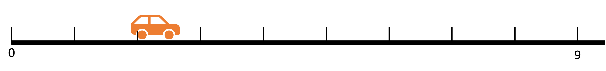

<br>

Now, the car starts moving. Let's assume the existence of **another sensor** that tells us about the car's movement, _i.e.,_

| sensor output | meaning |
|---------------|---------|
| `0` | **stay** |
| `+1`, `+2`, ... | move forward by that amount |
||

We also assume this sensor is **always correct** (for now). 

Based on the location of the car, we can plot our (current) "belief" as:


Now, let the car move forward, say by `1` step. 


How does this update the belief?


This is a simple case where the car has _obviously_ moved forward by `1` step and we can verify it. so the belief is updated accordingly.

Now, let's assume that the motion sensor is more realistic and has **noise** with the following probabilities:

| probability | meaning |
|-------------|-------------|
| $80 \%$         | correct reading |
| $10 \%$         | overestimate |
| $10 \%$         | underestimate |
||


If  the sensor says the **number** of moves is `+3`,

- Car is $80 \%$ likely to have moved &rarr; `+3`
- Car is $10 \%$ likely to have moved &rarr; `+2`
- Car is $10 \%$ likely to have moved &rarr; `+4`

Let's look at our belief as a result of this update:


The **updated belief** looks like:


The question is: &rarr; **how**?

$$
\begin{aligned}
& \operatorname{Pr}\left(x_{1}=5\right)= \\
& \operatorname{Pr}\left(x_{0}=1\right) \operatorname{Pr}(\text { under })+ \\
& \operatorname{Pr}\left(x_{0}=2\right) \operatorname{Pr}(\text { correct }) \\
& =0.5 \times 0.1+0.5 \times 0.8=0.45
\end{aligned}
$$

This comes from the **[law of total probability](#review-of-probability-theory)**:

$$p\left(x_{k}\right)=\sum_{i} p\left(x_{k} \mid x_{k-1}=i\right) p\left(x_{k-1}=i\right)$$

So, after `3` moves, the **predicted** probability estimate is:


<br>

Let's keep going on...


<br>

Now, what happens after &rarr; **`20` predictions** ?


<br>

Wait, what is happening? Why did the probabilities collapse into a lower spread?

Well, **sensors are imperfect**! Hence, **information is lost**. As a result, we may end up with the sitauation where the actual state **differs** from the predicted state.


<br>

### Bayes filter | **Measurement Update**

We use a **measurement** to "fix" the problem of divergence between the actual state and predicted state. So, in essence, we get some **feedback** from the real world &rarr; using **sensors** (same or different type). [Sounds familiar](#control-theory)? 


<br>

**Prior**: probability prior to incorporating measurement &rarr; **equally likely** to be in any position, _i.e.,_ $\frac{1}{10}$ for every position. Let's put aside prediction, for now.


<br>

Let the **first** sensor reading &rarr; $z_0 = 2$. But the sensor is **noisy**. Let's also assume it has a probability of $90 \%$.

> Note: in the "predict" stage, we were using "noisy" sensors as well, but those were measuring **different** quantities. In that case, the sensor could be from the car engine or the wheels (or odometers) that say how much we "**intended**" to move, _e.g., "we generated enough torque in the engine to move forward by `3` slots.
> <br>
> In contrast, the sensors in this section **measure** &rarr; "how much was **actually** moved?". This could be via other types of sensors, _e.g.,_ GPS.
> <br>
> **Both** of these sensors can, and will, of course have noise and probabilities associated with them. The question then, is &rarr; "how to **reconcile** the two?"

So now, what is the **new belief**? From this setup, intuitively, it seems &rarr; $x_{0}=2 \text { is } 9 \text { times likely than } x_{0} \neq 2$.

Time to use **[Bayes Rule](#review-of-probability-theory)**:


<br>

where,  $p\left(z_{k}\right)=\sum_{x_{i}} p\left(z_{k} \mid x_{i}\right) p\left(x_{i}\right)$ (as we've seen before, from the law of total probability). 

So now, we get the **likelihood**, $p\left(z_{k} \mid x_{k}\right)$,


<br>

**Question**: what if the probability was $80 \%$?

Carrying on, the numerator on the right hand side, _i.e.,_ $p\left(z_{k} \mid x_{k}\right) \times p\left(x_{k}\right)$:


<br>

The result of which is:


<br>

which puts our car at the **right spot**:


<br>

We're still not done. We have to compute the denominator, $p\left(z_{k}\right)=\sum_{x_{i}} p\left(z_{k} \mid x_{i}\right) p\left(x_{i}\right)$, which essentially **normalizes** the belief:


<br>

So our final value, the new belief, aka **posterior**, $p\left(x_{k} \mid z_{k}\right)$ &rarr; probability **after incorporating measurement**.

Let's look at the **formal calculations** for each:

If we want to calculate, 

$$
p\left(x_{0}=2 \mid z_{0}=2\right)=\square
$$

Recall, 

$$
\begin{aligned}
& p\left(z_{k}=a \mid x_{k}=a\right)=90 \% \\
& p\left(z_{k}=a \mid x_{k}=b\right)=10 \%
\end{aligned}
$$

_i.e.,_ sensor is correct with probability of $90\%$ &rarr; the belief that the measurement $z_k = a$ matches reality $x_k = a$ is $90 \%$ otherwise it is $10 \%$. For instance,

|measurement ($z_k$) | reality ($x_k$) | belief (prob %) |
|------------|------------|--------|
| $z_k = 2$ | $x_k = 2$ | $90 \%$|
| $z_k = 2$ | $x_k = 5$ | $10 \%$|
||

<br>

$$
p\left(x_{0}=2 \mid z_{0}=2\right)=\frac{p\left(z_{0}=2 \mid x_{0}=2\right) \times p\left(x_{0}=2\right)}{p\left(z_{0}=2\right)}=\frac{\textbf{0.9} \times 0.1}{p\left(z_{0}=2\right)}=\frac{0.09}{p\left(z_{0}=2\right)}
$$

<br>

In the same vein,

$$
p\left(x_{0}=1 \mid z_{0}=2\right)=\frac{p\left(z_{0}=2 \mid x_{0}=1\right) \times p\left(x_{0}=1\right)}{p\left(z_{0}=2\right)}=\frac{\textbf{0.1} \times 0.1}{p\left(z_{0}=2\right)}=\frac{0.01}{p\left(z_{0}=2\right)}
$$

<br>

Use this formula, we can find $p\left(x_{0}=x \mid z_{0}=2\right)$ &rarr; for all `x`.

But we still need to compute &rarr; $p\left(z_{0}=2\right)$.

Recalling the law of total probability, so we can compute:

$$
p\left(z_{0}=2\right)=\sum_{x} p\left(z_{0}=2 \mid x_{0}=x\right) p\left(x_{0}=x\right)
$$


From the above table,

$$
\begin{aligned}
& p\left(z_{k}=a \mid x_{k}=a\right)=90 \% \\
& p\left(z_{k}=a \mid x_{k}=b\right)=10 \%
\end{aligned}
$$

Plugging in the values,

$$
\begin{aligned}
p\left(z_{0}=2\right) & =\sum_{x} p\left(z_{0}=2 \mid x_{0}=x\right) p\left(x_{0}=x\right) \\
& =0.09+9 \times 0.01=\textbf{0.18}
\end{aligned}
$$

Hence, the final, **normalized** probability distribution looks like:


<br>

Now, the sensor gives again $z_{1}=2$ &rarr; same likelihood ($90\%$ correct), _i.e.,_

$$
p\left(x_{1} \mid z_{1}=2\right)
$$

Then, what's our new belief (using the previous belief as the **prior**), $\operatorname{Pr}\left(x_{1}=2 \mid z_{1}\right)=90.00 \%$?

For the next iteration, we get:

$$
\operatorname{Pr}\left(x_{2}=2 \mid z_{2}\right)=\textbf{98.78} \%
$$


<br>

We can keep calculating this for various values of `k`:


<br>

What is happening here? Why is only one bar increasing? Nothing ele changes?

**Answer**: the car is stationary at location `2`!


<br>


If we **drop the sensor accuracy** to say, $60 \%$, we see:


<br>

The confidence in the measurement increases, albeit at a much slower rate.

Now, if we drop it further, to say, $50 \%$,


<br>

Why is nothing changing? Because the sensor is **not providing any additional information**! The $50 \%$ rate keeps it at the same belief level as everything else. 


### Bayes filter | **Combining** Prediction and Measurement

- prediction **loses** information
- measurement **improves** knowledge (i.e., decreases uncertainty)

Let's **combine** prediction and measurement!

We start with the same initial position and sensor accuracies:

- initial position = `2`
- motion model:

| sensor output | meaning | accuracy |
|---------------|---------|----------|
| `0` | **stay** | $10 \%$ |
| `+1` | move forward by `1`| $80 \%$ |
| `+2` | move forward by `2` | $10 \%$ |
||

This **motion model** can be represented as:

$$
p\left(x_{k} \mid x_{k-1}=i\right)
$$

<br>

_i.e.,_ what is the probability of $x_k$, given $x_{k-1} = i$, represented visually as,


<br>

And given the **posterior** at time $k-1$, _i.e.,_

$$
p\left(x_{k-1}=i \mid z_{k-1}\right)
$$

The **combined** model, _i.e.,_ the **new prior**, is:

$$
p\left(x_{k}\right)=\sum_{i} p\left(x_{k} \mid x_{k-1}=i\right) p\left(x_{k-1}=i \mid z_{k-1}\right)
$$

Let's start with the **initial belief**, _viz.,_


<br>

At time, $t=0$, the predictions and updates:


<br>

Note that the end result is the **new posterior** &rarr; that we will use in the future cycles as, 

$$p\left(x_{k}\right)=\sum_{i} p\left(x_{k} \mid x_{k-1}=i\right) p\left(x_{k-1}=i \mid z_{k-1}\right)
$$. 

Hence we see:


<br>

The confidence in the prediction and belief in the system both increase, as we see in the next cycle:


<br>

**Note:** when the measurement matches the prediction, the uncertainty decreases. 

Now what happens if &rarr; the car **did not move**? We see:


<br>

The true position remains same (`5`), but the prediction is still based on the original motion model:

| sensor output | meaning | accuracy |
|---------------|---------|----------|
| `0` | **stay** | $10 \%$ |
| `+1` | move forward by `1`| $80 \%$ |
| `+2` | move forward by `2` | $10 \%$ |
||

The **uncertainty increases**! But still the estimate $\approx$ true state.

We keep going...


<br>

Let's see what happens if we don't follow the motion model, _i.e.,_ the car **moved by `2`** (instead of `1`):


<br>

The **true position** &rarr; `8` but the prediction is still based on the original motion model hence, the confidence drops.

Getting back to the original motion model, one last time,


<br>

We get back to the high confidence levels, **really quickly**!

To **summarize**, the steps in the Bayes Filter are:


<br>

1. **predict**: 
    - calculate the prior, $p\left(x_{k}\right)$, from the previous posterior, $p\left(x_{k-1} \mid z_{k-1}\right)$ 
    - by incorporating the motion (process) model, 
    
$$
p\left(x_{k}\right)=\sum_{i} p\left(x_{k} \mid x_{k-1}=i\right) p\left(x_{k-1}=i \mid z_{k-1}\right)
$$

2. **update**: 
    - given a measurement, $z_{k}$, compute the likelihood
    - from the likelihood and prior, apply Bayes Rule to update the belief:

$$
p\left(x_{k} \mid z_{k}\right)=\frac{p\left(z_{k} \mid x_{k}\right) \times p\left(x_{k}\right)}{p\left(z_{k}\right)}
$$

where, $p\left(z_{k}\right)=\sum_{x} p\left(z_{k} \mid x\right) p(x)$.


**Limitations**:

While the Bayesian filter works for many instances, the main problem is that it is **discrete** in nature. Consider the example for robots that need a $1 cm$ resolution in a $100m$ space &rarr; $10,000$ positions needed to model the environment!

**Scaling** is much harder, especially in the multidimensional systems. For instance, how do we model the original state of the car that we discussed earlier:

$$
\boldsymbol{x}_{\boldsymbol{k}}=(x, \dot{x}, \ddot{x}, y, \dot{y}, \ddot{y}, \theta)
$$

We need to **update** the Bayes model itself to handle such situations. 

Enter the **[Kalman Filter](#kalman-filter)**.

## Kalman Filter

To deal with some of the issues with the basic Bayes filter, we introduce the **Kalman Filter** that express state and uncertainty using **Gaussians** (aka the "[normal](https://en.wikipedia.org/wiki/Normal_distribution)" distribution).


<br>

### Gaussian Distribution

Now a quick detour on Gaussians. A normal distribution or Gaussian distribution is a type of **continuous probability distribution** for a **real-valued random variable** and is represented as:


<!--
$$
\mathcal{N}\left(\mu, \sigma^{2}\right)=\frac{1}{\sqrt{2 \pi \sigma^{2}}} e^{-\frac{(x-\mu)^{2}}{2 \sigma^{2}}} 
$$
-->

<br>

A very common Gaussian can be visualized as:


<br>


Note that **variance** ($\sigma^2$) captures the **uncertainty** in the system and is the **square** of the standard deviation ($\sigma$).


<br>

More specific examples:


<br>

Some properties of Gaussians:

1. **area** under the curve = `1` (since it is the sum of all the probabilities)

$$
area = \int_{-\infty}^{+\infty} \mathcal{N}\left(\mu, \sigma^{2}\right)
$$

Note that the curve approaches **infinity** ($\infty$) on **either side** &rarr; the probability of certain events is **never `0`**, no matter how small.

Hence, 

$$
area = \int_{-\infty}^{+\infty} \frac{1}{\sqrt{2 \pi \sigma^{2}}} e^{-\frac{(x-\mu)^{2}}{2 \sigma^{2}}} = \textbf{1}
$$

2. probability that a value, $x$ &rarr; is in a **range**, $(a,b)$:

$$
\operatorname{Pr}(a \leq x \leq b)=\int_{a}^{b} \frac{1}{\sqrt{2 \pi \sigma^{2}}} e^{-\frac{(x-\mu)^{2}}{2 \sigma^{2}}} d x
$$

3. since it is often useful to find the probability **within one standard deviation** (on either side), 

$$
\operatorname{Pr}(\mu-\sigma \leq x \leq \mu+\sigma)=\int_{\mu-\sigma}^{\mu+\sigma} \frac{1}{\sqrt{2 \pi \sigma^{2}}} e^{-\frac{(x-\mu)^{2}}{2 \sigma^{2}}} d x \approx \textbf{68 \%}
$$

4. **sum** and **product** of two Gaussian distributions is fairly easy to calculate

Given, two Gaussians,

$X_{1} \sim \mathcal{N}\left(\mu_{1}, \sigma_{1}^{2}\right)$

$X_{2} \sim \mathcal{N}\left(\mu_{2}, \sigma_{2}^{2}\right)
$

|result| sum | product|
|------|-----|--------|
| **new** Gaussian, $Z \sim \mathcal{N}\left(\mu, \sigma^{2}\right)$ | $Z=X_{1}+X_{2}$ | $Z=X_{1} X_{2}$ |
| new **mean**, $\mu$ | $\mu_{1}+\mu_{2}$ | $\mu=\frac{\sigma_{2}^{2} \mu_{1}+\sigma_{1}^{2} \mu_{2}}{\sigma_{1}^{2}+\sigma_{2}^{2}}$ |
| new **variance**, $\sigma^{2}$ | $\sigma_{1}^{2}+\sigma_{2}^{2}$ | $\sigma^{2}=\frac{\sigma_{1}^{2} \sigma_{2}^{2}}{\sigma_{1}^{2}+\sigma_{2}^{2}}$ |
||

5. **closure** under **linear transformations**

From [Probabilistic Robotics](https://soulhackerslabs.com/sensor-fusion-with-the-extended-kalman-filter-in-ros-2-d33dbab1829d):

The advantage of using Gaussians (or Normals) lies in their mathematical properties, which simplify the Kalman Filter equations. A key property is their closure under linear transformations: when a Gaussian belief undergoes a linear transformation, the **result remains a Gaussian random variable**! This property ensures that the equations of the Kalman Filter remain,

- elegant and 
- manageable


### **State** in Kalman Filters

So, we can define state in this model as:


<br>

The **prior** &harr; **measurement** &harr; **update** process looks like:


<br>

As we see from this figure, the prediction and measurements are not just single points but a **distribution**.

The various transitions look like:


<br>

Essentially the same as the Bayes Filter &rarr; the difference being that each of the edges is now a probabilistic Gaussian value.

### Kalman Filter | **Prediction**

First of all, we note that the **process model**, _i.e.,_ the model of how the system evolves over time (essentially the physics) is also a Gaussian! For instance, in the equations of motion, &rarr; _velocity_ follows a Gaussian distribution. 

Suppose we want to track the motion of this car:


<br>

From Newton's laws of motion we can **predict** the next state using the following **process model**:

$$
\overline{x_{k+1}}=x_{k} +v_{k} \Delta t
$$

where,

|variable | description
|---------|-----------|
| $x_{k}$ | current state |
| $x_{k+1}$ | **predicted** next state |
| **$v_{k}$** | velocity|
| $\Delta t$ | time difference |
||

Since velocity follows a Gaussian distribution, let's assume,

$$
v_{k} \sim \mathcal{N}\left(3 \mathrm{~m} / \mathrm{s}, 1^{2} \mathrm{~m}^{2} / \mathrm{s}^{2}\right)
$$

Now, if the current state, $x_k$ is a Gaussian, as we've established before,


<br>

Now clearly, $x_{k+1}$ has to be a Gaussian as well &rarr; since at least one of the terms on the right is a Gaussian, _viz.,_ the current state **and** velocity.

So, the question is &rarr; what is the value for,


<br>

$$
\overline{x_{k+1}} \sim \mathcal{N}\left(? \mathrm{~m}, ? \mathrm{~m}^{2}\right) 
$$

Recall, that the sum of two Gaussians is,

$$
\begin{aligned}
\mu & =\mu_{1}+\mu_{2} \\
\sigma^{2} & =\sigma_{1}^{2}+\sigma_{2}^{2}
\end{aligned}
$$

Assume that $\Delta t = 1s$. Plugging in thes values,

$$
\overline{x_{k+1}} \sim \mathcal{N}\left(6.5 \mathrm{~m}, 2 \mathrm{~m}^{2}\right)
$$

In this example, the second parameter in the velocity term is the **process noise** in the physics model:


<br>

*Important Notes**: Kalman Filter is **unimodel**, _i.e.,_ there is a **single peak** each time.


<br>

An obstacle is **not** both, $10m$ away with $90\%$ and $8m$ away with $70\%$ probability. It is:

- **$9.7m$ away with $98\%$** or 
- **nothing**

Let's look at some examples for prediction. Consider the following velocity models:

|||
|----|----|
| **A** | $$v_{k} \sim \mathcal{N}\left(3 \mathrm{~m} / \mathrm{s}, 0^{2} \mathrm{~m}^{2} / \mathrm{s}^{2}\right)$$
| **B** | $$v_{k} \sim \mathcal{N}\left(3 \mathrm{~m} / \mathrm{s}, 1^{2} \mathrm{~m}^{2} / \mathrm{s}^{2}\right)$$
| **C** | $$v_{k} \sim \mathcal{N}\left(3 \mathrm{~m} / \mathrm{s}, 2^{2} \mathrm{~m}^{2} / \mathrm{s}^{2}\right)$$
||

And we have the following *predicted** states:

|prediction| velocity model|
|-----|----|
|  | <br> **A**, **B** or **C** ? |
|  | **A**, **B** or **C** ? |
|  | **A**, **B** or **C** ? |
||

<br>

So, which one of the above is &rarr, **A**, **B** and **C**? Let us plug in the values:

|prediction| velocity model|
|-----|----|
|  | $v_{k} \sim \mathcal{N}\left(3 \mathrm{~m} / \mathrm{s}, 1^{2} \mathrm{~m}^{2} / \mathrm{s}^{2}\right)$ [**B**] |
|  | $v_{k} \sim \mathcal{N}\left(3 \mathrm{~m} / \mathrm{s}, 0^{2} \mathrm{~m}^{2} / \mathrm{s}^{2}\right)$ [**A**]|
|  | $v_{k} \sim \mathcal{N}\left(3 \mathrm{~m} / \mathrm{s}, 2^{2} \mathrm{~m}^{2} / \mathrm{s}^{2}\right)$ [**C**]|
||

So, what does the predicted state look like?

|prediction| velocity model| predicted state |
|-----|----|------|
|  | $v_{k} \sim \mathcal{N}\left(3 \mathrm{~m} / \mathrm{s}, 1^{2} \mathrm{~m}^{2} / \mathrm{s}^{2}\right)$ [**B**] | $\overline{x_{k+1}} \sim \mathcal{N}\left(6.5 \mathrm{~m}, ? \mathrm{~m}^{2}\right)$|
|  | $v_{k} \sim \mathcal{N}\left(3 \mathrm{~m} / \mathrm{s}, 0^{2} \mathrm{~m}^{2} / \mathrm{s}^{2}\right)$ [**A**]| $\overline{x_{k+1}} \sim \mathcal{N}\left(6.5 \mathrm{~m}, ? \mathrm{~m}^{2}\right)$|
|  | $v_{k} \sim \mathcal{N}\left(3 \mathrm{~m} / \mathrm{s}, 2^{2} \mathrm{~m}^{2} / \mathrm{s}^{2}\right)$ [**C**]| $\overline{x_{k+1}} \sim \mathcal{N}\left(6.5 \mathrm{~m}, ? \mathrm{~m}^{2}\right)$|
||

<br>

Coming back to the sum of two Gaussians, $\sigma^{2} =\sigma_{1}^{2}+\sigma_{2}^{2}$, and the current state, $\overline{x_{k}} \sim \mathcal{N}\left(3.5 \mathrm{~m}, 1 \mathrm{~m}^{2}\right)$,

|prediction| velocity model| predicted state |
|-----|----|------|
|  | $v_{k} \sim \mathcal{N}\left(3 \mathrm{~m} / \mathrm{s}, 1^{2} \mathrm{~m}^{2} / \mathrm{s}^{2}\right)$ [**B**] | $\overline{x_{k+1}} \sim \mathcal{N}\left(6.5 \mathrm{~m}, 2 \mathrm{~m}^{2}\right)$|
|  | $v_{k} \sim \mathcal{N}\left(3 \mathrm{~m} / \mathrm{s}, 0^{2} \mathrm{~m}^{2} / \mathrm{s}^{2}\right)$ [**A**]| $\overline{x_{k+1}} \sim \mathcal{N}\left(6.5 \mathrm{~m}, 1 \mathrm{~m}^{2}\right)$|
|  | $v_{k} \sim \mathcal{N}\left(3 \mathrm{~m} / \mathrm{s}, 2^{2} \mathrm{~m}^{2} / \mathrm{s}^{2}\right)$ [**C**]| $\overline{x_{k+1}} \sim \mathcal{N}\left(6.5 \mathrm{~m}, 5 \mathrm{~m}^{2}\right)$|
||

As we see from these examples, depending on the **noise** in the intial Gaussian, the **uncertainty increases** for the predicted state, even when the velocity model had `0` noise! 

The problem is that we don't know &rarr; how **close** is our prediction to reality. Hence, we need an **update** step &rarr; measurements!


### Kalman Filter | **Update**

In the measurement (or sensor) model, the **measurement uncertainty** (aka "likelihood") is also represented as a Gaussian.


<br>

For instance, current temperature is $72^{\circ} \mathrm{F} \pm 1^{\circ} \mathrm{F}$.

Now, recall that,

$$
posterior = prior \times likelihood
$$

$$
posterior = \overline x_k \times z_k
$$

What does this **actually mean**?

Let's consider a few examples.

1. Example 1

| prediction ($\overline x_{k}$) | measurement ($z_k$) | posterior ($\overline x_{k} \times z_k$) |
|----------|----------|----------|
|$\overline{x_{k}} \sim \mathcal{N}\left(5,1^{2}\right)$ | $z_{k} \sim \mathcal{N}\left(5,1^{2}\right)$ | **?** |
||

Let's plot these two Gaussians,


<br>

As we see from the figure, the two align perfectly &rarr; since they're the **same** distribution. What would $\overline{\mathrm{x}}_{\mathrm{k}} \times \mathrm{z}_{\mathrm{k}}$ look like?

Recall the **product** of two Gaussians,

$$
\begin{aligned}
\mu & =\frac{\sigma_{2}^{2} \mu_{1}+\sigma_{1}^{2} \mu_{2}}{\sigma_{1}^{2}+\sigma_{2}^{2}} \\
\sigma^{2} & =\frac{\sigma_{1}^{2} \sigma_{2}^{2}}{\sigma_{1}^{2}+\sigma_{2}^{2}}
\end{aligned}
$$

Hence, the posterior would be,

| prediction ($\overline x_{k}$) | measurement ($z_k$) | posterior ($\overline x_{k} \times z_k$) |
|----------|----------|----------|
|$\overline{x_{k}} \sim \mathcal{N}\left(5,1^{2}\right)$ | $z_{k} \sim \mathcal{N}\left(5,1^{2}\right)$ | $\overline{\mathrm{x}}_{\mathrm{k}} \times \mathrm{z}_{\mathrm{k}} \sim \mathcal{N}(5,0.5)$ |
||

Graphically this looks like,


<br>

Hence, we see the following:

- an **increase** in the probability around `5` (**taller** Gaussian)
- a **decrease** in the uncertainty (**narrower** Gaussian)

<br>

2. Example 2: this time the initial Guassians differ slightly,

| prediction ($\overline x_{k}$) | measurement ($z_k$) | posterior ($\overline x_{k} \times z_k$) |
|----------|----------|----------|
|$\overline{x_{k}} \sim \mathcal{N}\left(5,1^{2}\right)$ | $z_{k} \sim \mathcal{N}\left(5.4,1^{2}\right)$ | $\overline{\mathrm{x}}_{\mathrm{k}} \times \mathrm{z}_{\mathrm{k}} \sim \mathcal{N}(5.2,0.5)$ |
||

We see that the result is in the **midddle** of the two original Gaussians.


<br>


3. Example 3: let's see what happens if the Gaussian's differ significantly, _i.e.,_

| prediction ($\overline x_{k}$) | measurement ($z_k$) | posterior ($\overline x_{k} \times z_k$) |
|----------|----------|----------|
|$\overline{x_{k}} \sim \mathcal{N}\left(4,1^{2}\right)$ | $z_{k} \sim \mathcal{N}\left(6,0.5^{2}\right)$ | $\overline{\mathrm{x}}_{\mathrm{k}} \times \mathrm{z}_{\mathrm{k}} \sim \mathcal{N}(?,?)$ |
||


<br>

After the update, the resultant distribution looks like,

| prediction ($\overline x_{k}$) | measurement ($z_k$) | posterior ($\overline x_{k} \times z_k$) |
|----------|----------|----------|
|$\overline{x_{k}} \sim \mathcal{N}\left(4,1^{2}\right)$ | $z_{k} \sim \mathcal{N}\left(6,0.5^{2}\right)$ | $\overline{\mathrm{x}}_{\mathrm{k}} \times \mathrm{z}_{\mathrm{k}} \sim \mathcal{N}(5.6,0.2)$ |
||


<br>

What this tells us is &rarr; we give **more weight to more ‘certain’ information**, _i.e.,_ the measurement in this case that has a higher+narrower Gaussian. Which is as it should be.

Hence, the **posterior** is,

- between prediction ($\overline x_{k}$) and measurement ($z_k$)
- closer to **more certain side* (based on the variances)
- so, a ‘**weighted average**’


<br>

Let us look at a few more **detailed examples**.

1. Example I

| process model | measurement noise/sensor error |
|---------------|--------------------|
| $\overline{x_{k+1}}=x_{k}+v_{k} \Delta t$ | $\sigma^2 = 0.5^2$ |
| $ v_{k} \sim \mathcal{N}\left(2 \mathrm{~m} / \mathrm{s}, 1^{2} \mathrm{~m}^{2} / \mathrm{s}^{2}\right)$ ||
| $ \Delta t=1 \mathrm{~s}$ ||
||

<br>

The initial state looks like,


<br>

If we plot this system, the actual position vs measurements (first graph) and afer applying the Kalman Filter.


<br>

We see the following properties:

1. posterior &rarr; **always between** prior and measurement
2. posterior is **closer to** measurement &rarr; sensor noise is small

| $v_{k} \sim \mathcal{N}\left(2 \mathrm{~m} / \mathrm{s}, 1^{2} \mathrm{~m}^{2} / \mathrm{s}^{2}\right)$ <br> prior (prediction)  | $\sigma^{2}=0.5^{2}$ <br> measurement | posterior (with measurement) |
| :---: | :---: |:---: |
| $\mathcal{N}(2,101)$ | 1.555  | $\mathcal{N}(1.556,0.249) $ |
| $\mathcal{N}(3.556,1.249)$ | 2.267 | $\mathcal{N}(2.482,0.208) $ |
| $\mathcal{N}(4.482,1.208)$ | 1.233 | $\mathcal{N}(1.790,0.207) $ |
| $\mathcal{N}(3.790,1.207)$ | 3.534 | $\mathcal{N}(3.578,0.207) $ |
| $\mathcal{N}(5.578,1.207)$ | 4.644 | $\mathcal{N}(4.804,0.207)$ |
||

Note that the uncertainty ($\sigma^2$) values for the prior ($v_k$) are all **larger** than that for the measurement (`0.5`). Hence the prior is **almost useless** for the posterior. Whereas, the posterior is **very close** to the measurement! This shows us what a difference a good measurement makes.

2. Example II: let's update the model so that the measurement error is $\sigma^2 = 1.5^2$

How do you think this will change the posterior?

Updated model:

| process model | measurement noise/sensor error |
|---------------|--------------------|
| $\overline{x_{k+1}}=x_{k}+v_{k} \Delta t$ | **$\sigma^2 = 1.5^2$**  (**more inacccurary**!)|
| $ v_{k} \sim \mathcal{N}\left(2 \mathrm{~m} / \mathrm{s}, 1^{2} \mathrm{~m}^{2} / \mathrm{s}^{2}\right)$ | |
| $ \Delta t=1 \mathrm{~s}$ ||
||

<br>

We see **more noise** in the measurements:


<br>

Let's look at the results of applying the Kalman Filter (side-by-side with the previous example):


<br>

Let's look at the detailed data:

| $v_{k} \sim \mathcal{N}\left(2 \mathrm{~m} / \mathrm{s}, 1^{2} \mathrm{~m}^{2} / \mathrm{s}^{2}\right)$ <br> prior (prediction)  | $\sigma^{2}=1.5^{2}$ <br> measurement | posterior (with measurement) |
| :---: | :---: |:---: |
| $\mathcal{N}(2,101)$ | 1.499  | $\mathcal{N}(1.510,2.201) $ |
| $\mathcal{N}(3.510,3.201)$ | 3.907 | $\mathcal{N}(3.743,1.321) $ |
| $\mathcal{N}(5.743, 2.3218)$ | 0.391 | $\mathcal{N}(3.025,1.143) $ |
| $\mathcal{N}(5.025,2.143)$ | 2.289 | $\mathcal{N}(3.690,1.097) $ |
| $\mathcal{N}(5.690,2.097)$ | 3.735 | $\mathcal{N}(4.747,1.086)$ |
||

We see that the $\sigma^2$ for the prior is **similar to or better** than the measurement uncertainty ($\sigma^2 = 1.5^2$)!


### Kalman Filter | **Kalman Gain**

The **update** step for the Kalman Filter now (recall that the posterior is obtained by "mixing") looks like,


<br>

So, consider these simplifications,

$$
\begin{aligned}
\mu & =\frac{\sigma_{z}^{2} \bar{\mu}+\bar{\sigma}^{2} \mu_{z}}{\bar{\sigma}^{2}+\sigma_{z}^{2}} \\
& =K_{1} \mu_{z}+K_{2} \bar{\mu} \\
& =K \mu_{z}+(1-K) \bar{\mu}
\end{aligned}
$$

where $K_2 = 1-K$ is a simplification that works as follows &rarr; the final result tells us whether the posterior is **closer to the prior or the measurement**, _i.e.,_ where does it like on this line?


<br>

Hence, the **Kalman Gain**, 

$$
K = \frac{\bar{\sigma}^{2}}{\bar{\sigma}^{2} + \sigma_{z}^{2}}
$$

The Kalman gains tells us,

- **how much** measurement is **trusted**
- **mixing ratio** between measurement and prior

**Example**: measurement is **three times** more accurate than prior. What is the Kalman Gain?

$$
\begin{gathered}
\bar{\sigma}^{2}=3 \sigma_{z}^{2} \\
K=\frac{3 \sigma_{z}^{2}}{3 \sigma_{Z}^{2}+\sigma_{Z}^{2}}=\frac{3}{4}
\end{gathered}
$$

Hence, the posterior is:


<br>

Now we can write the posterior as:

|||
|----|----|
| **residual** | $y = \mu_z - \bar{\mu}$|
| posterior **mean** | $\mu = \bar{\mu} + Ky$|
| posterior **noise** | $\sigma^2 = (1-K) \bar{\sigma^2}$|
||

(since $\sigma^{2} =\frac{\sigma_{1}^{2} \sigma_{2}^{2}}{\sigma_{1}^{2}+\sigma_{2}^{2}}$).

**Note:** **higher K** &rarr; **more certainty**!

### Kalman Filter | **Summary**


<br>

1. **Step 0**: **initialize** $x_{0} \sim \mathcal{N}\left(\mu_{0}, \sigma_{0}^{2}\right)$, the initial belief
    - to reasonably random values or initial measurement

2. **Step 1**: **predict**
    -  calculate the prior, $\overline{x_{k}} \sim \mathcal{N}\left(\overline{\mu_{k}},{\overline{\sigma_{k}}}^{2}\right)$, from the previous posterior, $x_{k-1} \sim \mathcal{N}\left(\mu_{k-1}, \sigma_{k-1}^{2}\right)$
    - by incorporating the process model, $f_{x} \sim \mathcal{N}\left(\mu_{f}, \sigma_{f}^{2}\right)$
$$
\begin{gathered}
\overline{\mu_{k}}=\mu_{k-1}+\mu_{f} \\
{\overline{\sigma_{k}}}^{2}=\sigma_{k-1}^{2}+\sigma_{f}^{2}
\end{gathered}
$$

3. **Step 2**: **update**
    - given a measurement, $z_{k}$, compute the residual and the Kalman gain
    - set the posterior, $x_{k}$, between the prior, $\bar{x}_{k}$, and the measurement, $z_{k}$, based on the residual and the Kalman gain

$$
\begin{aligned}
y_{k} & =\mu_{z, k}-\overline{\mu_{k}} \\
K_{k} & =\frac{{\overline{\sigma_{k}}}^{2}}{{\overline{\sigma_{k}}}^{2}+\sigma_{z, k}^{2}} \\
\mu_{k} & =\overline{\mu_{k}}+ K_{k}.y_{k} \\
\sigma_{k}^{2} & =\left(1-K_{k}\right) \bar{\sigma}_{k}^{2}
\end{aligned}
$$


## Multivariate Kalman Filter

In reality state is _not_ single dimensional &rarr; it is **multi-dimensional**. In fact, it is a multi-dimensional **vector**, for instance,

- Example: [position, velocity] ${ }^{\top}$
- Represented by a **multivariate gaussian**:


Let's look at [position, velocity] ${ }^{\top}$,


How do we represent this? They're two _different_ Gaussians, with different properties. We use an **ellipse** (from [Engineering Media](https://engineeringmedia.com/controlblog/the-kalman-filter)),


We represent these unequal variances as an ellipse, where the major and minor axes are set to the variance for that dimension. The above image is graphically showing that we have _more uncertainty in position than we do in velocity_.

This is great for combining the means but what about the **variance**? We need to understand how the two variables, velocity and position, _relate_ to each other, since the state of one variable depends on the other. For instance, the faster that an object is traveling, the **further the position will be from the actual measurements**. Hence, capturing the velocity will allow us to better estimate the position. On the other hand, a better estimation of the position tells us whether our velocity measurements were accurate. 

So what we need to really capture is &rarr; **covariance** between the two variables.  


Covariance is captured using the **covariance matrix** &rarr; a square matrix with the number of rows and columns equal to the number of state variables. So, our position and velocity system would have a $2 \times 2$ covariance matrix, $P$ where,

|terms| meaning|
|-----|--------|
|diagonal| variances with **itself**|
|off-diagonal| **covariances** of each state w.r.t. **other** states|
||

The **state vector** for our system (also a matrix):

$$
\hat{x} = 
\begin{bmatrix}
position\\
velocity
\end{bmatrix}
$$

So, our position and velocity co-variance can be represented as:

$$
\Sigma = 
\begin{bmatrix}
\text{how pos varies with pos} & \text{how vel varies with pos}\\
\text{how pos varies with vel} & \text{how vel varies with vel}
\end{bmatrix}
$$

Using the actual terms for variance,

$$
\Sigma = 
\begin{bmatrix}
\sigma^2_{11} & \sigma^2_{12} \\
\sigma^2_{21} & \sigma^2_{22} 
\end{bmatrix}
$$

So now, we can represent our multivariate Gaussian as:

$$
\mathcal{N}(\boldsymbol{\mu}, \boldsymbol{\Sigma})=\frac{1}{(2 \pi)^{n / 2}|\boldsymbol{\Sigma}|^{1 / 2}} e^{-\frac{1}{2}(\mathbf{x}-\boldsymbol{\mu})^{T} \boldsymbol{\Sigma}^{-1}(\mathbf{x}-\boldsymbol{\mu})}
$$

where,

|variable| definition | meaning |
|--------|---------|------------|
|$\mathbf{x}$ | $\left(x_{1}, x_{2}, \ldots, x_{n}\right)$ |state variable |
|$\boldsymbol{\mu}$ | $\left(\mu_{1}, \mu_{2}, \ldots, \mu_{n}\right)$ | mean vector |
| $\Sigma$ | $\Sigma_{\mathrm{i}, \mathrm{j}}=\operatorname{Cov}\left(\mathrm{x}_{\mathrm{i}}, \mathrm{x}_{\mathrm{j}}\right)$ | covariance matrix|
||

Let's look at some examples of multivariate Gaussians and corresponding values:

|example|comments|
|-------|:-------|
|| $x_1$ and $x_2$ are **not** correlated|
|| $x_1$ and $x_2$ are **not** correlated|
|| $x_1$ and $x_2$ are **not** correlated|
|| $x_1$ and $x_2$ **are** correlated &rarr; $x_{1}\left(x_{2}\right)$ gives us information about what $x_{2}\left(x_{1}\right)$ could be|

### Process Model and Noise

Now, we need to figure out how to model the system with these updates to the system model, covariance, multivariate gaussians and what not. Let's look at the position and velocity as examples. 

Recall the state is,

$$
\hat{x} = 
\begin{bmatrix}
position\\
velocity
\end{bmatrix}
=
\begin{bmatrix}
x_{k}\\
\dot{x}_{k}
\end{bmatrix}
$$

> Why is velocity represented as: $\dot{x}_{k}$?

Now, in the original model, our physical equation was:

- $\overline{x_{k+1}}=x_{k}+\dot{x}_{k} \Delta t$
- $\dot{x}$ remains **constant** (_i.e.,_ $\overline{\dot{x}_{k+1}}=\dot{x}_{k}$ )

But, in this multivariate Gaussian version of things, velocity and position are correlated. So,

$$
\overline{\mathbf{x}_{k+1}}=\left[\begin{array}{cc}
\square & \square \\
\square & \square \\
\end{array}\right] \mathbf{x}_{k}
$$

Because the transition from $\mathbf{x_k}$ &rarr; $\overline{\mathbf{x}_{k+1}}$ requires a **vector**!

**Note:** **bold** variables indicate vectors, non bold variables indicate scalars.

Plugging in the remanining parts from the motion equation ($\overline{x_{k+1}}=x_{k}+\dot{x}_{k} \Delta t$) we get,


$$
\overline{\mathbf{x}_{k+1}}=\left[\begin{array}{cc}
1 & \Delta t \\
0 & 1
\end{array}\right] \mathbf{x}_{k}
$$

The matrix, 

$$
\mathbf{F}=\left[\begin{array}{cc}
1 & \Delta t \\
0 & 1
\end{array}\right]
$$

is known as the **state transition matrix**.

So we write the equation as:

$$
\overline{\mathbf{x}_{k+1}} = \mathbf{F} \mathbf{x}_{k}
$$

Let's revisit out multivariate Gaussian definition,

$$
\mathcal{N}(\boldsymbol{\mu}, \Sigma)=\frac{1}{(2 \pi)^{n / 2}|\Sigma|^{1 / 2}} e^{-\frac{1}{2}(\mathbf{x}-\boldsymbol{\mu})^{T} \Sigma^{-1}(\mathbf{x}-\boldsymbol{\mu})}
$$

We particularly care about $\textcolor{orange}{\Sigma}$,

$$
\mathcal{N}(\boldsymbol{\mu}, \textcolor{orange}{\Sigma})=\frac{1}{(2 \pi)^{n / 2}|\textcolor{orange}{\Sigma}|^{1 / 2}} e^{-\frac{1}{2}(\mathbf{x}-\boldsymbol{\mu})^{T} \textcolor{orange}{\Sigma}^{-1}(\mathbf{x}-\boldsymbol{\mu})}
$$

$\textcolor{orange}{\Sigma}$ &rarr; **error covariance** (or state covariance):

- represents the state uncertainty
- typically denoted by &rarr; $\mathbf{P}$

So,

$$
\mathbf{P} = 
\begin{bmatrix}
\sigma^2_{11} & \sigma^2_{12} \\
\sigma^2_{21} & \sigma^2_{22} 
\end{bmatrix}
$$

We also need to worry about &rarr; **noise/uncertainty** during state transitions because, well, we live in the real world. Hence, there is a matrix $\mathbf{Q}$ used to represent this,

- uncertainty in state transition (_e.g.,_ friction, winds, etc.)
- white noise (_i.e.,_ zero mean)

So, looking at the state transition, $k \rightarrow k+1$, can we write?

$$
\overline{\mathbf{P}_{k+1}}=\mathbf{P}_{k}+\mathbf{Q} 
$$

This is incorrect! The right way to do this is as follows:

$$
\overline{\mathbf{P}_{k+1}}=\mathbf{F P}_{k} \mathbf{F}^{\mathrm{T}}+\mathbf{Q}
$$

Where, $\mathbf{F}^{\mathrm{T}}$ is the **[transpose](https://en.wikipedia.org/wiki/Transpose)** of matrix $\mathbf{F}$. 


<details>
<summary>Proof and Further Details</summary>

In the given equations, the symbol $E[.]$ represents the expectation operator, also known as the expected value.

- for _scalar_ random variables, the expectation is the **arithmetic average value** you’d expect to observe if you repeated the experiment infinitely many times
- for random _vectors_, the expectation denotes the **vector of expectations of each component**:

Given a random vector:

$$
\mathbf{x} = \begin{bmatrix}
x_1 \\
x_2 \\
\vdots \\
x_n
\end{bmatrix},
$$

the expectation is defined component-wise as:

$$
\mathrm{E}[\mathbf{x}] = \begin{bmatrix}
\mathrm{E}[x_1] \\
\mathrm{E}[x_2] \\
\vdots \\
\mathrm{E}[x_n]
\end{bmatrix}.
$$

Additionally, the expression,

$$
\mathrm{E}\left[(\mathbf{x}-\boldsymbol{\mu})(\mathbf{x}-\boldsymbol{\mu})^{T}\right]
$$

represents the covariance matrix of the random vector $x$, typically denoted by:
$$
\operatorname{Var}(\mathbf{x}) \quad \text{or} \quad \boldsymbol{\Sigma}
$$

Now, we have:

$$
\begin{aligned}
\operatorname{Var}(\mathbf{A x}) & =\mathrm{E}\left[(\mathbf{A}(\mathbf{x}-\boldsymbol{\mu}))(\mathrm{A}(\mathbf{x}-\boldsymbol{\mu}))^{\mathrm{T}}\right] \\
& =\mathrm{E}\left[\left(\mathbf{A}(\mathbf{x}-\boldsymbol{\mu})(\mathbf{x}-\boldsymbol{\mu})^{T}\right) \mathbf{A}^{\mathrm{T}}\right] \\
& \left.=\operatorname{AE}\left[(\mathbf{x}-\boldsymbol{\mu})(\mathbf{x}-\boldsymbol{\mu})^{T}\right)\right] \mathbf{A}^{\mathrm{T}} \\
& =\operatorname{AVar}(\mathbf{x}) \mathbf{A}^{\mathrm{T}}
\end{aligned}
$$

Going back to our state transition model, recall,

$$
\overline{\mathbf{x}_{k+1}}=\mathbf{F} \mathbf{x}_{k}
$$

We have seen, from above, 

$$
\operatorname{Var}(\mathbf{A x})=\mathbf{A V a r}(\mathbf{x}) \mathbf{A}^{\mathrm{T}}
$$

Replacing with the right vectors/paramters,

$$
\operatorname{Var}\left(\mathbf{F x}_{k}\right)=\mathbf{F} \operatorname{Var}\left(\mathbf{x}_{k}\right) \mathbf{F}^{\mathrm{T}}=\mathbf{F P}_{k} \mathbf{F}^{\mathbf{T}}
$$

since, $\mathbf{P}_{k}$ is the (state/error) **covariance** matrix.

</details>

Now, at the system start, we have:

$$
\begin{aligned}
\mathbf{F} & =\left[\begin{array}{cc}
1 & \Delta t \\
0 & 1
\end{array}\right] \quad
\text{and} \quad
\mathbf{P}_{\mathbf{k}} & =\left[\begin{array}{cc}
\sigma_{x_{k}}^{2} & 0 \\
0 & \sigma_{x_{k}}^{2}
\end{array}\right]
\end{aligned}
$$

_i.e.,_ **no correlation** between position and velocity. 

But, after _one_ step (_i.e.,_ **prediction**), 

$$
\begin{aligned}
\overline{\mathbf{P}_{k+1}} & =\mathbf{F P}_{k} \mathbf{F}^{\mathrm{T}} \\
& =\left[\begin{array}{cc}
1 & \Delta t \\
0 & 1
\end{array}\right]\left[\begin{array}{cc}
\sigma_{x_{k}}^{2} & 0 \\
0 & \sigma_{x_{k}}^{2}
\end{array}\right]\left[\begin{array}{cc}
1 & 0 \\
\Delta t & 1
\end{array}\right] \\
& =\left[\begin{array}{cc}
\sigma_{x_{k}}^{2}+\sigma_{x_{k}}^{2} \Delta t^{2} & \textcolor{orange}{\sigma_{x_{k}}^{2} \Delta t} \\
\textcolor{orange}{\sigma_{x_{k}}^{2} \Delta t} & \sigma_{x_{k}}^{2}
\end{array}\right]
\end{aligned}
$$

Position and velocity &rarr; **correlated**!

Let's look at an example:

$$
\begin{array}{llll}
\mathbf{x}_{0}=\left[\begin{array}{l}
x_{0} \\
\dot{x}_{0}
\end{array}\right]=\left[\begin{array}{c}
0 \\
10
\end{array}\right] & \mathbf{F}=\left[\begin{array}{cc}
1 & \Delta t \\
0 & 1
\end{array}\right] & \Delta t=1 \mathrm{~s} & \mathbf{P}_{\mathbf{0}}=\left[\begin{array}{ll}
1 & 0 \\
0 & 3
\end{array}\right] \\
\begin{array}{l}
\text { Initial position }=0 \mathrm{~m}
\end{array} & \overline{x_{k+1}}=x_{k}+\dot{x}_{k} \Delta t & & \text { Initial state covariance } \\
\text { Initial velocity }=10 \mathrm{~m} / \mathrm{s} & \overline{\dot{x}_{k+1}}=\dot{x}_{k} &
\end{array}
$$

<details>
<summary>Example Details</summary>

Recall that we write our model as,

$$
\begin{aligned}
& \overline{\mathbf{x}_{k+1}}=\mathbf{F} \mathbf{x}_{k} \\
& \overline{\mathbf{P}_{k+1}}=\mathbf{F} \mathbf{P}_{k} \mathbf{F}^{\mathrm{T}}+\boldsymbol{Q}
\end{aligned}
$$

Let's forget about $\mathbf{Q}$ for now,

So, our starting state can be represented as (we see that velocty and position are **not correlated**):


Now, after one iteration/prediction,

$$
\begin{aligned}
\overline{\mathbf{x}_{1}}=\mathbf{F} \mathbf{x}_{0} & =\left[\begin{array}{cc}
1 & \Delta t \\
0 & 1
\end{array}\right]\left[\begin{array}{c}
0 \\
10
\end{array}\right]=\left[\begin{array}{l}
10 \\
10
\end{array}\right] \\
\overline{\mathbf{P}_{1}}=\mathbf{F P}_{0} \mathbf{F}^{\mathrm{T}} & =\left[\begin{array}{cc}
1 & \Delta t \\
0 & 1
\end{array}\right]\left[\begin{array}{cc}
1 & 0 \\
0 & 3
\end{array}\right]\left[\begin{array}{cc}
1 & 0 \\
\Delta t & 1
\end{array}\right] \\
& =\left[\begin{array}{ll}
1 & 3 \\
0 & 3
\end{array}\right]\left[\begin{array}{cc}
1 & 0 \\
\Delta t & 1
\end{array}\right]=\left[\begin{array}{ll}
4 & 3 \\
3 & 3
\end{array}\right]
\end{aligned}
$$

If we plot this, we see that **velocity and position are now correlated**:


A couple more iterations,

$$
\begin{aligned}
& \overline{\mathbf{x}_{2}}=\left[\begin{array}{l}
20 \\
10
\end{array}\right] \\
& \overline{\mathbf{P}_{2}}=\left[\begin{array}{cc}
13 & 6 \\
6 & 3
\end{array}\right]
\end{aligned}
$$

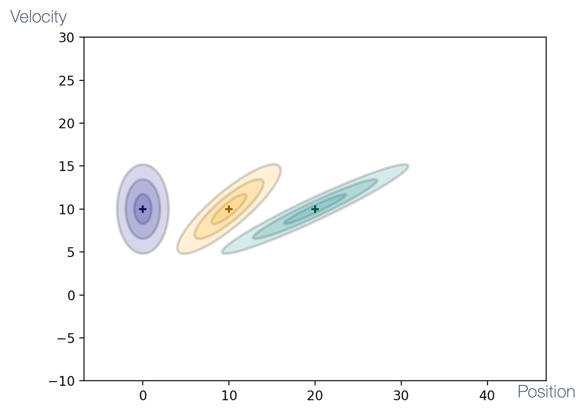

$$
\begin{aligned}
& \overline{\mathbf{x}_{3}}=\left[\begin{array}{l}
30 \\
10
\end{array}\right] \\
& \overline{\mathbf{P}_{3}}=\left[\begin{array}{cc}
28 & 9 \\
9 & 3
\end{array}\right]
\end{aligned}
$$

</details>

<br>


<br>

Hence, after multiple iterations,

- we started with $\mathbf{x}_{0}=\left[\begin{array}{c}0 \mathrm{~m} \\ 10 \mathrm{~m} / \mathrm{s}\end{array}\right]$
- position moves by $10 m$ in each step due to the velocity estimate $=10 \mathrm{~m} / \mathrm{s}$
- velocity estimate **does not change** because we **predict** it based on ${\overline{\dot{x}_{k+1}}}=\dot{x}_{k}$
- position **uncertainty increases**
- position and velocity become more **correlated** because $\overline{x_{k+1}}=x_{k}+\dot{x}_{k} \Delta t$


### Control Input

The state of the system is not only dependant on the sensor and model. Recall that **control input** is meant to drive the system to a particular state. So, we must include it (if it is present) as,

<!-->
$$
\overline{\mathbf{x}_{k+1}}=\mathbf{F} \mathbf{x}_{k}+\mathbf{\textcolor{orange}{B u}}
$$
<-->


where,

|term| definition | details|
|:---|:-----------|:-------|
|$\mathbf{u}$ | control input | example: input to motor `ESC`|
|$\mathbf{B}$ |control input model |models the contribution of control input to the state transition|
||

Note: $\mathbf{B}=\mathbf{0}$ if there is no control input.


### Summary of Prediction Model

To summarize,

$$
\begin{aligned}
& \overline{\mathbf{x}_{k+1}}=\mathbf{F} \mathbf{x}_{k}+\mathbf{B} \mathbf{u} \\
& \overline{\mathbf{P}_{k+1}}=\mathbf{F P}_{k} \mathbf{F}^{\mathrm{T}}+\mathbf{Q}
\end{aligned}
$$

- from $\mathbf{x}_{k}$, we predict the next state $\overline{\mathbf{x}_{k+1}}$ (i.e., prior)
- $\mathbf{F}$ and $\mathbf{Q}$ are typically **constant**
- $\mathbf{B u}$ can be set to `0` &rarr; if there is no explicit control input to the system
- $\mathbf{B u}$ can be used to provide additional information &rarr; better prediction


### Measurement Update

As with the simpler Kalman filter, we need to "fix" our prediction using a measurement from the sensor(s) which is essentially a **Gaussian multiplication** step between &rarr; the prior and the measurement, 

$$
\text{prior:} \quad
\mathbf{\mu_1} = \begin{bmatrix}
3.0\\
5.0
\end{bmatrix}
\quad
\mathbf{\Sigma_1} = \begin{bmatrix}
4 & 3\\
3 & 3
\end{bmatrix}
$$

$$
\text{measurement:} \quad
\mathbf{\mu_2} = \begin{bmatrix}
3.3\\
4.8
\end{bmatrix}
\quad
\mathbf{\Sigma_2} = \begin{bmatrix}
3 & -1\\
-1 & 1
\end{bmatrix}
$$

Visually, we can represent these as:


<br>

The multivariate Gaussian multiplication equations are:

$$
\boldsymbol{\mu}=\boldsymbol{\Sigma}_{\mathbf{2}}\left(\boldsymbol{\Sigma}_{\mathbf{1}}+\boldsymbol{\Sigma}_{2}\right)^{-\mathbf{1}} \boldsymbol{\mu}_{\mathbf{1}}+\boldsymbol{\Sigma}_{\mathbf{1}}\left(\boldsymbol{\Sigma}_{\mathbf{1}}+\boldsymbol{\Sigma}_{\mathbf{2}}\right)^{\mathbf{- 1}} \boldsymbol{\mu}_{\mathbf{2}} 
$$

$$
\boldsymbol{\Sigma}=\boldsymbol{\Sigma}_{\mathbf{1}}\left(\boldsymbol{\Sigma}_{\mathbf{1}}+\boldsymbol{\Sigma}_{\mathbf{2}}\right)^{-\mathbf{1}} \boldsymbol{\Sigma}_{\mathbf{2}}
$$

Recall the univariate Gaussian equivalents:

$$
\mu=\frac{\sigma_{2}^{2} \mu_{1}+\sigma_{1}^{2} \mu_{2}}{\sigma_{1}^{2}+\sigma_{2}^{2}} \quad \sigma^{2}=\frac{\sigma_{1}^{2} \sigma_{2}^{2}}{\sigma_{1}^{2}+\sigma_{2}^{2}}
$$

The net result is:


<br>

A problem with Gaussian multiplication is that the dimensionalities of the state and the measurement **need not match**! For instance,

- state &rarr; $[position, velocity]$
- measurement &rarr; $[position]$

Hence, we need a **measurement function** &rarr; converts a state into a measurement space, _e.g.,_

- different dimensions and/or
- different units (voltage &rarr; distance, celsius &rarr; fahrenheit)

So, incorporating the measurement function, $\mathbf{H}$, we get


<br>

**Note:** the "**residual**" is the difference between measurement and prediction.

If we have,

$$
\text{State:} \quad \mathbf{x}=\left[\begin{array}{l}x \\ \dot{x} \\ y \\ \dot{y}\end{array}\right]
\quad
\text{and \quad Measurement:} \quad \mathbf{z}=\left[\begin{array}{l}x \\ y\end{array}\right]
$$

Then the **measurement function**, is

$$
 \mathbf{H}=\left[\begin{array}{llll}1 & 0 & 0 & 0 \\ 0 & 0 & 1 & 0\end{array}\right]
$$

Recall that measurement &rarr; also follows a Gaussian and has some noise. Hence it is represented as a **multivariate** Gaussian,

$$
\mathcal{N}\left(\mathbf{z}_{\mathbf{k}}, \textcolor{orange}{\mathbf{R}}\right)
$$

where, the **measurement noise** is given by,

$$
\mathbf{R}=\left[\begin{array}{ccc} 
\square & \ldots & \square \\
\vdots & \ddots & \vdots \\
\square & \cdots & \square
\end{array}\right]
$$

$\mathbf{R}$ &rarr; models the **accuracy** of the sensor,

- $m \times m$ covariance matrix ($m$ &rarr; \# of sensors)
- also models correlations between sensors
- typically **constant**


### State and Uncertainty Update

If this is the state of our system,


<br>

then let's define **system uncertainty** ($\mathbf{S_k}$) as,

- the sum of (predicted) state noise and sensor noise
- equivalent to $\bar{\sigma}^{2}+\sigma_{Z}^{2}$ in the univariate case

$$
\mathbf{S}_{\mathbf{k}}=\mathbf{H} \overline{\mathbf{P}_{\mathbf{k}}} \mathbf{H}^{\mathrm{T}}+\mathbf{R}
$$

Bringing all of the prior terms together, we can now define &rarr; the **Kalman Gain** ($\mathbf{K_k}$) which is answering the question:

> "how much we can trust the predicted state vs the measurement?"

$$
\mathbf{K}_{\mathbf{k}}=\overline{\mathbf{P}_{\mathbf{k}}} \mathbf{H}^{\mathrm{T}} \mathbf{S}_{\mathbf{k}}^{-1}
$$

So, to update the state and uncertainty,


<br>

1. **state update**:

$$
\mathbf{x}_{\mathbf{k}}=\overline{\mathbf{x}}_{k}+\mathbf{K}_{\mathbf{k}} \mathbf{y}_{\mathbf{k}}
$$

2. **state uncertainty update**:

$$
P_{k}=\left(I-K_{k} H\right) \overline{P_{k}}
$$

**Note**: if $\mathbf{K_k}$ is large &rarr; then we're **closer to the measurement**.


Consider the following example:

$$
\overline{\mathbf{x}_{1}}=\left[\begin{array}{l}
10 \\
10
\end{array}\right] \quad \overline{\mathbf{P}_{1}}=\left[\begin{array}{ll}
4 & 3 \\
3 & 3
\end{array}\right]
$$

represented as:


Now consider the following sensor measurement and noise model:

$$
\begin{aligned}
& \mathbf{z}_{\mathbf{1}}=[12], \quad \textcolor{orange}{\mathbf{R}=[1]} \quad \mathbf{H}=[1 0]\\
& \mathbf{y}_{\mathbf{1}}=\mathbf{z}_{\mathbf{1}}-\mathbf{H} \overline{\mathbf{x}_{\mathbf{1}}}=\left[\begin{array}{ll}
12
\end{array}\right]-\left[\begin{array}{ll}
1 & 0
\end{array}\right]\left[\begin{array}{l}
10 \\
10
\end{array}\right]=[2] \\
& \mathbf{S}_{\mathbf{1}}=\mathbf{H} \overline{\mathbf{P}_{\mathbf{1}}} \mathbf{H}^{\mathrm{T}}+\mathbf{R}=\left[\begin{array}{ll}
1 & 0
\end{array}\right]\left[\begin{array}{ll}
4 & 3 \\
3 & 3
\end{array}\right]\left[\begin{array}{l}
1 \\
0
\end{array}\right]+[1]=[5] \\
& \mathbf{K}_{\mathbf{1}}=\overline{\mathbf{P}_{\mathbf{1}}} \mathbf{H}^{\mathrm{T}} \mathbf{S}_{\mathbf{1}}^{-1}=\left[\begin{array}{ll}
4 & 3 \\
3 & 3
\end{array}\right]\left[\begin{array}{l}
1 \\
0
\end{array}\right][1 / 5]=\left[\begin{array}{l}
4 / 5 \\
3 / 5
\end{array}\right] \\
& \mathbf{x}_{\mathbf{1}}=\overline{\mathbf{x}_{1}}+\mathbf{K}_{\mathbf{1}} \mathbf{y}_{\mathbf{1}}=\left[\begin{array}{l}
10 \\
10
\end{array}\right]+\left[\begin{array}{l}
4 / 5 \\
3 / 5
\end{array}\right] 2=\textcolor{orange}{\left[\begin{array}{l}
11.6 \\
11.2
\end{array}\right]} \\
& \mathbf{P}_{\mathbf{1}}=\left(\mathbf{I}-\mathbf{K}_{\mathbf{1}} \mathbf{H}\right) \overline{\mathbf{P}_{1}}=\left[\begin{array}{ll}
4 & 3 \\
3 & 3
\end{array}\right]-\left[\begin{array}{l}
4 / 5 \\
3 / 5
\end{array}\right]\left[\begin{array}{ll}
1 & 0
\end{array}\right]\left[\begin{array}{ll}
4 & 3 \\
3 & 3
\end{array}\right] \\
& =\left[\begin{array}{ll}
0.8 & 0.6 \\
0.6 & 1.2
\end{array}\right]
\end{aligned}
$$

The result looks like,


<br>

Let's see what happens if we change $\mathbf{R}$.


$$
\begin{aligned}
& \mathbf{z}_{\mathbf{1}}=[12], \quad \textcolor{orange}{\mathbf{R}=[4]} \begin{array}{c}
\text {\textcolor{orange}{Degraded sensor accuracy}}
\end{array} \quad \mathbf{H}=\left[\begin{array}{ll}
1 & 0
\end{array}\right] \\
& \mathbf{y}_{\mathbf{1}}=\mathbf{z}_{\mathbf{1}}-\mathbf{H} \overline{\mathbf{x}_{\mathbf{1}}}=[12]-\left[\begin{array}{ll}
1 & 0
\end{array}\right]\left[\begin{array}{l}
10 \\
10
\end{array}\right]=[2] \\
& \mathbf{S}_{\mathbf{1}}=\mathbf{H} \overline{\mathbf{P}_{\mathbf{1}}} \mathbf{H}^{\mathrm{T}}+\mathbf{R}=\left[\begin{array}{ll}
1 & 0
\end{array}\right]\left[\begin{array}{ll}
4 & 3 \\
3 & 3
\end{array}\right]\left[\begin{array}{l}
1 \\
0
\end{array}\right]+[4]=[8] \\
& \mathbf{K}_{\mathbf{1}}=\overline{\mathbf{P}_{\mathbf{1}}} \mathbf{H}^{\mathrm{T}} \mathbf{S}_{\mathbf{1}}^{-1}=\left[\begin{array}{ll}
4 & 3 \\
3 & 3
\end{array}\right]\left[\begin{array}{l}
1 \\
0
\end{array}\right][1 / 8]=\left[\begin{array}{l}
4 / 8 \\
3 / 8
\end{array}\right] \\
& \mathbf{x}_{1}=\overline{\mathbf{x}_{1}}+\mathbf{K}_{1} \mathbf{y}_{1}=\left[\begin{array}{l}
10 \\
10
\end{array}\right]+\left[\begin{array}{l}
4 / 8 \\
3 / 8
\end{array}\right] 2=\textcolor{orange}{\left[\begin{array}{c}
11 \\
10.75
\end{array}\right]} \\
& \mathbf{P}_{\mathbf{1}}=\left(\mathbf{I}-\mathbf{K}_{\mathbf{1}} \mathbf{H}\right) \overline{\mathbf{P}_{1}}=\left[\begin{array}{ll}
4 & 3 \\
3 & 3
\end{array}\right]-\left[\begin{array}{l}
4 / 8 \\
3 / 8
\end{array}\right]\left[\begin{array}{ll}
1 & 0
\end{array}\right]\left[\begin{array}{ll}
4 & 3 \\
3 & 3
\end{array}\right] \\
& =\textcolor{orange}{\left[\begin{array}{cc}
2 & 1.5 \\
1.5 & 1.5
\end{array}\right]}
\end{aligned}
$$

And the result looks like,


<br>

When compared with the previous result, we see that the sensor's accuracy isn't very good so the update, while narrowing things down, is **still imprecise**. 

As we increase the values of $\mathbf{R}$, we see that the sensor measurements matter less &rarr; at $\mathbf{R} = \left[200\right]$, the sensor values don't matter at all! 

$$
\begin{aligned}
& \mathbf{z}_{\mathbf{1}}=[12], \quad \textcolor{orange}{\mathbf{R}=[16]} \quad \mathbf{H}=\left[\begin{array}{ll}
1 & 0
\end{array}\right] \\
& \mathbf{x}_{\mathbf{1}}=\left[\begin{array}{l}
10.4 \\
10.3
\end{array}\right] \\
& \mathbf{P}_{\mathbf{1}}=\left[\begin{array}{ll}
3.2 & 2.4 \\
2.4 & 2.4
\end{array}\right]
\end{aligned}
$$


<br>

$$
\begin{aligned}
& \mathbf{z}_{\mathbf{1}}=[12], \quad \textcolor{orange}{\mathbf{R}=[200]} \quad \mathbf{H}=\left[\begin{array}{ll}
1 & 0
\end{array}\right] \\
& \mathbf{x}_{\mathbf{1}}=\left[\begin{array}{l}
10.039 \\
10.029
\end{array}\right] \\
& \mathbf{P}_{\mathbf{1}}=\left[\begin{array}{ll}
3.922 & 2.941 \\
2.941 & 2.941
\end{array}\right]
\end{aligned}
$$


<br>


### Estimating Hidden Variables

In Kalman filter-based state estimations, **hidden variables** (also called **latent variables** or states) refer to those variables or quantities that cannot be measured directly but influence observable quantities. The Kalman filter estimates these hidden variables by processing available measurements through a mathematical model of system dynamics and measurement processes.

Examples: velocity, attitude, orientation, angular velocity, bias of sensors or internal temperature of a component.

Let's see how **velocity** can be estimated.

Initially, the velocity _estimate_ is, say, $10 \mathrm{~m} / \mathrm{s}$, _i.e.,_

$$
\overline{\mathbf{x}_{1}}=\left[\begin{array}{c}
10 \mathrm{~m} \\
10 \mathrm{~m} / \mathrm{s}
\end{array}\right]
$$


<br>

As we get more measurements (of position) and we work through the Kalman Filter predictions and state updates, we can get more precise estimates for &rarr; velocity!


<br>

The various values are:

| Time | Measurement \( z_k \) | Posterior \( x_k \) | Posterior \( \dot{x}_k \) |
|------|-----------------------|---------------------|---------------------------|
| 1 | 12 | 11.60 | 11.20 |
| 2 | 17 | 18.38 | 8.71  |
| 3 | 22 | 23.67 | 7.28  |
| 4 | 27 | 28.63 | 6.52  |
| 5 | 32 | 33.52 | 6.07  |
| 6 | 37 | 38.40 | 5.80  |
| 7 | 42 | 43.29 | 5.62  |
| 8 | 47 | 48.19 | 5.49  |
| 9 | 52 | 53.10 | 5.40  |
| 10 | 57 | 58.03 | 5.33  |
||


<br>

so then, how is this velocity "inferred"? Let's look at the state equations:


$$
\begin{array}{ll}
\mathbf{S}=\mathbf{H} \overline{\mathbf{P}} \mathbf{H}^{\mathrm{T}}+\mathbf{R} & \mathbf{S}=\mathbf{H} \overline{\mathbf{P}} \mathbf{H}^{\mathrm{T}}+\mathbf{R}=\left[\begin{array}{ll}
1 & 0
\end{array}\right]\left[\begin{array}{cc}
\sigma_{\bar{x}}^{2} & \sigma_{\bar{x} \bar{x}} \\
\sigma_{\bar{x} \bar{x}} & \sigma_{\bar{x}}^{2}
\end{array}\right]\left[\begin{array}{l}
1 \\
0
\end{array}\right]+\left[\sigma_{z}^{2}\right]=\left[\sigma_{\bar{x}}^{2}+\sigma_{z}^{2}\right] \\
\mathbf{K}=\overline{\mathbf{P}} \mathbf{H}^{\mathrm{T}} \mathbf{S}^{-\mathbf{1}} & \mathbf{K}=\overline{\mathbf{P}} \mathbf{H}^{\mathrm{T}} \mathbf{S}^{-\mathbf{1}}=\left[\begin{array}{cc}
\sigma_{\bar{x}}^{2} & \sigma_{\bar{x} \bar{x}} \\
\sigma_{\bar{x} \bar{x}} & \sigma_{\bar{x}}^{2}
\end{array}\right]\left[\begin{array}{l}
1 \\
0
\end{array}\right]\left[\begin{array}{c}
1 \\
\frac{\sigma_{\bar{x}}^{2}+\sigma_{z}^{2}}{2}
\end{array}\right]=\left[\begin{array}{c}
\sigma_{\bar{x}}^{2} /\left(\sigma_{\bar{x}}^{2}+\sigma_{z}^{2}\right) \\
\sigma_{\bar{x} \bar{x}}^{2} /\left(\sigma_{\bar{x}}^{2}+\sigma_{z}^{2}\right)
\end{array}\right] \\
\mathbf{H}=\left[\begin{array}{cc}
1 & 0
\end{array}\right] \quad \mathbf{R}=\left[\sigma_{z}^{2}\right] & \mathbf{x}=\overline{\mathbf{x}}+\mathbf{K y}=\left[\begin{array}{l}
\bar{x} \\
\overline{\dot{x}}
\end{array}\right]+\left[\begin{array}{c}
\sigma_{\bar{x}}^{2} /\left(\sigma_{\bar{x}}^{2}+\sigma_{Z}^{2}\right) \\
\sigma_{\overline{\bar{x}} \bar{x}}^{2} /\left(\sigma_{\bar{x}}^{2}+\sigma_{z}^{2}\right)
\end{array}\right] y
\end{array}
$$

Recall that,

$$
\mathbf{\overline{P}} = \left[\begin{array}{c}
\sigma_{\bar{x}}^{2} /\left(\sigma_{\bar{x}}^{2}+\sigma_{z}^{2}\right) \\
\sigma_{\bar{x} \bar{x}}^{2} /\left(\sigma_{\bar{x}}^{2}+\sigma_{z}^{2}\right)
\end{array}\right] 
$$


Hence, we can obtain the equation for the velocity,

$$
\dot{x}=\bar{x}+\frac{\sigma_{\bar{x} \bar{x}}^{2}}{\sigma_{x}^{2}+\sigma_{z}^{2}} y 
$$

From this equation,

|$\mathbf{y}$|meaning|result|
|------------|:------|:-----|
| $y = 0$ | **perfect** prediction | velocity &rarr; **no change** |
| $y \ne 0$ | **wrong** prediction | velocity &rarr; **updated** |
||

The delta of the update, in the second case, depends on:

- residual and
- $\sigma_{\bar{x} \bar{x}}^2$


### Multivariate Kalman Filter Summary

To summarize, 


where,

1. **prediction**

$$
\begin{aligned}
& \overline{\mathbf{x}_k}=\mathbf{F} \mathbf{x}_{k-1}+\mathbf{B} \mathbf{u} \\
& \overline{\mathbf{P}_k}=\mathbf{F P}_{k-1} \mathbf{F}^{\mathrm{T}}+\mathbf{Q}
\end{aligned}
$$

2. **update**

$$
\begin{aligned}
& \mathbf{x}_{\mathbf{k}}=\overline{\mathbf{x}_k}+\mathbf{K}_{\mathbf{k}} \mathbf{y}_{\mathbf{k}} \\
& \mathbf{P}_{\mathbf{k}}=\left(\mathbf{I}-\mathbf{K}_{\mathbf{k}} \mathbf{H}\right) \overline{\mathbf{P}_{\mathbf{k}}}
\end{aligned}
$$

where $\mathbf{K_k}$ and $\mathbf{y_k}$ are calculated as, 

$$
\begin{aligned}
& \mathbf{y}_{\mathbf{k}}=\mathbf{z}_{\mathbf{k}}-\mathbf{H} \overline{\mathbf{x}_{\mathbf{k}}} \\
& \mathbf{S}_{\mathbf{k}}=\mathbf{H} \overline{\mathbf{P}_{\mathbf{k}}} \mathbf{H}^{\mathrm{T}}+\mathbf{R} \\
& \mathbf{K}_{\mathbf{k}}=\overline{\mathbf{P}_{\mathbf{k}}} \mathbf{H}^{\mathrm{T}} \mathbf{S}_{\mathbf{k}}^{-1}
\end{aligned}
$$

An example of a 2D state estimation using multivariate Kalman filters:


**Note**: the problem with Kalman Filters is that it only works for **linear** systems, _i.e.,_

- next state is a linear function of the previous state
- example of non-linear systems: falling object with air resistance

But the real world is actually **non-linear**! To deal with non-linear systems, we use &rarr; the **extended Kalman filter** (EKF). We will explore this using an important application &rarr; **sensor fusion**.


**References:**

- Kalman, R. E. (1960). [A New Approach to Linear Filtering and Prediction Problems](https://www.cs.unc.edu/~welch/kalman/kalmanPaper.html). Journal of Basic Engineering, 82(1), 35-45.
- Bar-Shalom, Y., Li, X. R., & Kirubarajan, T. (2001). [Estimation with Applications to Tracking and Navigation](https://onlinelibrary.wiley.com/doi/book/10.1002/0471221279). Wiley-Interscience.
- Simon, D. (2006). [Optimal State Estimation: Kalman, H∞, and Nonlinear Approaches](https://onlinelibrary.wiley.com/doi/book/10.1002/0470045345). Wiley-Interscience.
- Thrun, S., Burgard, W., & Fox, D. (2005). [Probabilistic Robotics](https://mitpress.mit.edu/books/probabilistic-robotics). MIT Press.
- Welch, G., & Bishop, G. (2006). [An Introduction to the Kalman Filter](https://www.cs.unc.edu/~welch/media/pdf/kalman_intro.pdf). University of North Carolina at Chapel Hill.
- Julier, S. J., & Uhlmann, J. K. (1997). [A New Extension of the Kalman Filter to Nonlinear Systems](https://www.cs.unc.edu/~welch/kalman/media/pdf/Julier1997_SPIE_KF.pdf). Proc. SPIE 3068, Signal Processing, Sensor Fusion, and Target Recognition VI.
- [Kalman Filter Tutorial](https://www.kalmanfilter.net) - A comprehensive online resource with examples and applications.
- [Kalman and Bayesian Filters in Python](https://github.com/rlabbe/Kalman-and-Bayesian-Filters-in-Python) - A free interactive book and Python library by Roger Labbe.
- [FilterPy](https://filterpy.readthedocs.io) - A Python library for Kalman filtering and optimal estimation.
- Särkkä, S. (2013). [Bayesian Filtering and Smoothing](https://www.cambridge.org/core/books/bayesian-filtering-and-smoothing/C372FB31C5D9A100F8476C1A41A5B700). Cambridge University Press.
- [How a Kalman filter works, in pictures](https://www.bzarg.com/p/how-a-kalman-filter-works-in-pictures/)
- [#2: The Kalman Filter](https://engineeringmedia.com/controlblog/the-kalman-filter) by Brian Douglas
- [The multivariate gaussian distribution](https://web.mat.upc.edu/josep.fabrega/pipe/gaussianes_ndim-e-handout-4pp.pdf) by Josep FÀBREGA<!--rel="stylesheet" href="./custom.sibin.css"-->

# Sensor Fusion 

As we've discussed so far, sensors and state estimation, by its very probabilistic and noisy nature, introduces **errors**. The [example from Bayes' Filter](#bayes-filter) where two (seemingly identical) sensors measure the same object differently, highlights this:


<br>

So, the question is &rarr; _"which sensor do we believe?"_

Maybe, instead of framing it as picking one sensor vs. the other, perhaps we can use **both**? This is the objective of **sensor fusion**.

> Sensor fusion is the process of combining sensory data from multiple sources to obtain more accurate information than would be possible using individual sensors alone.

Recall that individual sensors have inherent limitations:

- **limited accuracy**: each sensor has measurement errors
- **limited range/coverage**: sensors may only work reliably in certain conditions
- **limited sampling rates**: some sensors cannot provide updates fast enough
- **sensor-specific weaknesses**: GPS fails indoors, cameras struggle in darkness, etc.

Sensor fusion addresses these limitations by combining complementary data from multiple sensors, each with different strengths and weaknesses. The goal is to produce a combined result that is more accurate, complete, and robust than any single sensor could provide.


### Kalman Filter for Sensor Fusion

We can, of course, use the Kalman Filter to carry out the sensor fusion. For instance,

- consider State, $\mathbf{x}=\left[\begin{array}{l}x \\ \dot{x}\end{array}\right]$
- **two sensors**, GPS (in metres), odometry (in feet): $\mathbf{z}=\left[\begin{array}{c}z_{G P S} \\ z_{\text {odom }}\end{array}\right]$

So, by using the parameters for the Kalman Filter,

$$
\begin{aligned}
\mathbf{H} & =\left[\begin{array}{cc}
1 & 0 \\
1 / 0.3048 & 0
\end{array}\right] \\
\mathbf{R} & =\left[\begin{array}{cc}
\sigma_{\text {GPS }}^{2} & 0 \\
0 & \sigma_{\text {Odom }}^{2}
\end{array}\right]
\end{aligned}
$$

$$
\begin{aligned}
\mathbf{y}= & \mathbf{z}-\mathbf{H} \overline{\mathbf{x}} \\
\mathbf{y}= & {\left[\begin{array}{c}
z_{G P S} \\
z_{\text {Odom }}
\end{array}\right]-\left[\begin{array}{cc}
1 & 0 \\
1 / 0.3048 & 0
\end{array}\right]\left[\begin{array}{l}
\bar{x} \\
\bar{\dot{x}}
\end{array}\right] } \\
\mathbf{x}= & \overline{\mathbf{x}}+{\mathbf{K} \mathbf{y}} \\
\end{aligned}
$$

Note that $\mathbf{K}$ and $\mathbf{y}$ are $2 \times 2$ matrices &rarr; it **mixes the GPS and odometry**!

As mentioned earlier, the Kalman Filter doesn't work well with *non-linear** systems. But what _exactly_ is the problem with nonlinear systems?

Recall that Kalman Filter (and any Bayes' Filter) requires the use of Gaussians that has some nice properties but that breaks down in the face of non-linearities:

|mixing of|result |
|:--------|:------|
| two Gaussians | Gaussian |
| Gaussian and linear function | Gaussian |
| Gaussian and non-linear function | **non-Gaussian**|
| linear and non-linear function | **non-Gaussian** |
| two non-linear function | **non-Gaussian** |
||

So, all the nice Kalman filter steps (prediction, measurement, update) **falls apart** when the results are no longer Gaussians. Let's see [two instances of passing a Gaussian through other functions](https://soulhackerslabs.com/sensor-fusion-with-the-extended-kalman-filter-in-ros-2-d33dbab1829d), $y = g(x)$

- a linear one, $g = 0.5*x + 1$
- a non-linear one, $g = \cos(3 * (\frac{x}{2} + 0.7)) * \sin(1.3 * x) — 1.6 * x$


<br>

As we see from the second animation, the **output is no longer a Gaussian**.

**Note:** This output distribution also violates the **unimodality assumption** of the Kalman Filter, which requires a single peak. Hence, all of our elegant Kalman filter equations are rendered useless!

Of course, we can try to compute an equivalent of a Gaussian using,

- [Monte Carlo simulations](https://en.wikipedia.org/wiki/Monte_Carlo_method) that uses **repeated random sampling** to obtain numerical results


<br>

The problem is that this is **not a closed form**, _i.e.,_ it **cannot** be represented as s combination of,

-  constants
- variables
- a finite set of basic functions connected by arithmetic operations (+, −, ×, /, and integer powers)
- function composition

Hence, we still do not have a mathematical function for the Gaussian that can be plugged into the Kalman Equations.

Enter the **[Extended Kalman Filter (EKF)](#extended-kalman-filter-ekf)** that uses **linearization** &rarr; to **approximate** a non-linear function, $g(.)$, by a **linear function that is tangent to $g(.)$** at the **point of interest**. 

EKF achieves this by use of the [Taylor Series Expansion](#taylor-series).

### Taylor Series 

Before diving into the Extended Kalman Filter, it's important to understand Taylor series expansions, which are the mathematical foundation for linearization in EKF.

A Taylor series expansion approximates a function around a specific point using polynomial terms. The Taylor Expansion of a function is an infinite sum of terms (polynomials) expressed in terms of the function’s derivatives at a single point, $a$, expanded as:

$$
f(x) = f(a) + f'(a)(x-a) + \frac{f''(a)}{2!}(x-a)^2 + \frac{f'''(a)}{3!}(x-a)^3 + \ldots
$$

where:

| term | description |
|:-----|:------------|
| $f(a)$ | the function value at point $a$ |
| $f'(a)$, $f''(a)$, etc. | the derivatives of $f$ evaluated at point $a$ |
| $(x-a)$ | represents the deviation from the expansion point |
||

<br>


<br>

Note that the higher-order Taylor Expansions provide a **closer approximation** of the original function. But the amount of computation required quickly makes it **intractable**! There is still a use for it though, as we shall see shortly.

For multivariate functions $f(\mathbf{x})$ where $\mathbf{x}$ is a vector, the first-order Taylor expansion around a point $\mathbf{a}$ is:

$f(\mathbf{x}) \approx f(\mathbf{a}) + \nabla f(\mathbf{a})^T(\mathbf{x}-\mathbf{a})$

Where $\nabla f(\mathbf{a})$ is the gradient of $f$ evaluated at $\mathbf{a}$, containing all partial derivatives.

**Example**: Consider a simple nonlinear function $f(x) = x^2$ expanded around $a = 1$:
1. $f(1) = 1$
2. $f'(x) = 2x$, so $f'(1) = 2$
3. first-order Taylor approximation: $f(x) \approx 1 + 2(x-1)$
4. this gives us a linear approximation: $f(x) \approx 2x - 1$

This linear approximation is accurate near $x = 1$ but becomes less accurate as we move away from this point.


<br>

**Example 2**: consider the non-linear function we discussed earlier, 

$$
g = \cos(3 * (\frac{x}{2} + 0.7)) * \sin(1.3 * x) — 1.6 * x
$$

The first-order Taylor expansion of $g$ at a point $a$ is shown below in red. It clearly **does not provide a good approximation** &rarr; if we observe it over a large range of values for $x$.


<br>

Remember that

- we are only concerned with the approximation at the values of &rarr; the posterior
- we will be **recomputing** such approximations for the new posteriors **after a very short period of time**
- our approximation &rarr; is **quite good** in the **close vicinity of the point of interest**


<br>

For EKF, we use **first-order Taylor expansions** to &rarr; linearize our nonlinear system and measurement functions.


## Extended Kalman Filter (EKF)

The Extended Kalman Filter addresses the limitations of the linear Kalman Filter by linearizing nonlinear functions **around the current estimate**. For nonlinear systems of the form:

**State Equation**:
$x_k = f(x_{k-1}, u_k) + w_k$

**Measurement Equation**:
$z_k = h(x_k) + v_k$

The EKF linearizes these equations using first-order Taylor series expansions:

$f(x_{k-1}, u_k) \approx f(\hat{x}_{k-1|k-1}, u_k) + F_k(x_{k-1} - \hat{x}_{k-1|k-1})$

$h(x_k) \approx h(\hat{x}_{k|k-1}) + H_k(x_k - \hat{x}_{k|k-1})$

Where:
- $F_k = \left.\frac{\partial f}{\partial x}\right|_{\hat{x}_{k-1|k-1},u_k}$ is the Jacobian of $f$ with respect to $x$
- $H_k = \left.\frac{\partial h}{\partial x}\right|_{\hat{x}_{k|k-1}}$ is the Jacobian of $h$ with respect to $x$

<br>

<details>
<summary>subscripts explained</summary>

The notation $\hat x_{k−1∣k−1}$:

- $x_{k−1∣k−1}$​ in the equation represents a specific type of state estimate in Kalman filtering
- $\hat x$ symbol indicates it's an estimate of the true state xx
x
- The first subscript $k−1$ indicates the time step of the state being estimated
- The second subscript $k−1|k-1$ (after the vertical bar) indicates that this estimate is based on all measurements up to and including time step $k−1$
- So $\hat x_{k−1∣k−1}$, specifically means "the estimate of the state at time $k−1$ given all measurements up to time $k−1$
- This is also called the a posteriori (or updated/corrected) state estimate from the previous time step.

In Kalman filter terminology:

- $\hat x_{k∣k−1}$ would be the a priori estimate (prediction before measurement update)
- $\hat x_{k∣k}$ would be the a posteriori estimate (after measurement update)

The equation is linearizing the nonlinear state transition function $f$ around the best estimate we have of the previous state ($\hat{x}_{k-1|k-1}$) which makes sense since that's our most accurate knowledge of where the system was at the previous time step.
</details>

<br>

These Jacobian matrices contain all the partial derivatives of the nonlinear functions with respect to each state variable, evaluated at the current estimate. They represent the sensitivity of the functions to small changes in the state.

This linearization allows us to

-  apply the Kalman filter equations to nonlinear systems
- but introduces **approximation errors** when the system is highly nonlinear or when the state estimate is far from the true state.

Let's revisit our earlie example function, $g(.)$ and see what happens when we use the linearized functions (as compared to the Monte-Carlo output):


<br>

We see that the EKF Gaussian is **not exactly the same** as the one fitted from the Monte Carlo simulation, but it is **close enough**. This discrepancy (albeit small) is the price we pay for,

- obtaining a closed form estimate and 
- the low computational costs.

**Note**: these graphs show the results of EKF approximations applied to **scalar** functions but our **state is a vector** so we need to:

- we compute the partial derivative of g with respect to the state
- use [Jacobian matrices](https://en.wikipedia.org/wiki/Jacobian_matrix_and_determinant).


### EKF Algorithm

The EKF algorithm follows these steps:

**1. Prediction Step**:
$$\hat{x}_{k|k-1} = f(\hat{x}_{k-1|k-1}, u_k)$$
$$P_{k|k-1} = F_kP_{k-1|k-1}F_k^T + Q_k$$

**2. Update Step**:
$$K_k = P_{k|k-1}H_k^T(H_kP_{k|k-1}H_k^T + R_k)^{-1}$$
$$\hat{x}_{k|k} = \hat{x}_{k|k-1} + K_k(z_k - h(\hat{x}_{k|k-1}))$$
$$P_{k|k} = (I - K_kH_k)P_{k|k-1}$$

The key difference compared to the linear Kalman filter is that we use the **nonlinear functions**,
- $f$ &rarr; state
- $h$ &rarr; measurement prediction

but use their **linearized versions** (Jacobians) for &rarr; covariance calculation.


### EKF and Sensor Fusion

There are **two main approaches** to multi-sensor fusion with EKF:

1. **Centralized Fusion**:
    
- all sensor measurements are processed in a single EKF
- the measurement vector combines all sensor readings:

$$z_k = \begin{bmatrix} z_k^1 \\ z_k^2 \\ \vdots \\ z_k^n \end{bmatrix}$$

- the measurement function and noise covariance are:

$$h(x_k) = \begin{bmatrix} h^1(x_k) \\ h^2(x_k) \\ \vdots \\ h^n(x_k) \end{bmatrix}, \quad R_k = \begin{bmatrix} R_k^1 & 0 & \cdots & 0 \\ 0 & R_k^2 & \cdots & 0 \\ \vdots & \vdots & \ddots & \vdots \\ 0 & 0 & \cdots & R_k^n \end{bmatrix}$$

3. **Decentralized Fusion**:

- each sensor &rarr; has its own local filter
- the results are combined at a **fusion center**

This approach is **more modular** and **fault-tolerant**.

- the state estimates from individual filters can be combined using covariance intersection:

$$P_{fused}^{-1} = \sum_{i=1}^n P_i^{-1}$$
$$P_{fused}^{-1}\hat{x}_{fused} = \sum_{i=1}^n P_i^{-1}\hat{x}_i$$


**Sensor Covariance and Weighting**

The measurement noise covariance matrix $R_k$ determines how much weight each sensor's measurements receive during fusion. Sensors with **lower measurement uncertainty** (smaller values in $R_k$) &rarr; have **more influence on final state estimate**.

Adaptive methods can dynamically adjust these covariances based on:

- current operating conditions
- sensor health monitoring
- consistency checks between sensors
- historical performance

For example, GPS accuracy might degrade in urban canyons, so its covariance should increase in those environments.

### Example: IMU and GPS Fusion using EKF

Let's consider a common problem: fusing IMU (accelerometer and gyroscope) and GPS data for position tracking.

**State Vector**:
$$
x = [\text{position}_x, \text{position}_y, \text{velocity}_x, \text{velocity}_y, \text{heading}]^T
$$

**Note:** The "$T$" as a superscript after the closing bracket indicates that this is a column vector (transposed from a row vector). This is standard mathematical notation for representing a column vector in a single line of text.

**State Transition**:
Using a constant velocity model with heading changes from gyroscope:

$$f(x_{k-1}, u_k) = \begin{bmatrix}
\text{position}_x + \text{velocity}_x \Delta t \\
\text{position}_y + \text{velocity}_y \Delta t \\
\text{velocity}_x + a_x \Delta t \\
\text{velocity}_y + a_y \Delta t \\
\text{heading} + \omega_z \Delta t
\end{bmatrix}$$

Where $a_x, a_y$ are accelerometer readings and $\omega_z$ is the gyroscope reading (yaw rate).

**Measurement Models**:
- GPS: $h_{GPS}(x_k) = [\text{position}_x, \text{position}_y]^T$
- IMU (for update): $h_{IMU}(x_k) = [\text{velocity}_x, \text{velocity}_y, \text{heading}]^T$

**Jacobian Matrices**:
The state transition Jacobian $F_k$ is:

$$F_k = \begin{bmatrix}
1 & 0 & \Delta t & 0 & 0 \\
0 & 1 & 0 & \Delta t & 0 \\
0 & 0 & 1 & 0 & 0 \\
0 & 0 & 0 & 1 & 0 \\
0 & 0 & 0 & 0 & 1
\end{bmatrix}$$

The measurement Jacobians for GPS and IMU are:

$$H_{GPS} = \begin{bmatrix}
1 & 0 & 0 & 0 & 0 \\
0 & 1 & 0 & 0 & 0
\end{bmatrix}$$

$$H_{IMU} = \begin{bmatrix}
0 & 0 & 1 & 0 & 0 \\
0 & 0 & 0 & 1 & 0 \\
0 & 0 & 0 & 0 & 1
\end{bmatrix}$$


**Pseudocode for Implementation**

```python
# Initialize state and covariance
x_hat = np.zeros(5)  # [pos_x, pos_y, vel_x, vel_y, heading]
P = np.eye(5) * 1000  # Initial uncertainty

# Process noise covariance
Q = np.diag([0.1, 0.1, 1.0, 1.0, 0.01])

# Measurement noise covariance
R_gps = np.diag([5.0, 5.0])  # GPS position accuracy (in meters)
R_imu = np.diag([0.5, 0.5, 0.1])  # IMU velocity and heading accuracy

while True:
    # Get IMU data (acceleration and angular velocity)
    accel_x, accel_y, gyro_z = read_imu()
    
    # Prediction step
    dt = time_since_last_update()
    
    # State transition
    x_hat[0] += x_hat[2] * dt  # pos_x += vel_x * dt
    x_hat[1] += x_hat[3] * dt  # pos_y += vel_y * dt
    x_hat[2] += accel_x * dt   # vel_x += accel_x * dt
    x_hat[3] += accel_y * dt   # vel_y += accel_y * dt
    x_hat[4] += gyro_z * dt    # heading += gyro_z * dt
    
    # State transition Jacobian
    F = np.eye(5)
    F[0, 2] = dt
    F[1, 3] = dt
    
    # Update covariance
    P = F @ P @ F.T + Q
    
    # Check if GPS reading is available
    if gps_available():
        # Get GPS position
        gps_x, gps_y = read_gps()
        
        # GPS measurement Jacobian
        H_gps = np.zeros((2, 5))
        H_gps[0, 0] = 1.0
        H_gps[1, 1] = 1.0
        
        # Innovation
        y = np.array([gps_x, gps_y]) - x_hat[0:2]
        
        # Innovation covariance
        S = H_gps @ P @ H_gps.T + R_gps
        
        # Kalman gain
        K = P @ H_gps.T @ np.linalg.inv(S)
        
        # Update state
        x_hat += K @ y
        
        # Update covariance
        P = (np.eye(5) - K @ H_gps) @ P
```


**Analysis**

1. **high-frequency updates** &rarr; IMU provides updates at $100-1000$ Hz, allowing for **smooth tracking**
2. **drift correction** &rarr; GPS (updating at $1-10$ Hz) corrects the **accumulated drift** from IMU integration
3. **robustness to GPS outages** &rarr; system can continue to provide **reasonable position estimates during short GPS outages**!

The following graph shows a typical position tracking result comparing:

| **data source** | **description** |
|:----------------|:----------------|
| **<span style="color:blue">blue dots</span>** | raw gps data |
| **<span style="color:red">red line</span>** | dead reckoning using only imu data |
| **<span style="color:green">green line</span>** | ekf fusion of gps and imu |
||


<br>

<details>
<summary>Why does the EKF follow the GPS line more closely even though the IMU updates more frequently and (seemingly) starts with lower error?</summary>

From the code, we see:

```
# Measurement noise covariance
R_gps = np.diag([5.0, 5.0])  # GPS position accuracy (in meters)
R_imu = np.diag([0.5, 0.5, 0.1])  # IMU velocity and heading accuracy
```

This might _seem_ counterintuitive, but there are several important reasons for this behavior:

1. **complementary error characteristics**: GPS provides **absolute position measurements with bounded error**, while IMU measures **relative changes** (acceleration and angular velocity) that suffer from **unbounded error accumulation** (drift). The Kalman filter weights these complementary information sources.

2. **different types of uncertainty**: although IMU updates more frequently, its measurements must be **integrated** once or even twice (for angular position and linear position respectively) to obtain position estimates. This integration process significantly **amplifies errors over time**, resulting in **drift**.

3. **Observability concerns**: position is **directly observable** from GPS but only **indirectly observable** from IMU via double integration. The EKF tends to give more weight to directly observable states when determining the optimal fusion.

4. **Bias and scale factor errors**: IMUs typically suffer from bias and scale factor errors that, while small initially, **compound over time through the integration** process, making their long-term position estimates less reliable.

5. **Anchoring effect**: GPS provides "ground truth" position fixes that anchor the estimated trajectory, while IMU primarily contributes to tracking short-term dynamics between GPS updates.

This behavior is actually **desirable** in navigation systems -- the fusion algorithm,

- leverages the IMU's excellent short-term accuracy and high update rate to track dynamic movements while 
- using the GPS's long-term stability to periodically correct the accumulated drift. 

This is why in the visualization, during GPS outages, the EKF fusion trajectory _initially_ follows the IMU-only path but _gradually converges_ back to the GPS trajectory once GPS measurements become available again.

Let's work through the equations using **concrete** values. First, let's understand the key mathematical reason for IMU drift versus GPS stability:

**1.** Integration Error Analysis for IMU

For an IMU, we integrate acceleration twice to get position:

```
velocity(t) = ∫ Acceleration(τ) dτ
position(t) = ∫∫ Acceleration(τ) dτ²
```

Let's assume a constant acceleration bias error of ε in an IMU. After time t, the position error becomes:

```
position error = (ε·t²)/2
```

This shows the error grows quadratically with time - a fundamental problem with inertial navigation.

**2.** GPS Error Characteristics

GPS error is relatively constant over time and doesn't accumulate:

```
position error(GPS) ≈ constant
```

**3.** Quantitative Analysis Based on the Example

Looking at the code in the document:

```python
# Process noise covariance
Q = np.diag([0.1, 0.1, 1.0, 1.0, 0.01])

# Measurement noise covariance
R_gps = np.diag([5.0, 5.0])  # GPS position accuracy (in meters)
R_imu = np.diag([0.5, 0.5, 0.1])  # IMU velocity and heading accuracy
```

Let's calculate how errors propagate:

1. **IMU velocity error after $10$ seconds**:
   - initial uncertainty: $0.5 m/s$ (from $R_{imu}$)
   - process noise: $1.0 m/s²$ (from $Q$ for velocity)
   - After $10s$: $\sqrt{(0.5)^2 + (1.0 \cdot 10)^2} \approx 10.01 \text{ m/s}$

2. **Position error from IMU after 10 seconds**:
   - From velocity error: $10.01 m/s \cdot \frac{10s}{2} \approx 50.05 m$
   - From position process noise: $0.1 m \cdot 10s \approx 1 m$
   - Total IMU-derived position error $\approx 51.05 m$

3. **GPS position error**:
   - Constant: $5.0 m$ (from $R_{gps}$)

The Kalman gain K is calculated as:

$$K_k = P_{k|k-1} H_k^T (H_k P_{k|k-1} H_k^T + R_k)^{-1}$$

After 10 seconds, the predicted error covariance P for position from IMU-only would be dominated by the integrated errors (~51 m), while the GPS measurement error remains at 5 m. This leads to:

$$K \approx \frac{51^2}{51^2 + 5^2} \approx 0.99$$

for GPS updates.

This means the filter will weigh the GPS measurement at about $99\%$ and the IMU-propagated position at only about $1 \%$ when a GPS measurement arrives after $10$ seconds of IMU-only navigation.

**4.** Visual Evidence from the Graph

In the position tracking visualization, you can see:

1. where GPS is available, the green EKF line closely follows the blue GPS points
2. during the GPS outage region (red shaded area), the EKF initially follows the orange IMU track
3. the IMU-only orange line progressively deviates from the ground truth (black dashed line)
4. when GPS becomes available again, the EKF quickly converges back to GPS measurements

This behavior directly confirms our mathematical analysis. The Kalman filter is doing exactly what it should: using high-frequency IMU data for short-term tracking but relying more heavily on GPS for long-term stability due to the fundamentally different error accumulation characteristics of the two sensors.
</details>


### Miscellaneous and Advanced Topics

**Best Practices** when implementing EKF for sensor fusion,

| **best practices** | description |
|:-------------------|:------------|
| **careful state selection** | include only necessary states to avoid computational burden |
| **proper initialization** | set initial covariance to reflect actual uncertainty |
| **tuning noise parameters** | adjust $Q$ and $R$ based on empirical data |
| **consistency monitoring** | check filter consistency using normalized innovation squared (NIS) |
| **fault detection** | implement mechanisms to detect sensor failures |
| **numerical stability** | use square-root or UD factorization for improved numerical properties |
||

<br>

**Handling Non-Gaussian Noise**

EKF assumes that both process and measurement noise are Gaussian. For systems with non-Gaussian noise, consider:

| **method** | description |
|:-----------|:------------|
| **particle filters** | represent the probability distribution using samples |
| **robust kalman filters** | use heavy-tailed distributions to model outliers |
| **pre-filtering** | apply outlier rejection before using EKF |
||


The Extended Kalman Filter is a powerful tool for sensor fusion in nonlinear systems. It provides a principled approach for combining measurements from multiple sensors with different characteristics, rates and accuracies.

Despite its limitations with highly nonlinear systems, EKF remains the workhorse of many practical sensor fusion applications due to its relatively simple implementation and computational efficiency.

For more complex scenarios, consider alternatives like the [Unscented Kalman Filter](#unscented-kalman-filter-comparison), [Particle Filters[(https://en.wikipedia.org/wiki/Monte_Carlo_localization)] or more recent developments in factor graph-based fusion.


### Unscented Kalman Filter Comparison

The EKF uses first-order linearization, which can introduce significant errors for highly nonlinear systems. The **[Unscented Kalman Filter (UKF)](https://soulhackerslabs.com/the-unreasonable-power-of-the-unscented-kalman-filter-with-ros-2-d4c97d4b4bb9)** is an alternative that:

1. selects a set of sigma points around the current state estimate
2. propagates these points through the nonlinear functions
3. computes a weighted mean and covariance from the transformed points

This **avoids the need for explicit Jacobian calculations** and can **handle nonlinearities better**. The computational complexity is similar to EKF for most practical applications.

**Example**: Target Tracking with Radar

To illustrate the difference between EKF and UKF performance, consider a radar-based target tracking scenario:

**System Configuration:**

- single radar measuring range, azimuth and range-rate to a target
- target following a coordinated turn trajectory (highly nonlinear dynamics)
- measurement frequency: $1$ Hz
- state vector: $[x, y, velocity_x, velocity_y, turn\_rate]$

**Nonlinearity Challenges:**

1. coordinate conversion (polar to Cartesian)
2. rotational motion during turns
3. range-dependent measurement noise

**Testing Methodology:**

- 100 Monte Carlo simulations of 120-second trajectories
- Process noise: Medium (acceleration uncertainty σ = 0.5 m/s²)
- Measurement noise: Range (σ = 25m), Azimuth (σ = 0.5°), Range-rate (σ = 3m/s)


Comparison of EKF vs UKF error performance:


<br>

| Parameter | EKF Error | UKF Error | Improvement |
|-----------|-----------|-----------|-------------|
| Position  | 1.45 m    | 0.95 m    | 34.5%       |
| Velocity  | 0.32 m/s  | 0.25 m/s  | 21.9%       |
| Heading   | 2.1 deg   | 1.7 deg   | 19.0%       |
||

**Analysis:**

- UKF **outperforms** the EKF in all state variables
- most significant improvement is in **position estimation** (34.5%)
- improvement becomes more pronounced during **high-rate turns**
- **computational load increased** by approximately $15\%$ for the UKF

**When to Use UKF Instead of EKF:**

- dealing with highly nonlinear system or measurement models
- high accuracy is needed during rapid maneuvers
- Jacobian matrices are difficult to derive or implement
- the additional computational cost is acceptable

The UKF's ability to better capture nonlinear transformations makes it particularly valuable for aerospace, underwater navigation and other domains with complex motion models.


**References**:

- Thrun, S., Burgard, W., & Fox, D. (2005). [Probabilistic Robotics](http://www.probabilistic-robotics.org). MIT Press. [Slides](http://probabilistic-robotics.informatik.uni-freiburg.de/ppt/)
- Bar-Shalom, Y., Li, X.R., & Kirubarajan, T. (2001). Estimation with Applications to Tracking and Navigation. Wiley-Interscience.
- Grewal, M.S., & Andrews, A.P. (2014). Kalman Filtering: Theory and Practice Using MATLAB (4th ed.). Wiley.
- Simon, D. (2006). Optimal State Estimation: Kalman, H∞, and Nonlinear Approaches. Wiley-Interscience.
- Crassidis, J.L., & Junkins, J.L. (2011). Optimal Estimation of Dynamic Systems (2nd ed.). CRC Press.
- [Sensor Fusion with the Extended Kalman Filter in ROS 2](https://soulhackerslabs.com/sensor-fusion-with-the-extended-kalman-filter-in-ros-2-d33dbab1829d)
- [The Unreasonable Power of The Unscented Kalman Filter with ROS 2](https://soulhackerslabs.com/the-unreasonable-power-of-the-unscented-kalman-filter-with-ros-2-d4c97d4b4bb9)
- [The math behind Extended Kalman Filtering](https://medium.com/@sasha_przybylski/the-math-behind-extended-kalman-filtering-0df981a87453) by Sasha Przybylski. Check out the cool video:

<iframe width="560" height="315" src="https://www.youtube.com/embed/dFPCFmd5uJE?si=Iy8K0EeV6TP3amor" title="YouTube video player" frameborder="0" allow="accelerometer; autoplay; clipboard-write; encrypted-media; gyroscope; picture-in-picture; web-share" referrerpolicy="strict-origin-when-cross-origin" allowfullscreen></iframe>


## High-Order Sensor Fusions

What we've seen so far is **low-level** sensor fusion where the sensor values are fused as soon as the sensor readings are available. But we can imagine a situation where,

- first, extract some "knowledge" out of the sensor values &rarr; say, bounding boxes
- next, "fuse" this higher-oder knowledge.

Consider the following two scenarios of a car trying to detect a pedestrian crossing the road using two different sensors &rarr; a **camera** and a **lidar**:

|camera|lidar|
|:--------|:---------|
|||
| **2D** bounding box | **3D** bounding box|
||

The problem is that they generate very different types of output (2D vs 3d bonding boxes). So how do we fuse them?


### Sensor Fusion | Classes

Before we go ahead, let's take a look at the various **classes of sensor fusion**. The classification tries to extract answers to the following questions:

1. **abstraction** level &rarr; **when** should we carry out the fusion?
2. **centralization** level &rarr; **where** should we carry out the fusion?
3. **competition** level &rarr; **what** should the fusion do? 

Let's briefly look at each one.

**1. Abstraction level fusion**

We try to answer the question &rarr; **when** should we carry out the fusion, _i.e.,_ should we do it as soon as we get sensor values or after extracting some knowledge from it?

There are three ways to classify sensor fusion based on the abstraction levels:

|abstraction level| details | examples | pros | cons|
|:----------------|:--------|:---------|:-----|:-----|
| **low-level** |fuse the **raw** sensor values &rarr; project 3D point clouds onto pixels | point clouds from LiDAR and pixels from camera images| future proof | large computational requirements|
| **mid-level** | each sensor does its own detection &rarr; project 3D bounding box onto 2D bounding box| camera and LiDAR (separately) detect objects that are fused | simplicity | loses some information|
| **high-level** | fuse **objects** and **trajectories** &rarr; predictions+tracking| trajectories from camera and from LiDAR (separately)|further simplicity |too much information loss|
||


**2. centralization level** 

We try to answer the question &rarr; **where** should we carry out the fusion, _i.e.,_

- central computer or
- each sensor does it independently

There are three high-level choices:

| **centralization level** | details |
|:-------------------------|:--------|
| **centralized** | one central unit deals with it [low-level] |
| **decentralized** | each sensor fuses data and forwards to next one |
| **distributed** | each sensor processes data locally and sends to next unit [late] |
||


Recently automakers have started to use a **satellite** architecture for the design of computing elements interacting with sensors (and sensor fusion). The process is:

- plug many sensors [satellites]
- fuse together either on a single central unit [active safety domain controller] or a bunch of separate processors
- 360 degree fusion+detection on controller
- sensors do not have to be extremely good &rarr; there is redundancy to make up for it


**3. Competition level** 

We try to answer **what** should the fusion do? Again, there are **three** possibilities,

|competition level | meaning | example |
|:-----------------|:--------|:--------|
|**competitive**|sensors meant for same purpose |RADAR, LiDAR |
|**complementary**|different sensors looking at different scenes | multiple cameras &rarr; to create a panorama|
|**coordinated**|sensors produce a new scene from same object | 3D reconstruction|
||

Examples of each of the above:

1. competitive level

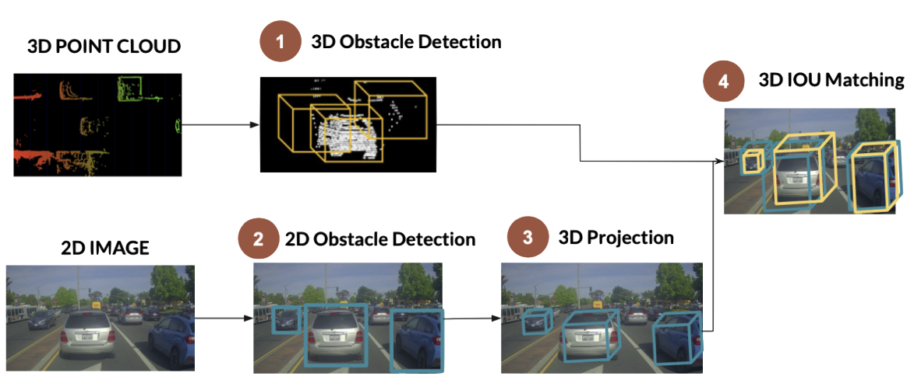

2. complementary level


3. coordinated level 


### What is "IOU"?

Recall that YOLO creates "bounding boxes". But, it usually starts by creating **multiple** bounding boxes on/around an object, _e.g.,_

So, one example could be,


<br>

But what we really want is a **single** bounding box that encapsulates the **entire** object, 


So how do we get from one (multiple) to the other (single)? We compute the **IoU** &rarr; **intersections over union**, defined as:

$$
IoU = \frac{\text{area of \textbf{intersection} of bounding boxes}}{\text{area of \textbf{union} of bounding boxes}}
$$

Visually, this can be seen as:


<br>

The closer that an IoU is to `1`, the better the bounding box, _e.g.,_


<br>

IoU also requires a notion of **ground truth** &rarr; the **precise** bounding boxes surrounding the items of interest in an image. **Human experts manually mark or label these boundary boxes**. The IoU score is calculated by comparing the predicted bounding boxes produced by an object detection model to the ground-truth bounding boxes during evaluation.


### Sensor Fusion Example | Camera and LiDAR

Let's get back to our example, camera+LiDAR. So, we have the following types of data:


- camera &rarr; excellent for **object classification** and **understanding scenes**
- LiDAR &rarr;good for **estimating distances** 

Here is a comparison of the strengths and weaknesses of the two:


<br>

So let's look at this from the perspective of the three classes we discussed earlier:

|class|notes|
|:----|:----|
| **what**? | competition and redundancy|
| **where**? | doesn't matter &rarr; any of the options work |
| **when**? | multiple options &rarr; **early** or **late** |
||

<br>

**Early Fusion**

- fuse **raw data** as soon as sensors are plugged
- **project** 3D LiDAR point clouds onto 2D image
- check whether point clouds belong to 2D bounding boxes from camera

The entire process looks like:


<br>

to translate 3D point cloud [LiDAR frame] &rarr;  2D projection [camera frame],

- convert each 3D LiDAR point into **[homogeneous coordinates](https://www.tomdalling.com/blog/modern-opengl/explaining-homogenous-coordinates-and-projective-geometry/)**
- apply **projection equations** [translation/rotation] to convert from LiDAR to camera
- transform back into Euclidean coordinates

<details>
<summary>Homogenous coordinates</summary>

They are a [system of coordinates](https://en.wikipedia.org/wiki/Homogeneous_coordinates) used in projective geometry, just as Cartesian coordinates are used in Euclidean geometry. They have the advantage that the coordinates of points, including points at infinity, can be represented using finite coordinates. Formulas involving homogeneous coordinates are often simpler and more symmetric than their Cartesian counterparts. Homogeneous coordinates have a range of applications, including computer graphics and 3D computer vision, where they allow affine transformations and, in general, projective transformations to be easily represented by a matrix. They are also used in fundamental elliptic curve cryptography algorithms.

Here is an example of a Rational Bézier curve – polynomial curve defined in homogeneous coordinates (blue) and its projection on plane – rational curve (red).


<br>

If homogeneous coordinates of a point are multiplied by a non-zero scalar then the **resulting coordinates represent the same point**. Since homogeneous coordinates are also given to points at infinity, the **number of coordinates** required to allow this extension is **one more than the dimension of the projective space** being considered. For example, two homogeneous coordinates are required to specify a point on the projective line and three homogeneous coordinates are required to specify a point in the projective plane.

[Read](https://www.tomdalling.com/blog/modern-opengl/explaining-homogenous-coordinates-and-projective-geometry/) for a more detailed explanation with examples.

</details>

So, the output of this step looks like, 


<br>

For the object detection on the camera image &rarr; use YOLO!

The next step is &rarr; **region of interest (ROI) mapping**, where we must **fuse** the objects inside each bounding box. We get the following outputs:

- for each bounding box &rarr; camera gives us the **classification**
- for each **LiDAR projected point** &rarr; we get an **accurate distance measure**  

There can be some problems though. Which point (in the bounding box) do we pick for the **distance**? Recall that we are projecting/capture a 3D object on a 2D plane. So, distance measures could be one of:

- average
- center point
- closest?

There are other issues, for instance, consider the yellow region pointed to by the arrow,


<br>

Do these points belong to the (shown) bounding box or a different one?

We need to develop some _consistent_ policies to deal with such issues. 


**Late Fusion**

Fusing results **after** independent detection and there can be two ways to do it:

- get 3D bounding boxes on both ends &rarr; fuse results
- get 2D bounding boxes on both sides &rarr; fuse results


For the first type (late fusion in 3D), the steps are:

1. **3D obstacle detection for LiDAR**. The idea is to look at the point cloud and extract meaningful information/bounding boxes for the objects. Various methods have been developed over the years for this, 
   -  unsupervised machine learning
   - deep learning algorithms (_e.g.,_ [RANDLA-NET](https://github.com/QingyongHu/RandLA-Net?tab=readme-ov-file)) 

<br>


<br>

<details>
<summary>RANDLA-NET</summary>

This is a simple and efficient neural architecture for semantic segmentation of large-scale 3D point clouds. 

- link to the [paper](https://arxiv.org/abs/1911.11236)
- link to [gitHub repo](https://github.com/QingyongHu/RandLA-Net?tab=readme-ov-file)
- the [Matlab](https://www.mathworks.com/help/lidar/ref/randlanet.html) implementation

Some examples:


</details>

<br>

2. **3D Obstacle detection for Camera**. We want to take the 2D images from the camera and **extrapolate 3D** bounding boxes from them. This is much harder than the previous situation. Here are the steps:


<br>

- 2D object detection (say using YOLO)
- 3D projections from those bounding boxes &rarr; essentially extract the size/shape/depth of the object:


<br>

One method is to use deep learning along with estimates of the size/orientation of the vehicle.

<br>

3. **IoU matching in 3D space** &rarr; find a way to align the 3D bounding boxes in space. 


<br>

Numerous methods have been proposed in literature &rarr; [votenet](https://github.com/facebookresearch/votenet), [sess](https://github.com/Na-Z/sess?tab=readme-ov-file) and [3dIoUmatch](https://github.com/yezhen17/3DIoUMatch?tab=readme-ov-file).

Here is a high-level diagram that shows how SESS works:


**IoU matching in Time**

So far, we have discussed how to match the IoU in **space** but there is a **time** element as well &rarr; we need ensure that the **frames match up in time**! We need to evaluate the accuracy of object bounding box predictions across consecutive frames &rarr; basically associate objects in time, from frame to frame, _i.e.,_ associate temporal segments (events, intervals, actions) based on their **Intersection over Union (IoU)**

We also need to **predict future positions**!

On intuition is that if **bounding boxes overlap between consecutive frames** &rarr; same obstacle.

Here are some well known algorithms:

1. **Greedy Matching**

Greedy matching is a **heuristic** approach where each predicted segment is matched to the best ground truth interval based on IoU. Common in benchmarks like [**ActivityNet**](https://github.com/activitynet/ActivityNet/tree/master) and [**THUMOS**](https://cove.thecvf.com/datasets/593).

How it works:

- sort predictions by **confidence score**
- for each prediction,
  - match with the **highest-IoU unmatched** ground truth
  - if $IoU \ge threshold$ (_e.g.,_ `0.5`)* &rarr; *true positive**
- unmatched predictions &rarr; **false positives**
- unmatched ground truths &rarr; **false negatives**

<br>
<br>


2. **Hungarian Matching algorithm** (Optimal One-to-One)

Uses the **[Hungarian algorithm](https://en.wikipedia.org/wiki/Hungarian_algorithm)** to find an optimal one-to-one matching between predictions and ground truths by maximizing total IoU.

Methodology:

- build a **cost matrix**, $1 - IoU$, for each prediction-ground truth pair
- solve **assignment** using the Hungarian algorithm

<br>
<br>

3. **IoU Threshold Matching**

Matches predictions to ground truths if $IoU \ge threshold$. Can be,

- one-to-one
- one-to-many
- many-to-many.

How it works,

- compute the IoU for **all pairs**
- match if the IoU exceeds threshold
- we can create customizable matching policies

Some frameworks that use this: [PASCAL VOC](http://host.robots.ox.ac.uk/pascal/VOC/). 

<br>
<br>

4. **Temporal Non-Maximum Suppression (NMS)**

Removes redundant overlapping predictions and keeps the **highest confidence prediction per overlapping group**,

- sort the predictions by **confidence**
- iteratively **remove overlapping predictions** ($IoU \gt threshold$).

Frameworks that use this method: [Fast R-CNN](https://arxiv.org/abs/1504.08083).

<br>
<br>

5. **Soft-NMS / Soft Matching**

Instead of removing overlapping segments, Soft-NMS **decreases their scores** based on IoU overlap using a **decay function**. Basically apply a decay to confidence scores such as,

$$
s = s * e^{\frac{-IoU^2}{\sigma}}
$$


Framework: [Soft-NMS](https://arxiv.org/abs/1704.04503).

Here is a comparison between the various methods:

| Method  | Matching Type  | Optimized? | Handles Overlaps? | 
|:--------|:----------------|:------------|:-------------------|
| Greedy  | One-to-one  | No | Partially   |
| Hungarian | One-to-one | Yes  | Yes  |
| IoU Threshold | Flexible  | No | No |
| NMS  | Pre/Post| No | Yes |
| Soft-NMS | Pre/Post | No (heuristic) | Yes | 
||


**References**

- [3D Object Tracking using LiDAR and CAMERA](https://medium.com/@nikhilnair8490/3d-object-tracking-using-lidar-and-camera-187040062b2c)
- [Enhancing Cross-Modal Camera Image and LiDAR Data Registration Using Feature-Based Matching](https://www.mdpi.com/2072-4292/17/3/357) by Leahy et al.
- [LiDAR and Camera Sensor Fusion in Self-Driving Cars](https://www.thinkautonomous.ai/blog/lidar-and-camera-sensor-fusion-in-self-driving-cars/)


<!--rel="stylesheet" href="./custom.sibin.css"-->

# SLAM

Consider a robot (a Roomba vacuum cleaner, say) trying to navigate inside a room. Now, it can do this in one of two ways:

- **randomly** move around the room, hoping that it will _eventually_ cover the whole place and
- **map** out the room, figure out where it is and _systematically_ ensure that it cover the entire room.

 &nbsp;&nbsp;


<br>

This is particulalry effective when the system has **obstacles** in it, _e.g.,_ a couch and other furniture. This requires the robot to do do things:

|||
|---|---|
|create a **map** of its surroundings | **locate** itself within that map|
|  | |
||

Enter **simultaneous localization and mapping** (SLAM) which represents one of the fundamental challenges in mobile robotics. As the name suggests, SLAM involves solving two interconnected problems at once: building a map of an unknown environment while simultaneously tracking the robot's position within that environment. The need for SLAM arises from a seemingly paradoxical situation: to build an accurate map, a robot needs to know its precise location, but to determine its precise location, the robot needs an accurate map. This chicken-and-egg problem is what makes SLAM challenging and fascinating.

SLAM is also crucial for autonomous mobile robots operating in **unknown environments** where external positioning systems (like GPS) are unavailable or unreliable, such as:

- indoor environments
- underground mines and caves
- underwater exploration
- planetary exploration
- dense urban areas with GPS signal blockage.

SLAM is more of a concept than a single algorithm. There are many approaches to implementing SLAM, varying in complexity, accuracy and computational requirements.

Some examples of SLAM output:

1. **grid maps** or **scans**


2. **landmark**-based


We can also classify SLAM based on the type of sensor (and corresponding outputs), 

a. **visual slam** that uses &rarr; cameras

- sparse methods match feature points of images [PTAM, ORB_SLAM]
- dense methods use overall brightness of images [DTAM, LSD- SLAM, DSO, SVO]


b. **LiDAR SLAM**

- laser point cloud provides high-precision distance measurements
- not as finely detailed as camera images
- environments with fewer obstacles &rarr; less precision
- may require fusion with other sensors (e.g., GPS, odometry)


## SLAM Problem Definition

At its core, SLAM is a state estimation problem. Given,

- the robot's control inputs (odometry)
- observations of nearby features/landmarks
- no prior map

The objective is to estimate,

- the **map** of the environment
- the **path** (or current position) of the robot

So why is SLAM a hard problem?

In the real world, the mapping between observations and landmarks is unknown. Picking wrong data associations can have catastrophic consequences. Pose error correlates data associations.

> In robotics and computer vision, **"pose"** refers to the position and orientation of an object or a robot in a given space.
>
> 
> For instance, 2D Pose (in planar systems)
>
>- position: (x, y)
>- orientation: $\theta$ (rotation around the z-axis)

The various parts of SLAM:


<br>

Let’s go over each component:

1. **Sensor Data**
    - the input to SLAM comes from sensors, such as:
	    - camera (for visual SLAM, extracting features from images)
	    - a LiDAR or depth sensor (for distance and obstacle detection)
    - the sensors provide raw data about the environment.


2. **Front End** (sensor-dependent processing)
	- front end is responsible for data association and motion estimation
	- it processes sensor-specific information to extract meaningful features. It includes:
	    - motion estimation: Determines how the robot is moving by tracking sensor data over time
	    - obstacle location estimation: Identifies objects and landmarks in the environment
	- goal of the front end &rarr; preprocess sensor data and reduce noise before passing it to the back end.


3. **Back End** (sensor-independent processing)
	- back end performs global optimization of the estimated trajectory
	- it is **sensor-independent**, meaning it can work with data from different sensors as long as it receives processed pose and landmark information. It includes:
	    - **register pose graphs** &rarr; combines different pose estimates into a coherent structure
	    - graph optimization &rarr; uses mathematical optimization techniques (e.g., bundle adjustment, factor graphs) to refine the trajectory and correct drift
	- back end **corrects errors** that accumulate over time, leading to a more accurate map.

4. **Pose Graph and Map Information**
	- **final output** of SLAM is a pose graph (a representation of the robot’s trajectory) and a map of the environment
	- map is constructed using optimized pose estimates from the back end
	- map can be used for navigation, obstacle avoidance, and autonomous decision-making.

Hence, 

| component | description |
|---|---|
| front end (sensor-dependent) | processes raw sensor data (motion estimation, obstacle detection) |
| back end (sensor-independent) | optimizes the trajectory and map |
| final output | a refined pose graph and map for accurate navigation |
||

This structured approach ensures real-time and accurate localization while reducing computational complexity. 

We can distill all of the above "steps" into the following. Each has its own drawbacks but we can deal with them.

| step |description  | challenge  |
|-------|--------|--------|
| **prediction step**  | update the robot's position estimate using odometry data (motion model) | **correlated errors** in position estimation affect the map |
| **landmark extraction** | identify landmarks or features from sensor measurements | **environmental dynamics** may cause landmarks to change |
| **data association** | match observed landmarks with previously mapped landmarks | **incorrect associations** lead to mapping errors |
| **update step** | update robot position and landmark estimates based on observations | **computational complexity** increases with more data |
| **map expansion** | add newly observed landmarks to the map | loop closure is required to recognize **revisited** places |

## Mathematical Formulations

First, let's define some terms,

| symbol   | meaning  |
|----------|-----------|
| $x_{1:t}$ | robot path |
| $m$ | map |
| $z_{1:t}$ | sensor observations |
| $u_{1:t}$ | control inputs|
||

1. **Full SLAM** &rarr; estimates the **entire** robot path and map


- the model estimates the **entire trajectory** $x_{1:t}$ along with the map $m$
- the equation:

$$
p(x_{1:t}, m | z_{1:t}, u_{1:t})
$$

- indicates that we compute the joint probability over all past and current poses, rather than marginalizing them out
- gray-shaded area (from the figure) covers all past poses $x_{1:t}$, indicating that they are explicitly maintained in the estimation
- this approach provides **smoothing**, allowing the system to refine past estimates when new observations are received

**Interpretation**:

- full slam is useful when all sensor data is available after execution (batch processing)
- allows for loop closure corrections, where the **trajectory can be optimized** retrospectively
- used in graph-based slam and optimization-based slam techniques like gtsam and pose graph optimization

2. **Online SLAM**: &rarr; estimates only the **most recent** robot pose and the map

- the model estimates only the most recent pose $x_t$ and the map $m$
- the equation:

$$
p(x_t, m \mid z_{1:t}, u_{1:t}) = \int\int...\int p(x_{1:t}, m \mid z_{1:t}, u_{1:t}) dx_1 dx_2...dx_{t-1}
$$

  shows that all past poses $x_{1:t-1}$ are marginalized out, leaving only the current pose and the map
- gray-shaded area in the graphical model highlights that only the current pose is maintained explicitly
- this approach is **computationally efficient** and suitable for real-time applications

### interpretation

- online slam is designed for real-time operation, where storing the entire trajectory is infeasible
- it relies on filtering methods such as the extended kalman filter (ekf) and particle filters
- used in applications where **fast localization and mapping** are required, such as autonomous navigation and robotics


**Comparison** of the two methods:

### key differences between full slam and online slam

| feature          | full slam | online slam |
|-----------------|-----------|------------|
| **estimates**   | entire trajectory $x_{1:t}$ and map $m$ | only current pose $x_t$ and map $m$ |
| **past poses**  | explicitly maintained | marginalized out |
| **computational complexity** | higher (batch processing) | lower (real-time feasible) |
| **approach**    | smoothing-based (e.g., graph-based slam) | filtering-based (e.g., ekf-slam, fastslam) |
| **application** | useful for post-processing and high-accuracy mapping | used in real-time robotics, drones, autonomous vehicles |
||

## SLAM Hardware

The main hardare for SLAM consists of 

- a robot
- a range measurement device

For SLAM implementation, a mobile robot requires,

- wheel encoders for odometry estimation
- a processor for calculation
- appropriate motion capabilities for the environment

Several sensing technologies can be used for SLAM:

- **Laser Scanners** &rarr; provide high-precision measurements with minimal processing required.

- **Sonar** &rarr; less expensive than laser scanners but provide lower quality measurements with wider beam width (up to $30\degree$ compared to $0.25\degree$ for laser scanners).

- **Vision** &rarr; cameras provide rich environmental information but require more computational processing. Stereo vision can provide depth information similar to range finders.

Each sensing technology has advantages and limitations depending on the environment and application.


## Landmark Identification

Identifying **landmarks** is a crucial step in SLAM. Without this, it will be hard for a robot to place itself in its surroundings. 

A landmark is,

> a feature that can be **re-observed** and **distinguished from environment**

Landmarks are:

- used by robot to find out where it is &rarr; localize itself
- types of landmarks depend on the environment


Good landmarks for SLAM should have the following properties:

- easily **re-observable** from different positions and angles
- **distinguishable** from other landmarks
- **stationary** (not moving objects)
- **plentiful** in the environment

The advantages of **indoor landmarks**,

- lots of **straight lines**
- well defined corners

The _common_ methods to find/distinguish landmarks use these properties,

1. [spikes](#landmarks--spikes)
2. [RANSAC](#landmarks--ransac-random-sample-consensus)
3. [scan matching](#landmarks--scan-matching)

### Landmarks | Spikes

The main idea is &rarr; detecting **significant changes** in range measurements that indicate distinctive features.

This technique,

- uses **extrema** to find landmarks
- if two values differ > certain amount [e.g. `0.5`]
- detects **big changes**
- some beams reflect from walls, others don’t

Here is a sample output from such an algorithm:


<br>

### Landmarks | RANSAC (Random Sample Consensus)

A robust method for extracting lines from laser scans, useful for detecting walls in indoor environments.

RANSAC (Random Sample Consensus) is a robust iterative method for estimating mathematical model parameters from a set of observed data that contains outliers. Developed by Fischler and Bolles in 1981, it's widely used in computer vision and image processing tasks.

The fundamental insight behind RANSAC is that most estimation techniques work well when fitting a model to data containing only inliers (data points that follow the model) but break down when outliers (data points that don't fit the model) are present. RANSAC addresses this by:

1. **randomly sampling** the minimum number of points required to determine model parameters
2. **fitting** a model to those points
3. checking which other data points are **consistent** with this model
4. keeping the model if it has **sufficient support** (enough inliers)
5. repeating until finding a model with **adequate consensus** or reaching iteration limits

**Algorithm Steps**

1. **select randomly** &rarr; choose a random subset of the original data (the minimum needed to fit the model)
2. **fit model** &rarr; compute model parameters using only this subset
3. **determine consensus** &rarr; count how many data points from the entire dataset are consistent with the model (within a specified error threshold)
4. **evaluate quality** &rarr; if enough points agree with the model, consider it a good fit
5. **refine model** &rarr; optionally recompute the model using all identified inliers
6. **repeat** &rarr; try again with new random samples until a sufficiently good model is found or iteration limit is reached

The following demonstrates RANSAC at a high level,


<br>

**Important question**: how many readings lie close to best fit line?


**Mathematical Formulation**

For a dataset with,

- $n$ total points
- a hypothesized probability $\epsilon$ of a point being an **inlier**
- a **minimum** of $m$ points needed to fit the model
- a desired probability $p$ of finding at least one good sample

The [number of iterations](https://dl.acm.org/doi/pdf/10.1145/358669.358692) needed ($k$) is:

$$
k = \frac{log(1 - p)}{log(1 - (1 - ε)^m)}
$$

**Key Parameters**

1. **inlier threshold** &rarr; the maximum distance a point can be from the model to be considered an inlier
2. **iteration count** &rarr; maximum number of iterations to attempt
3. **consensus threshold** &rarr; minimum number of inliers required to accept a model
4. **probability threshold** &rarr; confidence level for finding an optimal model

**Advantages**

- **robustness** &rarr; highly resistant to outliers, even when they compose the majority of the data
- **versatility** &rarr; applicable to many different model types (lines, planes, homographies, etc.)
- **simplicity** &rarr; conceptually straightforward and relatively easy to implement
- **efficiency** &rarr; often performs well with fewer computations than exhaustive methods

**Limitations**

- **non-deterministic** &rarr; produces different results on different runs
- **parameter sensitivity** &rarr; performance depends heavily on tuning threshold parameters
- **computational cost** &rarr; may require many iterations for complex models or high outlier ratios
- **no guarantee** &rarr; can fail to find the optimal solution, especially with poor parameter selection

**Applications**

- **feature matching** &rarr; robust matching of image features across multiple views
- **homography estimation** &rarr; computing transformations between images
- **3D reconstruction** &rarr; estimating camera poses and scene structure
- **line/curve fitting** &rarr; finding geometric primitives in noisy data
- **object recognition** &rarr; matching object models to observed data

Another interesting property of RANSAC is that it can **extrapolate lines as dots** as well &rarr; easier calculations.

One of the main advantages of RANSAC is that it is **robust against people**!

Here is an example of an RANSAC output obtained from a LiDAR scan:


#### Pseudocode

Let,

| symbol | description |
|--------|-------------|
| **N** | max number of attempts |
| **S** | number of samples to compute initial line |
| **D** | degrees from initial reading to sample from |
| **X** | max distance reading may be from line |
| **C** | number of points that must line on line |
||

```
1 function RANSAC( N, S, D, X, C )

2 while 
3    there are still unassociated laser readings
4    number of readings > consensus C
5    completed < N trials

6 do
7    select random laser data reading, R
8    random sample S data readings within D degrees of R

9    calculate least_squares_best_fit_line(S,R)

10   how many readings within X cm of best fit line

11   if num of readings on best fit line > consensus C
12      calculate new least squares best fit line
13          based on all readings that lie on old line

14      add new best fit line to lines extracted so far

15      remove number of readings lying on this line
17          from total set of unassociated readings
```


RANSAC's ability to produce reasonable results even with a significant percentage of outliers makes it an important algorithm in modern computer vision and many other fields.

#### Visual Example


The diagrams illustrate the key concepts of RANSAC to help better understand how this robust estimation algorithm works:

Fig. **1** &rarr; **Initial Dataset**

- green points represent inliers that follow the true model
- red points represent outliers that don't fit the model
- this shows the challenge RANSAC addresses &rarr; finding the correct model despite the presence of outliers

Fig. **2** &rarr; **Random Sampling & Bad Model Fit**

- blue circles highlight randomly selected points (including an outlier)
- the orange dashed line shows a **poor model** fit resulting from including outliers
- this demonstrates why random sampling alone isn't enough

Fig. **3** &rarr; **Better Random Sampling**
- blue circles highlight a better random selection (both inliers)
- the solid green line shows a much better model fit
- this illustrates how RANSAC can find good models through multiple random attempts

Fig. **4** &rarr; **Consensus Set Identification**

- gray dashed lines show the error threshold boundaries
- green points are the identified inliers (consensus set)
- faded red points are rejected outliers

Fig. **5** &rarr; **RANSAC Process Flow**
- flowchart showing the iterative nature of RANSAC:
- random sampling → Model fitting → Counting inliers → Keeping best model
- repeat until meeting termination criteria

**Key Insights** from the Visualizations

RANSAC's power comes from its iterative approach &rarr; if one random sample contains outliers (as in figure 2), future iterations can find better samples (as in figure 3). The error threshold (shown in figure 4) is crucial &rarr; it determines which points are considered inliers. The consensus step is what makes RANSAC robust &rarr; it measures how many points support each model. The iterative process (figure 5) ensures that with enough attempts, RANSAC can find a good model even with significant outlier contamination.

These visualizations help demonstrate why RANSAC is so effective for computer vision tasks like image registration, feature matching and 3D reconstruction where **data often contains many outliers**.


**Variations and Extensions**

There are various updates and variations of RANSAC in use:

- **PROSAC**: progressive sampling that prioritizes more promising matches
- **MLESAC**: maximum Likelihood Estimation version that improves the cost function
- **LMEDS**: least Median of Squares, a related robust estimation approach
- **Preemptive RANSAC**: early termination strategies to improve efficiency
- **Multi-RANSAC**: finding multiple models simultaneously in the same dataset


### Landmarks | Scan Matching

Scan matching is the process of **aligning** current sensor readings with previous scans to determine position changes. It is also used for **landmark association** (see below).

Here is a list of the **top five** SCAN matching algorithms:

- **Iterative Closest Point (ICP)** &rarr; iteratively aligns point clouds by finding closest point correspondences and computing optimal rigid transformations [[Besl & McKay, 1992](https://ieeexplore.ieee.org/document/121791)].

- **Normal Distributions Transform (NDT)** &rarr; represents point clouds as collections of normal distributions for registration, offering better noise handling than ICP [[Biber & Straßer, 2003](https://ieeexplore.ieee.org/document/1249285)].

- **LOAM** &rarr; lidar Odometry and Mapping that extracts and tracks edge and planar features for efficient and accurate real-time mapping [[Zhang & Singh, 2014](https://www.ri.cmu.edu/pub_files/2014/7/Ji_LidarMapping_RSS2014_v8.pdf)].

- **Generalized ICP (GICP)** &rarr; unifies point-to-point and point-to-plane approaches using a probabilistic framework that handles uncertainty [[Segal et al., 2009](https://www.robots.ox.ac.uk/~avsegal/resources/papers/Generalized_ICP.pdf)].

- **Correlative Scan Matching (CSM)** &rarr; searches for the best alignment using correlation between grid representations, handling large initial misalignments better than iterative methods [[Olson, 2009](https://april.eecs.umich.edu/papers/details.php?name=olson2009icra)].


### Comparison of Spike, RANSAC and Scan Matching

| feature | spike | ransac | scan matching |
|---------|-------|--------|---------------|
| **primary purpose** | sudden changes (or spikes) in readings | outlier rejection and model fitting from data that's mixed | alignment of point clouds/scans to determine relative transformation |
| **core mechanism** | creates histogram "spikes" of feature parameters to identify consistent patterns | randomly samples minimal data subsets to fit models and evaluates consensus | aligns sensor data by finding the transformation that best aligns current scan with reference |
| **application in slam** | feature detection in point clouds and images | robust estimation of transformation from noisy feature matches | direct alignment of consecutive sensor measurements |
| **computational complexity** | medium to high (depends on resolution) | variable (depends on ratio of regular to outliers and model complexity) | high (especially for dense point clouds) |
| **robustness to noise** | good (naturally filters noise) | excellent (explicitly designed for outlier rejection) | varies by method (ICP is sensitive, NDT is more robust) |
| **initial estimate required** | no (can work without prior knowledge) | no (global approach) | often yes (especially for ICP) |
| **best use case** | environments with distinctive geometric features | data with high number of outliers | sequential pose estimation with good initial guess |
| **limitations** | less effective in feature-poor environments | may be computationally expensive for complex models | often susceptible to local minima |
| **example** | [Spike](https://dl.acm.org/doi/10.1145/882262.882310) (Körtgen et al.) | [RANSAC](https://dl.acm.org/doi/10.1145/358669.358692) (Fischler & Bolles) | [ICP](https://ieeexplore.ieee.org/document/121791), [NDT](https://ieeexplore.ieee.org/document/1249285), [correlative scan matching](https://april.eecs.umich.edu/papers/details.php?name=olson2009icra) |
| **parameters** | histogram bin size, peak detection threshold | inlier threshold, iteration count, consensus size | convergence criteria, correspondence method, error metric |
| **output** | features | model parameters and inlier set | rigid transformation (rotation and translation) |
||


## Data Association

As we see from Scan matching and in working with landmarks in general, **matching** an observed landmark from **different** scans is important! And what happens with landmarks are **"reobserved"**?

This is not as simple as it looks.

Consider the followint [example](https://dspace.mit.edu/bitstream/handle/1721.1/36832/16-412JSpring2004/NR/rdonlyres/Aeronautics-and-Astronautics/16-412JSpring2004/A3C5517F-C092-4554-AA43-232DC74609B3/0/1Aslam_blas_report.pdf):

Let's consider a chair a landmark. Let us say we are in a room and see a specific chair. 


<br>

Now we leave the room and then at some later point subsequently return to the room. If we then see a chair in the room and say that it is the same chair we previously saw then we have associated this chair to the old chair.

This may seem simple but data association is hard to do well. Say the room had **two chairs** that looked practically **identical**! 


<br>

When we subsequently return to the room we might not be able to distinguish accurately which of the chairs were which of the chairs we originally saw (as they all look the same!). Our best bet is to say that the one to the left must be the one we previously saw to the left, and the one to the right must be the one we previously saw on the right.

So we need a way to distinguish between previously seen landmarks and new ones.

In practice, we may encounter the following issues:

- you might not re-observe landmarks every time step
- you might observe something as being a landmark but fail to ever see it again
- you might wrongly associate a landmark to a previously seen landmark.

Recall that it should be **easy** to re-observe landmarks. The first two cases are not acceptable for for this purpose; rather they're bad landmarks. Even with a very good landmark extraction algorithm you may run into these &rarr; it is best to define a suitable **data-association policy** to minimize this.

The final point (wrong association of landmark to a previously seen one) can be really problematic &rarr; the robot thinks it is at a different location than where it is!

At a high level, here's a **SLAM data association policy**:

- assume a **database of previously seen landmarks** &rarr; initially empty
- don’t consider a landmark &rarr; unless seen **N** times

To find the landmark, we use the **nearest neighbor approach**:

```
1   landmark_extraction(...) to extract all visible landmarks
2   associate each extracted landmark to closest landmark 
3       seen > N times in database

4   each association --> validation_gate(extracted, seen in database)
5       if validation_gate(...) passes --> same landmark
6           increment number in database
7       if validation_gate(...) fails --> add as new landmark in database
```

The simplest way to calculate the "nearest landmark" is to calculate the **[Euclidean distance](https://hlab.stanford.edu/brian/euclidean_distance_in.html)**. Other methods include calculating the **[Mahalanobis distance](https://www.mathworks.com/help/stats/mahal.html#mw_c4c6cf50-a523-47ef-adaf-085c19dff68d)** which is better but more complicated. 

**Validation Gate** &rarr; check if landmark lies **within area of uncertainty from EKF**. The validation gate uses the fact that an EKF implementation gives a bound on the uncertainty of an observation of a landmark. Thus we can determine if an observed landmark is a landmark in the database by checking if the landmark lies within the area of uncertainty. This area can actually be drawn graphically and is known as an **error ellipse**.
By setting a constant $\lambda$ an observed landmark is associated to a landmark if the following formula holds:

$$v_i^T S_i^{-1} v_i \leq \lambda$$

This formula represents the validation gate condition where:

| symbol | description |
|--------|-------------|
| $v_i$  | the innovation (difference between observed and predicted landmark measurement) |
| $S_i$  | the innovation covariance matrix |
| $\lambda$ | a constant threshold value |
||

This is the mathematical expression of the Mahalanobis distance test that determines whether an observed landmark should be associated with a previously seen landmark in the database.

## EKF-SLAM

Extended Kalman Filter is used to estimate the state (position) of the robot from odometry data and landmark observations. The EKF is usually described in terms of state estimation alone &rarr; the robot is given a "_perfect map_".

But when carrying out SLAM, there needs to be a **map update** step since the robot is figuring out the map as it goes along.

Most of the EKF is standard, (_i.e.,_ normal EKF) &rarr; once the matrices are set up, it is basically just a set of EKF equations. So the trick lies in setting up the right equations.

Let's go over one such process &rarr; extracted from [SLAM for Dummies](https://dspace.mit.edu/bitstream/handle/1721.1/36832/16-412JSpring2004/NR/rdonlyres/Aeronautics-and-Astronautics/16-412JSpring2004/A3C5517F-C092-4554-AA43-232DC74609B3/0/1Aslam_blas_report.pdf).

Once the landmark extraction and the data association are complete, SLAM has three steps:

1. update the current state estimate using the odometry data
2. update the estimated state from re-observing landmarks.
3. add new landmarks to the current state.

The **first step** is easy &rarr; an addition of the controls of the robot to the old state estimate

- the robot is at point $(x, y)$ 
- with rotation $\theta$ 
- controls are $(dx, dy)$ 
- change in rotation is $d\theta$. 

The result of the first step &rarr; the **new state** of the robot,

$$(x+dx, y+dy) \text{ with rotation } (\theta+d\theta)$$

In the **second step** &rarr; **re-observed landmarks**
are considered. Using the estimate of the current position it is possible to estimate where the landmark should be. There is usually some difference &rarr; "**innovation**". The innovation is basically the difference between the estimated robot position and the actual robot position, based on what the robot is able to see. 
 
In the second step the uncertainty of each observed landmark is also updated to reflect recent changes. An example could be if the uncertainty of the current landmark position is very low. Re-observing a landmark from this position with low uncertainty will increase the landmark certainty, _i.e.,_ the variance of the landmark with respect to the current position of the robot.

**Third step** &rarr; new landmarks are added to the state, the robot map of the world. This is done using information about the current position and adding information about the relation between the new landmark and the old landmarks.

Please read **Chapter 11** in the [SLAM for Dummies](https://dspace.mit.edu/bitstream/handle/1721.1/36832/16-412JSpring2004/NR/rdonlyres/Aeronautics-and-Astronautics/16-412JSpring2004/A3C5517F-C092-4554-AA43-232DC74609B3/0/1Aslam_blas_report.pdf) book for all the details of the EKF modeling, materices and implementation details. 

**Important properties** of EKF-SLAM include:

1. computational complexity &rarr; **quadratic** in the number of landmarks: $O(n^2)$
2. the determinant of any sub-matrix of the map covariance matrix &rarr; **decreases monotonically** as observations are made
3. at the limit &rarr; landmark estimates become **fully correlated**
4. EKF approach &rarr; **can diverge** if **nonlinearities** are significant


## SLAM Implementations

There exist various implementations of SLAM. It is one of the most studied areas in robotics and autonomous systems.  

1. **[Scan matching](https://link.springer.com/chapter/10.1007/978-3-642-13408-1_14)** &rarr; can also be used a generic SLAM method. It attempts to align consecutive laser scans to determine robot displacement. This approach is computationally efficient but may accumulate errors over time.

2. **[Submaps Approach](https://www.atlantis-press.com/proceedings/icaic-24/126003458)** &rarr; to manage computational complexity, large environments can be **divided into smaller submaps**. Each submap is built using standard SLAM techniques and then the submaps are connected. This divide-and-conquer approach reduces the computational burden and has been successfully applied in large environments.

3. **[Sparse Extended Information Filters](http://robots.stanford.edu/papers/thrun.seif.pdf)** (SEIF) &rarr;  SEIF is the **information form** of EKF, which maintains the information matrix (inverse of covariance matrix). The information matrix naturally becomes sparse in SLAM, allowing for efficient algorithms.

4. **[FastSLAM](http://robots.stanford.edu/papers/Thrun03g.pdf)** &rarr; uses **particle filters** to represent the robot's path and maintains separate EKFs for each landmark. This factorization takes advantage of conditional independence properties. This approach scales better than standard EKF-SLAM, with complexity $O(M\cdot log N)$ where $M$ is the number of particles and $N$ is number of landmarks.


**References**

- [SLAM for Dummies](https://dspace.mit.edu/bitstream/handle/1721.1/36832/16-412JSpring2004/NR/rdonlyres/Aeronautics-and-Astronautics/16-412JSpring2004/A3C5517F-C092-4554-AA43-232DC74609B3/0/1Aslam_blas_report.pdf)
- [SLAM Overview, MATLAB](https://www.mathworks.com/discovery/slam.html)
- [SLAM Examples and MATLAB code](https://www.mathworks.com/help/nav/slam.html)
- [SLAM Slides in Probabilistic Robotics](http://probabilistic-robotics.informatik.uni-freiburg.de/ppt/slam.ppt) by Thrun et al.
- [Probabilistic Robotics Chapter 10](https://docs.ufpr.br/~danielsantos/ProbabilisticRobotics.pdf) by Thrun et al.
- [ "Random sample consensus: a paradigm for odel fitting with applications to image analysis and automated cartography." ](https://dl.acm.org/doi/pdf/10.1145/358669.358692) by Fischler, Martin A. and Robert C. Bolles. (Original RANSAC paper)
- [SLAM using POSE Estimation](https://www.youtube.com/watch?v=saVZtgPyyJQ&list=PLn8PRpmsu08rLRGrnF-S6TyGrmcA2X7kg&index=4) by MATLAB:

<iframe width="560" height="315" src="https://www.youtube.com/embed/saVZtgPyyJQ?si=RDxScUQpWqC-7raB" title="YouTube video player" frameborder="0" allow="accelerometer; autoplay; clipboard-write; encrypted-media; gyroscope; picture-in-picture; web-share" referrerpolicy="strict-origin-when-cross-origin" allowfullscreen></iframe>


<!--rel="stylesheet" href="./custom.sibin.css"-->

# Path Planning

Consider the following two options for the car,


<br>

Which path should the car choose? Assume that the car **has** to choose one of the two paths.

[Path planning](https://www.sapien.io/blog/path-planning-for-self-driving-cars) for self-driving cars is the process of determining an optimal trajectory for an autonomous vehicle from its current position to its intended destination. This process involves the use of sophisticated algorithms that account for various environmental factors such as road conditions, traffic laws, obstacles and potential hazards. 

It typically involves:

- decision-making and
- predictions (of **other** cars, pedestrians, traffic signals, _etc._)

Effective autonomous vehicle path planning is not just about following a pre-determined path, but also about making real-time adjustments based on immediate surroundings. Any routes that are picked must be,

- safe
- convenient
- economically beneficial.

Now, consider this example:


<br>

What should the red car do?

1. stay in lane, speed up
2. stay in lane, slow down
3. stay in lane, constant speed
4. change lane 

The idea is that each scenario &rarr; probability associated with it.

Let's define a few terms. Consider the following scenario of a car traveling on a road.


<br>

We see the car in its **starting configuration** and its **final destination**.

Now, there are many possible **intermediate configurations** &rarr; between the starting configuration and final destination. 


<br>

The objective is to pick a **sequence of configurations**.


<br>

This is the **path**, defined as

> continuous sequence of configurations &rarr; starting/ending with boundary configurations. 

<br>

**Path planning** is then defined as, 

> the process of finding a geometric path from initial to given config such that each configuration state is **feasible**.

Of course, there is a possibility of **alternate paths** for the same starting and ending configurations.


<br>

Now, if another vehicle is present in this space, our car has to make some decisions, _e.g.,_ does it,

1. continue going straight?
2. change lanes
3. _actively_ overtake?


<br>

So, the car has to execute a **maneuver** defined as,

> a high-level characteristic of vehicle’s motion that encompasses position+speed of vehicle.

<br>

So then **maneuver planning** is defined as,

> taking best high-level decision for vehicle.


<br>

In this case it could mean just changing the lanes since our objective is to get to the final destination. This involves some **maneuver planning**, _i.e.,_ 

> take the best high-level decision for vehicle that accounts for the path from the planning algorithm.


<br>

Clearly the path is neither instantaneous not continuous. The car needs to go through a sequence of **discrete configurations*,


<br>

This is known as a **trajectory** which is,

> sequence of states visited by vehicle &rarr; parameterized by time and velocity.

<br>

This leads us to **trajectory planning** that can e defined as,

> **real-time planning** of vehicle’s move &rarr; from one feasible state to next.


<br>

An important aspect of trajectory planning is that it has to **satisfy the car's kinematics**, _i.e.,_ not break the laws of physics!


To summarize the various definitions,


| **term** | **definition** | **examples/notes** |
|:---------|:---------------|:-------------------|
| **path** | continuous sequence of configurations|  starting/ending with boundary configurations  |
| **path planning** | find a geometric path from initial to given config  | each configuration and state on path is feasible |
| **maneuver** | high-level characteristic of vehicle’s motion  | encompasses position and speed of vehicle on road <br> _e.g.,_ going straight, changing lanes, turning, overtaking |
| **maneuver planning** | take best high-level decision for vehicle | take into account path specified by planning algorithm  |
| **trajectory** | sequence of states visited by vehicle  |  parameterized by time and velocity|
| **trajectory planning** | real-time planning of vehicle’s moves  |  from one feasible state to the next <br> satisfied by car’s kinematics|
||

<br>

At its core, path planning involves the following components:

- sensing
- mapping
- localization.


## Path Planning | Approaches

A lot of path planning involves **predicting** what the environment around us will do, a few seconds into the future. For instance, 

- pedestrian will move (and direction)
- traffic sign remains still

At a high-level, there are [**three** types](https://www.sapien.io/blog/path-planning-for-self-driving-cars) of path planning:

1. **Global Path Planning**: planning a route from starting point to the destination, typically over a **long distance**. This considers high-level road network constraints (_e.g._, available routes, traffic regulations and road conditions). Path planning algorithms must ensure that overall trajectory avoids major hazards and follows optimal paths, while adhering to traffic laws and minimizing fuel consumption.

- To summarize &rarr; compute an **efficient** route for long-distance travel, which is then adjusted by local planning systems as needed.

2. **Local/partial Path Planning** is responsible for **navigating** the vehicle through its **immediate surroundings** dealing with real-time adjustments, such as obstacle avoidance, managing intersections and handling other dynamic obstacles (_e.g.,_ pedestrians, cyclists and vehicles). Self-driving car routing involves adjusting the vehicle’s trajectory to respond to changing conditions and to ensure smooth and safe navigation.

- In summary &rarr; requires vehicle to constantly re-evaluate its environment; typically using algorithms calculate the **best local trajectory** at any given moment, based on sensor data.

3. **Behavioral Path Planning** focuses on **anticipating and responding** to the behavior of other road users. This approach simulate **human-like decision-making** to ensure **safe** interactions with pedestrians, cyclists and other vehicles. Behavioral path planning allows the vehicle to **adjust its actions** to prevent collisions and ensure smooth traffic flow.

- In summary &rarr; plays a crucial role in **urban environments** (dense traffic) and vehicles must make **real-time decisions** to adapt to other drivers.


As the figure shows, path planning uses a combination of known and unknown information in conjunction with the sensor and mapping. The **horizontal** planning is essentially the decision on what **trajectory** to follow while the **vertical** planning is to decide on **speed** (accelerate, constant speed, decelerate).


## Path Planning | Predictions and Decision Making

In order to predict what will happen in the immediate future, multiple approaches have been developed:

1. **machine-learning** based


<br>

The main idea has the following two phases:

- **training** phase: 
    - gather massive history of vehicles and paths
    - hundreds/thousands of vehicles, different actions at intersection
- **unsupervised** learning
    - clustering algorithms 
    - each cluster a typical trajectory for vehicle

More driving leads to more data and **better estimates** &rarr; past behavior can affect current decisions.


2. **model**-based

This methods attempts to **imagine possible choices** for the vehicle.


<br>

In this example, the green car is attempting to merge into the highway but the red car's behavior can cause problems. So we imagine the four choices for the other car:

- speed up
- slow down
- constant speed
- change lanes

And, as mentioned earlier, each has a **probability that changes with observations** &rarr; sensors work in real-time.

This method,

- implements feasibility of trajectory
- eliminates _impossible behaviors_
- focus on what’s possible, **not on past** (compare with ML-based approach).

<br>

### Decision Making

Once we have an estimate of the immediate future, we need &rarr; a **decision**, _e.g.,_

- brake if obstacle detected?
- accelerate or change lanes?


A lot of this depends on the **environment** (highway vs parking lot). We need to consider issues such as:

- safety
- feasibility
- efficiency
- legality
- passenger comfort

Enter **finite state machines**.

First we need to define a couple of things:

|||
|----|----|
| define **states** of a car | **cost functions** to define *choice** of state |
|  | 
| _e.g.,_ on highway, stationary, _etc._ | Computed (independently) for each possible scenario|
| options &rarr; stay in lane, change to left lane, overtake a car|**lowest cost wins**|
||

So how do we define this **cost**?

The cost can be calculated using various factors, _e.g._, feasibility, security, legal, comfort, speed, _etc_.

**One** way to estimate this could be:


Each factor can either be defined using number or functions, _e.g.,_ the cost for speeding can be defined as:


<br>

The "_weight_" for each of the factors helps to define the _importance_ of that factor in the cost calculations.


## Path Planning | Setup

The main objective of path planning is to **generate a trajectory** &rarr; a polynomial that pass through **waypoints**. Essentially the trajectory is a _curve_ through a set of waypoints.

Many path planning algorithms use the **[Frenet coordinate system](https://roboticsknowledgebase.com/wiki/planning/frenet-frame-planning)** which defines:

<div class="multicolumn">

<div>


</div>

<div>


</div>

</div>

The idea is that the Frenet coordinate system is easier to use for trajectory and waypoint calculations since it is always relative to the center of the lane. A cartesian system would be absolute and be harder to manage with changing geographies (of the road).

Once a decision has been made (_e.g.,_ overtake), a path planning algorithm &rarr; **generates multiple trajectories**,


<br>

The idea is to choose one based on the criteria/costs that we have established so far. 

[Trajectory planning](https://www.sciencedirect.com/science/article/pii/S0968090X15003447?via%3Dihub) (also known as trajectory generation) is the real-time planning of an actual vehicle’s transition from one feasible state to the next, satisfying the vehicle’s _kinematic limits_ based on,

- vehicle dynamics and 
- constrained by the navigation comfort.

All this while respecting lane boundaries and traffic rules, while avoiding, at the same time, **obstacles** (other road users, ground conditions, ditches, _etc._). Trajectory planning is parameterized by $(time, acceleration, velocity)$ and is frequently referred to as **motion planning**. During each "planning cycle", a path planner module,

- generates a number of trajectories from the vehicle’s current location
- with a look-ahead distance, 
- depending on the speed and line-of-sight of the vehicle’s on-board sensors and 
- evaluating each trajectory w.r.t. some **cost function** i

to determine an **optimal trajectory**. 

Trajectory planning is scheduled at regular intervals &rarr; length of which largely depends on the frequency of receiving fresh sensor data. 

Most existing trajectory planning algorithms follows two steps:

1. trajectory generated on a low resolution/lower dimensional search spaced
2. the resulting optimal trajectory smoothed out on a higher resolution/higher dimensional search space. 

The planning module is integral to rendering complete autonomy to the vehicle with the outputs of the trajectory planner feeding into the low-level steering/manoeuvre control unit.

### Graphs Used for Path Planning

One of the challenges for finding a path is: **how to represent the search space?** Essentially, the environment should be represented so that we can query for paths, optimal or otherwise. Hence, the physical environment must be transformed into some sort of a state space, a **graph** even &rarr; discretizing it, for easier computations. Most methods start with the bare representation (lanes, road boundaries) and then convert them into higher-order graphical representations. 

Here are some popular graphical representations used in path planning:

1. **[Voronoi diagrams](https://ics.uci.edu/~goodrich/teach/geom/notes/Voronoi1.pdf)** (aka Dirichlet Tessellation) partitions a plane with $n$ points into convex polygons such that each polygon contains **exactly one** generating point and every point in a given polygon is closer to its generating point than to any other. In the simplest case, these objects are just finitely many points in the plane (called seeds, sites, or generators). For each seed there is a corresponding region, called a Voronoi cell, consisting of all points of the plane closer to that seed than to any other.


<br>

Voronoi Diagrams generate paths which **maximize** the [distance between the vehicle and surrounding obstacles](https://www.sciencedirect.com/science/article/pii/S0968090X15003447?via%3Dihub#b0535). Algorithms which are used for searching on Voronoi Diagrams are **complete* &rarr; _i.e.,_ if a path exists in the free space, it would also appear on the Voronoi Diagram.

 Voronoi Diagrams are typically used for planning in static environments, such as parking lots. Voronoi diagrams on their own are not suitable for on-road path-planning, since Voronoi edges, along which a vehicle navigates, can potentially be discontinuous.


 2. **[Occupancy Grids](https://www.mathworks.com/help/robotics/ug/occupancy-grids.html)**  work in manner similar to that of Voronoi diagrams,
 
- they discretise the state space into a grid and 
- each cell of the grid is associated with a probability of the cell being occupied by an obstacle, or a cost proportional to the feasibility or risk of traversal. 


Risk or feasibility is calculated by considering presence of obstacles, lane and road boundaries.

While grid-based approaches require **low computational power**, they cannot handle:
 
- **non-linear dynamics** or
- obstacles.


3. **[State lattices](https://www.cs.cmu.edu/~alonzo/pubs/papers/isairas05Planning.pdf)** is a _generalization_ of grids. They are built by the repetition of rectangles or squares to **discretize a continuous space**. Lattices are constructed by regularly repeating primitive paths which connect possible states for the vehicle &rarr; in terms of,

- position, 
- curvature or
- time.


<br>

The problem of planning then reduces to a "[boundary value problem](https://www.sciencedirect.com/science/article/pii/S0968090X15003447?via%3Dihub#b0420)" &rarr; connecting original state with the required final state. This method overcomes the limitations of grid-based techniques without increasing the computational requirements. 


4. **[Driving Corridors](https://ai.stanford.edu/~ddolgov/papers/dolgov_gpp_stair08.pdf)** operate in a manner that's similar to the [air corridors](https://pmc.ncbi.nlm.nih.gov/articles/PMC8624552/) air traffic control provides for modern aircraft. They represent a **continuous collision-free space**, bounded by road and lane boundaries as well as other obstacles, where a vehicle is expected to move. 


<br>

Driving corridors are based on lane boundary information given by **detailed digital maps** or a map built using SLAM. Lane boundaries form the outer bound of the driving corridors, restricted in the presence of obstacles. A driving corridor is constructed for **each car**. 

A major drawback is that intensive computational power is needed for planning for the entire range of coordinates regarding the road network, representation of roads or lanes and various vehicles. This could prove to be prohibitive. 


## Path Planning | Algorithms

So far we have defined,

- a coordinate system
- problem definition and setup and
- representation of the state space.

But we haven't _actually_ seen how to **find paths** (rather, trajectories)! Now let's look at some of the popular trajectory estimation strategies.

There are **three** well-known classes of algorithms for this purpose:

1. traditional/**physics**-based methods &rarr; _e.g.,_ [artificial potential field (APF)](#artificial-potential-field-apf) 
2. **graph**-based &rarr; _e.g.,_ [A* and D*](#a-and-d-search)
3. **heauristic random traversal**, _e.g.,_ [RRT](#rapidly-exploring-random-tree-rrt-algorithm)


### Artificial Potential Field (APF)

A (scalar) [potential field](https://en.wikipedia.org/wiki/Scalar_potential) describes the situation where the difference in the potential energies of an object in two different positions **depends only on the positions**, not upon the path taken by the object in traveling from one position to the other. One well-known example is potential energy due to **gravity**; others include magnetic and electric fields. 

An **artificial potential field** (APF) algorithm uses the artificial potential field to understand the motion of a robot in a certain space. For instance, if we consider a space,

- divided into a grid of cells 
- with **obstacles** and a **goal node**.


<br>

The algorithm assigns an **artificial potential field** to every point in the grid using "potential field functions" so that,

- the robot simulates from the highest potential to the lowest potential
- the goal node has the **lowest potential** 
- starting node will have the **maximum potential**. 

Hence, we can say that the autonomous vehicle &rarr; moves from lowest to the highest potential.

[One view of the potential field functions](https://cerv.aut.ac.nz/wp-content/uploads/2021/12/A-Survey-of-Path-Planning-Algorithms-for-Autonomous-Vehicles.pdf) looks like,


<br>

In a 3D space, we can think of the problem as [finding a path](https://medium.com/@rymshasiddiqui/path-planning-using-potential-field-algorithm-a30ad12bdb08) through a set of obstacles (producing repulsive fields) while heading towards the goal (exhibiting attractive fields).


<br>

[Read more](https://medium.com/@rymshasiddiqui/path-planning-using-potential-field-algorithm-a30ad12bdb08) about APF, the algorithms and implementation issues for more details.


### A* and D* Search 

Graph search algorithms generally represent a map based on the grid method, which is to decompose the map into interconnected and non-coincident grids. Search for an optimal path from the starting grid to the target grid therefore can avoid collisions.

The [**A\* algorithm**](https://www.datacamp.com/tutorial/a-star-algorithm) is an informed search algorithm, meaning it leverages a **heuristic function to guide its search towards the goal**. This heuristic function estimates the cost of reaching the goal from a given node, allowing the algorithm to **prioritize promising paths** and **avoid exploring unnecessary ones**.

The A∗ algorithm combines the Dijkstra algorithm with the Best First Search algorithm so as to obtain the optimal path through, establishing an open list and a closed list, where the grid points for selecting are placed in the open list and the selected path grid is placed in the closed list:

- the starting grid number of the autonomous vehicles is placed in the open list
- then we put the adjacent grids which it may pass through into the open list
- the evaluation function $f(n)$ of the adjacent grid of the starting point in the open list is calculated
- the starting point is moved into the closed list so as to set the grid point with the smallest value as the new starting point
- the loop continues until the target point raster is placed in the open list
- finally, the points in the closed list are connected in order to get the optimal path. 

<br>

The valuation function can be expressed as,

$$
f(n) = g(n) + h(n)
$$

where,

|||
|--------|:-----|
| $g(n$) | actual cost of starting point &rarr; current point |
| $h(n$) | **heuristic function**; estimated cost of current point &rarr; target point |
||

The cost function,

- is usually expressed by using Euclidean distance
- a change of cost function can effectively **improve the performance**. 

Here is a visual example of how A* works:


<br>

And here is a [pseudocode](https://www.datacamp.com/tutorial/a-star-algorithm) for it

```
function A_Star(start, goal):
    // Initialize open and closed lists
    openList = [start]          // Nodes to be evaluated
    closedList = []            // Nodes already evaluated
    
    // Initialize node properties
    start.g = 0                // Cost from start to start is 0
    start.h = heuristic(start, goal)  // Estimate to goal
    start.f = start.g + start.h       // Total estimated cost
    start.parent = null              // For path reconstruction
    while openList is not empty:
        // Get node with lowest f value - implement using a priority queue
       // for faster retrieval of the best node
        current = node in openList with lowest f value
        
        // Check if we've reached the goal
        if current = goal:
            return reconstruct_path(current)
            
        // Move current node from open to closed list
        remove current from openList
        add current to closedList
        
        // Check all neighboring nodes
        for each neighbor of current:
            if neighbor in closedList:
                continue  // Skip already evaluated nodes
                
            // Calculate tentative g score
            tentative_g = current.g + distance(current, neighbor)
            
            if neighbor not in openList:
                add neighbor to openList
            else if tentative_g >= neighbor.g:
                continue  // This path is not better
                
            // This path is the best so far
            neighbor.parent = current
            neighbor.g = tentative_g
            neighbor.h = heuristic(neighbor, goal)
            neighbor.f = neighbor.g + neighbor.h
    
    return failure  // No path exists
function reconstruct_path(current):
    path = []
    while current is not null:
        add current to beginning of path
        current = current.parent
```

<br>

**Limitations of A\* Algorithm**

| **issue**  | **description** |
|:-----------|:----------------|
| **performance in complex environments** | A* can struggle in large search spaces where the heuristic may provide inaccurate estimates, resulting in longer computation times |
| **high memory usage** | the priority queue of nodes can consume significant memory, posing challenges in resource-constrained systems |
| **heuristic dependence** | the algorithm’s effectiveness relies on the quality of the heuristic; a poor choice can lead to inefficient pathfinding |
| **limited real-time responsiveness** | a* may not respond quickly enough in highly dynamic environments where obstacles frequently change, as it requires reevaluating paths based on prior calculations |
||

<br>

**D\* Algorithm**

The [**Dynamic A\***](https://ieeexplore.ieee.org/document/351061) algorithm is capable of planning paths in **unknown, partially known and changing environments** in an efficient, optimal and complete manner. It will continue using the original path after crossing the obstacle, which improves the efficiency of the secondary path planning. 

It is specifically designed for dynamic environments where obstacles may appear or disappear during navigation. It is particularly effective for robotic applications that require **real-time adaptability** as the robot receives new information about its surroundings. By updating paths efficiently without recalculating from scratch, D* ensures timely responses to environmental changes.

[Read more](https://engineering.miko.ai/path-planning-algorithms-a-comparative-study-between-a-and-d-lite-01133b28b8b4) about D* and its variants. 


### Rapidly-exploring Random Tree (RRT) Algorithm

The idea is to use the starting point as the root node and grow the tree randomly in the feasible space until it touches the end point (leaves). We then get a **collision-free path** from the starting point to the ending point.

RRT uses **random sampling** and rapid expansion to explore the search space. It randomly generates sampling points and expands the tree according to specific rules, gradually approaching the target point. Through iteration and connection, a feasible path from the initial point to the target point is finally found. 


<br>

The [algorithm](https://www.nature.com/articles/s41598-024-76299-9) for RRT,

```
Input: q_start, q_goal, n

Output: T

1: T.init (q_start);
2: for i = 1 to n do
3: q_rand <- Sample(i);
4: q_nearest <- Nearest (q_rand, T);
5: q_new <- Steer (q_nearest, q_rand);
6:
7: if CollisionFree()) then
8:    T.addVertex(q_new);
9:    T.addEdge(q_near, q_new, L);
10: return T;
```

<br>

Here is an [illustration of RRT](https://graham-clifford.com/rrt-algorithm/) trying to find a path to the red dot:


The [**RRT\* Algorithm**](https://www.nature.com/articles/s41598-024-76299-9) is a **progressive** **optimal** path planning algorithm based on RRT. It improves existing paths through rewiring steps, shortens path segments through optimization steps, and takes node costs into account to generate high-quality and more optimized paths. Compared with RRT, RRT* has better path quality, because it can find a better path while ensuring search efficiency. 

RRT* **does not choose the nearest node** as the parent node of the new node, but in a **certain range** around the new node, chooses the node with the best path (the least cost) as the parent node of the new node.


<br>

the method is to **draw a circle** around $q_{nearest}$ and compare the distance between a point in the circle and $q_{new}$. If the distance between $q_{nearest}$ and $q_{new}$ is less than the distance between $q_{new}$ and $q_1$ or $q_2$, $q_{nearest}$ and $q_{new}$ are connected. Meanwhile, we need to compare the shortest distance between $q_{nearest}$ and $q_2$. If the distance between $q_{new}$ and $Q-2$ is shorter, we update the parent of $q_2$ to $q_{new}$. This step is called the **reconnect**.

Compared with RRT, the RRT* algorithm has the advantage of re-selecting nearby nodes and reconnecting extended nodes of random trees, inheriting the Probabilistic completeness of the RRT algorithm and making the planned routes more optimized.

There have been [various improvements to RRT\*](https://www.nature.com/articles/s41598-024-76299-9) over the years, _e.g.,_ G-RRT*, GPF-RRT*, APF-RRT*, Improved A_RRT*, _etc._

The following figures provides insights into how these algorithms compare in terms of operations/performance:


<br>
<br>

Note that the graphical representation algorithms (_e.g.,_ Voronoi diagrams) are used **in conjunction with** the trajectory estimation algoritms (_e.g.,_ APF, RRT). 


<br>

**References**

- [A Survey of Path Planning Algorithms for Autonomous Vehicles](https://cerv.aut.ac.nz/wp-content/uploads/2021/12/A-Survey-of-Path-Planning-Algorithms-for-Autonomous-Vehicles.pdf) by Ming et al. 
- [Optimal and efficient path planning for partially-known environments](https://ieeexplore.ieee.org/document/351061) by Stentz et al.
- [Path Planning Using Potential Field Algorithm](https://medium.com/@rymshasiddiqui/path-planning-using-potential-field-algorithm-a30ad12bdb08)
- [Artificial Potential Field Algorithm Implementation for Quadrotor Path Planning](https://thesai.org/Downloads/Volume10No8/Paper_76-Artificial_Potential_Field_Algorithm_Implementation.pdf) by Iswanto et al.
- [Robotic Motion Planning: A* and D* Search](https://www.cs.cmu.edu/~motionplanning/lecture/AppH-astar-dstar_howie.pdf) by Howie Choset, CMU
- [The A* Algorithm: A Complete Guide](https://www.datacamp.com/tutorial/a-star-algorithm)
- [Path-Planning Algorithms: A Comparative Study between A* and D*Lite](https://engineering.miko.ai/path-planning-algorithms-a-comparative-study-between-a-and-d-lite-01133b28b8b4)
- [Anytime Dynamic A*: An Anytime, Replanning Algorithm](https://www.cs.cmu.edu/~ggordon/likhachev-etal.anytime-dstar.pdf)
- [Efficient path planning for autonomous vehicles based on RRT* with variable probability strategy and artificial potential field approach](https://www.nature.com/articles/s41598-024-76299-9)
- [Real-time motion planning methods for autonomous on-road driving: State-of-the-art and future research directions](https://www.sciencedirect.com/science/article/pii/S0968090X15003447?via%3Dihub)
- [Path Planning for Autonomous Vehicles](https://intellias.com/path-planning-for-autonomous-vehicles-with-hyperloop-option/)
- [Path Planning for Self-Driving Cars](https://www.thinkautonomous.ai/blog/path-planning-for-self-driving-cars/)
- [A* Search Algorithm](https://www.youtube.com/watch?v=ySN5Wnu88nE):
<iframe width="560" height="315" src="https://www.youtube.com/embed/ySN5Wnu88nE?si=9DGfMp4xQzOBgx71" title="YouTube video player" frameborder="0" allow="accelerometer; autoplay; clipboard-write; encrypted-media; gyroscope; picture-in-picture; web-share" referrerpolicy="strict-origin-when-cross-origin" allowfullscreen></iframe><!--rel="stylesheet" href="./custom.sibin.css"-->

# Object Detection and Avoidance

An autonomous vehicle uses sensory input devices like cameras, radar and lasers to allow the car to perceive the world around it, creating a digital map. But **how** does it actually do the "perception" part? Perception involves not just identifying that an object exists, but also,

|||
|:-----|:------|
|object **classification**| **what** is it?|
|object **localization** | **where** is it?|
||

If we consider a camera (one of the most common types of sensors in autonomous vehicles these days), this translates to **recognizing** various objects (_e.g.,_ cars, traffic lights, pedestrians, _etc._) and generating **bounding boxes** for them, as seen below.


<br>

There are multiple classes of object detection and localization methods,

1. Classical [**computer vision** methods](#computer-vision-methods)
2. [**deep-learning** based methods](#deep-learning-methods)


## Computer Vision Methods

There is a large body of work in computer vision to identify objects. Some of the more common ones are:

1. [Histogram of Gradient Objects](https://medium.com/analytics-vidhya/a-gentle-introduction-into-the-histogram-of-oriented-gradients-fdee9ed8f2aa) (HOG), mainly used for face and image detection, convert the image ($width \times height \times channels$) into a feature vector of length $n$ chosen by the user. It then uses a **histogram of gradients** that are then used as "features" of an image.


<br>

Gradients are important -- to check for edges and corners in an image (through regions of intensity changes) -- since they often pack much more information than flat regions.

[Read the original paper](https://lear.inrialpes.fr/people/triggs/pubs/Dalal-cvpr05.pdf) by Dalal and Triggs for more information.

2. [Scale Invariant Feature Transform](https://medium.com/@deepanshut041/introduction-to-sift-scale-invariant-feature-transform-65d7f3a72d40) (SIFT) is a method for extracting **distinctive invariant features** from images that can be used to perform **reliable matching** between different views of an object or scene.
SIFT finds **keypoints** in an image that do not change based on:

- scale
- rotation
- illumination.


<br>


Image recognition matches individual features to a **database of features** from known objects using a fast nearest-neighbor algorithm. SIFT can robustly identify objects among clutter and occlusion while achieving near real-time performance.

[Read the original paper](https://www.cs.ubc.ca/~lowe/papers/ijcv04.pdf) by Lowe for more details.


3. [Viola-Jones Detector](https://www.mygreatlearning.com/blog/viola-jones-algorithm/) is used to accurately identify and analyze human faces.

Given an image (it mainly works with grayscale images), the algorithm looks at many smaller subregions and tries to find a face by looking for **specific features in each subregion**. It needs to check many different positions and scales because an image can contain many faces of various sizes. It uses Haar-like features to detect faces in this algorithm.

> In the 19th century a Hungarian mathematician, Alfred Haar gave the concepts of [Haar wavelets](https://en.wikipedia.org/wiki/Haar_wavelet), which are a sequence of rescaled “square-shaped” functions which together form a wavelet family or basis.


<br>

[Read the original paper](https://www.cs.cmu.edu/~efros/courses/LBMV07/Papers/viola-cvpr-01.pdf) by Viola and Jones for more details.


## Deep-Learning Methods

Many modern techniques use [convolutional neural networks](https://medium.com/@kattarajesh2001/convolutional-neural-networks-in-depth-c2fb81ebc2b2) (CNNs) for object detection. 

[Deep learning](https://en.wikipedia.org/wiki/Deep_learning) uses **neural networks** to perform tasks such as classification, regression and representation learning. The field takes inspiration from biological neuroscience and is centered around stacking artificial neurons into layers and "training" them to process data. The adjective "deep" refers to the use of multiple layers (ranging from three to several hundred or thousands) in the network.


But first, a brief detour of CNNs...

### Convolutional Neural Networks (CNNs)

<br>

**CNNs** are a class of deep learning neural networks that learns "features" via a "filter" (or kernel) optimization. They perform **[convolution operations](https://en.wikipedia.org/wiki/Convolution)** at runtime &rarr; and are used in object detection to **classify** images from the camera. 


In mathematics, a "convolution" is an operation on two functions, $f$ and $g$ to produce a third function, $f \ast g$ &rarr; as the **integral of the product** of the two functions after one is **reflected** about the y-axis and shifted.


Here is an [intuitive explanation of convolutions](https://betterexplained.com/articles/intuitive-convolution/) for more information. 

Some [visual examples](https://en.wikipedia.org/wiki/Convolution) of convolutions:


Though we are really interested in **discrete** convolutions &rarr; For complex-valued functions $f$ and $g$, defined on the set $\mathbb{Z}$ of integers, the discrete convolution of $f$ and $g$ is given by:

$$
(f * g)[n]=\sum_{m=-\infty}^{\infty} f[m] g[n-m],
$$

At a high level, this can be shown as:


<br>

For discrete sequences, for instance in digital signal processing, convolution involves,

- flipping one sequence
- shifting it across another
- multiplying corresponding elements and 
- summing up the results over the range of overlap. 

So, the main idea is that convolution **blends two functions** and **creates a third** function which represents &rarr; how one function modifies the other function.

When applied to CNNs, this concept shows how **kernels** (that act as **filters**) alter or transform input data. Hence, a kernel (aka "convolution matrix" or "mask") is a small matrix used for certain operations, _e.g.,_

|operation|kernel/matrix| result|
|:--------|-------------|-------|
| identity | $\left[\begin{array}{lll}0 & 0 & 0 \newline 0 & 1 & 0 \newline 0 & 0 & 0\end{array}\right]$ | |
| ridge/edge detection| $\left[\begin{array}{rrr} -1 & -1 & -1 \newline -1 & 8 & -1 \newline -1 & -1 & -1\end{array}\right]$ | |
| sharpen| $\left[\begin{array}{rrr}-1 & -1 & -1 \newline -1 & 8 & -1 \newline -1 & -1 & -1\end{array}\right]$ | |
| gaussian blur| $\frac{1}{256}\left[\begin{array}{ccccc}1 & 4 & 6 & 4 & 1 \newline4 & 16 & 24 & 16 & 4 \newline6 & 24 & 36 & 24 & 6 \newline4 & 16 & 24 & 16 & 4 \newline1 & 4 & 6 & 4 & 1 \end{array}\right]$ | |
| unsharp masking| $\frac{-1}{256}\left[\begin{array}{ccccc}1 & 4 & 6 & 4 & 1 \newline4 & 16 & 24 & 16 & 4 \newline6 & 24 & -476 & 24 & 6 \newline4 & 16 & 24 & 16 & 4 \newline1 & 4 & 6 & 4 & 1\end{array}\right]$ | |
||

Hence, in its simplest form, convolution is:

> the process of adding each element of the image to its local neighbors, weighted by the kernel. 

The values of a given pixel in the output image &rarr; calculated by **multiplying each kernel value by the corresponding input image pixel values** denoted by the following pseudocode:

```
for each image row in input image:
    for each pixel in image row:

        set accumulator to zero

        for each kernel row in kernel:
            for each element in kernel row:

                if element position  corresponding* to pixel position then
                    multiply element value  corresponding* to pixel value
                    add result to accumulator
                endif

         set output image pixel to accumulator
```

The **general** form of a matrix convolution:

$$
\left[\begin{array}{cccc}
x_{11} & x_{12} & \cdots & x_{1 n} \newline
x_{21} & x_{22} & \cdots & x_{2 n} \newline
\vdots & \vdots & \ddots & \vdots \newline
x_{m 1} & x_{m 2} & \cdots & x_{m n}
\end{array}\right] *\left[\begin{array}{cccc}
y_{11} & y_{12} & \cdots & y_{1 n} \newline
y_{21} & y_{22} & \cdots & y_{2 n} \newline
\vdots & \vdots & \ddots & \vdots \newline
y_{m 1} & y_{m 2} & \cdots & y_{m n}
\end{array}\right]=\sum_{i=0}^{m-1} \sum_{j=0}^{n-1} x_{(m-i)(n-j)} y_{(1+i)}
$$

When a specific kernel is applied to an image, it **modifies or transforms the image** in a way that highlights or emphasizes the feature that the kernel is specialized to detect. This transformation effectively creates a new representation of the original image, focusing on the specific feature encoded by the applied kernel.

Kernels come in various shapes:


**CNNs and kernels**

In CNNs, we **do not hand code** these kernels to extract features. The neural network itself **learns these kernels** or filters to extract different features. The choice of which features to extract is up to the model &rarr; whatever feature it wants to extract, the CNN will **learn** the kernel that extracts that particular feature. 

These "learned" kernels act as specialized filters that modify the input, highlighting specific patterns or structures, thereby enabling the network to learn and discern various features. This is essential for tasks like image recognition, object detection, _etc._

Let's see a simple example. Consider a small patch of an image of a car:


<br>

This image consists of **three color channels** (R, G, B):


<br>

But, for simplicity, let's consider a **grayscale** image first:


<br>

This is what one version of a covolution could look like:


<br>

If we run it forward, this is what the result looks like:


<br>

But...we deal with **color** images and **three** channels!


<br>

So, we have to deal with,


<br>

The solution is simple...apply the kernel to **eah** of the channels!

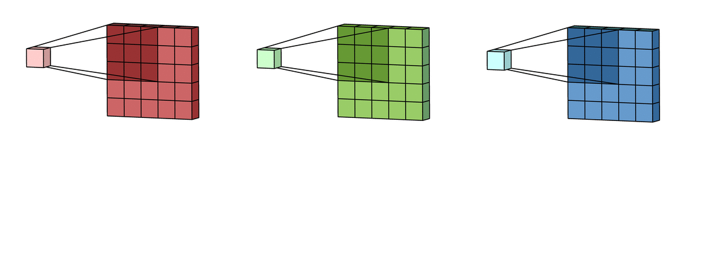

<br>

Then we need to **combine** them (usually **summed up**) to get a **single output value** for that position.


The "[bias](https://www.turing.com/kb/necessity-of-bias-in-neural-networks#)" helps in shifting the activation function and influences the feature maps’ outputs. This is a **constant** that is added to the product of features and weights. It is used to **offset the result**. It helps the models to shift the activation function towards the positive or negative side.

**Additional Definitions**

Let's quickly discuss some additional definitions that are relevant to CNNs.

1. **convolutional layer** consists of **multiple convolutional neurons** &rarr; each neuron has it own filter. Each kernel corresponds to a specific feature or pattern the layer aims to detect within the input data. These kernels,
    - slide spatially across the input data’s width and height
    - independently across each input channel
    - performing convolutions.


<br>

2. **stride** describes the **step** for the movement of a kernel. This is best described by the following diagrams:


<br>

Effects of different stride value:

- larger stride value increases step size &rarr; a smaller output size spatially
- stride of $1$ &rarr; preserves spatial dimensions more accurately

3. **padding** is the addition of **extra border pixels** around input data _before_ applying the convolutions. It helps to preserve the original spatial dimensions of the input data and retains the integrity of border pixels. 


<br>

4. **pooling** involves **downsampling** to reduce the spatial dimensions of feature maps obtained via convolutions &rarr; while **preserving essential information**. This reduces computational loads on the system. Several "pooling functions" exist, _e.g.,_ average of the rectangular neighborhood, L2 norm of the rectangular neighborhood and a weighted average based on the distance from the central pixel. The most popular one is **max pooling** &rarr; it extracts the **maximum value** from each local region within the input feature map, **highlighting the most prominent features**.


<br>

Coming back to our car example from before, we define a CNN with **multiple layers** of neurons that could look like,


<br>

This begs the question &rarr; why multiple layers? Usually each layer has its own unique function,


The [Softmax function](https://en.wikipedia.org/wiki/Softmax_function) converts a vector of $K$ real numbers into a **probability distribution** of $K$ **possible outcomes**. The Softmax function is often used as the last activation function of a neural network to normalize the output of a network to a probability distribution over predicted output classes.

The [fully connected (FC)](https://medium.com/swlh/fully-connected-vs-convolutional-neural-networks-813ca7bc6ee5) layer connect **every** neuron in one layer to every neuron in the other layer. The purpose of this is to combine our features into more attributes to predict the classes even better. In fact, combining more attributes (e.g. edge detect, blur detect, emboss detect) help to predict better the images.


**Read more details about CNNs** &rarr; [1](https://medium.com/@kattarajesh2001/convolutional-neural-networks-in-depth-c2fb81ebc2b2), [2](https://medium.com/@kattarajesh2001/convolutional-neural-network-from-scratch-0d7513d62923).


### CNNs and Object Detection

Regular CNNs can be used for object detection in camera images. But there is one challenge &rarr; they're **limited** to single objects taking up the enitre image. Clearly this is not always the case.

So what happens if we have,

- smaller objects (along with backgrounds)
- multiple objects?

the solution &rarr; **sliding windows**! We break the image down into smaller segments and send each through the CNN-based framework. 


<br>

As we slide the window over the image, we take the resulting image patch and run it through the convolutional neural network to see if it corresponds to any possible object.

1. a window of fixed size slides across the image, pixel by pixel
2. at each position, a classifier determines if the window contains an object of interest
3. the process repeats with windows of different sizes to detect objects at various scales.

In the second figure above, if it’s just an image of the road or the sky, it would be a false prediction. If it’s an image of a car or a person, it would return as a true prediction.

There are some issues to consider:

- what is the right **window size** &rarr; do we start from a small window and keep increasing? 
- the bounding box generated by the algorithm **may not be accurate** &rarr; trade-off between accuracy (fine stride) and efficiency (coarse stride)
- **computationally expensive** &rarr; due to the large number of windows

Hence, multiple techniques have been developed over the years and we discuss some of them here. 

## Object Detection | Parameters

As mentioned earlier, there are two distinct problems to be solved:

- **localization** &rarr; drawing boxes around the objects so that the computer understand **where** things are in a picture.
- **classification** &rarr; **labels each object**. So, if there’s a car in the image, it doesn’t just know it is there; it knows what exactly is that _i.e.,_ a car.

There are some basic parameters we need to define for object localization:

1. **midpoint** $(b_x, b_y)$ &rarr; the **center** of the bounding box
2. **height** and **width** $(b_h, b_w)$ &rarr; dimensions of the bounding box


<br>

We also need to define additional labels &rarr; in order for the machine to localize objects, _viz._,

3. **object probability** $(p_c)$ &rarr; A binary indicator (`1` or `0`) denoting whether an object of interest is present
4. **class labels** &rarr; indicates the **category** of the object (_e.g.,_ car, pedestrian, motorcycle)

Let's consider the following example &rarr; we need to _localize_ objects (a car in this case) in the following image:


<br>

Note that our goal is not only to identify that there is an object in the image but also to **precisely locate it** using a **bounding box**. The picture lists the **output components** for our system, _viz.,_ 

- $p_c$ &rarr; is a particular component present in the image? In this example, we assign, 

| class probabilities | object |
|------------|:-------|
| $pc_1$ | car |
| $pc_2$ | pedestrian|
| $pc_3$ | motorcycle |
||

In this example, $p_c = 1$ (since we find one object, the car) and $pc_1 = 1$, $pc_2 = 0$, $pc_3 = 0$ since only a car was found and no pedestrians or motorcycles. 

We interpret this as &rarr; if $p_c​=1$, the model indicates the presence of an object and the bounding box parameters $(b_x,b_y,b_h,b_w​)$ **precisely locate the object**. The class probabilities $(pc_1,pc_2,pc_3)$ convey the **likelihood of the object belonging to each class**.


<br>

If $p_c=0$, no specified objects are present in the image and the remaining parameters become “**don’t cares**”.

The **loss function** for object localization penalizes the difference between predicted output ($\hat{y}$) and ground truth label ($y$):

|||
|:----|:------|
| $p_c = 1$ <br> (object present) | loss considers **all** components|
| $p_c = 0$ <br> (no object), | loss focuses **only** on $p_c$ |
||


**Re-visiting the Object Localization vs. Object Detection issue**

The key difference between object localization and object detection lies in handling multiple objects:

- **object localization** typically handles a **single object** or a **fixed number** of objects in an image
- **object detection** can identify and locate an **arbitrary number of objects** within an image.

Object detection introduces a more **dynamic approach** to identifying and localizing objects &rarr; overcoming limitations of fixed-box specifications inherent in object localization.

The [Sliding Windows](https://medium.com/@kattarajesh2001/object-detection-part-1-introduction-to-object-detection-321f1fd56295) approach discussed earlier is one example of object detection. 


**[TO BE COMPLETED!]**


## Object/obstacle Avoidance

So far, we have looked at methods to **detect** and **identify** objects in our path. The main goal for this process is to ensure that we _do not collide_ with the objects in our path, either by **stopping** or taking an **alternate path** &rarr; **object (or obstacle) avoidance**.

To [define obstacle avoidance](https://en.wikipedia.org/wiki/Obstacle_avoidance#),

> It is the capability of a robot or an autonomous system/machine to **detect and circumvent obstacles** in its path to reach a predefined destination.

The most obvious way to implement obstacle avoidance is to just use the **sensors** and actively react to obstacles and recalculate new paths, as shown below:


<br>

They follow **three simple steps**: 

- sense
- think
- act. 

They take in inputs of distances in objects and provide the robot with data about its surroundings enabling it to detect obstacles and calculate their distances. The robot then adjusts its trajectory to navigate around obstacles while trying to reach its destination. This can be carried out in real-time. 

While this can work in many simple instances (like the example in the figure), for more complicated situations, _e.g.,_ an autonomous car in an urban environment -- especially when the destination may be far away and it is not obvious that blindly trying to find a way around the obstacles using sensors may be beneficial. 

Contemporary obstacle detection methods span a variety of methods, _viz.,_ 

- reactive strategies
- global planners
- machine-learning based methods


**Note:**  that a lot of obstacle avoidance methods overlap with the [path planning](#path-planning) methods we discussed earlier -- _e.g.,_  the [artifical potential field (APF)](#artificial-potential-field-apf) algorithm, [A* and D* searches](#a-and-d-search) and [RRT](#rapidly-exploring-random-tree-rrt-algorithm) methods -- since their main goal is to find paths through an obstacle field as well.

For instance, consider the weighted A* example in the following figure:


<br>

Now. let's look at some examples of these classes of algorithms.


### Classical/Geometric Methods

These include methods that track the geometry of the space using various "physics-based" concepts, _e.g.,_  the [APF](#artificial-potential-field-apf) method discussed earlier. Other well-known methods in this category include:

**[Vector-Field Histogram (VFH)](https://ieeexplore.ieee.org/stamp/stamp.jsp?tp=&arnumber=88137)** &rarr; that builds a **histogram of obstacle densities** and chooses low-density paths.

The algorithm:

- computes obstacle-free steering directions for a robot based on range sensor readings


<br>

- readings are used to compute **polar density histograms** &rarr;  to identify obstacle location and proximity


<br>


- based on specified parameters and thresholds, the histograms are converted to binary histograms &rarr; to indicate valid steering directions for the robot. 


<br>

Read the [original paper](https://ieeexplore.ieee.org/stamp/stamp.jsp?tp=&arnumber=88137) and [more details](https://web.eecs.utk.edu/~leparker/Courses/CS594-fall08/Lectures/Oct-21-Obstacle-Avoidance-I.pdf).

<br>

**[Dynamic Window Approach](https://www.ri.cmu.edu/pub_files/pub1/fox_dieter_1997_1/fox_dieter_1997_1.pdf)** &rarr; this method **samples the velocity space** and selects safe trajectories based on dynamic constraints.

This approach correctly, and in an elegant manner, incorporates the **dynamics** of the robot &rarr; by reducing the search space to the dynamic window, which consists of the **velocities reachable within a short time interval**. 

Within this dynamic window the approach only considers admissible velocities yielding a trajectory on which the robot can **stop safely**. An objective function considers the **distance to the next obstacle approach**.

Read the [original paper](https://www.ri.cmu.edu/pub_files/pub1/fox_dieter_1997_1/fox_dieter_1997_1.pdf) for more details.


### Model Predictive Control (MPC)

MPC is an advanced method of process control that is used to control a process while **satisfying a set of constraints**. It allows the **current timeslot** to be optimized, while keeping future timeslots in account. This is achieved by,

- optimizing a **finite time-horizon** &rarr; but only implementing the current timeslot and 
- then **optimizing again**, repeatedly.

MPC can **predict future events** &rarr; and react accordingly (as opposed to plain PID).


<br>

MPC is [based on](https://en.wikipedia.org/wiki/Model_predictive_control) **iterative, finite-horizon optimization** of a plant model. At time, $t$, 

- the current plant state is sampled
- a cost minimizing control strategy is computed (via a numerical minimization algorithm) 
- for a relatively short time horizon in the future, $[t+T]$

Specifically, an **online or on-the-fly calculation** is used to explore state trajectories that emanate from the current state and find (via the solution of [Euler–Lagrange equations](https://en.wikipedia.org/wiki/Euler–Lagrange_equation)) &rarr; a cost-minimizing control strategy until time $[t+T]$.

- only the **first step of the control strategy is implemented**
- plant state is **sampled again** 
- calculations are **repeated starting from the new current state**
- yielding a **new control** and **new predicted state path**. 

The prediction **horizon keeps being shifted forward** (MPC is also called _receding horizon control_). 

**Note:**  while MPC is not optimal, in practice it has shown very good results.

**Applying MPC to obstacle avoidance** depends on the fact that &rarr; MPC systems rely on **dynamic models** of the process,


<br>

Once a model has been established, we can set up a control loop as follows:


<br>

Given a reference command, $\mathbf{r}$, the controller generates high rate **vehicle commands**, $\mathbf{u}$ to close the loop with vehicle dynamics. 

This computes the **predicted state trajectory**, $\mathbf{x}(t)$.

The feasibility of this output is checked against **vehicle and environmental constraints**, such as rollover and obstacle avoidance constraints.

MPC often works with path planning algorithms (such as RRT) &rarr; _e.g.,_  [CL-RRT](https://dspace.mit.edu/bitstream/handle/1721.1/52527/Kuwata-2009-Real-Time%20Motion%20Pla.pdf?sequence=1&isAllowed=y), 

- the CL-RRT algorithm grows a **tree of feasible trajectories** (using RRT) &rarr;  originating from the current vehicle state
- attempts to reach a specified goal set
- at the end of the tree growing phase &rarr; **best trajectory** is chosen
for execution
- cycle repeats. 

The quality of the results depends on the **sampling strategies**. Sampling
the space in a purely random manner could result in large numbers of wasted samples due to the numerous constraints. Many methods have been proposed for this purpose. 

Some examples:

|situation| details | image|
|:--------|:--------|:----:|
| intersection | vehicle trying to make a right turn | |
| parking lot | goal is center right edge | |
| u-turn| facing (red) road blockage <br> white and blues samples are forward/back maneouvers| |
||

<br>

Read the [original CLRRT paper](https://dspace.mit.edu/bitstream/handle/1721.1/52527/Kuwata-2009-Real-Time%20Motion%20Pla.pdf?sequence=1&isAllowed=y) for more details and references.

<br>


### Learning-Based Methods

With the advent of ML/AI techniques, an autonomous vehicle can trace a path to its destination using massive amounts of data. It can also **adapt quickly** to changing scenarios/environments. It can achieve this using many testing stages on large data sets of obstacles and environmental conditions. 

ML-based solutions can even be **[mapless](https://ieeexplore.ieee.org/stamp/stamp.jsp?tp=&arnumber=8202134)**. Traditional motion planners for mobile ground robots with range sensors (_e.g.,_  LiDAR) mostly depend on the obstacle map of the navigation environment where both,

- the highly precise laser sensor and 
- the obstacle map building work of the environment 

are indispensable.

Using an asynchronous deep reinforcement learning method, a "mapless" motion planner can be trained end-to-end **without any manually designed features and prior demonstrations**!

1. **[Reinforcement Learning](https://web.stanford.edu/class/psych209/Readings/SuttonBartoIPRLBook2ndEd.pdf)** is a **computational approach** to **learning from interaction**. These methods are  focused on **goal-directed learning from interaction**.

> Reinforcement learning problems involve learning what to do—how to map situations to actions -- so as to **maximize a numerical reward signal**. In an essential way they are **closed-loop** problems because the learning system’s actions influence its later inputs. Moreover, the **learner is not told which actions to take**, as in many forms of machine learning, but instead must **discover which actions yield the most reward by trying them out**. In the most interesting and challenging cases, actions may affect not only the immediate reward but also the next situation and, through that, **all subsequent rewards**.

Three most important aspects of RL:

1. **closed-loop** in an essential way
2. **no direct instructions** as to what actions to take
3. consequences of actions, including reward signals, play out over **extended time periods**.

One of the challenges &rarr; the **trade-off between exploration and exploitation**. To obtain a lot of reward, a reinforcement learning agent must prefer actions that it has **tried in the past and found to be effective** in producing reward. But to discover such actions, it has to **try actions that it has not selected before**. The agent has to exploit what it already knows in order to obtain reward, but it also has to explore in order to make better action selections in the future. 


A key feature of RL is that it explicitly considers the **whole problem** of a goal-directed agent interacting with an uncertain environment &rarr; this is a perfect analogy for path finding/obstacle detection. 

RL is really an interdisciplinary area of machine learning and optimal control. 

Consider this [example](https://web.stanford.edu/class/psych209/Readings/SuttonBartoIPRLBook2ndEd.pdf):

> a mobile robot decides whether it should enter a new room in search of more trash to collect or start trying to find its way back to its battery recharging station. It makes its decision based on the current charge level of its battery and how quickly and easily it has been able to find the recharger in the past.

Here is a [typical framing of the RL problem](https://en.wikipedia.org/wiki/Reinforcement_learning):


<br>

In the above example, an agent takes actions in an environment, which is interpreted into a reward and a state representation, which are fed back to the agent.

The simplest model for RL uses a [Markov Decision Process (MDP)](https://math.uchicago.edu/~may/REU2022/REUPapers/Wang,Yuzhou.pdf) &rarr; _i.e.,_  optimization models for modeling decision-making in situations where outcomes are random, _viz.,_ 

- a set of **environment** and **agent states** (the state space), $S$
- a set of **actions** (the action space), $A$, of the agent
- $P_a\left(s, s^{\prime}\right)=\operatorname{Pr}\left(S_{t+1}=s^{\prime} \mid S_t=s, A_t=a\right)$ &rarr; the transition probability (at time $t$) from state $s$ to $s^{\prime}$ under action $a$
- $R_a\left(s, s^{\prime}\right)$ &rarr; the immediate reward after transition from $s$ to $s^{\prime}$ under action $a$.

The purpose of RL &rarr; agent to learn an optimal (or near-optimal) policy that **maximizes reward function** or other (user-provided) reinforcement signal that accumulates from immediate rewards.

A basic reinforcement learning agent interacts with its environment in **discrete time steps**. At each time step $t$, 

- the agent receives the current state $S_t$ and reward $R_t$
- it chooses an action $A_t$ from the set of available actions
    - subsequently sent to the environment
- environment moves to a new state $S_{t+1}$
- the reward $R_{t+1}$ associated with transition $\left(S_t, A_t, S_{t+1}\right)$ is determined

<br>

Hence, the main **goal** of RL is to **learn a "policy"**, 

$$
\pi: \mathcal{S} \times \mathcal{A} \rightarrow[0,1], \pi(s, a)=\operatorname{Pr}\left(A_t=a \mid S_t=s\right)
$$

that **maximizes the expected cumulative reward**.

Read the book, ["Reinforcement Learning: An Introduction"](https://web.stanford.edu/class/psych209/Readings/SuttonBartoIPRLBook2ndEd.pdf) by Sutton and Barto for a more detailed introduction to RL. 

Here is a [primer on MDP](https://math.uchicago.edu/~may/REU2022/REUPapers/Wang,Yuzhou.pdf) by Wang. 

<br>

**RL Applied to Obstacle Detection**

RL lends itself very nicely to the process of obstacle avoidance &rarr; _i.e.,_  finding a path through an area with multiple obstacles. It comes to defining the **right reward function**.

The following image shows a high-level flow of using (asynchronous) RL &rarr; for a robot to find its way through unfamiliar terrain.  


<br>

Read the paper, ["Virtual-to-real Deep Reinforcement Learning: Continuous Control of Mobile Robots for Mapless Navigation](https://ieeexplore.ieee.org/stamp/stamp.jsp?tp=&arnumber=8202134) by Tai et al. for more details.

<br>

2. **[Imitation Learning](https://arxiv.org/pdf/1604.07316)** attempts to learn policies **from human demonstrations**.

For instance, a system **automatically learns internal representations** of the necessary processing steps (_e.g.,_  detecting useful road features) using **only human steering angles** as training signal!

Here is a high-level diagram of the process:


<br>

The steps are:

- images are fed into a CNN 
- computes a proposed steering command
- proposed command is compared to the desired command for that image
- weights of the CNN are adjusted &rarr; to bring the CNN output closer to desired output
- weight adjustment is accomplished using back propagation.

Once trained, the network can generate steering from the video images of a **single center camera**!

Read the paper, [End to End Learning for Self-Driving Cars](https://arxiv.org/pdf/1604.07316) by Bojarski et al. for more details.


### Trajectory Calculations

Let's look at one [example](https://ieeexplore.ieee.org/document/8519525) where mathematical ("sigmoid functions") are used to estimate a smooth trajectory for avoiding an obstacle &rarr; in this case a moving car that's ahead of you in the same lane.

<details>
<summary>Sigmoid functions</summary>

A [Sigmoid function](https://en.wikipedia.org/wiki/Sigmoid_function) is an **S-shaped mathematical function** that **maps any input** value to an output between `0` and `1`. 


<br>

The most common sigmoid function is the logistic function:

$$
\sigma(x) = \frac{1}{1 + e^{-x}} = \frac{e^x}{1 + e^x} = 1 - \sigma(-x)
$$

Key properties of sigmoid functions:

- smooth, continuous curve
- utput range limited to $(0,1)$
- approaches `0` as $x \rightarrow - \infty$ 
- approaches `1` as $x \rightarrow + \infty$
- has a derivative that is **always positive**
- steepest slope occurs at $x = 0$

</details>

<br>

This method avoids vehicles/obstacles by proposing a **smooth local modified trajectory** of a global path. They use a combination of,

- a parametrized sigmoid function and 
- a rolling horizon (a time-dependant model is solved repeatedly).

The main idea is to react to the obstacles but also to ensure a **smooth** response/trajectory. This is a **local** method that can work in conjunction with a global path planning/obstacle avoidane method. The reference trajectory is calculated simultaneously when the displacement is started.

One of the main considerations &rarr; **execution time** since it is imperative that the solution be calculated and implemented in a reall short amount of time.

Consider the following Sigmoid function:

$$
y(x) = \frac{1}{1 + e^{(-a(x-c))}}
$$

where,

|term|definition|
|-----|:----|
| $y(x)$| lateral offset of the vehicle |
| $x$ | position in longitudinal direction |
| $B# | the "way position", $P3$ <br> to generate obstacle avoidance manoeuvre |
| $c$ | modifies the shape of the function |
| $a$ | slope of the sigmoid |
||

<br>

The following figure shows the shape of the sigmoid ad curvature for various values of $a$,


<br>

The idea us to get from $P1 \rightarrow P3$, **via** $P2$.

- inputs &rarr; obstacle position and position of vehicle
- lateral offset &rarr; calculated based on these parameters

Hence, at a high level, the process looks like:


<br>

1. find a **circular area** around he obstacle &rarr; so that we can compute a **safe** region to avoid and
2. use the sigmoid functions to compute a **smooth trajectory** based on the circular region &rarr; make the transitions smoother and safer.

<br>

|||
|----|:----|
| $S$ | desired **lateral** safety distance |
| $S_m$ | **longitudinal** safety distance |
||

<br>

A "**horizon planning approach**" is used to compute the path by,

- dividing the drivable space into convex regions
- trajectory of each region is computed as the vehicle moves forward.

<br>

The various, incremental steps for the process,

1. approaching another car/obstacle &rarr; too far away to be a problem


<br>

2. object detected
    - safety circle calculated
    - smooth trajectory calculated
    our car (red) moves to new trajectory


<br>

**Note:**  the obstacle (blue car) has moved forward. So our calculations should account for this.

3. move past obstacle
    - we can start to move back to original path/lane
    - complete the trajectory


<br>

Read the full paper [Smooth Obstacle Avoidance Path Planning for Autonomous Vehicles](https://ieeexplore.ieee.org/document/8519525) by Ben-Messaoud et al for all the details.


<br>

**References**

- [Autonomous Driving Architectures: Insights of Machine Learning and Deep Learning Algorithms](https://www.sciencedirect.com/science/article/pii/S2666827021000827?via%3Dihub)
- [Obstacle Avoidance in AMR and AGV Robots Explained](https://www.vecnarobotics.com/resources/obstacle-avoidance-in-amr-and-agv-robots-explained/)
- [Smooth Obstacle Avoidance Path Planning for Autonomous Vehicles](https://ieeexplore.ieee.org/document/8519525)
- [Vector Field Histogram -- Fast Obstacle Avoidance for Mobile robots](https://ieeexplore.ieee.org/stamp/stamp.jsp?tp=&arnumber=88137)
- [The Dynamic Window Approach to Collision Avoidance](https://www.ri.cmu.edu/pub_files/pub1/fox_dieter_1997_1/fox_dieter_1997_1.pdf)
- [Real-Time Motion Planning With Applications to Autonomous Urban Driving](https://dspace.mit.edu/bitstream/handle/1721.1/52527/Kuwata-2009-Real-Time%20Motion%20Pla.pdf?sequence=1&isAllowed=y)
- [Virtual-to-real Deep Reinforcement Learning: Continuous Control of Mobile Robots for Mapless Navigation](https://ieeexplore.ieee.org/stamp/stamp.jsp?tp=&arnumber=8202134)
- [End to End Learning for Self-Driving Cars](https://arxiv.org/pdf/1604.07316)
- Obstacle Avoidance Slides by Prof. Lynne Parker, University of Tennesse Konxville: [[1](https://web.eecs.utk.edu/~leparker/Courses/CS594-fall08/Lectures/Oct-21-Obstacle-Avoidance-I.pdf)], [[2](https://web.eecs.utk.edu/~leparker/Courses/CS594-fall08/Lectures/Oct-23-ObstAvoid-II+Architectures.pdf)]
- [Vector Field Histogram](https://www.mathworks.com/help/nav/ug/vector-field-histograms.html)
- [Reinforcement Learning: An Introduction](https://web.stanford.edu/class/psych209/Readings/SuttonBartoIPRLBook2ndEd.pdf)
- [MARKOV CHAINS AND MARKOV DECISION PROCESSES](https://math.uchicago.edu/~may/REU2022/REUPapers/Wang,Yuzhou.pdf)<!--rel="stylesheet" href="./custom.sibin.css"-->

# Safety and Standards

The [development of self-driving vehicles](https://www.atlantis-press.com/journals/jase/125934832/view) adds layers of (software) intelligence on top of regular vehicles. However, the amount of software needed to achieve "autonomy" will _far_ exceed the current software deployments. This demands a proper structure for such systems. Moreover, there will be a shift from **open, deterministic components** to more opaque, more probabilistic software components. This will raise new challenges for system designers. It also makes the analysis of **safety guarantees** that much harder. 

Multiple standards have been proposed (both domestically in the US as well as internationally). Others are still in development. As the (hardware and software) functionality and complexities increase, the standards themselves will likely have to be updated. One point to highlight is that the _primary_ motivation of autonomous car technologies is reducing the frequency of traffic collisions.

In this chapter, let's take a look at some of the **functional safety** requirements/standards for autonomous systems. 

## Levels of Automation


The [National Highway Traffic Safety Administration(NHTSA)](https://www.nhtsa.gov/vehicle-safety/automated-vehicles-safety#the-topic-safety-timeline) defines **five levels of automation** for vehicles,

- **level 0**: **momentary driver assistance** &rarr; the system provides momentary driving assistance, like warnings and alerts or emergency safety interventions while driver remains fully engaged and attentive. The driver is fully responsible for driving the vehicle.


<br>

Examples: automatic emergency braking, forward collision warning, lane departure warning.

- **level 1: driver assistance** &rarr; the system provides continuous assistance with either acceleration/braking **or** steering, while driver remains fully engaged and attentive. Driver is fully still responsible for driving the vehicle.


<br>

Examples: adaptive cruise control, lane keeping assistance.

- **level 2: additional assistance** &rarr; the system provides **continuous** assistance with both acceleration/braking **and** steering, while driver remains fully engaged and attentive. The driver is still responsible for driving the vehicle.


<br>

Examples: highway pilot.

- **level 3: conditional automation** &rarr; system actively performs driving tasks while **driver remains available** to take over. When engaged, the **system handles all aspects of the driving task** while you, as the driver, are available to take over driving if requested. If the system can no longer operate and prompts the driver, the driver must be available to resume all aspects of the driving task.


<br>

Examples: some of the modern electric cars, \eg Tesla.

- **level 4: high automation** &rarr; the system is **fully responsible** for driving tasks **within limited service areas** while occupants act only as passengers and do not need to be engaged. A human driver is not needed to operate the vehicle.


<br>

Examples: maybe Waymo?

- **level 5: full automation** &rarr; the system is **fully responsible** for driving tasks while occupants act only as passengers and **do not need to be engaged**. The system can operate the vehicle universally – under all conditions and on all roadways. A human driver is not needed to operate the vehicle.

Examples: these technologies do not exist in today's vehicles.


<br>

Here is a [concise chart](https://www.nhtsa.gov/sites/nhtsa.gov/files/2022-05/Level-of-Automation-052522-tag.pdf) that summarizes all of the automation levels.

## SAE J3016 Standard for Functional Safety 

The most well known standard is the [SAE J3016 standard](https://www.atlantis-press.com/journals/jase/125934832/view) that has helped define some of the **functional architectures** in use in modern autonomous systems. 

This notion of "functional architecture" is inspired by the [ISO 26262](https://www.iso.org/standard/68383.html) automotive standard that specifies the,

- **intended functionality** and 
- **interactions** 

necessary for a vehicle to remain **safe**. This matches the "functional views" in software architectures -- code is clustered into groups and distributed to different teams in order to reason about them. It closely aligns with the [V Waterfall](https://dl.acm.org/doi/10.1145/1764810.1764814) model of software development.

First, some definitions:

| **term** | description |
|----------|-------------|
| **OEM** | original equipment manufacturers |
| **ECU** | electronic control units |
| **[CAN](https://www.csselectronics.com/pages/can-bus-simple-intro-tutorial), [Flexray](https://www.ni.com/en/shop/seamlessly-connect-to-third-party-devices-and-supervisory-system/flexray-automotive-communication-bus-overview.html?srsltid=AfmBOoqDL3Ir4GQ0bTWSjM2sK_NnTXp9N7MkCDX6o-wPPwi1YsDbqtz8)** | communication buses/standards |
| **[AUTOSAR](https://www.autosar.org)** | software technology platforms |
||

\note the SAE J3016 standard **does not** provide _strict_ requirements; rather, its purpose is to be _descriptive_ and _broad_ about the evolution of such systems. The idea is to sketch an **incremental evolution** &rarr; from no automation (level `0`) to full automation (level `5`).

This SAE standard defines some important terms (that have become somewhat standard in the industry):
| **term** | **description** | **examples** |
|----------|-----------------|--------------|
| **Dynamic Driving Task (DDT)** | real-time operational and tactical functions required to operate a vehicle, excluding strategic functions such as trip scheduling or route planning. DDT includes actuator control  and tactical planning such as generating and following a trajectory, keeping the vehicle within the lanes, maintaining distance from other vehicles, \etc | steering, braking, lane keeping, trajectory planning |
| **Driving automation system** | hardware and software systems collectively capable of performing some parts or all of the DDT on a sustained basis. Driving automation systems are composed of design-specific functionality called features. Focus is on the interplay between software components to design systems capable of achieving full autonomy. | automated parking, lane keep assistance |
| **Operational Design Domains (ODD)** | specific conditions under which a given driving automation system or feature is designed to function. Requirements vary based on the domain. Full autonomy requires operation in all weather and traffic conditions. | sunny city driving, winter mountain roads |
| **DDT fall-back** | the response by the user or by an Automated Driving System (ADS) to either perform the DDT task or achieve a safety state after a DDT performance-relevant system failure or upon leaving the designated ODD. | user intervention, safety state activation |
| **DDT fall-back-ready user** | the user of a vehicle equipped with an engaged ADS feature who is able to operate the vehicle and is receptive to ADS-issued requests to intervene and perform DDT tasks during a system failure or when requested by the automated vehicle. | driver ready to take control |
| **DDT feature** | a design-specific functionality at a specific level of driving automation with a particular ODD. | lane assistance in sunny weather |
||

<br>

These features/terms can be mapped to the five levels of automation we described earlier:


<br>

Notice,

1. who **monitors** the road &rarr; in the case of no automation up to partial automation (levels 0-2), the environment is monitored by a human driver, while for higher degrees of automation (levels 3-5), the vehicle becomes responsible for environmental monitoring.

2. who is the **fall back** in case of failures/problems &rarr; intelligent driving automation systems (levels 4-5) embed the responsibility for automation fall-back constrained or not by operational domains, while for low levels of automation (levels 0-3) a human driver is fully responsible.

<br>
<br>

The SAE standard defines **three classes of components**:

| class | definition |
|:------|:-----------|
| **operational** | basic vehicle control |
| **tactical** | planning and execution for event or object avoidance and expedited route following |
| **strategic** | destination and general route planning |
||

Each of these classes has an **incremental role** in the design of autonomous systems. The various classes are connected as follows:


<br>

Recall that this is a close analogue to the sensing &rarr; control/planning &rarr; actuation pipeline from before,


<br>

Note that each OEM may choose to implement each of the above components differently. 

As you may have noticed from all the material covered so far, the sensing &rarr; planning &rarr; actuation pipeline can be **decomposed** into smaller components. The following decomposition matches the SAE J3016 standard:


<br>

The **world model** stored data (\eg  maps) maintain knowledge about,

- images
- maps
- entities
- events

and also **relationships** between them. 

World modeling stores and uses **historical information** (from past processing loops) and provides **interfaces** to query and filter its content for other components

**Behavior generation** &rarr; is the **highest cognitive class** of functions in the architecture. It develops a number of possible state sequences from the current state and the behavior reasoning module selects the best alternative.

The data in this decomposed functional diagram, flows **left &rarr; right**.


<br>

To map these back to the operational classes, 

- vehicle control and actuators interface &rarr; **operational** class
- planning class &rarr; **tactical** 
- behavior generation &rarr; **both** strategic and planning class of functions.

In addition, there are **orthogonal classes**, \viz

|orthogonal class| description|
|:---------------|:-----------|
| **data management** | implement long term data storage and retrieval|
| **system and safety management** | represent DDT fall-back mechanisms or other safety concerns &rarr; they act in parallel of normal control loops|
||


<br>

\note there is one other orthogonal class of functions \viz **security**. We will address that in the next chapter.

As you can imagine, this (closely) matches our initial course/system design:


<br>

The functional decomposition diagram shown earlier matches the software components in **[AUTOSAR](https://www.autosar.org)** &rarr; a software standardization architecture that is popular in industry. The interfaces between the various components can be implemented using AUTOSAR's standardized interface definitions. 

The _actual_ interaction between some of the critical components may look like:


<br>

Read the [actual standard](https://sibin.github.io/teaching/csci6907_88-gwu/secure_autonomous/fall_2022/other_docs/J3016_201609.pdf) for a full understanding. Here is a [good explanation](https://www.atlantis-press.com/journals/jase/125934832/view) and summary.


## ANSI/UL 4600 Standard 

The [ANSI/UL 4600](https://users.ece.cmu.edu/~koopman/ul4600/191213_UL4600_VotingVersion.pdf) standard for Safety for the Evaluation of Autonomous Products, provides an umbrella for **coordinating software development practices** and computer-based system safety standards to make sure nothing is left out when **assuring safety**.

This was the first comprehensive standard for public road autonomous vehicle safety to cover both &rarr; urban and highway use cases.

The [key ideas](https://users.ece.cmu.edu/~koopman/ul4600/L109_UL4600.pdf) are:

- system-level safety case provides direction
- vehicle as well as infrastructure and lifecycle processes all matter
- safety metrics used for feedback loops
- third party component interface protects proprietary info
- 4600 helps you know that you’ve done enough work on safety

UL 4600 works towards generating &rarr; **[safety cases](https://ieeexplore.ieee.org/stamp/stamp.jsp?tp=&arnumber=10109263)**. 

The main difference between `4600` and other safety standards is that it is **not prescriptive** (\ie doesn't say "do X"). Rather, it is **goal-oriented**, \ie answering questions such as:

> "what should a safety case address?"

So the idea is to avoid saying, "using this engineering/software approach to solve problem X". 

What are the standards for how to assess a safety case?

- minimum **coverage** requirement (what goes in the safety case?)
- **properties** of a well-formed safety case
- objective **assessment** criteria

<br>

Consider the following example of a safety case using the notion of **claims, arguments and evidence**.

|claim/sub-claim <br>property of system | argument <br> why is it true? | evidence <br> supports argument |
|:-----|:---------|:---------|
| "system avoids pedestrians" | "detects and maneuver to avoid" | tests, simulations, formal analyses |
| "detect pedestrians" (**sub claim**)| - | evidence |
| "maneuvers around pedestrians (**sub claim**) | -- | evidence |
| "stops if can't maneuver" (**sub claim**) | -- | evidence |
|...|...|...|
||

<br>

We can represent this diagrammatically as follows:


<br>

Safety cases need to consider many things:

|||
|:---|:---|
| **technology** | hw/sw, machine learning, tools, … |
| **lifecycle** | deployment, operation, incidents, maintenance, … |
| **infrastructure** | vehicle, roads, data networks, cloud computing, … |
| **road users** | pedestrians, light mobility, emergency responders, … |
| **environment** | operational design domain (odd) definition |
||

<br>

**Safety Performance Indicator (SPI)**

The idea is to provide metrics on the **validity** of safety cases. It is context-dependent and can include many aspects, \eg

- **acceptable violation rate** of standoff to pedestrians
- **gap tolerance** of up to X meters in lane markings
- **false negative rate** for camera/LiDAR
- \etc

Read the [full standard](https://www.shopulstandards.com/ProductDetail.aspx?productid=UL4600) online (select "digital view" and sign up for reading it for free). Here is a [draft version](https://users.ece.cmu.edu/~koopman/ul4600/191213_UL4600_VotingVersion.pdf). 

Here is a video that provides a summary:

<iframe width="560" height="315" src="https://www.youtube.com/embed/xOuQkf1yuW0?si=J9nt2v0Ob5dXqaJk" title="YouTube video player" frameborder="0" allow="accelerometer; autoplay; clipboard-write; encrypted-media; gyroscope; picture-in-picture; web-share" referrerpolicy="strict-origin-when-cross-origin" allowfullscreen></iframe>


## Other Standards/Efforts

1. IEEE has a [suite of standards](https://standards.ieee.org/initiatives/autonomous-intelligence-systems/standards/) that focus on **autonomous and intelligent systems**.
2. NIST has many efforts on [autonomous systems assurance](https://www.nist.gov/programs-projects/autonomous-systems-assurance) to **verify** that autonomous systems function correctly in a wide range of environments. One such is the [Combinatorial Methods for Trust and Assurance](https://csrc.nist.gov/projects/automated-combinatorial-testing-for-software).
3. Wikipedia has a good summary of various [safety/standardization efforts across the world](https://en.wikipedia.org/wiki/Regulation_of_self-driving_cars).


## Self-driving Car Liability

One of the main issues that arises when designing autonomous vehicles, especially ones that operate in the real world, is:

> "who is **liable** for the actions of the car?"

Is it,

- the car **owner**?
- the car **manufacturer**?
- the **software/hardware developers**?
- the **city/state/federal governments**?
- someone else?

This is an active area of research and discussion especially in the legal community. There is a need for existing liability laws to evolve to reasonably identify the appropriate remedies for damage and injury. This become particularly problematic as higher levels of autonomy are implemented &rarr; what about levels `4` and `5`? 

Various countries (the UK, France, Germany, Japan, \etc) have started to draft policies and laws to handle the issues of liability. 

In the US, there is a policy proposal that will rest the [liability with the **manufacturer**](https://digitalcommons.law.scu.edu/cgi/viewcontent.cgi?article=2731&context=lawreview) of the vehicles. 

Some US-based efforts include,

1. NHTSA released a report, "[the Automated Highway System: an idea whose time has come](https://www.thefreelibrary.com/_/print/PrintArticle.aspx?id=16112768)" that provide initial guidelines for a regulatory framework. Some important provisions:
    - states are responsible for determining liability rules for autonomous vehicles. States should consider how to allocate liability among owners, operators, passengers, manufacturers, and others when a crash occurs.
    - determination of who or what is the “**driver**” in a given circumstance **does not necessarily determine liability** for crashes involving that HAV.
2. [H.R. 3388, Self Drive Act](https://www.congress.gov/bill/115th-congress/house-bill/3388#:~:text=The%20bill%20preempts%20states%20from,standards%20identical%20to%20federal%20standards.) passed by the House of Representatives in 2017. Some key ideas:
    - advance safety by **prioritizing the protection of consumers**
    - reaffirm role and responsibilities of federal and state governments
    - update the Federal Motor Vehicle Safety Standards to account 
    for advances in technology and the evolution of highly automated vehicles.

Interestingly, H.R. 3388 is **limiting the role of states**!

There are also efforts to gauge the role of ML/AI in autonomous systems and tracking the liability when such agents are making choices. But since ML/AI is a fast moving field, developing new policies/laws is quite challenging.

The [NTSB investigation of the Tesla crash of 2016](https://www.ntsb.gov/investigations/AccidentReports/Reports/HAR1702.pdf) makes for an interesting read. 

<br>

**References**

- [ISO 26262 standard](https://www.iso.org/standard/68383.html)
- [Standards relevant to automated driving system safety: A systematic assessment](https://www.sciencedirect.com/science/article/pii/S2666691X23000428)
- [A Standard Driven Software Architecture for Fully Autonomous Vehicles](https://www.atlantis-press.com/journals/jase/125934832/view) bu Serban \etal
- [UL 4600: Standard for Safety for the Evaluation of Autonomous Products](https://users.ece.cmu.edu/~koopman/ul4600/index.html) summary of resources page
- [Key Ideas: UL 4600 Safety Standard for Autonomous Vehicles](https://users.ece.cmu.edu/~koopman/ul4600/L109_UL4600.pdf) by Philip Koopman
- [UL 4600: What to Include in an Autonomous Vehicle Safety Case](https://ieeexplore.ieee.org/stamp/stamp.jsp?tp=&arnumber=10109263) by Koopman
- [Proposed First Edition of the Standard for Safety for the Evaluation of Autonomous Products, UL 4600](https://users.ece.cmu.edu/~koopman/ul4600/191213_UL4600_VotingVersion.pdf)
- [UL 4600 official standard site](https://www.shopulstandards.com/ProductDetail.aspx?productid=UL4600)
- [NHTSA Automated Vehicular Safety](https://www.nhtsa.gov/vehicle-safety/automated-vehicles-safety#the-topic-safety-timeline)
- [NHTSA Levels of Automation sheet](https://www.nhtsa.gov/sites/nhtsa.gov/files/2022-05/Level-of-Automation-052522-tag.pdf)
- [IEEE portfolio of AIS technology and impact standards and standards projects](https://standards.ieee.org/initiatives/autonomous-intelligence-systems/standards/)
- [NIST Autonomous Systems Assurance](https://www.nist.gov/programs-projects/autonomous-systems-assurance)
- [NIST Combinatorial Methods for Trust and Assurance](https://csrc.nist.gov/projects/automated-combinatorial-testing-for-software)
- [Wikipedia Self-car Driving Liability](https://en.wikipedia.org/wiki/Self-driving_car_liability)
- [H.R.3388 SELF DRIVE Act](https://www.congress.gov/bill/115th-congress/house-bill/3388#:~:text=The%20bill%20preempts%20states%20from,standards%20identical%20to%20federal%20standards.) -- Safely Ensuring Lives Future Deployment and Research In Vehicle Evolution Act
- [The Coming Collision Between Autonomous Vehicles and the Liability System](https://digitalcommons.law.scu.edu/cgi/viewcontent.cgi?article=2731&context=lawreview) by Marchant \etal
- [The Automated Highway System: an idea whose time has come](https://www.thefreelibrary.com/_/print/PrintArticle.aspx?id=16112768) by Transport Research International
- [NTSB Report on 2016 Tesla Crash](https://www.ntsb.gov/investigations/AccidentReports/Reports/HAR1702.pdf) -- "Collision Between a Car Operating With Automated Vehicle Control Systems and a Tractor-Semitrailer Truck Near Williston, Florida", May 7, 2016.