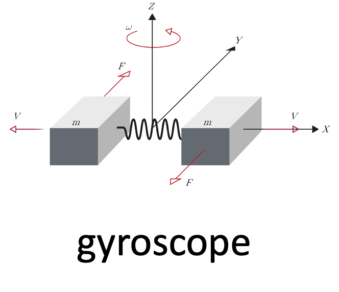
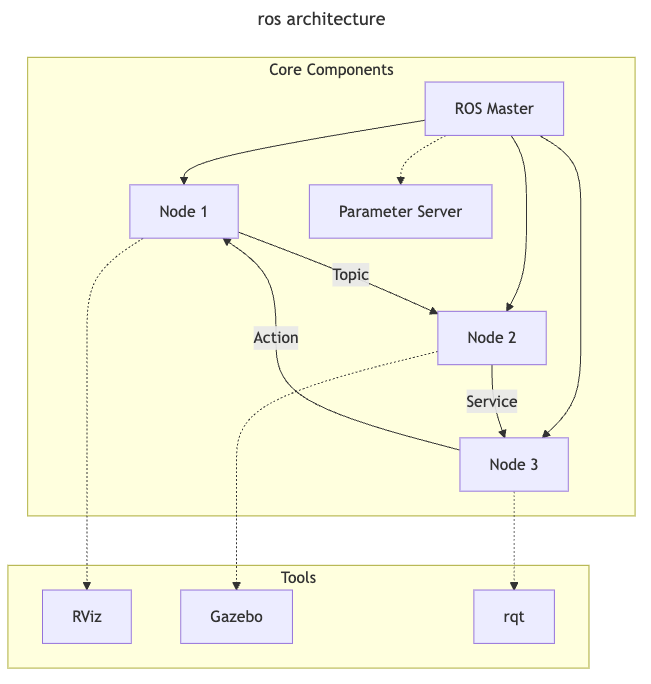
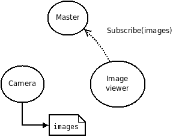

<!--link rel="stylesheet" href="./custom.sibin.css"-->

# introduction

## autonomy

what is "_autonomy_"? 

we see various examples of it...


### what are the _aspects_ of autonomy?

|||
|------------|-----------------------------------------------------------------------------|
| **perception** | how do you "_see_" the world around you? |
| **sensing**    | various ways to perceive the world around you (_e.g_, camera, LiDar)        |
| **compute**    | what do you "_do_" with the information about the world?                    |
| **motion**     | do your computations result in any "_physical_" changes?                    |
| **actuation**  | what "_actions_", if any, do you take for said physical changes?            |
| **planning**   | can you do some "_higher order_" thinking <br> (_i.e.,_ not just your immediate next move) |
 

## let us define **autonomy**

|||
|-----|------|
| Autonomy is the ability to <br> **perform given tasks** <br> based on the systems perception <br> <scb>without</scb> human intervention |   |
||


## autonomous systems

|||||
|------|------|------|------|
|**cyber** |  |  |  |
|**physical** |   |  |  |
||

hence, they fall under the class of systems &rarr; **cyber-physical** systems


## sensors and actuators...

|||
|-----|-----|
|| |
||

...are **everywhere**!

the **embedded** components &rarr; interactions with the real world

## sensing and actuation in the real world

consider the following example of two cars...


the second car is approaching the first


**sensors** &rarr; constantly gathering data/sensing

<div class="multicolumn">
<div>
<ol>
 <li> periodic sensing </li>
</ol>
</div>
<div>

</div>
</div>

on detection (of other car) &rarr; quickly **compute** what to do

<div class="multicolumn">
<div>
<ol>
 <li> periodic sensing </li>
 <li> computation </li>
</ol>
</div>
<div>

</div>
</div>

take **physical action** (actuation) &rarr; say by braking _in time_

<div class="multicolumn">
<div>
<ol>
 <li> periodic sensing </li>
 <li> computation </li>
 <li> actuation </li>
</ol>
</div>
<div>

</div>
</div>

<div class="multicolumn">
<div>
<ol>
 <li> periodic sensing </li>
 <li> computation </li>
 <li> actuation </li>
</ol>
</div>
<div>

</div>
</div>

"**control**"

Remember this &rarr; on detection (of other car) &rarr; <scb>quickly</scb> **compute** what to do


"quickly" compute &rarr; complete computation/actuation &rarr; before a **deadline**

This is a **real-time system**.


### Come back to **sensing**

<!--div class="multicolumn">
<div>
<br>
<ul>
    <li>we see <i>one</i> sensor (maybe LiDAR)</li>
    <li>reality &rarr; <b>multiple</b> sensors</li>
    <li>cameras, radars, lidar, etc.</li>
<ul>
</div>
<div>

</div>
</div-->

Multiple sensors in an autonomous vehicle &rarr; need to _combine_ them somehow

**sensor fusion**

Once we have information from the sensors (fused or otherwise)...


We need **state estimation** (**kalman** filter, **ekf**).

## Overview/Architecture of Autonomous Systems

So far, we have (briefly) talked about...

Sensing:


Actuation:


But the system includes...an **operating system** (OS) in there


and it includes **real-time** mechanisms.

We have briefly discussed, **EKF**:


**note**: ekf is versatile; can be used for sensor fusion, slam, etc.

All of it integrates with...**control**:


There are some **real-time** functions in there...


like _braking_, _engine control_.

Question: if we design such a system...


is it "**autonomous**"?

We are missing some "higher order" functionss from the perspective of the autonomous system:

- _where_ am I?
- _where_ do I need to go?
- _how_ do I get there?
- _what_ obstacles may I face?
- _how_ do I avoid them?


let us not forget the most important question of all...


**why** is gamora?

### high-order functions

In order to answer the following, we need **additional functionality**. Let us go through what that might be.

|||
|-----|------|
| <ul><li>where am I?</li> <li>where do I need to go?</li> <li>how do I get there?</li> <li>what obstacles may I face?</li> <li>how do I avoid them?</li></ul> | |
||


### slam

Simultaneous localization and mapping &rarr; figure out **where** we are.


### waypoint detection

Understand how to move in the _right_ direction at the **micro** level, _i.e.,_ find **waypoints**.


### yolo

Is it "you only live once"? Actually this stands for: "you only **look** once". It is an object **detection** model that uses convolutional neural networks (cnns)


### object avoidance

The objective is to avoid objects in the **immediate path**.


### path planning

i.e., how to get to **destination** at the **macro** level &rarr; uses waypoints.


### compute platform

To run all of these functions, we need low power, embedded platforms.


### still some **non-functional** requirements remain

any guesses what they could be?

### safety!

Essentially safety of &rarr; operator, other people, the vehicle, environment This is **cross-cutting** issue &rarr; affected <scb>by</scb> **all** parts of system.


### security

Security is another cross-cutting issue &rarr; <scb>can affect</scb> **all** components.


### Course Structure

Hence this figure is a (loose) map of this course:


<!--link rel="stylesheet" href="./custom.sibin.css"-->


# Embedded Architectures

Just like "autonomy" describing and "embedded system" is hard. What (typically) distinguishes it from other types of computer systems (e.g., laptops, servers or GPUs even) is that such systems are typically created for _specific_ functionality and often remain fixed and operational for years, decades even.

Embedded systems often trade off between performance and other considerations such as power (or battery life), less memory, fewer peripherals, limited applications, smaller operating system (OS) and so on. There are numerous reasons for this -- chief among them is _predictability_ -- designers need to guarantee that the system works correctly, and remains safe, all the time. Hence, it must be easy to _certify_ [^1] the _entire_ system. This process ensures that the system operates **safely**.

## The **wcet** problem

One piece of information that is required to ensure predictability and guarentee safety is **[worst-case execution time](https://www.cs.fsu.edu/~whalley/papers/tecs07.pdf)** (WCET). The WCET/BCET is the **longest**/shortest execution time possible for a program, **on a specific hardware platform** -- and it has to consider _all possible inputs_. WCET is necessary to ensure the "schedulability", resource requirements and performance limits of embedded and real-time programs. There are lots of approaches to computing the WCET, _e.g.,_

- [dynamic/empirical](https://www.cs.fsu.edu/~whalley/papers/tecs07.pdf) analysis &rarr; run the program lots of times (thousands, millions?) on the platform and measure it
- [static](https://www.cs.fsu.edu/~whalley/papers/tecs07.pdf) analysis &rarr; analyze the program at _compile time_ to compute the _worst-case paths_ through the program
- [hybrid](https://sibin.github.io/papers/2008\_NCSU-Dissertation_CheckerMode_SibinMohan.pdf) &rarr; a combination of the two
- [probabilistic](https://people.ac.upc.edu/fcazorla/articles/jabella_ecrts2014_2.pdf) &rarr; a combination of dynamic analysis+statistical methods
- [ML-based methods](https://dl.acm.org/doi/10.1145/3570361.3615740) &rarr; applying machine-learning to the problem

At a high-level, the execution time distributions of applications look like:


WCET analysis is a very active area of research and hundreds of papers have been written about it, since it directly affects the safety of many critical systems (aircraft, power systems, nuclear reactors, space vehicles and...autonomous systems). 

There are structural challenges (both in software and hardware) that prevent the computation of _proper_ wcet for anything but trivial examples. For instance, consider,

```c
void main()
{
    int max = 10 ;
    int sum = 0;
    for( int i = 0 ; i < max ; ++i)
        sum += i ;
}
```

How do you compute the WCET for this code? Say running on some known processor, P?

Well, there's some information we need, 

- how long each instruction takes to execute on P
- how many loop iterations?
- what is the startup/cleanup times for the program on P?

Let's assume (from the manual for P), we get the following information,

```c
1   void main()         // startup cost = 100 cycles
2   {
3       int max = 15 ;  // 10 cycles
4       int sum = 0;    // 10 cycles 
5       for( int i = 0 ; i < max ; ++i) // 5 cycles, once
6            sum += i ; // 20 cycles each iteration
7   }                   // cleanup cost = 120 cycles
```

So, based on this, we can calculate the total time to execute this program:

$$
wcet = startup\_cost + line\_3 + line\_4 + loop\_startup\_cost + ( line\_6 * max) \quad [1] 
$$

$$
wcet = 100 + 10 + 10 + 5 + (20 * 15) 
$$

$$
wcet = 425\ cycles
$$

Now consider this slight change to the above code:
```c
void main( int argc, char* argv[] )
{
    int max = atoi( argv[1] ) ;     // convert the command line arg to max
    int sum = 0; 
    for( int i = 0 ; i < max ; ++i) // how many iterations?
        sum += i ;
}
```

The problem is that equation [1] above fails since we no longer know the value of `max`. Hence the _program can run for any arbitrary amount of time, depending on the given input!_ Note that **none** of the aforemention wcet methods will help in this case since the input can be completely arbitrary. Hence, the structure of the software code can affect wcet calculations.

Another problem is that of **hardware** (and interactions between hardware and software). Now consider if we modify the original code as,
```c

#define VERY_LARGE_ARRAY+SIZE 1>>18

void main()
{
    int first_array[VERY_LARGE_ARRAY_SIZE] ;
    int second_array[VERY_LARGE_ARRAY_SIZE] ;

    int sum_first = 0;
    int sum_second = 0;
    for( int i = 0 ; i < VERY_LARGE_ARRAY_SIZE * 2 ; ++i)
    {
        if( i%2 )
            first_sum += first_array[i/2] ;
        else
            second_sum += second_array[(int)((i/2)+1)] ;
    }
}
```

Now, while we can compute, using equation [1] the wcet from the code perspective (since we know the loop runs for `VERY_LARGE_ARRAY_SIZE * 2` iterations), there will be significant non-obvious hardware issues, in the **cache**. Each iteration is accessing a _different_ large array. Hence, it will load the cache with lines from that array and in the _very next iteration_ the other array will be loaded, also missing in the cache. For instance, 

| iteration | operation | cache state | reason |
|----------------|----------------------------|-------------------|---------------------------------------------|
| 1 | `first_array` loaded | miss | evicts whatever was previously in cache |
| 2 | `second_array` loaded | miss | **evicts `first_array`** due to lack of space |
| 3 | `first_array` loaded again | miss | **evicts `second_array`** due to lack of space |
|...|
||

Hence, this program will _constantly_ sufffer cache misses and since caches misses (and reloads) are expensive (in terms of time), the loop's execution time will balloon out of control! Hence, even though we fixed the code issue (upper bound on number of iterations, hardware artifacts can change the wcet calculations). So now, we need to _model cache behavior_ for each program and data variable! This is [notoriously complicated](https://user.it.uu.se/~wangyi/pdf-files/2015/lgyrw-acm15.pdf) even for the simplest of programs. 

Other hardware designs further complicate matters, e.g., 

- processor pipelining
- prefetching
- branch prediction
- multithreading
- multicore systems
- memory buses
- networks-on-chip
- and too many others to recount here...

Any contemporary processor design that improves  performance, *turns out to be bad for wcet analysis*. So, the fewer (or simpler versions of) these features, the better it is for the (eventual) safety and certification of the system. 

This is one of the main reasons why embedded (and especially real-time) systems **prefer simpler processors** (simple pipelines, fewer complex features, simpler memory/cache architectures, if any) since they're easier to analyze. In fact, many critical systems (e.g., aircraft, cars, etc.) **use older processors** (often designed in the 1980s and 1990s) -- even the ones beind design today! 


## Embedded Processors

Just as embedded systems are varied, embedded processors come in a myriad of shapes and sizes as well. From the very small and simple (e.g., DSPs) to the very large and complex (modern multicore chips, some with GPUs!). Here is a (non-exhaustive) list of the types of embedded processors/architectures in use today:

1. [Microcontrollers](#microcontrollers)
2. [Digital Signal Processors](#digital-signal-processors-dsps) (DSPs)
3. [Microprocessors](#microprocessors) of various designs and architectures (e.g., ARM, x86)
4. [System-on-a-Chip](#system-on-a-chip-soc) (SoC)
5. [Embedded accelerators](#embedded-accelarators-eg-gpu-enabled-systems)
6. [ASICs and FPGAs](#asics-and-fpgas)


### Microcontrollers

According to [Wikipedia](https://en.wikipedia.org/wiki/Microcontroller),

>   "A microcontroller (MC, UC, or μC) or microcontroller unit (MCU) is a small computer on a single integrated circuit."

These may be among the most common type of "processors" used in embedded systems. According to many studies, **[more than 55%](https://www.embedded.com/the-two-percent-solution/)** of the world's processors are microntrollers! Microcontrollers are typically used in small, yet critical, systems such as car engine control, implantable medical devices, thermal monitoring, [fault detection and classification](https://sibin.github.io/papers/2021_BuildSys_PIRMedic_AshishKashinath.pdf) among millions of other applications. 

Microcontrollers hardware features typically include,

| component | details |
|-----------|---------|
| one (sometimes more) CPU cores | typically simple `4` or `8` bit chips |
| small pipelined architectues | sometimes `2` or `4` stage pipelines |
| some limited memory | typically a few hundred kilobytes, perhaps in the form of EEPROMs or FLASH |
| some programmable I/O | to interact with the real world |
| low operating frequencies | e.g., `4 KHz`; simpler/older processors, yet more predictable |
| low power consumption | in the **milliwatts** or **microwatts** ranges; might even be **nanowatts** when the system is _sleeping_ |
| interrupts (some programmable) | often _real-time_ (ficed/low latency) |
| several general-purpose I/O (GPIO) pins | for I/O |
| timers | e.g., a programmable interval timer (PIT) |
||

<br>

There are some **additional features** found on some microcontrollers, viz.,

| component | details |
|-----------|---------|
| analog to digital (ADC) signal convertors | to convert incoming (real-world, sensor) data to a digital form that the uC can operate on |
| digital-to-analog (DAC) convertor | to do the opposite, convert from digital to analog signals to send outputs in that form |
| universal asynchronous transmitter/receiver (UART) | to receive/send data over a _serial_ line |
| pulse width modulation (PWM) | so that the CPU can control **motors** (significant for us in autonomous/automotive systems), power systems, resistive loads, etc. |
| JTAG interace | debugging interface |
||

<br>

Some examples of popular microcontroller families:

|||||
|----|----|----|----|
|<br>Atmel ATmega |  <br> Microchip Technology |  <br> Motorola (Freescale) |  <br> NXP |
||

Microcontroller programs and data,

- are small --> must fit in memory (since very little expandable memory exists)
- often directly programmed in **assembly**!
    - sometimes the assembly code might need _hand tuning_ --> for both, performance as well as fitting into the limited memory
- **C** is another popular language
- **no operating systems** (or very rare)!
- sometimes have their own special-purpose programming languages or instructions

### Digital Signal Processors (DSPs)

DSPs are specialized microcontrollers optimized for _digital signal processing_. They find wide use in audio processing, radar and sonar, speech recognition systems, image processing, satellites, telecommunications, mobile phones, televisions, etc. Their main goals are to isoloate, measure, compress and filter _analog_ signals in the real world. They often have **stringent real-time constraints**. 

The Texas Instruments DSP chip, [TMS320 Series](https://www.ti.com/lit/ug/spruh79c/spruh79c.pdf?ts=1736945981001) is one of the most famous example of this type of system:


Typical digital signal processing (of any kind) requires repetitive mathematical operations over a large number of samples, in real-time, viz., 
- analog to digital conversion
- maniupulation (the core algorithm)
- digital to analog conversion

Often, the _entire_ process must be completed with low latency, even within a fixed deadline. They also have **low power** requirements since DSPs are often used in battery-constrained devices such as mobile phones. Hence, the proliferation of specialized DSP chips (instead of pure [software implementations](https://liquidsdr.org), which also exist; MATLAB has an entire [DSP System Toolbox](https://www.mathworks.com/help/dsp/index.html)).

**Typical DSP architecture**/flow (credit: [Wikipedia](https://en.wikipedia.org/wiki/Digital_signal_processor)):


These types of chips typically have custom instructions for optimizing certain (mathematical) operations (apart from the typical `add`, `subtract`, `multiply` and `divide`), e.g., 
- `saturate`; caps the minimum or maximum value that can be held in a fixed-point representation
- `ed` ; euclidian distance
- `accumulate` instructions ; for [_multiply-and-accumulate_](https://skills.microchip.com/dsp-features-of-the-microchip-dspic-dsc/693207) operations, i.e., $a \leftarrow a + (b * c )$

> See the [Microchip instruction set](https://ww1.microchip.com/downloads/en/DeviceDoc/sect2.pdf) details for more information for a typical DSP ISA.

DSPs require _optimization of streaming data_ and hence,
- require **optimized memories and caches** &rarr; fetch multiple data elements at the same time
- code may need to be aware of, and **explicitly** manipulate caches
- may have rudimentary OS but **no virtual memory**


### Microprocessors

Microprocessors are, then, **general-purpose** chips (as opposed to microcontrollers and DSPs) that are also used extensively in embedded systems. They are used in systems that need more heavy duty computing/memory and/or more flexibility in terms of programming and management of the system. They use a number of commodity processor architectures (e.g,, ARM, Intel x86). 

Main features of microprocessors:

| component | details |
|-----------|---------|
| cores | single or multicore; powerful |
| pipelines | more complex pipelines; better performance, harder to analyze (e.g., wcet) |
| clock speeds | higher clock speeds; `100s` of khz, or even GHz |
| ISA | common ISA; well understood, not custom |
| memory | significant memory; megabytes, even gigabytes |
| cache hierarchies | multiple levels, optimized |
| power consumption | much higher, but can be reduced (e.g., via [voltage and frequency scaling](https://developer.arm.com/documentation/ddi0375/a/functional-overview/intelligent-energy-management--iem-/dynamic-voltage-scaling--dvs-)) |
| size, cost | often higher |
| interrupts, timers | more varied, easily programmable |
| I/O | more interfaces, including commodity ones like USB |
| security | often includes additional hardware security features, e.g., [ARM TrustZone](https://sefcom.asu.edu/publications/trustzone-explained-cic2016.pdf).
||

The [ARM M-85](https://armkeil.blob.core.windows.net/developer/Files/pdf/product-brief/arm-cortex-m85-product-brief.pdf) Embedded Microprocessor architecture:


When compared to microcontrollers (or even SoCs), most microprpcessors **do not** include components such as DSPs, ADCs, DACs, etc. It is possible to _augment_ the microprocessor to include this functionality &rarr; usually by _connecting one or more microcontrollers to it_!

On the software side, microprocessors typically have the **most flexibility**:

- general purpose operating systems (e.g., Linux, Android, Windows, UNIX, etc.)
- most programming languages and infrastructures (even [Docker](https://www.docker.com/blog/getting-started-with-docker-for-arm-on-linux/)!)
- large number of tooling, analysis, debugging capabilities
- complex code can run, but **increases analysis difficulty**

Due to their power (and cost) these types of systems are only used when really necessary or in higher-end systems such as mobile phones and autonomous cars. 


### System-on-a-Chip (SoC)

An SoC **integrates** most components in and around a processor into a **single** circuit, viz.,

- processor/chip &rarr; could be a microcontroller or even a microprocessor
- memory and memory interfaces
- I/O devices
- buses (memory and I/O)
- storage (e.g., flash) and sometimes even secondary storage
- radio modems
- (sometimes) accelerators such as GPUs

All of these are placed on a **single substrate**. 

SoCs are often designed in `C++`, `MATLAB`, `SystemC`, etc. Once the hardware architectures are defined, additional hardware elements are written in hardware description languages, e.g., register transfer levels (`RTL`) [^2]. 

Additional components could include,

- DAC
- ADC
- radio and signal processing
- wireless modems
- [_programmable logic_](https://www.amd.com/en/products/adaptive-socs-and-fpgas/soc/zynq-7000.html). 
- networks on chip (NoC) [^3]

In some sense, an SoC is an _integration of a processor with peripherals_. New hardware elements

Some examples of modern SoCs:

<div class="multicolumn">
<div>


Broadcom Soc from Raspberry Pi
</div>
<div>


Apple M1 SoC
</div>
</div>

The integration of all hardware components has some interesting side-effects:

| effect | benefit | problems |
|----------|---------|----------|
| tight integration | better performance, fewer latencies | cannot replace individual components |
| custom code/firmware | better use of hardware | not reusable in other systems |
| custom software libraries | easier programming of SoC | reduces code reusability in other systems |
| low power consumption | better battery life, less heat | (potentially) slower |


Depending on the processor/microcontroller that sits at the center of the SoC, the software stack/capabilities can vary. Many commons SoCs exhibit the following software properties:

- usually use contemporary operating systems, though optimized for embedded/SoC systems &rarr; e.g., [Raspbian](http://www.raspbian.org) aka Rasberry Pi OS. Hence, they can handle multiprocessing, virtual memory, different scheduling policies, etc. 
- can be programmed using most common programming languages &rarr; `C`, `C++`, `python`, `java`, even [`lisp`](https://medium.com/@kenichisasagawa/rediscovering-the-joy-of-hardware-hacking-with-raspberry-pi-and-lisp-574c833ab20e)!

The Raspberry Pi is a common example of a system that uses a [Broadcom BCM series of SoCs](https://www.raspberrypi.com/documentation/computers/processors.html). We use the [BCM2711](https://www.raspberrypi.com/documentation/computers/processors.html#bcm2711) SoC in our course for the Raspberry Pi 4-B.


### Embedded Accelarators (e.g. GPU-enabled systems)

There are hardware platforms that include **accelerators** in embedded systems, e.g., [GPUs](https://www.nvidia.com/en-us/autonomous-machines/embedded-systems/), [AI-enabled silicon](https://www.nature.com/articles/s41928-022-00778-y), [extra programmable FPGA fabric](https://www.amd.com/en/products/adaptive-socs-and-fpgas/soc/zynq-7000.html), [security features](https://developer.arm.com/documentation/100230/0002/functional-description/external-coprocessors/configuring-which-coprocessors-are-included-in-secure-and-non-secure-states), etc. The main idea is that certain computation can be _offloaded_ to these accelerators while the main CPU continues to process other code/requests. The accelerators are specialized for certain computations (e.g., parallel matrix multiplications on GPUs, AES encryption). Some chips include FPGA fabric where the designer/user can _implement their own custom logic/accelerators_. 

In a loose sense, the [Navio2](https://navio2.hipi.io) can be considered as a hardware coprocessor for the Raspbery Pi.

The [NVidia Jetson Orin](https://www.nvidia.com/en-us/autonomous-machines/embedded-systems/jetson-orin/) is a good example of an AI/GPU focussed embedded processor:


<br>

This system's [specifications](https://www.techpowerup.com/gpu-specs/jetson-agx-orin-64-gb.c4085):

- 1300 MHz clock speeds
- 64 GB Memory
- 256 bit memory bus
- 204 GB/s bandwidth
- supports a variety of graphics features (DirectX, OpenGL, OpenCL, CUDA, Vulkan and Shader Models )
- maximum of 60W power
- **275 trillion** operations/s (TOPS)!

These systems are finding a lot of use in autonomous systems since they pack so much processing power into such a small form factor


### ASICs and FPGAs

Application-specific integrated circuits (ASICs) and field programmable gate arrays (FPGAs). These platforms combine the advantages of both, hardware (_speed_) and software (_flexibility/programmability_). They are similar, yet different. Both are semiconductor devices that include **programmable logic gates** but an ASIC is _static_ -- i.e., once the board has been "programmed" it cannot be changed while an FPGA, as the name implies, allows for "reprogramming". 

ASICs are **custom-designed** for specific applications and provide high efficiency and performance. FPGAs are **reprogramamble** devices that provide significant flexibility. Many designers also used it for prototyping hardware components (before they are eventually included either in the processors or custom ASICs). The [choice between ASICs and FPGAs](https://www.wevolver.com/article/asic-vs-fpga) depends entirely on the application requirements and other factors such as cost.


|||
|----|----|
|| | 
| An ASIC | Xilinx Spartan FPGA|
||

#### ASICs

These are specialized semiconductor devices -- to implement a _custom_ function, e.g., cryptocurrency mining, nuclear reactor control, televisions. ASICs are tailored to their specific applications. Once created, it cannot be reprogrammed or modified. ASICs are created using a process known as [photolithography](https://www.sciencedirect.com/topics/physics-and-astronomy/photolithography), a method to prepare nanoparticles, that allows components to be "etched" on to a silicon wafer. 

The [ASIC design process](https://www.wevolver.com/article/the-ultimate-guide-to-asic-design-from-concept-to-production), while expensive and time consuming, becomes valuable for _high-volume_ products as the per-unit cost decrease when production nunbers increase. 

| advantages | disadvantages |
|------------|---------------|
| high performance | lack of flexibility |
| low power consumption | high initial costs |
| small form factor | long development time |
| ip protection | obsolescence risk |
| good for mass production | risks with manufacturing yields |
| can integrate multiple functions | design complexity |
||


#### FPGAs

These are also semiconductor devices but they can be **preprogrammed** to implement various circuits and functions. Designers can change the functionality **after** the curcuits have been embossed onto the hardware. Hence, they're good for systems that might require changes at design time and rapid prototyping. An FPGA is a collection of programmable logic and interconnects. They include lookup tables (LUTs) and other parts that can be used to develop multiple, fairly wide-ranging, functions. The programmable blocks can be connected to each other via the interconnects. Some FPGAs even come with additional flash memory. 

[FPGAs are programmed](https://www.wevolver.com/article/fpga) using hardware description languages such as Verilog/VHDL.

| advantages | disadvantages |
|------------|---------------|
| flexibility | lower performance |
| shorter development time | higher power consumption |
| upgradability | high design complexity |
| lower (initial) costs | higher per-unit costs |
| better processing capabilities | design complexity |
| lower obsolescence risks | larger form factor |


## Communication and I/O

Embedded systems need to **communicate** and/or **interface** with various elements:

- the physical world via sensors and actuators
- computers for programming (of the embedded system) or for data transfer
- with other embedded systems/nodes
- handheld devices
- with the internet (either public or to access back end servers)
- satellites?

Hence a large number of communication standards and I/O interfaces have been developed over the years. Let's look at a few of them:

1. [serial (UART)](#uart--rs-232) &rarr; e.g., RS 232
2. [synchronous](#synchronous--i2c-and-spi) &rarr; I2C, SPI
3. [general-purpose I/O](#general-purpose-io-gpio) &rarr; GPIO
4. [debugging interface](#jtag-debugging-interface) &rarr; JTAG
5. [embedded internal communication](#controller-area-network-can) &rarr; CAN
6. [other broadly used protocols](#other-broadly-used-protocols) &rarr; USB, Ethernet/WiFi, Radio, Bluetooth


### UART | RS-232

Serial communication standards are used extensively across many domains, mainly due to their **simplicity** and **low hardware overheads**. The most common among these are the _asynchronous serial communication systems_.

From [Wikipedia](https://en.wikipedia.org/wiki/Asynchronous_serial_communication): 

> Asynchronous serial communication is a form of serial communication in which the communicating endpoints' interfaces are not continuously synchronized by a common clock signal. Instead of a common synchronization signal, the data stream contains synchronization information in form of start and stop signals, before and after each unit of transmission, respectively. The start signal prepares the receiver for arrival of data and the stop signal resets its state to enable triggering of a new sequence.

The following figure shows a communication sample that demonstrates these principles:


We see that each byte has a `start` bit, `stop` bit and eight `data` bits. The last bit is often used as a `parity` bit. All of these "standards" (i.e., the start/stop/parity bits) must be _agreed upon ahead of time_.

A **universal asynchronous receiver-transmitter** (**UART**) then is a peripheral device for such asynchronous commnication; the data format and transmission speeds are configurable. It sends data bits _one-by-one_ (from least significant to most). The precise timing is handlded by the communication channel. 

The electric _signalling levels_ are handled by an external driver circuit. Common signal levels:

- [RS 232](https://www.analog.com/en/resources/technical-articles/fundamentals-of-rs232-serial-communications.html) 
- [RS-485](https://www.renkeer.com/what-is-rs485/)
- raw [TTL](https://www.seeedstudio.com/blog/2019/12/11/rs232-vs-ttl-beginner-guide-to-serial-communication)

Here we will focus on the **RS-232** standard since it is most widely used UART signaling level standard today. The full name of the standard is: "EIA/TIA-232-E Interface Between Data Terminal Equipment and Data Circuit-Termination Equipment Employing Serial Binary Data Interchange" ("EIA/TIA" stands for the Electronic Industry Association and the Telecommunications Industry Association). It was introduced in 1962 and has since been updated _four_ times to meet evolving needs. 

The RS-232 is a _complete_ standard in that it specifies,

- (common) voltage and signal levels
- (common) pin and wiring configurations
- (minimal) control information between host/peripherals 

The RS-232 specifies the electrical, functional and mechanical characteristics to meet all of the above criteria. 

For instance, the _electrical_ characteristics are defined in the following figure:


Details:

- **high** level [**logical `0`**] (aka "marking") &rarr; `+5V` to `+15V` (realistically `+3V` to `+15V`)
- **low** level [**logical `1`**] (aka "spacing") &rarr; `-5V` to `-15V` (realistically `-3V` to `-15V`)

Other properties also defined, _e.g._, "[slew rate](https://en.wikipedia.org/wiki/Slew_rate)", impedance, capacitive loads, etc. 

The standard also defines the mechanical interfaces, i.e., the _pin connector_:


While the official standard calls for a 25-pin connector, it is rarely used. Instead, the **9-pin** connector (shown on the right in the above figure) is in common use.

You can read more details about the standard here: [RS 232](https://www.analog.com/en/resources/technical-articles/fundamentals-of-rs232-serial-communications.html)


### Synchronous | I<sup>2</sup>C and SPI

Synchronous Serial Interfaces (SSIs) are a widely used in industrial applications between a master device (e.g. controller) and a slave device (e.g. sensor). It is based on the [RS-422](https://www.analog.com/media/en/technical-documentation/tech-articles/guide-to-selecting-and-using-rs232-rs422-and-rs485-serial-data-standards--maxim-integrated.pdf) standards and has a high protocol efficiency as well multiple hardware implementations.

SSI properties:

- [differential signalling](https://en.wikipedia.org/wiki/Differential_signalling)
- simplex (i.e., unidirectional communication only)
- non-multiplexed
- point-to-point and 
- uses time-outs to frame the data. 


#### I<sup>2</sup>C

The [Inter-Integrated Circuit](https://www.ti.com/lit/an/sbaa565/sbaa565.pdf) (I<sup>2</sup>C, IIC, I2C) is a synchronous, multi-controller/multi-target (historically termed as multi-master/multi-slave), single-ended, serial communication bus. I2C systems are used for _attaching low-power integrated circuits to processors and microcontrollers_ -- usually for short distance or _intra-board communication_.

I2C components are found in a wide variety of products, _e.g.,_

- EEPROMs
- VGA/DVI/HDMI connectors
- NVRAM chips
- real-time clocks
- reading hardware monitors and sensors
- controlling actuators 
- DAC/ADC
- controlling LCD/OLEDs displays 
- changing computer display settings (contrast, brightness, etc.)
- controlling speaker volume
- and many many more

The main advantage of I2C is that a microcontroller can control a _network_ of chips with just **two** general-purpose I/O pins (serial data line and a serial clock line) and software. A controller device can communicate with any target device through a unique I2C address sent through the serial data line. Hence the two signals are:

|line|voltage| description|
|------|-------|-------|
| serial data line (SDL) | `+5V` | transmit data to or from target devices |
| serial clock line (SCL) | `+3V` | synchronously clock data in or out of the target device |
||

Both are bidirectional and pulled up with resistors.

Here is a typical implementation of I2C:


An I2C chip example (used for controlling certain TV signals):


I2C is half-duplex communication where only a single controller or a target device is sending data on the bus at a time. In comparison, the serial peripheral interface (SPI) is a full-duplex protocol where data can be sent to and received back at the same time. An I2C controller device starts and stops communication, which removes the potential problem of bus contention. Communication with a target device is sent through a unique address on the bus. This allows for both multiple controllers and multiple target devices on the I2C bus.

I2C communication details (initiated from the controller device):

| condition | description |
|-----------------|-------|
| I2C `START`| the controller device first pulls the SDA low and then pulls the SCL low |
| I2C `STOP` | the SCL releases high and then SDA releases high |
||


<br>

I2C communication is split into: **frames**. Communciation starts when one controller sends an `address frame` after a `START`. This is followed by one or more `data frames`, each consisting of **one byte**. Each frame also has an `acknowledgement` bit. An example of two I2C communication frames:


<br>

You can read more at: [I2C](https://www.ti.com/lit/an/sbaa565/sbaa565.pdf).


#### SPI

The [Serial Peripheral Interface](https://www.analog.com/en/resources/analog-dialogue/articles/introduction-to-spi-interface.html) (SPI) has become the de facto standard for _synchronous_ serial communication. It is used in embedded systems, especially between microcontrollers and peripheral ICs such as sensors, ADCs, DACs, shift registers, SRAM, _etc._

The main aspect of SPI is that one main device **orchestrates communication** with one ore more sub/peripheral devices by **driving the clock and chip select signals**.

SPI interface properties:

- _synchronous_
- _full duplex_
- _main-subnode_ (formerly called "master-slave")
- data from the main or the subnode is synchronized on the rising or falling clock edge
- main and subnode can transmit data at the same time
- interface can be 3 or 4-wire (4 wire version is more popular)

|microchip SPI|basic SPI Interface|
|------|-------|
| ||
||

The SPI interface contains the following wires:

| signal | description | function |
|--------|-------------|----------|
| `SCLK`   | serial clock | clock signal from main |
| `CS`     | chip/serial select | To select which host to communicate with |
| `MOSI`   | main out, subnode In | serial data out (SDO) for host to target communication |
| `MISO`   | main in, subnode Out | serial data in (SDI) for target to host communication |
||

The main node generates the clock signal. Data transmissions between main ahd sub nodes is synchronized by that clock signal generated by main. SPI devices support _much higher clock frequencies_ than I2C. The `CS` signal is used to select the subnode. Note that this is an **active low signal**, _i.e.,_ a low (`0`) is a selection and a high (`1`) is a disconnect. SPI is a full-duplex interface; both main and subnode can send data at the same time via the MOSI and MISO lines respectively. During SPI communication, the data is simultaneously transmitted (shifted out serially onto the MOSI/SDO bus) and received (the data on the bus (MISO/SDI) is sampled or read in).

**Example**: the [following example](https://www.analog.com/en/resources/analog-dialogue/articles/introduction-to-spi-interface.html) demonstrates the significant savings and simplification in systems design (reduce the number of GPIO pins required). 

Consider the ADG1412 switch being managed by a microcontroller as follows:


Now, as the number of switches increases, the requirement on GPIO pins also increases significantly. A `4x4` configuration requires `16` GPI pins, thus reducing the number of pins available for the microcontroller for other tasks, as follows:


One approach to reduce the number of pins would be to use a serial-to-parallel convertor:


This reduces the pressure on the number of GPIO pins but still introduces additional circuitry. 

Using an SPI-enabled microcontroller reduces the number of GPIOs required and and eliminates the overheads of the needing additional chips (serial-to-paralle convertor):


In fact, using a different SPI configuration ("**daisy-chain**"), we can optimize the GPIO count even further!


You can read more about [SPI here](https://www.analog.com/en/resources/analog-dialogue/articles/introduction-to-spi-interface.html).


### General-Purpose I/O (GPIO)

A GPIO is a **signal pin** on an integrated circuit or board that can be used to perform _digital I/O operations_. By design, it **has no predefined purpose** &rarr; can be used by hardware/software developers to perform functions _they choose_, _e.g.,_

- GPIO pins can be enabled or disabled.
- GPIO pins can be configured to be input or output.
- input values are readable, often with a 1 representing a high voltage, and a 0 representing a low voltage.
- input GPIO pins can be used as "interrupt" lines, which allow a peripheral board connected via multiple pins to signal to the primary embedded board that it requires attention.
- output pin values are both readable and writable.

GPIOs can be implemented in a variety of ways,

- as a _primary_ function of the microcontrollers, _e.g._, [Intel 8255](https://www.geeksforgeeks.org/programmable-peripheral-interface-8255/)
- as an _accessory_ to the chip

While microcontrollers may use GPIOs are their primary external interface, many a time the pins may be capable of other functions as well. In such instances, it may be necessary to configure the pins using other functions. 

Some examples of chips with GPIO pins:

|Intel 8255|PIC microchip|ASUS Tinker|
|------|-------|---------|
| | |  |
|24 GPIO pins |29 GPIO pins| 28 GPIO pins|
||


GPIOs are used in a diverse variety of applications, limited only by the electrical and timing specifications of the GPIO interface and the ability of software to interact with GPIOs in a sufficiently timely manner.

Some "properties"/applications of GPIOs:

- GPIOs use standard logic levels and cannot supply significant current to output loads
- high-current output buffers or relays can be used to control high-power devices
- input buffers, relays, or opto-isolators translate incompatible signals to GPIO logic levels
- GPIOs can control or monitor other circuitry on a board, such as enabling/disabling circuits, reading switch states, and driving LEDs
- multiple GPIOs can implement bit banging communication interfaces like I²C or SPI
- GPIOs can control analog processes via PWM, adjusting motor speed, light intensity, or temperature
- PWM signals from GPIOs can be converted to analog control voltages using RC filters

GPIO interfaces vary widely. Most commonly, they're simple _groups of pins_ that can switch between input/output. On the other hand, each pin can be set up differently &rarr; set up/accept/source different voltages/drive strengths/pull ups and downs. 

Programming the GPIO:

- usually pin states are exposed via different interfaces, _e.g.,_ **memory-mapped I/O** peripherals or dedicated I/O port instructions 
- input values can be used as interrupts (IRQs)

For more information on programming/using GPIOs, read these: [GPIO setup and use](https://docs.oracle.com/javame/8.0/me-dev-guide/gpio.htm), [Python scripting the GPIO in Raspberry Pis](https://www.instructables.com/Raspberry-Pi-Python-scripting-the-GPIO/), [general purpose I/O](https://docs.nordicsemi.com/bundle/ps_nrf52810/page/gpio.html), [GPIO setup in Raspberry Pi](https://projects.raspberrypi.org/en/projects/physical-computing/1).


### JTAG Debugging Interface

The JTAG standard (named after the "Joint Test Action Group"), technically the [IEEE Std 1149.1-1990 IEEE Standard Test Access Port and Boundary-Scan Architecture](https://web.archive.org/web/20170830070123/http://www.intel.com/content/dam/www/public/us/en/documents/white-papers/jtag-101-ieee-1149x-paper.pdf), is an industry standard for **testing and verification of printed circuit boards**, _after manufacture_.

"JTAG", depending on the context, could stand for one or more of the following:

- implementation of IEEE 1149.x for Board Test, or Boundary Scan testing
- appliance used to program on board flash or eeprom devices on a circuit board
- hardware device used to debug microprocessor software
- hardware device used to test a board using Boundary Scan

The basic building block of a JTAG OCD is the **Test Access Point** or **TAP controller**. This allows access to all the custom features within a specific processor, and must support a minimum set of commands. On-chip debugging is a _combination of hardware and software_. 

| type     | description |
|----------|-----------|
| hardaware | **on chip debug** (OCD)|
| software  | **in-circuit-emulator** (ICE)/JTAG emulator |
||

The off-chip parts are actually PC peripherals that need corresponding drivers running on a separate computer. On most systems, JTAG-based debugging is available from the very first instruction after CPU reset, letting it assist with development of early boot software which runs before anything is set up. The JTAG emulator allows developers to access the embedded system at the **machine code level** if needed! Many silicon architectures (Intel, ARM, PowerPC, etc.) have built entire infrastructures and extensions around JTAG.

A high-level overview of the JTAG architecture/use:


<br>

JTAG now allows for,

- processors can not be _halted_, _single-stepped_ or _run freely_
- can set code _breakpoints_ for both, code in RAM as well as ROM/flash
- _data breakpoints_  are available 
- _bulk data download_ to RAM
- _access to registers and buses_, even without halting the processors!
- _complex logic routines_, _e.g.,_ ignore the first seven accesses to a register from one particular subroutine

JTAG allows for _device programmer hardware_ allows for transfering data into internal, _non-volatile_ memory of the system! Hence, we can use JTAGs to **program** devices such as FPGAs. In fact, many memory chips also have JTAG interfaces. Some modern chips also allow access to the the (internal and external) data buses via JTAG.

**JTAG interface**: depending on the actual interface, JTAG has 2/4/5 pins. The 4/5 pin versions are designed so that _multiple chips_ on a board can have their JTAG lines **daisy-chained** together if specific conditions are met.

 Schematic Diagram of a JTAG enabled device:

 

 The various pins signals in the JTAG TAP are:

| signal | description |
|--------|-------------|
| `TCK` | synchronizes the internal state machine operations |
| `TMS` | sampled at the rising edge of `TCK` to determine the next state |
| `TDI` | data shifted into the device’s test or programming logic; sampled at the rising edge of `TCK` when the internal state machine is in the correct state |
| `TDO` | represents the data shifted out of the device’s test or programming logic and is valid on the falling edge of `TCK` when the internal state machine is in the correct state |
| `TRST` | optional pin which, when available, can reset the tap controller’s state machine |
||

The TAP controller implements the following state machine:


<br>

To use the JTAG interface, 

- host is connected to the target's JTAG signals (`TMS`, `TCK`, `TDI`, `TDO`, etc.) through some kind of JTAG adapter
- adapter connects to the host using some interface such as USB, PCI, Ethernet, etc.
- host communicates with the TAPs by manipulating `TMS` and `TDI` in conjunction with `TCK` 
- host reads results through `TDO` (which is the only standard host-side input)
- `TMS`/`TDI`/`TCK` output transitions create the basic JTAG communication primitive on which higher layer protocols build

<br>

For more information about JTAG, read: [Intel JTAG Overview](https://web.archive.org/web/20170830070123/http://www.intel.com/content/dam/www/public/us/en/documents/white-papers/jtag-101-ieee-1149x-paper.pdf), [Raspberry Pi JTAG programming](https://forums.raspberrypi.com/viewtopic.php?t=286115), [Technical Guide to JTAG](https://www.xjtag.com/about-jtag/jtag-a-technical-overview/) and the [JTAG Wikipedia Entry](https://en.wikipedia.org/wiki/JTAG) is quite detailed.


### Controller Area Network (CAN)

CAN is a vehicle bus standard to enable efficient communication between electronic control units (ECUs). CAN is,

- broadcast-based
- message-oriented
- uses arbitration &rarr; for data integrity/prioritization

CAN **does not** need a a host controller. ECUs connected via the CAN bus can easily share information with each other. all ECUs are connected on a two-wire bus consisting of a twisted pair: CAN high and CAN low. The wires are often color coded: 

|||
|-----|------|
|CAN high| yellow| 
|CAN low | green|
||

|||
|------|--------|
|  |  |
|CAN wiring | multi-ecu CAN setup|
||

<br>

An ECU in a vehicle consists of:

<table>
    <tr>
        <th>components</th>
        <th>internal architecture</th>
    </tr>
    <tr>
        <td>
            <ul>
                <li><b>microcontroller</b> to interpret/send out CAN messages</li>
                <li><b>CAN controller</b> ensures all communication adheres to CAN protocols</li>
                <li><b>CAN transceiver</b> connects CAN controller to the physical wires</li>
            </ul>
        </td>
        <td>
            
        </td>
    </tr>
    <tr> <td></td> <td></td></tr>
</table>

_Any_ ECU can broadcast on the CAN bus and the messages are accepted by _all_ ECUs connected to it. Each ECU can either choose to ignore the message or act on it.

> what are the implications for **security**?

While there is no "standard" CAN connector (each vehicle may use different ones), the **CAN Bus DB9** connector has become the de facto standard:


The above figure shows the various pins and their signals.

<br>

**CAN Communication Protocols**: CAN is split into:

<table>
    <tr>
        <th>layer</th>
        <th>relation to OSI stack</th>
    </tr>
    <tr>
        <td>
            <ul>
                <li><b>data link</b>: CAN frame formats, <br>error handling, data transmission, <br>data integrity</li>
                <li><b>physical</b>: cable types, <br>electrical signal levels, <br>node requirements, <br>cable impedance, etc.</li>
            </ul>
        </td>
        <td>
            
        </td>
    </tr>
    <tr> <td></td> <td></td></tr>
</table>

<br>

All communication over the CAN bus is done via the **CAN frames**. The _standard_ CAN frame (with an `11-bit` identifier) is shown below:


<br>

While the lower-level CAN protocols described so far work on the two lowest layers of the OSI networking stack, it is still limiting. For instance, the CAN standard doesn't discuss how to,

- decode RAW data
- handle larger data (more than 8 bytes)


Hence, some **higher-order** protocols have been developed, _viz.,_

|protocol|description|
|--------|-----------|
|[OBD2](https://www.csselectronics.com/pages/obd2-explained-simple-intro) | on-board diagnostics in cars/trucks for diagnostics, maintenance, emissions tests |
|[UDS](https://www.csselectronics.com/pages/uds-protocol-tutorial-unified-diagnostic-services) | Unified Diagnostic Services (UDS) used in automotive ECUs for diagnostics, firmware updates, routine testing|
|[CCP/XCP](https://www.csselectronics.com/pages/ccp-xcp-on-can-bus-calibration-protocol) | used in embedded control/industrial automation for _off-the-shelf interoperability_ between CAN devices|
|[SAE J1939](https://www.csselectronics.com/pages/j1939-explained-simple-intro-tutorial) | for heavy-duty vehicles |
|[NMEA 2000](https://www.csselectronics.com/pages/nmea-2000-n2k-intro-tutorial )| used in maritime industry for connecting e.g. engines, instruments, sensors on boats|
|[ISOBUS](https://www.csselectronics.com/pages/isobus-introduction-tutorial-iso-11783)| used in agriculture and forestry machinery to enable plug and play integration between vehicles/implements, _across brands_|
||

There also exist other higher-order protocols (numbering in the thousands) the most prominent of which are: ARINC, UAVCAN, DeviceNet, SafetyBUS p, MilCAN, HVAC CAN. 

<br>

More details about CAN and its variants: [CAN Bus Explained](https://www.csselectronics.com/pages/can-bus-simple-intro-tutorial).


### Other Broadly Used Protocols 

Autonomous (and other embedded systems) use a variety of other communication protocols in order to interface with the external world and/or other systems (either other nodes in the system or external components such as back end clouds).

Note that since many of these are well known and publicly documented, we won't elaborate much here.

Here are some of the well known communication protocols, also used in embedded systems:

|protocol|links|
|--------|------|
|USB | How USB works: [part 1](https://www.circuitbread.com/tutorials/how-usb-works-introduction-part-1), [part2](https://www.circuitbread.com/tutorials/how-usb-works-communication-protocol-part-2), [part 3](https://www.circuitbread.com/tutorials/how-usb-works-enumeration-and-configuration-part-3); [USB in a Nutshell (very detailed)](https://www.beyondlogic.org/usbnutshell/usb1.shtml).|
|Ethernet | [Reliable Embedded Ethernet](https://www.embedded.com/implement-reliable-embedded-ethernet-connectivity/), [Embedded Ethernet and Internet (book, online)](https://www.google.com/books/edition/_/3ZPPBgAAQBAJ?hl=en&gbpv=1&pg=PA1)|
|WiFi | [WiFi Sensing on the Edge (paper)](https://ebulutvcu.github.io/COMST22_WiFi_Sensing_Survey.pdf) |
|Bluetooth| [Bluetooth Basics](https://learn.sparkfun.com/tutorials/bluetooth-basics/all), [Bluetooth Low Energy](https://novelbits.io/bluetooth-low-energy-ble-complete-guide/) |
|Radio| [Embedded Development with GNU Radio](https://wiki.gnuradio.org/index.php/Embedded_Development_with_GNU_Radio)|
||


## Raspberry Pi and Navio2

Let us look at the two architectures we use extensively in this course: 

- [Raspberry Pi](https://www.raspberrypi.com/products/raspberry-pi-4-model-b/specifications/) model 4(b)
- [Navio2](https://navio2.hipi.io) &rarr; autopilot hat for the Raspberry Pi


The high-level architecture of the Pi shows many of the components we have discussed so far:


In particular, the Pi has,

|component | description/details|
|----------|--------------------|
|processor | Broadcomm **BCM2711**, Quad core Cortex-A72 (ARM v8) 64-bit SoC at 1.8GHz|
|memory | 1GB, 2GB, 4GB or 8GB LPDDR4-3200 SDRAM|
|network | Wifi (2.4/5.0 GHz), Gigabit ethernet, Bluetooth/BLE|
|I/O |   40 pin GPIO, USB 3.0/2.0/C|
|storage | Micro-SD Card |
|misc | micro-hdmi, stereo audio/video, displayport, camera port, power|
|os | [Raspberry Pi OS](https://www.raspberrypi.com/software/) (formerly called Raspbian)|
||

<br>

Read more about the Raspberry Pi: [Raspberry PI -- A Look Under the Hood](https://www.electronics-lab.com/project/raspberry-pi-4-look-hood-make/)

<br>

The **Navio2** is a "hat" that adds the following to a Raspberry Pi:

- autopilot functionality
- multiple sensors

The high-level architecture,


As the figure shows, the Navio2 adds the following components:

|component|description/details|
|---------|-------------------|
|GNSS receiver | for GPS signals|
|high-precision barometer| for measuring pressure (and altitude)|
|(dual) IMU | two 9 DOF with gyroscope, accelerometer, magnetometer, each|
|RC I/O co-processor | PWM, ADC, SBUS, PPM |
|extension ports | ADC, I2C, UART |
|power supply | triple redundant |
||

<br>

More details about the Navio2 and how to program it: [Navio2 Documentation](https://docs.emlid.com/navio2/).

<br>
<br>


## References

[^1]: TBD
[^2]: https://dl.acm.org/doi/10.5555/244522.244548
[^3]: https://www.cecs.uci.edu/~papers/compendium94-03/papers/2002/date02/pdffiles/05a_1.pdf
<!--link rel="stylesheet" href="./custom.sibin.css"-->


# Sensors and Sensing

An embedded/autonomous system _perceives_ the physical world via sensors -- either to gather information about its environment or to model its _own_ state. Hence it is a critical component in the _sensing &rarr; planning &rarr; actuation_ loop and a critical component in the design of embedded and autonomous systems.

|||
|------|-------|
|||
||

Modern autonomous systems used a _wide array_ of sensors. This is necessary due to:

- there is a need to measure **different** quantities, _e.g.,_ GPS, velocity, objects, _etc._
- sensor measurements often have **errors** &rarr; hence, we need multiple sensors, often using **different physical properties** to measure the _same thing_; _e.g.,_ LiDar and cameras can both be used to detect objects in front of, and around, an autonomous vehicle.

At its core, 

> a sensor captures a physical/chemical/environmental quantity and **converts it to a digital quantity**.

(hence the need for an Analog-to-Digital Convertor (ADC) as we shall see later)

By definition, sensors generate **signals**. A signal, `s`, is defined as a mapping from the _time_ domain to a _value_ domain:

$$
s: D_t \mapsto D_v
$$

where,

| symbol | description  |
|--------|------------------------------------------|
| $D_t$  | continuous or discrete **time** domain   |
| $D_v$  | continuous or discrete **value** domain  |
||

**Note:** remember that computers require **discrete** sequences of physical values. Hence, we need to **convert** the above into the discrete domain. The way to achieve this: **sampling**:


The figure shows a continuous signal being sampled (in <font color="red"><b>red</b></font> arrows). We will discuss sampling and related issues later in this topic.


## Types of Sensors

Sensors come in various shapes and sizes. Usually designers of autonomous systems will develop a "**sensor plan** that will consider,

- required functionality
- sensor range(s)
- cost

Hence, each autonomous system will likely have its own set of sensors (or sensor plan). _Typical_ sensors found on modern autonomous systems can be classified based on the underlying physics used:

|physical property|sensor|
|-----------------|-------|
|[_internal_ measurements](#inertial-measurement-units-imu)| IMU |
|_external_ measurements| GPS |
|["bouncing" electromagnetic waves](#bouncing-of-electromagnetic-waves--lidar-and-mmwave)| LiDAR, RADAR, mmWave Radar|
|optical| cameras, infrared sensors|
|[accoustic](#ultrasonic)| ultrasonic sensors|
||

Some of the above can be combined to generate other sensing patterns, _e.g.,_ **stereo vision** using multiple cameras or camera+LiDAR.

We will go over **some** of these sensors and their underlying physical principles. 

### Inertial Measurement Units (IMU)

These sensors define the **movement of a vehicle**, along the three axes, in addition to other behaviors like acceleration and directionality. An IMU typically includes the following sensors:

|||||
|---------|--------|---------|-----------|
|||||
||

As we see from the first picture above, an IMU also has a CPU (typically a microcontroller) to manage/collect/process the data from the sensors.

The functions of the three sensors are:

1. **gyroscope**: is an inertial sensor that measure an object's angular rate with respect to an inertial reference frame. It measures the following movements:

||||
|--------|----------|---------|
||||
| "yaw" | "pitch" | "roll" |
||

IMUs come in all shapes and sizes. These days they're very small but the original IMU's ver really large, as evidenced by the one used in the [Apollo space missions](http://klabs.org/history/history_docs/mit_docs/1690.pdf):


<br>


2. **accelerometer**: is the primary sensor responsible for measuring inertial acceleration, or the change in velocity over time.

3. **magnetometer**: measures the strength and direction of magnetic field – to find the magnetic north


### Bouncing of Electromagnetic Waves | LiDAR and mmWave

A very common principle for measuring surroundings is to bounce electromagnetic waves off nearby objects and measuring the round trip times. Shorter times indicate closer objects while longer times indicate objects that are farther away. [RADAR](https://www.noaa.gov/jetstream/doppler/how-radar-works) is a classic example of this type of sensor and its (basic) operation is shown in the following image (courtesy NOAA):


While many autonomous vehicles use RADAR, we will focus on other technologies that are more prevalent and provide much higher precision, _viz.,_

1. [LiDAR](#light-detection-and-ranging-lidar)
2. millimeter Wave RADAR (mmWave)


#### Light Detection and Ranging (LiDAR)

[LiDAR](https://web.stanford.edu/class/ee259/lectures/ee259_05_lidar.pdf) is a sensor that uses (_eye safe_) **laser beams** for mapping surroundings and creating **3D representation** of the environment. So lasers are used for,

- imaging
- detection 
- ranging

We can use LiDAR to distance, angle as well as the _radial velocity_ of some objects -- all relative to the autonomous system (rather the sensor). So, in practice, this is how it operates:


We define a **roundtrip time**, $	au$, as the time between when a pulse is sent out from the transmitter (`TX`) to when light reflected from the object is detected at the receiver (`RX`). 

So, the **target range** (_i.e.,_ the distance to te object), $R$, is measured as:

$$
R = rac{c	au}{2}
$$

where, `c` is the speed of light. 

More details (from [Mahalati](https://web.stanford.edu/class/ee259/lectures/ee259_05_lidar.pdf)):
> Lasers used in lidars have frequencies in the $100s$ of Terahetrz. Compared to RF waves, lasers have significantly smaller wavelengths and can hence be easily collected into narrow beams using lenses. This makes DOA estimation almost trivial in lidar and gives it significantly better reso- lution than MIMO imaging radar.

The _end product_ of LiDAR is essentially a **point cloud**, defined as:

> a collection of points generated by a sensor. Such collections can be very dense and contain billions of points, which enables the creation of highly detailed 3D representations of an area.


In reality, point cloud representations around autonomous vehicles end up looking like:

<video controls width="500"> <source src="https://sibin.github.io/teaching/csci6907_88-gwu-secure_autonomous/fall_2022/other_docs/What-is-Lidar-video.mp4"></video>

[Point clouds](https://www.yellowscan.com/knowledge/lidar-point-cloud-basics/) provide valuable information, _viz.,_

- 3D coordinates, $(x, y, z)$
- **strength** of returned signal &rarr; provides valuable information about the **density** of the object (or even material composition)!
- additional attributes: return number, scan angle, scan direction, point density, RGB color values, and time stamps &rarr; each can be used for refining the scan.

There are **two types** of _scene illumination_ techniques for LiDAR:

| type | illumination method  | detector |
|--------|---------------------|-----------|
| flash lidar | _entire_ scene using wide laser  | receives all echoes on a photodetector array |
| scanning lidar | very narrow laser beams, scan illumination spot with laser beam scanner | single photodetector to sequentially estimate $	au$ for each spot |
||

<br>

| | flash lidar | scan lidar |
|----|----|------|
| **architecture** |  |  |
| **resolution** determined by | photodetector array pizel size (like camera) | laser beam size and spot fixing |
| **frame rates** | higher (up to `100 fps`) | lower (< `30 fps`) |
| **range** | shorter (quick beam divergence, like photography) | longer (`100m+`) |
| **use**   | less common | **most common** |
||

<br>

Now, consider the following scene (captured by a camera):


<br>
<br>

Compare this to the LiDAR images captured by the two methods:

|flash lidar | scan lidar (16 scan lines)| scan lidar (32 scan lines)|
|----|----|-----|
|  |  | |

<br>

> A "LiDAR scan line" refers to a **single horizontal line** of laser pulses emitted by a LiDAR sensor, essentially capturing a cross-section of the environment at a specific angle as the sensor rotates, creating a 3D point cloud by combining multiple scan lines across the field of view; it's the basic building block of a LiDAR scan, similar to how a single horizontal line is a building block of an image. 

**Potential Problems**:

Atmospheric/environmental conditions can **negatively** affect the quality of the data captured by the LiDAR. For instance, **fog** can scatter the laser photons resulting in **false positives**. 


As we see from the above image, the scattering due to the fog results in the system "identifying" multiple objects even though there is only _one_ person in the scene.

Here are additional examples from the [Velodyne VLP-32C](https://www.mapix.com/lidar-scanner-sensors/velodyne/velodyne-vlp-32c/) sensor:

1. **light** fog (camera vs LiDAR)


The LiDAR does a good job isolating the main subject with very few false positives.

2. **heavy** fog (camera vs LiDAR)


The LiDAR _struggles_ to isolate the main subject with very _high_ false positives.

In spite of these issues, LiDAR is one of the most popular sensors used in autonomous vehicles. They're getting smaller and more precise by the day; also decreasing costs means that we will see a proliferation of these types of sensors in many autonomous systems. 

For an in-depth study on LiDARs, check this out: [Stanford EE 259 LiDAR Lecture](https://web.stanford.edu/class/ee259/lectures/ee259_05_lidar.pdf).


#### Millimeter Wave Radar [mmWave]

Short wavelengths like the *millimeter wave** (**mmWave**) in the electromagnetic spectrum allows for:

- smaller antennae
- integration of entire RADAR circuitry in a single chip!
- spectrum of 10 millimeters (`30 GHz`) to 1 millimeter (`300 GHz`)

|||
|-----|------|
|  | 
||

As we see from the above images, the sensors can be **very small**, yet **very precise** &rarr; some can detect movements up to _4 millionths of a meter_!

**Advantages** of mmWave:

| Advantage | Description |
|-----------|-------------|
| small antenna caliber | narrow beam gives high tracking, accuracy; high-level resolution, high-resistance interference performance of narrow beam; high antenna gain; smaller object detection |
| large bandwidth | high information rate, details structural features of the target; reduces multipath, and enhances anti-interference ability; overcomes mutual interference; high-distance resolution |
| high doppler frequency | good detection and recognition ability of slow objectives and vibration targets; can work in snow conditions |
| good anti-blanking performance | works on the most used stealth material |
| robustness to atmospheric conditions | such as dust, smoke, and fog compared to other sensors |
| operation under different lights | radar can operate under bright lights, dazzling lights, or no lights |
| insusceptible to ground clutter | allowing for close-range observations; the low reflectivity can be measured using mmwave radar |
| fine spatial resolution | for the same range, mmwave radar offers finer spatial resolution than microwave radar >
||

<br>

mmWave is also used for **in-cabin monitoring of drivers**!

<br>

**Limitations**:

- line of sight operations
- affected by water content, gases in environments
- affected by contaminated environment and physical obstacles

<br>

**Resources**:

For a more detailed description of mmWave RADAR, read: [Understanding mmWave RADAR, its Principle & Applications](https://www.design-reuse.com/articles/55851/mmwave-radar-principle-applications.html)

For programming a LiDAR, see: [how to program a LiDAR with an Arduino](h.ttps://www.engineersgarage.com/how-to-use-a-lidar-sensor-with-arduino/).


### Ultrasonic 

Much like lidars, we can use reflected sounds waves to detect objects. They work by emitting high-frequency sound waves, typically above human hearing, and then listening for the echoes that bounce back from nearby objects. The sensor calculates the distance based on the time it takes for the echo to return, using the speed of sound. Popular modules like the HC-SR04 (Used in Lab#2) are easy to integrate with microcontrollers such as Arduino and Raspberry Pi. These sensors are widely used in robotics for obstacle avoidance, automated navigation, and liquid level sensing.

However, unlike optical (electromagnetic waves) detectors, ultrasonic sensors, while useful for basic distance measurements, cannot replicate the functionalities of LiDAR systems due to several key limitations. Unlike LiDAR, which employs laser beams to generate high-resolution, three-dimensional point clouds, ultrasonic sensors emit sound waves that provide only limited, single-point distance data with lower precision. LiDAR offers greater accuracy and longer range, enabling detailed mapping and object recognition essential for applications like autonomous vehicles and advanced robotics. Additionally, LiDAR systems can cover a wider field of view and operate effectively in diverse environments by rapidly scanning multiple directions, whereas ultrasonic sensors typically have a narrow detection cone and struggle with complex or cluttered scenes. Furthermore, LiDAR’s ability to capture data at high speeds allows for real-time processing and dynamic obstacle detection, which ultrasonics cannot match. This is because comparitively, it sounds waves take a lot of time to return since they're much slower in speed compared to light waves (360m/s vs 299,792,458m/s). These differences in data richness, accuracy, and versatility make ultrasonic sensors unsuitable substitutes for the sophisticated capabilities offered by LiDAR technology.

We'll be using ultrasonic distance finders in futures MPs to stop our rovers from colliding into objects. Since our rovers don't moove to fast and complexity is relatively low, only a ultrasonic sensor would suffice.

## Errors in Sensing

Since sensors deal with and measure the _physical_ world, **errors** will creep in over time. 

Some typical errors in the use of physical sensors:

| error type | description |
|----------------|-------------|
| **sensor drift** | over time the sensor measurements will "drift", i.e., a gradual change in its output &rarr; away from average values (e.g., due to wear and tear) |
| **constant bias** | bias of an accelerometer is the offset of its output signal from the actual acceleration value. A constant bias error causes an error in position which grows with time |
| **calibration errors** | ‘calibration errors’ refers to errors in the scale factors, alignments and linearities of the gyros. Such errors tend to produce errors when the device is turning. These errors can result in additional drift |
| **scale factor** | scale factor is the relation of the accelerometer input to the actual sensor output for the measurement. Scale factor, expressed in ppm, is therefore the linear growth of input variation to actual measurement |
| **vibration rectification errors** | vibration rectification error (VRE) is the response of an accelerometer to current rectification in the sensor, causing a shift in the offset of the accelerometer. This can be a significant cumulative error, which propagates with time and can lead to over compensation in stabilization |
| **noise** | random variations in the sensor output that do not correspond to the actual measured value |
||

<br>

Each error type must be dealt with in different ways though one of the commomn ways to prevent sensor errors from causing harm to autonomous systems &rarr; **sensor fusion**, _i.e.,_ use information from **multiple sensors** before making any decisions. We will dicuss sensor fusion later in this course.


## Analog to Digital Convertors (ADCs)

As [mentioned earlier](#sensors-and-sensing), a sensor maps a physical quantity from the time domain to the value domain,

$$
s: D_t \mapsto D_v
$$

where,

| symbol | description                              |
|--------|------------------------------------------|
| $D_t$  | continuous or discrete **time** domain   |
| $D_v$  | continuous or discrete **value** domain  |
||

Remember that computers require **discrete** sequences of physical values since **microcontrollers cannot read values unless it is digital data**. Microcontrollers can only see “levels” of voltage, which depends on the resolution of the ADC and the system voltage.

Hence, we need to **convert** the above into the discrete domain, _i.e.,_ we require $D_v$ to be composed of discrete values. 

According to [Wikipedia](https://en.wikipedia.org/wiki/Discrete_time_and_continuous_time#),

> A discrete signal or discrete-time signal is a time series consisting of a sequence of quantities. Unlike a continuous-time signal, a discrete-time signal is not a function of a continuous argument; however, it may have been obtained by sampling from a continuous-time signal. When a discrete-time signal is obtained by sampling a sequence at uniformly spaced times, it has an associated **sampling rate**.

<br>

A visual respresentation of the sampling rate and how it correlates to the sampling of an analog signal:

|analog signal|sampling rate|sampling|
|-------------|-------------|--------|
||||
||


Hence, a device that converts analog signals to digital data values is called &rarr; an **analog-to-digital convertor** (**ADC**). This is one of the most common circuits/microcontrollers in embedded (and hence, autonomous) systems. _Any_ sensor that measures a physical property must pass its values through an ADC so that the sensor values can be used by the system (the embedded processor/microcontroller, really).

This is best described using an example:


The <font color="blue"><b>analog</b></font> signal is **discretized** into the <font color="red"><b>digital</b></font> signal after passing through an ADC.

ADCs follow a sequence:

- **sample** the signal
- **quantify** it to determine the resolution of the signal
- set **binary values**
- **send it to the system** to read the digital signal

Hence, two important aspects of an ADC are:

- [sampling rate](#adc-sampling-rate)
- [resolution](#adc-resolution)

### ADC Sampling Rate 

The sampling rate (aka Sampling Frequency) is measured in **samples per second** (SPS or S/s). It dictates _how many samples_ (data points) are taken in one second. If an ADC records more samples, then it can handle higher frequencies. 

The sample rate, $f_s$ is defined as,

$$
f_s = rac{1}{T}
$$

where,

|symbol|definition|
|------|----------|
|$f_s$ | sampling rate/frequency|
|$T$ | period of the sample |
||

Hence, in the previous example, 

|symbol|value|
|------|----------|
|$f_s$ | `20 Hz` |
|$T$ | `50 ms` |
||

While this looks slow (`20 Hz`), the digital signal tracks the original analog signal quite faithfully &rarr; the original signal itself is quite slow (`1 Hz`).

Now, if the sampling signal is _considerably slower_ than the analog signal, then it loses fidelity and we see **aliasing**, where the reconstructed signal (the digital one in the case) **differs from the original**. Consider the following example of such a case:


As we see from the above figure, the digital output is **nothing** like the original. Hence, this (digital) output will not be of much use to the system. 

<br>

[**Nyquist-Shannon Sampling Theorem**](https://fab.cba.mit.edu/classes/S62.12/docs/Shannon_noise.pdf):

> to accurately reconstruct a signal from its samples, the sampling rate must be **at least twice the highest frequency component** present in the signal

If the sampling frequency is less than the Nyquist rate, then aliasing starts to creep in.

Hence, 

$$
f_{Nyquist} = 2* f_{max}
$$

where,

|symbol|definition|
|------|----------|
|$f_{Nyquist}$ | Nyquist sampling rate/frequency|
|$f_{max}$ | the maximum frequency that appears in the signal |
||

For instance, if your analog signal has a maximum frequency of `50 Hz` then your sampling frequency must be _at least_, `100 Hz`. If this principle is followed, then it is possible to **accurately reconstruct** the original signal and its values.

Note that sometimes _noise_ can introduce additonal (high) frequencies into the system but we don't want to sample those (for obvious purposes). Hence, it is a good idea to add [anti-aliasing fitlers](https://www.analog.com/en/resources/technical-articles/guide-to-antialiasing-filter-basics.html) to the analog signal _before_ it is passed to the ADC.

### ADC Resolution

An ADC's resolution is directly related to the **precision** of the ADC, determined by its **bit length**. The following examples shows the fidelity of the reconstruction, based on various bit lengths:


Increasing bit lengths the digital signal more closely represents the analog one.

There exists a correlation between the bit length and the **voltage** of the signal. Hence, the **true resolution** of the ADC is calculated using the bit length **and** the voltage as follows:

$$
Step Size = rac{V_{ref}}{N}
$$

where,

|symbol|definition|
|------|----------|
|$Step Size$| resolution of each level in terms of voltage|
|$V_{ref}$ |voltage reference/range of voltages|
|$N = 2^n$ | total "size" of the ADC|
|$n$ | bit size|
||

This is easier to understand with a concrete example:

> consider a sine wave with a voltage, `5 V` that must be digitized. <br>
> <br>
> If our ADC precision is `12 bits`, then we get <br>
> $N = 2^{12} = 4096$ <br>
> <br>
> Hence, $Step Size = 5V /\ 4096$ which is `0.00122V` (or `1.22mV`)<br>
> <br>
> Hence, the system can tell when a voltage level changes by `1.22 mV`!

(Repeat the exercise for say, bit length, $n = 4$)

<br>

**Visual Example:**

The above maybe intuitively understood as follows:

Consider the following signal:


Now, if we want to sample this signal, we can obtain measurements at:


<br>

The figure shows `9` measurements. 

Suppose, the ADC registers have a width of: `2 bits`. Hence it can store at most: `4 values`.

Since is is **not** possible to store `9` values &rarr; `2` bits, we must select **only `4` values** omn the digital side. 

We then get the following representation:


<br>

which, to be honest, is not really a good representation of the original signal!

Now, consider the case where the ADC registers have a bit width: **`4 bits`** &rarr; `16 values`! Hence, we can easily store **all `9 values`** easily. 

So, we can get a digital representation as follows:


<br>

We see that this is a better representation, *but still not exact*. We can increase the bit length but at this point we are limited by the sampling as well. Since we only have `9` samples, adding more bits won't help. 

Hence, to get a better fidelity representation of the original signal, we see that **sampling frequency** and **resolution** need to be increased, since they determine the quality of output we get from an ADC.


**Resources**

- for more details about ADC, read: [Analog-to-Digital Convertor Basics](https://www.arrow.com/en/research-and-events/articles/engineering-resource-basics-of-analog-to-digital-converters)
- an **in-depth** explanation of how ADCs work: [Iowa State CpreE 288 Course Slides](http://class.ece.iastate.edu/cpre288/lectures/lect12_13.pdf)
- more details with videos: [Analog to Digital Conversion, EE319K Univ. of Texas](https://users.ece.utexas.edu/~valvano/Volume1/E-Book/C14_ADCdataAcquisition.htm)
- Programming an ADC: [1](https://blog.embeddedexpert.io/?p=68), [2](https://labs.dese.iisc.ac.in/embeddedlab/tm4c123-adc-programming/)
<!--link rel="stylesheet" href="./custom.sibin.css"-->


# Real-Time Operating Systems

Real-Time Operating Systems (RTOS) are specialized operating systems designed to manage hardware resources, execute applications and process data in a **predictable** manner. The main aim of this focus on "predictability" is to ensure that critical tasks complete in a **timely** fashion. Unlike general-purpose operating systems (GPOS) like Windows or Linux, which prioritize multitasking and user experience, RTOS focuses on meeting strict timing constraints, ensuring that tasks are completed within defined **deadlines**. This makes RTOS essential for systems where timing accuracy and reliability are critical, such as in embedded systems, autonomous driving, industrial automation, automotive systems, medical devices and aerospace applications, among others.

Hence, real-time systems (RTS), and RTOSes in general, have _two_ criteria for "correctness":

| criteria | description |
|------------------------|-----------------------------------------------------------------------------|
| **functional** correctness | the system should work as expected, _i.e._, carry out its intended function without errors |
| **temporal** correctness   | the functionally correct operations must be completed within a predefined timing constraint (**deadline**) |

<br>

To place ourselves in the context of this course, this is where we are:


<br>

We haven't looked at the actuation part but we will come back to it later. 

### Key characteristics for RTOS

| characteristic | description |
|----------------|-------------|
| **determinism** | primary feature of an RTOS is its ability to perform tasks within guaranteed time frames; this predictability ensures that high-priority tasks are executed without delay, even under varying system loads |
| **task scheduling** | RTOS uses advanced scheduling algorithms (e.g., priority-based, round-robin or earliest-deadline-first) to manage task execution; RT tasks are often assigned priorities and the scheduler ensures that higher-priority tasks preempt lower-priority ones when necessary |
| **low latency** | RTOS minimizes interrupt response times and context-switching overhead, enabling rapid task execution and efficient handling of time-sensitive operations (_e.g._, Linux spends **many milliseconds** handling interrupts such as disk access!) |
| **resource management** | RTOS provides mechanisms for efficient allocation and management of system resources, such as memory, CPU and peripherals, to ensure optimal performance |
| **scalability** | RTOS is often lightweight and modular, making it suitable for resource-constrained environments like microcontrollers and embedded systems |
| **reliability and fault tolerance** | many RTOS implementations include features to enhance system stability, such as error detection, recovery mechanisms and redundancy |
||

## Kernels in RTOS

As with most operating systems, the kernel provides the essential services in an RTOS. In hard real-time systems, the kernel must guarantee predictable and deterministic behavior to ensure that all tasks meet their deadlines. In this chapter we focus on kernel aspects that are _specific to RTS_.

The RTOS kernel deals with,

1. [task management](#tasks-jobs-threads)
2. [communication and synchronization](#inter-task-communication-and-synchronization)
3. [memory management](#memory-management)
4. [timer and interrupt handling](#timer-and-interrupt-management)
5. [performance metrics](#kernel-performance-metrics)


### Tasks, Jobs, Threads

The design of RTOSes (and RTS in general) deal with **tasks**, **jobs** and, for implementation-specific details, **threads**. 

A real-time **task**, $\tau_i$ is defined using the following parameters: $(\phi_i, p_i, c_i, d_i)$ where,

| Symbol | Description |
| ------ | ----------- |
| $\phi_i$ | Phase (offset for the first job of a task) |
| $p_i$    | Period |
| $c_i$    | Worst-case execution time |
| $d_i$    | Deadline |
||

Hence, a real-time tast _set_ (of size '_n_') is collection of such tasks, _i.e.,_ $\tau = {\tau_1, \tau_2, ... \tau_n}$. Given a real-time task set, the _first_ step is to check if the task set is **schedulable**, _i.e.,_ check whether all **jobs** of a task will meet their deadlines (a **job** is an **instance** of a task). For this purpose, multiple **schedulability tests** have been developed, each depending on the scheduling algorithm being used.

> - remember that task is a set of parameters.
> - We "release" multiple "_jobs_" of each task, each with its own deadline
> - if all jobs of all tasks meet their deadlines, then the system remains _safe_.

A **thread**, then, is an **implementation** of task/job -- depending on the actual OS, it could be either, or both. 

At a high level, here is a comparison between tasks, jobs and threads (**note:** these details may vary depending on the _specific_ RTOS):

| **aspect** | **task** | **job**| **thread** |
|-------------|---------|--------|-------------|
| **definition** | a task is a **unit of work** that represents a program or function executing in the RTOS | a job is a **specific instance** or execution of a task, often tied to a particular event or trigger | a thread is the **smallest unit of execution** within a task, sharing the task's resources |
| **granularity** | coarse-grained; represents a complete function or program | fine-grained; represents a single execution of a task | fine-grained; represents a single flow of execution within a task |
| **resource ownership** | owns its resources (e.g., stack, memory, state) | does not own resources; relies on the task's resources | shares resources (e.g., memory, address space) with other threads in the same task |
| **scheduling** | scheduled by the RTOS kernel based on priority or scheduling algorithm | not directly scheduled; executed as part of a task's execution | scheduled by the RTOS kernel, often within the context of a task |
| **concurrency** | tasks run concurrently, managed by the RTOS scheduler | jobs are sequential within a task but may overlap across tasks | threads run concurrently, even within the same task |
| **state management** | maintains its own state (e.g., ready, running, blocked) | state is transient and tied to the task's execution | maintains its own state but shares the task's overall context |
| **isolation** | high isolation; tasks do not share memory or resources by default **++** | no isolation; jobs are part of a task's execution | low isolation; threads share memory and resources within a task |
| **overhead** | higher overhead due to separate stacks and contexts | minimal overhead, as it relies on the task's resources | moderate overhead, as threads share resources but require context switching |
| **use case** | used to model independent functions or processes (e.g., control loops) | used to represent a single execution of a task (e.g., processing a sensor reading) | used to parallelize work within a task (e.g., handling multiple i/o operations) |
| **example** | a task for controlling a motor | a job for processing a specific motor command | a thread for reading sensor data while another thread logs the data |
||

(**++** sometimes tasks **do** contend for resources, so we need to mitigate access to them, via locks, semaphores, etc. and then have to deal with thorny issues such as **priority inversions**)

A task is often described using a **task control block** (TCB):


Tasks typically cycle through a set of states, for instance (taken from the [FreeRTOS](https://www.freertos.org/Documentation/02-Kernel/02-Kernel-features/01-Tasks-and-co-routines/02-Task-states) real-time OS):


<br>

While the `READY`, `RUNNING` and `BLOCKED` states are similar to those in general-purpose operating systems (GPOS), _periodic_ RTOSes must introduce an additional state: **`IDLE`** or **`SUSPENDED`**:

- periodic task enters this state when it (rather one 'job') completes its execution &rarr; has to wait for the beginning of the next period
-  to be awakened by the timer (_i.e.,_ to launch the next instance/job), the task must notify the end of its cycle by executing a specific system call, `end cycle` &rarr; puts the job in the IDLE state and assigns the processor to another ready job
- at the right time, each periodic task in IDLE state &rarr; awakened by kernel and inserted in the ready queue

This operation is carried out by a routine **activated by a timer** &rarr; verifies, at each tick, whether some task(job) has to be awakened. 

TCBs are usually managed in kernel **queues** (the implementation details may vary depending on the particular RTOS).

**Context Switch Overheads**:

One of the main issues with multitasking and preepmtion is that of **context switch overheads**, _i.e.,_ the time and resources required to switch from one task to another. For instance, consider this example of two tasks running on an ARM Cortex-M4:

```c
void Task1(void) {
    while(1) {
        // Task 1 operations
        LED_Toggle();
        delay_ms(100);
    }
}
```

and

```C
void Task2(void) {
    while(1) {
        // Task 2 operations
        ReadSensor();
        delay_ms(200);
    }
}
```

When switching between Task1 and Task2, an RTOS might need to:

- save `16` general-purpose registers
- save the program counter and stack pointer
- update the memory protection unit settings
- load the new task's context (program into memory, registers, cache, _etc._)

So, on the ARM Cortex-M4, 

| effect | cost|
|--------|-------------|
| basic context switch | `200-400` CPU cycles |
| cache and pipeline effects, total overhead | `1000+` cycles |
| frequent switching (e.g., every `1 ms`) | could consume `1-2%` of CPU time! |
||


These costs can add up, especially if the system has,

- many RT tasks and frequent **preemption**
- high-frequency/short period jobs that execute frequently
- if tasks contend with each other for shared resources

Hence and RTOS must not only be cognizant of such overheads but also **actively manage/mitigate** them. Some strategies could include:

1. **better task/schedule design**: _e.g.,_ group related operations to reduce context switches

```C
void Task_Sensors(void) {
    while(1) {
        // Handle multiple sensors in one task
        ReadTemperature();
        ReadPressure();
        ReadHumidity();
        delay_ms(500);
    }
}
```

2. **priority-based scheduling**: _e.g.,_ high priority task gets more CPU

```C
void CriticalTask(void) {
    // Set high priority
    setPriority(HIGH_PRIORITY);
    while(1) {
        ProcessCriticalData();
        delay_ms(50);
    }
}
```

3. **optimizing memory layouts**: _e.g._, align task stacks to cache line boundaries

```C
#define STACK_SIZE 1024
static __attribute__((aligned(32))) 
uint8_t task1_stack[STACK_SIZE];
```

**Note:** these are not comprehensive and other strategies could be followed, for instance **avoiding multitasking altogether**! All functions could be implemented in a **single** process that runs a giant, infinite loop known as a [**cyclic executive**](https://my.eng.utah.edu/~cs5785/slides-f10/22-1up.pdf). Newer RTOSes shun ths cyclic executive in favor of the multitasking model since the latter provides more flexibility, control and adaptability but many critical systems (especially older, long-running ones) still use the cyclic executive. For instance, nuclear reactors, chemical plants, _etc._

In any case, a **precise** understanding of these overheads is crucial for:

- setting appropriate task priorities
- determining minimum task periods
- calculating worst-case execution times
- meeting real-time deadlines
- optimizing system performance

There is significant (ongoing) work, both in industry as well as academia, on how to get a handle on context switch overheads while still allowing for flexibility and modularity in the development of RTS.

### (Inter-Task) Communication and Synchronization

RTOSes use various mechanisms like semaphores, mutexes, message queues and event flags for communication and synchronization between tasks. Here are some examples:

1. **Semaphores**:

- binary semaphores: work like a mutex, with values 0 or 1
- counting semaphores: can have multiple values, useful for managing resource pools

```c
// Example of binary semaphore usage
semaphore_t sem;
sem_init(&sem, 1);  // Initialize with 1

void TaskA(void) {
    while(1) {
        sem_wait(&sem);
        // Critical section
        accessSharedResource();
        sem_post(&sem);
    }
}
```

2. **Mutexes** (mutual exclusion):

- mutexes provide exclusive access to shared resources
- they include **priority inheritance** to prevent **priority inversion**

```c
mutex_t mutex;
mutex_init(&mutex);

void TaskB(void) {
    mutex_lock(&mutex);
    // Protected shared resource access
    updateSharedData();
    mutex_unlock(&mutex);
}
```

3. **Message Queues**:

- they allow **ordered data transfer** between tasks
- provide for buffering capabilities

```c
queue_t msgQueue;
queue_create(&msgQueue, MSG_SIZE, MAX_MSGS);

void SenderTask(void) {
    message_t msg = prepareMessage();
    queue_send(&msgQueue, &msg, TIMEOUT);
}

void ReceiverTask(void) {
    message_t msg;
    queue_receive(&msgQueue, &msg, TIMEOUT);
    processMessage(&msg);
}
```

4. **Event Flags**:

- enable **multiple tasks** to wait for one or more events
- support `AND`/`OR` conditions for event combinations

```c
event_flags_t events;
#define EVENT_SENSOR_DATA 0x01
#define EVENT_USER_INPUT  0x02

void TaskC(void) {
    // Wait for both events
    event_wait(&events, EVENT_SENSOR_DATA | EVENT_USER_INPUT, 
               EVENT_ALL, TIMEOUT);
    processEvents();
}
```

5. **Condition Variables**:

- tasks can wait for **specific conditions**
- used with mutexes for complex synchronization

```c
mutex_t mutex;
cond_t condition;

void ConsumerTask(void) {
    mutex_lock(&mutex);
    while(bufferEmpty()) {
        cond_wait(&condition, &mutex);
    }
    processData();
    mutex_unlock(&mutex);
}
```

<br>

Each mechanism has specific use cases:

| mechanism  | use case |
|--------|------------|
| **semaphores** | resource management and simple synchronization |
| **mutexes** | exclusive access to shared resources |
| **message queues** | data exchange and task communication |
| **event flags** | multiple event synchronization |
| **condition variables** | complex state-dependent synchronization |
||

Common considerations:

1. Priority Inversion Prevention: a high-priority (HP) task is **indirectly preempted** by a lower-priority (LP) task; HP &rarr; needs resource (R); R held by &rarr; LP, LP preempted by medium-priority (MP) task. So **HP waits for MP** &rarr; inversion of priorities! We will discuss solutions (priority inheritance/priority ceiling) later.
2. Deadlock Avoidance: tasks are *permanently blocked** waiting on resources from each other; $\tau_1$ holds resource $R_A$ and waits for $R_B$; $\tau_2$ holds resource $R_B$ and waits for $R_A$.
3. Timeout Handling: _every_ synchronization mechanism should have a **timeout** to avoid indefinite blocking of critical tasks. 
4. Error Handling: detecting errors and handling them in a **robust** manner is critical to maintain system reliability; RTOSes use _retry mechanisms_, _logging_ and, most importantly, have **clear recovery procedures** for failure scenarios.

These considerations are crucial for ensuring system reliability, maintaining real-time performance, preventing system deadlocks, managing system resources effectively and handling error conditions gracefully.


### Memory Management

Real-time systems require **predictable memory allocation and deallocation** to avoid delays or fragmentation. Hence, they often use **limited memory management techniques** often eschewing even the use of dynamic memory allocation in favor of **static memory allocation**. For instance, many RTS don't even use `malloc()` or `new` (_i.e.,_ no heap allocated memory) and very often avoid garbage collection. The main goal is for tight control of the memory management &rarr; this makes _timing behavior more predictable_. Hence, the following become easier:

- wcet analysis
- schedulability and other analyses
- runtime monitoring and management
- recovery/restart

Some **goals** for memory management in RTOSes:

1. predictable execution times for memory operations
2. fast allocation/deallocation
3. minimal fragmentation, if any
4. protection mechanisms between tasks

In fact, to achieve these goals, many RTSes **don't even use caches** since they can be a major source of non-determinism in terms of timing behavior, _e.g.,_

> if we cannot **exactly calculate** when some data/code will hit/miss in cache, then we cannot estimate its true timing behavior, leading to a lot of uncertainty &rarr; **bad**!

Some RTSes use [**scratchpads**](http://www.irisa.fr/alf/downloads/puaut/papers/date07.pdf) since they provide cache-like performance but have higher predictability since the data onboarding/offloading is **explicitly managed** (either by the program or the [RTOS](https://cs-people.bu.edu/rmancuso/files/papers/SPM-OS_RTSJ19.pdf)).

**Some common memory-management techniques for RTOSes**:

1. **static memory allocation**: all memory used is allocated/deallocated at **compile time**.
2. **memory pools**: fixed-size blocks are pre-allocated for specific purposes &rarr; fragmentation and provides deterministic allocation times.
3. **careful stack management**: careful sizing/placing/management of the stack
4. **limited heap memory**: using "safe" versions of `malloc()` for instance
5. **memory protection**: using hardware such as memory protection units (MPUs)
6. **memory partitioning**: explicitly partition memory/caches so that tasks cannot read/write in each others' memory regions
7. **runtime mechanisms**: such as memory usage monitoring, leak detection and managing the fragmentation

> Of course, each of these mechanisms have their own problems and a deliberation on those is left as an exercise for the reader. 

### Timer and Interrupt Management

Timer and interrupt management are crucial components of an RTOS, ensuring that tasks are **executed at precise intervals** and that the system responds promptly to (internal and) external events. The role between timers and interrupts is closely related, since they offer the very **basic** timing mechanism in RTOSes (from [Hard Real-Time Computing Systems: Predictable Scheduling Algorithms and Applications](https://link.springer.com/book/10.1007/978-1-4614-0676-1)): 

> to generate a **time reference**, a timer circuit is programmed to interrupt the processor at a **fixed rate** and the internal system time is represented by an integer variable, which is reset at system initialization and is incremented at each **timer interrupt**. The interval of time with which the timer is programmed to interrupt defines the unit of time in the system; that is, the minimum interval of time handled by the kernel (time resolution). The unit of time in the system is also called a system **`tick`**.

<br>

Timers, in general, play important roles in such systems, _viz.,_

| role |description |
|------|------------|
| **task scheduling** | enable periodic execution of tasks |
| **timeout management** | prevent indefinite blocking of resources |
| **event timing** | measure intervals between events |
| **system timing** | maintain system clock and timestamps |
| **watchdog functions** | monitor system health and detect lockups |
||

<br>

Typically these systems have the following _three_ types of timers:

|type | properties |
|-----|------------|
| **hardware** |- direct access to hardware timing resources<br>- highest precision and accuracy<br>- limited in number (hardware dependent)<br>- used for critical timing functions|
| **software** |- implemented in software, using hardware timer as base<br>- more flexibility, less precise<br>- limited only by memory<br>- more suitable for non-critical timing functions|
| **system `tick`** |- **core** timer for RTOS <br> - drives task scheduling <br> - fixed frequency|
||

<br>


There are various **design considerations** for timers in an RTOS, _viz.,_

1. **resolution** &rarr; the smaller the resolution, the higher the system/hardware/software/runtime overheads
2. **accuracy** &rarr; need to understand and manage _drift_ and _jitter_; timers may need to be calibrated often++
3. **power consumption** &rarr; more accurate/high-precision a timer, higher the power consumption; also the `tick` can result in significant power consumption if not implemented/managed well

(++ drift indicates a _gradual, long-term change_ in the timer's frequency over time, whereas jitter refers to _short-term, random fluctuations_ in the timing of individual clock pulses)

**Interrupt Latencies** &rarr; time from when an interrupt occurs to when the corresponding interrupt service routine (ISR) starts executing. As interrupts are integral to the operation of an RTOS, from the implementation of the system `tick` to notifcations of internal (watchdog timers) and external events (new sensor data), it is important to **minimize interrupt latencies**.  

Optimization Techniques (to minimize latencies):

- minimize interrupt frequency &rarr; oftean an RTOS will disable interrupts in critical sections
- efficient timer and interrupt queue management &rarr; "nesting" interrupts, 
- power-aware timing strategies &rarr; "_tickless_" operating systems have been tried
- optimize ISRs &rarr; keep them short, use other methods ([deferred procedure calls](https://www.osr.com/nt-insider/2009-issue1/deferred-procedure-call-details/) or "[bottom halves](http://www.cs.otago.ac.nz/cosc440/labs/lab08.pdf)").


### Kernel Performance Metrics

> Essentially, the kernel must be designed to **minimize jitter** and ensure that all operations have bounded and predictable execution times.

Hence, we can try to evaluate whether an RTOS kernel meets these goals using the following metrics (**note**: not exhaustive):

| metric | description |
|------------|-------------|
| **interrupt latency** | the time taken to respond to an interrupt |
| **context switch time** | time to switch between tasks |
| **dispatch latency** | time difference between task being ready and when it starts executing |
| **throughput** | number of tasks?operations kernel can handle per unit time |
||


## Examples of RTOS

| **name** | **description** | **features** |
|----------|-----------------|--------------|
| [FreeRTOS](https://www.freertos.org) | a widely used, **open-source** RTOS for embedded systems | small footprint, portable, supports a wide range of microcontrollers |
| [VxWorks](https://www.windriver.com/products/vxworks) | **commercial** RTOS used in aerospace, defense, applications | high reliability, real-time performance, and support for multi-core processors |
| [QNX](https://blackberry.qnx.com/en) | a **commercial** RTOS known for its reliability and use in automotive and medical systems | microkernel architecture, high security, support for posix apis |
| [Zephyr](https://www.zephyrproject.org) | **open-source** RTOS designed for IoT and Edge devices | modular, scalable, supports a wide range of hardware architectures |
||

<br>

Why is Linux not on the list? While it has many (increasing) [list of real-time features](https://www.zdnet.com/article/real-time-linux-leads-kernel-v6-12s-list-of-new-features/), it is still far from a **hard real-time system**, mainly due to its complexity. It is difficult to analyze WCETs on Linux or completely control its timers &rarr; the list is endless. It still sees use in many real-time and embedded systems and we will (brielfy) explore its real-time capabilities soon.


### FreeRTOS

As mentioned earlier, FreeRTOS is one of the most popular open-source RTOS options, widely used in embedded systems due to its simplicity, portability and extensive community support. It supports,

- creation of multiple tasks, each with its own priority
- preemptive and cooperative scheduling
- mechanisms like queues, semaphores, and mutexes for communication and synchronization between tasks
- several memory management schemes, including heap_1, heap_2, heap_3, heap_4, and heap_5, to suit different application requirements
-  **highly portable** and supports a wide range of microcontrollers and development boards, including ARM Cortex-M, ESP32 and STM32
-  a large and active community, with [extensive documentation, tutorials and examples available online

Here is an example that uses FreeRTOS to blink the LEDs on a microcontroller:

```C
#include <FreeRTOS.h>
#include <task.h>
#include <gpio.h>

// Task to blink an LED
void vBlinkTask(void *pvParameters) {
    while (1) {
        GPIO_TogglePin(LED_PIN);  // Toggle LED
        vTaskDelay(pdMS_TO_TICKS(500));  // Delay for 500ms
    }
}

int main(void) {
    // Initialize hardware
    GPIO_Init(LED_PIN, GPIO_MODE_OUTPUT);

    // Create the blink task
    xTaskCreate(vBlinkTask, "Blink", configMINIMAL_STACK_SIZE, NULL, 1, NULL);

    // Start the scheduler
    vTaskStartScheduler();

    // The program should never reach here
    for (;;);
}
```

**Resources**:

1. [FreeRTOS Documentation](https://www.freertos.org/Documentation/RTOS_book.html)
2. [FreeRTOS Tutorials](https://www.freertos.org/Why-FreeRTOS/Features-and-demos/RAM_constrained_design_tutorial/Real-time-application-design)
3. [**Raspberry Pi and FreeRTOS**](https://forums.freertos.org/t/using-freertos-with-the-raspberry-pi-pico-blog-series/16497) \[[GitHub Repo](https://github.com/aws-iot-builder-tools/freertos-pi-pico)\]


### Linux+Real-Time

As mentioned earlier, Linux, as a general-purpose operating system, is not inherently a real-time operating system (RTOS). However, it does provide several features and mechanisms that can be used to achieve real-time performance, especially when combined with real-time patches or specialized configurations.

Some of the real-time features of Linux include:

- **[Preempt-RT Patch](https://wiki.linuxfoundation.org/realtime/start)**: a set of patches that convert the Linux kernel into a fully preemptible kernel, reducing latency and improving real-time performance; the Preempt-RT patch achieves this by:

    - making almost **all kernel code preemptible**: allows higher-priority tasks to preempt lower-priority tasks, even when the lower-priority tasks are executing kernel code
    - **converting interrupt handlers to kernel threads**: reduces time spent with interrupts disabled, for better predictability and lower latency
    - **implementing priority inheritance**: helps prevent priority inversion by temporarily elevating priority of lower-priority tasks holding a resource needed by higher-priority tasks
    - **reducing non-preemptible sections**: minimizes time during which preemption is disabled, further reducing latency
    - **enhancing timer granularity**: allows for more precise timing and scheduling of tasks, crucial for real-time applications

    the Preempt-RT patch is widely used in industries such as telecommunications, industrial automation and audio processing. It is actively maintained and supported by the Linux Foundation's [Real-Time Linux](https://wiki.linuxfoundation.org/realtime/rtl/start) (RTL) collaborative project

- **[Real-Time scheduling policies](https://man7.org/linux/man-pages/man7/sched.7.html)**: support for real-time scheduling policies such as `SCHED_FIFO` and `SCHED_RR`, which provide deterministic scheduling behavior
- **[High-resolution timers](https://www.kernel.org/doc/html/latest/timers/hrtimers.html)**: support for high-resolution timers that allow for precise timing and scheduling of tasks
- basic **[priority inheritance](https://www.kernel.org/doc/Documentation/locking/priority-inheritance.txt)**: mechanism to prevent priority inversion by temporarily elevating the priority of lower-priority tasks holding a resource needed by higher-priority tasks
- **[CPU isolation](https://www.kernel.org/doc/Documentation/admin-guide/kernel-parameters.html#isolcpus)**: ability to isolate CPUs from the general scheduler, dedicating them to specific real-time tasks; also pinning processes to certain cores
- **[Threaded interrupts](https://www.kernel.org/doc/Documentation/core-api/genericirq.rst)**: support for handling interrupts in kernel threads, reducing interrupt latency and improving predictability
- **[Memory management](https://docs.redhat.com/en/documentation/red_hat_enterprise_linux_for_real_time/8/html/understanding_rhel_for_real_time/assembly_memory-management-on-rhel-for-real-time-_understanding-rhel-for-real-time-core-concepts#con_demand-paging_assembly_memory-management-on-rhel-for-real-time-)** techniques: such as [**memory locking**](https://linux.die.net/man/2/mlock) to prevent pages from being swapped, the use of "[**huge**](https://docs.redhat.com/en/documentation/red_hat_enterprise_linux/6/html/performance_tuning_guide/s-memory-transhuge)" pages and memory [**pre-allocation**](https://docs.kernel.org/core-api/memory-allocation.html)
- **[Control groups (cgroups)](https://www.kernel.org/doc/Documentation/cgroup-v1/cgroups.txt)**: mechanism to allocate CPU, memory and I/O resources to specific groups of tasks, ensuring resource availability for real-time tasks

These features, when properly configured, can help achieve real-time performance on Linux, making it suitable for certain real-time and embedded applications.


### Raspberry Pi OS+Real-Time

The [Raspberry Pi OS](https://www.raspberrypi.com/software/) can also be made "real-time" in the same manner as decribed above, since it is a Linux variant.

Though, there are some attempts at getting the Pi to behave in a real-time fashion, _e.g.,_: [**1**](https://www.socallinuxexpo.org/sites/default/files/presentations/Steven_Doran_SCALE_13x.pdf), [**2**](https://all3dp.com/2/rtos-raspberry-pi-real-time-os/#google_vignette), [**3**](https://floating.io/2023/04/raspberry-pi-in-real-time/).

<br>

## Robot Operating System (ROS)

ROS is an **open source middleware** framework built for robotics applications. The main goal &rarr; develop **standards** for robotic software. ROS provides many **reusable modules** for developing robotic applications. 

Embedded/autonomous programs that do simple tasks (or operate with a single sensor/motor) are relatively easy to program. As more sensing, actuation, functionality is added (consider a larege industrial robot or even an autonomous car), programs quickly become quite complex -- coordination of the data and system states becomes challenging. 


<br>

ROS helps to develop and **scale** such applications and also **manages communications** between various parts of the software. As mentioned earlier, ROS is [**middleware**](https://www.redhat.com/en/topics/middleware/what-is-middleware):

> Middleware is a software layer that connects the operating system to applications, data, and users. It provides common services and capabilities, like single-sign on (SSO), easy communication/coordination (like ROS) or application programming interface (API) management. Developers can rely on middleware to provide consistent, simplified integrations between application components. This frees up developers to build core features of applications, rather than spend time connecting those features to different endpoints and environments, including legacy systems.

At a high level, ROS,

- creates a _separation_ of code blocks &rarr; into reusable blocks
- provides _tools_ &rarr; easy communication between sub-programs
- is _language agnostic_ &rarr; allows different components to be written in, say Python and C and yet communicate using the **ROS communication protocol**

A simple example: [control of a robotic arm+camera](https://dilipkumar.medium.com/ros-v1-robot-operating-system-88039990e913):


<br>

To write a ROS application to control this robotic arm, we first create a few **subprograms**: 

- one for the camera &rarr; `node`
- another for &rarr; `motion planning`
- one for &rarr; `hardware drivers`
- finally one for &rarr; `joystick`

Now we use ROS &rarr; **communication** between these nodes. 

ROS even provides **plug and play libraries** for designing your system, _e.g.,_ [inverse kinematics libraries](https://moveit.ai/moveit/ros2/2020/02/18/moveit-2-beta-feature-list.html), [trajectory planning for robotic arms](https://roboticseabass.com/2024/06/30/how-do-robot-manipulators-move/), _etc._

### ROS Components

Some important **components** of ROS:


<br>


1. [node](http://wiki.ros.org/Nodes)

- a process that performs **computation** (a program/subprogram)
- combined together into a graph
- communicate via "topics"
- operate at a fine-grained scale
- a full system will have _multiple_ nodes, _e.g.,_
    - one node controls a laser range-finder
    - one Node controls the robot's wheel motors
    - one node performs localization
    - one node performs path planning
    - one node provides a graphical view of the system

The use of nodes has several benefits such as **fault tolerance**, **reduced complexity** and **modularity**. 

2. [topics](http://wiki.ros.org/Topics)

- they're **named buses** over which nodes exchange "messages"
- **anonymous publish/subscribe semantics** &rarr; decouples production of information from its consumption
- nodes are not aware of who they are communicating with
- nodes that are interested in data **subscribe** to the _relevant topic_
- nodes that _generate_ data **publish** to the relevant topic
- can be **multiple** publishers and subscribers to a topic
- topic is **strongly typed** by publisher &rarr; nodes can only receive messages with a matching type

Topics are meant for _unidirectional_, _streaming_ communication. ROS includes other mechanisms such as [services](http://wiki.ros.org/Services) and [parameter servers]http://wiki.ros.org/Parameter%20Server) for different types of communciations.

3. [messages](http://wiki.ros.org/Messages)

- nodes communicate with each other by publishing messages to topics
- simple text files
- simple data structure &rarr; **typed fields**
- support standard primitives (`int`, `float`, `boolean`)
- can include arbitrarily nested `structs` and `arrays`
- nodes can exchange &rarr; `request` an `response` messages

A simple ROS message:

```ros
std_msgs/Header header
  uint32 seq
  time stamp
  string frame_id
geometry_msgs/Point point
  float64 x
  float64 y
  float64 z
```

Example: [our first ROS message](https://classes.cs.uchicago.edu/archive/2022/spring/20600-1/ros_intro.html).

4. [ROS Master](http://wiki.ros.org/Master)

- provides naming and registration services to the rest of the nodes in the ROS system
- also runs the [parameter server](http://wiki.ros.org/Parameter%20Server) &rarr; a shared, multi-variate dictionary that is accessible via network APIs, used by nodes to **store/retrieve parameters**
- tracks publishers and subscribers to topics as well as services
- enable individual ROS nodes to locate one anothe
- once located, they communicate in a **peer-to-peer** fashion

Example:

1. consider two nodes &rarr; `camera` node and `image_viewer` node
2. `camera` notifies `master` &rarr; wants to publish images on the topic, `images`


3. no one is subscribing to the topic, yet &rarr; **no images sent**
4. `image viewer` &rarr; subscribe to `images` topic



5. topic, `images` has both &rarr; publisher and subscriber
6. `master` notifies both &rarr; of each others' existence


7. both start **communicating with each other**, directly

<br>

A more intricate example of the same:


5. [ROS transform](http://wiki.ros.org/tf2)

- robotic system typically has many 3D coordinate frames that change over time
    - _e.g.,_ world frame, base frame, gripper frame, head frame, _etc._
- lets the user keep track of multiple coordinate frames over time
- maintains the relationship between coordinate frames &rarr; manages **spatial relationships** 
- in a tree structure buffered in time
- lets the user transform points, vectors, _etc._ &rarr; at any desired point in time 
- **distributed** &rarr; coordinate frames of robot available to **all** ROS components on any computer in the system
- sensor fusion, motion planning, and navigation
- organizes all coordinate frames and their relationships into a **transform tree**

An example of a ROS transform and tree:


### ROS and Real-time?

ROS (the first version) is **not** real-time. Hence, systems that requires **hard real-time guarantees** shoud not use it. But ROS can be itegrated into systems that require _some_ latency guarantees. If needed, ROS can be run on top of the `RT_PREEMPT` real-time patch on Linux. In addition, **specific nodes** can be designed to handle real-time functions or programmed to behave as real-time control systems. 

If better real-time guarantees are required on ROS, then [**ROS 2**](https://roscon.ros.org/2015/presentations/RealtimeROS2.pdf) if your best bet. 

**Resources**: more information on real-time and ROS2 can be found at [RT ROS2 Xilinx](https://xilinx.github.io/KRS/sphinx/build/html/docs/features/realtime_ros2.html) and [RT ROS Github](https://github.com/ros-realtime).


### Ros+Navio2

We use ROS (the original version, not ROS2) in our class. **Note:** while ROS has no real-time capabilities, one some embedded systems, if it _fast enough_ that we can use it to control safety-critical systems such as drones and other small autonomous systems. 

In fact, the basic Raspbian image comes installed with ROS. We can use it communicate between the Navio2 and the controller running on the Pi to exchange critical information, _e.g._, sensor data. 


**Resources**: please read the [step-by-step instructions](https://docs.emlid.com/navio2/ros/) on how to connect/use the Navio2 and the Pi using ROS.

<!--link rel="stylesheet" href="./custom.sibin.css"-->


# Scheduling for Real-Time Systems

Consider an engine control system that cycles through the various phases of operation for an [automotive engine](http://automobile-us.blogspot.com):


<br>

This system **periodically** cycles through multiple tasks, _viz._,

1. air intake
2. pressure
3. fuel injection+combustion
4. exhaust

If we correlate this to task "actiations", then we may see the [following](https://retis.sssup.it/~a.biondi/papers/ERIKA_AVR_RTAS16.pdf):

|||
|-----|-----|
|||
||

This is a (somewhat) simple execution model known as the [cyclic executive](#cyclic-executives) that we shall return to later.


## Real-Time Models

Most real-time systems can be classified into:

|property|hard|soft|
|----|----|--------|
|"_usefulness_" of results| | |
|optimality criterion| **all** deadlines must be satisfied | **most** deadlines must be met |
| examples| sensor readings, vehicular control | video decoding, displaying messages|
||


There are many ways to **model** a real-time system:

1. [**workload** model](#workload-model) &rarr; describes applications supported by system, using
    - functional parameters
    - temporal parameters
    - precedence constraints and dependencies
2. **resource** model &rarr; describes system resources available to applications
    - modeling resources, e.g., processors, network cards, etc.
    - resource parameters
3. **algorithms** &rarr; defines how application uses resources at all times
    - scheduling policies
    - other resource management algorithms 


### Workload Model

We have already discussed 


## Cyclic Executives

In the automotive enginer example from earlier, we see that for each **cycle**, the same set of tasks **repeat** (_i.e._., "periodic behavior"). Note though that the tasks _need not_ execute in parallel -- rather, they must execute sequentially for this application. Usually such applications use a scheduling mechanism known as a "**cyclic executive**". 

Consider this simple example with three tasks:

|task|c|
|----|--|
| $T_1$ | 1|
| $T_2$ | 2|
| $T_3$ | 3|
||

How would we **schedule** this? Assuming a single processors (hence a single timeline).


Well, the _simplest_ mechanism is to just use a **sequential** schedule,


If, as in the case of the engine control example we saw earlier, the tasks repeat _ad infinitum_, then we see the pattern also repeating...


Cyclic executives were common in many critical RTS, since they're **simple** and **deterministic**. An implementation could look like,

```
while(1)    // an infinite loop
{
    // Some Initialization

    Task_T1() ;

    // Some processing, maybe

    Task_T2() ;

    // Some other processing, maybe

    Task_T3() ;

    // Cleanup
}
```

**Question**: what problems, if any, can happen due to cyclic executives?

The very simplicity of such systems can also be their biggest weakness. 

1. **lack of flexibility**: as the example and code above demonstrate, once a pattern of executions is set, it cannot be changed, **unless the system is stopped, redesigned/recompiled and restarted**! This may not be possible for critical applications. Even for the engine control application in cars, this doesn't just mean stopping and restarting the car, but **re-flashing** the firmware for the engine, which is quite an involved task. 

2. **scalability**: along similar lines, it is difficult to scale the system to deal with additional issues or add functionality. 

3. **resource management**: certain tasks can corral resources and hold on to them while others may _starve_ -- leading to the system becoming unstable. For instance, even in the simple example, we see that $T_3$ can dominate the execution time on the CPU:


Since the system is _one giant executable_, it is difficult to stop a "runaway task" -- the entire system must be stopped and restarted, which can lead to serious problems.

4. **priority**: there is no way to assign priority or preemption since all tasks essentially execute a the _same priority_. Hence, if we want to deal with higher-priority events (_e.g._, read a sensor) or even _atypical_ (aperiodic/sporadic) events, such as sudden braking in an autonomous car, then a cyclic executive is not the right way to go about it.


### Frames

One way to mitigate _some_ of the problems with cyclic executives, is to split the resource allocation into "frames" &rarr; **fixed** chunks of time when a task can ain exclusive access to a resource, _e.g.._ the processor:

- once a frame starts, the task gets to execute _uninterrupted_
- at the end of the frame, the task _must give up_ the resource &rarr; regardless of whether it was done or not

So, if we revisit our simple example and break the processor schedule into frame sizes of `2` units, each,


> why `2`? Well, it is arbitrary for now. But, as we shall see later, we can calculate a "good" frame size

Now, our schedule looks like,


As we see from this picture, task $T_1$ doesn't end up using its entire frame and hence, can waste resources (one of the pifalls of this method).

Continuing further,


Task $T_3$ is _forced_ to relinquish the processo at `t=6` even though it has some execution left &rarr; on account of the frame ending. Now $T_1$ resumes in its own frame. $T_3$ has to wait until `t=10` to resume (and complete) its execution:


<br>
<br>
<br>
<br>
<br>
<br>
<br>
<br>
<br>
<br>

TODOs:

- cyclic executives
- simple task example -- how would you schedule this?
- hard vs soft RTS -- explain with deadline diagrams
- task model
- more on cyclic executives, round robin, etc. [static table-driven]
- static vs dynamic
- priority-based [static v dynamic]
- dynamic best effort?

