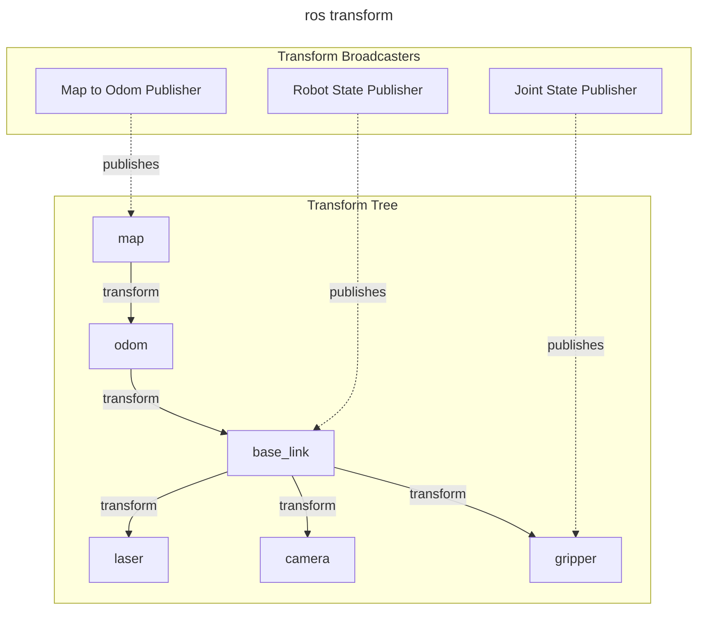

```mermaid
---
title: ros transform 
---
graph TD
    subgraph "Transform Tree"
        W[map] -->|transform| O[odom]
        O -->|transform| B[base_link]
        B -->|transform| L[laser]
        B -->|transform| C[camera]
        B -->|transform| G[gripper]
    end
    
    subgraph "Transform Broadcasters"
        TB1[Map to Odom Publisher]
        TB2[Robot State Publisher]
        TB3[Joint State Publisher]
    end
    
    TB1 -.->|publishes| W
    TB2 -.->|publishes| B
    TB3 -.->|publishes| G

```
