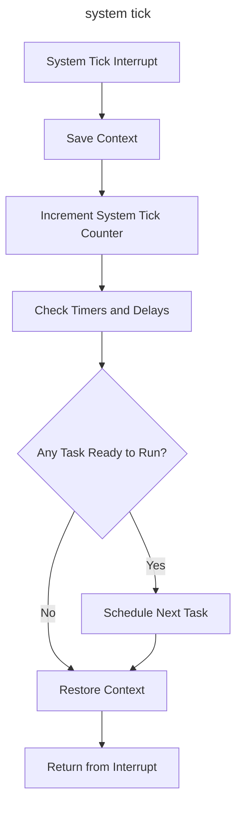

```mermaid
---
title: system tick
---
graph TD
    A[System Tick Interrupt] --> B[Save Context]
    B --> C[Increment System Tick Counter]
    C --> D[Check Timers and Delays]
    D --> E{Any Task Ready to Run?}
    E -- Yes --> F[Schedule Next Task]
    E -- No --> G[Restore Context]
    F --> G
    G --> H[Return from Interrupt]

```
